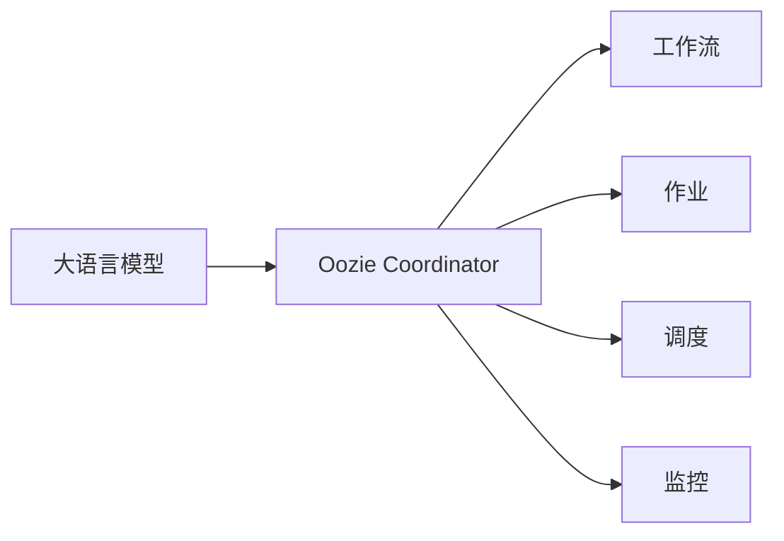

# Oozie Coordinator原理与代码实例讲解

作者：禅与计算机程序设计艺术 / Zen and the Art of Computer Programming


## 1. 背景介绍
### 1.1 问题的由来

在分布式系统中，特别是大数据领域，对工作流的自动化管理需求日益增长。例如，在数据仓库、机器学习、数据集成等场景中，需要将多个任务按照一定的顺序和依赖关系组合成一个工作流，并自动化地执行和管理这些任务。Oozie Coordinator应运而生，成为Apache Hadoop生态系统中的一个重要组件，用于定义、调度和监控Hadoop作业和工作流。

### 1.2 研究现状

Oozie Coordinator是一个强大的工作流调度系统，它允许用户定义复杂的工作流，包括MapReduce、Spark、Flink、Hive、Pig等Hadoop作业。Oozie Coordinator支持多种工作流语言，如XML、Oozie Workflow XML（OWZX）、Oozie Workflow Action Language（OWL）等，方便用户根据需求选择合适的工作流定义方式。

### 1.3 研究意义

Oozie Coordinator的研究意义在于：
- **自动化工作流管理**：Oozie Coordinator能够自动化地定义、调度和监控工作流，简化了工作流的部署和管理过程。
- **提高资源利用率**：通过工作流调度，Oozie Coordinator能够合理分配资源，提高资源利用率。
- **提高数据处理效率**：Oozie Coordinator能够优化工作流的执行顺序，提高数据处理效率。

### 1.4 本文结构

本文将分为以下几个部分：
- 第2部分，介绍Oozie Coordinator的核心概念和联系。
- 第3部分，详细阐述Oozie Coordinator的原理和具体操作步骤。
- 第4部分，分析Oozie Coordinator的优缺点及其应用领域。
- 第5部分，给出Oozie Coordinator的代码实例和详细解释。
- 第6部分，探讨Oozie Coordinator在实际应用中的场景和案例。
- 第7部分，推荐Oozie Coordinator相关的学习资源、开发工具和参考文献。
- 第8部分，总结Oozie Coordinator的发展趋势与挑战。
- 第9部分，提供常见问题与解答。

## 2. 核心概念与联系

### 2.1 Oozie Coordinator

Oozie Coordinator是一个工作流调度系统，它允许用户定义、调度和监控Hadoop作业和工作流。Oozie Coordinator支持多种工作流语言，如XML、OWZX、OWL等，方便用户根据需求选择合适的工作流定义方式。

### 2.2 工作流

工作流是由一系列任务组成的序列，这些任务按照一定的顺序和依赖关系执行。Oozie Coordinator支持多种任务类型，如MapReduce、Spark、Flink、Hive、Pig等Hadoop作业。

### 2.3 作业

作业是Oozie Coordinator的基本执行单元，它可以是单个Hadoop作业，也可以是一个复杂的工作流。

### 2.4 调度

调度是指Oozie Coordinator根据工作流定义和工作流管理策略，安排作业的执行顺序。

### 2.5 监控

监控是指Oozie Coordinator实时跟踪作业的执行状态，并在发生异常时进行相应的处理。

以下是大语言模型与Oozie Coordinator之间的逻辑关系：



## 3. 核心算法原理 & 具体操作步骤
### 3.1 算法原理概述

Oozie Coordinator的核心算法原理如下：

1. 用户通过Oozie Designer或XML语言定义工作流，并将其保存到HDFS。
2. Oozie Coordinator解析工作流定义，并创建作业实例。
3. Oozie Coordinator根据作业实例的依赖关系，确定作业的执行顺序。
4. Oozie Coordinator将作业分配给Hadoop集群执行。
5. Oozie Coordinator实时监控作业的执行状态，并在发生异常时进行处理。

### 3.2 算法步骤详解

Oozie Coordinator的算法步骤如下：

1. **解析工作流定义**：Oozie Coordinator首先解析工作流定义文件，提取作业信息、依赖关系、触发条件等。
2. **创建作业实例**：根据工作流定义，Oozie Coordinator创建作业实例，并记录作业实例的元数据。
3. **确定执行顺序**：Oozie Coordinator根据作业实例的依赖关系，确定作业的执行顺序。
4. **分配作业**：Oozie Coordinator将作业分配给Hadoop集群执行。
5. **监控执行状态**：Oozie Coordinator实时监控作业的执行状态，包括启动、运行、成功、失败等。
6. **处理异常**：当作业执行发生异常时，Oozie Coordinator会根据配置的策略进行处理，例如重试、失败等。

### 3.3 算法优缺点

Oozie Coordinator的优点如下：

- **支持多种工作流语言**：Oozie Coordinator支持多种工作流语言，方便用户选择合适的工作流定义方式。
- **支持多种Hadoop作业**：Oozie Coordinator支持多种Hadoop作业，包括MapReduce、Spark、Flink、Hive、Pig等。
- **易于扩展**：Oozie Coordinator易于扩展，可以方便地集成其他作业类型和调度策略。

Oozie Coordinator的缺点如下：

- **配置复杂**：Oozie Coordinator的配置相对复杂，需要熟悉其配置文件和API。
- **性能瓶颈**：Oozie Coordinator的性能可能成为其瓶颈，特别是在处理大量作业时。

### 3.4 算法应用领域

Oozie Coordinator的应用领域包括：

- **数据集成**：用于定义和调度数据集成工作流，例如ETL工作流。
- **数据仓库**：用于定义和调度数据仓库工作流，例如数据清洗、数据汇总等。
- **机器学习**：用于定义和调度机器学习工作流，例如模型训练、模型评估等。
- **其他Hadoop作业**：用于定义和调度其他Hadoop作业，例如Spark作业、Flink作业等。

## 4. 数学模型和公式 & 详细讲解 & 举例说明
### 4.1 数学模型构建

Oozie Coordinator的数学模型可以表示为一个有向无环图（DAG），其中节点代表作业，边代表作业之间的依赖关系。

### 4.2 公式推导过程

假设工作流包含n个作业，分别记为 $T_1, T_2, \ldots, T_n$。作业 $T_i$ 的依赖作业集合为 $D_i$，即 $D_i = \{T_j | T_j \rightarrow T_i\}$，其中 $T_j \rightarrow T_i$ 表示作业 $T_j$ 是作业 $T_i$ 的前置作业。

则作业 $T_i$ 的执行顺序可以表示为：

$$
T_i \text{ 的执行顺序} = D_i \cap D_{D_i} \cap \ldots \cap D_{D_{D_i}} \cap T_i
$$

其中 $D_{D_i}$ 表示作业 $D_i$ 的依赖作业集合，以此类推。

### 4.3 案例分析与讲解

以下是一个简单的Oozie工作流示例：

```xml
<workflow-app xmlns="uri:oozie:workflow:0.2">
    <start to="etl" />
    <action name="etl">
        <hadoop-job name="etl" path="/path/to/etl" />
    </action>
    <action name="load" trigger="etl">
        <hadoop-job name="load" path="/path/to/load" />
    </action>
    <end to="success" />
</workflow-app>
```

在这个示例中，工作流包含三个作业：etl、load和success。作业etl和load之间存在依赖关系，即load在etl完成后执行。

### 4.4 常见问题解答

**Q1：Oozie Coordinator是否支持并行作业？**

A：是的，Oozie Coordinator支持并行作业。用户可以通过在工作流定义中添加多个action标签来实现并行作业。

**Q2：如何处理作业失败的情况？**

A：Oozie Coordinator可以配置失败策略，例如重试、失败等。用户可以在Oozie Coordinator的配置文件中设置失败策略。

**Q3：如何监控作业执行状态？**

A：Oozie Coordinator提供Web界面和API供用户监控作业执行状态。

## 5. 项目实践：代码实例和详细解释说明
### 5.1 开发环境搭建

以下是使用Apache Oozie搭建开发环境的基本步骤：

1. 下载Apache Oozie源码：从Apache Oozie官网下载最新版本的Oozie源码。
2. 解压源码：将下载的源码解压到本地目录。
3. 编译源码：在源码根目录下执行`mvn install`命令编译源码。
4. 配置Oozie：根据Oozie的官方文档配置Oozie环境。

### 5.2 源代码详细实现

以下是一个简单的Oozie工作流示例：

```xml
<workflow-app xmlns="uri:oozie:workflow:0.2">
    <start to="etl" />
    <action name="etl">
        <hadoop-job name="etl" path="/path/to/etl" />
    </action>
    <action name="load" trigger="etl">
        <hadoop-job name="load" path="/path/to/load" />
    </action>
    <end to="success" />
</workflow-app>
```

在这个示例中，工作流包含三个作业：etl、load和success。作业etl和load之间存在依赖关系，即load在etl完成后执行。

### 5.3 代码解读与分析

在这个示例中，`<workflow-app>`标签定义了整个工作流，`<start>`标签定义了工作流的起始节点，`<action>`标签定义了工作流中的单个作业，`<end>`标签定义了工作流的结束节点。

`<hadoop-job>`标签定义了Hadoop作业，其中`name`属性定义了作业的名称，`path`属性定义了作业的路径。

### 5.4 运行结果展示

假设Oozie环境配置正确，将工作流定义文件上传到Oozie的存放目录，并启动Oozie协调器。在Oozie的Web界面中，可以查看工作流的执行状态和结果。

## 6. 实际应用场景
### 6.1 数据集成

在数据集成场景中，Oozie Coordinator可以用于定义和调度ETL工作流，将数据从源头系统抽取、转换和加载到目标系统。

### 6.2 数据仓库

在数据仓库场景中，Oozie Coordinator可以用于定义和调度数据仓库工作流，包括数据清洗、数据汇总、数据加载等任务。

### 6.3 机器学习

在机器学习场景中，Oozie Coordinator可以用于定义和调度机器学习工作流，包括数据预处理、模型训练、模型评估等任务。

### 6.4 未来应用展望

随着大数据技术的不断发展，Oozie Coordinator的应用场景将会不断扩展。例如，在物联网、人工智能等领域，Oozie Coordinator可以用于定义和调度复杂的工作流，实现数据的采集、处理、分析和应用。

## 7. 工具和资源推荐
### 7.1 学习资源推荐

以下是一些关于Oozie Coordinator的学习资源：

- Apache Oozie官方文档
- Oozie教程
- Oozie社区论坛
- Oozie相关博客

### 7.2 开发工具推荐

以下是一些关于Oozie Coordinator的开发工具：

- Oozie Designer：Oozie的图形化工作流设计工具。
- Oozie CLI：Oozie的命令行接口。
- Oozie API：Oozie的Java API。

### 7.3 相关论文推荐

以下是一些关于Oozie Coordinator的相关论文：

- Oozie: An extensible and scalable workflow engine for Hadoop
- Oozie Best Practices
- Oozie for Data Integration

### 7.4 其他资源推荐

以下是一些关于Oozie Coordinator的其他资源：

- Apache Oozie GitHub仓库
- Oozie邮件列表
- Oozie Wiki

## 8. 总结：未来发展趋势与挑战
### 8.1 研究成果总结

本文对Oozie Coordinator的原理和应用进行了详细介绍，并通过代码实例展示了如何使用Oozie Coordinator定义和调度工作流。

### 8.2 未来发展趋势

随着大数据技术的不断发展，Oozie Coordinator将会在以下方面取得进展：

- 支持更多的Hadoop作业类型。
- 提高Oozie Coordinator的性能和可扩展性。
- 集成更多的大数据技术，如Spark、Flink、Kafka等。
- 提供更丰富的可视化界面。

### 8.3 面临的挑战

Oozie Coordinator在未来的发展中面临着以下挑战：

- 性能瓶颈：随着Hadoop作业类型的增多和工作流规模的扩大，Oozie Coordinator的性能可能会成为其瓶颈。
- 可扩展性：Oozie Coordinator的可扩展性需要进一步提升，以满足大规模集群的需求。
- 生态整合：Oozie Coordinator需要与其他大数据技术更好地整合，提供更加完整的解决方案。

### 8.4 研究展望

为了应对未来的挑战，Oozie Coordinator需要在以下方面进行研究和改进：

- 优化算法：研究更高效的调度算法，提高Oozie Coordinator的性能和可扩展性。
- 生态整合：与其他大数据技术进行更好的整合，提供更加完整的解决方案。
- 开源社区：加强开源社区的建设，吸引更多开发者参与到Oozie Coordinator的开发和优化中。

## 9. 附录：常见问题与解答

**Q1：Oozie Coordinator与其他工作流调度工具相比有哪些优势？**

A：Oozie Coordinator与其他工作流调度工具相比，具有以下优势：

- 支持多种Hadoop作业类型。
- 支持多种工作流语言。
- 丰富的可视化界面。
- 可扩展性强。

**Q2：如何解决Oozie Coordinator的性能瓶颈？**

A：为了解决Oozie Coordinator的性能瓶颈，可以采取以下措施：

- 优化算法：研究更高效的调度算法，提高Oozie Coordinator的性能和可扩展性。
- 资源优化：使用更高效的资源管理策略，提高资源利用率。
- 生态整合：与其他大数据技术进行更好的整合，提高系统的整体性能。

**Q3：如何使用Oozie Coordinator进行任务监控？**

A：Oozie Coordinator提供了Web界面和API供用户监控作业执行状态。用户可以登录Oozie Web界面，查看作业的执行详情和监控图表。

**Q4：Oozie Coordinator支持哪些Hadoop作业类型？**

A：Oozie Coordinator支持以下Hadoop作业类型：

- Hadoop MapReduce作业
- Hadoop YARN作业
- Hadoop Spark作业
- Hadoop Flink作业
- Hadoop Hive作业
- Hadoop Pig作业
- Hadoop Sqoop作业
- Hadoop Fs作业

**Q5：如何将Oozie工作流与其他大数据技术整合？**

A：将Oozie工作流与其他大数据技术整合，可以通过以下方式：

- 使用Oozie的API：Oozie提供了Java API，可以方便地将Oozie工作流与其他大数据技术整合。
- 使用Oozie的扩展插件：Oozie提供了扩展插件机制，可以方便地将新的作业类型和触发器集成到Oozie中。
- 使用Oozie的集成框架：Oozie提供了集成框架，可以将Oozie工作流与其他大数据技术进行整合。

作者：禅与计算机程序设计艺术 / Zen and the Art of Computer Programming