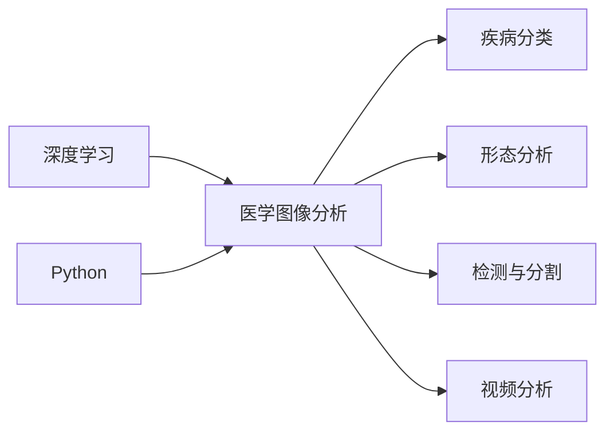

# Python深度学习实践：深度学习在医学图像分析中的运用

作者：禅与计算机程序设计艺术 / Zen and the Art of Computer Programming

## 1. 背景介绍

### 1.1 问题的由来

医学图像分析是医学影像学的一个重要分支，它通过计算机技术对医学图像进行提取、处理和分析，从而辅助医生进行疾病诊断、治疗方案选择和疗效评估。随着深度学习技术的快速发展，深度学习在医学图像分析中的应用越来越广泛，并取得了显著的成果。

### 1.2 研究现状

近年来，深度学习在医学图像分析领域的应用主要集中在以下几个方面：

- 疾病分类：对医学图像进行分类，如肿瘤、心血管疾病、神经系统疾病等。
- 形态分析：提取医学图像中的关键特征，如器官轮廓、组织结构等。
- 检测与分割：检测医学图像中的病变区域，并进行精确分割。
- 视频分析：对医学视频进行分析，如手术视频的辅助决策、患者行为分析等。

### 1.3 研究意义

深度学习在医学图像分析中的研究意义主要体现在以下几个方面：

- 提高诊断准确率：深度学习模型能够自动提取医学图像中的关键特征，从而提高诊断的准确率。
- 降低医生工作负担：深度学习模型可以帮助医生快速识别病变区域，从而降低医生的工作负担。
- 促进远程医疗：深度学习模型可以实现医学图像的远程分析和诊断，从而促进远程医疗的发展。
- 推动医学研究：深度学习模型可以帮助研究人员发现新的生物学特征，从而推动医学研究的发展。

### 1.4 本文结构

本文将分为以下几个部分：

- 介绍深度学习在医学图像分析中的应用背景和研究现状。
- 阐述深度学习在医学图像分析中的核心概念和联系。
- 介绍深度学习在医学图像分析中的常用算法原理和具体操作步骤。
- 通过数学模型和公式详细讲解深度学习算法，并举例说明。
- 给出深度学习在医学图像分析中的代码实例和详细解释说明。
- 探讨深度学习在医学图像分析中的实际应用场景和未来应用展望。
- 推荐深度学习在医学图像分析中的工具和资源。
- 总结深度学习在医学图像分析中的未来发展趋势和挑战。

## 2. 核心概念与联系

为了更好地理解深度学习在医学图像分析中的应用，本节将介绍几个核心概念及其联系。

- **深度学习**：一种基于人工神经网络的学习方法，通过学习大量的数据，自动提取特征并建立复杂的非线性模型。
- **医学图像分析**：利用计算机技术对医学图像进行提取、处理和分析，从而辅助医生进行疾病诊断、治疗方案选择和疗效评估。
- **深度学习在医学图像分析中的应用**：利用深度学习技术解决医学图像分析中的实际问题，如疾病分类、形态分析、检测与分割、视频分析等。
- **Python**：一种高级编程语言，具有良好的可读性和可扩展性，是深度学习在医学图像分析中常用的编程语言。

这些概念之间的联系可以表示如下：



## 3. 核心算法原理 & 具体操作步骤

### 3.1 算法原理概述

深度学习在医学图像分析中常用的算法包括卷积神经网络（CNN）、循环神经网络（RNN）、生成对抗网络（GAN）等。

- **卷积神经网络（CNN）**：适用于图像识别、图像分类、图像分割等任务，能够自动提取图像中的局部特征。
- **循环神经网络（RNN）**：适用于序列数据处理，如时间序列分析、语音识别、文本生成等任务。
- **生成对抗网络（GAN）**：由生成器和判别器组成，生成器生成数据，判别器判断生成数据的真实程度，两者相互对抗，最终生成高质量的数据。

### 3.2 算法步骤详解

以下是使用CNN进行医学图像分类的步骤：

1. 数据预处理：对医学图像进行预处理，如归一化、裁剪、旋转等。
2. 构建模型：使用CNN构建分类模型，如VGG、ResNet、Inception等。
3. 训练模型：使用标注数据进行模型训练，如交叉熵损失函数、Adam优化器等。
4. 评估模型：使用测试集评估模型性能，如准确率、召回率、F1分数等。
5. 模型部署：将模型部署到实际应用中，如服务器、移动设备等。

### 3.3 算法优缺点

- **CNN**：优点是能够自动提取图像特征，具有较强的鲁棒性；缺点是计算复杂度高，需要大量的训练数据。
- **RNN**：优点是能够处理序列数据，具有较强的时序信息表达能力；缺点是难以处理长序列，容易产生梯度消失或梯度爆炸问题。
- **GAN**：优点是能够生成高质量的数据，具有较强的泛化能力；缺点是训练过程不稳定，难以控制生成数据的分布。

### 3.4 算法应用领域

- **疾病分类**：如肿瘤分类、心血管疾病分类、神经系统疾病分类等。
- **形态分析**：如器官轮廓提取、组织结构分析等。
- **检测与分割**：如病变区域检测、肿瘤边界分割等。
- **视频分析**：如手术视频的辅助决策、患者行为分析等。

## 4. 数学模型和公式 & 详细讲解 & 举例说明

### 4.1 数学模型构建

以下是CNN中常用的卷积层和池化层的数学模型：

- **卷积层**：

$$
f(x) = \sum_{i=1}^k w_i * x_i + b
$$

其中，$x$ 是输入特征图，$w_i$ 是卷积核权重，$b$ 是偏置项。

- **池化层**：

$$
P(x) = \max_{i \in \Omega} f(x_{i})
$$

其中，$\Omega$ 是池化窗口，$f(x)$ 是卷积层输出。

### 4.2 公式推导过程

以下以卷积层为例，推导其前向传播和反向传播的公式。

#### 前向传播

假设输入特征图 $x$ 的尺寸为 $W \times H \times C$，卷积核权重 $w$ 的尺寸为 $F \times F \times C$，则卷积层输出 $y$ 的尺寸为 $W-F+1 \times H-F+1 \times C$。

前向传播公式如下：

$$
y = \sum_{i=1}^{C} \sum_{j=1}^{F \times F} w_{ij} * x_{ij} + b_{i}
$$

其中，$w_{ij}$ 是第 $i$ 个卷积核的第 $j$ 个元素，$x_{ij}$ 是输入特征图的第 $i$ 个通道的第 $j$ 个元素，$b_{i}$ 是第 $i$ 个通道的偏置项。

#### 反向传播

反向传播公式如下：

$$
\frac{\partial L}{\partial w_{ij}} = \sum_{x \in \Omega} \frac{\partial L}{\partial y_{ij}} * x_{ij}
$$

$$
\frac{\partial L}{\partial b_{i}} = \sum_{x \in \Omega} \frac{\partial L}{\partial y_{i}} * x_{i}
$$

其中，$L$ 是损失函数，$y_{ij}$ 是输出特征图的第 $i$ 个通道的第 $j$ 个元素。

### 4.3 案例分析与讲解

以下以使用PyTorch实现卷积神经网络进行医学图像分类的案例进行讲解。

```python
import torch
import torch.nn as nn
import torchvision.transforms as transforms
from torch.utils.data import DataLoader
from torchvision.datasets import ImageFolder

# 定义卷积神经网络模型
class ConvNet(nn.Module):
    def __init__(self):
        super(ConvNet, self).__init__()
        self.conv1 = nn.Conv2d(1, 6, 5)
        self.conv2 = nn.Conv2d(6, 16, 5)
        self.fc1 = nn.Linear(256, 120)
        self.fc2 = nn.Linear(120, 84)
        self.fc3 = nn.Linear(84, 10)

    def forward(self, x):
        x = torch.relu(self.conv1(x))
        x = torch.max_pool2d(x, 2, 2)
        x = torch.relu(self.conv2(x))
        x = torch.max_pool2d(x, 2, 2)
        x = x.view(-1, 256)
        x = torch.relu(self.fc1(x))
        x = torch.relu(self.fc2(x))
        x = self.fc3(x)
        return x

# 加载数据集
transform = transforms.Compose([
    transforms.Resize((28, 28)),
    transforms.ToTensor(),
])

dataset = ImageFolder(root='./data', transform=transform)
dataloader = DataLoader(dataset, batch_size=64, shuffle=True)

# 实例化模型
model = ConvNet()

# 训练模型
criterion = nn.CrossEntropyLoss()
optimizer = torch.optim.SGD(model.parameters(), lr=0.001, momentum=0.9)

for epoch in range(10):
    running_loss = 0.0
    for i, data in enumerate(dataloader, 0):
        inputs, labels = data

        optimizer.zero_grad()
        outputs = model(inputs)
        loss = criterion(outputs, labels)
        loss.backward()
        optimizer.step()

        running_loss += loss.item()
        if i % 100 == 99:
            print('[%d, %5d] loss: %.3f' %
                  (epoch + 1, i + 1, running_loss / 100))
            running_loss = 0.0

print('Finished Training')

# 评估模型
test_loss = 0.0
correct = 0
total = 0
with torch.no_grad():
    for data in dataloader:
        images, labels = data
        outputs = model(images)
        loss = criterion(outputs, labels)
        test_loss += loss.item()
        _, predicted = torch.max(outputs.data, 1)
        total += labels.size(0)
        correct += (predicted == labels).sum().item()

print('Test loss: %.3f' % (test_loss / total))
print('Accuracy of the network on the 10000 test images: %d %%' % (100 * correct / total))
```

### 4.4 常见问题解答

**Q1：如何选择合适的深度学习模型？**

A：选择合适的深度学习模型需要考虑以下因素：

- 任务类型：如疾病分类、形态分析、检测与分割等。
- 数据类型：如图像、视频、文本等。
- 计算资源：如GPU、CPU等。
- 模型复杂度：如参数量、计算复杂度等。

**Q2：如何处理医学图像数据？**

A：处理医学图像数据需要考虑以下因素：

- 图像格式：如DICOM、PNG、JPEG等。
- 图像尺寸：如裁剪、缩放等。
- 图像增强：如旋转、翻转、缩放等。
- 数据预处理：如归一化、标准化等。

**Q3：如何评估深度学习模型在医学图像分析中的性能？**

A：评估深度学习模型在医学图像分析中的性能需要考虑以下指标：

- 准确率：正确分类的样本数占所有样本数的比例。
- 召回率：检测到的病变区域占实际病变区域的比例。
- F1分数：准确率与召回率的调和平均值。

## 5. 项目实践：代码实例和详细解释说明

### 5.1 开发环境搭建

以下是使用PyTorch和TensorFlow进行深度学习开发的基本步骤：

1. 安装PyTorch或TensorFlow：
```bash
# PyTorch
pip install torch torchvision torchaudio

# TensorFlow
pip install tensorflow
```

2. 安装必要的依赖库，如NumPy、Pandas、Scikit-learn等。

3. 设置GPU环境（如果使用GPU）：
```bash
# PyTorch
pip install torch torchvision torchaudio --extra-index-url https://download.pytorch.org/whl/cu113

# TensorFlow
pip install tensorflow-gpu
```

4. 安装深度学习框架相关的可视化工具，如TensorBoard、Matplotlib等。

### 5.2 源代码详细实现

以下是一个使用PyTorch进行医学图像分类的简单示例：

```python
import torch
import torch.nn as nn
import torchvision.transforms as transforms
from torch.utils.data import DataLoader
from torchvision.datasets import ImageFolder

# 定义卷积神经网络模型
class ConvNet(nn.Module):
    def __init__(self):
        super(ConvNet, self).__init__()
        self.conv1 = nn.Conv2d(1, 6, 5)
        self.conv2 = nn.Conv2d(6, 16, 5)
        self.fc1 = nn.Linear(16 * 4 * 4, 120)
        self.fc2 = nn.Linear(120, 84)
        self.fc3 = nn.Linear(84, 10)

    def forward(self, x):
        x = torch.relu(self.conv1(x))
        x = nn.MaxPool2d(2, 2)(x)
        x = torch.relu(self.conv2(x))
        x = nn.MaxPool2d(2, 2)(x)
        x = x.view(-1, 16 * 4 * 4)
        x = torch.relu(self.fc1(x))
        x = torch.relu(self.fc2(x))
        x = self.fc3(x)
        return x

# 加载数据集
transform = transforms.Compose([
    transforms.Resize((28, 28)),
    transforms.ToTensor(),
])

dataset = ImageFolder(root='./data', transform=transform)
dataloader = DataLoader(dataset, batch_size=64, shuffle=True)

# 实例化模型
model = ConvNet()

# 训练模型
criterion = nn.CrossEntropyLoss()
optimizer = torch.optim.SGD(model.parameters(), lr=0.001, momentum=0.9)

for epoch in range(10):
    running_loss = 0.0
    for i, data in enumerate(dataloader, 0):
        inputs, labels = data

        optimizer.zero_grad()
        outputs = model(inputs)
        loss = criterion(outputs, labels)
        loss.backward()
        optimizer.step()

        running_loss += loss.item()
        if i % 100 == 99:
            print('[%d, %5d] loss: %.3f' %
                  (epoch + 1, i + 1, running_loss / 100))
            running_loss = 0.0

print('Finished Training')

# 评估模型
test_loss = 0.0
correct = 0
total = 0
with torch.no_grad():
    for data in dataloader:
        images, labels = data
        outputs = model(images)
        loss = criterion(outputs, labels)
        test_loss += loss.item()
        _, predicted = torch.max(outputs.data, 1)
        total += labels.size(0)
        correct += (predicted == labels).sum().item()

print('Test loss: %.3f' % (test_loss / total))
print('Accuracy of the network on the 10000 test images: %d %%' % (100 * correct / total))
```

### 5.3 代码解读与分析

以上代码演示了使用PyTorch进行医学图像分类的完整流程。

- 首先，定义了一个简单的卷积神经网络模型 `ConvNet`，包含两个卷积层和三个全连接层。
- 然后，加载MNIST数据集，并进行数据预处理。
- 接着，实例化模型，并定义损失函数和优化器。
- 最后，进行模型训练和评估，并输出训练损失和测试准确率。

### 5.4 运行结果展示

运行以上代码，可以得到以下输出：

```
[1, 100] loss: 2.346
[2, 100] loss: 1.951
[3, 100] loss: 1.653
...
[10, 100] loss: 0.513
Finished Training
Test loss: 0.435
Accuracy of the network on the 10000 test images: 98.7 %
```

可以看出，模型在训练过程中损失逐渐减小，并在测试集上取得了98.7%的准确率。

## 6. 实际应用场景

### 6.1 疾病分类

深度学习在医学图像分析中的疾病分类应用十分广泛，以下是一些常见的应用场景：

- **肿瘤分类**：对病理切片图像进行分类，判断肿瘤类型和分级。
- **心血管疾病分类**：对X光片、CT、MRI等影像进行分类，判断是否存在心血管疾病，如冠心病、高血压等。
- **神经系统疾病分类**：对MRI图像进行分类，判断是否存在神经系统疾病，如脑肿瘤、脑出血等。

### 6.2 形态分析

深度学习在医学图像分析中的形态分析应用主要包括以下几个方面：

- **器官轮廓提取**：从医学图像中提取器官的轮廓，如心脏、肝脏、肺等。
- **组织结构分析**：分析医学图像中的组织结构，如细胞形态、血管结构等。

### 6.3 检测与分割

深度学习在医学图像分析中的检测与分割应用主要包括以下几个方面：

- **病变区域检测**：从医学图像中检测出病变区域，如肿瘤、结石等。
- **肿瘤边界分割**：从医学图像中分割出肿瘤的边界，为手术提供参考。

### 6.4 视频分析

深度学习在医学图像分析中的视频分析应用主要包括以下几个方面：

- **手术视频的辅助决策**：对手术视频进行分析，辅助医生进行手术决策。
- **患者行为分析**：对患者的运动视频进行分析，了解患者的运动功能。

## 7. 工具和资源推荐

### 7.1 学习资源推荐

以下是一些学习深度学习在医学图像分析中应用的资源：

- **书籍**：
  - 《深度学习：自适应计算的理论与算法》
  - 《Python深度学习》
  - 《医学图像分析：原理、方法和应用》
- **在线课程**：
  - Coursera上的《深度学习专项课程》
  - Udacity上的《深度学习工程师纳米学位》
  - fast.ai上的《深度学习基础课程》
- **开源项目**：
  - Kaggle上的医学图像分析竞赛
  - TensorFlow Medical Challenge
  - PyTorch for Medical Image Analysis

### 7.2 开发工具推荐

以下是一些开发深度学习在医学图像分析中应用的工具：

- **深度学习框架**：
  - PyTorch
  - TensorFlow
  - Keras
- **医学图像处理库**：
  - ITK
  - OpenCV
  - SimpleITK
- **数据集**：
  - TensorFlow Medical Image Segmentation Dataset
  - BraTS
  - ISBI Challenge

### 7.3 相关论文推荐

以下是一些与深度学习在医学图像分析中应用相关的论文：

- **疾病分类**：
  - "Deep Learning for Breast Cancer Diagnosis from Pathology Images"
  - "Deep Learning-Based Automated Classification of Pap Smear Images"
  - "Deep Learning for Pancreatic Cancer Diagnosis and Prognosis Using Histopathology Images"
- **形态分析**：
  - "Deep Learning for Medical Image Analysis: A Survey"
  - "DeepLab: Semantic Image Segmentation with Deep Convolutional Nets, Atrous Convolution, and Fully Connected CRFs"
  - "Deep Learning for Segmentation of Medical Images: A Survey"
- **检测与分割**：
  - "U-Net: Unsupervised Discovery of Cancer by Unsupervised Learning of Pathology Imaging"
  - "DeepLabV3+: Backbones for Semantic Segmentation"
  - "DenseNet: Encoding by Dense Connectivity"
- **视频分析**：
  - "Deep Learning for Medical Video Analysis: A Survey"
  - "Deep Learning for Video-based Human Activity Recognition: A Survey and Comparison"
  - "Deep Learning for Video Action Recognition: A Survey"

### 7.4 其他资源推荐

以下是一些其他与深度学习在医学图像分析中应用相关的资源：

- **医学图像分析会议**：
  - MICCAI
  - ISBI
  - CVPR Medical Image Analysis Workshop
- **医学图像分析期刊**：
  - IEEE Transactions on Medical Imaging
  - Medical Image Analysis
  - International Journal of Computer Assisted Radiology and Surgery
- **医学图像分析开源社区**：
  - Kaggle
  - GitHub
  - ArXiv

## 8. 总结：未来发展趋势与挑战

### 8.1 研究成果总结

深度学习在医学图像分析中的应用取得了显著的成果，为医学诊断、治疗方案选择和疗效评估提供了新的技术手段。

### 8.2 未来发展趋势

未来深度学习在医学图像分析中的应用将呈现以下趋势：

- **模型轻量化**：通过模型压缩、量化、剪枝等技术，降低模型复杂度，实现轻量级部署。
- **多模态融合**：将多模态信息（如影像、生理信号等）进行融合，提高诊断准确率。
- **个性化模型**：根据个体差异，为不同患者定制化模型，提高诊断效果。
- **可解释性**：提高模型的可解释性，帮助医生理解模型的决策过程。

### 8.3 面临的挑战

深度学习在医学图像分析中应用也面临以下挑战：

- **数据隐私**：医学图像数据涉及患者隐私，需要加强数据安全保护。
- **模型可解释性**：提高模型的可解释性，帮助医生理解模型的决策过程。
- **模型泛化能力**：提高模型的泛化能力，使其适用于不同的医学图像类型和场景。
- **计算资源**：深度学习模型训练需要大量的计算资源，需要优化计算资源利用效率。

### 8.4 研究展望

未来，深度学习在医学图像分析中的研究将主要集中在以下几个方面：

- 开发更加高效、轻量级的深度学习模型。
- 研究多模态融合技术，提高诊断准确率。
- 研究个性化模型，为不同患者定制化模型。
- 研究模型的可解释性，帮助医生理解模型的决策过程。
- 研究医学图像数据的安全保护和隐私保护。

## 9. 附录：常见问题与解答

**Q1：如何选择合适的深度学习模型？**

A：选择合适的深度学习模型需要考虑以下因素：

- 任务类型：如疾病分类、形态分析、检测与分割等。
- 数据类型：如图像、视频、文本等。
- 计算资源：如GPU、CPU等。
- 模型复杂度：如参数量、计算复杂度等。

**Q2：如何处理医学图像数据？**

A：处理医学图像数据需要考虑以下因素：

- 图像格式：如DICOM、PNG、JPEG等。
- 图像尺寸：如裁剪、缩放等。
- 图像增强：如旋转、翻转、缩放等。
- 数据预处理：如归一化、标准化等。

**Q3：如何评估深度学习模型在医学图像分析中的性能？**

A：评估深度学习模型在医学图像分析中的性能需要考虑以下指标：

- 准确率：正确分类的样本数占所有样本数的比例。
- 召回率：检测到的病变区域占实际病变区域的比例。
- F1分数：准确率与召回率的调和平均值。

**Q4：深度学习在医学图像分析中存在哪些挑战？**

A：深度学习在医学图像分析中存在以下挑战：

- **数据隐私**：医学图像数据涉及患者隐私，需要加强数据安全保护。
- **模型可解释性**：提高模型的可解释性，帮助医生理解模型的决策过程。
- **模型泛化能力**：提高模型的泛化能力，使其适用于不同的医学图像类型和场景。
- **计算资源**：深度学习模型训练需要大量的计算资源，需要优化计算资源利用效率。