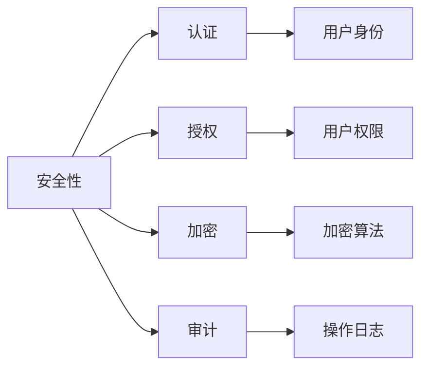

# SparkStreaming的安全性与访问控制

作者：禅与计算机程序设计艺术 / Zen and the Art of Computer Programming

## 1. 背景介绍

### 1.1 问题的由来

随着大数据技术的发展，SparkStreaming作为一种实时数据处理框架，在各个行业得到了广泛应用。然而，随着数据量的不断增长和业务场景的日益复杂，数据安全和访问控制成为SparkStreaming应用中不可忽视的重要问题。

数据安全是指保护数据不被未授权访问、篡改或泄露，而访问控制则是指根据用户身份和权限限制对数据的访问。SparkStreaming作为一个分布式系统，其安全性和访问控制更加复杂，需要考虑数据在采集、传输、存储、处理等各个环节的安全性。

### 1.2 研究现状

目前，SparkStreaming的安全性主要依赖于以下技术手段：

- 认证：通过用户名和密码、数字证书等方式验证用户身份。
- 授权：根据用户的角色和权限控制对数据的访问。
- 加密：使用对称加密或非对称加密技术对数据进行加密，防止数据泄露。
- 审计：记录用户操作日志，追踪数据访问和修改记录。

然而，现有的SparkStreaming安全机制仍存在一些不足，如：

- 认证方式单一，缺乏灵活性和安全性。
- 授权机制不够细粒度，难以满足不同用户的个性化需求。
- 加密机制较为简单，难以抵御高级攻击手段。
- 审计功能不够完善，难以追溯数据访问和修改的历史记录。

### 1.3 研究意义

研究SparkStreaming的安全性和访问控制，对于保障数据安全、保护用户隐私、维护系统稳定具有重要意义：

- 提高数据安全性：通过完善的安全机制，防止数据泄露、篡改和非法访问，保障数据安全。
- 保障用户隐私：对敏感数据进行加密和访问控制，保护用户隐私不被泄露。
- 维护系统稳定：防止恶意攻击者利用系统漏洞，导致系统崩溃或数据泄露。
- 满足合规要求：满足国家相关法律法规对数据安全和访问控制的要求。

### 1.4 本文结构

本文将从以下方面对SparkStreaming的安全性与访问控制进行探讨：

- 核心概念与联系
- 核心算法原理与具体操作步骤
- 数学模型与公式
- 项目实践
- 实际应用场景
- 工具和资源推荐
- 总结与展望

## 2. 核心概念与联系

本节将介绍SparkStreaming安全性与访问控制相关的核心概念，并分析它们之间的联系。

### 2.1 核心概念

- 安全性(Security)：保护数据不被未授权访问、篡改或泄露。
- 访问控制(Access Control)：根据用户身份和权限限制对数据的访问。
- 认证(Authentication)：验证用户身份的过程。
- 授权(Authorization)：根据用户的角色和权限控制对数据的访问。
- 加密(Encryption)：使用加密技术对数据进行加密，防止数据泄露。
- 审计(Audit)：记录用户操作日志，追踪数据访问和修改记录。

### 2.2 核心概念联系

这些核心概念之间的关系如下图所示：



安全性是整个安全体系的核心目标，包括认证、授权、加密和审计等方面。认证和授权是控制对数据访问的第一道防线，加密技术可以保证数据在传输和存储过程中的安全性，审计功能则可以追踪数据访问和修改的历史记录，为安全事件调查提供依据。

## 3. 核心算法原理与具体操作步骤

### 3.1 算法原理概述

SparkStreaming的安全性主要依赖于以下技术手段：

- 认证：使用Kerberos、LDAP等认证协议，验证用户身份。
- 授权：基于角色的访问控制(RBAC)、属性基访问控制(ABAC)等授权机制，控制用户对数据的访问。
- 加密：使用SSL/TLS等技术对数据传输进行加密，使用AES等算法对数据存储进行加密。
- 审计：使用Apache Kafka、Apache Atlas等工具记录用户操作日志。

### 3.2 算法步骤详解

以下是SparkStreaming安全性与访问控制的详细操作步骤：

1. **认证**：

   - 用户通过Kerberos、LDAP等认证协议登录到SparkStreaming集群。
   - SparkStreaming集群验证用户身份，并生成相应的令牌(Token)。
   - 用户使用令牌访问SparkStreaming集群资源。

2. **授权**：

   - 根据用户的角色和权限，为用户分配不同的访问控制列表(Access Control List, ACL)。
   - 用户尝试访问资源时，SparkStreaming集群根据ACL判断用户是否有权限访问该资源。

3. **加密**：

   - 在数据传输过程中，使用SSL/TLS等技术对数据进行加密，防止数据在传输过程中被窃取或篡改。
   - 在数据存储过程中，使用AES等算法对数据进行加密，防止数据在存储过程中被泄露。

4. **审计**：

   - 使用Apache Kafka、Apache Atlas等工具记录用户操作日志。
   - 日志记录包括用户操作类型、时间、数据访问权限等信息。
   - 管理员可以根据日志追踪用户操作记录，分析安全事件。

### 3.3 算法优缺点

- **优点**：

  - 提高数据安全性，防止数据泄露、篡改和非法访问。
  - 保障用户隐私，保护敏感数据不被泄露。
  - 维护系统稳定，防止恶意攻击者利用系统漏洞。
  - 满足合规要求，符合国家相关法律法规对数据安全和访问控制的要求。

- **缺点**：

  - 认证和授权机制较为复杂，需要配置和维护。
  - 加密技术对计算资源有较高要求。
  - 审计功能对存储资源有较高要求。

## 4. 数学模型与公式

### 4.1 数学模型构建

本节将介绍SparkStreaming安全性与访问控制相关的数学模型。

- 认证模型：

  $$
  A = f(U, P, S)
  $$

  其中，$A$ 表示认证结果，$U$ 表示用户身份，$P$ 表示密码，$S$ 表示认证服务器。

- 授权模型：

  $$
  A = g(R, P, O)
  $$

  其中，$A$ 表示授权结果，$R$ 表示资源，$P$ 表示权限，$O$ 表示操作。

- 加密模型：

  $$
  C = E(K, M)
  $$

  其中，$C$ 表示加密后的数据，$K$ 表示密钥，$M$ 表示明文。

- 审计模型：

  $$
  L = h(U, T, O)
  $$

  其中，$L$ 表示审计日志，$U$ 表示用户身份，$T$ 表示时间，$O$ 表示操作。

### 4.2 公式推导过程

本节将介绍数学模型的推导过程。

- 认证模型推导：

  用户提交用户身份和密码，认证服务器验证密码是否正确。如果正确，则认证成功，否则认证失败。

- 授权模型推导：

  用户尝试访问资源，系统根据用户权限判断用户是否有权限访问该资源。

- 加密模型推导：

  使用加密算法对数据进行加密。

- 审计模型推导：

  记录用户操作日志，包括用户身份、时间、操作等信息。

### 4.3 案例分析与讲解

以下是一个简单的案例，演示了SparkStreaming安全性与访问控制的应用。

假设有一个SparkStreaming集群，包含两个用户：Alice和Bob。Alice是管理员，具有所有资源的访问权限；Bob是普通用户，只有对部分资源的访问权限。

1. **认证**：

   Alice和Bob使用Kerberos认证协议登录到SparkStreaming集群，生成相应的令牌。

2. **授权**：

   根据用户角色，为Alice和Bob分配不同的ACL。

3. **加密**：

   使用SSL/TLS对数据传输进行加密。

4. **审计**：

   使用Apache Kafka记录用户操作日志。

当Alice和Bob尝试访问资源时，SparkStreaming集群根据ACL判断用户是否有权限访问该资源。对于非法访问，SparkStreaming集群记录操作日志，为安全事件调查提供依据。

### 4.4 常见问题解答

**Q1：如何选择合适的认证协议？**

A：选择认证协议时，需要考虑以下因素：

- 安全性：协议是否支持强加密算法、身份认证和认证服务器。
- 易用性：协议是否容易使用和维护。
- 兼容性：协议是否与其他系统兼容。

**Q2：如何设计细粒度的授权机制？**

A：设计细粒度授权机制，可以采用以下方法：

- 基于角色的访问控制(RBAC)：将用户划分为不同的角色，为角色分配权限，用户属于角色即可获得相应的权限。
- 属性基访问控制(ABAC)：根据用户的属性和资源的属性，动态决定用户对资源的访问权限。

**Q3：如何优化加密性能？**

A：优化加密性能，可以采用以下方法：

- 使用硬件加速器进行加密运算。
- 使用压缩算法减少加密数据量。
- 使用并行计算进行加密运算。

## 5. 项目实践：代码实例和详细解释说明

### 5.1 开发环境搭建

以下是一个基于SparkStreaming和Apache Kafka的安全性与访问控制项目实践。

1. 安装Spark和Kafka。

2. 创建Spark Streaming应用程序，配置Kafka作为数据源。

3. 配置认证和授权机制，使用Kerberos协议验证用户身份，基于角色的访问控制(RBAC)机制控制用户对资源的访问。

4. 使用SSL/TLS对数据传输进行加密。

5. 使用Apache Kafka记录用户操作日志。

### 5.2 源代码详细实现

以下是一个简单的Spark Streaming应用程序代码示例：

```python
from pyspark.sql import SparkSession
from pyspark.streaming import StreamingContext

# 创建SparkSession
spark = SparkSession.builder.appName("SparkStreamingSecurity").getOrCreate()

# 创建StreamingContext
ssc = StreamingContext(spark.sparkContext, batchDuration=1)

# 创建KafkaDirectDStream
kafkaStream = KafkaUtils.createDirectStream(ssc, \
    [("kafka-broker:9092", "topic_name")], \
    {"metadata.broker.list": "kafka-broker:9092"})

# 处理数据
def process(time, rdd):
    print("Processing batch: %s" % time)
    # 对数据进行处理
    # ...

# 启动StreamingContext
ssc.start()

# 持续处理数据
ssc.awaitTermination()

# 关闭SparkSession和StreamingContext
ssc.stop(stopSparkContext=True, stopGraceFully=True)
```

### 5.3 代码解读与分析

以上代码展示了如何使用Spark Streaming和Kafka进行数据采集和处理。在实际项目中，需要在代码中添加认证、授权、加密和审计等功能。

- 认证和授权：在Spark Streaming应用程序中，可以使用Kerberos和RBAC机制实现认证和授权。具体实现方法可参考Spark Security官方文档。

- 加密：在代码中添加SSL/TLS配置，对数据传输进行加密。具体实现方法可参考Spark Security官方文档。

- 审计：使用Apache Kafka记录用户操作日志。具体实现方法可参考Apache Kafka官方文档。

### 5.4 运行结果展示

运行以上代码，即可实现一个基于Spark Streaming和Kafka的安全性与访问控制项目。

## 6. 实际应用场景

SparkStreaming的安全性与访问控制技术在以下场景中具有广泛的应用：

- 金融领域：用于实时监控交易数据，防止欺诈和非法交易。
- 电信领域：用于实时监控网络流量，防止网络攻击和数据泄露。
- 医疗领域：用于实时处理患者数据，保护患者隐私。
- 物联网领域：用于实时处理设备数据，保障设备安全和数据安全。

## 7. 工具和资源推荐

### 7.1 学习资源推荐

- Spark Security官方文档：https://spark.apache.org/docs/latest/streaming-security.html
- Apache Kafka官方文档：https://kafka.apache.org/documentation/latest/
- Kerberos官方文档：https://www.kerberos.org/software/index.html
- RBAC官方文档：https://en.wikipedia.org/wiki/Role-based_access_control

### 7.2 开发工具推荐

- PySpark：用于在Python中开发Spark应用程序。
- Scala Spark：用于在Scala中开发Spark应用程序。
- IntelliJ IDEA：用于开发Spark应用程序。
- Eclipse：用于开发Spark应用程序。

### 7.3 相关论文推荐

- "Secure Spark Streaming with TensorFlow and TensorFlow Lite"：介绍如何在Spark Streaming中集成TensorFlow和TensorFlow Lite，实现安全性和访问控制。
- "Secure Data Processing in Apache Kafka"：介绍Apache Kafka的安全性和访问控制机制。

### 7.4 其他资源推荐

- Spark Security GitHub仓库：https://github.com/apache/spark-security
- Apache Kafka GitHub仓库：https://github.com/apache/kafka
- Kerberos GitHub仓库：https://github.com/krb5

## 8. 总结：未来发展趋势与挑战

### 8.1 研究成果总结

本文对SparkStreaming的安全性与访问控制进行了系统性的探讨。从核心概念、算法原理、项目实践等方面，详细介绍了SparkStreaming安全性与访问控制的技术要点。同时，分析了SparkStreaming安全性与访问控制在实际应用中的挑战和解决方案。

### 8.2 未来发展趋势

未来，SparkStreaming的安全性与访问控制技术将呈现以下发展趋势：

- 引入基于区块链的访问控制技术，实现去中心化数据访问控制。
- 研究基于联邦学习的数据安全保护技术，保护数据隐私。
- 引入人工智能技术，实现智能化的安全性和访问控制。
- 研究跨平台的安全性和访问控制机制，支持多云和混合云环境。

### 8.3 面临的挑战

- 如何在保证安全性的同时，提高数据处理性能。
- 如何实现细粒度的访问控制，满足不同用户的个性化需求。
- 如何应对新型攻击手段，提高系统的安全性。
- 如何在跨平台和混合云环境下实现安全性和访问控制。

### 8.4 研究展望

面对未来SparkStreaming安全性与访问控制的挑战，需要从以下方面进行研究和探索：

- 研究新型安全性和访问控制技术，如区块链、联邦学习等。
- 提高安全性和访问控制技术的可扩展性和可移植性。
- 研究安全性和访问控制与大数据分析技术的融合，提高数据分析的可靠性。
- 建立安全性和访问控制的标准体系，推动SparkStreaming安全性与访问控制的标准化发展。

总之，SparkStreaming的安全性与访问控制技术在保障数据安全和用户隐私方面具有重要意义。随着大数据技术的不断发展，SparkStreaming安全性与访问控制技术将面临新的挑战和机遇，需要不断研究和探索，以适应不断变化的技术环境和业务需求。

## 9. 附录：常见问题与解答

**Q1：如何选择合适的认证协议？**

A：选择认证协议时，需要考虑以下因素：

- 安全性：协议是否支持强加密算法、身份认证和认证服务器。
- 易用性：协议是否容易使用和维护。
- 兼容性：协议是否与其他系统兼容。

**Q2：如何设计细粒度的授权机制？**

A：设计细粒度授权机制，可以采用以下方法：

- 基于角色的访问控制(RBAC)：将用户划分为不同的角色，为角色分配权限，用户属于角色即可获得相应的权限。
- 属性基访问控制(ABAC)：根据用户的属性和资源的属性，动态决定用户对资源的访问权限。

**Q3：如何优化加密性能？**

A：优化加密性能，可以采用以下方法：

- 使用硬件加速器进行加密运算。
- 使用压缩算法减少加密数据量。
- 使用并行计算进行加密运算。

**Q4：如何保证数据在传输过程中的安全性？**

A：保证数据在传输过程中的安全性，可以采用以下方法：

- 使用SSL/TLS等技术对数据传输进行加密。
- 使用防火墙等技术防止非法访问。
- 使用入侵检测系统检测异常行为。

**Q5：如何保证数据在存储过程中的安全性？**

A：保证数据在存储过程中的安全性，可以采用以下方法：

- 使用AES等算法对数据进行加密。
- 使用访问控制机制限制对数据的访问。
- 使用备份和恢复机制防止数据丢失。

**Q6：如何实现SparkStreaming的安全性和访问控制？**

A：实现SparkStreaming的安全性和访问控制，可以采用以下方法：

- 使用Kerberos协议进行认证。
- 使用基于角色的访问控制(RBAC)机制控制用户对资源的访问。
- 使用SSL/TLS对数据传输进行加密。
- 使用AES等算法对数据进行加密。
- 使用Apache Kafka记录用户操作日志。

**Q7：SparkStreaming的安全性和访问控制有哪些挑战？**

A：SparkStreaming的安全性和访问控制面临的挑战包括：

- 如何在保证安全性的同时，提高数据处理性能。
- 如何实现细粒度的访问控制，满足不同用户的个性化需求。
- 如何应对新型攻击手段，提高系统的安全性。
- 如何在跨平台和混合云环境下实现安全性和访问控制。

**Q8：SparkStreaming的安全性和访问控制有哪些应用场景？**

A：SparkStreaming的安全性和访问控制适用于以下场景：

- 金融领域：用于实时监控交易数据，防止欺诈和非法交易。
- 电信领域：用于实时监控网络流量，防止网络攻击和数据泄露。
- 医疗领域：用于实时处理患者数据，保护患者隐私。
- 物联网领域：用于实时处理设备数据，保障设备安全和数据安全。

**Q9：SparkStreaming的安全性和访问控制有哪些发展趋势？**

A：SparkStreaming的安全性和访问控制的发展趋势包括：

- 引入基于区块链的访问控制技术，实现去中心化数据访问控制。
- 研究基于联邦学习的数据安全保护技术，保护数据隐私。
- 引入人工智能技术，实现智能化的安全性和访问控制。
- 研究跨平台的安全性和访问控制机制，支持多云和混合云环境。

**Q10：SparkStreaming的安全性和访问控制有哪些研究展望？**

A：SparkStreaming的安全性和访问控制的研究展望包括：

- 研究新型安全性和访问控制技术，如区块链、联邦学习等。
- 提高安全性和访问控制技术的可扩展性和可移植性。
- 研究安全性和访问控制与大数据分析技术的融合，提高数据分析的可靠性。
- 建立安全性和访问控制的标准体系，推动SparkStreaming安全性与访问控制的标准化发展。

---

作者：禅与计算机程序设计艺术 / Zen and the Art of Computer Programming