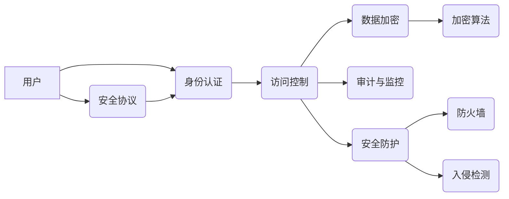
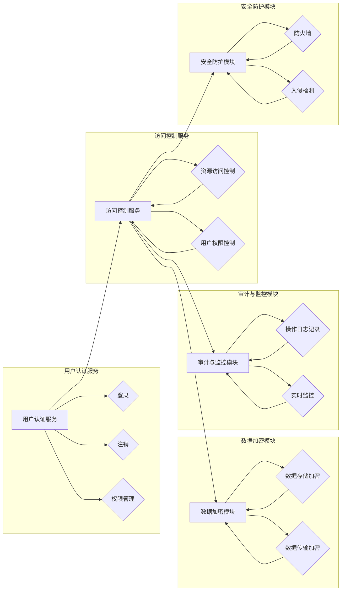

# 《Spark安全性与认证》

作者：禅与计算机程序设计艺术 / Zen and the Art of Computer Programming

## 1. 背景介绍

### 1.1 问题的由来

随着大数据技术的发展，Apache Spark作为一款强大的分布式数据处理框架，在各个领域得到了广泛应用。然而，随着Spark应用场景的不断扩展，安全问题也逐渐凸显。如何确保Spark平台的可靠性和安全性，防止数据泄露、篡改和未授权访问，成为Spark开发者和使用者关注的焦点。

### 1.2 研究现状

当前，Spark安全性和认证主要依赖于以下几个层面：

- **身份认证与访问控制**：通过用户认证、权限控制等手段，确保只有授权用户才能访问Spark平台和数据进行操作。
- **数据加密**：对数据进行加密存储和传输，防止数据在传输和存储过程中被窃取或篡改。
- **审计与监控**：记录用户操作日志，实时监控平台运行状态，及时发现和响应安全事件。
- **安全防护**：采用防火墙、入侵检测等安全防护手段，防止恶意攻击和入侵。

### 1.3 研究意义

研究Spark安全性与认证技术，对于以下方面具有重要意义：

- **保护数据安全**：确保数据不被未授权访问、泄露或篡改，保障企业数据资产安全。
- **提高系统可靠性**：降低安全漏洞风险，提高Spark平台的稳定性和可靠性。
- **满足合规要求**：满足相关法律法规和行业标准，如GDPR、HIPAA等。
- **提升用户体验**：提供安全、可靠的数据处理服务，提升用户满意度。

### 1.4 本文结构

本文将从以下几个方面对Spark安全性与认证进行深入探讨：

- 核心概念与联系
- 安全性与认证架构
- 核心算法原理与操作步骤
- 数学模型与公式
- 项目实践
- 实际应用场景
- 工具和资源推荐
- 总结与展望

## 2. 核心概念与联系

本节将介绍Spark安全性与认证中涉及的核心概念，并阐述它们之间的联系。

### 2.1 核心概念

- **身份认证**：验证用户的身份，确保只有授权用户才能访问系统。
- **访问控制**：根据用户身份和权限，控制用户对系统资源的访问。
- **数据加密**：对数据进行加密存储和传输，防止数据泄露和篡改。
- **审计与监控**：记录用户操作日志，实时监控平台运行状态。
- **安全防护**：采用防火墙、入侵检测等手段，防止恶意攻击和入侵。
- **安全协议**：如Kerberos、SAML、OAuth等，用于实现身份认证和访问控制。
- **加密算法**：如AES、RSA等，用于数据加密。

### 2.2 核心概念联系

以下用Mermaid流程图展示核心概念之间的联系：



可以看出，Spark安全性与认证是一个多维度、多层次的整体。身份认证是基础，访问控制、数据加密、审计与监控、安全防护等环节相互关联，共同构成Spark平台的安全保障体系。

## 3. 安全性与认证架构

本节将介绍Spark安全性与认证的架构，包括各个组件及其功能。

### 3.1 架构概述

Spark安全性架构主要包括以下几个组件：

- **用户认证服务**：负责用户的登录、注销、权限管理等功能。
- **访问控制服务**：根据用户权限，控制用户对Spark平台和数据的访问。
- **数据加密模块**：对数据进行加密存储和传输。
- **审计与监控模块**：记录用户操作日志，实时监控平台运行状态。
- **安全防护模块**：采用防火墙、入侵检测等手段，防止恶意攻击和入侵。

### 3.2 架构图

以下用Mermaid流程图展示Spark安全性架构：



### 3.3 架构特点

- **模块化设计**：各个模块功能清晰，易于扩展和维护。
- **可扩展性**：支持多种安全协议和加密算法，适应不同安全需求。
- **高可用性**：采用冗余设计，提高系统可靠性。

## 4. 核心算法原理与操作步骤

本节将介绍Spark安全性与认证中涉及的核心算法原理和操作步骤。

### 4.1 核心算法原理

- **身份认证算法**：如密码学中的哈希算法、数字签名算法等。
- **访问控制算法**：如基于角色的访问控制(RBAC)、基于属性的访问控制(ABAC)等。
- **数据加密算法**：如对称加密算法、非对称加密算法等。
- **安全协议算法**：如Kerberos、SAML、OAuth等。

### 4.2 操作步骤

1. **用户认证**：
    - 用户输入用户名和密码。
    - 认证服务验证用户身份，若验证成功，则创建会话。
    - 用户获取会话令牌，用于后续访问控制。

2. **访问控制**：
    - 根据用户会话令牌，访问控制服务获取用户权限。
    - 根据用户权限，控制用户对Spark平台和数据的访问。

3. **数据加密**：
    - 对数据使用加密算法进行加密。
    - 对加密后的数据存储或传输。

4. **审计与监控**：
    - 记录用户操作日志，包括操作类型、时间、用户信息等。
    - 实时监控平台运行状态，包括资源使用情况、异常事件等。

5. **安全防护**：
    - 采用防火墙、入侵检测等手段，防止恶意攻击和入侵。

## 5. 数学模型与公式

本节将介绍Spark安全性与认证中涉及的部分数学模型和公式。

### 5.1 数学模型构建

- **密码学模型**：研究密码学算法的安全性，如哈希函数、数字签名等。
- **访问控制模型**：研究基于RBAC、ABAC等访问控制模型的安全性。

### 5.2 公式推导过程

- **哈希函数**：将任意长度的数据映射到固定长度的值。常见的哈希函数包括MD5、SHA-1、SHA-256等。
- **数字签名**：保证数据完整性和身份验证。常见的数字签名算法包括RSA、ECDSA等。

### 5.3 案例分析与讲解

- **哈希函数案例**：使用SHA-256算法对字符串进行哈希运算。
- **数字签名案例**：使用RSA算法对消息进行数字签名。

### 5.4 常见问题解答

**Q1：为什么需要使用哈希函数？**

A1：哈希函数可以将任意长度的数据映射到固定长度的值，具有以下优点：
- 抗碰撞性：不同输入的哈希值不同，相同输入的哈希值相同。
- 抗逆向性：无法根据哈希值推出原始数据。
- 抗篡改性：对数据进行微小修改，会导致哈希值发生巨大变化。

**Q2：数字签名的作用是什么？**

A2：数字签名可以保证数据的完整性和身份验证。具体作用包括：
- 保证数据完整性：对数据进行签名后，接收者可以验证数据的完整性，确保数据在传输过程中未被篡改。
- 身份验证：发送者可以使用自己的私钥对数据进行签名，接收者可以验证签名是否由发送者的公钥生成，从而确认发送者的身份。

## 6. 项目实践：代码实例和详细解释说明

### 6.1 开发环境搭建

1. 安装Apache Spark：从官方下载Spark安装包，按照官方文档进行安装。
2. 安装Java开发环境：由于Spark是用Java编写的，需要安装Java开发环境。
3. 安装Python开发环境：根据需要，安装Python开发环境。

### 6.2 源代码详细实现

以下是一个简单的Spark安全性与认证示例，使用Kerberos进行用户认证，基于RBAC进行访问控制：

```python
from pyspark.sql import SparkSession
from pyspark.sql.security import UserGroupInformation

# 初始化SparkSession
spark = SparkSession.builder \
    .appName("Spark安全性认证示例") \
    .config("spark.authenticate", "kerberos") \
    .config("spark.authenticate.user", "spark_user") \
    .config("spark.user.keytab", "/path/to/keytab") \
    .config("spark.hadoop.kerberos.krb5.conf", "/path/to/krb5.conf") \
    .getOrCreate()

# 验证用户身份
ugi = UserGroupInformation.loginUserFromKeytab("spark_user@HADOOP.COM", "/path/to/keytab")

# 检查用户权限
if ugi.isMemberOf("group_name"):
    # 权限检查通过，执行相关操作
    pass
else:
    # 权限检查未通过，抛出异常
    raise PermissionError("用户没有访问权限")

# 关闭SparkSession
spark.stop()
```

### 6.3 代码解读与分析

- `SparkSession.builder`：创建SparkSession实例。
- `config`：设置Spark配置参数，如用户认证方式、用户名、keytab文件路径、Kerberos配置文件路径等。
- `UserGroupInformation.loginUserFromKeytab`：使用用户名和keytab文件验证用户身份。
- `ugi.isMemberOf`：检查用户是否属于特定组。

### 6.4 运行结果展示

运行上述代码后，如果用户身份验证成功且拥有权限，则执行相关操作；否则，抛出权限错误异常。

## 7. 实际应用场景

Spark安全性与认证技术在以下场景中具有广泛应用：

- **企业大数据平台**：保障企业数据资产安全，防止数据泄露和篡改。
- **政府大数据平台**：满足相关法律法规和行业标准，确保国家信息安全。
- **金融大数据平台**：防止金融欺诈、保障资金安全。
- **医疗大数据平台**：保护患者隐私，确保医疗数据安全。

## 8. 工具和资源推荐

### 8.1 学习资源推荐

- **Apache Spark官方文档**：https://spark.apache.org/docs/latest/
- **Kerberos官方文档**：https://www.kerberos.org/
- **RBAC相关资料**：https://en.wikipedia.org/wiki/Role-based_access_control
- **ABAC相关资料**：https://en.wikipedia.org/wiki/Attribute-Based_Access_Control

### 8.2 开发工具推荐

- **PySpark**：https://spark.apache.org/docs/latest/api/python/pyspark/index.html
- **Spark SQL**：https://spark.apache.org/docs/latest/sql/index.html
- **Spark MLlib**：https://spark.apache.org/docs/latest/ml-guide.html

### 8.3 相关论文推荐

- **Kerberos**：
    - "The Kerberos Network Authentication Service (V5)", by M. Kass, M. H. Goland, J. Linn, D. Steiner, T. W. Howlett, and S. C. Norris, MIT Laboratory for Computer Science, 1993.
- **RBAC**：
    - "Role-Based Access Control", by A. S. Thompson, W. Salamatian, and J. F. Naughton, IEEE Security and Privacy, 2002.
- **ABAC**：
    - "Attribute-Based Access Control: Definitions, Analysis, and Extensions", by J. Samarati and L. S. Yavatkar, Proceedings of the IEEE, 2001.

### 8.4 其他资源推荐

- **Spark安全性与认证社区**：https://spark.apache.org/community/
- **Kerberos社区**：https://www.kerberos.org/
- **RBAC社区**：https://www.open拉德社.org/
- **ABAC社区**：https://www.oasis-open.org/

## 9. 总结：未来发展趋势与挑战

### 9.1 研究成果总结

本文对Spark安全性与认证技术进行了全面系统的介绍，涵盖了核心概念、架构、算法、实践等多个方面。通过学习本文，读者可以了解Spark安全性与认证的基本原理和操作方法，并能够将其应用于实际项目中。

### 9.2 未来发展趋势

随着大数据技术的发展，Spark安全性与认证技术将呈现以下发展趋势：

- **安全性与性能的平衡**：在保障安全的同时，提高Spark平台的数据处理性能。
- **自适应安全机制**：根据用户行为、环境等因素，动态调整安全策略。
- **跨平台安全支持**：支持更多平台和操作系统，提高Spark平台的兼容性。
- **安全性与隐私保护**：结合隐私保护技术，确保用户隐私安全。

### 9.3 面临的挑战

Spark安全性与认证技术在发展过程中，仍面临以下挑战：

- **安全性与性能的平衡**：在保障安全的同时，提高Spark平台的数据处理性能。
- **安全机制的复杂性**：安全机制的增加，可能带来系统复杂性的提升。
- **安全漏洞的防范**：随着攻击手段的不断升级，安全漏洞的防范难度越来越大。
- **跨平台兼容性**：支持更多平台和操作系统，提高Spark平台的兼容性。

### 9.4 研究展望

未来，Spark安全性与认证技术的研究应着重关注以下方向：

- **安全性与性能的平衡**：研究更加高效的安全机制，降低安全对性能的影响。
- **自适应安全机制**：根据用户行为、环境等因素，动态调整安全策略。
- **安全漏洞的防范**：加强安全漏洞研究，提高安全防御能力。
- **隐私保护技术**：结合隐私保护技术，确保用户隐私安全。
- **跨平台兼容性**：支持更多平台和操作系统，提高Spark平台的兼容性。

相信通过不断努力，Spark安全性与认证技术将取得更大的突破，为构建安全、可靠、高效的大数据平台提供有力保障。

---

作者：禅与计算机程序设计艺术 / Zen and the Art of Computer Programming