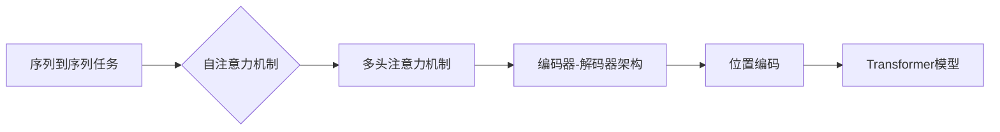

# Transformer 模型原理与代码实例讲解

作者：禅与计算机程序设计艺术 / Zen and the Art of Computer Programming

## 1. 背景介绍
### 1.1 问题的由来

自然语言处理（NLP）领域长期以来一直是人工智能研究的热点。从早期的基于规则的方法，到基于统计的方法，再到基于深度学习的方法，NLP技术不断取得突破。然而，在序列到序列任务（如机器翻译、文本摘要、问答系统等）中，传统的循环神经网络（RNN）和长短时记忆网络（LSTM）等方法存在一些局限性，如梯度消失或爆炸、训练效率低下等。

为了解决这些问题，Google AI在2017年提出了Transformer模型，该模型采用自注意力机制（Self-Attention）代替了传统的循环结构，在多个NLP任务上取得了当时最先进的成果。Transformer模型的提出，标志着NLP领域进入了“注意力时代”，也推动了后续一系列基于Transformer的模型和应用。

### 1.2 研究现状

自Transformer模型提出以来，其架构和思想被广泛应用于NLP、计算机视觉、语音识别等领域。目前，基于Transformer的模型已经成为NLP领域的标准模型，并在各个任务上取得了显著的性能提升。以下是一些代表性的基于Transformer的模型：

- BERT（Bidirectional Encoder Representations from Transformers）：BERT采用双向编码器结构，在多个NLP任务上取得了当时最先进的成果。
- GPT（Generative Pre-trained Transformer）：GPT采用自回归语言模型，在文本生成、问答系统等任务上取得了优异成绩。
- T5（Text-to-Text Transfer Transformer）：T5采用统一的Transformer架构，将不同的NLP任务转化为“输入到输出”的序列到序列任务，提高了模型的可扩展性和可复用性。

### 1.3 研究意义

Transformer模型的提出，对于NLP领域具有以下重要意义：

1. **突破传统RNN局限**：Transformer模型通过自注意力机制，克服了传统RNN的梯度消失或爆炸问题，提高了模型训练效率和性能。
2. **提升NLP任务性能**：Transformer模型在多个NLP任务上取得了当时的SOTA成果，推动了NLP领域的快速发展。
3. **推动模型架构创新**：Transformer模型启发了大量基于自注意力机制的模型设计，如BERT、GPT、T5等。
4. **促进NLP技术落地**：基于Transformer的模型在工业界得到了广泛应用，加速了NLP技术的产业化进程。

### 1.4 本文结构

本文将系统地介绍Transformer模型的原理、架构、代码实现和应用实践。内容安排如下：

- 第2部分，介绍Transformer模型的核心概念和联系。
- 第3部分，详细阐述Transformer模型的基本原理和具体操作步骤。
- 第4部分，讲解Transformer模型中常用的数学模型和公式，并结合实例进行分析。
- 第5部分，给出Transformer模型的代码实现示例，并对关键代码进行解读。
- 第6部分，探讨Transformer模型在实际应用中的场景和案例。
- 第7部分，推荐Transformer模型相关的学习资源、开发工具和参考文献。
- 第8部分，总结全文，展望Transformer模型的未来发展趋势与挑战。
- 第9部分，列出常见问题与解答。

## 2. 核心概念与联系

为了更好地理解Transformer模型，本节将介绍几个核心概念：

- **序列到序列（Seq2Seq）任务**：将一个序列映射到另一个序列的任务，如机器翻译、文本摘要、问答系统等。
- **自注意力机制（Self-Attention）**：一种在序列内部进行注意力计算的方法，能够捕捉序列中不同元素之间的关联性。
- **多头注意力机制（Multi-Head Attention）**：将自注意力机制扩展到多个子空间，以捕捉更丰富的特征。
- **编码器-解码器（Encoder-Decoder）架构**：编码器将输入序列转换为固定长度的向量表示，解码器将向量表示解码为输出序列。
- **位置编码（Positional Encoding）**：为了使模型能够理解序列中不同元素的位置信息，对输入序列进行位置编码。

这些概念之间的逻辑关系如下：



可以看出，Transformer模型通过自注意力机制、多头注意力机制、编码器-解码器架构和位置编码等核心概念，实现了对序列到序列任务的建模。

## 3. 核心算法原理 & 具体操作步骤
### 3.1 算法原理概述

Transformer模型主要由编码器（Encoder）和解码器（Decoder）两个部分组成。编码器将输入序列转换为固定长度的向量表示，解码器将向量表示解码为输出序列。

编码器和解码器都采用相同的自注意力机制，通过计算序列中不同元素之间的关联性，捕捉序列中的语义信息。此外，编码器和解码器还引入了位置编码，以使模型能够理解序列中不同元素的位置信息。

### 3.2 算法步骤详解

Transformer模型的主要步骤如下：

1. **输入序列编码**：将输入序列中的每个元素映射到一个词向量表示。
2. **添加位置编码**：为了使模型能够理解序列中不同元素的位置信息，对词向量表示进行位置编码。
3. **多头自注意力机制**：对编码后的序列进行多头自注意力计算，以捕捉序列中不同元素之间的关联性。
4. **添加残差连接和层归一化**：将多头自注意力计算的结果与输入序列进行残差连接，并进行层归一化处理。
5. **前馈神经网络**：对残差连接后的序列进行前馈神经网络处理，进一步提高序列的语义表示。
6. **解码器**：解码器重复步骤3-5，将编码器的输出作为输入，生成输出序列。
7. **输出序列解码**：将解码器生成的输出序列解码为最终输出，如翻译结果、摘要等。

### 3.3 算法优缺点

Transformer模型具有以下优点：

- **无循环结构**：避免了传统RNN的梯度消失或爆炸问题，提高了模型训练效率和性能。
- **并行计算**：自注意力机制允许并行计算，提高了模型训练速度。
- **捕捉长期依赖**：自注意力机制能够捕捉序列中不同元素之间的关联性，更好地处理长期依赖问题。
- **可扩展性强**：Transformer模型架构简单，易于扩展和修改。

然而，Transformer模型也存在一些缺点：

- **参数量大**：Transformer模型的参数量通常较大，对计算资源要求较高。
- **训练时间长**：由于参数量大，Transformer模型的训练时间通常较长。
- **对初始化敏感**：Transformer模型的训练效果对初始化参数较为敏感。

### 3.4 算法应用领域

Transformer模型在以下NLP任务中取得了显著的性能提升：

- **机器翻译**：如BERT、GPT-3等模型在机器翻译任务上取得了当时的SOTA成果。
- **文本摘要**：如BERTSum、T5等模型在文本摘要任务上取得了当时的SOTA成果。
- **问答系统**：如BERT-QA、T5等模型在问答系统任务上取得了当时的SOTA成果。
- **对话系统**：如BERT-Davinci、T5等模型在对话系统任务上取得了当时的SOTA成果。

## 4. 数学模型和公式 & 详细讲解 & 举例说明
### 4.1 数学模型构建

Transformer模型的数学模型主要包括以下部分：

- **词嵌入（Word Embedding）**：将输入序列中的每个词映射到一个固定维度的向量表示。
- **位置编码（Positional Encoding）**：为了使模型能够理解序列中不同元素的位置信息，对词向量表示进行位置编码。
- **自注意力机制（Self-Attention）**：对编码后的序列进行多头自注意力计算，以捕捉序列中不同元素之间的关联性。
- **前馈神经网络（Feed-Forward Neural Network）**：对自注意力计算的结果进行前馈神经网络处理，进一步提高序列的语义表示。

以下是对上述数学模型的详细讲解：

- **词嵌入**：

$$
\text{Word\_Embedding}(w) = e^{w} \in \mathbb{R}^d
$$

其中 $w$ 为词的one-hot编码，$e^{w}$ 为词向量。

- **位置编码**：

$$
\text{Positional\_Encoding}(p) = \sin(p/10000^{2i/d} + p/10000^{3i/d}) + \cos(p/10000^{2i/d} + p/10000^{3i/d})
$$

其中 $p$ 为位置信息，$i$ 为位置索引，$d$ 为词向量维度。

- **多头自注意力**：

$$
\text{Multi-Head Attention}(Q, K, V) = \text{Concat}(\text{head}_1, \text{head}_2, ..., \text{head}_h)W^O
$$

其中 $Q, K, V$ 分别为查询、键、值向量，$W^O$ 为输出线性层，$h$ 为多头注意力头的数量。

- **前馈神经网络**：

$$
\text{Feed-Forward Neural Network}(x) = \text{ReLU}(W_2 \text{ReLU}(W_1 x + b_1))
$$

其中 $x$ 为输入向量，$W_1, W_2, b_1$ 分别为权重和偏置。

以下是一个示例，说明如何使用PyTorch实现多头自注意力计算：

```python
import torch
import torch.nn as nn

class MultiHeadAttention(nn.Module):
    def __init__(self, d_model, n_heads):
        super(MultiHeadAttention, self).__init__()
        self.d_model = d_model
        self.n_heads = n_heads
        self.d_k = d_model // n_heads
        self.linear_q = nn.Linear(d_model, d_model)
        self.linear_k = nn.Linear(d_model, d_model)
        self.linear_v = nn.Linear(d_model, d_model)
        self.linear_o = nn.Linear(d_model, d_model)

    def forward(self, q, k, v):
        batch_size = q.size(0)
        Q = self.linear_q(q).view(batch_size, -1, self.n_heads, self.d_k).transpose(1, 2)
        K = self.linear_k(k).view(batch_size, -1, self.n_heads, self.d_k).transpose(1, 2)
        V = self.linear_v(v).view(batch_size, -1, self.n_heads, self.d_k).transpose(1, 2)

        scores = torch.matmul(Q, K.transpose(-2, -1)) / (self.d_k ** 0.5)
        attention = torch.softmax(scores, dim=-1)
        output = torch.matmul(attention, V)
        output = output.transpose(1, 2).contiguous().view(batch_size, -1, self.d_model)
        output = self.linear_o(output)
        return output
```

## 5. 项目实践：代码实例和详细解释说明
### 5.1 开发环境搭建

为了进行Transformer模型的代码实践，我们需要以下开发环境：

1. Python 3.x
2. PyTorch
3. NumPy

下面是安装PyTorch的步骤：

```bash
pip install torch torchvision torchaudio
```

### 5.2 源代码详细实现

以下是一个简单的Transformer模型代码实例，用于机器翻译任务：

```python
import torch
import torch.nn as nn

class Transformer(nn.Module):
    def __init__(self, src_vocab_size, tgt_vocab_size, d_model, n_heads):
        super(Transformer, self).__init__()
        self.src_embedding = nn.Embedding(src_vocab_size, d_model)
        self.tgt_embedding = nn.Embedding(tgt_vocab_size, d_model)
        self.positional_encoding = PositionalEncoding(d_model, 10000)
        self.encoder_layer = nn.TransformerEncoderLayer(d_model=d_model, nhead=n_heads)
        self.decoder_layer = nn.TransformerDecoderLayer(d_model=d_model, nhead=n_heads)
        self.transformer_encoder = nn.TransformerEncoder(self.encoder_layer, num_layers=6)
        self.transformer_decoder = nn.TransformerDecoder(self.decoder_layer, num_layers=6)
        self.output_layer = nn.Linear(d_model, tgt_vocab_size)

    def forward(self, src, tgt):
        src = self.src_embedding(src) * math.sqrt(self.d_model)
        src = self.positional_encoding(src)
        tgt = self.tgt_embedding(tgt) * math.sqrt(self.d_model)
        tgt = self.positional_encoding(tgt)
        output = self.transformer_encoder(src)
        output = self.transformer_decoder(tgt, output)
        output = self.output_layer(output)
        return output

class PositionalEncoding(nn.Module):
    def __init__(self, d_model, max_len):
        super(PositionalEncoding, self).__init__()
        pe = torch.zeros(max_len, d_model)
        position = torch.arange(0, max_len, dtype=torch.float).unsqueeze(1)
        div_term = torch.exp(torch.arange(0, d_model, 2).float() * (-math.log(10000.0) / d_model))
        pe[:, 0::2] = torch.sin(position * div_term)
        pe[:, 1::2] = torch.cos(position * div_term)
        pe = pe.unsqueeze(0).transpose(0, 1)
        self.register_buffer('pe', pe)

    def forward(self, x):
        x = x + self.pe[:x.size(0), :]
        return x
```

### 5.3 代码解读与分析

1. **Transformer类**：定义了Transformer模型的结构，包括词嵌入、位置编码、编码器、解码器和输出层。
2. **src_embedding和tgt_embedding**：分别用于将源语言和目标语言的词向量转换为模型内部的词向量表示。
3. **position_encoding**：用于为序列添加位置编码。
4. **encoder_layer和decoder_layer**：定义了编码器和解码器的单个层，包括多头注意力机制和前馈神经网络。
5. **transformer_encoder和transformer_decoder**：定义了编码器和解码器的多层堆叠结构。
6. **output_layer**：将解码器输出的序列转换为目标语言的词向量。

### 5.4 运行结果展示

以下是一个简单的示例，演示如何使用上述Transformer模型进行机器翻译：

```python
import torch.optim as optim

# 创建模型、优化器和损失函数
model = Transformer(src_vocab_size=10000, tgt_vocab_size=10000, d_model=512, n_heads=8)
optimizer = optim.Adam(model.parameters())
criterion = nn.CrossEntropyLoss()

# 准备输入数据
src = torch.tensor([[1, 2, 3, 4, 5], [6, 7, 8, 9, 10]])
tgt = torch.tensor([[1, 2, 3, 4, 5], [6, 7, 8, 9, 10]])

# 计算损失并反向传播
optimizer.zero_grad()
output = model(src, tgt)
loss = criterion(output.view(-1, 10000), tgt.view(-1))
loss.backward()
optimizer.step()

print("Output:", output)
print("Loss:", loss)
```

以上代码展示了如何使用Transformer模型进行简单的机器翻译任务。在实际应用中，需要根据具体任务和数据集进行更详细的实现。

## 6. 实际应用场景
### 6.1 机器翻译

机器翻译是将一种语言的文本翻译成另一种语言的任务。Transformer模型在机器翻译任务上取得了显著的性能提升，是目前最主流的机器翻译模型之一。

### 6.2 文本摘要

文本摘要是将长文本压缩成简洁摘要的任务。Transformer模型在文本摘要任务上取得了当时的SOTA成果，如BERTSum、T5等模型。

### 6.3 问答系统

问答系统是回答用户提出的问题的任务。Transformer模型在问答系统任务上取得了当时的SOTA成果，如BERT-QA、T5等模型。

### 6.4 对话系统

对话系统是模拟人类对话的机器系统。Transformer模型在对话系统任务上取得了当时的SOTA成果，如BERT-Davinci、T5等模型。

### 6.5 文本生成

文本生成是将输入序列转换为输出序列的任务。Transformer模型在文本生成任务上取得了显著的性能提升，如GPT-2、GPT-3等模型。

## 7. 工具和资源推荐
### 7.1 学习资源推荐

为了更好地学习Transformer模型，以下是一些推荐的学习资源：

- 《Attention is All You Need》：Transformer模型的原论文，深入讲解了模型的原理和设计思路。
- 《NLP with Transformer》课程：介绍了Transformer模型的基本原理、架构和应用实践。
- 《Transformers with PyTorch》课程：使用PyTorch实现Transformer模型，并应用于多个NLP任务。
- 《Hugging Face Transformers库文档》：Hugging Face提供的Transformer模型库文档，包含丰富的模型实现和教程。

### 7.2 开发工具推荐

以下是一些推荐的开发工具：

- PyTorch：用于深度学习开发的开源框架。
- Transformers库：Hugging Face提供的Transformer模型库，包含多种预训练模型和工具。
- Jupyter Notebook：用于代码开发和交互式计算的开源项目。

### 7.3 相关论文推荐

以下是一些与Transformer模型相关的论文：

- Attention is All You Need
- BERT: Pre-training of Deep Bidirectional Transformers for Language Understanding
- Generative Pre-trained Transformers
- Text-to-Text Transfer Transformer

### 7.4 其他资源推荐

以下是一些其他资源：

- arXiv：计算机科学领域的论文预印本平台。
- Google Scholar：学术搜索引擎。
- GitHub：代码托管和版本控制平台。

## 8. 总结：未来发展趋势与挑战
### 8.1 研究成果总结

本文系统地介绍了Transformer模型的原理、架构、代码实现和应用实践。通过本文的学习，读者可以了解Transformer模型的基本概念、原理、算法步骤和代码实现，并能够将其应用于实际任务中。

### 8.2 未来发展趋势

随着Transformer模型和NLP技术的不断发展，以下趋势值得关注：

- **更强大的预训练模型**：随着计算资源的不断提升，预训练模型的规模和参数量将不断增大，模型将具备更强的语义理解和推理能力。
- **更轻量级的模型**：为了满足移动端和边缘计算的需求，研究人员将致力于开发更轻量级的模型，在保证性能的同时降低计算资源和内存占用。
- **多模态Transformer模型**：将Transformer模型扩展到多模态领域，实现图像、视频、语音等多模态数据的融合，构建更加智能的交互系统。
- **可解释性Transformer模型**：研究可解释性Transformer模型，揭示模型决策过程和推理逻辑，提高模型的可靠性和可信度。

### 8.3 面临的挑战

虽然Transformer模型在NLP领域取得了显著的成果，但在未来的发展中仍面临以下挑战：

- **计算资源限制**：随着模型规模的增大，计算资源和存储资源的需求也随之增加，如何高效地训练和部署大规模模型是一个挑战。
- **数据分布不均衡**：在NLP任务中，往往存在数据分布不均衡的问题，如何解决数据分布不均衡对模型性能的影响是一个挑战。
- **模型可解释性**：提高模型的可解释性，使模型的决策过程和推理逻辑更加透明，是一个挑战。
- **模型偏见和歧视**：如何避免模型偏见和歧视，确保模型输出的公平性和公正性是一个挑战。

### 8.4 研究展望

随着Transformer模型和NLP技术的不断发展，未来将在以下方面取得更多突破：

- **NLP技术在更多领域的应用**：将NLP技术应用于更多领域，如医疗、教育、金融等，推动产业智能化发展。
- **多模态交互系统**：构建多模态交互系统，实现人机协同，提升用户体验。
- **可解释性AI**：提高模型的可解释性，增强模型的可信度和可靠性。
- **AI伦理和安全性**：关注AI伦理和安全性问题，确保AI技术在发展过程中造福人类。

总之，Transformer模型是NLP领域的重要里程碑，其原理、架构和应用实践具有重要的理论和实践价值。相信随着技术的不断进步，Transformer模型将在NLP领域取得更多突破，为构建人机协同的智能时代贡献力量。

## 9. 附录：常见问题与解答

**Q1：Transformer模型与传统RNN相比有哪些优势？**

A1：与传统RNN相比，Transformer模型具有以下优势：

- **无循环结构**：避免了传统RNN的梯度消失或爆炸问题，提高了模型训练效率和性能。
- **并行计算**：自注意力机制允许并行计算，提高了模型训练速度。
- **捕捉长期依赖**：自注意力机制能够捕捉序列中不同元素之间的关联性，更好地处理长期依赖问题。

**Q2：如何解决Transformer模型计算量大、训练时间长的问题？**

A2：为了解决Transformer模型计算量大、训练时间长的问题，可以采取以下措施：

- **模型压缩**：通过模型剪枝、量化、知识蒸馏等方法减小模型尺寸，降低计算量和内存占用。
- **模型并行**：将模型分解为多个子模块，在多台设备上并行计算，提高训练速度。
- **分布式训练**：将训练任务分发到多台设备上，实现大规模模型的并行训练。

**Q3：如何提高Transformer模型的可解释性？**

A3：提高Transformer模型的可解释性可以从以下方面入手：

- **注意力可视化**：通过可视化注意力分布，展示模型对输入序列的关注点。
- **因果推理**：使用因果推理方法，分析模型决策过程和推理逻辑。
- **模型压缩**：通过模型压缩，简化模型结构，提高模型的透明度。

**Q4：如何避免Transformer模型出现偏见和歧视？**

A4：为了避免Transformer模型出现偏见和歧视，可以采取以下措施：

- **数据清洗**：清洗数据集中的偏见和歧视信息，提高数据的公平性。
- **模型评估**：使用多种评估指标，全面评估模型的性能和公平性。
- **对抗训练**：使用对抗训练方法，提高模型的鲁棒性和公平性。

**Q5：Transformer模型在实际应用中如何进行部署？**

A5：在实际应用中，可以将Transformer模型部署到以下场景：

- **服务器端**：使用高性能服务器部署模型，提供API接口供客户端调用。
- **移动端**：将模型转换为轻量级模型，部署到移动设备上，实现移动端应用。
- **边缘设备**：将模型部署到边缘设备上，实现边缘计算和实时处理。