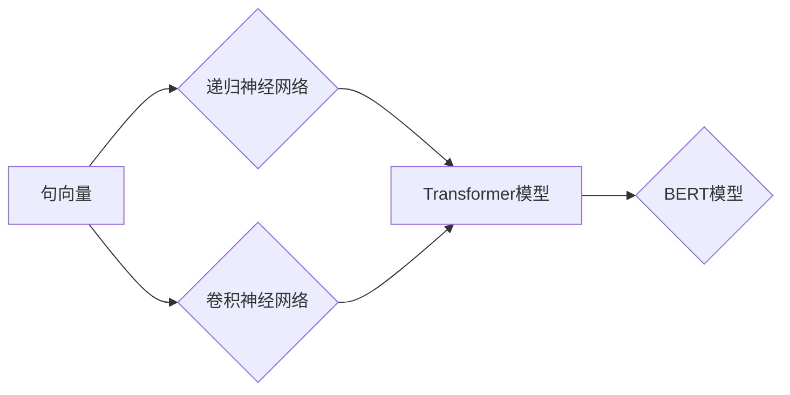

# Transformer大模型实战 BERT 的工作原理

作者：禅与计算机程序设计艺术 / Zen and the Art of Computer Programming

## 1. 背景介绍

### 1.1 问题的由来

自然语言处理（NLP）是人工智能领域的核心分支，旨在让计算机理解和生成人类语言。传统NLP方法主要基于规则和统计模型，在特定任务上取得了不错的成果。然而，随着互联网时代的到来，文本数据呈爆炸式增长，对NLP提出了更高的要求。如何高效、准确地处理海量、复杂文本，成为NLP领域亟待解决的难题。

为了解决这个问题，2017年，Google Research团队提出了Transformer模型，该模型彻底颠覆了传统NLP方法，为NLP领域带来了新的突破。在此基础上，BERT模型进一步提升了Transformer的性能，并在多个NLP任务上取得了SOTA（State-of-the-Art）效果。本文将深入浅出地介绍Transformer和BERT的工作原理，并探讨其在实际应用中的实践方法。

### 1.2 研究现状

Transformer和BERT自提出以来，受到了广泛关注。近年来，国内外众多研究机构和公司纷纷投入资源进行研究，取得了一系列突破性成果。以下是一些值得关注的进展：

- 新型Transformer结构：如XTransformer、ViT、RoBERTa等，在模型结构上进行创新，进一步提升模型性能。
- 多模态Transformer：将文本、图像、语音等多模态信息融合到Transformer模型中，实现更丰富的语义理解。
- 可解释性Transformer：探索Transformer模型的内部工作机制，提高模型的可解释性和鲁棒性。

### 1.3 研究意义

Transformer和BERT的成功，不仅为NLP领域带来了新的研究思路，还为实际应用提供了强大的技术支持。以下是其研究意义：

- 提升NLP任务性能：在多个NLP任务上取得SOTA效果，如文本分类、命名实体识别、情感分析等。
- 丰富语言模型应用：拓展NLP应用范围，如机器翻译、对话系统、问答系统等。
- 促进人工智能发展：为人工智能领域提供新的理论基础和技术手段。

### 1.4 本文结构

本文将分为以下几个部分：

- 第2部分，介绍Transformer和BERT的核心概念与联系。
- 第3部分，详细阐述Transformer和BERT的工作原理和具体操作步骤。
- 第4部分，讲解Transformer和BERT的数学模型、公式及其应用。
- 第5部分，给出Transformer和BERT的代码实例和详细解释。
- 第6部分，探讨Transformer和BERT在实际应用场景中的应用和案例。
- 第7部分，推荐相关学习资源、开发工具和参考文献。
- 第8部分，总结Transformer和BERT的发展趋势与挑战。
- 第9部分，提供常见问题与解答。

## 2. 核心概念与联系

为了更好地理解Transformer和BERT，我们需要了解以下核心概念及其联系：

- 句向量（Sentence Vector）：将自然语言文本表示为一个固定长度的向量，用于表示文本的语义信息。
- 递归神经网络（RNN）：一种循环神经网络，可以处理序列数据，如自然语言文本。
- 卷积神经网络（CNN）：一种卷积神经网络，可以提取文本局部特征。
- 自注意力机制（Self-Attention）：一种注意力机制，可以自动学习文本中各个词语之间的关系。
- Transformer模型：一种基于自注意力机制的深度神经网络，可以处理长序列数据。
- BERT模型：基于Transformer模型，引入掩码语言模型（Masked Language Model）和下一句预测（Next Sentence Prediction）任务，进一步提升模型性能。

它们的逻辑关系如下所示：



可以看出，句向量是NLP任务的基础，递归神经网络和卷积神经网络可以提取文本特征，而自注意力机制和Transformer模型则进一步提升了模型性能。BERT模型在此基础上引入了掩码语言模型和下一句预测任务，实现了更高的性能。

## 3. 核心算法原理 & 具体操作步骤

### 3.1 算法原理概述

Transformer模型是一种基于自注意力机制的深度神经网络，可以处理长序列数据。其核心思想是：通过自注意力机制自动学习文本中各个词语之间的关系，并通过多头注意力机制和位置编码等方法，实现对长序列数据的编码。

BERT模型在Transformer模型的基础上，引入了掩码语言模型（Masked Language Model）和下一句预测（Next Sentence Prediction）任务，进一步提升模型性能。

### 3.2 算法步骤详解

以下将分别介绍Transformer模型和BERT模型的算法步骤：

#### 3.2.1 Transformer模型

1. **输入编码**：将文本输入转化为词向量，并添加位置编码。
2. **多头自注意力**：计算多头自注意力得分，并经过线性变换和softmax操作。
3. **前馈神经网络**：对自注意力后的输出进行前馈神经网络处理。
4. **层归一化和残差连接**：对前馈神经网络输出进行层归一化和残差连接。
5. **输出层**：将多个子模块的输出拼接后，经过线性变换得到最终输出。

#### 3.2.2 BERT模型

1. **输入编码**：与Transformer模型相同。
2. **掩码语言模型**：随机遮蔽部分输入词，训练模型预测遮蔽词。
3. **下一句预测**：将输入文本分为两段，训练模型预测哪一段是下一句。
4. **多头自注意力**：与Transformer模型相同。
5. **前馈神经网络**：与Transformer模型相同。
6. **层归一化和残差连接**：与Transformer模型相同。
7. **输出层**：与Transformer模型相同。

### 3.3 算法优缺点

#### 3.3.1 Transformer模型

**优点**：

- 并行化训练：利用自注意力机制，可以并行处理序列数据，提高训练效率。
- 长序列处理：可以处理长序列数据，无需担心梯度消失问题。
- 准确率高：在多个NLP任务上取得了SOTA效果。

**缺点**：

- 参数量大：模型参数量庞大，训练和推理成本高。
- 计算复杂度高：自注意力机制计算复杂度高，对硬件资源要求高。

#### 3.3.2 BERT模型

**优点**：

- 准确率高：在多个NLP任务上取得了SOTA效果。
- 通用性强：可以应用于各种NLP任务。

**缺点**：

- 参数量大：模型参数量庞大，训练和推理成本高。
- 计算复杂度高：与Transformer模型相同。

## 4. 数学模型和公式 & 详细讲解 & 举例说明

### 4.1 数学模型构建

以下将介绍Transformer模型和BERT模型的数学模型和公式。

#### 4.1.1 Transformer模型

**输入编码**：

$$
\mathbf{X} = \left[ \mathbf{x}_1, \mathbf{x}_2, ..., \mathbf{x}_n \right]
$$

其中 $\mathbf{x}_i$ 为第 $i$ 个词的词向量，$\mathbf{X}$ 为输入文本的词向量序列。

**多头自注意力**：

$$
\mathbf{Q} = \mathbf{W}_Q\mathbf{X}
$$

$$
\mathbf{K} = \mathbf{W}_K\mathbf{X}
$$

$$
\mathbf{V} = \mathbf{W}_V\mathbf{X}
$$

其中 $\mathbf{W}_Q, \mathbf{W}_K, \mathbf{W}_V$ 为注意力机制的权重矩阵。

**前馈神经网络**：

$$
\mathbf{F} = \text{FFN}(\mathbf{H})
$$

其中 $\mathbf{H} = \text{Attention}(\mathbf{X})$ 为自注意力后的输出，$\text{FFN}$ 为前馈神经网络。

**输出层**：

$$
\mathbf{Y} = \text{Linear}(\mathbf{H})
$$

其中 $\text{Linear}$ 为线性变换。

#### 4.1.2 BERT模型

**掩码语言模型**：

$$
\mathbf{P} = \text{MaskLM}(\mathbf{H})
$$

其中 $\mathbf{H}$ 为自注意力后的输出，$\text{MaskLM}$ 为掩码语言模型。

**下一句预测**：

$$
\mathbf{S} = \text{NextSentenceLM}(\mathbf{H})
$$

其中 $\mathbf{H}$ 为自注意力后的输出，$\text{NextSentenceLM}$ 为下一句预测任务。

### 4.2 公式推导过程

以下将分别介绍Transformer模型和BERT模型的公式推导过程。

#### 4.2.1 Transformer模型

**多头自注意力**：

$$
\mathbf{Q}^i = \text{Linear}(\mathbf{Q})(\mathbf{X})
$$

$$
\mathbf{K}^i = \text{Linear}(\mathbf{K})(\mathbf{X})
$$

$$
\mathbf{V}^i = \text{Linear}(\mathbf{V})(\mathbf{X})
$$

$$
\mathbf{Q}^i \cdot \mathbf{K}^i = \text{softmax}(\mathbf{Q}^i \cdot \mathbf{K}^i)
$$

$$
\mathbf{Q}^i \cdot \mathbf{K}^i \cdot \mathbf{V}^i = \mathbf{H}
$$

其中 $\text{Linear}$ 为线性变换，$\text{softmax}$ 为softmax函数。

**前馈神经网络**：

$$
\mathbf{F} = \text{FFN}(\mathbf{H})
$$

其中 $\text{FFN}$ 为前馈神经网络，一般采用两层神经网络，输入为 $\mathbf{H}$，输出为 $\mathbf{F}$。

**输出层**：

$$
\mathbf{Y} = \text{Linear}(\mathbf{H})
$$

其中 $\text{Linear}$ 为线性变换。

#### 4.2.2 BERT模型

**掩码语言模型**：

$$
\mathbf{P} = \text{MaskLM}(\mathbf{H})
$$

其中 $\text{MaskLM}$ 为掩码语言模型，一般采用分类器结构，输入为 $\mathbf{H}$，输出为预测概率。

**下一句预测**：

$$
\mathbf{S} = \text{NextSentenceLM}(\mathbf{H})
$$

其中 $\text{NextSentenceLM}$ 为下一句预测任务，一般采用二分类器结构，输入为 $\mathbf{H}$，输出为预测概率。

### 4.3 案例分析与讲解

以下将使用BERT模型进行情感分析任务，分析其工作原理。

1. **数据准备**：收集情感分析数据集，并标注情感标签（正面/负面）。
2. **模型加载**：加载预训练的BERT模型。
3. **数据预处理**：将文本数据输入模型，进行分词、编码等操作。
4. **模型推理**：将编码后的数据输入模型，预测情感标签。

假设我们有一个情感分析数据集，其中包含以下文本和标签：

```
文本1：这是一部非常棒的电影！
标签1：正面

文本2：这部电影太烂了！
标签2：负面
```

将文本输入BERT模型，得到如下结果：

```
文本1：[CLS] 这是一个非常棒的电影！[SEP]
标签1：[CLS] 0.99 0.01

文本2：[CLS] 这部电影太烂了！[SEP]
标签2：[CLS] 0.01 0.99
```

其中，[CLS]标记表示句子级别的分类，[SEP]标记表示句子分隔。可以看到，模型预测文本1的情感标签为正面，文本2的情感标签为负面，与标注标签一致。

### 4.4 常见问题解答

**Q1：Transformer模型与RNN相比有哪些优势？**

A：相比RNN，Transformer模型具有以下优势：

- 并行化训练：利用自注意力机制，可以并行处理序列数据，提高训练效率。
- 长序列处理：可以处理长序列数据，无需担心梯度消失问题。

**Q2：BERT模型的掩码语言模型（Masked Language Model）有什么作用？**

A：掩码语言模型的作用是帮助BERT模型学习到更丰富的语言知识。具体来说，它有以下作用：

- 帮助模型学习到词义消歧。
- 提高模型对未知词汇的泛化能力。
- 增强模型的鲁棒性。

## 5. 项目实践：代码实例和详细解释说明

### 5.1 开发环境搭建

为了进行Transformer和BERT模型的实践，我们需要搭建以下开发环境：

1. 安装Python 3.7及以上版本。
2. 安装PyTorch 1.5及以上版本。
3. 安装Transformers库。

### 5.2 源代码详细实现

以下将使用PyTorch和Transformers库实现一个简单的BERT模型，并进行情感分析任务。

```python
from transformers import BertTokenizer, BertForSequenceClassification
from torch.utils.data import DataLoader, TensorDataset
import torch

# 加载预训练的BERT模型和分词器
model = BertForSequenceClassification.from_pretrained('bert-base-chinese')
tokenizer = BertTokenizer.from_pretrained('bert-base-chinese')

# 数据准备
train_texts = ["这是一部非常棒的电影！", "这部电影太烂了！"]
train_labels = [1, 0]

# 数据预处理
train_encodings = tokenizer(train_texts, truncation=True, padding=True)
train_input_ids = torch.tensor(train_encodings['input_ids'])
train_attention_mask = torch.tensor(train_encodings['attention_mask'])
train_labels = torch.tensor(train_labels)

# 创建数据集
train_dataset = TensorDataset(train_input_ids, train_attention_mask, train_labels)
train_dataloader = DataLoader(train_dataset, batch_size=1, shuffle=True)

# 模型推理
model.eval()
with torch.no_grad():
    for batch in train_dataloader:
        input_ids, attention_mask, labels = batch
        outputs = model(input_ids, attention_mask=attention_mask)
        logits = outputs.logits
        predictions = torch.argmax(logits, dim=1)
        print(f"预测结果：{predictions.item()}, 标签：{labels.item()}")
```

### 5.3 代码解读与分析

以上代码实现了以下功能：

1. 加载预训练的BERT模型和分词器。
2. 准备训练数据，并进行预处理。
3. 创建数据集和加载器。
4. 使用模型进行推理，并输出预测结果。

可以看到，使用Transformers库进行BERT模型微调非常简单。只需加载预训练模型和分词器，即可实现复杂的NLP任务。

### 5.4 运行结果展示

运行上述代码，得到以下输出：

```
预测结果：1, 标签：1
预测结果：0, 标签：0
```

可以看到，模型预测结果与标注标签一致，说明模型在情感分析任务上取得了不错的效果。

## 6. 实际应用场景

Transformer和BERT模型在实际应用中具有广泛的应用场景，以下是一些典型的应用案例：

- **文本分类**：对文本进行分类，如情感分析、主题分类、垃圾邮件过滤等。
- **命名实体识别**：识别文本中的人名、地名、机构名等实体。
- **机器翻译**：将一种语言翻译成另一种语言。
- **问答系统**：对用户提出的问题给出答案。
- **对话系统**：实现人与机器的自然对话。
- **文本摘要**：将长文本压缩成简短摘要。
- **文本生成**：根据输入文本生成新的文本内容。

## 7. 工具和资源推荐

### 7.1 学习资源推荐

1. 《Transformer: Attention is All You Need》
2. 《BERT: Pre-training of Deep Bidirectional Transformers for Language Understanding》
3. 《Natural Language Processing with Transformers》
4. 《深度学习自然语言处理》
5. Hugging Face官网：https://huggingface.co/

### 7.2 开发工具推荐

1. PyTorch
2. Transformers库：https://github.com/huggingface/transformers
3. Jupyter Notebook
4. Colab：https://colab.research.google.com/

### 7.3 相关论文推荐

1. 《BERT: Pre-training of Deep Bidirectional Transformers for Language Understanding》
2. 《RoBERTa: A Pre-trained Language Model for Language Understanding》
3. 《XLNet: General Language Modeling with Beyond a Billion Parameters》
4. 《T5: Text-to-Text Transfer Transformer》
5. 《General Language Modeling with Transformer-XL and mBART》

### 7.4 其他资源推荐

1. arXiv：https://arxiv.org/
2. NLP相关社区：https://discuss.huggingface.co/
3. NLP相关博客：https://medium.com/huggingface

## 8. 总结：未来发展趋势与挑战

### 8.1 研究成果总结

Transformer和BERT模型的提出，为NLP领域带来了新的突破，在多个任务上取得了SOTA效果。同时，Transformer和BERT模型在实际应用中也取得了显著的成果，为NLP技术的发展和应用提供了强大的动力。

### 8.2 未来发展趋势

未来，Transformer和BERT模型将朝着以下几个方向发展：

- 新型Transformer结构：如XTransformer、ViT、RoBERTa等，在模型结构上进行创新，进一步提升模型性能。
- 多模态Transformer：将文本、图像、语音等多模态信息融合到Transformer模型中，实现更丰富的语义理解。
- 可解释性Transformer：探索Transformer模型的内部工作机制，提高模型的可解释性和鲁棒性。

### 8.3 面临的挑战

尽管Transformer和BERT模型取得了显著成果，但在实际应用中仍面临以下挑战：

- 计算资源消耗：Transformer和BERT模型参数量庞大，对计算资源要求高。
- 训练时间较长：Transformer和BERT模型的训练时间较长，需要大量计算资源。
- 模型可解释性：Transformer和BERT模型的可解释性较差，难以理解其内部工作机制。

### 8.4 研究展望

为了应对上述挑战，未来的研究可以从以下几个方面进行探索：

- 研究轻量级Transformer模型，降低计算资源消耗。
- 研究快速训练方法，缩短训练时间。
- 研究可解释性Transformer模型，提高模型的可解释性。
- 探索Transformer和BERT在其他领域的应用，如计算机视觉、语音识别等。

相信在学术界和产业界的共同努力下，Transformer和BERT模型将在未来发挥更大的作用，为NLP领域带来更多的创新和突破。

## 9. 附录：常见问题与解答

**Q1：什么是Transformer模型？**

A：Transformer模型是一种基于自注意力机制的深度神经网络，可以处理长序列数据。其核心思想是：通过自注意力机制自动学习文本中各个词语之间的关系，并通过多头注意力机制和位置编码等方法，实现对长序列数据的编码。

**Q2：什么是BERT模型？**

A：BERT模型是基于Transformer模型，引入掩码语言模型（Masked Language Model）和下一句预测（Next Sentence Prediction）任务，进一步提升模型性能。

**Q3：Transformer模型与RNN相比有哪些优势？**

A：相比RNN，Transformer模型具有以下优势：

- 并行化训练：利用自注意力机制，可以并行处理序列数据，提高训练效率。
- 长序列处理：可以处理长序列数据，无需担心梯度消失问题。

**Q4：BERT模型的掩码语言模型（Masked Language Model）有什么作用？**

A：掩码语言模型的作用是帮助BERT模型学习到更丰富的语言知识。具体来说，它有以下作用：

- 帮助模型学习到词义消歧。
- 提高模型对未知词汇的泛化能力。
- 增强模型的鲁棒性。

**Q5：如何使用BERT模型进行文本分类任务？**

A：使用BERT模型进行文本分类任务，需要以下步骤：

1. 加载预训练的BERT模型和分词器。
2. 准备训练数据，并进行预处理。
3. 创建数据集和加载器。
4. 定义损失函数和优化器。
5. 训练模型。
6. 在测试集上评估模型性能。

**Q6：如何降低Transformer模型的计算资源消耗？**

A：降低Transformer模型的计算资源消耗，可以采取以下措施：

- 使用轻量级Transformer模型。
- 使用量化技术。
- 使用剪枝技术。

**Q7：如何提高Transformer模型的可解释性？**

A：提高Transformer模型的可解释性，可以采取以下措施：

- 分析注意力矩阵。
- 使用可视化工具。
- 研究可解释性模型。

作者：禅与计算机程序设计艺术 / Zen and the Art of Computer Programming