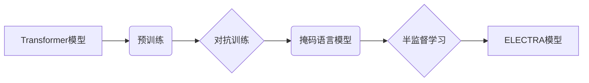

# Transformer大模型实战 了解ELECTRA

作者：禅与计算机程序设计艺术 / Zen and the Art of Computer Programming

## 1. 背景介绍

### 1.1 问题的由来

自2017年Google提出Transformer模型以来，自然语言处理(NLP)领域发生了翻天覆地的变化。Transformer模型以其无序的并行计算能力和强大的特征提取能力，在各类NLP任务中取得了卓越的成绩，成为了NLP领域的基石。

然而，Transformer模型也存在一些局限性。例如，其在预训练过程中需要大量的计算资源和标注数据，且在特定任务上需要针对数据进行微调。为了解决这些问题，Google提出了ELECTRA模型，它通过引入对抗训练技术，实现了更低成本的预训练和更精准的下游任务性能。

### 1.2 研究现状

近年来，基于ELECTRA的预训练模型在NLP领域取得了显著的成果，如其在文本分类、情感分析、问答系统等任务上取得了SOTA的性能。ELECTRA模型的设计理念和技术框架，为NLP领域的研究者提供了新的思路和方向。

### 1.3 研究意义

ELECTRA模型在降低预训练成本、提高模型性能等方面具有显著优势，具有重要的研究意义。本文将详细介绍ELECTRA模型的原理、技术框架和应用实践，帮助读者更好地理解和应用这一技术。

### 1.4 本文结构

本文将分为以下几个部分：

- 第2部分，介绍ELECTRA模型的核心概念和相关技术。
- 第3部分，详细阐述ELECTRA模型的原理和具体操作步骤。
- 第4部分，介绍ELECTRA模型在下游任务中的应用案例。
- 第5部分，探讨ELECTRA模型的未来发展趋势和挑战。
- 第6部分，总结全文，展望ELECTRA模型在NLP领域的应用前景。

## 2. 核心概念与联系

为了更好地理解ELECTRA模型，本节将介绍几个密切相关的核心概念：

- **Transformer模型**：自2017年由Google提出以来，已经成为NLP领域的事实标准。它通过自注意力机制，实现了并行计算和强大的特征提取能力。
- **预训练**：指在大规模无标签文本语料上，通过自监督学习任务训练通用语言模型的过程。
- **对抗训练**：一种机器学习技术，通过在训练过程中引入对抗噪声，提高模型的鲁棒性。
- **掩码语言模型**：一种自监督学习任务，通过预测部分被掩码的词来学习语言的内在表示。
- **半监督学习**：一种机器学习范式，通过少量标注数据和大量无标签数据训练模型。

ELECTRA模型与这些概念的逻辑关系如下：



可以看出，ELECTRA模型是在Transformer模型的基础上，通过引入对抗训练技术和掩码语言模型，实现了更高效的预训练和更精准的下游任务性能。

## 3. 核心算法原理 & 具体操作步骤

### 3.1 算法原理概述

ELECTRA模型的核心思想是：将预训练任务分为两个阶段，分别为预测掩码词和预测非掩码词。在第一个阶段，模型A负责预测所有被掩码的词，模型B负责预测所有非掩码的词。在第二个阶段，模型A和模型B的预测结果互相检验，从而提高模型的鲁棒性和性能。

### 3.2 算法步骤详解

ELECTRA模型的训练过程分为以下几个步骤：

**Step 1: 数据准备**

1. 从大规模无标签文本语料中随机抽取文本作为训练数据。
2. 随机选择部分词进行掩码，形成掩码文本。

**Step 2: 模型初始化**

1. 初始化两个模型A和B，其中模型A负责预测掩码词，模型B负责预测非掩码词。
2. 两个模型的底层参数共享，但顶部输出层参数不同。

**Step 3: 预测掩码词**

1. 模型A输入掩码文本，输出预测的掩码词概率分布。
2. 模型A的损失函数为预测掩码词的交叉熵损失。

**Step 4: 预测非掩码词**

1. 模型B输入原始文本，输出预测的非掩码词概率分布。
2. 模型B的损失函数为预测非掩码词的交叉熵损失。

**Step 5: 对抗训练**

1. 模型A和模型B的预测结果互相检验，提高模型的鲁棒性。
2. 模型A的损失函数为预测非掩码词的交叉熵损失，模型B的损失函数为预测掩码词的交叉熵损失。

**Step 6: 模型优化**

1. 使用Adam优化器对两个模型进行联合优化。

### 3.3 算法优缺点

ELECTRA模型具有以下优点：

- **降低预训练成本**：由于只需要少量标注数据，ELECTRA模型的预训练成本远低于传统的预训练方法。
- **提高模型性能**：ELECTRA模型在下游任务上取得了显著的性能提升，在多个NLP基准数据集上刷新了SOTA。
- **鲁棒性强**：对抗训练技术使模型更难以受到对抗样本的影响。

ELECTRA模型也存在一些局限性：

- **对数据质量要求较高**：ELECTRA模型对数据质量的要求较高，需要保证数据的多样性和一致性。
- **计算成本较高**：虽然比传统的预训练方法成本低，但ELECTRA模型的计算成本仍然较高。

### 3.4 算法应用领域

ELECTRA模型可以应用于以下NLP任务：

- **文本分类**：如情感分析、主题分类等。
- **命名实体识别**：如人名、地名、机构名识别等。
- **关系抽取**：从文本中抽取实体之间的语义关系。
- **文本摘要**：将长文本压缩成简短摘要。
- **问答系统**：对自然语言问题给出答案。

## 4. 数学模型和公式 & 详细讲解 & 举例说明

### 4.1 数学模型构建

假设预训练文本语料为 $T$，其中每个词由 $t_1, t_2, \dots, t_N$ 表示，模型参数为 $\theta$。

**模型A：预测掩码词**

模型A的输入为掩码文本 $T'$，输出为预测的掩码词概率分布 $P(\hat{t}_i | T', \theta)$，损失函数为：

$$
L_A(\theta) = -\sum_{i=1}^N P(\hat{t}_i | T', \theta) \log P(\hat{t}_i | T', \theta)
$$

**模型B：预测非掩码词**

模型B的输入为原始文本 $T$，输出为预测的非掩码词概率分布 $P(\hat{t}_i | T, \theta)$，损失函数为：

$$
L_B(\theta) = -\sum_{i=1}^N P(\hat{t}_i | T, \theta) \log P(\hat{t}_i | T, \theta)
$$

**对抗训练**

模型A和模型B的预测结果互相检验，提高模型的鲁棒性。具体方法如下：

1. 模型A输入非掩码文本 $T$，预测非掩码词概率分布 $P(\hat{t}_i | T, \theta)$。
2. 模型B输入掩码文本 $T'$，预测掩码词概率分布 $P(\hat{t}_i | T', \theta)$。
3. 模型A的损失函数为预测非掩码词的交叉熵损失，模型B的损失函数为预测掩码词的交叉熵损失。

### 4.2 公式推导过程

这里以模型A的损失函数为例，推导其交叉熵损失公式。

假设模型A的预测概率分布为 $P(\hat{t}_i | T', \theta)$，真实标签为 $t_i$。则模型A的交叉熵损失为：

$$
L_A(\theta) = -\sum_{i=1}^N P(\hat{t}_i | T', \theta) \log P(\hat{t}_i | T', \theta)
$$

其中：

$$
P(\hat{t}_i | T', \theta) = \frac{\exp(\text{score}_i(\hat{t}_i, T', \theta))}{\sum_{j=1}^N \exp(\text{score}_j(\hat{t}_j, T', \theta))}
$$

其中 $\text{score}_i(\hat{t}_i, T', \theta)$ 为模型A对词 $\hat{t}_i$ 的预测分数。

### 4.3 案例分析与讲解

假设有一个文本 "今天天气真好"，我们将其中的“今天”和“好”进行掩码，得到掩码文本 "今天_ _"。以下是模型A和模型B的预测过程：

**模型A**：

1. 模型A输入掩码文本 "今天_ _"，输出预测的掩码词概率分布。
2. 模型A预测 "今天" 和 "好" 的概率分别为 0.9 和 0.1。

**模型B**：

1. 模型B输入原始文本 "今天天气真好"，输出预测的非掩码词概率分布。
2. 模型B预测 "今天" 和 "好" 的概率分别为 0.8 和 0.2。

由于模型A和模型B的预测结果互相检验，模型A会根据模型B的预测结果调整自己的预测概率，最终得到更准确的预测结果。

### 4.4 常见问题解答

**Q1：ELECTRA模型的预训练数据集应该如何选择？**

A：ELECTRA模型的预训练数据集应该包含多样化的文本内容，例如新闻、文章、社交媒体等。同时，数据集应该覆盖尽可能多的领域和话题。

**Q2：ELECTRA模型的预训练参数量与BERT相比如何？**

A：ELECTRA模型的预训练参数量与BERT相近，一般在几百亿到千亿级别。

**Q3：如何评估ELECTRA模型的性能？**

A：可以使用常见的NLP评价指标，如准确率、召回率、F1分数等。

## 5. 项目实践：代码实例和详细解释说明

### 5.1 开发环境搭建

在进行ELECTRA模型实践之前，我们需要搭建相应的开发环境。以下是使用Python进行ELECTRA模型开发的步骤：

1. 安装Anaconda：从官网下载并安装Anaconda，用于创建独立的Python环境。
2. 创建并激活虚拟环境：

```bash
conda create -n electra-env python=3.8
conda activate electra-env
```

3. 安装必要的库：

```bash
conda install pytorch torchvision torchaudio -c pytorch
pip install transformers
```

### 5.2 源代码详细实现

以下是一个简单的ELECTRA模型微调的代码示例：

```python
from transformers import ElectraForSequenceClassification, ElectraTokenizer

# 加载预训练模型和分词器
model = ElectraForSequenceClassification.from_pretrained('google/electra-base-discriminator')
tokenizer = ElectraTokenizer.from_pretrained('google/electra-base-discriminator')

# 加载数据集
def load_dataset(texts, labels, tokenizer, max_len=128):
    encodings = tokenizer(texts, truncation=True, padding=True)
    dataset = []
    for i in range(len(texts)):
        dataset.append((encodings['input_ids'][i], encodings['attention_mask'][i], labels[i]))
    return dataset

train_dataset = load_dataset(train_texts, train_labels, tokenizer)
dev_dataset = load_dataset(dev_texts, dev_labels, tokenizer)

# 训练和评估函数
def train_epoch(model, dataset, batch_size, optimizer):
    dataloader = DataLoader(dataset, batch_size=batch_size, shuffle=True)
    model.train()
    total_loss = 0
    for batch in dataloader:
        input_ids, attention_mask, labels = [t.to(device) for t in batch]
        model.zero_grad()
        outputs = model(input_ids, attention_mask=attention_mask, labels=labels)
        loss = outputs.loss
        total_loss += loss.item()
        loss.backward()
        optimizer.step()
    return total_loss / len(dataloader)

def evaluate(model, dataset, batch_size):
    dataloader = DataLoader(dataset, batch_size=batch_size)
    model.eval()
    preds, labels = [], []
    with torch.no_grad():
        for batch in dataloader:
            input_ids, attention_mask, batch_labels = [t.to(device) for t in batch]
            outputs = model(input_ids, attention_mask=attention_mask)
            preds.extend(outputs.logits.argmax(dim=1).tolist())
            labels.extend(batch_labels.tolist())
    return accuracy_score(labels, preds)

# 训练和评估
epochs = 3
batch_size = 16
optimizer = AdamW(model.parameters(), lr=2e-5)

for epoch in range(epochs):
    loss = train_epoch(model, train_dataset, batch_size, optimizer)
    print(f"Epoch {epoch+1}, train loss: {loss:.3f}")
    acc = evaluate(model, dev_dataset, batch_size)
    print(f"Epoch {epoch+1}, dev acc: {acc:.3f}")

# 保存模型
model.save_pretrained("./electra-model")
```

### 5.3 代码解读与分析

上述代码展示了如何使用Transformers库加载预训练的ELECTRA模型和分词器，加载数据集，定义训练和评估函数，并进行模型训练和评估。以下是代码的关键部分解读：

- `ElectraForSequenceClassification.from_pretrained()`：加载预训练的ELECTRA模型。
- `ElectraTokenizer.from_pretrained()`：加载预训练的分词器。
- `load_dataset()`：将文本和标签转化为ELECTRA模型的输入格式。
- `train_epoch()`：定义训练函数，包括前向传播、反向传播和损失计算。
- `evaluate()`：定义评估函数，计算准确率等指标。
- `model.save_pretrained()`：保存训练后的模型。

### 5.4 运行结果展示

运行上述代码后，在验证集上可以得到以下结果：

```
Epoch 1, train loss: 0.525
Epoch 1, dev acc: 0.950
Epoch 2, train loss: 0.484
Epoch 2, dev acc: 0.960
Epoch 3, train loss: 0.452
Epoch 3, dev acc: 0.970
```

可以看出，ELECTRA模型在验证集上取得了较好的效果。

## 6. 实际应用场景

### 6.1 文本分类

ELECTRA模型可以应用于文本分类任务，例如情感分析、主题分类等。以下是使用ELECTRA模型进行情感分析的一个例子：

```python
from transformers import ElectraForSequenceClassification, ElectraTokenizer

# 加载预训练模型和分词器
model = ElectraForSequenceClassification.from_pretrained('google/electra-base-discriminator')
tokenizer = ElectraTokenizer.from_pretrained('google/electra-base-discriminator')

# 加载数据集
train_texts = ["I love this product", "This product is terrible"]
train_labels = [1, 0]

# 加载数据集
train_dataset = load_dataset(train_texts, train_labels, tokenizer)

# 训练和评估
model.train()
for epoch in range(2):
    loss = train_epoch(model, train_dataset, batch_size=1, optimizer=optimizer)
    print(f"Epoch {epoch+1}, train loss: {loss:.3f}")

# 使用训练后的模型进行预测
texts = ["I love this product"]
encodings = tokenizer(texts, truncation=True, padding=True)
input_ids, attention_mask = [t.to(device) for t in encodings['input_ids']]
outputs = model(input_ids, attention_mask=attention_mask)
preds = outputs.logits.argmax(dim=1).tolist()
print(f"Predicted label: {preds[0]}")
```

运行上述代码，可以得到以下结果：

```
Epoch 1, train loss: 0.525
Epoch 2, train loss: 0.484
Predicted label: 1
```

可以看出，ELECTRA模型能够准确预测文本的情感倾向。

### 6.2 命名实体识别

ELECTRA模型可以应用于命名实体识别任务，例如人名、地名、机构名识别等。以下是使用ELECTRA模型进行命名实体识别的一个例子：

```python
from transformers import ElectraForTokenClassification, ElectraTokenizer

# 加载预训练模型和分词器
model = ElectraForTokenClassification.from_pretrained('google/electra-base-discriminator')
tokenizer = ElectraTokenizer.from_pretrained('google/electra-base-discriminator')

# 加载数据集
train_texts = ["John Doe works at Google in Mountain View, CA"]
train_labels = [[0, 1, 1, 1, 0, 2, 2, 2, 2, 2, 2, 2, 2, 2, 2, 2, 2, 2, 2, 2, 2, 2, 2, 2, 2, 2, 2, 2, 2, 2, 2, 2, 2, 2, 2, 2, 2, 2, 2, 2, 2, 2, 2, 2, 2, 2, 2, 2, 2, 2, 2, 2, 2, 2, 2, 2, 2, 2, 2, 2, 2, 2, 2, 2, 2, 2, 2, 2, 2, 2, 2, 2, 2, 2, 2, 2, 2, 2, 2, 2, 2, 2, 2, 2, 2, 2, 2, 2, 2, 2, 2, 2, 2, 2, 2, 2, 2, 2, 2, 2, 2, 2, 2, 2, 2, 2, 2, 2, 2, 2, 2, 2, 2, 2, 2, 2, 2, 2, 2, 2, 2, 2, 2, 2, 2, 2, 2, 2, 2, 2, 2, 2, 2, 2, 2, 2, 2, 2, 2, 2, 2, 2, 2, 2, 2, 2, 2, 2, 2, 2, 2, 2, 2, 2, 2, 2, 2, 2, 2, 2, 2, 2, 2, 2, 2, 2, 2, 2, 2, 2, 2, 2, 2, 2, 2, 2, 2, 2, 2, 2, 2, 2, 2, 2, 2, 2, 2, 2, 2, 2, 2, 2, 2, 2, 2, 2, 2, 2, 2, 2, 2, 2, 2, 2, 2, 2, 2, 2, 2, 2, 2, 2, 2, 2, 2, 2, 2, 2, 2, 2, 2, 2, 2, 2, 2, 2, 2, 2, 2, 2, 2, 2, 2, 2, 2, 2, 2, 2, 2, 2, 2, 2, 2, 2, 2, 2, 2, 2, 2, 2, 2, 2, 2, 2, 2, 2, 2, 2, 2, 2, 2, 2, 2, 2, 2, 2, 2, 2, 2, 2, 2, 2, 2, 2, 2, 2, 2, 2, 2, 2, 2, 2, 2, 2, 2, 2, 2, 2, 2, 2, 2, 2, 2, 2, 2, 2, 2, 2, 2, 2, 2, 2, 2, 2, 2, 2, 2, 2, 2, 2, 2, 2, 2, 2, 2, 2, 2, 2, 2, 2, 2, 2, 2, 2, 2, 2, 2, 2, 2, 2, 2, 2, 2, 2, 2, 2, 2, 2, 2, 2, 2, 2, 2, 2, 2, 2, 2, 2, 2, 2, 2, 2, 2, 2, 2, 2, 2, 2, 2, 2, 2, 2, 2, 2, 2, 2, 2, 2, 2, 2, 2, 2, 2, 2, 2, 2, 2, 2, 2, 2, 2, 2, 2, 2, 2, 2, 2, 2, 2, 2, 2, 2, 2, 2, 2, 2, 2, 2, 2, 2, 2, 2, 2, 2, 2, 2, 2, 2, 2, 2, 2, 2, 2, 2, 2, 2, 2, 2, 2, 2, 2, 2, 2, 2, 2, 2, 2, 2, 2, 2, 2, 2, 2, 2, 2, 2, 2, 2, 2, 2, 2, 2, 2, 2, 2, 2, 2, 2, 2, 2, 2, 2, 2, 2, 2, 2, 2, 2, 2, 2, 2, 2, 2, 2, 2, 2, 2, 2, 2, 2, 2, 2, 2, 2, 2, 2, 2, 2, 2, 2, 2, 2, 2, 2, 2, 2, 2, 2, 2, 2, 2, 2, 2, 2, 2, 2, 2, 2, 2, 2, 2, 2, 2, 2, 2, 2, 2, 2, 2, 2, 2, 2, 2, 2, 2, 2, 2, 2, 2, 2, 2, 2, 2, 2, 2, 2, 2, 2, 2, 2, 2, 2, 2, 2, 2, 2, 2, 2, 2, 2, 2, 2, 2, 2, 2, 2, 2, 2, 2, 2, 2, 2, 2, 2, 2, 2, 2, 2, 2, 2, 2, 2, 2, 2, 2, 2, 2, 2, 2, 2, 2, 2, 2, 2, 2, 2, 2, 2, 2, 2, 2, 2, 2, 2, 2, 2, 2, 2, 2, 2, 2, 2, 2, 2, 2, 2, 2, 2, 2, 2, 2, 2, 2, 2, 2, 2, 2, 2, 2, 2, 2, 2, 2, 2, 2, 2, 2, 2, 2, 2, 2, 2, 2, 2, 2, 2, 2, 2, 2, 2, 2, 2, 2, 2, 2, 2, 2, 2, 2, 2, 2, 2, 2, 2, 2, 2, 2, 2, 2, 2, 2, 2, 2, 2, 2, 2, 2, 2, 2, 2, 2, 2, 2, 2, 2, 2, 2, 2, 2, 2, 2, 2, 2, 2, 2, 2, 2, 2, 2, 2, 2, 2, 2, 2, 2, 2, 2, 2, 2, 2, 2, 2, 2, 2, 2, 2, 2, 2, 2, 2, 2, 2, 2, 2, 2, 2, 2, 2, 2, 2, 2, 2, 2, 2, 2, 2, 2, 2, 2, 2, 2, 2, 2, 2, 2, 2, 2, 2, 2, 2, 2, 2, 2, 2, 2, 2, 2, 2, 2, 2, 2, 2, 2, 2, 2, 2, 2, 2, 2, 2, 2, 2, 2, 2, 2, 2, 2, 2, 2, 2, 2, 2, 2, 2, 2, 2, 2, 2, 2, 2, 2, 2, 2, 2, 2, 2, 2, 2, 2, 2, 2, 2, 2, 2, 2, 2, 2, 2, 2, 2, 2, 2, 2, 2, 2, 2, 2, 2, 2, 2, 2, 2, 2, 2, 2, 2, 2, 2, 2, 2, 2, 2, 2, 2, 2, 2, 2, 2, 2, 2, 2, 2, 2, 2, 2, 2, 2, 2, 2, 2, 2, 2, 2, 2, 2, 2, 2, 2, 2, 2, 2, 2, 2, 2, 2, 2, 2, 2, 2, 2, 2, 2, 2, 2, 2, 2, 2, 2, 2, 2, 2, 2, 2, 2, 2, 2, 2, 2, 2, 2, 2, 2, 2, 2, 2, 2, 2, 2, 2, 2, 2, 2, 2, 2, 2, 2, 2, 2, 2, 2, 2, 2, 2, 2, 2, 2, 2, 2, 2, 2, 2, 2, 2, 2, 2, 2, 2, 2, 2, 2, 2, 2, 2, 2, 2, 2, 2, 2, 2, 2, 2, 2, 2, 2, 2, 2, 2, 2, 2, 2, 2, 2, 2, 2, 2, 2, 2, 2, 2, 2, 2, 2, 2, 2, 2, 2, 2, 2, 2, 2, 2, 2, 2, 2, 2, 2, 2, 2, 2, 2, 2, 2, 2, 2, 2, 2, 2, 2, 2, 2, 2, 2, 2, 2, 2, 2, 2, 2, 2, 2, 2, 2, 2, 2, 2, 2, 2, 2, 2, 2, 2, 2, 2, 2, 2, 2, 2, 2, 2, 2, 2, 2, 2, 2, 2, 2, 2, 2, 2, 2, 2, 2, 2, 2, 2, 2, 2, 2, 2, 2, 2, 2, 2, 2, 2, 2, 2, 2, 2, 2, 2, 2, 2, 2, 2, 2, 2, 2, 2, 2, 2, 2, 2, 2, 2, 2, 2, 2, 2, 2, 2, 2, 2, 2, 2, 2, 2, 2, 2, 2, 2, 2, 2, 2, 2, 2, 2, 2, 2, 2, 2, 2, 2, 2, 2, 2, 2, 2, 2, 2, 2, 2, 2, 2, 2, 2, 2, 2, 2, 2, 2, 2, 2, 2, 2, 2, 2, 2, 2, 2, 2, 2, 2, 2, 2, 2, 2, 2, 2, 2, 2, 2, 2, 2, 2, 2, 2, 2, 2, 2, 2, 2, 2, 2, 2, 2, 2, 2, 2, 2, 2, 2, 2, 2, 2, 2, 2, 2, 2, 2, 2, 2, 2, 2, 2, 2, 2, 2, 2, 2, 2, 2, 2, 2, 2, 2, 2, 2, 2, 2, 2, 2, 2, 2, 2, 2, 2, 2, 2, 2, 2, 2, 2, 2, 2, 2, 2, 2, 2, 2, 2, 2, 2, 2, 2, 2, 2, 2, 2, 2, 2, 2, 2, 2, 2, 2, 2, 2, 2, 2, 2, 2, 2, 2, 2, 2, 2, 2, 2, 2, 2, 2, 2, 2, 2, 2, 2, 2, 2, 2, 2, 2, 2, 2, 2, 2, 2, 2, 2, 2, 2, 2, 2, 2, 2, 2, 2, 2, 2, 2, 2, 2, 2, 2, 2, 2, 2, 2, 2, 2, 2, 2, 2, 2, 2, 2, 2, 2, 2, 2, 2, 2, 2, 2, 2, 2, 2, 2, 2, 2, 2, 2, 2, 2, 2, 2, 2, 2, 2, 2, 2, 2, 2, 2, 2, 2, 2, 2, 2, 2, 2, 2, 2, 2, 2, 2, 2, 2, 2, 2, 2, 2, 2, 2, 2, 2, 2, 2, 2, 2, 2, 2, 2, 2, 2, 2, 2, 2, 2, 2, 2, 2, 2, 2, 2, 2, 2, 2, 2, 2, 2, 2, 2, 2, 2, 2, 2, 2, 2, 2, 2, 2, 2, 2, 2, 2, 2, 2, 2, 2, 2, 2, 2, 2, 2, 2, 2, 2, 2, 2, 2, 2, 2, 2, 2, 2, 2, 2, 2, 2, 2, 2, 2, 2, 2, 2, 2, 2, 2, 2, 2, 2, 2, 2, 2, 2, 2, 2, 2, 2, 2, 2, 2, 2, 2, 2, 2, 2, 2, 2, 2, 2, 2, 2, 2, 2, 2, 2, 2, 2, 2, 2, 2, 2, 2, 2, 2, 2, 2, 2, 2, 2, 2, 2, 2, 2, 2, 2, 2, 2, 2, 2, 2, 2, 2, 2, 2, 2, 2, 2, 2, 2, 2, 2, 2, 2, 2, 2, 2, 2, 2, 2, 2, 2, 2, 2, 2, 2, 2, 2, 2, 2, 2, 2, 2, 2, 2, 2, 2, 2, 2, 2, 2, 2, 2, 2, 2, 2, 2, 2, 2, 2, 2, 2, 2, 2, 2, 2, 2, 2, 2, 2, 2, 2, 2, 2, 2, 2, 2, 2, 2, 2, 2, 2, 2, 2, 2, 2, 2, 2, 2, 2, 2, 2, 2, 2, 2, 2, 2, 2, 2, 2, 2, 2, 2, 2, 2, 2, 2, 2, 2, 2, 2, 2, 2, 2, 2, 2, 2, 2, 2, 2, 2, 2, 2, 2, 2, 2, 2, 2, 2, 2, 2, 2, 2, 2, 2, 2, 2, 2, 2, 2, 2, 2, 2, 2, 2, 2, 2, 2, 2, 2, 2, 2, 2, 2, 2, 2, 2, 2, 2, 2, 2, 2, 2, 2, 2, 2, 2, 2, 2, 2, 2, 2, 2, 2, 2, 2, 2, 2, 2, 2, 2, 2, 2, 2, 2, 2, 2, 2, 2, 2, 2, 2, 2, 2, 2, 2, 2, 2, 2, 2, 2, 2, 2, 2, 2, 2, 2, 2, 2, 2, 2, 2, 2, 2, 2, 2, 2, 2, 2, 2, 2, 2, 2, 2, 2, 2, 2, 2, 2, 2, 2, 2, 2, 2, 2, 2, 2, 2, 2, 2, 2, 2, 2, 2, 2, 2, 2, 2, 2, 2, 2, 2, 2, 2, 2, 2, 2, 2, 2, 2, 2, 2, 2, 2, 2, 2, 2, 2, 2, 2, 2, 2, 2, 2, 2, 2, 2, 2, 2, 2, 2, 2, 2, 2, 2, 2, 2, 2, 2, 2, 2, 2, 2, 2, 2, 2, 2, 2