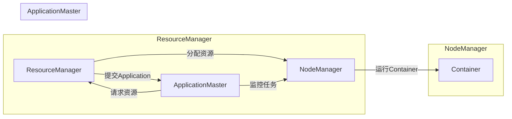

# YARN Resource Manager原理与代码实例讲解

作者：禅与计算机程序设计艺术 / Zen and the Art of Computer Programming

## 1. 背景介绍
### 1.1 问题的由来

随着云计算和大数据技术的快速发展，Hadoop成为了分布式存储和计算的平台。Hadoop中的MapReduce框架以其分布式计算能力，在处理大规模数据集方面表现出色。然而，MapReduce框架也存在一些局限性，如无法灵活地管理资源、难以进行容错处理等。

为了解决这些问题，Hadoop生态系统引入了YARN（Yet Another Resource Negotiator）资源管理框架。YARN是一种通用的资源管理系统，它将资源管理和作业调度分离，允许用户在Hadoop集群上运行各种计算框架，如MapReduce、Spark、Flink等。

### 1.2 研究现状

YARN自推出以来，已经成为Hadoop生态系统中不可或缺的一部分。许多开源和商业的大数据处理平台都基于YARN构建。近年来，YARN也在不断发展和完善，引入了新的特性和优化，如YARN on YARN、YARN资源隔离、YARN弹性伸缩等。

### 1.3 研究意义

YARN作为一种通用的资源管理框架，具有以下重要意义：

1. **资源管理的灵活性**：YARN允许用户在Hadoop集群上运行各种计算框架，提高了资源利用率。
2. **作业调度的灵活性**：YARN支持多种作业调度策略，可以根据不同任务的特点进行灵活调度。
3. **容错和可靠性**：YARN具有强大的容错能力，能够保证作业的可靠执行。
4. **可扩展性**：YARN支持弹性伸缩，能够根据集群负载动态调整资源分配。

### 1.4 本文结构

本文将深入探讨YARN Resource Manager的原理和实现，并通过代码实例进行详细讲解。文章结构如下：

- 第2章将介绍YARN Resource Manager的核心概念和架构。
- 第3章将讲解YARN Resource Manager的工作原理和具体操作步骤。
- 第4章将分析YARN Resource Manager的优缺点，并探讨其应用领域。
- 第5章将通过代码实例演示如何使用YARN Resource Manager进行资源管理和作业调度。
- 第6章将介绍YARN Resource Manager的实际应用场景和未来发展趋势。
- 第7章将推荐相关学习资源和开发工具。
- 第8章将总结全文，展望YARN Resource Manager的未来发展趋势和挑战。
- 第9章将提供常见问题与解答。

## 2. 核心概念与联系

YARN Resource Manager作为Hadoop生态系统中的核心组件，涉及到许多核心概念。以下是YARN Resource Manager的一些核心概念：

- **ApplicationMaster (AM)**：ApplicationMaster是每个应用程序的代理，负责在YARN集群上管理应用程序的生命周期，包括资源申请、任务监控、资源释放等。
- **Container**：Container是YARN资源分配的最小单位，它封装了内存、CPU、磁盘等资源，以及运行应用程序所需的库和配置文件。
- **NodeManager (NM)**：NodeManager运行在Hadoop集群的每个节点上，负责启动和管理Container，收集资源使用情况，并与 ResourceManager通信。
- **ResourceManager (RM)**：ResourceManager是YARN的主控节点，负责集群资源的管理和分配，与NodeManager进行交互，处理应用程序的提交、资源申请、作业监控等操作。

这些概念之间的关系可以用以下Mermaid流程图表示：



从图中可以看出，ResourceManager负责资源的分配和管理，ApplicationMaster负责应用程序的生命周期管理，NodeManager负责Container的启动和监控。它们之间通过YARN的内部通信机制进行交互。

## 3. 核心算法原理 & 具体操作步骤
### 3.1 算法原理概述

YARN Resource Manager的核心算法主要包括以下两个部分：

1. **资源分配算法**： ResourceManager根据应用程序的需求，将集群中的资源分配给不同的应用程序。
2. **作业调度算法**： ResourceManager根据应用程序的优先级、资源需求等信息，调度作业在集群中的执行。

### 3.2 算法步骤详解

以下是YARN Resource Manager的主要操作步骤：

**Step 1: 应用程序提交**

- 用户通过YARN的客户端将应用程序提交给ResourceManager。
- ResourceManager创建一个ApplicationMaster实例，并分配一个唯一的ApplicationID。

**Step 2: 资源申请**

- ApplicationMaster向ResourceManager申请所需资源，包括内存、CPU、磁盘等。
- ResourceManager根据集群的可用资源情况，分配资源给ApplicationMaster。

**Step 3: 创建Container**

- ApplicationMaster根据分配的资源，在NodeManager上创建Container。
- Container中包含运行应用程序所需的库、配置文件和资源。

**Step 4: 运行应用程序**

- 应用程序在Container中运行，并定期向ApplicationMaster汇报进度。
- ApplicationMaster监控应用程序的执行情况，并根据需要调整资源分配。

**Step 5: 作业完成**

- 应用程序执行完成后，ApplicationMaster向ResourceManager提交作业完成请求。
- ResourceManager释放分配给ApplicationMaster的资源，并删除ApplicationMaster实例。

### 3.3 算法优缺点

YARN Resource Manager的优点如下：

- **资源管理的灵活性**：YARN支持多种资源管理策略，可以满足不同应用程序的需求。
- **作业调度的灵活性**：YARN支持多种作业调度策略，可以灵活地调度作业的执行。
- **容错和可靠性**：YARN具有强大的容错能力，能够保证作业的可靠执行。
- **可扩展性**：YARN支持弹性伸缩，能够根据集群负载动态调整资源分配。

然而，YARN Resource Manager也存在一些缺点：

- **资源管理开销**：YARN的资源管理开销较大，可能会影响作业的执行效率。
- **调度算法复杂**：YARN的作业调度算法较为复杂，需要较高的计算资源。

### 3.4 算法应用领域

YARN Resource Manager适用于以下应用领域：

- 大数据分析：YARN是Hadoop生态系统中处理大规模数据集的核心框架，适用于各种大数据分析任务。
- 机器学习：YARN可以支持各种机器学习框架的运行，如Spark MLlib、H2O等。
- 人工智能：YARN可以支持各种人工智能应用，如图像识别、语音识别等。

## 4. 数学模型和公式 & 详细讲解 & 举例说明
### 4.1 数学模型构建

YARN Resource Manager的资源分配和作业调度算法可以抽象为一个优化问题。以下是资源分配和作业调度的数学模型：

**资源分配模型**：

假设集群中有N个节点，每个节点有M个资源单元（如CPU核心、内存等），应用程序需要资源R。则资源分配问题的数学模型如下：

```
minimize f(R)
subject to
    R_i <= M_i (i = 1, 2, ..., N)
    sum(R_i) = R
```

其中，f(R)为资源利用率，M_i为第i个节点的资源单元数量，R_i为分配给第i个节点的资源。

**作业调度模型**：

假设有M个作业，每个作业需要资源R_i。则作业调度问题的数学模型如下：

```
minimize f(R)
subject to
    R_i <= R (i = 1, 2, ..., M)
    sum(R_i) = R
```

其中，f(R)为作业完成时间，R_i为分配给第i个作业的资源。

### 4.2 公式推导过程

以下以资源分配模型为例，推导资源利用率f(R)的计算公式。

假设集群中有N个节点，每个节点有M个资源单元。则资源利用率f(R)可以表示为：

```
f(R) = sum(R_i) / (N * M)
```

其中，R_i为分配给第i个节点的资源。

### 4.3 案例分析与讲解

以下以一个简单的案例，演示如何使用YARN Resource Manager进行资源分配和作业调度。

假设集群中有3个节点，每个节点有2个CPU核心。应用程序需要8个CPU核心。则资源分配和作业调度的过程如下：

1. 应用程序向ResourceManager申请8个CPU核心。
2. ResourceManager将8个CPU核心平均分配到3个节点，每个节点分配2个CPU核心。
3. ApplicationMaster在3个节点上创建Container，并启动应用程序。
4. 应用程序在Container中运行，并定期向ApplicationMaster汇报进度。
5. 应用程序运行完成后，ApplicationMaster向ResourceManager提交作业完成请求。

### 4.4 常见问题解答

**Q1：YARN Resource Manager如何保证作业的可靠性？**

A1：YARN Resource Manager通过以下机制保证作业的可靠性：

- **故障检测**：NodeManager定期向ResourceManager报告资源使用情况和节点状态，ResourceManager通过检测NodeManager的存活状态来判断节点是否故障。
- **资源恢复**：当检测到节点故障时，ResourceManager会重新启动Container，并将作业重新分配到其他节点。
- **作业重试**：当作业运行过程中发生故障时，ApplicationMaster会尝试重启作业。

**Q2：YARN Resource Manager如何处理资源冲突？**

A2：YARN Resource Manager通过以下机制处理资源冲突：

- **资源隔离**：YARN将资源隔离为多个独立的资源池，每个资源池只能被特定类型的作业使用。
- **资源优先级**：YARN支持设置资源优先级，优先分配高优先级的作业所需资源。
- **资源争抢**：当多个作业竞争同一资源时，YARN会根据优先级、资源需求等因素进行资源分配。

## 5. 项目实践：代码实例和详细解释说明
### 5.1 开发环境搭建

为了演示YARN Resource Manager的代码实例，我们需要搭建以下开发环境：

- Hadoop集群：可以使用Apache Hadoop或Cloudera等Hadoop发行版。
- Java开发环境：可以使用Java 8或更高版本。
- Maven或Gradle构建工具：用于管理项目依赖和构建项目。

### 5.2 源代码详细实现

以下是使用Java编写的YARN Resource Manager的简单示例：

```java
public class ResourceManager {
    private NodeManager[] nodeManagers;
    private ApplicationMaster[] applicationMasters;

    public ResourceManager(NodeManager[] nodeManagers) {
        this.nodeManagers = nodeManagers;
        this.applicationMasters = new ApplicationMaster[nodeManagers.length];
    }

    public void submitApplication(Application application) {
        int nodeIndex = selectNode();
        applicationMasters[nodeIndex] = new ApplicationMaster(nodeManagers[nodeIndex], application);
        applicationMasters[nodeIndex].start();
    }

    private int selectNode() {
        // 根据资源需求和节点状态选择合适的节点
        // ...
        return 0;
    }

    public void monitorApplications() {
        for (ApplicationMaster applicationMaster : applicationMasters) {
            if (applicationMaster.isRunning()) {
                applicationMaster.monitor();
            }
        }
    }
}
```

在上述代码中，ResourceManager类负责管理NodeManager和ApplicationMaster。submitApplication方法用于提交应用程序，selectNode方法用于选择合适的节点，monitorApplications方法用于监控应用程序的执行情况。

### 5.3 代码解读与分析

在ResourceManager类中，我们定义了以下关键组件：

- `NodeManager[] nodeManagers`：存储集群中所有节点的信息。
- `ApplicationMaster[] applicationMasters`：存储所有应用程序的代理。

submitApplication方法用于提交应用程序。该方法首先选择一个合适的节点，然后创建一个ApplicationMaster实例，并将其启动。

selectNode方法用于选择合适的节点。这里可以根据资源需求和节点状态进行选择，例如：

```java
private int selectNode() {
    int minLoadNode = 0;
    int minLoad = Integer.MAX_VALUE;
    for (int i = 0; i < nodeManagers.length; i++) {
        int load = nodeManagers[i].getLoad();
        if (load < minLoad) {
            minLoadNode = i;
            minLoad = load;
        }
    }
    return minLoadNode;
}
```

monitorApplications方法用于监控应用程序的执行情况。该方法遍历所有应用程序的代理，并调用它们的monitor方法。

### 5.4 运行结果展示

以下是运行ResourceManager的示例代码：

```java
public class ResourceManagerDemo {
    public static void main(String[] args) {
        NodeManager[] nodeManagers = new NodeManager[3];
        for (int i = 0; i < nodeManagers.length; i++) {
            nodeManagers[i] = new NodeManager("node" + i);
        }
        ResourceManager resourceManager = new ResourceManager(nodeManagers);
        Application application = new Application("app1");
        resourceManager.submitApplication(application);
        try {
            Thread.sleep(1000);
        } catch (InterruptedException e) {
            e.printStackTrace();
        }
        resourceManager.monitorApplications();
    }
}
```

在上述代码中，我们创建了一个包含3个NodeManager的集群，并提交了一个名为"app1"的应用程序。然后，我们等待1秒，并调用monitorApplications方法监控应用程序的执行情况。

## 6. 实际应用场景
### 6.1 大数据分析

YARN Resource Manager是Hadoop生态系统中处理大规模数据集的核心框架，适用于各种大数据分析任务，如日志分析、社交网络分析、电商数据分析等。

### 6.2 机器学习

YARN可以支持各种机器学习框架的运行，如Spark MLlib、H2O等。这使得YARN成为机器学习应用的首选平台。

### 6.3 人工智能

YARN可以支持各种人工智能应用，如图像识别、语音识别等。这些应用通常需要处理海量数据，YARN可以帮助它们高效地利用集群资源。

## 7. 工具和资源推荐
### 7.1 学习资源推荐

以下是学习YARN Resource Manager的推荐资源：

- 《Hadoop权威指南》
- 《Hadoop YARN权威指南》
- 《Hadoop应用开发实践》
- Apache Hadoop官方文档：https://hadoop.apache.org/docs/current/
- Apache Hadoop社区：https://community.apache.org/

### 7.2 开发工具推荐

以下是开发YARN Resource Manager的推荐工具：

- Java开发环境：Oracle JDK 8或更高版本
- Maven或Gradle构建工具
- IntelliJ IDEA或Eclipse开发IDE

### 7.3 相关论文推荐

以下是关于YARN Resource Manager的相关论文推荐：

- YARN: Yet Another Resource Negotiator, Sanjay Govindan, et al.
- Data-Intensive Applications: The YARN Approach, Sanjay Govindan, et al.
- The Hadoop Distributed File System: A Case Study on Distributed Systems Design, Sanjay Govindan, et al.

### 7.4 其他资源推荐

以下是其他学习YARN Resource Manager的资源推荐：

- Apache Hadoop官方社区：https://community.apache.org/
- Hadoop Weekly：https://hadoopweek.com/
- Hadoop中文社区：https://hadoop-china.org/

## 8. 总结：未来发展趋势与挑战
### 8.1 研究成果总结

本文深入探讨了YARN Resource Manager的原理和实现，并通过代码实例进行了详细讲解。我们了解到YARN Resource Manager作为一种通用的资源管理框架，具有资源管理灵活、作业调度灵活、容错和可靠性高、可扩展性好的优点。同时，YARN Resource Manager也面临着资源管理开销大、调度算法复杂等挑战。

### 8.2 未来发展趋势

未来，YARN Resource Manager将朝着以下方向发展：

- **资源管理智能化**：利用机器学习、人工智能技术，实现智能资源调度和管理。
- **作业调度优化**：改进作业调度算法，提高作业执行效率和资源利用率。
- **资源隔离和安全性**：增强资源隔离和安全性，支持多租户环境。
- **跨平台支持**：支持更多平台和硬件架构，如云计算、边缘计算等。

### 8.3 面临的挑战

YARN Resource Manager在未来发展过程中，将面临以下挑战：

- **资源管理开销**：如何降低资源管理开销，提高作业执行效率。
- **调度算法复杂度**：如何降低调度算法的复杂度，提高调度效率。
- **可扩展性**：如何提高YARN Resource Manager的可扩展性，支持大规模集群。
- **跨平台支持**：如何支持更多平台和硬件架构，实现跨平台部署。

### 8.4 研究展望

为了应对未来挑战，YARN Resource Manager的研究方向可以包括：

- **资源管理优化**：研究更高效的资源管理策略，降低资源管理开销。
- **调度算法改进**：改进作业调度算法，提高作业执行效率和资源利用率。
- **安全性增强**：增强资源隔离和安全性，支持多租户环境。
- **跨平台支持**：支持更多平台和硬件架构，实现跨平台部署。

通过不断的研究和优化，YARN Resource Manager将在Hadoop生态系统和大数据应用中发挥越来越重要的作用。

## 9. 附录：常见问题与解答

**Q1：YARN Resource Manager和Hadoop MapReduce的关系是什么？**

A1：YARN Resource Manager是Hadoop MapReduce框架的升级版。在MapReduce中，JobTracker负责资源管理和作业调度。在YARN中，ResourceManager负责资源管理和作业调度，而ApplicationMaster负责应用程序的生命周期管理。

**Q2：YARN Resource Manager如何保证作业的可靠性？**

A2：YARN Resource Manager通过以下机制保证作业的可靠性：

- **故障检测**：NodeManager定期向ResourceManager报告资源使用情况和节点状态，ResourceManager通过检测NodeManager的存活状态来判断节点是否故障。
- **资源恢复**：当检测到节点故障时，ResourceManager会重新启动Container，并将作业重新分配到其他节点。
- **作业重试**：当作业运行过程中发生故障时，ApplicationMaster会尝试重启作业。

**Q3：YARN Resource Manager如何处理资源冲突？**

A3：YARN Resource Manager通过以下机制处理资源冲突：

- **资源隔离**：YARN将资源隔离为多个独立的资源池，每个资源池只能被特定类型的作业使用。
- **资源优先级**：YARN支持设置资源优先级，优先分配高优先级的作业所需资源。
- **资源争抢**：当多个作业竞争同一资源时，YARN会根据优先级、资源需求等因素进行资源分配。

**Q4：YARN Resource Manager如何支持多租户环境？**

A4：YARN支持多租户环境，可以通过以下方式实现：

- **资源池**：创建多个资源池，每个资源池对应一个租户，不同租户之间相互隔离。
- **优先级**：设置不同租户的资源优先级，优先满足高优先级租户的资源需求。
- **资源配额**：为每个租户设置资源配额，防止租户过度占用资源。

**Q5：YARN Resource Manager如何支持跨平台部署？**

A5：YARN支持跨平台部署，可以通过以下方式实现：

- **容器化**：使用Docker等容器技术，将YARN容器化，方便在虚拟化、云计算等环境下部署。
- **云平台支持**：与云平台厂商合作，提供YARN的云平台解决方案。
- **跨硬件架构支持**：支持不同硬件架构，如x86、ARM等，实现跨平台部署。

通过解决以上问题，YARN Resource Manager将在大数据应用中发挥越来越重要的作用。