# YOLOv4原理与代码实例讲解

作者：禅与计算机程序设计艺术 / Zen and the Art of Computer Programming

## 1. 背景介绍
### 1.1 问题的由来

目标检测是计算机视觉领域的一个重要任务，旨在从图像中自动识别和定位其中的多个物体。随着深度学习技术的快速发展，基于深度学习的目标检测算法取得了巨大的进步。YOLO（You Only Look Once）系列算法因其速度快、准确率高等特点，成为了目标检测领域的主流方法之一。

YOLOv4是YOLO系列算法的第四个版本，在YOLOv3的基础上进行了多项改进，进一步提升了检测速度和准确率。本文将深入解析YOLOv4的原理，并给出代码实例讲解。

### 1.2 研究现状

目前，目标检测领域的主流算法可以分为以下几类：

- **基于Region Proposal的方法**：如R-CNN系列、Fast R-CNN、Faster R-CNN等，通过提取候选区域（Region Proposal）来缩小搜索范围，提高检测效率。

- **基于Anchor-based的方法**：如SSD、RetinaNet等，通过预设一系列锚框（Anchor Box）来检测目标，简化了候选区域的生成过程。

- **基于End-to-End的方法**：如YOLO、YOLOv2、YOLOv3等，将目标检测任务视为回归问题，直接从图像中预测目标的类别和位置。

### 1.3 研究意义

YOLOv4作为一种基于End-to-End的目标检测算法，在速度和准确率上取得了较好的平衡，具有以下研究意义：

1. **速度快**：YOLOv4的检测速度快，适合实时视频监控、自动驾驶等场景。
2. **准确率高**：YOLOv4在多个公开数据集上取得了SOTA（State-of-the-Art）性能。
3. **易于实现**：YOLOv4代码结构清晰，易于理解和实现。

### 1.4 本文结构

本文将分为以下几个部分：

- 第2部分介绍YOLOv4的核心概念与联系。
- 第3部分详细解析YOLOv4的算法原理和具体操作步骤。
- 第4部分讲解YOLOv4的数学模型和公式。
- 第5部分给出YOLOv4的代码实例和详细解释说明。
- 第6部分探讨YOLOv4在实际应用场景中的应用。
- 第7部分总结YOLOv4的未来发展趋势和挑战。
- 第8部分提供YOLOv4相关的学习资源、开发工具和参考文献。

## 2. 核心概念与联系

为了更好地理解YOLOv4，我们先介绍一些核心概念及其相互联系。

- **目标检测**：目标检测是指从图像中识别和定位多个物体的任务。
- **锚框（Anchor Box）**：锚框是预设的用于检测目标的矩形框，通常使用先验知识进行选择。
- **特征金字塔网络（FPN）**：特征金字塔网络是一种特征融合网络，用于提高不同尺度的目标检测能力。
- **Darknet**：Darknet是YOLOv4使用的骨干网络，采用残差网络结构。
- **CSPDarknet53**：CSPDarknet53是Darknet的升级版本，进一步提升了检测速度和准确率。

它们之间的逻辑关系如下：

```mermaid
graph LR
A[目标检测] --> B[锚框(Anchor Box)]
A --> C[特征金字塔网络(FPN)]
A --> D[Darknet]
A --> E[CSPDarknet53]
B --> F[目标检测]
C --> F
D --> F
E --> F
```

可以看出，锚框用于确定目标的边界框，特征金字塔网络用于提取不同尺度的特征，Darknet和CSPDarknet53分别作为骨干网络，最终完成目标检测任务。

## 3. 核心算法原理 & 具体操作步骤
### 3.1 算法原理概述

YOLOv4的目标检测流程可以概括为以下几个步骤：

1. **输入图像**：将输入图像送入骨干网络CSPDarknet53，得到不同尺度的特征图。
2. **特征融合**：将不同尺度的特征图通过特征金字塔网络FPN进行融合，得到更丰富的特征表示。
3. **预测目标**：将融合后的特征图输入Darknet网络，在每个网格上预测目标的类别和边界框。
4. **NMS（非极大值抑制）**：对预测结果进行NMS处理，去除重复的目标框，得到最终的检测结果。

### 3.2 算法步骤详解

**Step 1：输入图像**

将输入图像送入骨干网络CSPDarknet53，得到多个不同尺度的特征图。CSPDarknet53的网络结构如下：

```mermaid
graph LR
A[输入] --> B[Conv]
B --> C[Conv]
C --> D[MaxPool]
D --> E[Conv]
E --> F[Conv]
F --> G[MaxPool]
G --> H[Conv]
H --> I[Conv]
I --> J[MaxPool]
J --> K[Conv]
K --> L[Conv]
L --> M[MaxPool]
M --> N[Conv]
N --> O[Conv]
O --> P[Conv]
P --> Q[Conv]
Q --> R[Conv]
R --> S[Conv]
S --> T[Conv]
T --> U[Conv]
U --> V[Conv]
V --> W[Conv]
W --> X[Conv]
X --> Y[Conv]
Y --> Z[Conv]
Z --> A
```



**Step 2：特征融合**

将CSPDarknet53的输出特征图进行融合，得到不同尺度的特征图。

**Step 3：预测目标**

将融合后的特征图输入Darknet网络，在每个网格上预测目标的类别和边界框。

**Step 4：NMS**

对预测结果进行NMS处理，去除重复的目标框，得到最终的检测结果。

### 3.3 算法优缺点

YOLOv4的优点如下：

- **速度快**：YOLOv4的检测速度快，适合实时视频监控、自动驾驶等场景。
- **准确率高**：YOLOv4在多个公开数据集上取得了SOTA性能。
- **易于实现**：YOLOv4代码结构清晰，易于理解和实现。

YOLOv4的缺点如下：

- **对小目标的检测效果较差**：YOLOv4对小目标的检测效果相对较差，需要针对小目标设计专门的锚框和损失函数。
- **对复杂场景的鲁棒性较差**：YOLOv4对复杂场景的鲁棒性较差，容易受到遮挡、光照变化等因素的影响。

### 3.4 算法应用领域

YOLOv4在以下领域有广泛的应用：

- **视频监控**：实时检测视频中的目标，实现入侵检测、异常行为监测等功能。
- **自动驾驶**：检测道路上的行人、车辆、交通标志等，为自动驾驶系统提供决策支持。
- **机器人视觉**：检测机器人周围环境中的障碍物、目标等，实现导航和避障等功能。
- **工业检测**：检测工业设备上的缺陷、故障等，实现自动化生产检测。

## 4. 数学模型和公式 & 详细讲解 & 举例说明
### 4.1 数学模型构建

YOLOv4的数学模型主要包括以下几个方面：

- **锚框生成**：根据先验知识生成预设的锚框。
- **损失函数**：计算预测框与真实框之间的误差，用于优化模型参数。
- **目标检测**：预测目标的类别和位置。

**锚框生成**：

锚框的生成通常采用先验知识，如IoU（Intersection over Union）等指标，确定锚框的大小和位置。

**损失函数**：

YOLOv4的损失函数主要包括以下几部分：

- **分类损失**：使用交叉熵损失计算预测类别与真实类别之间的误差。
- **位置损失**：使用均方误差损失计算预测框中心与真实框中心之间的误差。
- **置信度损失**：使用对数似然损失计算预测框置信度与真实置信度之间的误差。

**目标检测**：

目标检测的目标是预测目标的类别和位置。对于每个锚框，预测其类别和边界框，并与真实框进行比较。

### 4.2 公式推导过程

以下以分类损失为例，介绍YOLOv4的损失函数推导过程。

假设锚框的类别为 $C$，真实框的类别为 $y$，预测框的置信度为 $\hat{p}$，则分类损失函数为：

$$
L_{cls} = -[y \log \hat{p} + (1-y) \log (1-\hat{p})]
$$

其中，$\hat{p}$ 为预测框属于类别 $y$ 的概率。

### 4.3 案例分析与讲解

以下以COCO数据集上的一个目标检测任务为例，讲解YOLOv4的检测过程。

**步骤 1**：输入图像

将COCO数据集中的图像送入CSPDarknet53骨干网络，得到多个不同尺度的特征图。

**步骤 2**：特征融合

将不同尺度的特征图通过FPN进行融合，得到更丰富的特征表示。

**步骤 3**：预测目标

将融合后的特征图输入Darknet网络，在每个网格上预测目标的类别和边界框。

**步骤 4**：NMS

对预测结果进行NMS处理，去除重复的目标框，得到最终的检测结果。

### 4.4 常见问题解答

**Q1：YOLOv4的检测速度为什么这么快？**

A：YOLOv4的检测速度快主要得益于以下原因：
- 使用了高效的骨干网络CSPDarknet53，减少了计算量。
- 采用End-to-End的检测方法，避免了Region Proposal等步骤，减少了计算量。
- 使用了Anchor-based的方法，简化了候选区域的生成过程。

**Q2：YOLOv4对小目标的检测效果如何？**

A：YOLOv4对小目标的检测效果相对较差，主要原因是锚框的设计没有充分考虑小目标的特点。针对小目标，可以采用以下策略：
- 设计专门用于检测小目标的锚框。
- 使用加权损失函数，降低小目标的损失权重。

**Q3：YOLOv4如何应对复杂场景？**

A：YOLOv4对复杂场景的鲁棒性较差，主要原因是锚框的设计没有充分考虑复杂场景的特点。针对复杂场景，可以采用以下策略：
- 使用多尺度锚框，提高对不同尺度目标的检测能力。
- 使用数据增强，提高模型对复杂场景的适应性。

## 5. 项目实践：代码实例和详细解释说明
### 5.1 开发环境搭建

在进行YOLOv4项目实践前，我们需要准备好开发环境。以下是使用Python进行YOLOv4开发的步骤：

1. 安装Anaconda：从官网下载并安装Anaconda，用于创建独立的Python环境。

2. 创建并激活虚拟环境：
```bash
conda create -n yolo-env python=3.8
conda activate yolo-env
```

3. 安装PyTorch、torchvision、torchmetrics等库：
```bash
pip install torch torchvision torchaudio torchmetrics
```

4. 下载YOLOv4源代码：从GitHub克隆YOLOv4的官方代码库。
```bash
git clone https://github.com/ultralytics/yolov4
```

5. 进入YOLOv4代码目录：
```bash
cd yolo-v4
```

### 5.2 源代码详细实现

YOLOv4的源代码主要包括以下几个部分：

- **models.py**：定义了Darknet网络结构和CSPDarknet53网络结构。
- **data.py**：定义了数据加载和预处理函数。
- **utils.py**：定义了常用的工具函数，如图像加载、NMS等。
- **train.py**：定义了训练函数。
- **test.py**：定义了测试函数。

以下以train.py为例，讲解训练函数的实现：

```python
import torch.optim as optim
from models import *  # 导入网络定义
from utils.datasets import *  # 导入数据加载和预处理
from utils.utils import *  # 导入工具函数
from utils.parse_config import *  # 导入配置文件解析
import torch

def train(args):
    # 创建数据加载器
    train_dataset = YOLODataset(args, train=True, batch_size=args.batch_size)
    valid_dataset = YOLODataset(args, train=False, batch_size=args.batch_size)
    dataloader = DataLoader(train_dataset, shuffle=True, batch_size=args.batch_size, num_workers=4,
                            pin_memory=True)

    # 创建模型
    device = torch.device('cuda' if torch.cuda.is_available() else 'cpu')
    model = Darknet(args.config, args).to(device)

    # 设置优化器
    optimizer = optim.Adam(model.parameters(), lr=args.lr)

    # 训练过程
    for epoch in range(args.epochs):
        # 训练阶段
        for batch in dataloader:
            # ... (训练代码)

        # 评估阶段
        # ... (评估代码)

        # 保存模型
        torch.save(model.state_dict(), f'weights/{epoch}.pth')

if __name__ == '__main__':
    # 解析命令行参数
    parser = argparse.ArgumentParser()
    # ... (添加参数)
    args = parser.parse_args()

    # 开始训练
    train(args)
```

### 5.3 代码解读与分析

从以上代码可以看出，训练函数主要包含以下几个步骤：

1. 创建数据加载器：使用YOLODataset类加载训练数据和验证数据。
2. 创建模型：加载Darknet模型，并将其移动到GPU上。
3. 设置优化器：使用Adam优化器进行参数优化。
4. 训练过程：对训练数据进行迭代训练，并在验证集上进行评估。
5. 保存模型：将训练好的模型参数保存到文件中。

### 5.4 运行结果展示

以下是在COCO数据集上训练YOLOv4模型的结果：

```
Epoch 1/100
100%|████████████████████████████████████████████████████████████████████████████████████████████████████████████████████████████████████████████████████████████████████████████████████████████████████████████████████████████████████████████████████████████████████████████████████████████████████████████████████████████████████████████████████████████████████████████████████████████████████████████████████████████████████████████████████████████████████████████████████████████████████████████████████████████████████████████████████████████████████████████████████████████████████████████████████████████████████████████████████████████████████████████████████████████████████████████████████████████████████████████████████████████████████████████████████████████████████████████████████████████████████████████████████████████████████████████████████████████████████████████████████████████████████████████████████████████████████████████████████████████████████████████████████████████████████████████████████████████████████████████████████████████████████████████████████████████████████████████████████████████████████████████████████████████████████████████████████████████████████████████████████████████████████████████████████████████████████████████████████████████████████████████████████████████████████████████████████████████████████████████████████████████████████████████████████████████████████████████████████████████████████████████████████████████████████████████████████████████████████████████████████████████████████████████████████████████████████████████████████████████████████████████████████████████████████████████████████████████████████████████████████████████████████████████████████████████████████████████████████████████████████████████████████████████████████████████████████████████████████████████████████████████████████████████████████████████████████████████████████████████████████████████████████████████████████████████████████████████████████████████████████████████████████████████████████████████████████████████████████████████████████████████████████████████████████████████████████████████████████████████████████████████████████████████████████████████████████████████████████████████████████████████████████████████████████████████████████████████████████████████████████████████████████████████████████████████████████████████████████████████████████████████████████████████████████████████████████████████████████████████████████████████████████████████████████████████████████████████████████████████████████████████████████████████████████████████████████████████████████████████████████████████████████████████████████████████████████████████████████████████████████████████████████████████████████████████████████████████████████████████████████████████████████████████████████████████████████████████████████████████████████████████████████████████████████████████████████████████████████████████████████████████████████████████████████████████████████████████████████████████████████████████████████████████████████████████████████████████████████████████████████████████████████████████████████████████████████████████████████████████████████████████████████████████████████████████████████████████████████████████████████████████████████████████████████████████████████████████████████████████████████████████████████████████████████████████████████████████████████████████████████████████████████████████████████████████████████████████████████████████████████████████████████████████████████████████████████████████████████████████████████████████████████████████████████████████████████████████████████████████████████████████████████████████████████████████████████████████████████████████████████████████████████████████████████████████████████████████████████████████████████████████████████████████████████████████████████████████████████████████████████████████████████████████████████████████████████████████████████████████████████████████████████████████████████████████████████████████████████████████████████████████████████████████████████████████████████████████████████████████████████████████████████████████████████████████████████████████████████████████████████████████████████████████████████████████████████████████████████████████████████████████████████████████████████████████████████████████████████████████████████████████████████████████████████████████████████████████████████████████████████████████████████████████████████████████████████████████████████████████████████████████████████████████████████████████████████████████████████████████████████████████████████████████████████████████████████████████████████████████████████████████████████████████████████████████████████████████████████████████████████████████████████████████████████████████████████████████████████████████████████████████████████████████████████████████████████████████████████████████████████████████████████████████████████████████████████████████████████████████████████████████████████████████████████████████████████████████████████████████████████████████████████████████████████████████████████████████████████████████████████████████████████████████████████████████████████████████████████████████████████████████████████████████████████████████████████████████████████████████████████████████████████████████████████████████████████████████████████████████████████████████████████████████████████████████████████████████████████████████████████████████████████████████████████████████████████████████████████████████████████████████████████████████████████████████████████████████████████████████████████████████████████████████████████████████████████████████████████████████████████████████████████████████████████████████████████████████████████████████████████████████████████████████████████████████████████████████████████████████████████████████████████████████████████████████████████████████████████████████████████████████████████████████████████████████████████████████████████████████████████████████████████████████████████████████████████████████████████████████████████████████████████████████████████████████████████████████████████████████████████████████████████████████████████████████████████████████████████████████████████████████████████████████████████████████████████████████████████████████████████████████████████████████████████████████████████████████████████████████████████████████████████████████████████████████████████████████████████████████████████████████████████████████████████████████████████████████████████████████████████████████████████████████████████████████████████████████████████████████████████████████████████████████████████████████████████████████████████████████████████████████████████████████████████████████████████████████████████████████████████████████████████████████████████████████████████████████████████████████████████████████████████████████████████████████████████████████████████████████████████████████████████████████████████████████████████████████████████████████████████████████████████████████████████████████████████████████████████████████████████████████████████████████████████████████████████████████████████████████████████████████████████████████████████████████████████████████████████████████████████████████████████████████████████████████████████████████████████████████████████████████████████████████████████████████████████████████████████████████████████████████████████████████████████████████████████████████████████████████████████████████████████████████████████████████████████████████████████████████████████████████████████████████████████████████████████████████████████████████████████████████████████████████████████████████████████████████████████████████████████████████████████████████████████████████████████████████████████████████████████████████████████████████████████████████████████████████████████████████████████████████████████████████████████████████████████████████████████████████████████████████████████████████████████████████████████████████████████████████████████████████████████████████████████████████████████████████████████████████████████████████████████████████████████████████████████████████████████████████████████████████████████████████████████████████████████████████████████████████████████████████████████████████████████████████████████████████████████████████████████████████████████████████████████████████████████████████████████████████████████████████████████████████████████████████████████████████████████████████████████████████████████████████████████████████████████████████████████████████████████████████████████████████████████████████████████████████████████████████████████████████████████████████████████████████████████████████████████████████████████████████████████████████████████████████████████████████████████████████████████████████████████████████████████████████████████████████████████████████████████████████████████████████████████████████████████████████████████████████████████████████████████████████████████████████████████████████████████████████████████████████████████████████████████████████████████████████████████████████████████████████████████████████████████████████████████████████████████████████████████████████████████████████████████████████████████████████████████████████████████████████████████████████████████████████████████████████████████████████████████████████████████████████████████████████████████████████████████████████████████████████████████████████████████████████████████████████████████████████████████████████████████████████████████████████████████████████████████████████████████████████████████████████████████████████████████████████████████████████████████████████████████████████████████████████████████████████████████████████████████████████████████████████████████████████████████████████████████████████████████████████████████████████████████████████████████████████████████████████████████████████████████████████████████████████████████████████████████████████████████████████████████████████████████████████████████████████████████████████████████████████████████████████████████████████████████████████████████████████████████████████████████████████████████████████████████████████████████████████████████████████████████████████████████████████████████████████████████████████████████████████████████████████████████████████████████████████████████████████████████████████████████████████████████████████████████████████████████████████████████████████████████████████████████████████████████████████████████████████████████████████████████████████████████████████████████████████████████████████████████████████████████████████████████████████████████████████████████████████████████████████████████████████████████████████████████████████████████████████████████████████████████████████████████████████████████████████████████████████████████████████████████████████████████████████████████████████████████████████████████████████████████████████████████████████████████████████████████████████████████████████████████████████████████████████████████████████████████████████████████████████████████████████████████████████████████████████████████████████████████████████████████████████████████████████████████████████████████████████████████████████████████████████████████████████████████████████████████████████████████████████████████████████████████████████████████████████████████████████████████████████████████████████████████████████████████████████████████████████████████████████████████████████████████████████████████████████████████████████████████████████████████████████████████████████████████████████████████████████████████████████████████████████████████████████████████████████████████████████████████████████████████████████████████████████████████████████████████████████████████████████████████████████████████████████████████████████████████████████████████████████████████████████████████████████████████████████████████████████████████████████████████████████████████████████████████████████████████████████████████████████████████████████████████████████████████████████████████████████████████████████████████████████████████████████████████████████████████████████████████████████████████████████████████████████████████████████████████████████████████████████████████████████████████████████████████████████████████████████████████████████████████████████████████████████████████████████████████████████████████████████████████████████████████████████████████████████████████████████████████████████████████████████████████████████████████████████████████████████████████████████████████████████████████████████████████████████████████████████████████████████████████████████████████████████████████████████████████████████████████████████████████████████████████████████████████████████████████████████████████████████████████████████████████████████████████████████████████████████████████████████████████████████████████████████████████████████████████████████████████████████████████████████████████████████████████████████████████████████████████████████████████████████████████████████████████████████████████████████████████████████████████████████████████████████████████████████████████████████████████████████████████████████████████████████████████████████████████████████████████████████████████████████████████████████████████████████████████████████████████████████████████████████████████████████████████████████████████████████████████████████████████████████████████████████████████████████████████████████████████████████████████████████████████████████████████████████████████████████████████████████████████████████████████████████████████████████████████████████████████████████████████████████████████████████████████████████████████████████████████████████████████████████████████████████████████████████████████████████████████████████████████████████████████████████████████████████████████████████████████████████████████████████████████████████████████████████████████████████████████████████████████████████████████████████████████████████████████████████████████████████████████████████████████████████████████████████████████████████████████████████████████████████████████████████████████████████████████████████████████████████████████████████████████████████████████████████████████████████████████████████████████████████████████████████████████████████████████████████████████████████████████████████████████████████████████████████████████████████████████████████████████████████████████████████████████████████████████████████████████████████████████████████████████████████████████████████████████████████████████████████████████████████████████████████████████████████████████████████████████████████████████████████████████████████████████████████████████████████████████████████████████████████████████████████████████████████████████████████████████████████████████████████████████████████████████████████████████████████████████████████████████████████████████████████████████████████████████████████████████████████████████████████████████████████████████████████████████████████████████████████████████████████████████████████████████████████████████████████████████████████████████████████████████████████████████████████████████████████████████████████████████████████████████████████████████████████████████████████████████████████████████████████████████████████████████████████████████████████████████████████████████████████████████████████████████████████████████████████████████████████████████████████████████████████████████████████████████████████████████████████████████████████████████████████████████████████████████████████████████████████████████████████████████████████████████████████████████████████████████████████████████████████████████████████████████████████████████████████████████████████████████████████████████████████████████████████████████████████████████████████████████████████████████████████████████████████████████████████████████████████████████████████████████████████████████████████████████████████████████████████████████████████████████████████████████████████████████████████████████████████████████████████████████████████████████████████████████████████████████████████████████████████████████████████████████████████████████████████████████████████████████████████████████████████████████████████████████████████████████████████████████████████████████████████████████████████████████████████████████████████████████████████████████████████████████████████████████████████████████████████████████████████████████████████████████████████████████████████████████████████████████████████████████████████████████████████████████████████████████████████████████████████████████████████████████████████████████████████████████████████████████████████████████████████████████████████████████████████████████████████████████████████████████████████████████████████████████████████████████████████████████████████████████████████████████████████████████████████████████████████████████████████████████████████████████████████████████████████████████████████████████████████████████████████████████████████████████████████████████████████████████████████████████████████████████████████████████████████████████████████████████████████████████████████████████████████████████████████████████████████████████████████████████████████████████████████████████████████████████████████████████████████████████████████████████████████████████████████████████████████████████████████████████████████████████████████████████████████████████████████████████████████████████████████████████████████████████████████████████████████████████████████████████████████████████████████████████████████████████████████████████████████████████████████████████████████████████████████████████████████████████████████████████████████████████████████████████████████████████████████████████████████████████████████████████████████████████████████████████████████████████████████████████████████████████████████████████████████████████████████████████████████████████████████████████████████████████████████████████████████████████████████████████████████████████████████████████████████████████████████████████████████████████████████████████████████████████████████████████████████████████████████████████████████████████████████████████████████████████████████████████████████████████████████████████████████████████████████████████████████████████████████████████████████████████████████████████████████████████████████████████████████████████████████████████████████████████████████████████████████████████████████████████████████████████████████████████████████████████████████████████████████████████████████████████████████████████████████████████████████████████████████████████████████████████████████████████████████████████████████████████████████████████████████████████████████████████████████████████████████████████████████████████████████████████████████████████████████████████████████████████████████████████████████████████████████████████████████████████████████████████████████████████████████████████████████████████████████████████████████████████████████████████████████████████████████████████████████████████████████████████████████████████████████████████████████████████████████████████████████████████████████████████████████████████████████████████████████████████████████████████████████████████████████████████████████████████████████████████████████████████████████████████████████████████████████████████████████████████████████████████████████████████████████████████████████████████████████████████████████████████████████████████████████████████████████████████████████████████████████████████████████████████████████████████████████████████████████████████████████████████████████████████████████████████████████████████████████████████████████████████████████████████████████████████████████████████████████████████████████████████████████████████████████████████████████████████████████████████████████████████████████████████████████████████████████████████████████████████████████████████████████████████████████████████████████████████████████████████████████████████████████████████████████████████████████████████████████████████████████████████████████████████████████████████████████████████████████████████████████████████████████████████████████████████████████████████████████████████████████████████████████████████████████████████████████████████████████████████████████████████████████████████████████████████████████████████████████████████████████████████████████████████████████████████████████████████████████████████████████████████████████████████████████████████████████████████████████████████████████████████████████████████████████████████████████████████████████████████████████████████████████████████████████████████████████████████████████████████████████████████████████████████████████████████████████████████████████████████████████████████████████████████████████████████████████████████████████████████████████████████████████████████████████████████████████████████████████████████████████████████████████████████████████████████████████████████████████████████████████████████████████████████████████████████████████████████████████████████████████████████████████████████████████████████████████████████████████████████████████████████████████████████████████████████████████████████████████████████████████████████████████████████████████████████████████████████████████████████████████████████████████████████████████████████████████████████████████████████████████████████████████████████████████████████████████████████████████████████████████████████████████████████████████████████████████████████████████████████████████████████████████████████████████████████████████████████████████████████████████████████████████████████████████████████████████████████████████████████████████████████████████████████████████████████████████████████████████████████████████████████████████████████████████████████████████████████████████████████████████████████████████████████████████████████████████████████████████████████████████████████████████████████████████████████████████████████████████████████████████████████████████████████████████████████████████████████████████████████████████████████████████████████████████████████████████████████████████████████████████████████████████████████████████████████████████████████████████████████████████████████████████████████████████████████████████████████████████████████████████████████████████████████████████████████████████████████████████████████████████████████████████████████████████████████████████████████████████████████████████████████████████████████████████████████████████████████████████████████████████████████████████████████████████████████████████████████████████████████████████████████████████████████████████████████████████████████████████████████████████████████████████████████████████████████████████████████████████████████████████████████████████████████████████████████████████████████████