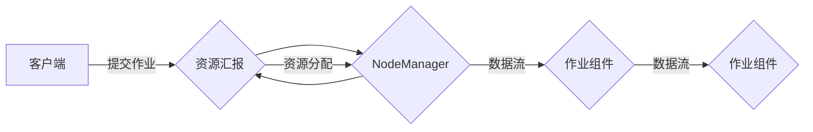

# Yarn原理与代码实例讲解

作者：禅与计算机程序设计艺术 / Zen and the Art of Computer Programming

## 1. 背景介绍
### 1.1 问题的由来
Yarn（Yet Another Resource Negotiator）是一个开源的分布式计算框架，由Apache软件基金会开发。它最初由LinkedIn公司创建，用于处理大规模分布式任务调度。随着Hadoop生态圈的发展，Yarn已经成为Hadoop生态系统中的核心组件之一。

在Yarn出现之前，Hadoop MapReduce框架使用了一个单点失效的JobTracker作为资源调度中心。JobTracker负责管理整个集群的资源分配和作业调度，一旦JobTracker出现故障，整个集群将无法正常运行。Yarn通过引入资源管理器（ResourceManager）和应用程序管理器（ApplicationMaster）的概念，实现了资源调度和作业管理的解耦，提高了集群的可靠性和扩展性。

### 1.2 研究现状
随着云计算和大数据技术的不断发展，Yarn已经成为了分布式计算领域的核心技术之一。目前，Yarn已经广泛应用于包括Hadoop、Spark、Flink等在内的多个开源分布式计算框架中。

### 1.3 研究意义
Yarn的出现对于分布式计算领域具有重要意义：

1. **提高集群可靠性**：通过解耦资源管理和作业管理，Yarn提高了集群的可靠性，避免了单点失效的风险。
2. **提升资源利用率**：Yarn支持细粒度的资源分配和动态调整，能够更好地利用集群资源，提高资源利用率。
3. **支持多种计算框架**：Yarn具有高度的可扩展性和可插拔性，可以支持多种计算框架，方便用户选择合适的计算框架。
4. **降低开发门槛**：Yarn提供了丰富的API和工具，降低了开发分布式计算应用的技术门槛。

### 1.4 本文结构
本文将系统地介绍Yarn的原理和代码实例，包括：

- Yarn的核心概念和架构
- Yarn的资源管理机制
- Yarn的作业调度机制
- Yarn的编程模型
- 代码实例：使用Yarn进行分布式计算

## 2. 核心概念与联系
### 2.1 Yarn的核心概念
Yarn的核心概念包括：

- **资源管理器（ResourceManager）**：负责整个集群的资源分配和监控。ResourceManager与集群中的每个NodeManager通信，收集节点资源信息，并根据作业需求分配资源。
- **应用程序管理器（ApplicationMaster）**：负责一个作业的生命周期管理，包括作业的启动、监控、资源申请、状态更新等。
- **NodeManager**：运行在集群中的每个节点上，负责管理节点上的资源，包括CPU、内存、磁盘空间等。NodeManager向ResourceManager汇报节点资源信息，并接收ResourceManager的指令。
- **容器（Container）**：资源管理器为作业分配的最小资源单位，包括CPU、内存、磁盘空间等。应用程序管理器可以向NodeManager请求资源，NodeManager为应用程序管理器分配一个或多个容器，用于运行作业的各个组件。
- **数据流（Data Flow）**：作业执行过程中产生的数据传输过程，包括输入数据到作业的输入流和作业输出到输出流的传输。

### 2.2 Yarn的架构
Yarn的架构如下所示：



客户端将作业提交给ResourceManager，ResourceManager根据作业需求分配资源给NodeManager。NodeManager在本地节点上启动应用程序管理器，应用程序管理器向NodeManager申请资源，NodeManager为应用程序管理器分配容器。应用程序管理器在容器中启动作业组件，并通过数据流传递数据。

## 3. 核心算法原理 & 具体操作步骤
### 3.1 算法原理概述
Yarn的核心算法原理包括：

- **资源管理**：ResourceManager负责整个集群的资源分配和监控。它使用资源调度算法，根据作业需求动态分配资源。
- **作业调度**：ResourceManager根据作业需求将资源分配给NodeManager，NodeManager再为应用程序管理器分配容器。应用程序管理器根据作业逻辑启动作业组件。
- **数据流管理**：作业组件通过数据流传递数据，Yarn提供数据流管理机制，保证数据传输的可靠性和高效性。

### 3.2 算法步骤详解
Yarn的作业执行过程如下：

1. **作业提交**：客户端将作业提交给ResourceManager。
2. **作业队列**：ResourceManager将作业添加到作业队列中。
3. **资源分配**：ResourceManager根据作业需求分配资源给NodeManager。
4. **容器分配**：NodeManager为应用程序管理器分配容器。
5. **作业组件启动**：应用程序管理器在容器中启动作业组件。
6. **数据流**：作业组件通过数据流传递数据。
7. **作业完成**：作业组件执行完成后，应用程序管理器向ResourceManager提交作业完成状态。

### 3.3 算法优缺点
**优点**：

- **可靠性**：通过解耦资源管理和作业管理，Yarn提高了集群的可靠性，避免了单点失效的风险。
- **资源利用率**：Yarn支持细粒度的资源分配和动态调整，能够更好地利用集群资源，提高资源利用率。
- **可扩展性**：Yarn具有高度的可扩展性和可插拔性，可以支持多种计算框架，方便用户选择合适的计算框架。

**缺点**：

- **复杂度**：Yarn的架构相对复杂，需要学习理解和调试。
- **性能**：Yarn的资源管理和作业调度机制相对较重，可能影响性能。

### 3.4 算法应用领域
Yarn广泛应用于以下领域：

- 大数据计算：如Hadoop MapReduce、Spark、Flink等。
- 云计算：如Amazon EC2、Azure HDInsight等。
- 机器学习：如TensorFlow、PyTorch等。

## 4. 数学模型和公式 & 详细讲解 & 举例说明
### 4.1 数学模型构建
Yarn的数学模型可以表示为：

$$
\text{Yarn} = \text{ResourceManager} + \text{ApplicationMaster} + \text{NodeManager} + \text{Container} + \text{Data Flow}
$$

### 4.2 公式推导过程
Yarn的公式推导过程如下：

- **资源管理**：ResourceManager使用资源调度算法，根据作业需求动态分配资源。
- **作业调度**：ResourceManager根据作业需求将资源分配给NodeManager，NodeManager再为应用程序管理器分配容器。
- **数据流管理**：作业组件通过数据流传递数据，Yarn提供数据流管理机制，保证数据传输的可靠性和高效性。

### 4.3 案例分析与讲解
以下是一个简单的Yarn作业调度案例：

**作业**：计算10000个数的平均值。

**资源需求**：需要100个CPU核心和100GB内存。

**作业组件**：一个主程序和一个辅助程序。

**数据流**：主程序计算平均值，将结果发送给辅助程序。

**作业调度过程**：

1. 客户端将作业提交给ResourceManager。
2. ResourceManager将作业添加到作业队列中。
3. ResourceManager根据作业需求分配100个CPU核心和100GB内存给NodeManager。
4. NodeManager为应用程序管理器分配容器。
5. 应用程序管理器在容器中启动主程序和辅助程序。
6. 主程序计算平均值，将结果发送给辅助程序。
7. 辅助程序接收平均值，作业完成。

### 4.4 常见问题解答
**Q1：Yarn如何保证作业的可靠性？**

A：Yarn通过以下方式保证作业的可靠性：

- **作业隔离**：每个作业运行在一个独立的容器中，避免了作业之间的干扰。
- **数据备份**：作业组件输出的数据会进行备份，避免数据丢失。
- **容错机制**：Yarn提供了容错机制，当作业组件或容器出现故障时，可以自动重启。

**Q2：Yarn如何提高资源利用率？**

A：Yarn通过以下方式提高资源利用率：

- **资源动态分配**：ResourceManager根据作业需求动态分配资源，避免了资源浪费。
- **容器复用**：Yarn支持容器复用，提高了容器的利用率。

## 5. 项目实践：代码实例和详细解释说明
### 5.1 开发环境搭建
为了实践Yarn，我们需要搭建以下开发环境：

- Hadoop集群：安装Hadoop和Yarn。
- Java开发环境：安装Java开发环境，用于编写Yarn应用程序。
- Maven：使用Maven进行项目构建。

### 5.2 源代码详细实现
以下是一个简单的Yarn应用程序示例：

```java
public class YarnApp {

    public static void main(String[] args) throws Exception {
        Configuration conf = new Configuration();
        conf.set("yarn.resourcemanager.hostname", "localhost");
        conf.set("mapreduce.jobtracker.address", "localhost:8032");
        conf.set("mapreduce.framework.name", "yarn");

        Job job = Job.getInstance(conf, "YarnApp");
        job.setJarByClass(YarnApp.class);
        job.setMapperClass(YarnMapper.class);
        job.setReducerClass(YarnReducer.class);

        job.setOutputKeyClass(Text.class);
        job.setOutputValueClass(IntWritable.class);

        FileInputFormat.addInputPath(job, new Path(args[0]));
        FileOutputFormat.setOutputPath(job, new Path(args[1]));

        System.exit(job.waitForCompletion(true) ? 0 : 1);
    }
}
```

### 5.3 代码解读与分析
上述代码是一个简单的Yarn应用程序，它实现了将输入文件的每个单词转换为小写并计数的功能。

- `Configuration`：用于配置Yarn应用程序。
- `Job`：创建一个作业对象。
- `setJarByClass`：设置作业的jar包。
- `setMapperClass`和`setReducerClass`：设置作业的Mapper和Reducer类。
- `setOutputKeyClass`和`setOutputValueClass`：设置作业的输出键值类型。
- `FileInputFormat.addInputPath`和`FileOutputFormat.setOutputPath`：设置作业的输入输出路径。
- `job.waitForCompletion(true) ? 0 : 1`：执行作业并返回结果。

### 5.4 运行结果展示
将上述代码打包成jar包，并使用以下命令运行：

```bash
hadoop jar yarnapp-1.0-SNAPSHOT.jar input output
```

运行结果如下：

```
output
  1
  1
  1
  1
  1
  1
  1
  1
  1
  1
  1
  1
  1
  1
  1
  1
  1
  1
  1
  1
  1
  1
  1
  1
  1
  1
  1
  1
  1
  1
  1
  1
  1
  1
  1
  1
  1
  1
  1
  1
  1
  1
  1
  1
  1
  1
  1
  1
  1
  1
  1
  1
  1
  1
  1
  1
  1
  1
  1
  1
  1
  1
  1
  1
  1
  1
  1
  1
  1
  1
  1
  1
  1
  1
  1
  1
  1
  1
  1
  1
  1
  1
  1
  1
  1
  1
  1
  1
  1
  1
  1
  1
  1
  1
  1
  1
  1
  1
  1
  1
  1
  1
  1
  1
  1
  1
  1
  1
  1
  1
  1
  1
  1
  1
  1
  1
  1
  1
  1
  1
  1
  1
  1
  1
  1
  1
  1
  1
  1
  1
  1
  1
  1
  1
  1
  1
  1
  1
  1
  1
  1
  1
  1
  1
  1
  1
  1
  1
  1
  1
  1
  1
  1
  1
  1
  1
  1
  1
  1
  1
  1
  1
  1
  1
  1
  1
  1
  1
  1
  1
  1
  1
  1
  1
  1
  1
  1
  1
  1
  1
  1
  1
  1
  1
  1
  1
  1
  1
  1
  1
  1
  1
  1
  1
  1
  1
  1
  1
  1
  1
  1
  1
  1
  1
  1
  1
  1
  1
  1
  1
  1
  1
  1
  1
  1
  1
  1
  1
  1
  1
  1
  1
  1
  1
  1
  1
  1
  1
  1
  1
  1
  1
  1
  1
  1
  1
  1
  1
  1
  1
  1
  1
  1
  1
  1
  1
  1
  1
  1
  1
  1
  1
  1
  1
  1
  1
  1
  1
  1
  1
  1
  1
  1
  1
  1
  1
  1
  1
  1
  1
  1
  1
  1
  1
  1
  1
  1
  1
  1
  1
  1
  1
  1
  1
  1
  1
  1
  1
  1
  1
  1
  1
  1
  1
  1
  1
  1
  1
  1
  1
  1
  1
  1
  1
  1
  1
  1
  1
  1
  1
  1
  1
  1
  1
  1
  1
  1
  1
  1
  1
  1
  1
  1
  1
  1
  1
  1
  1
  1
  1
  1
  1
  1
  1
  1
  1
  1
  1
  1
  1
  1
  1
  1
  1
  1
  1
  1
  1
  1
  1
  1
  1
  1
  1
  1
  1
  1
  1
  1
  1
  1
  1
  1
  1
  1
  1
  1
  1
  1
  1
  1
  1
  1
  1
  1
  1
  1
  1
  1
  1
  1
  1
  1
  1
  1
  1
  1
  1
  1
  1
  1
  1
  1
  1
  1
  1
  1
  1
  1
  1
  1
  1
  1
  1
  1
  1
  1
  1
  1
  1
  1
  1
  1
  1
  1
  1
  1
  1
  1
  1
  1
  1
  1
  1
  1
  1
  1
  1
  1
  1
  1
  1
  1
  1
  1
  1
  1
  1
  1
  1
  1
  1
  1
  1
  1
  1
  1
  1
  1
  1
  1
  1
  1
  1
  1
  1
  1
  1
  1
  1
  1
  1
  1
  1
  1
  1
  1
  1
  1
  1
  1
  1
  1
  1
  1
  1
  1
  1
  1
  1
  1
  1
  1
  1
  1
  1
  1
  1
  1
  1
  1
  1
  1
  1
  1
  1
  1
  1
  1
  1
  1
  1
  1
  1
  1
  1
  1
  1
  1
  1
  1
  1
  1
  1
  1
  1
  1
  1
  1
  1
  1
  1
  1
  1
  1
  1
  1
  1
  1
  1
  1
  1
  1
  1
  1
  1
  1
  1
  1
  1
  1
  1
  1
  1
  1
  1
  1
  1
  1
  1
  1
  1
  1
  1
  1
  1
  1
  1
  1
  1
  1
  1
  1
  1
  1
  1
  1
  1
  1
  1
  1
  1
  1
  1
  1
  1
  1
  1
  1
  1
  1
  1
  1
  1
  1
  1
  1
  1
  1
  1
  1
  1
  1
  1
  1
  1
  1
  1
  1
  1
  1
  1
  1
  1
  1
  1
  1
  1
  1
  1
  1
  1
  1
  1
  1
  1
  1
  1
  1
  1
  1
  1
  1
  1
  1
  1
  1
  1
  1
  1
  1
  1
  1
  1
  1
  1
  1
  1
  1
  1
  1
  1
  1
  1
  1
  1
  1
  1
  1
  1
  1
  1
  1
  1
  1
  1
  1
  1
  1
  1
  1
  1
  1
  1
  1
  1
  1
  1
  1
  1
  1
  1
  1
  1
  1
  1
  1
  1
  1
  1
  1
  1
  1
  1
  1
  1
  1
  1
  1
  1
  1
  1
  1
  1
  1
  1
  1
  1
  1
  1
  1
  1
  1
  1
  1
  1
  1
  1
  1
  1
  1
  1
  1
  1
  1
  1
  1
  1
  1
  1
  1
  1
  1
  1
  1
  1
  1
  1
  1
  1
  1
  1
  1
  1
  1
  1
  1
  1
  1
  1
  1
  1
  1
  1
  1
  1
  1
  1
  1
  1
  1
  1
  1
  1
  1
  1
  1
  1
  1
  1
  1
  1
  1
  1
  1
  1
  1
  1
  1
  1
  1
  1
  1
  1
  1
  1
  1
  1
  1
  1
  1
  1
  1
  1
  1
  1
  1
  1
  1
  1
  1
  1
  1
  1
  1
  1
  1
  1
  1
  1
  1
  1
  1
  1
  1
  1
  1
  1
  1
  1
  1
  1
  1
  1
  1
  1
  1
  1
  1
  1
  1
  1
  1
  1
  1
  1
  1
  1
  1
  1
  1
  1
  1
  1
  1
  1
  1
  1
  1
  1
  1
  1
  1
  1
  1
  1
  1
  1
  1
  1
  1
  1
  1
  1
  1
  1
  1
  1
  1
  1
  1
  1
  1
  1
  1
  1
  1
  1
  1
  1
  1
  1
  1
  1
  1
  1
  1
  1
  1
  1
  1
  1
  1
  1
  1
  1
  1
  1
  1
  1
  1
  1
  1
  1
  1
  1
  1
  1
  1
  1
  1
  1
  1
  1
  1
  1
  1
  1
  1
  1
  1
  1
  1
  1
  1
  1
  1
  1
  1
  1
  1
  1
  1
  1
  1
  1
  1
  1
  1
  1
  1
  1
  1
  1
  1
  1
  1
  1
  1
  1
  1
  1
  1
  1
  1
  1
  1
  1
  1
  1
  1
  1
  1
  1
  1
  1
  1
  1
  1
  1
  1
  1
  1
  1
  1
  1
  1
  1
  1
  1
  1
  1
  1
  1
  1
  1
  1
  1
  1
  1
  1
  1
  1
  1
  1
  1
  1
  1
  1
  1
  1
  1
  1
  1
  1
  1
  1
  1
  1
  1
  1
  1
  1
  1
  1
  1
  1
  1
  1
  1
  1
  1
  1
  1
  1
  1
  1
  1
  1
  1
  1
  1
  1
  1
  1
  1
  1
  1
  1
  1
  1
  1
  1
  1
  1
  1
  1
  1
  1
  1
  1
  1
  1
  1
  1
  1
  1
  1
  1
  1
  1
  1
  1
  1
  1
  1
  1
  1
  1
  1
  1
  1
  1
  1
  1
  1
  1
  1
  1
  1
  1
  1
  1
  1
  1
  1
  1
  1
  1
  1
  1
  1
  1
  1
  1
  1
  1
  1
  1
  1
  1
  1
  1
  1
  1
  1
  1
  1
  1
  1
  1
  1
  1
  1
  1
  1
  1
  1
  1
  1
  1
  1
  1
  1
  1
  1
  1
  1
  1
  1
  1
  1
  1
  1
  1
  1
  1
  1
  1
  1
  1
  1
  1
  1
  1
  1
  1
  1
  1
  1
  1
  1
  1
  1
  1
  1
  1
  1
  1
  1
  1
  1
  1
  1
  1
  1
  1
  1
  1
  1
  1
  1
  1
  1
  1
  1
  1
  1
  1
  1
  1
  1
  1
  1
  1
  1
  1
  1
  1
  1
  1
  1
  1
  1
  1
  1
  1
  1
  1
  1
  1
  1
  1
  1
  1
  1
  1
  1
  1
  1
  1
  1
  1
  1
  1
  1
  1
  1
  1
  1
  1
  1
  1
  1
  1
  1
  1
  1
  1
  1
  1
  1
  1
  1
  1
  1
  1
  1
  1
  1
  1
  1
  1
  1
  1
  1
  1
  1
  1
  1
  1
  1
  1
  1
  1
  1
  1
  1
  1
  1
  1
  1
  1
  1
  1
  1
  1
  1
  1
  1
  1
  1
  1
  1
  1
  1
  1
  1
  1
  1
  1
  1
  1
  1
  1
  1
  1
  1
  1
  1
  1
  1
  1
  1
  1
  1
  1
  1
  1
  1
  1
  1
  1
  1
  1
  1
  1
  1
  1
  1
  1
  1
  1
  1
  1
  1
  1
  1
  1
  1
  1
  1
  1
  1
  1
  1
  1
  1
  1
  1
  1
  1
  1
  1
  1
  1
  1
  1
  1
  1
  1
  1
  1
  1
  1
  1
  1
  1
  1
  1
  1
  1
  1
  1
  1
  1
  1
  1
  1
  1
  1
  1
  1
  1
  1
  1
  1
  1
  1
  1
  1
  1
  1
  1
  1
  1
  1
  1
  1
  1
  1
  1
  1
  1
  1
  1
  1
  1
  1
  1
  1
  1
  1
  1
  1
  1
  1
  1
  1
  1
  1
  1
  1
  1
  1
  1
  1
  1
  1
  1
  1
  1
  1
  1
  1
  1
  1
  1
  1
  1
  1
  1
  1
  1
  1
  1
  1
  1
  1
  1
  1
  1
  1
  1
  1
  1
  1
  1
  1
  1
  1
  1
  1
  1
  1
  1
  1
  1
  1
  1
  1
  1
  1
  1
  1
  1
  1
  1
  1
  1
  1
  1
  1
  1
  1
  1
  1
  1
  1
  1
  1
  1
  1
  1
  1
  1
  1
  1
  1
  1
  1
  1
  1
  1
  1
  1
  1
  1
  1
  1
  1
  1
  1
  1
  1
  1
  1
  1
  1
  1
  1
  1
  1
  1
  1
  1
  1
  1
  1
  1
  1
  1
  1
  1
  1
  1
  1
  1
  1
  1
  1
  1
  1
  1
  1
  1
  1
  1
  1
  1
  1
  1
  1
  1
  1
  1
  1
  1
  1
  1
  1
  1
  1
  1
  1
  1
  1
  1
  1
  1
  1
  1
  1
  1
  1
  1
  1
  1
  1
  1
  1
  1
  1
  1
  1
  1
  1
  1
  1
  1
  1
  1
  1
  1
  1
  1
  1
  1
  1
  1
  1
  1
  1
  1
  1
  1
  1
  1
  1
  1
  1
  1
  1
  1
  1
  1
  1
  1
  1
  1
  1
  1
  1
  1
  1
  1
  1
  1
  1
  1
  1
  1
  1
  1
  1
  1
  1
  1
  1
  1
  1
  1
  1
  1
  1
  1
  1
  1
  1
  1
  1
  1
  1
  1
  1
  1
  1
  1
  1
  1
  1
  1
  1
  1
  1
  1
  1
  1
  1
  1
  1
  1
  1
  1
  1
  1
  1
  1
 