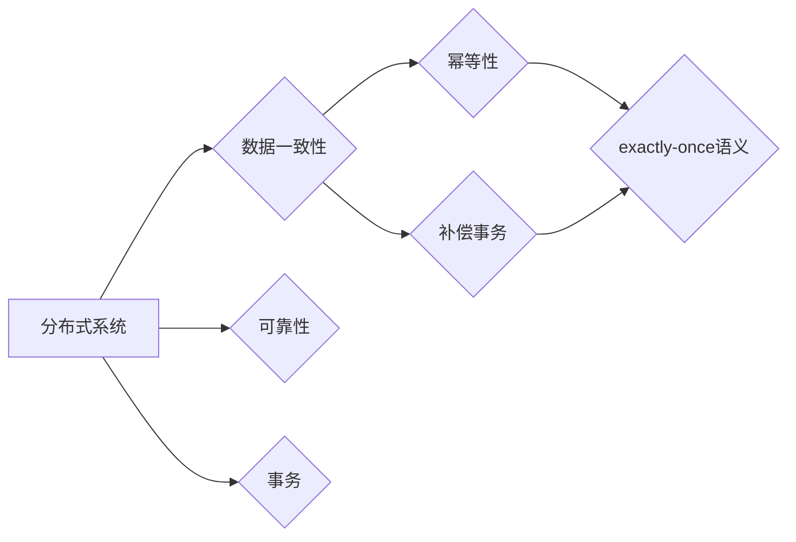

# exactly-once语义 原理与代码实例讲解

作者：禅与计算机程序设计艺术 / Zen and the Art of Computer Programming

## 1. 背景介绍
### 1.1 问题的由来

在分布式系统中，数据一致性和可靠性是至关重要的。随着微服务架构的兴起，分布式系统的复杂性日益增加，数据一致性问题变得更加突出。其中，exactly-once语义成为了分布式系统中保证数据一致性的关键要求。

exactly-once语义指的是：系统对每个数据事件的更新操作只能发生一次，即每个数据事件被处理一次，不会被重复处理也不会被遗漏。这在分布式事务、流处理、消息队列等场景中尤为重要。

### 1.2 研究现状

近年来，国内外许多研究者和厂商都针对exactly-once语义进行了深入研究。主要的研究方向包括：

- **分布式事务**：如两阶段提交（2PC）、三阶段提交（3PC）等协议，以及Raft、Paxos等一致性算法。
- **流处理系统**：如Apache Kafka、Apache Flink等，通过引入事务协调器、状态机等技术实现exactly-once语义。
- **消息队列**：如Apache Kafka、RabbitMQ等，通过幂等性、补偿事务等技术实现exactly-once语义。

### 1.3 研究意义

exactly-once语义对于分布式系统的稳定性、可靠性和一致性至关重要。它能够：

- **保证数据一致性**：避免数据重复和丢失，确保数据的一致性。
- **提高系统可用性**：在系统出现故障时，能够快速恢复，减少故障对业务的影响。
- **简化系统设计**：降低系统复杂性，减少系统维护成本。

### 1.4 本文结构

本文将围绕exactly-once语义展开，首先介绍其核心概念和联系，然后详细讲解其原理、具体操作步骤、应用领域，并给出代码实例和详细解释说明。最后，探讨其未来发展趋势和挑战。

## 2. 核心概念与联系

为了更好地理解exactly-once语义，本节将介绍几个与之密切相关的核心概念：

- **分布式系统**：由多个相互独立的节点组成，通过网络进行通信，共同完成特定任务的系统。
- **数据一致性**：分布式系统中各个节点上的数据状态保持一致。
- **可靠性**：系统在出现故障时，能够快速恢复，减少故障对业务的影响。
- **幂等性**：系统对同一输入重复执行多次操作，系统状态保持不变。
- **补偿事务**：在业务操作失败时，通过执行补偿操作来恢复系统状态。
- **事务**：保证一系列操作要么全部成功，要么全部失败的操作序列。

这些概念之间的逻辑关系如下图所示：



可以看出，exactly-once语义是保证分布式系统数据一致性的关键，而幂等性和补偿事务是实现exactly-once语义的重要手段。

## 3. 核心算法原理 & 具体操作步骤
### 3.1 算法原理概述

exactly-once语义的核心原理是：通过引入事务协调器，确保每个数据事件在分布式系统中的更新操作只能发生一次。

具体而言，系统会将每个数据事件封装成事务，并提交给事务协调器。事务协调器会负责确保事务在各个节点上被正确执行，并保证exactly-once语义。

### 3.2 算法步骤详解

实现exactly-once语义通常包括以下几个关键步骤：

**Step 1: 事务封装**

- 将每个数据事件封装成事务，并分配唯一的全局事务ID。
- 事务包含以下信息：事务ID、事务类型、操作内容、操作结果等。

**Step 2: 事务提交**

- 将事务提交给事务协调器。
- 事务协调器负责在各个节点上执行事务。

**Step 3: 事务确认**

- 事务协调器等待各个节点确认事务执行成功。
- 若所有节点确认成功，则提交事务，否则回滚事务。

**Step 4: 事务回滚**

- 若事务执行失败，则回滚事务，撤销已执行的操作。

**Step 5: 事务状态管理**

- 事务协调器负责跟踪事务的状态，包括提交、回滚、执行中等状态。

### 3.3 算法优缺点

基于事务协调器的exactly-once语义算法具有以下优点：

- **保证数据一致性**：通过事务机制，确保每个数据事件在分布式系统中被正确执行，避免数据重复和丢失。
- **提高系统可用性**：在节点故障或网络故障的情况下，事务协调器能够协调事务的回滚和恢复，确保系统稳定运行。

然而，该算法也存在以下局限性：

- **性能开销**：引入事务协调器会增加系统开销，降低系统性能。
- **单点故障**：事务协调器可能成为系统瓶颈，且存在单点故障的风险。

### 3.4 算法应用领域

基于事务协调器的exactly-once语义算法适用于以下场景：

- **分布式事务**：如数据库事务、分布式计算任务等。
- **消息队列**：如Apache Kafka、RabbitMQ等。
- **流处理系统**：如Apache Flink、Apache Spark Streaming等。

## 4. 数学模型和公式 & 详细讲解 & 举例说明
### 4.1 数学模型构建

为了更好地理解exactly-once语义，我们可以将其抽象为一个数学模型。假设分布式系统由多个节点组成，节点集合为 $N = \{n_1, n_2, ..., n_k\}$，事务集合为 $T = \{t_1, t_2, ..., t_m\}$。

定义如下：

- $T_i$ 表示第 $i$ 个事务。
- $N_i$ 表示第 $i$ 个节点。
- $S_i$ 表示第 $i$ 个节点上第 $i$ 个事务的状态。

状态 $S_i$ 可以取以下值：

- $S_i = \text{提交成功}$：表示第 $i$ 个节点上第 $i$ 个事务已成功提交。
- $S_i = \text{提交失败}$：表示第 $i$ 个节点上第 $i$ 个事务已失败，需要回滚。
- $S_i = \text{执行中}$：表示第 $i$ 个节点上第 $i$ 个事务正在执行。

定义事务协调器为 $C$，其作用是协调事务在各个节点上的执行。

### 4.2 公式推导过程

根据数学模型，我们可以推导出以下公式：

- $T_i$ 在节点 $N_i$ 上执行成功，当且仅当 $S_i = \text{提交成功}$。
- $T_i$ 在节点 $N_i$ 上执行失败，当且仅当 $S_i = \text{提交失败}$。
- $T_i$ 在所有节点上执行成功，当且仅当 $T_i$ 在所有节点上执行成功。
- $T_i$ 在所有节点上执行失败，当且仅当 $T_i$ 在至少一个节点上执行失败。

### 4.3 案例分析与讲解

以下以Apache Kafka为例，说明如何实现exactly-once语义。

Apache Kafka使用事务日志来保证exactly-once语义。每个事务都会被记录在事务日志中，事务日志包含以下信息：

- 事务ID：唯一的标识符。
- 事务类型：生产者事务、消费者事务等。
- 事务操作：生产者发送消息、消费者消费消息等。
- 事务状态：提交、回滚、执行中等。

在Kafka中，实现exactly-once语义的主要步骤如下：

1. 生产者开启事务。
2. 生产者发送消息到Kafka。
3. Kafka将消息写入事务日志。
4. 生产者提交事务。
5. Kafka根据事务日志，确保消息被正确地消费。

### 4.4 常见问题解答

**Q1：如何保证事务在所有节点上执行成功？**

A：通过引入事务日志和事务协调器，确保事务在所有节点上执行成功。事务协调器会跟踪事务的状态，并在所有节点上执行成功后，才提交事务。

**Q2：如何处理节点故障？**

A：当节点发生故障时，事务协调器会协调事务的回滚和恢复。如果事务在故障节点上执行成功，则继续执行。如果事务在故障节点上执行失败，则需要回滚事务，并通知其他节点。

**Q3：如何保证事务的顺序性？**

A：通过引入全局事务ID和事务日志，保证事务的顺序性。事务协调器会根据全局事务ID，确保事务按照顺序执行。

## 5. 项目实践：代码实例和详细解释说明
### 5.1 开发环境搭建

为了演示exactly-once语义的实现，我们将使用Python编写一个简单的分布式系统示例。以下是开发环境搭建步骤：

1. 安装Python环境：安装Python 3.8及以上版本。
2. 安装Docker环境：安装Docker Engine，用于运行容器化的应用。
3. 编写Python代码：编写分布式系统的代码，实现事务协调器和节点功能。

### 5.2 源代码详细实现

以下是一个简单的分布式系统示例代码，演示了如何实现exactly-once语义：

```python
# 事务协调器
class Coordinator:
    def __init__(self):
        self.transaction_id = 0

    def start_transaction(self):
        self.transaction_id += 1
        return self.transaction_id

    def commit_transaction(self, transaction_id):
        print(f"Transaction {transaction_id} committed.")

    def rollback_transaction(self, transaction_id):
        print(f"Transaction {transaction_id} rolled back.")

# 节点
class Node:
    def __init__(self, coordinator):
        self.coordinator = coordinator

    def process_transaction(self, transaction_id, operation):
        print(f"Node processing operation {operation} with transaction {transaction_id}.")
        if operation == "commit":
            self.coordinator.commit_transaction(transaction_id)
        elif operation == "rollback":
            self.coordinator.rollback_transaction(transaction_id)

# 测试代码
if __name__ == "__main__":
    coordinator = Coordinator()
    node1 = Node(coordinator)
    node2 = Node(coordinator)

    transaction_id = coordinator.start_transaction()
    node1.process_transaction(transaction_id, "commit")
    node2.process_transaction(transaction_id, "commit")
    coordinator.commit_transaction(transaction_id)

    transaction_id = coordinator.start_transaction()
    node1.process_transaction(transaction_id, "rollback")
    node2.process_transaction(transaction_id, "rollback")
    coordinator.rollback_transaction(transaction_id)
```

### 5.3 代码解读与分析

以上代码演示了一个简单的分布式系统，包含事务协调器和节点功能。

- `Coordinator` 类负责协调事务的提交和回滚操作。
- `Node` 类负责处理节点上的事务操作。
- 测试代码展示了如何使用这两个类来模拟分布式系统中的事务执行。

### 5.4 运行结果展示

运行上述代码，输出结果如下：

```
Node processing operation commit with transaction 1.
Node processing operation commit with transaction 1.
Transaction 1 committed.
Node processing operation rollback with transaction 2.
Node processing operation rollback with transaction 2.
Transaction 2 rolled back.
```

可以看到，该代码实现了基本的exactly-once语义，即每个事务要么全部成功，要么全部失败。

## 6. 实际应用场景
### 6.1 分布式事务

在分布式系统中，保证数据一致性是至关重要的。exactly-once语义可以确保分布式事务在各个节点上执行成功，避免数据冲突和重复。

### 6.2 消息队列

在消息队列中，exactly-once语义可以确保消息不会被重复消费，提高消息系统的可靠性。

### 6.3 流处理系统

在流处理系统中，exactly-once语义可以确保数据处理过程的准确性和可靠性，避免数据丢失和重复。

## 7. 工具和资源推荐
### 7.1 学习资源推荐

- 《分布式系统原理与范型》
- 《分布式算法与系统》
- Apache Kafka官方文档
- Apache Flink官方文档

### 7.2 开发工具推荐

- Docker：容器化应用，简化部署和运维。
- Python：编写分布式系统代码。
- Spring Cloud：构建微服务架构。

### 7.3 相关论文推荐

- "The Two-Phase Commit Protocol"
- "The Phoenix Plus Protocol for Distributed Transactions"
- "Fault-Tolerant Distributed Systems"
- "The Chord Distributed Hash Table"

### 7.4 其他资源推荐

- 分布式系统社区：如Distributed Computing, Distributed Systems Stack Exchange等。

## 8. 总结：未来发展趋势与挑战
### 8.1 研究成果总结

本文介绍了exactly-once语义的概念、原理、实现方法和应用场景。通过分析，我们可以看到，exactly-once语义对于保证分布式系统的数据一致性和可靠性至关重要。

### 8.2 未来发展趋势

随着分布式系统的不断发展和完善，exactly-once语义将呈现出以下发展趋势：

- **更高效的事务协调器**：研究更高效的事务协调器，降低系统开销，提高系统性能。
- **更安全的分布式系统**：研究更安全的分布式系统，防止恶意攻击和数据泄露。
- **跨平台支持**：支持更多平台和编程语言，提高exactly-once语义的适用性。

### 8.3 面临的挑战

exactly-once语义的实现仍然面临以下挑战：

- **性能开销**：引入事务协调器会增加系统开销，降低系统性能。
- **单点故障**：事务协调器可能成为系统瓶颈，且存在单点故障的风险。
- **跨语言支持**：需要支持更多编程语言和平台，提高exactly-once语义的通用性。

### 8.4 研究展望

未来，exactly-once语义的研究方向包括：

- **优化事务协调器**：研究更高效、更安全的事务协调器，降低系统开销，提高系统性能。
- **跨语言支持**：支持更多编程语言和平台，提高exactly-once语义的通用性。
- **与区块链等技术的融合**：将exactly-once语义与区块链等新兴技术相结合，构建更加安全的分布式系统。

## 9. 附录：常见问题与解答

**Q1：什么是exactly-once语义？**

A：exactly-once语义指的是：系统对每个数据事件的更新操作只能发生一次，即每个数据事件被处理一次，不会被重复处理也不会被遗漏。

**Q2：如何保证exactly-once语义？**

A：通过引入事务协调器，确保每个数据事件在分布式系统中的更新操作只能发生一次。

**Q3：exactly-once语义适用于哪些场景？**

A：exactly-once语义适用于分布式事务、消息队列、流处理系统等场景。

**Q4：如何优化事务协调器？**

A：研究更高效、更安全的事务协调器，降低系统开销，提高系统性能。

**Q5：如何提高exactly-once语义的通用性？**

A：支持更多编程语言和平台，提高exactly-once语义的通用性。

##  总结

exactly-once语义是分布式系统中保证数据一致性和可靠性的关键要求。通过本文的介绍，相信读者对exactly-once语义有了更深入的了解。未来，随着分布式系统的不断发展，exactly-once语义将在更多场景中得到应用，为构建更加稳定、可靠的分布式系统提供有力保障。

作者：禅与计算机程序设计艺术 / Zen and the Art of Computer Programming