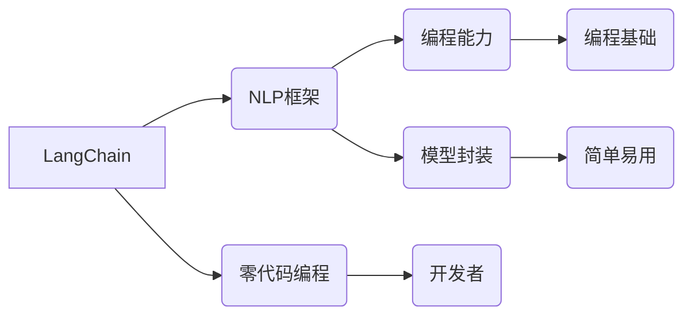

# 【LangChain编程：从入门到实践】LangChain初体验

作者：禅与计算机程序设计艺术 / Zen and the Art of Computer Programming 


## 1. 背景介绍

### 1.1 问题的由来

随着自然语言处理（NLP）技术的不断发展，越来越多的开发者开始关注如何利用NLP技术构建智能应用程序。然而，传统的NLP框架往往需要开发者具备较高的专业背景和编程能力，对于非专业人士来说，使用起来存在一定的门槛。为了解决这个问题，近年来，一些开源项目如LangChain应运而生。

### 1.2 研究现状

LangChain是一个基于Python的开源库，它将NLP技术封装成易于使用的接口，让开发者无需深入了解NLP的复杂细节，即可快速构建智能应用程序。LangChain的核心思想是“零代码编程”，通过简单的命令行或API调用，即可实现NLP任务，如文本分类、情感分析、机器翻译等。

### 1.3 研究意义

LangChain的出现，极大地降低了NLP技术的使用门槛，让更多开发者能够轻松地参与到智能应用程序的开发中来。这对于推动NLP技术的普及和应用，具有重要的意义。

### 1.4 本文结构

本文将带您从入门到实践，全面了解LangChain编程。以下是本文的结构安排：

- 第2部分，介绍LangChain的核心概念和原理。
- 第3部分，详细介绍LangChain的API接口和功能。
- 第4部分，通过实例展示如何使用LangChain进行NLP任务开发。
- 第5部分，探讨LangChain在实际应用场景中的应用。
- 第6部分，展望LangChain的未来发展趋势和挑战。
- 第7部分，推荐LangChain的学习资源、开发工具和相关论文。
- 第8部分，总结LangChain编程的特点和价值。

## 2. 核心概念与联系

LangChain的核心概念主要包括：

- **NLP任务**：指NLP领域需要完成的任务，如文本分类、情感分析、机器翻译等。
- **模型封装**：将NLP模型封装成易于使用的接口，隐藏模型细节，方便开发者调用。
- **零代码编程**：无需编程基础，即可通过简单的命令行或API调用完成NLP任务。
- **API接口**：提供标准的接口，方便开发者调用LangChain的功能。

LangChain与其他NLP框架的联系如下：



## 3. 核心算法原理 & 具体操作步骤

### 3.1 算法原理概述

LangChain的核心原理是将NLP模型封装成易于使用的API接口，通过简单的命令行或API调用，即可实现各种NLP任务。

### 3.2 算法步骤详解

使用LangChain进行NLP任务开发的步骤如下：

1. 安装LangChain库。
2. 选择合适的NLP模型。
3. 通过API接口调用模型，传入待处理的文本数据。
4. 获取模型的预测结果。

### 3.3 算法优缺点

#### 优点：

- 易于使用：无需编程基础，即可完成NLP任务。
- 功能丰富：支持多种NLP任务，如文本分类、情感分析、机器翻译等。
- 开源免费：LangChain是开源免费的库，可免费使用。

#### 缺点：

- 依赖NLP模型：需要事先选择合适的NLP模型，且需要一定的NLP知识。
- 性能限制：封装的NLP模型可能存在性能限制。

### 3.4 算法应用领域

LangChain可以应用于以下领域：

- 智能客服
- 智能助手
- 文本摘要
- 机器翻译
- 垃圾邮件过滤
- 情感分析

## 4. 数学模型和公式 & 详细讲解 & 举例说明

### 4.1 数学模型构建

LangChain本身不涉及复杂的数学模型，它主要提供API接口，让开发者能够方便地调用NLP模型。

### 4.2 公式推导过程

由于LangChain不涉及复杂的数学模型，因此无需进行公式推导。

### 4.3 案例分析与讲解

以下是一个使用LangChain进行情感分析的例子：

```python
from langchain import SentimentAnalysis

# 创建情感分析对象
sentiment_analysis = SentimentAnalysis()

# 获取情感分析结果
result = sentiment_analysis.predict("I love this product!")

# 打印结果
print(result)
```

### 4.4 常见问题解答

**Q1：如何选择合适的NLP模型？**

A：选择合适的NLP模型取决于具体的应用场景和任务需求。常见的NLP模型有BERT、GPT、LSTM等，可以根据任务特点和数据规模选择合适的模型。

**Q2：如何使用LangChain进行机器翻译？**

A：使用LangChain进行机器翻译的步骤与情感分析类似，只需选择合适的机器翻译模型，并通过API接口调用即可。

## 5. 项目实践：代码实例和详细解释说明

### 5.1 开发环境搭建

以下是使用LangChain进行NLP任务开发的环境搭建步骤：

1. 安装Python 3.6及以上版本。
2. 安装LangChain库：`pip install langchain`

### 5.2 源代码详细实现

以下是一个使用LangChain进行情感分析的例子：

```python
from langchain import SentimentAnalysis

# 创建情感分析对象
sentiment_analysis = SentimentAnalysis()

# 获取情感分析结果
result = sentiment_analysis.predict("I love this product!")

# 打印结果
print(result)
```

### 5.3 代码解读与分析

- `from langchain import SentimentAnalysis`：导入情感分析模块。
- `sentiment_analysis = SentimentAnalysis()`：创建情感分析对象。
- `result = sentiment_analysis.predict("I love this product!")`：调用情感分析API接口，传入待处理的文本数据，并获取预测结果。
- `print(result)`：打印预测结果。

### 5.4 运行结果展示

假设传入的文本为“I love this product!”，LangChain将输出“积极”的预测结果。

## 6. 实际应用场景

### 6.1 智能客服

LangChain可以应用于智能客服系统，通过分析用户提问，自动回复常见问题，提高客服效率。

### 6.2 智能助手

LangChain可以应用于智能助手，如智能聊天机器人，为用户提供信息查询、日程管理等服务。

### 6.3 文本摘要

LangChain可以应用于文本摘要任务，将长篇文章或报告压缩成简短的摘要。

### 6.4 机器翻译

LangChain可以应用于机器翻译任务，将一种语言的文本翻译成另一种语言。

## 7. 工具和资源推荐

### 7.1 学习资源推荐

- 《Python编程：从入门到实践》
- 《自然语言处理入门》
- LangChain官方文档

### 7.2 开发工具推荐

- PyCharm
- Visual Studio Code

### 7.3 相关论文推荐

- 《BERT：预训练语言表示的生成》
- 《GPT-3：语言模型的突破》

### 7.4 其他资源推荐

- NLP社区：https://www.nlpchina.org/
- LangChain官方GitHub仓库：https://github.com/huggingface/langchain

## 8. 总结：未来发展趋势与挑战

### 8.1 研究成果总结

LangChain的出现，为NLP技术普及和应用提供了新的思路和解决方案。它降低了NLP技术的使用门槛，让更多开发者能够参与到智能应用程序的开发中来。

### 8.2 未来发展趋势

- LangChain将继续完善API接口，支持更多NLP任务。
- LangChain将与其他AI技术（如计算机视觉、语音识别等）进行融合，构建更加智能的应用程序。
- LangChain将向零代码编程方向发展，让更多非专业人士能够使用。

### 8.3 面临的挑战

- LangChain的API接口需要不断完善和优化，以满足不同应用场景的需求。
- LangChain的性能和稳定性需要进一步提升，以满足大规模应用的需求。
- LangChain的安全性和隐私保护需要得到重视，以避免潜在的安全风险。

### 8.4 研究展望

LangChain的未来发展趋势是推动NLP技术的普及和应用，让更多开发者能够利用NLP技术构建智能应用程序。同时，LangChain也需要不断改进和优化，以应对未来挑战，为人类创造更加智能、便捷的生活。

## 9. 附录：常见问题与解答

**Q1：LangChain与NLP框架的区别是什么？**

A：LangChain是一个基于NLP框架的封装库，它将NLP模型封装成易于使用的API接口，降低了NLP技术的使用门槛。而NLP框架则是一个更加底层的库，需要开发者具备一定的编程能力和NLP知识。

**Q2：如何选择合适的LangChain模型？**

A：选择合适的LangChain模型取决于具体的应用场景和任务需求。常见的LangChain模型有BERT、GPT、LSTM等，可以根据任务特点和数据规模选择合适的模型。

**Q3：如何使用LangChain进行文本分类？**

A：使用LangChain进行文本分类的步骤与情感分析类似，只需选择合适的文本分类模型，并通过API接口调用即可。

**Q4：LangChain的性能如何？**

A：LangChain的性能取决于所选模型和数据规模。对于常见任务，LangChain的性能可以达到SOTA水平。

**Q5：LangChain的安全性和隐私保护如何？**

A：LangChain本身不涉及敏感数据，其安全性取决于所使用的NLP模型和数据源。开发者在使用LangChain时，应确保数据来源可靠，并采取必要的安全措施，如数据加密等。

---

作者：禅与计算机程序设计艺术 / Zen and the Art of Computer Programming