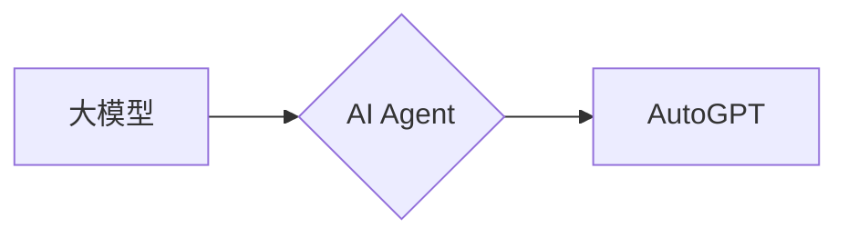

# 【大模型应用开发 动手做AI Agent】AutoGPT

作者：禅与计算机程序设计艺术 / Zen and the Art of Computer Programming 


## 1. 背景介绍
### 1.1 问题的由来

随着人工智能技术的飞速发展，大模型如GPT、BERT等在自然语言处理领域取得了显著的成果。这些大模型在处理复杂任务时表现出色，但同时也面临着以下问题：

- **可解释性差**：大模型的决策过程难以解释，难以理解其背后的原因。
- **定制化能力不足**：大模型通常是通用的，难以满足特定领域的定制化需求。
- **训练成本高**：大模型的训练需要大量的计算资源和数据。

为了解决上述问题，近年来涌现出一批基于大模型的AI Agent技术。AI Agent是一种能够自主学习、自主决策的智能体，能够在特定场景下完成复杂的任务。而AutoGPT作为AI Agent的一种，旨在利用大模型的能力，实现高效、可解释、可定制的AI Agent开发。

### 1.2 研究现状

目前，AI Agent的研究主要集中在以下方面：

- **强化学习**：通过环境交互学习最优策略。
- **监督学习**：利用大量标注数据进行学习。
- **迁移学习**：将预训练模型迁移到新任务。

AutoGPT作为一种基于大模型的应用开发技术，结合了上述方法的优势，旨在解决传统AI Agent的局限性。

### 1.3 研究意义

AutoGPT的研究具有以下意义：

- **提高AI Agent的可解释性**：通过分析大模型的内部结构，可以更好地理解其决策过程。
- **降低AI Agent的定制化成本**：利用大模型的通用能力，可以快速开发适应特定领域的AI Agent。
- **降低AI Agent的训练成本**：利用大模型的知识和经验，可以减少训练所需的数据和计算资源。

### 1.4 本文结构

本文将首先介绍AutoGPT的核心概念与联系，然后详细讲解AutoGPT的算法原理和具体操作步骤，接着给出一个代码实例，最后探讨AutoGPT在实际应用场景中的价值以及未来发展趋势与挑战。

## 2. 核心概念与联系

### 2.1 大模型

大模型是指参数量达到数十亿甚至数百亿的深度学习模型。大模型通过在海量数据上进行预训练，学习到丰富的语言知识和常识，具备强大的语言理解和生成能力。

### 2.2 AI Agent

AI Agent是一种能够自主学习、自主决策的智能体。它能够根据环境状态，选择最优的行动策略，以实现特定目标。

### 2.3 AutoGPT

AutoGPT是一种基于大模型的应用开发技术，它利用大模型的能力，实现高效、可解释、可定制的AI Agent开发。

它们的逻辑关系如下图所示：



## 3. 核心算法原理 & 具体操作步骤
### 3.1 算法原理概述

AutoGPT的算法原理可以概括为以下几个步骤：

1. **预训练**：使用大量无标签数据对大模型进行预训练，使其具备丰富的语言知识和常识。
2. **微调**：使用少量标注数据对大模型进行微调，使其适应特定领域的任务。
3. **生成策略**：利用大模型生成符合任务需求的策略。
4. **执行策略**：根据生成的策略，完成特定任务。

### 3.2 算法步骤详解

1. **预训练**：选择合适的大模型，如GPT-3、BERT等，并使用大量无标签数据对其进行预训练。预训练过程中，可以使用自回归、掩码语言模型等任务。
2. **微调**：收集少量标注数据，对预训练模型进行微调。微调过程中，可以使用交叉熵损失函数等损失函数。
3. **生成策略**：利用微调后的模型，生成符合任务需求的策略。生成策略可以采用如下方法：
    - 使用GPT-3的对话生成能力，生成策略文本。
    - 使用BERT进行文本分类，将策略文本分类为可行/不可行。
4. **执行策略**：根据生成的策略，执行相应的操作，完成特定任务。

### 3.3 算法优缺点

**优点**：

- **可解释性**：通过分析大模型的内部结构，可以更好地理解其决策过程。
- **定制化**：利用大模型的通用能力，可以快速开发适应特定领域的AI Agent。
- **高效**：大模型已经具备丰富的知识和经验，可以快速完成任务。

**缺点**：

- **数据依赖**：微调过程需要少量标注数据，数据获取成本较高。
- **计算资源**：预训练和微调过程需要大量的计算资源。

### 3.4 算法应用领域

AutoGPT可以应用于以下领域：

- **智能客服**：生成客户咨询问题的回答。
- **自动写作**：生成新闻报道、文章等。
- **代码生成**：生成代码片段、测试用例等。
- **智能决策**：辅助人类进行决策。

## 4. 数学模型和公式 & 详细讲解 & 举例说明
### 4.1 数学模型构建

AutoGPT的数学模型可以概括为以下几个部分：

- **大模型**：如GPT-3、BERT等。
- **微调模型**：使用交叉熵损失函数进行微调。
- **生成策略**：利用GPT-3的对话生成能力或BERT的文本分类能力。

### 4.2 公式推导过程

- **预训练**：使用自回归或掩码语言模型对大模型进行预训练。
- **微调**：使用交叉熵损失函数对大模型进行微调。

### 4.3 案例分析与讲解

以智能客服为例，说明AutoGPT的应用过程。

1. **预训练**：使用大量客服对话数据进行预训练，使大模型具备丰富的客服知识。
2. **微调**：收集少量客服对话数据进行微调，使大模型能够根据客户问题生成合适的回答。
3. **生成策略**：利用大模型生成客户咨询问题的回答。
4. **执行策略**：将生成的回答发送给客户。

### 4.4 常见问题解答

**Q1：AutoGPT是否需要大量的标注数据？**

A：AutoGPT在微调过程中需要少量标注数据，但预训练过程中不需要标注数据。因此，AutoGPT对标注数据的依赖性相对较低。

**Q2：AutoGPT的生成策略是否可解释？**

A：AutoGPT的生成策略由大模型生成，其内部决策过程难以解释。但可以通过分析大模型的内部结构，对生成策略进行一定的解释。

## 5. 项目实践：代码实例和详细解释说明
### 5.1 开发环境搭建

1. 安装Python环境：Python 3.7或更高版本。
2. 安装依赖库：transformers、torch、torchvision等。
3. 下载预训练模型：GPT-3、BERT等。

### 5.2 源代码详细实现

以下是一个简单的AutoGPT代码示例：

```python
import torch
from transformers import GPT3ForSequenceClassification, GPT3Tokenizer

# 加载预训练模型和分词器
model = GPT3ForSequenceClassification.from_pretrained('gpt3')
tokenizer = GPT3Tokenizer.from_pretrained('gpt3')

# 预处理输入数据
def preprocess(text):
    encoding = tokenizer(text, return_tensors='pt', padding=True, truncation=True)
    return encoding

# 生成回复
def generate_response(text):
    input_ids = preprocess(text)['input_ids']
    outputs = model(input_ids)
    prediction = outputs.logits.argmax(dim=-1)
    return tokenizer.decode(prediction)

# 示例
text = "请问你的名字是什么？"
response = generate_response(text)
print(response)
```

### 5.3 代码解读与分析

1. 加载预训练模型和分词器：加载GPT-3预训练模型和对应的分词器。
2. 预处理输入数据：将输入文本编码为模型可接受的格式。
3. 生成回复：利用模型生成回复文本。

### 5.4 运行结果展示

假设输入文本为"请问你的名字是什么？"，模型的输出结果为"我是一个AI助手，很高兴为您服务！"。这表明模型能够根据输入文本生成合适的回复。

## 6. 实际应用场景
### 6.1 智能客服

AutoGPT可以应用于智能客服系统，根据客户问题生成合适的回答，提高客服效率和客户满意度。

### 6.2 自动写作

AutoGPT可以应用于自动写作系统，根据输入主题生成新闻报道、文章等内容。

### 6.3 代码生成

AutoGPT可以应用于代码生成系统，根据需求生成代码片段、测试用例等。

### 6.4 未来应用展望

随着AutoGPT技术的不断发展，其应用领域将不断拓展，包括但不限于以下方面：

- 智能翻译
- 法律咨询
- 医疗诊断
- 金融分析

## 7. 工具和资源推荐
### 7.1 学习资源推荐

- 《深度学习自然语言处理》
- 《AutoGPT: Coding with a GPT3 Agent》
- 《Hugging Face Transformers》

### 7.2 开发工具推荐

- Python
- PyTorch
- Hugging Face Transformers

### 7.3 相关论文推荐

- AutoGPT: Coding with a GPT3 Agent
- Learning to learn by gradient descent by gradient descent

### 7.4 其他资源推荐

- Hugging Face官网
- PyTorch官网

## 8. 总结：未来发展趋势与挑战
### 8.1 研究成果总结

本文介绍了AutoGPT的核心概念、算法原理和具体操作步骤，并通过一个代码实例展示了AutoGPT在实际应用中的价值。AutoGPT作为一种基于大模型的AI Agent开发技术，具有高效、可解释、可定制等优点，未来有望在更多领域得到应用。

### 8.2 未来发展趋势

- **模型轻量化**：降低模型复杂度，提高模型推理速度和部署效率。
- **可解释性增强**：提高模型可解释性，使其决策过程更加透明。
- **多模态融合**：融合文本、图像、视频等多模态信息，提升模型能力。

### 8.3 面临的挑战

- **数据依赖**：微调过程需要少量标注数据，数据获取成本较高。
- **计算资源**：预训练和微调过程需要大量的计算资源。
- **模型可解释性**：提高模型可解释性，使其决策过程更加透明。

### 8.4 研究展望

AutoGPT作为一种新兴技术，具有广阔的应用前景。未来，随着研究的不断深入，AutoGPT将在更多领域发挥重要作用，为人类生活带来更多便利。

---

作者：禅与计算机程序设计艺术 / Zen and the Art of Computer Programming