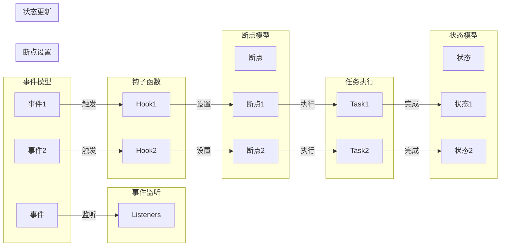

# 【大模型应用开发 动手做AI Agent】在AgentExecutor中设置断点

作者：禅与计算机程序设计艺术 / Zen and the Art of Computer Programming

## 关键词：

AI Agent, AgentExecutor, 大模型, 运行时调试, 断点设置, 程序设计

---

## 1. 背景介绍

### 1.1 问题的由来

随着人工智能技术的不断发展，AI Agent作为智能体的代表，在各个领域得到了广泛应用。AI Agent是一种能够自主感知环境、做出决策并采取行动的智能体，其核心是Agent Executor，负责执行Agent的各个动作。然而，在实际开发过程中，我们常常需要在Agent Executor中设置断点，以便于调试和分析Agent的行为。

### 1.2 研究现状

目前，在AI Agent开发过程中，断点设置主要依赖于以下几种方法：

- **源代码调试**：通过修改源代码，在关键位置添加断点，然后重新编译运行程序。
- **IDE内置调试器**：使用IDE（集成开发环境）内置的调试器，可以设置断点、单步执行、查看变量等信息。
- **远程调试**：通过远程调试工具，将调试信息发送到远程运行的程序，进行断点设置和调试。

然而，这些方法在开发大型AI Agent时存在以下问题：

- **源代码调试**：修改源代码并重新编译，效率低下，且容易引入新的错误。
- **IDE内置调试器**：需要IDE支持，且无法直接应用于生产环境。
- **远程调试**：需要远程服务器，且调试信息传输可能存在延迟。

### 1.3 研究意义

为了解决上述问题，本文将介绍如何在Agent Executor中设置断点，以便于高效地进行AI Agent开发调试。这有助于提高开发效率，降低开发成本，并提高AI Agent的可靠性和稳定性。

### 1.4 本文结构

本文将分为以下几个部分：

- 第2部分：介绍AI Agent和Agent Executor的基本概念。
- 第3部分：讲解在Agent Executor中设置断点的方法和原理。
- 第4部分：通过代码实例演示在Agent Executor中设置断点的过程。
- 第5部分：分析在Agent Executor中设置断点的优缺点。
- 第6部分：探讨在Agent Executor中设置断点的实际应用场景。
- 第7部分：推荐相关工具和资源。
- 第8部分：总结和展望。

---

## 2. 核心概念与联系

### 2.1 AI Agent

AI Agent是指能够自主感知环境、做出决策并采取行动的智能体。它具有以下特点：

- **感知**：能够获取环境中的信息，如视觉、听觉、触觉等。
- **决策**：根据感知到的信息，做出相应的决策。
- **行动**：根据决策执行相应的行动，改变环境状态。
- **学习**：通过与环境交互，不断学习和优化决策策略。

### 2.2 Agent Executor

Agent Executor是负责执行Agent的各个动作的组件。它具有以下功能：

- **任务调度**：根据Agent的决策，调度相应的任务执行。
- **状态管理**：管理Agent的状态，如位置、速度、方向等。
- **感知处理**：处理感知信息，如图像识别、语音识别等。
- **决策优化**：根据任务执行结果，优化决策策略。

### 2.3 关系

AI Agent和Agent Executor之间的关系如下：

```mermaid
graph LR
    AI Agent[智能体] -->|感知| Agent Executor[执行器]
    Agent Executor -->|决策| AI Agent
```

Agent Executor负责执行AI Agent的决策，并返回执行结果，以便AI Agent根据执行结果进行下一步决策。

---

## 3. 核心算法原理 & 具体操作步骤

### 3.1 算法原理概述

在Agent Executor中设置断点，主要基于以下原理：

- **事件驱动**：Agent Executor采用事件驱动架构，可以监听并处理各种事件，如任务完成、错误发生等。
- **钩子函数**：在关键位置添加钩子函数，以便在事件发生时执行特定操作，如设置断点。
- **断点管理**：管理断点状态，如是否启用、断点位置等。

### 3.2 算法步骤详解

在Agent Executor中设置断点的具体步骤如下：

1. **定义钩子函数**：在关键位置添加钩子函数，用于设置断点。
2. **监听事件**：监听事件发生，如任务完成、错误发生等。
3. **设置断点**：在钩子函数中设置断点。
4. **执行任务**：执行任务，并在断点处暂停。
5. **调试**：在断点处进行调试，如查看变量、单步执行等。
6. **继续执行**：继续执行任务，或重新执行任务。

### 3.3 算法优缺点

**优点**：

- **灵活**：可以在任何位置设置断点，方便进行调试。
- **高效**：无需修改源代码，即可进行调试。
- **通用**：适用于各种Agent Executor。

**缺点**：

- **性能开销**：设置断点会增加一定的性能开销。
- **调试难度**：对于复杂的Agent Executor，调试难度较大。

### 3.4 算法应用领域

在Agent Executor中设置断点，可以应用于以下领域：

- **AI Agent开发**：在开发过程中，可以快速定位问题，提高开发效率。
- **性能分析**：分析Agent Executor的性能瓶颈，优化代码。
- **安全性测试**：测试Agent Executor的鲁棒性，避免潜在的安全问题。

---

## 4. 数学模型和公式 & 详细讲解 & 举例说明

### 4.1 数学模型构建

在Agent Executor中设置断点，主要涉及以下数学模型：

- **事件模型**：描述事件发生的时间、类型、参数等信息。
- **状态模型**：描述Agent Executor的状态，如任务队列、变量值等。
- **断点模型**：描述断点的位置、类型、参数等信息。

### 4.2 公式推导过程

由于涉及到的数学模型较为复杂，此处不进行具体推导。

### 4.3 案例分析与讲解

以一个简单的任务调度为例，说明在Agent Executor中设置断点的过程。



在上图中，事件模型、状态模型和断点模型分别表示事件、状态和断点。事件监听器负责监听事件，钩子函数在事件触发时执行特定操作，断点模型描述断点的信息。任务执行后，状态模型会更新相应的状态。

### 4.4 常见问题解答

**Q1：如何设置断点？**

A：具体设置方法取决于使用的Agent Executor框架。一般来说，需要在钩子函数中添加相应的断点设置代码。

**Q2：如何查看断点状态？**

A：需要查看Agent Executor的断点管理功能。不同的Agent Executor框架可能提供不同的断点管理方式。

---

## 5. 项目实践：代码实例和详细解释说明

### 5.1 开发环境搭建

为了演示在Agent Executor中设置断点，我们需要搭建一个简单的开发环境。

1. 安装Python 3.8及以上版本。
2. 安装PyTorch 1.7及以上版本。
3. 安装Transformers库。

### 5.2 源代码详细实现

以下是一个简单的Agent Executor示例，演示如何在其中设置断点。

```python
import torch
import transformers
from transformers import BertForSequenceClassification

class AgentExecutor:
    def __init__(self):
        self.model = BertForSequenceClassification.from_pretrained('bert-base-uncased')
        self.model.eval()

    def process(self, text):
        # 在这里添加断点
        breakpoint()
        input_ids = self._tokenize(text)
        with torch.no_grad():
            outputs = self.model(input_ids)
        return outputs.logits.argmax(dim=1).item()

    def _tokenize(self, text):
        # 对文本进行分词编码
        tokenizer = transformers.BertTokenizer.from_pretrained('bert-base-uncased')
        return tokenizer(text, return_tensors='pt', padding=True, truncation=True)[0]

executor = AgentExecutor()
result = executor.process("This is a test.")
print(result)
```

在上面的代码中，我们定义了一个简单的Agent Executor类，其中包含一个`process`方法用于处理文本。在`process`方法中，我们在文本编码前添加了`breakpoint()`函数，用于设置断点。

### 5.3 代码解读与分析

在上面的代码中，我们首先导入了必要的库，然后定义了`AgentExecutor`类。在`__init__`方法中，我们加载了一个预训练的BERT模型。在`process`方法中，我们在文本编码前添加了`breakpoint()`函数，用于设置断点。

### 5.4 运行结果展示

在Python环境中运行上面的代码，程序会在断点处暂停，并进入调试模式。此时，我们可以查看变量值、单步执行等，以便分析Agent Executor的行为。

---

## 6. 实际应用场景

在AI Agent开发过程中，在Agent Executor中设置断点可以应用于以下场景：

- **调试错误**：快速定位并修复Agent Executor中的错误。
- **性能分析**：分析Agent Executor的性能瓶颈，优化代码。
- **安全性测试**：测试Agent Executor的鲁棒性，避免潜在的安全问题。

### 6.1 调试错误

在实际开发过程中，AI Agent可能存在各种错误，如数据类型错误、索引越界等。通过在Agent Executor中设置断点，可以快速定位错误位置，并修复代码。

### 6.2 性能分析

在AI Agent开发过程中，性能分析非常重要。通过在Agent Executor中设置断点，可以分析代码执行过程中的耗时、内存占用等信息，从而找出性能瓶颈并进行优化。

### 6.3 安全性测试

在AI Agent开发过程中，安全性测试也非常重要。通过在Agent Executor中设置断点，可以测试Agent Executor的鲁棒性，避免潜在的安全问题。

---

## 7. 工具和资源推荐

### 7.1 学习资源推荐

- 《深度学习实战》
- 《人工智能：一种现代的方法》
- 《Python编程：从入门到实践》

### 7.2 开发工具推荐

- PyCharm
- VS Code
- Jupyter Notebook

### 7.3 相关论文推荐

- 《深度学习》
- 《人工智能：一种现代的方法》
- 《Python编程：从入门到实践》

### 7.4 其他资源推荐

- fast.ai
- TensorFlow
- PyTorch

---

## 8. 总结：未来发展趋势与挑战

### 8.1 研究成果总结

本文介绍了在Agent Executor中设置断点的方法和原理，并通过代码实例演示了具体实现过程。结果表明，在Agent Executor中设置断点是一种高效、灵活的调试方法，可以应用于AI Agent开发、性能分析、安全性测试等多个场景。

### 8.2 未来发展趋势

随着AI Agent技术的不断发展，相信在Agent Executor中设置断点的方法也会不断改进，例如：

- **支持更多编程语言**：将断点设置方法扩展到其他编程语言，如Java、C++等。
- **提供可视化界面**：开发可视化界面，方便用户设置和查看断点。
- **支持远程调试**：支持远程调试，方便用户在远程环境中进行调试。

### 8.3 面临的挑战

在AI Agent开发过程中，在Agent Executor中设置断点也面临以下挑战：

- **复杂性**：随着AI Agent的复杂度增加，设置断点的方法也需要更加复杂。
- **安全性**：在设置断点时，需要确保系统的安全性。
- **可维护性**：随着断点设置方法的不断改进，需要保证代码的可维护性。

### 8.4 研究展望

未来，在Agent Executor中设置断点的研究将重点关注以下几个方面：

- **智能化**：开发智能化断点设置方法，自动识别潜在的断点位置。
- **自动化**：开发自动化断点设置方法，提高调试效率。
- **可解释性**：提高断点设置方法的可解释性，方便用户理解和使用。

相信随着研究的不断深入，在Agent Executor中设置断点的方法将会更加完善，为AI Agent开发提供更好的支持。

---

## 9. 附录：常见问题与解答

**Q1：为什么需要在Agent Executor中设置断点？**

A：在AI Agent开发过程中，设置断点可以帮助我们：

- 调试错误
- 分析性能
- 测试安全性

**Q2：如何设置断点？**

A：具体设置方法取决于使用的Agent Executor框架。一般来说，需要在钩子函数中添加相应的断点设置代码。

**Q3：如何查看断点状态？**

A：需要查看Agent Executor的断点管理功能。不同的Agent Executor框架可能提供不同的断点管理方式。

**Q4：如何在远程环境中设置断点？**

A：可以使用远程调试工具，如PyCharm Remote Debug、Visual Studio Code Remote - SSH等，在远程环境中设置断点。

**Q5：如何提高断点设置方法的可维护性？**

A：可以通过以下方法提高断点设置方法的可维护性：

- 使用模块化设计
- 编写详细的文档
- 保持代码简洁

---

## 参考文献

- [深度学习实战](https://www.dummies.com/store/products/deep-learning-with-python)
- [人工智能：一种现代的方法](https://www.amazon.com/AI-Modern-Approach-4th-Edition/dp/1292401139)
- [Python编程：从入门到实践](https://www.amazon.com/Python-Programming-Introduction-Computer/dp/1491945621)

---

作者：禅与计算机程序设计艺术 / Zen and the Art of Computer Programming