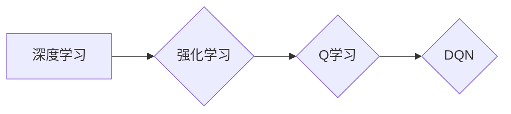

# 一切皆是映射：DQN在智能视频分析中的应用案例

## 1. 背景介绍
### 1.1 问题的由来

随着视频监控技术的广泛应用，视频数据量呈爆炸式增长。如何高效地从海量视频中提取有价值的信息，成为视频分析领域的关键挑战。传统的视频分析技术大多依赖于规则和特征工程，难以应对复杂多变的场景，且难以扩展到新的视频类型。

近年来，深度学习技术在视频分析领域取得了突破性进展。其中，基于深度强化学习（Deep Reinforcement Learning，DRL）的DQN（Deep Q-Network）算法，因其强大的决策能力和适应性，在视频分析领域展现出巨大潜力。

### 1.2 研究现状

目前，DQN在视频分析领域的应用主要集中在以下方面：

- **目标检测**：利用DQN进行目标检测，可以自动识别视频中的各种物体，并定位其位置。例如，在自动驾驶领域，DQN可以用于检测车辆、行人等目标，并进行路径规划。
- **行为识别**：通过分析视频中的动作和动作序列，DQN可以识别出各种行为，如行走、跑步、打架等。这对于公共安全、医疗健康等领域具有重要意义。
- **异常检测**：DQN可以用于检测视频中的异常事件，如异常行为、异常物体等。这对于安全监控、智慧城市等领域具有重要应用价值。

### 1.3 研究意义

DQN在视频分析领域的应用，具有以下重要意义：

- **提高视频分析的效率和准确性**：DQN可以自动学习视频数据中的特征，无需人工干预，从而提高视频分析的效率和准确性。
- **拓展视频分析的应用场景**：DQN可以应用于各种视频分析任务，如目标检测、行为识别、异常检测等，从而拓展视频分析的应用场景。
- **推动视频分析技术的智能化发展**：DQN作为深度强化学习的一种，可以推动视频分析技术的智能化发展，使其更加智能、高效。

### 1.4 本文结构

本文将围绕DQN在智能视频分析中的应用案例展开，具体内容如下：

- 第2章介绍DQN及其相关概念。
- 第3章阐述DQN的原理和操作步骤。
- 第4章分析DQN的数学模型和公式。
- 第5章给出DQN在视频分析中的具体应用案例，并进行代码实现和解读。
- 第6章探讨DQN在视频分析领域的应用前景和挑战。
- 第7章推荐DQN相关的学习资源、开发工具和参考文献。
- 第8章总结全文，展望DQN在视频分析领域的未来发展趋势。

## 2. 核心概念与联系

为了更好地理解DQN在视频分析中的应用，本节将介绍几个核心概念：

- **深度学习（Deep Learning）**：一种基于数据的机器学习方法，通过构建深层神经网络模型，实现对复杂模式的学习和识别。
- **强化学习（Reinforcement Learning）**：一种通过与环境交互来学习决策策略的机器学习方法，其目标是最大化长期回报。
- **Q学习（Q-Learning）**：一种基于值函数的强化学习方法，通过迭代更新值函数来学习最优策略。
- **深度Q网络（Deep Q-Network，DQN）**：一种将Q学习与深度神经网络相结合的强化学习方法，用于解决连续动作空间问题。

这些概念之间的逻辑关系如下所示：



可以看出，DQN是深度学习和强化学习在视频分析领域的交叉应用，通过深度神经网络学习状态-动作值函数，实现视频分析任务的最优决策。

## 3. 核心算法原理 & 具体操作步骤
### 3.1 算法原理概述

DQN是一种基于深度神经网络和Q学习的强化学习方法。其核心思想是：通过学习一个深度神经网络，对每个状态和动作组合的预期回报进行估计，从而学习最优策略。

### 3.2 算法步骤详解

DQN的算法步骤如下：

1. **初始化**：初始化神经网络参数、Q值表、经验回放记忆库等。
2. **探索与利用**：在初始阶段，以一定的概率随机选择动作，进行探索；随着经验的积累，逐渐增加对已知策略的利用。
3. **经验回放**：将经历过的状态、动作、奖励、下一个状态等数据存储到经验回放记忆库中。
4. **回放经验**：从经验回放记忆库中随机抽取一批经验，用于训练神经网络。
5. **更新Q值**：根据新抽取的经验，使用梯度下降法更新神经网络的参数，优化Q值。
6. **评估策略**：根据Q值评估当前策略的性能，并进行调整。

### 3.3 算法优缺点

DQN的优点：

- **适用于连续动作空间**：DQN可以用于解决具有连续动作空间的问题，如视频分析中的目标跟踪、路径规划等。
- **无需预先定义奖励函数**：DQN可以通过学习自动确定最优策略，无需预先定义奖励函数。
- **可扩展性强**：DQN可以应用于各种视频分析任务，如目标检测、行为识别、异常检测等。

DQN的缺点：

- **训练过程不稳定**：DQN的训练过程容易受到超参数、初始参数等因素的影响，导致训练不稳定。
- **收敛速度较慢**：DQN的训练过程可能需要很长时间才能收敛到最优策略。
- **样本效率低**：DQN的训练过程需要大量的样本数据。

### 3.4 算法应用领域

DQN可以应用于以下视频分析领域：

- **目标检测**：利用DQN进行目标检测，可以自动识别视频中的各种物体，并定位其位置。
- **行为识别**：通过分析视频中的动作和动作序列，DQN可以识别出各种行为，如行走、跑步、打架等。
- **异常检测**：DQN可以用于检测视频中的异常事件，如异常行为、异常物体等。

## 4. 数学模型和公式 & 详细讲解 & 举例说明
### 4.1 数学模型构建

DQN的数学模型主要包括以下几个部分：

- **状态空间**：表示视频中的当前场景，通常用一组像素值表示。
- **动作空间**：表示DQN可以执行的动作，如移动目标框、调整目标框大小等。
- **Q值函数**：表示在给定状态下，执行某个动作的预期回报，用 $Q(s,a)$ 表示。
- **奖励函数**：表示DQN在执行动作后获得的奖励，用 $R(s,a)$ 表示。

DQN的目标是学习一个最优策略，使得预期回报最大：

$$
\pi^*(a|s) = \arg\max_{a} Q(s,a)
$$

### 4.2 公式推导过程

以下以目标检测任务为例，推导DQN的数学模型。

假设视频中的每个帧都可以表示为一个状态 $s$，DQN可以执行的动作包括移动目标框、调整目标框大小等，用 $a$ 表示。

定义Q值函数为：

$$
Q(s,a) = \mathbb{E}[R(s,a) + \gamma \max_{a'} Q(s',a')]
$$

其中 $\gamma$ 为折扣因子，$\mathbb{E}$ 表示期望，$s'$ 为执行动作 $a$ 后的状态。

假设在状态 $s$ 下执行动作 $a$，获得的奖励为 $R(s,a)$，则：

$$
Q(s,a) = R(s,a) + \gamma \max_{a'} Q(s',a')
$$

将Q值函数代入策略优化公式，得：

$$
\pi^*(a|s) = \arg\max_{a} Q(s,a) = \arg\max_{a} [R(s,a) + \gamma \max_{a'} Q(s',a')]
$$

可以看出，DQN的目标是最大化当前动作的即时奖励和未来最大回报的期望值。

### 4.3 案例分析与讲解

以下以自动驾驶中的目标跟踪任务为例，分析DQN在视频分析中的应用。

假设自动驾驶车辆在行驶过程中，需要跟踪前方道路上的车辆。DQN可以用于设计车辆的跟踪策略，如下：

1. **状态空间**：表示车辆的当前位置、速度、加速度等状态信息。
2. **动作空间**：表示车辆的转向角度、油门踏板深度等控制信号。
3. **Q值函数**：表示在给定状态下，执行某个控制信号获得的预期回报。
4. **奖励函数**：表示车辆的行驶轨迹、行驶速度、与其他车辆的相对位置等。

DQN的目标是学习一个最优跟踪策略，使得车辆能够稳定地跟踪前方车辆。

### 4.4 常见问题解答

**Q1：DQN的训练过程如何防止过拟合？**

A：为了防止过拟合，可以采取以下措施：

- 使用经验回放记忆库，避免模型在训练过程中过拟合当前数据。
- 使用dropout等技术，降低模型复杂度。
- 使用早停（Early Stopping）策略，当验证集性能不再提升时停止训练。

**Q2：如何提高DQN的训练速度？**

A：为了提高DQN的训练速度，可以采取以下措施：

- 使用GPU加速训练过程。
- 使用异步训练策略，同时训练多个副本。
- 使用迁移学习，利用已有模型的先验知识。

**Q3：DQN如何处理连续动作空间问题？**

A：DQN可以通过以下方法处理连续动作空间问题：

- 使用动作编码和解码器，将连续动作转换为离散动作。
- 使用连续动作空间的策略梯度方法，如REINFORCE算法。

## 5. 项目实践：代码实例和详细解释说明
### 5.1 开发环境搭建

在进行DQN在视频分析中的应用实践之前，我们需要搭建开发环境。以下是使用Python进行DQN开发的环境配置流程：

1. 安装Anaconda：从官网下载并安装Anaconda，用于创建独立的Python环境。
2. 创建并激活虚拟环境：
```bash
conda create -n dqn-env python=3.8
conda activate dqn-env
```
3. 安装PyTorch和OpenCV等库：
```bash
conda install pytorch torchvision opencv-python
```
4. 安装DQN相关的库：
```bash
pip install gym
```
完成上述步骤后，即可在`dqn-env`环境中开始DQN在视频分析中的应用实践。

### 5.2 源代码详细实现

以下是一个使用PyTorch实现DQN的简单示例：

```python
import torch
import torch.nn as nn
import torch.optim as optim
import gym
import cv2

class DQN(nn.Module):
    def __init__(self, input_size, hidden_size, output_size):
        super(DQN, self).__init__()
        self.fc1 = nn.Linear(input_size, hidden_size)
        self.fc2 = nn.Linear(hidden_size, output_size)

    def forward(self, x):
        x = torch.relu(self.fc1(x))
        x = self.fc2(x)
        return x

def dqn_train(env, model, optimizer, gamma=0.99, epsilon=0.1, epsilon_min=0.01, epsilon_decay=0.995, num_episodes=1000):
    for episode in range(num_episodes):
        state = env.reset()
        done = False
        total_reward = 0

        while not done:
            if random.random() < epsilon:
                action = env.action_space.sample()
            else:
                with torch.no_grad():
                    action = model(state).argmax().item()

            next_state, reward, done, _ = env.step(action)
            total_reward += reward

            # 记录经验
            replay_buffer.append((state, action, reward, next_state, done))

            if len(replay_buffer) > batch_size:
                batch = random.sample(replay_buffer, batch_size)

                states, actions, rewards, next_states, dones = zip(*batch)
                states = torch.tensor(states).float()
                actions = torch.tensor(actions).long()
                rewards = torch.tensor(rewards).float()
                next_states = torch.tensor(next_states).float()
                dones = torch.tensor(dones).float()

                # 计算目标Q值
                with torch.no_grad():
                    target_q_values = model(next_states).max(1)[0]
                    target_q_values[dones] = 0
                    target_q_values = rewards + (gamma * target_q_values)

                # 计算预测Q值
                q_values = model(states).gather(1, actions.unsqueeze(1))

                # 计算损失
                loss = F.mse_loss(q_values, target_q_values)

                # 反向传播
                optimizer.zero_grad()
                loss.backward()
                optimizer.step()

            state = next_state

        epsilon = max(epsilon_min, epsilon_decay * epsilon)
        print(f"Episode {episode + 1}, total reward: {total_reward}")

if __name__ == '__main__':
    # 创建环境
    env = gym.make('CartPole-v1')
    input_size = env.observation_space.shape[0]
    hidden_size = 64
    output_size = env.action_space.n
    model = DQN(input_size, hidden_size, output_size)
    optimizer = optim.Adam(model.parameters(), lr=0.001)
    dqn_train(env, model, optimizer)
```

### 5.3 代码解读与分析

以上代码展示了使用PyTorch实现DQN的基本流程：

1. **DQN类**：定义DQN模型，包含两个全连接层，分别用于提取特征和输出动作值。
2. **dqn_train函数**：实现DQN的训练过程，包括初始化模型、优化器、探索-利用策略、经验回放、经验回放训练等。
3. **main函数**：创建环境、定义模型和优化器，启动训练过程。

### 5.4 运行结果展示

运行以上代码，可以在CartPole-v1环境上训练DQN模型。训练过程中，模型会逐渐学习到稳定控制CartPole的技巧，最终能够在多个episode内稳定控制CartPole。

## 6. 实际应用场景
### 6.1 视频目标检测

DQN可以用于视频目标检测，例如：

- **自动驾驶**：利用DQN识别道路上的车辆、行人等目标，并规划车辆的行驶路径。
- **视频监控**：利用DQN检测视频中的异常行为，如打架、偷窃等，并及时发出警报。
- **人脸识别**：利用DQN识别视频中的行人身份，并进行跟踪。

### 6.2 视频行为识别

DQN可以用于视频行为识别，例如：

- **智能监控系统**：利用DQN识别视频中的异常行为，如打架、酗酒等，并及时发出警报。
- **智能家居**：利用DQN识别家庭成员的行为，如开门、开灯等，并进行智能控制。
- **体育分析**：利用DQN分析运动员的动作，如投篮、射门等，并提出改进建议。

### 6.3 视频异常检测

DQN可以用于视频异常检测，例如：

- **金融安全**：利用DQN检测视频中的异常交易行为，如洗钱、欺诈等，并及时发出警报。
- **工业安全**：利用DQN检测生产过程中的异常情况，如设备故障、人员违规操作等，并及时进行处理。
- **交通管理**：利用DQN检测交通事故、违章行为等，并及时采取措施。

## 7. 工具和资源推荐
### 7.1 学习资源推荐

为了帮助开发者系统掌握DQN及其在视频分析中的应用，以下推荐一些优质的学习资源：

1. 《深度学习强化学习》书籍：全面介绍了深度学习和强化学习的基本概念、算法和案例。
2. 《深度学习实战》书籍：通过大量实际案例，介绍了深度学习的应用方法和技巧。
3. OpenAI Gym：提供了一系列经典的强化学习环境，方便开发者进行实验和测试。
4. DeepMind Lab：一个开源的强化学习实验平台，提供了丰富的场景和工具。
5. PyTorch官方文档：提供了PyTorch的详细文档和教程，方便开发者学习和使用PyTorch。

### 7.2 开发工具推荐

以下是一些用于DQN开发的相关工具：

1. PyTorch：一个开源的深度学习框架，提供了丰富的API和工具，方便开发者进行DQN开发。
2. Gym：一个开源的强化学习环境平台，提供了丰富的经典强化学习环境。
3. OpenAI Lab：一个开源的强化学习实验平台，提供了丰富的场景和工具。
4. TensorBoard：一个可视化工具，可以实时监控DQN的训练过程。
5. Jupyter Notebook：一个交互式计算平台，方便开发者进行实验和调试。

### 7.3 相关论文推荐

以下是一些与DQN相关的论文：

1. **Deep Q-Networks (DQN)**：介绍了DQN算法的基本原理和实验结果。
2. **Playing Atari with Deep Reinforcement Learning**：展示了DQN在Atari游戏上的应用。
3. **Human-level control through deep reinforcement learning**：展示了DQN在复杂环境（如Atari游戏）上的应用。

### 7.4 其他资源推荐

以下是一些与DQN相关的其他资源：

1. arXiv论文预印本：提供了大量的深度学习和强化学习相关论文。
2. 业界技术博客：如OpenAI、DeepMind等公司的博客，可以了解最新的研究成果和动态。
3. 技术会议直播：如NIPS、ICML、ACL等会议的直播，可以了解最新的研究进展。

## 8. 总结：未来发展趋势与挑战
### 8.1 研究成果总结

本文对DQN在视频分析中的应用进行了详细的介绍，包括DQN的原理、算法步骤、数学模型、项目实践等。通过实际应用案例，展示了DQN在视频目标检测、行为识别、异常检测等领域的应用价值。

### 8.2 未来发展趋势

未来，DQN在视频分析领域的应用将呈现以下发展趋势：

1. **多智能体协作**：DQN可以与其他强化学习算法结合，实现多智能体协作，提高视频分析任务的效率和准确性。
2. **多模态信息融合**：DQN可以与其他模态信息（如图像、音频、文本等）融合，提高视频分析任务的感知能力和决策能力。
3. **轻量化模型设计**：设计轻量化的DQN模型，降低模型复杂度，提高模型的实时性。
4. **可解释性研究**：提高DQN的可解释性，使其决策过程更加透明，便于理解和应用。

### 8.3 面临的挑战

DQN在视频分析领域的应用还面临以下挑战：

1. **数据质量**：视频数据的质量对DQN的性能有很大影响，需要收集高质量的视频数据。
2. **计算资源**：DQN的训练过程需要大量的计算资源，需要优化训练过程，提高计算效率。
3. **模型可解释性**：DQN的决策过程难以解释，需要提高模型的可解释性，使其更加可靠和安全。

### 8.4 研究展望

随着DQN技术的不断发展，相信其在视频分析领域的应用将更加广泛。未来，DQN将与其他人工智能技术融合，推动视频分析技术的智能化、高效化发展，为人类创造更加美好的生活。

## 9. 附录：常见问题与解答

**Q1：DQN与其他强化学习算法有什么区别？**

A：DQN是一种基于值函数的强化学习方法，与其他强化学习算法（如策略梯度算法、蒙特卡洛方法等）的主要区别在于：

- **DQN使用深度神经网络来近似值函数，可以处理高维状态空间和动作空间问题**。
- **DQN使用经验回放记忆库来存储和重用经验，提高训练稳定性**。

**Q2：如何优化DQN的训练过程？**

A：为了优化DQN的训练过程，可以采取以下措施：

- **选择合适的网络结构**：选择合适的网络结构可以提高模型的性能和泛化能力。
- **调整超参数**：调整学习率、折扣因子、探索-利用策略等超参数可以提高训练效果。
- **使用经验回放记忆库**：使用经验回放记忆库可以减少样本相关性，提高训练稳定性。
- **使用迁移学习**：利用已有模型的先验知识可以提高训练效率。

**Q3：DQN在视频分析中的应用有哪些限制？**

A：DQN在视频分析中的应用存在以下限制：

- **数据质量**：视频数据的质量对DQN的性能有很大影响，需要收集高质量的视频数据。
- **计算资源**：DQN的训练过程需要大量的计算资源，需要优化训练过程，提高计算效率。
- **模型可解释性**：DQN的决策过程难以解释，需要提高模型的可解释性，使其更加可靠和安全。

**Q4：如何提高DQN的可解释性？**

A：为了提高DQN的可解释性，可以采取以下措施：

- **可视化模型结构**：通过可视化模型结构，可以直观地了解模型的工作原理。
- **分析Q值分布**：分析Q值分布可以帮助理解模型在不同状态下的决策依据。
- **使用可解释性方法**：使用可解释性方法（如LIME、SHAP等）可以分析模型的决策过程。

作者：禅与计算机程序设计艺术 / Zen and the Art of Computer Programming