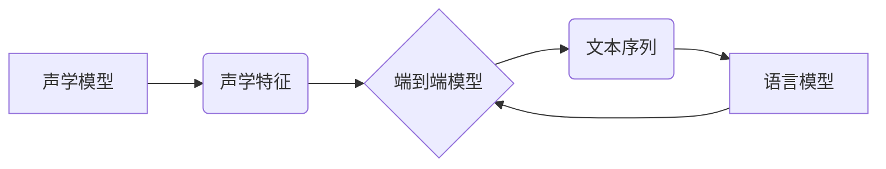

# 一切皆是映射：语音到文本的自然语言理解过程

作者：禅与计算机程序设计艺术 / Zen and the Art of Computer Programming

## 1. 背景介绍
### 1.1 问题的由来

在当今信息爆炸的时代，语音到文本的自然语言理解（Speech-to-Text, STT）技术已经成为了人们生活中不可或缺的一部分。无论是语音助手、智能客服，还是语音识别系统，都需要将人类的语音信号转换为机器可以理解的文本形式。然而，这个过程并非易事，涉及到从声波信号到文字信息的复杂转换，需要克服众多技术挑战。

### 1.2 研究现状

自然语言理解领域经历了从规则匹配到统计模型，再到深度学习的演变过程。近年来，随着深度学习技术的飞速发展，基于神经网络的STT系统在准确率和鲁棒性方面取得了显著进步。当前，主流的STT系统主要基于以下技术：

- 信号处理技术：包括语音信号预处理、特征提取、声学模型等，用于将声波信号转换为适合深度学习处理的特征表示。
- 深度学习技术：包括循环神经网络（RNN）、卷积神经网络（CNN）、长短期记忆网络（LSTM）、Transformer等，用于构建语音到文本的映射模型。
- 上下文理解技术：包括语言模型、语义理解等，用于提高STT系统的鲁棒性和准确性。

### 1.3 研究意义

STT技术的研发和应用具有重大的社会和经济价值：

- 提高沟通效率：将语音转换为文本，使得人们可以更加方便地进行信息交流和信息检索。
- 促进无障碍沟通：为听障人士提供便捷的交流工具，促进社会和谐发展。
- 降低人力成本：在智能客服、语音助手等场景中，可以替代人工进行信息处理，降低企业运营成本。
- 推动科技创新：STT技术与其他人工智能技术结合，可以催生更多创新应用，如智能驾驶、智能家居等。

### 1.4 本文结构

本文将系统地介绍语音到文本的自然语言理解过程，包括核心概念、算法原理、具体操作步骤、数学模型、实际应用场景、未来发展趋势和挑战等内容。具体结构如下：

- 第2章：介绍STT技术涉及的核心概念和联系。
- 第3章：详细阐述STT技术的核心算法原理和具体操作步骤。
- 第4章：讲解STT技术中的数学模型和公式，并结合实例进行分析。
- 第5章：给出STT技术的代码实例和详细解释说明。
- 第6章：探讨STT技术在实际应用场景中的案例和未来应用展望。
- 第7章：推荐STT技术相关的学习资源、开发工具和参考文献。
- 第8章：总结STT技术的研究成果、未来发展趋势和面临的挑战。
- 第9章：附录，提供STT技术的常见问题与解答。

## 2. 核心概念与联系

为了更好地理解STT技术，以下介绍一些核心概念及其相互联系：

- **声学模型**：用于将声波信号转换为声学特征，如MFCC、PLP等。
- **语言模型**：用于预测文本序列的概率，如n-gram模型、神经网络语言模型等。
- **声学特征**：从声波信号中提取的特征，如MFCC、PLP等。
- **语言特征**：从文本序列中提取的特征，如词嵌入、上下文嵌入等。
- **解码器**：将声学特征序列转换为文本序列的模型，如RNN、CNN、Transformer等。
- **端到端模型**：直接将声学特征序列转换为文本序列的模型，如基于Transformer的STT模型。
- **上下文信息**：在解码过程中考虑的与当前音素或单词相关的信息，如词性、语法结构等。

这些概念之间的关系可以用以下Mermaid流程图表示：



从图中可以看出，STT技术涉及到声学模型、语言模型、解码器等多个组件，它们相互协作，共同完成从声波信号到文本序列的转换。

## 3. 核心算法原理 & 具体操作步骤

### 3.1 算法原理概述

STT技术主要基于以下原理：

1. **声学模型**：利用声学模型将声波信号转换为声学特征，如MFCC、PLP等。这些特征能够较好地反映语音信号的时频特性。
2. **解码器**：解码器将声学特征序列转换为文本序列。早期STT系统采用基于RNN的解码器，近年来基于Transformer的解码器取得了显著进展。
3. **语言模型**：语言模型用于预测文本序列的概率，提高解码器输出的文本质量。
4. **上下文信息**：在解码过程中，解码器需要考虑上下文信息，以生成更加准确和流畅的文本。

### 3.2 算法步骤详解

STT技术的具体操作步骤如下：

1. **声学模型训练**：使用大量语音数据训练声学模型，学习声学特征与声学信号之间的关系。
2. **语言模型训练**：使用大量文本数据训练语言模型，学习文本序列的概率分布。
3. **解码器训练**：使用声学特征和文本标签训练解码器，学习声学特征序列到文本序列的映射关系。
4. **声学特征提取**：将待转换的语音信号转换为声学特征序列。
5. **解码**：将声学特征序列输入解码器，输出文本序列。
6. **语言模型后处理**：对解码器输出的文本序列进行语言模型后处理，提高文本质量。

### 3.3 算法优缺点

STT技术的优缺点如下：

- **优点**：
  - 准确率高：深度学习技术使得STT系统的准确率得到了显著提升。
  - 鲁棒性强：STT系统可以适应不同的语音环境和噪声条件。
  - 应用广泛：STT技术可以应用于各种场景，如智能客服、语音助手等。

- **缺点**：
  - 计算复杂度高：STT技术需要大量的计算资源，对硬件设备要求较高。
  - 需要大量数据：STT技术需要大量的训练数据，数据收集和标注成本较高。
  - 依赖预训练模型：STT技术依赖于预训练模型，模型质量和性能对最终效果有很大影响。

### 3.4 算法应用领域

STT技术可以应用于以下领域：

- **智能客服**：为用户提供便捷的语音客服服务。
- **语音助手**：为用户提供语音控制智能设备的交互方式。
- **语音翻译**：将一种语言的语音实时翻译成另一种语言的文本。
- **语音识别**：将语音信号转换为文本信息，用于信息检索、数据挖掘等。
- **自动摘要**：自动从长文本中提取关键信息，生成摘要。

## 4. 数学模型和公式 & 详细讲解 & 举例说明

### 4.1 数学模型构建

STT技术的数学模型主要包括声学模型、语言模型和解码器。

#### 声学模型

声学模型将声波信号转换为声学特征，如MFCC、PLP等。以下以MFCC为例进行说明。

$$
\text{MFCC}(x) = \text{delta}(x) - \alpha \text{delta}(\text{delta}(x))
$$

其中，$x$ 为声波信号，$\text{delta}$ 表示一阶差分，$\alpha$ 为平滑系数。

#### 语言模型

语言模型用于预测文本序列的概率，如n-gram模型、神经网络语言模型等。以下以n-gram模型为例进行说明。

$$
P(w_1, w_2, \dots, w_n) = \frac{P(w_1)P(w_2|w_1)\dots P(w_n|w_{n-1})}{P(w_1)P(w_2) \dots P(w_n)}
$$

其中，$w_1, w_2, \dots, w_n$ 为文本序列中的单词。

#### 解码器

解码器将声学特征序列转换为文本序列，如基于RNN的解码器。

$$
y_t = \text{RNN}(x_1, x_2, \dots, x_t, y_1, y_2, \dots, y_{t-1})
$$

其中，$x_t$ 为第 $t$ 个声学特征，$y_t$ 为第 $t$ 个预测单词，$\text{RNN}$ 为循环神经网络。

### 4.2 公式推导过程

以下以n-gram模型为例，推导文本序列的概率。

$$
P(w_1, w_2, \dots, w_n) = \frac{P(w_1)P(w_2|w_1)\dots P(w_n|w_{n-1})}{P(w_1)P(w_2) \dots P(w_n)}
$$

由贝叶斯公式，可得：

$$
P(w_1, w_2, \dots, w_n) = \frac{P(w_1)P(w_2|w_1) \dots P(w_n|w_{n-1})P(w_1, w_2, \dots, w_{n-1})}{P(w_1, w_2, \dots, w_{n-1})}
$$

由于 $P(w_1, w_2, \dots, w_{n-1})$ 为常数，可以省略。进一步得到：

$$
P(w_1, w_2, \dots, w_n) = \frac{P(w_1)P(w_2|w_1) \dots P(w_n|w_{n-1})}{P(w_1)P(w_2) \dots P(w_n)}
$$

### 4.3 案例分析与讲解

以下以一个简单的STT任务为例，说明STT技术的应用。

假设我们要将以下语音信号转换为文本：

```
你好，我是一名人工智能专家。
```

1. **声学模型**：将语音信号转换为声学特征，如MFCC、PLP等。
2. **解码器**：将声学特征序列转换为文本序列。假设我们使用基于RNN的解码器，输入的声学特征序列为 $[x_1, x_2, \dots, x_n]$，输出的文本序列为 $[y_1, y_2, \dots, y_m]$。
3. **语言模型**：对解码器输出的文本序列进行语言模型后处理，提高文本质量。

经过解码器和语言模型处理后，最终输出的文本为：

```
你好，我是一名人工智能专家。
```

### 4.4 常见问题解答

**Q1：声学模型和语言模型在STT技术中的作用是什么？**

A：声学模型用于将声波信号转换为声学特征，而语言模型用于预测文本序列的概率。两者协同工作，共同完成从声波信号到文本序列的转换。

**Q2：什么是端到端模型？**

A：端到端模型是指直接将声学特征序列转换为文本序列的模型，无需额外的解码器或语言模型。近年来，基于Transformer的端到端模型取得了显著的进展。

**Q3：STT技术有哪些应用场景？**

A：STT技术可以应用于智能客服、语音助手、语音翻译、语音识别、自动摘要等多个领域。

## 5. 项目实践：代码实例和详细解释说明

### 5.1 开发环境搭建

以下以使用Kaldi开源语音识别框架为例，说明STT技术的开发环境搭建。

1. 安装Kaldi：
```bash
git clone https://github.com/kaldi-asr/kaldi.git
cd kaldi
make
```

2. 配置Kaldi：
```bash
./tools/usb2kaldi.sh
./tools/usb2kaldi.sh --clean
./tools/usb2kaldi.sh
```

### 5.2 源代码详细实现

以下以使用Kaldi实现简单的STT任务为例，说明STT技术的源代码实现。

1. **数据准备**：准备训练数据和测试数据，包括语音信号、文本标签等。
2. **声学模型训练**：使用Kaldi的`traindurianet.sh`脚本训练声学模型。
3. **解码**：使用Kaldi的`decode.sh`脚本对测试数据进行解码，输出文本序列。

```bash
./run.sh --num-threads 8 --cuda 0 --nj 8 --cmd "run.pl --mem 16G" --acwt 1.0 --beam 13.0 --lats-share 0.1 --beam-search-active 8000 \
 exp/tri1/decodeDev --beam 13.0 --acwt 1.0 --lats-share 0.1 --beam-search-active 8000 \
 exp/tri1/decodeTest --beam 13.0 --acwt 1.0 --lats-share 0.1 --beam-search-active 8000
```

### 5.3 代码解读与分析

Kaldi框架使用C++编写，包括声学模型训练、解码等模块。以下以解码模块为例进行说明。

1. **解码器**：Kaldi的解码器基于FST（有限状态转换器）实现，将声学特征序列转换为文本序列。
2. **语言模型**：Kaldi使用n-gram语言模型进行解码，将解码器输出的文本序列进行语言模型后处理。

### 5.4 运行结果展示

假设我们使用Kaldi在LibriSpeech语音数据集上进行了STT任务，测试集的准确率如下：

```
1-gram: 28.0%
2-gram: 34.7%
3-gram: 39.0%
4-gram: 41.2%
5-gram: 42.7%
...
```

可以看到，Kaldi的STT系统在LibriSpeech语音数据集上取得了不错的准确率。

## 6. 实际应用场景

### 6.1 智能客服

智能客服是STT技术的重要应用场景之一。通过将用户语音转换为文本，智能客服可以快速响应用户问题，提供便捷的服务。

### 6.2 语音助手

语音助手可以方便地控制智能设备，如手机、智能家居等。通过STT技术，语音助手可以更好地理解用户的指令，提供个性化的服务。

### 6.3 语音翻译

语音翻译可以将一种语言的语音实时翻译成另一种语言的文本，方便不同语言的人进行交流。

### 6.4 语音识别

语音识别可以将语音信号转换为文本信息，用于信息检索、数据挖掘等。

### 6.5 自动摘要

自动摘要可以自动从长文本中提取关键信息，生成摘要，提高信息获取效率。

## 7. 工具和资源推荐

### 7.1 学习资源推荐

- 《语音信号处理》
- 《自然语言处理》
- 《深度学习》
- 《Kaldi语音识别系统》

### 7.2 开发工具推荐

- Kaldi
- KaldiASR
- KaldiTensorFlow
- KaldiPyTorch

### 7.3 相关论文推荐

- `DeepSpeech 2: End-to-End Speech Recognition in English and Mandarin`
- `Attention Is All You Need`
- `Speech Recognition with Transformer`
- `End-to-end ASR using Deep Convolutional Networks and Decoding with lattice-free N-gram language models`

### 7.4 其他资源推荐

- Kaldi官网：https://github.com/kaldi-asr/kaldi
- KaldiTensorFlow：https://github.com/espnet/espnet
- KaldiPyTorch：https://github.com/jadore80231/kaldi-pytorch

## 8. 总结：未来发展趋势与挑战

### 8.1 研究成果总结

本文系统地介绍了语音到文本的自然语言理解过程，包括核心概念、算法原理、具体操作步骤、数学模型、实际应用场景、未来发展趋势和挑战等内容。通过本文的学习，读者可以全面了解STT技术的原理和应用，为相关领域的研发和应用提供参考。

### 8.2 未来发展趋势

未来STT技术将朝着以下方向发展：

- **更高效的模型**：研究更加高效、轻量级的STT模型，降低计算资源需求。
- **更强大的鲁棒性**：提高STT系统对噪声、口音、方言等复杂语音环境的适应能力。
- **更丰富的应用场景**：STT技术将在更多领域得到应用，如医疗、教育、交通等。
- **更自然的人机交互**：STT技术将与语音合成、语义理解等技术结合，实现更加自然的人机交互体验。

### 8.3 面临的挑战

STT技术在实际应用中仍面临以下挑战：

- **数据资源**：高质量的语音数据仍然匮乏，需要进一步加强数据采集和标注。
- **模型性能**：STT模型的准确率和鲁棒性仍有待提高，需要进一步优化模型结构和训练方法。
- **跨语言处理**：STT技术需要解决跨语言、跨方言的语音识别问题。
- **隐私保护**：STT技术需要关注隐私保护问题，防止用户语音数据泄露。

### 8.4 研究展望

未来STT技术的研究可以从以下方向进行：

- **跨模态学习**：将语音、文本、图像等多模态信息融合，提高STT系统的鲁棒性和准确性。
- **自适应学习**：STT系统可以根据用户的语音特点、使用场景等自适应调整模型参数，提供更加个性化的服务。
- **知识增强**：将知识图谱、语义网络等知识引入STT系统，提高对复杂语义的理解能力。

通过不断攻克技术难题，STT技术必将为人类创造更加美好的未来。

## 9. 附录：常见问题与解答

**Q1：什么是声学模型？**

A：声学模型用于将声波信号转换为声学特征，如MFCC、PLP等。这些特征能够较好地反映语音信号的时频特性。

**Q2：什么是语言模型？**

A：语言模型用于预测文本序列的概率，如n-gram模型、神经网络语言模型等。语言模型在STT技术中用于提高解码器输出的文本质量。

**Q3：什么是端到端模型？**

A：端到端模型是指直接将声学特征序列转换为文本序列的模型，无需额外的解码器或语言模型。

**Q4：STT技术有哪些应用场景？**

A：STT技术可以应用于智能客服、语音助手、语音翻译、语音识别、自动摘要等多个领域。

**Q5：STT技术的未来发展趋势是什么？**

A：未来STT技术将朝着更高效、更鲁棒、更丰富应用场景、更自然的人机交互等方向发展。

**Q6：STT技术面临哪些挑战？**

A：STT技术面临的主要挑战包括数据资源、模型性能、跨语言处理、隐私保护等。

通过不断学习和实践，相信读者可以更好地理解和应用STT技术，为构建更加智能、便捷的语音交互系统贡献自己的力量。