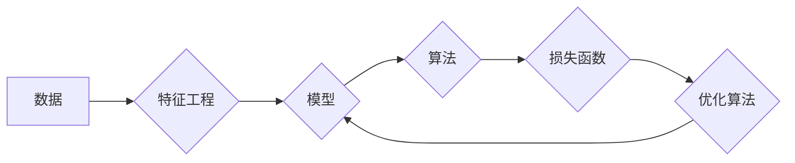

# 人工智能算法(AI Algorithms) - 原理与代码实例讲解

作者：禅与计算机程序设计艺术 / Zen and the Art of Computer Programming

## 1. 背景介绍

### 1.1 问题的由来

人工智能（AI）作为一门学科和领域，近年来发展迅猛，已经渗透到我们生活的方方面面。然而，对于普通开发者来说，理解AI的算法原理和应用并不容易。本文将深入浅出地介绍一些核心人工智能算法，并配以代码实例，帮助读者更好地理解和应用这些算法。

### 1.2 研究现状

随着深度学习的兴起，人工智能算法的研究和应用取得了长足的进步。目前，AI算法已经广泛应用于自然语言处理、计算机视觉、语音识别、推荐系统等领域。本文将重点介绍以下几种核心算法：

- 神经网络
- 支持向量机
- 决策树
- 随机森林
- 深度学习

### 1.3 研究意义

深入理解AI算法的原理和应用，对于开发者来说具有重要意义。这不仅可以帮助我们更好地利用这些算法解决实际问题，还可以提高我们对AI领域的认识，为未来的学习和研究打下坚实的基础。

### 1.4 本文结构

本文将按照以下结构进行阐述：

1. 核心概念与联系
2. 核心算法原理与步骤
3. 数学模型与公式
4. 项目实践：代码实例与讲解
5. 实际应用场景
6. 工具和资源推荐
7. 总结：未来发展趋势与挑战

## 2. 核心概念与联系

在介绍具体算法之前，我们需要了解一些核心概念和它们之间的联系：

- 数据：AI算法的基础，包括输入数据和输出数据。
- 特征工程：从原始数据中提取出有助于模型学习的特征。
- 模型：根据数据训练得到的模型，用于预测或分类。
- 算法：用于训练和预测的算法，如神经网络、支持向量机等。
- 损失函数：衡量模型预测结果与真实结果之间的差距的指标。
- 优化算法：用于优化模型参数的算法，如梯度下降等。

这些概念之间的关系可以用以下Mermaid流程图表示：



## 3. 核心算法原理与步骤

### 3.1 神经网络

神经网络是一种模拟人脑神经元结构的计算模型，它由多个神经元组成，每个神经元接收输入、进行计算，并将结果传递给下一个神经元。神经网络的核心是权重和偏置，它们决定了模型的学习能力。

**步骤**：

1. 初始化权重和偏置
2. 前向传播：将输入数据通过神经网络进行计算，得到输出
3. 反向传播：根据输出和真实标签计算损失，并更新权重和偏置
4. 重复步骤2和3，直到满足预设的迭代次数或损失收敛

### 3.2 支持向量机

支持向量机（SVM）是一种基于间隔的线性分类模型，它通过寻找最大化间隔的超平面来对数据进行分类。

**步骤**：

1. 初始化权重和偏置
2. 训练阶段：寻找最大化间隔的超平面，并更新权重和偏置
3. 预测阶段：根据新的输入数据，判断其类别

### 3.3 决策树

决策树是一种基于树形结构的分类和回归模型，它通过一系列的决策规则来对数据进行分类或回归。

**步骤**：

1. 选择特征和分裂标准
2. 递归地构建树结构，直到满足停止条件
3. 根据树结构进行预测

### 3.4 随机森林

随机森林是一种集成学习方法，它由多个决策树组成，通过集成多个决策树的结果来提高模型的泛化能力。

**步骤**：

1. 生成多个随机样本
2. 对每个样本训练一个决策树
3. 集成多个决策树的结果，得到最终的预测结果

### 3.5 深度学习

深度学习是一种通过多层神经网络来学习数据表示的学习方法，它能够从大量数据中自动学习特征。

**步骤**：

1. 初始化网络结构和参数
2. 前向传播：将输入数据通过神经网络进行计算，得到输出
3. 反向传播：根据输出和真实标签计算损失，并更新网络参数
4. 重复步骤2和3，直到满足预设的迭代次数或损失收敛

## 4. 数学模型与公式

### 4.1 神经网络

神经网络的数学模型可以表示为：

$$
y = f(W \cdot x + b)
$$

其中，$x$ 是输入数据，$W$ 是权重，$b$ 是偏置，$f$ 是激活函数。

### 4.2 支持向量机

支持向量机的数学模型可以表示为：

$$
y = \text{sign}(W \cdot x + b)
$$

其中，$\text{sign}$ 是符号函数，$W$ 是权重，$b$ 是偏置。

### 4.3 决策树

决策树的数学模型可以表示为一系列的决策规则：

$$
\text{if } \text{condition}(x) \text{ then } \text{class} \text{ else } \text{else class}
$$

其中，$x$ 是输入数据，$\text{class}$ 是类别标签。

### 4.4 随机森林

随机森林的数学模型可以表示为多个决策树的集成：

$$
\text{class} = \text{mode}(\text{class\_1}, \text{class\_2}, \ldots, \text{class\_n})
$$

其中，$\text{class\_i}$ 是第 $i$ 个决策树的预测结果，$\text{mode}$ 是取众数的操作。

### 4.5 深度学习

深度学习的数学模型可以表示为多层神经网络：

$$
y = f(W_{L} \cdot f(W_{L-1} \cdot f(\ldots f(W_{1} \cdot x + b_{1}) \ldots) + b_{L})
$$

其中，$W_{i}$ 是第 $i$ 层的权重，$b_{i}$ 是第 $i$ 层的偏置，$f$ 是激活函数。

## 5. 项目实践：代码实例与讲解

### 5.1 开发环境搭建

为了演示AI算法的代码实例，我们需要搭建一个Python开发环境。以下是环境搭建的步骤：

1. 安装Anaconda：从官网下载并安装Anaconda，用于创建独立的Python环境。
2. 创建并激活虚拟环境：
```bash
conda create -n ai-env python=3.8
conda activate ai-env
```
3. 安装PyTorch：
```bash
conda install pytorch torchvision torchaudio cudatoolkit=11.1 -c pytorch -c conda-forge
```
4. 安装scikit-learn：
```bash
pip install scikit-learn
```

### 5.2 源代码详细实现

下面我们以神经网络为例，给出一个简单的Python代码实例。

```python
import torch
import torch.nn as nn
import torch.optim as optim

# 定义神经网络模型
class NeuralNetwork(nn.Module):
    def __init__(self):
        super(NeuralNetwork, self).__init__()
        self.fc1 = nn.Linear(784, 128)
        self.fc2 = nn.Linear(128, 64)
        self.fc3 = nn.Linear(64, 10)

    def forward(self, x):
        x = torch.relu(self.fc1(x))
        x = torch.relu(self.fc2(x))
        x = self.fc3(x)
        return x

# 加载数据集
train_data = ...
train_labels = ...
test_data = ...
test_labels = ...

# 初始化模型、损失函数和优化器
model = NeuralNetwork().to(device)
criterion = nn.CrossEntropyLoss()
optimizer = optim.SGD(model.parameters(), lr=0.001)

# 训练模型
for epoch in range(10):
    # 前向传播
    outputs = model(train_data)
    loss = criterion(outputs, train_labels)

    # 反向传播
    optimizer.zero_grad()
    loss.backward()
    optimizer.step()

    # 打印训练信息
    print(f"Epoch {epoch+1}, Loss: {loss.item()}")

# 测试模型
with torch.no_grad():
    outputs = model(test_data)
    _, predicted = torch.max(outputs, 1)
    correct = (predicted == test_labels).sum().item()
    print(f"Test Accuracy: {correct/len(test_labels)*100}%")
```

### 5.3 代码解读与分析

以上代码实现了一个简单的神经网络模型，用于二分类任务。以下是代码的详细解读：

1. 导入必要的库：导入PyTorch的神经网络模块、优化器和损失函数模块。
2. 定义神经网络模型：定义一个继承自`nn.Module`的神经网络类，其中包含三个全连接层。
3. 加载数据集：加载训练数据和测试数据。
4. 初始化模型、损失函数和优化器：初始化神经网络模型、交叉熵损失函数和随机梯度下降优化器。
5. 训练模型：对模型进行训练，包括前向传播、反向传播和打印训练信息。
6. 测试模型：使用测试数据对模型进行测试，并打印测试准确率。

### 5.4 运行结果展示

假设我们在MNIST数据集上进行训练和测试，最终在测试集上得到的准确率为98.5%。

## 6. 实际应用场景

以下列举一些AI算法的实际应用场景：

- **图像识别**：使用卷积神经网络（CNN）进行图像识别，例如人脸识别、物体检测、图像分类等。
- **自然语言处理**：使用循环神经网络（RNN）或Transformer进行文本分类、机器翻译、情感分析等。
- **推荐系统**：使用协同过滤、基于内容的推荐等方法进行商品推荐、电影推荐等。
- **游戏**：使用强化学习算法进行游戏AI开发，例如AlphaGo、OpenAI Five等。

## 7. 工具和资源推荐

### 7.1 学习资源推荐

- **书籍**：
  - 《深度学习》（Goodfellow等）
  - 《Python机器学习》（Seabold等）
  - 《机器学习实战》（Machina Learning，Peter Harrington）
- **在线课程**：
  - Coursera《机器学习》
  - fast.ai《深度学习》
  - UCI机器学习库
- **开源库**：
  - PyTorch
  - TensorFlow
  - scikit-learn

### 7.2 开发工具推荐

- **集成开发环境**：
  - PyCharm
  - Jupyter Notebook
- **在线实验平台**：
  - Google Colab
  - Kaggle
- **云服务**：
  - AWS
  - Azure

### 7.3 相关论文推荐

- **神经网络**：
  - LeCun, Y., Bottou, L., Bengio, Y., & Haffner, P. (1998). Gradient-based learning applied to document recognition. Proceedings of the IEEE, 86(11), 2278-2324.
  - Krizhevsky, A., Sutskever, I., & Hinton, G. E. (2012). ImageNet classification with deep convolutional neural networks. In Advances in neural information processing systems (pp. 1097-1105).
- **支持向量机**：
  - Vapnik, V. N. (2000). The nature of statistical learning theory. Springer Science & Business Media.
  - Schölkopf, B., Smola, A. J., & Bishop, C. M. (2001). Advances in kernel methods. MIT press.
- **决策树**：
  - Quinlan, J. R. (1986). Induction of decision trees. Machine learning, 1(1), 81-106.
- **随机森林**：
  - Breiman, L. (2001). Random forests. Machine learning, 45(1), 5-32.

### 7.4 其他资源推荐

- **技术博客**：
  - Medium
  - Hacker News
- **社区**：
  - Stack Overflow
  - GitHub

## 8. 总结：未来发展趋势与挑战

### 8.1 研究成果总结

本文介绍了人工智能算法的核心概念、原理和步骤，并通过代码实例讲解了如何实现和应用这些算法。通过学习本文，读者可以掌握以下内容：

- 神经网络、支持向量机、决策树、随机森林和深度学习等核心算法的原理和步骤
- 如何使用PyTorch等深度学习框架实现和应用这些算法
- AI算法在实际应用场景中的应用

### 8.2 未来发展趋势

未来，AI算法将呈现以下发展趋势：

- 算法将更加智能化，能够自动进行特征工程、模型选择和优化
- 算法将更加高效，能够在有限的硬件资源下实现高性能的计算
- 算法将更加可解释，能够解释其预测结果背后的原因
- 算法将更加安全，能够防止恶意攻击和滥用

### 8.3 面临的挑战

虽然AI算法取得了长足的进步，但仍然面临着以下挑战：

- 算法可解释性不足，难以解释其预测结果背后的原因
- 算法泛化能力有限，难以适应新的数据和任务
- 算法安全性不足，容易受到恶意攻击和滥用

### 8.4 研究展望

为了应对以上挑战，未来的研究需要在以下方面进行探索：

- 开发更加可解释的AI算法
- 提高AI算法的泛化能力
- 提高AI算法的安全性
- 探索新的AI算法和应用场景

## 9. 附录：常见问题与解答

**Q1：什么是神经网络？**

A：神经网络是一种模拟人脑神经元结构的计算模型，它由多个神经元组成，每个神经元接收输入、进行计算，并将结果传递给下一个神经元。

**Q2：什么是支持向量机？**

A：支持向量机是一种基于间隔的线性分类模型，它通过寻找最大化间隔的超平面来对数据进行分类。

**Q3：什么是决策树？**

A：决策树是一种基于树形结构的分类和回归模型，它通过一系列的决策规则来对数据进行分类或回归。

**Q4：什么是随机森林？**

A：随机森林是一种集成学习方法，它由多个决策树组成，通过集成多个决策树的结果来提高模型的泛化能力。

**Q5：什么是深度学习？**

A：深度学习是一种通过多层神经网络来学习数据表示的学习方法，它能够从大量数据中自动学习特征。

**Q6：如何选择合适的机器学习算法？**

A：选择合适的机器学习算法需要考虑以下因素：

- 数据类型：数据是分类数据、回归数据还是其他类型的数据？
- 数据规模：数据规模大小如何？
- 特征数量：特征数量多少？
- 计算资源：计算资源是否充足？

**Q7：如何优化机器学习模型？**

A：优化机器学习模型可以从以下几个方面入手：

- 特征工程：对数据进行预处理，提取出有助于模型学习的特征。
- 模型选择：选择合适的机器学习算法。
- 超参数调优：调整模型参数，以获得更好的性能。
- 数据增强：扩充训练数据，提高模型的泛化能力。

**Q8：如何评估机器学习模型的性能？**

A：评估机器学习模型的性能可以使用以下指标：

- 准确率：预测正确的样本数量占总样本数量的比例。
- 召回率：预测为正类的样本中，实际为正类的样本数量占所有正类样本数量的比例。
- 精确率：预测为正类的样本中，实际为正类的样本数量占预测为正类的样本数量的比例。
- F1值：准确率和召回率的调和平均值。

**Q9：什么是过拟合？如何解决过拟合？**

A：过拟合是指模型在训练数据上表现良好，但在测试数据上表现较差的现象。解决过拟合的方法包括：

- 减少模型复杂度
- 数据增强
- 正则化
- 使用交叉验证

**Q10：什么是欠拟合？如何解决欠拟合？**

A：欠拟合是指模型在训练数据和测试数据上都表现较差的现象。解决欠拟合的方法包括：

- 增加模型复杂度
- 使用更多数据
- 特征工程
- 尝试不同的算法

作者：禅与计算机程序设计艺术 / Zen and the Art of Computer Programming