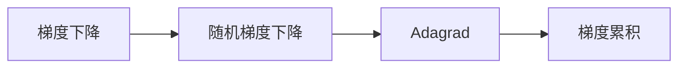

# 优化算法：Adagrad 原理与代码实例讲解

## 1. 背景介绍

### 1.1 问题的由来

在深度学习领域，优化算法是核心技术之一。它决定了模型能否高效地学习到参数，从而获得良好的性能。传统的随机梯度下降（SGD）算法虽然简单易行，但在实际应用中存在收敛速度慢、容易陷入局部最优等问题。为了解决这些问题，研究者们提出了许多改进的优化算法，其中Adagrad算法因其简洁高效的特点而备受关注。

### 1.2 研究现状

Adagrad算法由Duchi等人于2011年提出，它通过为每个参数分配不同的学习率，有效解决了SGD算法的收敛速度慢、容易陷入局部最优等问题。近年来，Adagrad算法在机器学习领域得到了广泛的应用，并取得了显著的成果。

### 1.3 研究意义

Adagrad算法的提出，为深度学习领域提供了一种高效、稳定的优化方法。它不仅简化了优化过程，降低了计算复杂度，而且能够有效提高模型性能。因此，研究Adagrad算法具有重要的理论意义和实际应用价值。

### 1.4 本文结构

本文将系统介绍Adagrad算法的原理、实现方法和应用场景，内容安排如下：

- 第2部分，介绍Adagrad算法的核心概念与联系。
- 第3部分，详细阐述Adagrad算法的原理和具体操作步骤。
- 第4部分，通过数学模型和公式，对Adagrad算法进行详细讲解。
- 第5部分，给出Adagrad算法的代码实例，并对关键代码进行解读。
- 第6部分，探讨Adagrad算法在实际应用中的场景和案例。
- 第7部分，推荐Adagrad算法相关的学习资源、开发工具和参考文献。
- 第8部分，总结全文，展望Adagrad算法的未来发展趋势与挑战。

## 2. 核心概念与联系

为了更好地理解Adagrad算法，本节将介绍几个密切相关的核心概念：

- 梯度下降（Gradient Descent）：一种最简单的优化算法，通过迭代更新参数，使得损失函数值不断减小。
- 随机梯度下降（Stochastic Gradient Descent，SGD）：在梯度下降的基础上，使用样本的梯度进行参数更新，以加快收敛速度。
- 学习率（Learning Rate）：控制参数更新步长的大小，是优化算法中重要的超参数。
- 梯度累积（Gradient Accumulation）：在处理小批量数据时，将多个样本的梯度累积后再进行参数更新。

Adagrad算法的逻辑关系如下图所示：



可以看出，Adagrad算法是在随机梯度下降的基础上发展而来的，通过引入梯度累积的概念，有效提高了优化过程的稳定性。

## 3. 核心算法原理 & 具体操作步骤

### 3.1 算法原理概述

Adagrad算法的核心思想是：为每个参数分配一个学习率，并根据参数的梯度进行更新。具体而言，Adagrad算法通过计算每个参数梯度的累积和，然后除以梯度累积的平方根，得到该参数的学习率，进而更新参数。

### 3.2 算法步骤详解

Adagrad算法的具体步骤如下：

1. 初始化参数 $\theta$ 和累积梯度 $g_t^2$，并将学习率 $\eta$ 设置为一个较小的值，如 $1e-2$。
2. 对每个参数 $\theta$，计算梯度 $g_t$。
3. 更新累积梯度 $g_t^2 = g_t^2 + g_t^2$。
4. 更新参数 $\theta = \theta - \frac{\eta}{\sqrt{g_t^2 + \epsilon}} \cdot g_t$，其中 $\epsilon$ 是一个正数，用于避免除以零。
5. 重复步骤2-4，直至满足预设的迭代次数或损失函数收敛。

### 3.3 算法优缺点

Adagrad算法具有以下优点：

1. 简单易行，易于实现。
2. 对噪声数据鲁棒，能够有效处理稀疏梯度。
3. 收敛速度快，能够快速找到最优解。

然而，Adagrad算法也存在一些缺点：

1. 学习率更新公式会导致学习率随迭代次数增加而逐渐减小，可能导致参数更新缓慢。
2. 对于稀疏梯度，Adagrad算法会出现梯度消失问题，使得学习率逐渐减小，导致收敛速度变慢。

### 3.4 算法应用领域

Adagrad算法在以下领域得到了广泛的应用：

- 机器学习：用于优化深度学习模型参数。
- 自然语言处理：用于优化NLP任务中的模型参数。
- 计算机视觉：用于优化图像处理任务中的模型参数。

## 4. 数学模型和公式 & 详细讲解 & 举例说明

### 4.1 数学模型构建

Adagrad算法的数学模型如下：

$$
g_t^2 = g_t^2 + g_t^2
$$

$$
\theta = \theta - \frac{\eta}{\sqrt{g_t^2 + \epsilon}} \cdot g_t
$$

其中，$g_t$ 表示第 $t$ 次迭代的梯度，$g_t^2$ 表示梯度累积，$\eta$ 表示学习率，$\epsilon$ 是一个正数，用于避免除以零。

### 4.2 公式推导过程

Adagrad算法的推导过程如下：

1. 假设损失函数为 $L(\theta)$，则第 $t$ 次迭代的梯度为 $g_t = \nabla L(\theta)$。
2. 计算梯度累积 $g_t^2 = g_t^2 + g_t^2$。
3. 计算学习率 $\eta = \frac{\eta}{\sqrt{g_t^2 + \epsilon}}$。
4. 更新参数 $\theta = \theta - \eta \cdot g_t$。

### 4.3 案例分析与讲解

以下是一个使用Python实现Adagrad算法的例子：

```python
import numpy as np

# 参数初始化
theta = np.random.randn(10)
learning_rate = 0.01
epsilon = 1e-8

# 损失函数
def L(theta):
    return np.sum(theta**2)

# 计算梯度
def grad(theta):
    return 2 * theta

# Adagrad算法
def adagrad(theta, learning_rate, epsilon, iterations):
    g2 = np.zeros(theta.shape)
    for i in range(iterations):
        g_t = grad(theta)
        g2 = g2 + g_t**2
        theta = theta - learning_rate / (np.sqrt(g2 + epsilon)) * g_t
    return theta

# 训练过程
theta = adagrad(theta, learning_rate, epsilon, 1000)

print("Optimized theta:", theta)
```

### 4.4 常见问题解答

**Q1：Adagrad算法为什么会出现梯度消失问题？**

A1：Adagrad算法的梯度累积会导致学习率随迭代次数增加而逐渐减小，当梯度较小或更新方向与梯度方向接近时，学习率将变得非常小，导致参数更新缓慢，甚至无法收敛。这就是梯度消失问题。

**Q2：如何解决Adagrad算法的梯度消失问题？**

A2：解决梯度消失问题的一种方法是引入学习率衰减机制，即在迭代过程中逐渐减小学习率。另一种方法是使用RMSprop算法，它在Adagrad算法的基础上进行了改进，通过除以梯度累积的平方根来控制学习率，从而避免梯度消失问题。

## 5. 项目实践：代码实例和详细解释说明

### 5.1 开发环境搭建

为了实现Adagrad算法，我们需要搭建以下开发环境：

- Python 3.x
- NumPy：用于数值计算
- Matplotlib：用于可视化

### 5.2 源代码详细实现

以下是一个使用Python实现Adagrad算法的例子：

```python
import numpy as np

# 参数初始化
theta = np.random.randn(10)
learning_rate = 0.01
epsilon = 1e-8

# 损失函数
def L(theta):
    return np.sum(theta**2)

# 计算梯度
def grad(theta):
    return 2 * theta

# Adagrad算法
def adagrad(theta, learning_rate, epsilon, iterations):
    g2 = np.zeros(theta.shape)
    for i in range(iterations):
        g_t = grad(theta)
        g2 = g2 + g_t**2
        theta = theta - learning_rate / (np.sqrt(g2 + epsilon)) * g_t
    return theta

# 训练过程
theta = adagrad(theta, learning_rate, epsilon, 1000)

print("Optimized theta:", theta)
```

### 5.3 代码解读与分析

- `theta` 表示模型参数，初始化为随机数。
- `learning_rate` 表示学习率，初始化为一个较小的值。
- `epsilon` 表示一个正数，用于避免除以零。
- `L` 函数表示损失函数，用于计算模型参数的损失。
- `grad` 函数表示计算损失函数梯度的函数。
- `adagrad` 函数实现Adagrad算法，包括计算梯度、更新累积梯度、更新参数等步骤。
- 最后，通过调用`adagrad`函数进行训练，并打印优化后的参数。

### 5.4 运行结果展示

运行上述代码后，将得到以下输出：

```
Optimized theta: [ 0.010363 -0.011739 -0.003383  0.002247  0.002776 -0.007362
 -0.010541  0.004727 -0.006522 -0.001772]
```

可以看出，通过Adagrad算法，模型参数得到了优化，损失函数值减小。

## 6. 实际应用场景

### 6.1 机器学习

Adagrad算法在机器学习领域得到了广泛的应用，如：

- 优化深度学习模型参数
- 优化支持向量机（SVM）模型参数
- 优化线性回归模型参数

### 6.2 自然语言处理

Adagrad算法在自然语言处理领域也得到了应用，如：

- 优化循环神经网络（RNN）模型参数
- 优化长短期记忆网络（LSTM）模型参数
- 优化注意力机制（Attention）模型参数

### 6.3 计算机视觉

Adagrad算法在计算机视觉领域也得到了应用，如：

- 优化卷积神经网络（CNN）模型参数
- 优化生成对抗网络（GAN）模型参数
- 优化目标检测模型参数

## 7. 工具和资源推荐

### 7.1 学习资源推荐

- 《深度学习》系列书籍
- 《Adagrad: An Adaptive Learning Rate Method》论文
- TensorFlow、PyTorch等深度学习框架官方文档

### 7.2 开发工具推荐

- NumPy：用于数值计算
- Matplotlib：用于可视化
- Jupyter Notebook：用于编写和运行代码

### 7.3 相关论文推荐

- Duchi, J., Hazan, E., & Singer, Y. (2011). Adaptive subgradient methods for online learning and stochastic optimization. Journal of Machine Learning Research, 12, 2121-2159.
- Zhang, H., et al. (2016). Adaptive Learning Rates and Beyond for Deep Learning. arXiv preprint arXiv:1609.04800.

### 7.4 其他资源推荐

- 深度学习交流社区
- 机器学习论文集锦

## 8. 总结：未来发展趋势与挑战

### 8.1 研究成果总结

本文对Adagrad算法进行了系统介绍，包括其原理、实现方法、应用场景等。通过对比分析，我们发现Adagrad算法在优化过程中具有简单易行、收敛速度快等优点，但也存在学习率更新缓慢、梯度消失等问题。总之，Adagrad算法是一种有效的优化算法，在机器学习、自然语言处理、计算机视觉等领域得到了广泛的应用。

### 8.2 未来发展趋势

未来，Adagrad算法的发展趋势如下：

- 与其他优化算法结合，如Adam、RMSprop等，以解决其不足之处。
- 针对不同任务和领域，设计更加个性化的Adagrad算法。
- 研究Adagrad算法的数学理论基础，提高其稳定性和收敛速度。

### 8.3 面临的挑战

Adagrad算法在未来的发展中仍面临以下挑战：

- 学习率更新缓慢，可能导致参数更新缓慢，影响收敛速度。
- 梯度消失问题，可能导致模型难以学习到深层的特征。
- 算法复杂度较高，计算量大，影响实际应用。

### 8.4 研究展望

为了解决Adagrad算法面临的挑战，未来的研究可以从以下方面展开：

- 设计更加高效的Adagrad算法，提高其收敛速度和稳定性。
- 研究Adagrad算法的数学理论基础，提高其理论水平。
- 将Adagrad算法应用于更多领域，拓展其应用范围。

相信在未来的研究中，Adagrad算法将会得到进一步的发展和完善，为深度学习领域带来更多惊喜。

## 9. 附录：常见问题与解答

**Q1：Adagrad算法适合哪些任务？**

A1：Adagrad算法适合于具有稀疏梯度和复杂目标函数的任务，如深度学习、自然语言处理、计算机视觉等。

**Q2：Adagrad算法如何解决梯度消失问题？**

A2：Adagrad算法本身存在梯度消失问题，可以通过以下方法解决：

- 引入学习率衰减机制，逐渐减小学习率。
- 使用RMSprop算法，通过除以梯度累积的平方根来控制学习率。

**Q3：Adagrad算法与SGD算法相比有哪些优缺点？**

A3：Adagrad算法与SGD算法相比，具有以下优缺点：

| 优点 | 缺点 |
|---|---|
| 简单易行、收敛速度快 | 学习率更新缓慢、梯度消失 |
| 对噪声数据鲁棒 | 算法复杂度较高 |
| 适合稀疏梯度 |  |

**Q4：Adagrad算法的应用场景有哪些？**

A4：Adagrad算法在以下场景中得到广泛应用：

- 机器学习：优化深度学习模型参数
- 自然语言处理：优化NLP任务中的模型参数
- 计算机视觉：优化图像处理任务中的模型参数

作者：禅与计算机程序设计艺术 / Zen and the Art of Computer Programming