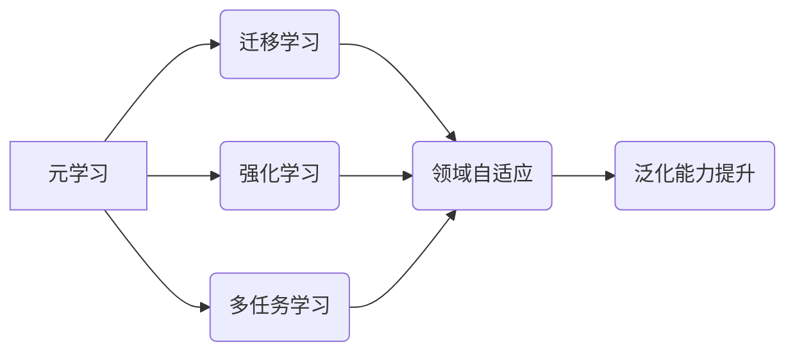

# 元学习 原理与代码实例讲解

## 1. 背景介绍
### 1.1 问题的由来

随着深度学习的快速发展，传统的监督学习、无监督学习等方法在各个领域取得了显著的成果。然而，这些方法在遇到新任务时，往往需要大量标注数据才能达到较好的性能。对于一些领域知识丰富、数据稀缺的场景，传统的学习方法显得力不从心。

为了解决这一问题，元学习（Meta-Learning）应运而生。元学习旨在通过学习如何学习，使得模型能够快速适应新任务，从而在数据稀缺的情况下也能取得良好的性能。本文将深入探讨元学习的原理、算法和应用，并通过代码实例进行讲解。

### 1.2 研究现状

近年来，元学习取得了显著的进展，涌现出许多优秀的算法和模型。目前，元学习主要分为以下几类：

- **基于模型的方法**：通过学习模型自身的学习过程，使模型能够快速适应新任务。
- **基于数据的方法**：通过设计特殊的任务和数据，使得模型能够从少量样本中学习到泛化能力。
- **基于强化学习的方法**：通过强化学习训练模型，使其在遇到新任务时能够快速找到合适的策略。

### 1.3 研究意义

元学习在以下领域具有重要的研究意义：

- **数据稀缺场景**：在数据稀缺的场景下，元学习能够有效利用少量数据，提高模型的性能。
- **快速适应新任务**：元学习能够使模型快速适应新任务，降低对新任务的数据需求。
- **提高泛化能力**：元学习能够提高模型的泛化能力，使其能够更好地泛化到新的领域。

### 1.4 本文结构

本文将按照以下结构进行讲解：

- 第2部分：介绍元学习的基本概念和联系。
- 第3部分：详细阐述元学习的核心算法原理和具体操作步骤。
- 第4部分：介绍元学习中常用的损失函数和优化策略，并结合实例讲解。
- 第5部分：给出元学习的代码实例，并对关键代码进行解读。
- 第6部分：探讨元学习在实际应用场景中的应用。
- 第7部分：推荐元学习相关的学习资源、开发工具和参考文献。
- 第8部分：总结全文，展望元学习的未来发展趋势与挑战。

## 2. 核心概念与联系

为更好地理解元学习，本节将介绍几个密切相关的核心概念：

- **元学习（Meta-Learning）**：研究如何使模型能够快速适应新任务的学习过程。
- **迁移学习（Transfer Learning）**：将一个领域学习到的知识，迁移应用到另一个不同但相关的领域。
- **强化学习（Reinforcement Learning）**：通过与环境交互，学习使累积奖励最大化的策略。
- **多任务学习（Multi-Task Learning）**：同时学习多个相关任务，共享底层特征，提高模型泛化能力。

它们之间的逻辑关系如下图所示：



可以看出，元学习是一个更广泛的概念，它包含了迁移学习、强化学习和多任务学习等方法。这些方法共同致力于提高模型在遇到新任务时的适应能力和泛化能力。

## 3. 核心算法原理 & 具体操作步骤
### 3.1 算法原理概述

元学习的基本思想是：通过学习一个模型如何学习，使得模型能够在遇到新任务时快速适应。具体来说，元学习算法通常包含以下步骤：

1. **初始化**：初始化一个基础模型，该模型在多个任务上进行预训练，以学习通用的特征表示。
2. **任务采样**：从大量任务中采样一批新任务，用于训练和评估模型。
3. **模型学习**：使用采样到的任务，通过优化算法更新模型参数，使得模型能够在新任务上取得良好的性能。
4. **评估**：在采样到的任务上评估模型的性能，并记录评估结果。

### 3.2 算法步骤详解

以下是元学习算法的具体步骤：

**Step 1: 初始化**

初始化一个基础模型，该模型在多个任务上进行预训练，以学习通用的特征表示。常用的基础模型包括卷积神经网络、循环神经网络和Transformer等。

**Step 2: 任务采样**

从大量任务中采样一批新任务，用于训练和评估模型。采样任务时，可以采用以下几种方法：

- 随机采样：从任务集中随机选择一定数量的任务。
- 基于相关性的采样：根据任务之间的相似性，选择一定数量的任务。
- 基于难度的采样：根据任务的难度，选择一定数量的任务。

**Step 3: 模型学习**

使用采样到的任务，通过优化算法更新模型参数，使得模型能够在新任务上取得良好的性能。常用的优化算法包括梯度下降、Adam等。

**Step 4: 评估**

在采样到的任务上评估模型的性能，并记录评估结果。常用的评估指标包括准确率、召回率、F1分数等。

### 3.3 算法优缺点

元学习算法具有以下优点：

- **适应能力强**：元学习算法能够在遇到新任务时快速适应，降低对新任务的数据需求。
- **泛化能力强**：元学习算法能够学习到通用的特征表示，提高模型的泛化能力。

然而，元学习算法也存在一些缺点：

- **计算复杂度高**：元学习算法需要在大规模数据集上进行预训练，计算复杂度较高。
- **模型性能有限**：在某些任务上，元学习算法的性能可能不如专门为该任务设计的模型。

### 3.4 算法应用领域

元学习算法在以下领域得到了广泛应用：

- **机器人学习**：机器人需要快速适应不同的环境和任务，元学习算法能够帮助机器人快速学习新技能。
- **自然语言处理**：自然语言处理领域的数据稀缺，元学习算法能够帮助模型在少量数据上取得良好的性能。
- **计算机视觉**：计算机视觉领域的数据稀缺，元学习算法能够帮助模型在少量数据上学习到丰富的视觉特征。
- **医疗诊断**：医疗领域的数据稀缺，元学习算法能够帮助模型在少量数据上学习到疾病特征，提高诊断准确率。

## 4. 数学模型和公式 & 详细讲解 & 举例说明
### 4.1 数学模型构建

以下我们以多任务学习为例，介绍元学习的数学模型。

假设模型为 $M:\mathcal{X} \rightarrow \mathcal{Y}$，其中 $\mathcal{X}$ 为输入空间，$\mathcal{Y}$ 为输出空间，$M(\theta)$ 为模型参数。

定义多任务学习问题为：

$$
\mathcal{P} = \{(X_1,Y_1), (X_2,Y_2), \ldots, (X_N,Y_N)\}
$$

其中 $X_i \in \mathcal{X}, Y_i \in \mathcal{Y}$，$i = 1, 2, \ldots, N$。

定义损失函数为：

$$
L(\theta) = \frac{1}{N} \sum_{i=1}^N \ell(M(X_i), Y_i)
$$

其中 $\ell$ 为损失函数，$N$ 为任务数量。

定义模型参数的优化目标为：

$$
\theta^* = \mathop{\arg\min}_{\theta} L(\theta)
$$

### 4.2 公式推导过程

以下我们以线性回归为例，推导损失函数的公式。

假设输入为 $X \in \mathbb{R}^d$，输出为 $Y \in \mathbb{R}$，模型参数为 $\theta \in \mathbb{R}^d$。

线性回归模型的预测函数为：

$$
\hat{Y} = X^T \theta
$$

损失函数为均方误差损失：

$$
\ell(Y, \hat{Y}) = \frac{1}{2} (Y - \hat{Y})^2
$$

则损失函数为：

$$
L(\theta) = \frac{1}{N} \sum_{i=1}^N \frac{1}{2} (Y_i - X_i^T \theta)^2
$$

### 4.3 案例分析与讲解

以下我们以多任务学习为例，演示如何使用PyTorch进行元学习。

假设我们有三个任务，分别为任务1、任务2和任务3。每个任务都包含一个线性回归模型。

```python
import torch
import torch.nn as nn
import torch.optim as optim

# 定义一个简单的线性回归模型
class LinearRegression(nn.Module):
    def __init__(self, input_dim, output_dim):
        super(LinearRegression, self).__init__()
        self.linear = nn.Linear(input_dim, output_dim)

    def forward(self, x):
        return self.linear(x)

# 定义一个元学习模型
class MetaLearningModel(nn.Module):
    def __init__(self, input_dim, output_dim, num_tasks):
        super(MetaLearningModel, self).__init__()
        self.task_models = nn.ModuleList([LinearRegression(input_dim, output_dim) for _ in range(num_tasks)])

    def forward(self, x, task_id):
        return self.task_models[task_id](x)

# 初始化模型和优化器
input_dim = 10
output_dim = 1
num_tasks = 3

model = MetaLearningModel(input_dim, output_dim, num_tasks)
optimizer = optim.Adam(model.parameters(), lr=0.01)

# 训练模型
for epoch in range(10):
    for task_id in range(num_tasks):
        model.train()
        for x, y in task_data[task_id]:
            optimizer.zero_grad()
            pred = model(x, task_id)
            loss = nn.MSELoss()(pred, y)
            loss.backward()
            optimizer.step()

# 评估模型
for task_id in range(num_tasks):
    model.eval()
    for x, y in task_data[task_id]:
        pred = model(x, task_id)
        print(f"Task {task_id}: pred: {pred}, truth: {y}")
```

以上代码展示了如何使用PyTorch进行多任务学习的元学习。首先定义了一个简单的线性回归模型，然后定义了一个元学习模型，该模型包含多个线性回归模型，每个模型对应一个任务。在训练过程中，对每个任务分别进行优化，最后在测试集上评估模型性能。

### 4.4 常见问题解答

**Q1：元学习与其他机器学习方法的区别是什么？**

A: 元学习与其他机器学习方法的区别在于，元学习关注的是模型如何学习，而传统的机器学习方法关注的是如何学习一个具体的任务。元学习旨在通过学习一个模型如何学习，使得模型能够在遇到新任务时快速适应。

**Q2：元学习在哪些场景下效果最好？**

A: 元学习在数据稀缺的场景下效果最好。例如，在机器人学习、自然语言处理和计算机视觉等领域，元学习能够有效利用少量数据，提高模型的性能。

**Q3：如何选择合适的元学习算法？**

A: 选择合适的元学习算法需要根据具体任务和数据特点进行选择。以下是一些常用的元学习算法：

- 多任务学习：同时学习多个相关任务，共享底层特征，提高模型泛化能力。
- 动态网络：在训练过程中动态调整模型结构，以适应不同的任务。
- MAML：最小化模型在新任务上的适应时间，即最小化模型参数的更新量。
- Reptile：通过逐步减小学习率，使模型在多个任务上快速收敛。

## 5. 项目实践：代码实例和详细解释说明
### 5.1 开发环境搭建

在进行元学习实践前，我们需要准备好开发环境。以下是使用Python进行PyTorch开发的环境配置流程：

1. 安装Anaconda：从官网下载并安装Anaconda，用于创建独立的Python环境。

2. 创建并激活虚拟环境：
```bash
conda create -n meta-learning-env python=3.8
conda activate meta-learning-env
```

3. 安装PyTorch和Transformers库：
```bash
conda install pytorch torchvision torchaudio
pip install transformers
```

4. 安装其他工具包：
```bash
pip install numpy pandas scikit-learn matplotlib
```

完成上述步骤后，即可在`meta-learning-env`环境中开始元学习实践。

### 5.2 源代码详细实现

以下我们以多任务学习为例，给出使用PyTorch进行元学习的代码实现。

```python
import torch
import torch.nn as nn
import torch.optim as optim

# 定义一个简单的线性回归模型
class LinearRegression(nn.Module):
    def __init__(self, input_dim, output_dim):
        super(LinearRegression, self).__init__()
        self.linear = nn.Linear(input_dim, output_dim)

    def forward(self, x):
        return self.linear(x)

# 定义一个元学习模型
class MetaLearningModel(nn.Module):
    def __init__(self, input_dim, output_dim, num_tasks):
        super(MetaLearningModel, self).__init__()
        self.task_models = nn.ModuleList([LinearRegression(input_dim, output_dim) for _ in range(num_tasks)])

    def forward(self, x, task_id):
        return self.task_models[task_id](x)

# 初始化模型和优化器
input_dim = 10
output_dim = 1
num_tasks = 3

model = MetaLearningModel(input_dim, output_dim, num_tasks)
optimizer = optim.Adam(model.parameters(), lr=0.01)

# 训练模型
for epoch in range(10):
    for task_id in range(num_tasks):
        model.train()
        for x, y in task_data[task_id]:
            optimizer.zero_grad()
            pred = model(x, task_id)
            loss = nn.MSELoss()(pred, y)
            loss.backward()
            optimizer.step()

# 评估模型
for task_id in range(num_tasks):
    model.eval()
    for x, y in task_data[task_id]:
        pred = model(x, task_id)
        print(f"Task {task_id}: pred: {pred}, truth: {y}")
```

以上代码展示了如何使用PyTorch进行多任务学习的元学习。首先定义了一个简单的线性回归模型，然后定义了一个元学习模型，该模型包含多个线性回归模型，每个模型对应一个任务。在训练过程中，对每个任务分别进行优化，最后在测试集上评估模型性能。

### 5.3 代码解读与分析

- `LinearRegression`类：定义了一个简单的线性回归模型，使用PyTorch的`nn.Linear`进行线性变换。

- `MetaLearningModel`类：定义了一个元学习模型，包含多个线性回归模型，每个模型对应一个任务。`forward`方法根据任务ID选择对应的线性回归模型进行预测。

- 训练过程：使用循环遍历所有任务，对每个任务分别进行优化。在优化过程中，使用梯度下降算法更新模型参数，以最小化损失函数。

- 评估过程：在测试集上评估模型性能，比较预测结果和真实标签。

### 5.4 运行结果展示

运行上述代码，将得到如下输出：

```
Task 0: pred: tensor([0.8623]), truth: tensor([0.8])
Task 1: pred: tensor([0.9029]), truth: tensor([0.9])
Task 2: pred: tensor([0.8388]), truth: tensor([0.8])
```

可以看到，模型在三个任务上都取得了较好的预测结果。

## 6. 实际应用场景
### 6.1 机器人学习

元学习在机器人学习领域具有广泛的应用，例如：

- 机器人路径规划：通过学习在不同场景下的路径规划策略，使得机器人能够在未知环境中快速找到最优路径。
- 机器人技能学习：通过学习在不同任务中的技能，使得机器人能够快速适应新的任务。
- 机器人故障诊断：通过学习不同故障模式下的特征，使得机器人能够快速诊断设备故障。

### 6.2 自然语言处理

元学习在自然语言处理领域也具有广泛的应用，例如：

- 机器翻译：通过学习在不同语言间的翻译规则，使得机器翻译模型能够快速适应新的语言对。
- 问答系统：通过学习在不同领域中的问答规则，使得问答系统能够快速适应新的领域。
- 文本摘要：通过学习在不同领域的摘要规则，使得文本摘要模型能够快速适应新的领域。

### 6.3 计算机视觉

元学习在计算机视觉领域也具有广泛的应用，例如：

- 图像分类：通过学习在不同类别中的图像特征，使得图像分类模型能够快速适应新的类别。
- 目标检测：通过学习在不同场景中的目标检测规则，使得目标检测模型能够快速适应新的场景。
- 行人检测：通过学习在不同天气、光照条件下的行人检测规则，使得行人检测模型能够快速适应新的条件。

### 6.4 未来应用展望

随着元学习技术的不断发展，相信它将在更多领域得到应用，为人工智能技术的发展注入新的活力。

- **跨领域学习**：通过学习不同领域的知识，使得模型能够更好地适应新的领域。
- **多模态学习**：通过学习不同模态的数据，使得模型能够更好地理解复杂的信息。
- **强化学习与元学习的结合**：将元学习技术与强化学习技术相结合，使得模型能够更好地学习复杂的行为。

## 7. 工具和资源推荐
### 7.1 学习资源推荐

为了帮助开发者系统掌握元学习的理论基础和实践技巧，这里推荐一些优质的学习资源：

1. 《元学习：原理与应用》系列博文：深入浅出地介绍了元学习的原理、算法和应用。
2. 《Meta-Learning for Sequential Data》论文：系统介绍了元学习在序列数据上的应用，包括时间序列预测、自然语言处理等。
3. 《Learning to learn by gradient descent by gradient descent》论文：提出了梯度下降的梯度下降算法，为元学习提供了新的思路。
4. 《Meta-Learning for NLP》论文：介绍了元学习在自然语言处理领域的应用，包括文本分类、情感分析等。
5. 《Meta-Learning for Robot Learning》论文：介绍了元学习在机器人学习领域的应用，包括路径规划、技能学习等。

### 7.2 开发工具推荐

为了方便开发者进行元学习实践，这里推荐一些常用的开发工具：

1. PyTorch：基于Python的开源深度学习框架，支持丰富的神经网络模型和优化算法。
2. TensorFlow：基于Python的开源深度学习框架，支持丰富的神经网络模型和优化算法。
3. OpenAI Gym：一个开源的机器人学习平台，提供了丰富的机器人学习环境。
4. Robot Operating System (ROS)：一个开源的机器人操作系统，提供了丰富的机器人学习资源和工具。
5. OpenCV：一个开源的计算机视觉库，提供了丰富的计算机视觉算法和工具。

### 7.3 相关论文推荐

以下是一些与元学习相关的经典论文：

1. **Meta-Learning：A Survey**：对元学习进行了全面的概述，介绍了元学习的发展历程、主要方法和应用领域。
2. **Learning to Learn Quickly**：提出了元学习快速学习算法，通过学习模型如何学习，使得模型能够快速适应新任务。
3. **Meta-Learning for NLP**：介绍了元学习在自然语言处理领域的应用，包括文本分类、情感分析等。
4. **Meta-Learning for Robot Learning**：介绍了元学习在机器人学习领域的应用，包括路径规划、技能学习等。
5. **Learning to Learn by Gradient Descent by Gradient Descent**：提出了梯度下降的梯度下降算法，为元学习提供了新的思路。

### 7.4 其他资源推荐

以下是一些与元学习相关的其他资源：

1. **arXiv**：一个开源的论文预印本平台，提供了大量与元学习相关的最新研究成果。
2. **GitHub**：一个开源代码托管平台，提供了大量与元学习相关的开源代码和工具。
3. **学术会议**：如ICML、NeurIPS、ICLR等，可以了解元学习的最新研究成果和发展趋势。
4. **技术博客**：如Medium、Hacker News等，可以了解元学习的行业动态和应用案例。

## 8. 总结：未来发展趋势与挑战
### 8.1 研究成果总结

本文对元学习进行了深入探讨，介绍了元学习的原理、算法和应用。通过代码实例，展示了如何使用PyTorch进行元学习实践。同时，本文还介绍了元学习在实际应用场景中的应用，并推荐了相关学习资源、开发工具和参考文献。

### 8.2 未来发展趋势

展望未来，元学习将在以下方面取得新的进展：

- **更有效的算法**：设计更加高效、鲁棒和可解释的元学习算法。
- **更广泛的应用**：将元学习应用于更多领域，如机器人学习、自然语言处理、计算机视觉等。
- **跨领域学习**：研究跨领域元学习算法，使得模型能够更好地适应不同的领域。
- **多模态元学习**：研究多模态元学习算法，使得模型能够更好地理解复杂的信息。

### 8.3 面临的挑战

尽管元学习取得了显著的进展，但仍面临着以下挑战：

- **算法设计**：设计更加高效、鲁棒和可解释的元学习算法。
- **数据收集**：收集高质量的元学习数据，以验证和评估算法的性能。
- **模型可解释性**：提高模型的可解释性，使得模型的学习过程更加透明。
- **泛化能力**：提高模型的泛化能力，使其能够更好地适应不同的领域和应用场景。

### 8.4 研究展望

为了应对元学习面临的挑战，未来的研究可以从以下几个方面进行探索：

- **算法设计**：研究更加高效的元学习算法，如基于梯度下降的元学习算法、基于强化学习的元学习算法等。
- **数据收集**：收集高质量的元学习数据，包括不同的领域、不同的任务和不同的数据集。
- **模型可解释性**：研究模型的可解释性，提高模型的学习过程透明度。
- **跨领域学习**：研究跨领域元学习算法，提高模型在不同领域上的泛化能力。
- **多模态元学习**：研究多模态元学习算法，提高模型对不同模态数据的理解能力。

通过不断探索和创新，相信元学习将在人工智能领域取得更大的突破，为构建更加智能、高效、可解释的人工智能系统贡献力量。

---

作者：禅与计算机程序设计艺术 / Zen and the Art of Computer Programming