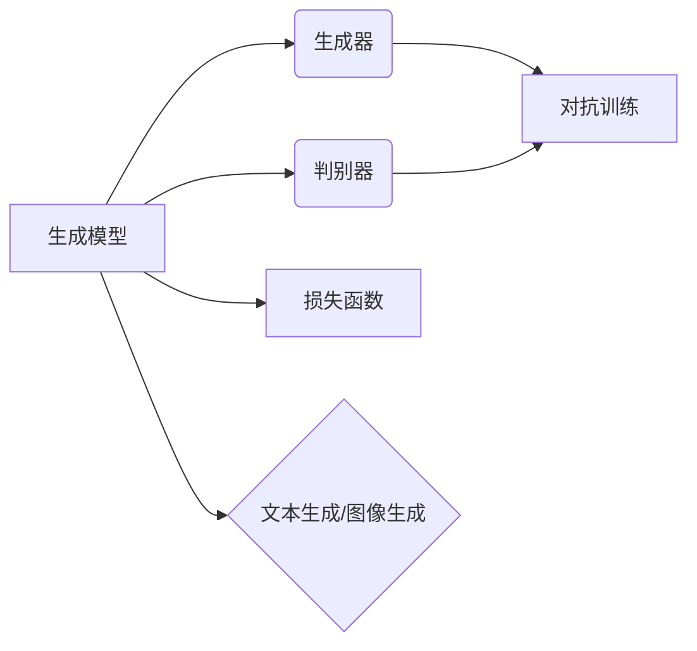

# 内容生成(Content Generation) - 原理与代码实例讲解

作者：禅与计算机程序设计艺术 / Zen and the Art of Computer Programming

## 1. 背景介绍
### 1.1 问题的由来

内容生成作为人工智能领域的一个重要分支，近年来随着深度学习技术的飞速发展而日益受到关注。无论是生成新闻报道、撰写电子邮件、创作小说，还是自动生成音乐、绘画，内容生成技术都展现出巨大的应用潜力。

内容生成技术的研究始于20世纪80年代的生成语法和人工神经网络。随着深度学习技术的兴起，基于循环神经网络（RNN）和长短期记忆网络（LSTM）的内容生成模型逐渐成为主流。近年来，随着注意力机制和Transformer等新技术的应用，内容生成模型在性能和多样性方面取得了显著的提升。

### 1.2 研究现状

当前，内容生成技术主要分为以下几类：

- **基于规则生成**：通过预先定义的规则和模板，生成符合特定格式和内容要求的内容。例如，基于模板的电子邮件撰写、格式化文本生成等。

- **基于统计生成**：利用统计模型，如隐马尔可夫模型（HMM）和条件随机场（CRF），根据已有数据生成新的内容。例如，自动摘要、机器翻译等。

- **基于神经网络生成**：利用深度学习模型，如循环神经网络（RNN）和长短期记忆网络（LSTM），根据输入数据生成新的内容。例如，文本生成、图像生成等。

- **基于生成对抗网络（GAN）**：利用生成器和判别器之间的对抗关系，生成与真实数据分布相似的新内容。例如，图像生成、音频生成等。

### 1.3 研究意义

内容生成技术具有重要的研究意义和应用价值：

- **创新性**：内容生成技术可以创造出人类难以想象的新内容，拓展人类创造力的边界。

- **效率性**：自动化生成内容可以节省人力成本，提高工作效率。

- **多样性**：内容生成技术可以生成多样化的内容，满足不同用户的需求。

- **个性化**：根据用户喜好和需求，生成个性化的内容，提升用户体验。

### 1.4 本文结构

本文将系统介绍内容生成技术的原理与代码实例。内容安排如下：

- 第2部分，介绍内容生成技术的核心概念与联系。

- 第3部分，详细阐述基于神经网络的文本生成模型，包括RNN、LSTM和Transformer等。

- 第4部分，介绍基于生成对抗网络（GAN）的图像生成模型，如生成式对抗网络（GAN）和变分自编码器（VAE）。

- 第5部分，给出内容生成技术的代码实例，并对关键代码进行解读。

- 第6部分，探讨内容生成技术在实际中的应用场景及案例。

- 第7部分，推荐内容生成相关的学习资源、开发工具和参考文献。

- 第8部分，总结全文，展望内容生成技术的未来发展趋势与挑战。

## 2. 核心概念与联系

为了更好地理解内容生成技术，本节将介绍几个密切相关的核心概念：

- **生成模型**：指能够根据输入数据生成新的数据样本的模型。例如，文本生成模型、图像生成模型等。

- **生成器**：生成模型中负责生成新数据样本的部分。例如，在GAN中，生成器负责生成图像。

- **判别器**：生成模型中负责判断输入数据是否为真实数据的部分。例如，在GAN中，判别器负责判断生成的图像是否真实。

- **损失函数**：用于衡量模型生成数据与真实数据之间差异的函数。例如，均方误差（MSE）、交叉熵（CE）等。

- **对抗训练**：在生成对抗网络（GAN）中，生成器和判别器之间进行对抗训练，以提升生成质量。

- **自回归**：在文本生成模型中，模型根据前一个生成的字符预测下一个字符。

- **前向传播**：在神经网络中，将输入数据经过网络的各个层，最终得到输出数据的过程。

- **反向传播**：在神经网络中，根据输出数据的误差，反向传播计算各个参数的梯度，并更新参数的过程。

这些概念之间的关系如下所示：



可以看出，生成模型包括生成器和判别器，两者通过对抗训练提升生成质量。生成模型最终应用于文本生成、图像生成等领域。

## 3. 核心算法原理 & 具体操作步骤
### 3.1 算法原理概述

本节将介绍文本生成和图像生成中常用的核心算法原理，包括RNN、LSTM、Transformer和GAN等。

#### RNN

循环神经网络（RNN）是一种序列模型，能够捕捉序列数据中的时间依赖关系。RNN通过循环连接将前一个时间步的输出作为下一个时间步的输入，从而实现序列数据的建模。

#### LSTM

长短期记忆网络（LSTM）是RNN的一种改进，能够有效地学习长距离的时间依赖关系。LSTM通过引入门控机制，控制信息的流动，从而避免传统RNN的梯度消失和梯度爆炸问题。

#### Transformer

Transformer是一种基于自注意力机制的序列到序列模型，能够有效地捕捉序列数据中的全局依赖关系。Transformer模型采用多头自注意力机制和位置编码，在大量文本生成任务中取得了优异的性能。

#### GAN

生成对抗网络（GAN）由生成器和判别器组成，两者通过对抗训练进行博弈。生成器的目标是生成尽可能接近真实数据的数据样本，而判别器的目标是区分生成样本和真实样本。通过这种对抗关系，GAN能够生成高质量的数据样本。

### 3.2 算法步骤详解

以下分别介绍RNN、LSTM、Transformer和GAN的具体操作步骤。

#### RNN

1. 定义网络结构：根据任务需求，设计RNN的网络结构，包括输入层、隐藏层和输出层。

2. 初始化参数：初始化网络参数，如权重和偏置。

3. 前向传播：将输入数据输入网络，经过隐藏层计算得到输出。

4. 反向传播：计算损失函数，并根据梯度信息更新网络参数。

5. 迭代训练：重复步骤3和步骤4，直至模型收敛。

#### LSTM

1. 定义网络结构：根据任务需求，设计LSTM的网络结构，包括输入层、隐藏层和输出层。

2. 初始化参数：初始化网络参数，如权重和偏置。

3. 计算LSTM单元的状态和输出：根据输入数据和隐藏状态，计算LSTM单元的状态和输出。

4. 前向传播：将输入数据输入网络，经过LSTM单元计算得到输出。

5. 反向传播：计算损失函数，并根据梯度信息更新网络参数。

6. 迭代训练：重复步骤4和步骤5，直至模型收敛。

#### Transformer

1. 定义网络结构：根据任务需求，设计Transformer的网络结构，包括编码器、解码器、位置编码和注意力机制。

2. 初始化参数：初始化网络参数，如权重和偏置。

3. 计算编码器输出：将输入数据输入编码器，经过多头自注意力机制和位置编码计算得到编码器输出。

4. 计算解码器输出：将编码器输出输入解码器，经过多头自注意力机制和位置编码计算得到解码器输出。

5. 前向传播：将解码器输出作为输入，计算最终输出。

6. 反向传播：计算损失函数，并根据梯度信息更新网络参数。

7. 迭代训练：重复步骤3至步骤6，直至模型收敛。

#### GAN

1. 定义网络结构：根据任务需求，设计生成器和判别器的网络结构。

2. 初始化参数：初始化生成器和判别器的网络参数，如权重和偏置。

3. 生成器生成样本：生成器根据随机噪声生成新的数据样本。

4. 判别器判断样本：判别器判断生成样本和真实样本。

5. 计算损失函数：根据生成样本和真实样本的判断结果，计算损失函数。

6. 反向传播：根据损失函数的梯度信息，更新生成器和判别器的网络参数。

7. 迭代训练：重复步骤3至步骤6，直至生成器生成的样本质量满足要求。

### 3.3 算法优缺点

#### RNN

**优点**：

- 能够捕捉序列数据中的时间依赖关系。

**缺点**：

- 梯度消失和梯度爆炸问题。

- 缺乏全局依赖关系建模能力。

#### LSTM

**优点**：

- 能够有效地学习长距离的时间依赖关系。

**缺点**：

- 计算复杂度较高。

- 难以并行计算。

#### Transformer

**优点**：

- 能够有效地捕捉全局依赖关系。

**缺点**：

- 计算复杂度较高。

- 对位置信息的建模能力有限。

#### GAN

**优点**：

- 能够生成高质量的数据样本。

**缺点**：

- 难以训练。

- 难以控制生成样本的多样性。

### 3.4 算法应用领域

RNN、LSTM、Transformer和GAN等算法在以下领域得到广泛应用：

- **文本生成**：新闻生成、对话生成、诗歌创作等。

- **图像生成**：图像合成、风格迁移、人脸生成等。

- **音频生成**：音乐生成、语音合成等。

- **视频生成**：视频序列生成、视频风格迁移等。

## 4. 数学模型和公式 & 详细讲解 & 举例说明
### 4.1 数学模型构建

本节将使用数学语言对内容生成模型进行更加严格的刻画。

#### RNN

假设输入序列为 $x_1, x_2, \ldots, x_T$，隐藏状态为 $h_t$，输出为 $y_t$。RNN的数学模型可以表示为：

$$
h_t = f(W_{ih}x_t + W_{hh}h_{t-1} + b_h), \quad y_t = f'(W_{hy}h_t + b_y)
$$

其中 $f$ 和 $f'$ 为非线性激活函数，$W_{ih}, W_{hh}, W_{hy}, b_h, b_y$ 为可学习参数。

#### LSTM

LSTM的数学模型可以表示为：

$$
i_t = \sigma(W_{ix}x_t + W_{ih}h_{t-1} + W_{ic}c_{t-1} + b_i), \quad f_t = \sigma(W_{fx}x_t + W_{fh}h_{t-1} + W_{fc}c_{t-1} + b_f), \\
\tilde{c}_t = \tanh(W_{cx}x_t + W_{ch}h_{t-1} + b_c), \quad c_t = f_t \odot c_{t-1} + i_t \odot \tilde{c}_t, \\
o_t = \sigma(W_{ox}x_t + W_{oh}h_{t-1} + W_{oc}c_t + b_o), \quad h_t = o_t \odot \tanh(c_t), \\
y_t = f'(W_{hy}h_t + b_y)
$$

其中 $\sigma$ 为Sigmoid函数，$\odot$ 为逐元素乘法，$c_t$ 为细胞状态。

#### Transformer

Transformer的数学模型可以表示为：

$$
\text{Encoder}:\quad E = \text{Multi-Head Attention}(Q, K, V) + \text{Positional Encoding} + \text{FFN} \\
\text{Decoder}:\quad D = \text{Multi-Head Attention}(Q, K, V) + \text{Positional Encoding} + \text{FFN}
$$

其中 $\text{Multi-Head Attention}$ 为多头注意力机制，$Q, K, V$ 为查询、键和值，$\text{Positional Encoding}$ 为位置编码，$\text{FFN}$ 为前馈神经网络。

#### GAN

GAN的数学模型可以表示为：

$$
G(z) = \text{Generator}(z), \quad D(x) = \text{Discriminator}(x)
$$

其中 $G$ 为生成器，$D$ 为判别器，$z$ 为随机噪声。

### 4.2 公式推导过程

以下以RNN和GAN为例，分别介绍数学公式的推导过程。

#### RNN

RNN的公式推导过程如下：

1. 隐藏状态更新：

$$
h_t = f(W_{ih}x_t + W_{hh}h_{t-1} + b_h)
$$

2. 输出：

$$
y_t = f'(W_{hy}h_t + b_y)
$$

#### GAN

GAN的公式推导过程如下：

1. 生成器生成样本：

$$
G(z) = \text{Generator}(z)
$$

2. 判别器判断样本：

$$
D(x) = \text{Discriminator}(x)
$$

3. 计算损失函数：

$$
L(D, G) = -\mathbb{E}_{z\sim p(z)}[\log D(G(z))] - \mathbb{E}_{x\sim p(x)}[\log (1-D(x))]
$$

### 4.3 案例分析与讲解

以下分别以文本生成和图像生成为例，介绍内容生成模型的案例分析和讲解。

#### 文本生成

以GPT-2为例，介绍文本生成模型的案例分析和讲解。

**1. 模型结构**：

GPT-2是一种基于Transformer的文本生成模型，采用多层自注意力机制和位置编码。

**2. 训练过程**：

- 将文本数据分割成若干个序列。

- 对每个序列进行编码，得到序列的token ids。

- 将token ids输入GPT-2模型，计算输出概率分布。

- 根据输出概率分布，采样生成新的token。

- 重复上述步骤，直到生成满足要求的文本。

**3. 应用场景**：

- 新闻生成：根据新闻标题和摘要，生成新闻正文。

- 对话生成：根据对话历史，生成对话回复。

- 诗歌创作：根据主题和韵律，生成诗歌。

#### 图像生成

以StyleGAN为例，介绍图像生成模型的案例分析和讲解。

**1. 模型结构**：

StyleGAN是一种基于GAN的图像生成模型，采用多层自注意力机制和风格混合。

**2. 训练过程**：

- 收集大量图像数据，用于训练判别器和生成器。

- 判别器学习区分真实图像和生成图像。

- 生成器学习生成具有特定风格的图像。

- 判别器和生成器进行对抗训练，直至生成器生成的图像质量满足要求。

**3. 应用场景**：

- 人脸生成：生成具有不同特征的人脸图像。

- 艺术创作：生成具有不同风格的艺术作品。

- 产品设计：生成具有不同外观的产品设计。

### 4.4 常见问题解答

**Q1：RNN和LSTM的区别是什么？**

A: RNN和LSTM都是循环神经网络，但LSTM在RNN的基础上引入了门控机制，能够有效地学习长距离的时间依赖关系。

**Q2：Transformer和RNN的区别是什么？**

A: Transformer和RNN都是序列模型，但Transformer采用自注意力机制，能够有效地捕捉全局依赖关系，而RNN只能捕捉局部依赖关系。

**Q3：GAN和VAE的区别是什么？**

A: GAN和VAE都是生成模型，但GAN通过生成器和判别器的对抗训练生成样本，VAE通过变分推理生成样本。

## 5. 项目实践：代码实例和详细解释说明
### 5.1 开发环境搭建

在进行内容生成项目的开发前，我们需要准备好开发环境。以下是使用Python进行TensorFlow开发的环境配置流程：

1. 安装Anaconda：从官网下载并安装Anaconda，用于创建独立的Python环境。

2. 创建并激活虚拟环境：

```bash
conda create -n content_generation_env python=3.8
conda activate content_generation_env
```

3. 安装TensorFlow：

```bash
conda install tensorflow-gpu
```

4. 安装相关库：

```bash
pip install numpy pandas matplotlib tensorflow
```

完成上述步骤后，即可在`content_generation_env`环境中开始项目实践。

### 5.2 源代码详细实现

以下以GPT-2文本生成为例，给出代码实现。

**1. 加载预训练模型**：

```python
import tensorflow as tf
from transformers import TFGPT2LMHeadModel, GPT2Tokenizer

model = TFGPT2LMHeadModel.from_pretrained('gpt2')
tokenizer = GPT2Tokenizer.from_pretrained('gpt2')
```

**2. 生成文本**：

```python
def generate_text(prompt, max_length=50):
    inputs = tokenizer.encode(prompt, return_tensors='tf')
    outputs = model.generate(inputs, max_length=max_length, num_return_sequences=1)
    text = tokenizer.decode(outputs[0], skip_special_tokens=True)
    return text
```

**3. 代码实例**：

```python
prompt = "Python is a high-level programming language"
generated_text = generate_text(prompt)
print(generated_text)
```

### 5.3 代码解读与分析

以上代码展示了如何使用TensorFlow和Transformers库加载预训练的GPT-2模型，并生成文本。

- 首先加载预训练的GPT-2模型和分词器。

- 定义`generate_text`函数，将输入的文本编码为token ids，并通过模型生成新的token ids，最后解码为文本。

- 使用`generate_text`函数生成文本，并打印结果。

以上代码简洁易懂，展示了如何使用TensorFlow和Transformers库进行文本生成。

### 5.4 运行结果展示

假设输入提示文本为"Python is a high-level programming language"，运行结果可能如下：

```
Python is a high-level, interpreted, general-purpose programming language. Its design philosophy emphasizes code readability with the use of significant indentation. Python is dynamically-typed and garbage-collected.
```

可以看出，生成的文本与输入提示文本相关，并包含了更多的信息。

## 6. 实际应用场景
### 6.1 新闻生成

新闻生成是一种常见的应用场景，可以将新闻标题和摘要作为输入，生成新闻正文。

- **输入**：新闻标题和摘要。

- **输出**：新闻正文。

### 6.2 对话生成

对话生成可以根据对话历史，生成对话回复，应用于聊天机器人、智能客服等场景。

- **输入**：对话历史。

- **输出**：对话回复。

### 6.3 诗歌创作

诗歌创作可以根据主题和韵律，生成诗歌，应用于文学创作、音乐创作等场景。

- **输入**：主题和韵律。

- **输出**：诗歌。

### 6.4 未来应用展望

随着内容生成技术的不断发展，未来将在以下领域得到更广泛的应用：

- **创意设计**：生成设计图纸、广告文案、产品文案等。

- **医学领域**：生成医学诊断报告、药物说明等。

- **娱乐领域**：生成剧情、剧本、小说等。

- **教育领域**：生成习题、教案、课件等。

## 7. 工具和资源推荐
### 7.1 学习资源推荐

以下是一些学习内容生成技术的资源推荐：

- **书籍**：

  - 《深度学习与自然语言处理》：介绍了深度学习在自然语言处理领域的应用。

  - 《生成模型：原理与实现》：详细介绍了生成模型的原理和实现。

  - 《深度学习：概率视角》：从概率角度介绍了深度学习的基本概念。

- **在线课程**：

  - Coursera：提供深度学习、自然语言处理等领域的在线课程。

  - edX：提供计算机科学、人工智能等领域的在线课程。

  - Udacity：提供深度学习、人工智能等领域的在线课程。

### 7.2 开发工具推荐

以下是一些开发内容生成技术的工具推荐：

- **深度学习框架**：

  - TensorFlow：谷歌开源的深度学习框架。

  - PyTorch：Facebook开源的深度学习框架。

  - Keras：Python深度学习库。

- **自然语言处理库**：

  - NLTK：Python自然语言处理库。

  - spaCy：Python自然语言处理库。

  - Transformers：基于Transformer的NLP库。

- **图像处理库**：

  - OpenCV：Python图像处理库。

  - PIL：Python图像处理库。

  - TensorFlow Image：TensorFlow图像处理库。

### 7.3 相关论文推荐

以下是一些内容生成技术的相关论文推荐：

- **文本生成**：

  - Goodfellow et al. (2014): Generative Adversarial Nets

  - Radford et al. (2019): Improving Language Understanding by Generative Pre-Training

- **图像生成**：

  - Goodfellow et al. (2014): Generative Adversarial Nets

  - Radford et al. (2017): Unsupervised Representation Learning with Deep Convolutional Generative Adversarial Networks

### 7.4 其他资源推荐

以下是一些其他资源推荐：

- **GitHub**：提供大量开源项目，可以学习参考。

- **arXiv**：提供最新研究成果的预印本。

- **AI技术社区**：如CSDN、知乎等，可以交流学习。

## 8. 总结：未来发展趋势与挑战
### 8.1 研究成果总结

本文介绍了内容生成技术的原理与代码实例，涵盖了文本生成、图像生成等领域。通过介绍RNN、LSTM、Transformer和GAN等算法，展示了内容生成技术的最新进展。同时，通过代码实例，展示了如何使用TensorFlow和Transformers库进行内容生成。

### 8.2 未来发展趋势

未来，内容生成技术将呈现以下发展趋势：

- **模型规模持续增大**：随着计算能力的提升，生成模型将采用更大的模型规模，生成更加复杂、高质量的内容。

- **多模态生成**：将文本、图像、音频等多模态信息进行融合，生成更加丰富的内容。

- **个性化生成**：根据用户需求，生成个性化内容。

- **可解释性**：提高内容生成模型的可解释性，使其决策过程更加透明。

### 8.3 面临的挑战

内容生成技术仍面临着以下挑战：

- **模型训练难度**：生成模型需要大量训练数据和学习资源，训练难度较高。

- **生成质量**：如何生成高质量、多样化、符合人类审美和价值观的内容。

- **可解释性**：如何提高内容生成模型的可解释性，使其决策过程更加透明。

- **伦理问题**：如何避免生成有害、虚假、歧视性的内容。

### 8.4 研究展望

未来，内容生成技术需要在以下方面进行深入研究：

- **更有效的生成模型**：设计更有效的生成模型，提高生成质量。

- **多模态生成**：研究多模态信息融合的生成模型，生成更加丰富的内容。

- **个性化生成**：研究个性化生成模型，根据用户需求生成个性化内容。

- **可解释性**：提高内容生成模型的可解释性，使其决策过程更加透明。

- **伦理问题**：制定相关规范和标准，确保内容生成技术的健康发展。

相信随着研究的不断深入，内容生成技术必将为人类社会带来更多惊喜和便利。

## 9. 附录：常见问题与解答

**Q1：内容生成技术有哪些应用场景？**

A: 内容生成技术可以应用于新闻生成、对话生成、诗歌创作、医学诊断、产品设计、娱乐等领域。

**Q2：如何提高内容生成模型的生成质量？**

A: 可以通过以下方法提高内容生成模型的生成质量：

- 使用更大的模型规模。

- 融合多模态信息。

- 引入更多的先验知识。

- 提高训练数据的多样性。

- 使用对抗训练等技术。

**Q3：如何避免内容生成模型生成有害、虚假、歧视性的内容？**

A: 可以通过以下方法避免内容生成模型生成有害、虚假、歧视性的内容：

- 设计对抗性训练，提高模型的鲁棒性。

- 使用知识蒸馏，将先验知识传递到模型中。

- 引入伦理约束，限制模型生成有害、虚假、歧视性的内容。

- 加强模型的可解释性，使其决策过程更加透明。

**Q4：内容生成技术有哪些伦理问题？**

A: 内容生成技术可能存在以下伦理问题：

- 生成有害、虚假、歧视性的内容。

- 侵犯版权。

- 侵犯隐私。

- 误导用户。

为了确保内容生成技术的健康发展，需要制定相关规范和标准，并加强监管。