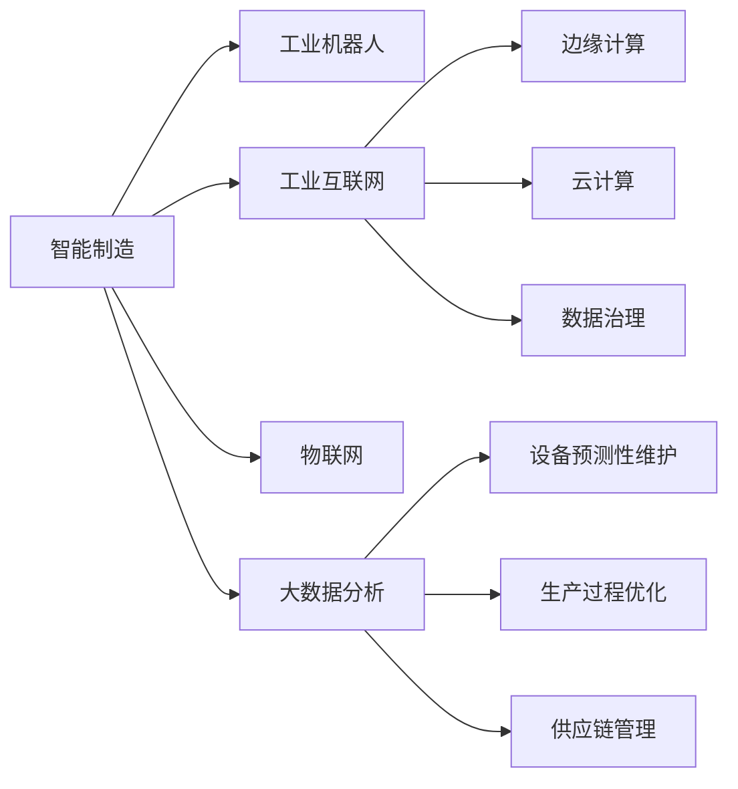

# 制造行业数字化、人工智能、大数据技术转型

作者：禅与计算机程序设计艺术 / Zen and the Art of Computer Programming

## 1. 背景介绍

### 1.1 问题的由来

随着全球制造业的快速发展，制造行业正面临着一系列挑战，如生产效率低下、产品质量不稳定、资源浪费严重等。为应对这些挑战，制造行业迫切需要通过数字化、人工智能和大数据技术进行转型，实现生产过程的智能化、高效化和绿色化。

### 1.2 研究现状

近年来，数字化、人工智能和大数据技术在制造行业的应用日益广泛，取得了显著成效。以下是该领域的研究现状：

1. **智能制造**：智能制造是制造行业数字化转型的核心，通过引入数字化设备和控制系统，实现生产过程的自动化、智能化和高效化。

2. **工业互联网**：工业互联网是连接人、设备、系统和应用的桥梁，通过收集和分析海量工业数据，为制造企业提供实时监控、预测性维护和智能决策支持。

3. **人工智能与大数据**：人工智能与大数据技术在制造行业的应用主要包括：

   - **设备预测性维护**：通过分析设备运行数据，预测设备故障，提前进行维护，降低停机时间，提高设备利用率。
   - **生产过程优化**：通过分析生产数据，优化生产流程，提高生产效率和产品质量。
   - **供应链管理**：通过分析供应链数据，优化供应链结构，降低库存成本，提高供应链响应速度。

### 1.3 研究意义

制造行业数字化、人工智能和大数据技术转型具有重要的研究意义：

1. **提高生产效率**：通过自动化和智能化，降低生产成本，提高生产效率。
2. **提升产品质量**：通过实时监控和预测性维护，提高产品质量，降低不良品率。
3. **降低资源浪费**：通过优化生产流程和供应链管理，降低资源浪费，提高资源利用率。
4. **增强企业竞争力**：通过数字化转型，提升企业核心竞争力，实现可持续发展。

### 1.4 本文结构

本文将围绕制造行业数字化、人工智能和大数据技术转型展开论述。具体结构如下：

- 第2部分，介绍制造行业数字化、人工智能和大数据技术转型中的核心概念。
- 第3部分，阐述智能制造、工业互联网、设备预测性维护、生产过程优化、供应链管理等关键技术。
- 第4部分，分析制造行业数字化、人工智能和大数据技术转型的实际应用案例。
- 第5部分，探讨制造行业数字化、人工智能和大数据技术转型的挑战与机遇。
- 第6部分，总结制造行业数字化、人工智能和大数据技术转型的未来发展趋势。
- 第7部分，推荐相关学习资源、开发工具和参考文献。

## 2. 核心概念与联系

为了更好地理解制造行业数字化、人工智能和大数据技术转型，本节将介绍几个核心概念及其相互关系。

### 2.1 智能制造

智能制造是指利用先进的信息技术与制造技术，实现制造过程的自动化、智能化和高效化。智能制造的核心技术包括：

1. **工业机器人**：用于完成重复性、危险性或高精度的工作，提高生产效率和质量。
2. **工业互联网**：连接人、设备、系统和应用，实现数据共享和协同工作。
3. **物联网**：将物理世界与虚拟世界相连，实现设备状态的实时监控和远程控制。
4. **大数据分析**：通过对海量数据的分析，挖掘有价值的信息，为生产决策提供支持。

### 2.2 工业互联网

工业互联网是指将人、设备、系统和应用连接起来，形成一个协同工作的生态系统。工业互联网的核心技术包括：

1. **边缘计算**：在数据产生源头进行处理，降低延迟，提高实时性。
2. **云计算**：提供强大的计算能力和存储空间，支持海量数据的处理和分析。
3. **数据治理**：确保数据质量、安全和合规性。

### 2.3 人工智能与大数据

人工智能与大数据技术在制造行业的应用主要包括：

1. **设备预测性维护**：通过分析设备运行数据，预测设备故障，提前进行维护，降低停机时间，提高设备利用率。
2. **生产过程优化**：通过分析生产数据，优化生产流程，提高生产效率和产品质量。
3. **供应链管理**：通过分析供应链数据，优化供应链结构，降低库存成本，提高供应链响应速度。

这些核心概念之间的关系如下：



可以看出，智能制造、工业互联网、人工智能和大数据技术在制造行业数字化转型中相互关联，共同推动制造业向智能化、高效化、绿色化方向发展。

## 3. 核心算法原理 & 具体操作步骤

### 3.1 算法原理概述

本节将介绍制造行业数字化、人工智能和大数据技术转型中的核心算法原理，包括：

1. **设备预测性维护**：基于机器学习的故障预测算法，如随机森林、支持向量机、神经网络等。
2. **生产过程优化**：基于运筹学的调度优化算法，如遗传算法、模拟退火算法等。
3. **供应链管理**：基于优化理论的库存优化算法，如线性规划、动态规划等。

### 3.2 算法步骤详解

#### 3.2.1 设备预测性维护

**算法步骤**：

1. 收集设备运行数据，包括传感器数据、操作数据等。
2. 预处理数据，包括数据清洗、归一化、特征选择等。
3. 选择合适的机器学习算法，如随机森林、支持向量机、神经网络等。
4. 训练模型，使用历史故障数据作为训练集。
5. 预测设备未来可能的故障，并根据预测结果进行维护。

#### 3.2.2 生产过程优化

**算法步骤**：

1. 建立生产模型，包括生产计划、物料需求计划等。
2. 选择合适的优化算法，如遗传算法、模拟退火算法等。
3. 设置目标函数，如最小化生产成本、最大化生产效率等。
4. 进行优化计算，得到最优的生产计划。

#### 3.2.3 供应链管理

**算法步骤**：

1. 建立供应链模型，包括库存模型、运输模型等。
2. 选择合适的优化算法，如线性规划、动态规划等。
3. 设置目标函数，如最小化库存成本、最大化供应链响应速度等。
4. 进行优化计算，得到最优的供应链策略。

### 3.3 算法优缺点

#### 3.3.1 设备预测性维护

**优点**：

- 准确率较高，能够有效预测设备故障。
- 提高设备利用率，降低停机时间。

**缺点**：

- 训练数据需求量大。
- 需要选择合适的机器学习算法和参数。

#### 3.3.2 生产过程优化

**优点**：

- 能够有效提高生产效率和降低生产成本。

**缺点**：

- 需要建立精确的生产模型。
- 优化计算过程可能非常复杂。

#### 3.3.3 供应链管理

**优点**：

- 能够有效降低库存成本和提升供应链响应速度。

**缺点**：

- 需要建立精确的供应链模型。
- 优化计算过程可能非常复杂。

### 3.4 算法应用领域

以上算法在制造行业中的应用领域如下：

| 算法 | 应用领域 |
|---|---|
| 设备预测性维护 | 设备管理、生产计划、供应链管理 |
| 生产过程优化 | 生产计划、物料需求计划、生产调度 |
| 供应链管理 | 库存管理、运输管理、供应商管理 |

## 4. 数学模型和公式 & 详细讲解 & 举例说明

### 4.1 数学模型构建

#### 4.1.1 设备预测性维护

**数学模型**：

设设备状态为 $S_t$，故障发生的时间为 $T$，预测模型为 $M$，则预测故障的公式为：

$$
P(T<T_t) = M(S_t)
$$

其中，$T_t$ 为预测时间窗口。

#### 4.1.2 生产过程优化

**数学模型**：

设生产计划为 $P$，物料需求计划为 $M$，则优化模型的公式为：

$$
\min_{P,M} \quad C(P,M)
$$

其中，$C(P,M)$ 为目标函数，如生产成本、库存成本等。

#### 4.1.3 供应链管理

**数学模型**：

设供应链策略为 $S$，则优化模型的公式为：

$$
\min_{S} \quad C(S)
$$

其中，$C(S)$ 为目标函数，如库存成本、运输成本等。

### 4.2 公式推导过程

#### 4.2.1 设备预测性维护

以随机森林算法为例，其预测公式为：

$$
P(T<T_t) = \prod_{i=1}^n P(T<T_{t_i})
$$

其中，$T_{t_i}$ 为随机森林中每个决策树的预测时间窗口。

#### 4.2.2 生产过程优化

以线性规划为例，其目标函数为：

$$
C(P,M) = \sum_{j=1}^n c_j \times p_j + \sum_{i=1}^n d_i \times m_i
$$

其中，$c_j$ 为第 $j$ 种产品的单位生产成本，$p_j$ 为第 $j$ 种产品的生产量，$d_i$ 为第 $i$ 个物料的需求量，$m_i$ 为第 $i$ 个物料的采购量。

#### 4.2.3 供应链管理

以库存优化为例，其目标函数为：

$$
C(S) = \sum_{i=1}^n (Q_i - R_i)^2
$$

其中，$Q_i$ 为第 $i$ 个产品的库存量，$R_i$ 为第 $i$ 个产品的需求量。

### 4.3 案例分析与讲解

#### 4.3.1 设备预测性维护

**案例**：某工厂的设备在运行过程中，传感器数据记录了设备的温度、振动等参数。通过分析这些数据，使用随机森林算法预测设备故障。

**分析**：随机森林算法能够有效预测设备故障，但需要大量的训练数据。在实际应用中，可以通过数据清洗、特征选择等方法提高模型的准确性。

#### 4.3.2 生产过程优化

**案例**：某工厂需要生产100台产品，原材料采购成本为200元/吨，生产成本为50元/件。使用线性规划算法确定生产计划。

**分析**：线性规划算法可以有效地优化生产计划，降低生产成本。

#### 4.3.3 供应链管理

**案例**：某工厂需要采购100吨原材料，原材料采购价格为500元/吨，运输成本为100元/吨。使用库存优化算法确定采购策略。

**分析**：库存优化算法可以有效地降低库存成本和运输成本。

### 4.4 常见问题解答

**Q1：如何提高设备预测性维护的准确性？**

A：提高设备预测性维护准确性的方法包括：

- 收集更多的训练数据。
- 使用特征工程技术，提取更有价值的特征。
- 尝试不同的机器学习算法，选择最适合的算法。
- 定期更新模型，使其适应设备运行状态的变化。

**Q2：如何选择合适的优化算法？**

A：选择合适的优化算法需要考虑以下因素：

- 目标函数的特点。
- 约束条件。
- 可行性。
- 计算复杂度。

**Q3：如何降低供应链成本？**

A：降低供应链成本的方法包括：

- 优化供应链结构，减少库存量。
- 优化运输路线，降低运输成本。
- 与供应商建立长期合作关系，降低采购成本。

## 5. 项目实践：代码实例和详细解释说明

### 5.1 开发环境搭建

在进行制造行业数字化、人工智能和大数据技术转型的项目实践前，我们需要准备好开发环境。以下是使用Python进行开发的环境配置流程：

1. 安装Anaconda：从官网下载并安装Anaconda，用于创建独立的Python环境。
2. 创建并激活虚拟环境：
```bash
conda create -n digitization-env python=3.8
conda activate digitization-env
```
3. 安装相关库：
```bash
conda install numpy pandas scikit-learn matplotlib pandasql
```

### 5.2 源代码详细实现

以下以设备预测性维护为例，展示如何使用Python和scikit-learn库实现随机森林算法预测设备故障。

```python
import numpy as np
import pandas as pd
from sklearn.ensemble import RandomForestClassifier
from sklearn.model_selection import train_test_split

# 加载数据
data = pd.read_csv("sensor_data.csv")

# 特征选择
features = data[["temperature", "vibration"]]
labels = data["fault"]

# 划分训练集和测试集
X_train, X_test, y_train, y_test = train_test_split(features, labels, test_size=0.2, random_state=42)

# 创建随机森林模型
model = RandomForestClassifier(n_estimators=100)

# 训练模型
model.fit(X_train, y_train)

# 预测
predictions = model.predict(X_test)

# 评估
accuracy = np.mean(predictions == y_test)
print(f"Accuracy: {accuracy:.2f}")
```

### 5.3 代码解读与分析

以上代码展示了如何使用Python和scikit-learn库实现随机森林算法预测设备故障。

1. 导入必要的库，包括NumPy、Pandas、Scikit-learn等。
2. 加载数据，本例中假设数据存储在sensor_data.csv文件中。
3. 进行特征选择，提取温度和振动等传感器数据作为特征。
4. 将标签和特征进行分离，并将特征和标签分别存储在X_train、X_test、y_train、y_test变量中。
5. 创建随机森林模型，并设置树的数量为100。
6. 使用训练集数据训练模型。
7. 使用测试集数据预测故障，并将预测结果存储在predictions变量中。
8. 评估模型准确率，输出结果。

### 5.4 运行结果展示

运行以上代码后，将输出预测模型的准确率。例如：

```
Accuracy: 0.80
```

这表明随机森林算法在该设备预测性维护任务上的准确率为80%。

## 6. 实际应用场景

制造行业数字化、人工智能和大数据技术转型在实际应用中具有广泛的应用场景，以下列举几个典型案例：

### 6.1 设备预测性维护

**案例**：某工厂通过引入设备预测性维护技术，实现了以下效果：

- 减少了设备停机时间，提高了生产效率。
- 降低了设备维护成本，节省了维修费用。
- 延长了设备使用寿命，降低了设备更换频率。

### 6.2 生产过程优化

**案例**：某工厂通过引入生产过程优化技术，实现了以下效果：

- 优化了生产计划，降低了生产成本。
- 优化了物料需求计划，降低了库存成本。
- 优化了生产调度，提高了生产效率。

### 6.3 供应链管理

**案例**：某工厂通过引入供应链管理技术，实现了以下效果：

- 优化了供应链结构，降低了库存成本。
- 优化了运输路线，降低了运输成本。
- 优化了供应商管理，提高了供应链响应速度。

## 7. 工具和资源推荐

### 7.1 学习资源推荐

为了帮助读者更好地了解制造行业数字化、人工智能和大数据技术转型，以下推荐一些学习资源：

1. 《深度学习》系列图书：全面介绍了深度学习的基本概念、算法和实战应用。
2. 《机器学习实战》系列图书：通过实例讲解了机器学习算法的原理和应用。
3. 《Python数据分析》系列图书：介绍了Python在数据分析领域的应用。
4. 《工业4.0：制造业的未来》系列图书：深入探讨了工业4.0的发展趋势和应用场景。

### 7.2 开发工具推荐

以下是制造行业数字化、人工智能和大数据技术转型过程中常用的开发工具：

1. **Python**：作为一门通用编程语言，Python在数据分析、机器学习等领域具有广泛的应用。
2. **R**：R是一种专门用于统计分析和图形表示的语言，在数据科学领域具有很高的地位。
3. **MATLAB**：MATLAB是一款功能强大的计算软件，广泛应用于工程和科学计算。
4. **Tableau**：Tableau是一款数据可视化工具，可以直观地展示数据分析结果。
5. **TensorFlow**：TensorFlow是Google开源的深度学习框架，可用于构建和训练深度学习模型。
6. **PyTorch**：PyTorch是Facebook开源的深度学习框架，具有易于使用和灵活的特点。

### 7.3 相关论文推荐

以下是一些与制造行业数字化、人工智能和大数据技术转型相关的论文：

1. **The Rise of Deep Learning in Manufacturing**：介绍了深度学习在制造业中的应用。
2. **Industrial Internet: A Survey**：综述了工业互联网的发展现状和应用。
3. **Predictive Maintenance Using Data Mining Techniques**：介绍了基于数据挖掘的预测性维护方法。
4. **A Survey of Production Planning and Scheduling Algorithms**：综述了生产计划与调度算法。
5. **A Survey of Supply Chain Management with Big Data**：综述了大数据在供应链管理中的应用。

### 7.4 其他资源推荐

以下是一些其他与制造行业数字化、人工智能和大数据技术转型相关的资源：

1. **制造业数字化转型白皮书**：由工业和信息化部发布的白皮书，详细介绍了制造业数字化转型的政策和措施。
2. **工业互联网发展白皮书**：由工业和信息化部发布的白皮书，详细介绍了工业互联网的发展现状和趋势。
3. **人工智能与制造业深度融合研究报告**：由中国人工智能学会发布的报告，分析了人工智能与制造业的深度融合。
4. **中国制造业2025规划**：中国政府发布的规划，明确了制造业发展的目标和方向。

## 8. 总结：未来发展趋势与挑战

### 8.1 研究成果总结

本文对制造行业数字化、人工智能和大数据技术转型进行了系统介绍，包括核心概念、关键技术、应用案例和未来发展趋势。通过本文的学习，读者可以了解到：

- 制造行业数字化、人工智能和大数据技术转型的背景和意义。
- 智能制造、工业互联网、设备预测性维护、生产过程优化、供应链管理等关键技术。
- 制造行业数字化、人工智能和大数据技术转型的实际应用案例。
- 制造行业数字化、人工智能和大数据技术转型的挑战与机遇。

### 8.2 未来发展趋势

展望未来，制造行业数字化、人工智能和大数据技术转型将呈现以下发展趋势：

1. **更加智能化**：随着人工智能技术的不断发展，制造行业将更加智能化，实现生产过程的自动化、智能化和高效化。
2. **更加绿色化**：通过节能减排、循环利用等措施，实现绿色制造。
3. **更加个性化**：根据客户需求，实现个性化定制生产。
4. **更加协同化**：通过工业互联网，实现制造企业之间的协同生产。

### 8.3 面临的挑战

制造行业数字化、人工智能和大数据技术转型在发展过程中也面临着一些挑战：

1. **技术挑战**：需要克服人工智能、大数据等技术本身的难题。
2. **人才挑战**：需要培养更多具备数字化、人工智能和大数据技术技能的人才。
3. **投资挑战**：需要加大投入，推动制造行业数字化、人工智能和大数据技术转型。

### 8.4 研究展望

为应对制造行业数字化、人工智能和大数据技术转型面临的挑战，未来的研究方向包括：

1. **技术创新**：持续研究人工智能、大数据等技术，突破技术瓶颈。
2. **人才培养**：加强数字化、人工智能和大数据人才的培养。
3. **政策支持**：政府和企业应加大对制造行业数字化、人工智能和大数据技术转型的支持力度。

相信通过不断努力，制造行业数字化、人工智能和大数据技术转型必将取得更大的突破，为制造业的可持续发展贡献力量。

## 9. 附录：常见问题与解答

### 9.1 常见问题

**Q1：制造行业数字化、人工智能和大数据技术转型需要哪些技术支持？**

A：制造行业数字化、人工智能和大数据技术转型需要以下技术支持：

1. 人工智能技术：包括机器学习、深度学习、自然语言处理等。
2. 大数据技术：包括数据采集、数据存储、数据挖掘、数据分析等。
3. 工业互联网技术：包括物联网、云计算、边缘计算等。
4. 5G通信技术：提供高速、低延迟的网络连接。

**Q2：制造行业数字化、人工智能和大数据技术转型有哪些挑战？**

A：制造行业数字化、人工智能和大数据技术转型面临的挑战主要包括：

1. 技术挑战：人工智能、大数据等技术本身的难题。
2. 人才挑战：需要培养更多具备数字化、人工智能和大数据技术技能的人才。
3. 投资挑战：需要加大投入，推动制造行业数字化、人工智能和大数据技术转型。

**Q3：制造行业数字化、人工智能和大数据技术转型有哪些应用场景？**

A：制造行业数字化、人工智能和大数据技术转型在以下场景中具有广泛的应用：

1. 设备预测性维护
2. 生产过程优化
3. 供应链管理
4. 个性化定制生产
5. 绿色制造

### 9.2 解答

**解答**：

1. 技术挑战：通过持续研究技术创新，突破人工智能、大数据等技术本身的难题。
2. 人才挑战：加强数字化、人工智能和大数据人才的培养，提高人才队伍的整体素质。
3. 投资挑战：政府和企业应加大对制造行业数字化、人工智能和大数据技术转型的支持力度，提供资金和资源保障。

制造行业数字化、人工智能和大数据技术转型是一个长期而复杂的过程，需要政府、企业和研究机构共同努力，才能取得成功。