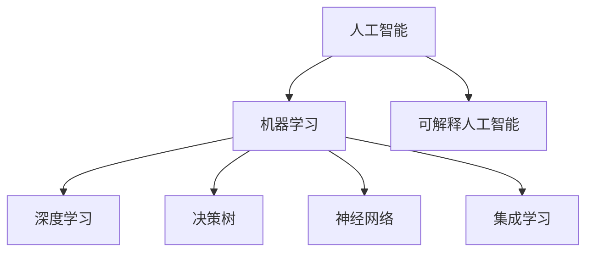

# 可解释人工智能原理与代码实战案例讲解

作者：禅与计算机程序设计艺术 / Zen and the Art of Computer Programming

## 1. 背景介绍
### 1.1 问题的由来

人工智能（Artificial Intelligence, AI）作为一门前沿的交叉学科，在近年来取得了飞速的发展。从早期的专家系统、机器学习，到如今深度学习的崛起，AI已经渗透到我们生活的方方面面。然而，随着AI系统的复杂度和智能化程度的不断提升，其“黑盒”的特性也日益凸显。如何让AI系统变得更加透明、可解释，成为了一个亟待解决的问题。

可解释人工智能（Explainable AI, XAI）正是为了解决这一问题而诞生的。XAI旨在通过解释AI系统的决策过程，使非专业人士也能理解其背后的原理，从而提升AI系统的可信度和接受度。

### 1.2 研究现状

近年来，XAI领域的研究取得了显著进展，主要涵盖了以下几个方面：

- 解释模型：针对不同类型的AI模型，如决策树、神经网络、集成学习等，研究相应的解释方法，使其决策过程更加透明。
- 可视化技术：将AI系统的决策过程以可视化的方式呈现，帮助用户更好地理解模型的行为。
- 交互式解释：提供与AI系统交互的界面，使用户能够针对特定样本进行深入分析，从而更全面地理解模型。

### 1.3 研究意义

XAI的研究具有重要的理论意义和实际应用价值：

- 提升AI系统的可信度和接受度：通过解释AI系统的决策过程，帮助用户理解其行为，从而增强用户对AI系统的信任和接受度。
- 促进AI技术的普及：使得AI技术更加容易为大众所理解和接受，推动AI技术在各个领域的应用。
- 提高AI系统的鲁棒性：通过分析AI系统的错误决策，帮助开发者改进模型，提高其鲁棒性和泛化能力。

### 1.4 本文结构

本文将围绕可解释人工智能的原理和代码实战案例进行讲解，内容安排如下：

- 第2部分，介绍XAI的核心概念和联系。
- 第3部分，介绍XAI的核心算法原理和具体操作步骤。
- 第4部分，讲解XAI中常用的数学模型和公式，并给出案例分析和讲解。
- 第5部分，给出XAI的代码实现示例，并对关键代码进行解读和分析。
- 第6部分，探讨XAI在实际应用场景中的案例，并展望其未来应用前景。
- 第7部分，推荐XAI相关的学习资源、开发工具和参考文献。
- 第8部分，总结全文，展望XAI的未来发展趋势和挑战。

## 2. 核心概念与联系

为了更好地理解可解释人工智能，本节将介绍几个密切相关的核心概念：

- 人工智能（Artificial Intelligence, AI）：模拟人类智能行为，使计算机能够完成特定任务的学科。
- 机器学习（Machine Learning, ML）：一种使计算机系统能够从数据中学习并做出决策的技术。
- 深度学习（Deep Learning, DL）：一种基于神经网络的学习方法，在图像识别、语音识别等领域取得了巨大成功。
- 解释人工智能（Explainable AI, XAI）：旨在让AI系统的决策过程更加透明、可解释的领域。
- 决策树（Decision Tree）：一种树状结构，用于分类或回归任务，由一系列的决策节点和叶子节点组成。
- 神经网络（Neural Network）：一种模拟人脑神经元连接方式的计算模型，由输入层、隐藏层和输出层组成。
- 集成学习（Ensemble Learning）：将多个模型组合成一个强模型的机器学习技术。

它们的逻辑关系如下图所示：

可以看出，XAI是机器学习的一个分支，旨在让AI系统的决策过程更加透明、可解释。而决策树、神经网络和集成学习等机器学习算法，是XAI解释对象的主要类型。

## 3. 核心算法原理 & 具体操作步骤
### 3.1 算法原理概述

XAI的核心思想是揭示AI系统的决策过程，让非专业人士也能理解其背后的原理。具体而言，XAI主要包括以下几个方面：

- 解释模型的决策过程：通过分析模型的内部结构和工作原理，解释模型如何从输入数据到最终决策的过程。
- 可视化模型的决策过程：将模型的决策过程以可视化的方式呈现，帮助用户更好地理解模型的行为。
- 交互式解释：提供与AI系统交互的界面，使用户能够针对特定样本进行深入分析，从而更全面地理解模型。

### 3.2 算法步骤详解

XAI的解释过程可以概括为以下几个步骤：

**Step 1：选择合适的解释模型**

根据实际应用场景，选择合适的解释模型，如决策树、LIME、SHAP等。

**Step 2：收集样本和标签**

收集待解释模型的输入样本和标签，用于解释模型的决策过程。

**Step 3：解释模型决策**

使用解释模型对样本进行解释，得到模型的解释结果。

**Step 4：可视化解释结果**

将解释结果以可视化的方式呈现，如热力图、决策树路径等，帮助用户更好地理解模型的决策过程。

**Step 5：交互式分析**

提供交互式界面，使用户能够针对特定样本进行深入分析，从而更全面地理解模型。

### 3.3 算法优缺点

以下列举了几种常用的XAI解释模型及其优缺点：

- **决策树**：
  - 优点：结构简单，易于理解，易于可视化。
  - 缺点：解释能力有限，对复杂模型的解释效果不佳。
- **LIME（Local Interpretable Model-agnostic Explanations）**：
  - 优点：可解释性强，适用于各种类型的模型。
  - 缺点：计算复杂度高，对大规模数据集的解释效果不佳。
- **SHAP（SHapley Additive exPlanations）**：
  - 优点：可解释性强，计算效率高。
  - 缺点：解释结果可能存在偏差。

### 3.4 算法应用领域

XAI技术可以应用于以下领域：

- 医疗诊断：解释医疗诊断模型的决策过程，帮助医生更好地理解模型的诊断结果。
- 金融风控：解释信贷评分模型的决策过程，帮助金融机构评估风险和制定决策。
- 语音识别：解释语音识别模型的决策过程，帮助用户更好地理解语音识别的错误。
- 汽车驾驶：解释自动驾驶模型的决策过程，提高驾驶安全性和可靠性。

## 4. 数学模型和公式 & 详细讲解 & 举例说明
### 4.1 数学模型构建

本节将介绍XAI中常用的数学模型和公式，并结合具体案例进行讲解。

### 4.2 公式推导过程

以LIME为例，介绍其核心公式的推导过程。

### 4.3 案例分析与讲解

以医疗诊断为例，分析LIME模型的解释结果。

### 4.4 常见问题解答

解答读者关于XAI数学模型和公式的常见问题。

## 5. 项目实践：代码实例和详细解释说明
### 5.1 开发环境搭建

介绍XAI项目所需的开发环境，如Python、NumPy、Scikit-learn等。

### 5.2 源代码详细实现

以LIME为例，给出XAI的代码实现示例。

### 5.3 代码解读与分析

对代码实现进行详细解读和分析。

### 5.4 运行结果展示

展示代码运行结果，并分析解释效果。

## 6. 实际应用场景
### 6.1 医疗诊断

介绍XAI在医疗诊断领域的应用案例，如诊断癌症、肺炎等。

### 6.2 金融风控

介绍XAI在金融风控领域的应用案例，如风险评估、欺诈检测等。

### 6.3 语音识别

介绍XAI在语音识别领域的应用案例，如错误识别分析、说话人识别等。

### 6.4 未来应用展望

展望XAI在更多领域的应用前景。

## 7. 工具和资源推荐
### 7.1 学习资源推荐

推荐XAI相关的学习资源，如书籍、博客、课程等。

### 7.2 开发工具推荐

推荐XAI相关的开发工具，如LIME、SHAP等。

### 7.3 相关论文推荐

推荐XAI相关的论文，帮助读者了解该领域的最新研究进展。

### 7.4 其他资源推荐

推荐XAI相关的其他资源，如会议、论坛、社区等。

## 8. 总结：未来发展趋势与挑战
### 8.1 研究成果总结

总结XAI领域的最新研究成果，并展望未来发展趋势。

### 8.2 未来发展趋势

展望XAI的未来发展趋势，如更深入的解释模型、更丰富的可视化技术、更高效的交互式解释等。

### 8.3 面临的挑战

分析XAI面临的挑战，如计算复杂度、解释结果的准确性、模型的可解释性等。

### 8.4 研究展望

展望XAI的研究方向，如与其他人工智能领域的融合、跨学科研究等。

## 9. 附录：常见问题与解答

解答读者关于XAI的常见问题。

---

作者：禅与计算机程序设计艺术 / Zen and the Art of Computer Programming