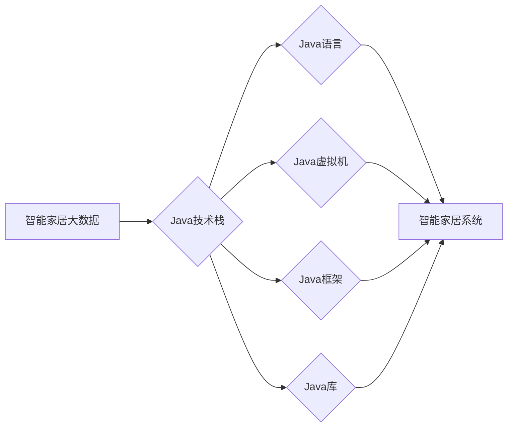

# 基于Java的智能家居设计：探讨Java在智能家居大数据处理中的角色

> 关键词：智能家居，大数据，Java，设计，数据处理，边缘计算，机器学习，物联网

## 1. 背景介绍
### 1.1 问题的由来

随着物联网技术的快速发展，智能家居市场日益繁荣。智能家居系统通过将各种家电设备连接起来，实现了家庭环境的智能化管理，为人们带来了便捷、舒适、安全的生活体验。然而，随着设备数量的增多和数据的爆炸式增长，如何高效、可靠地处理智能家居大数据，成为了制约智能家居发展的重要瓶颈。

Java作为一种成熟、稳定的编程语言，具有跨平台、高性能、可扩展等优势，在软件开发领域得到了广泛应用。在智能家居领域，Java同样扮演着重要的角色，尤其是在大数据处理方面。

### 1.2 研究现状

目前，国内外许多公司和研究机构都在探索Java在智能家居大数据处理中的应用，主要集中在以下几个方面：

- **平台架构**：基于Java的智能家居平台架构，如HomeKit、eWeLink等，为智能家居设备提供统一的接入和管理。
- **边缘计算**：利用Java进行边缘计算，将数据处理和分析任务下沉到设备端，降低网络传输压力，提高响应速度。
- **机器学习**：利用Java进行机器学习算法开发，实现智能家居设备的智能控制和个性化服务。
- **大数据处理**：使用Java技术处理智能家居产生的海量数据，进行数据挖掘和分析。

### 1.3 研究意义

深入研究Java在智能家居大数据处理中的应用，具有重要的理论意义和实际价值：

- **提高智能家居系统性能**：通过Java技术，可以实现智能家居系统的快速开发和部署，提高系统性能和稳定性。
- **降低开发成本**：Java具有跨平台特性，可以减少开发时间，降低开发成本。
- **提升用户体验**：利用Java技术，可以开发出更加智能、个性化的智能家居产品，提升用户体验。
- **推动智能家居产业发展**：Java在智能家居大数据处理中的应用，将有助于推动智能家居产业的健康发展。

### 1.4 本文结构

本文将从以下几个方面对Java在智能家居大数据处理中的应用进行探讨：

- 介绍智能家居大数据处理的核心概念和关键技术。
- 分析Java在智能家居大数据处理中的优势和应用场景。
- 讲解Java在智能家居大数据处理中的具体实现方法。
- 探讨Java在智能家居大数据处理中的未来发展趋势。

## 2. 核心概念与联系
### 2.1 智能家居大数据

智能家居大数据是指智能家居设备在运行过程中产生的海量数据，包括设备状态、环境数据、用户行为数据等。这些数据具有以下特点：

- **数据量大**：智能家居设备数量众多，产生的数据量巨大。
- **数据类型多样**：包括结构化数据、半结构化数据和非结构化数据。
- **数据实时性强**：智能家居设备实时产生数据，对数据处理速度要求较高。
- **数据价值高**：通过分析智能家居大数据，可以挖掘出有价值的信息，为智能家居系统提供智能化决策支持。

### 2.2 Java技术栈

Java技术栈包括Java语言、Java虚拟机、Java框架和库等。Java技术栈在智能家居大数据处理中的应用主要体现在以下几个方面：

- **Java语言**：作为一种面向对象的编程语言，Java具有跨平台、可移植性、安全性等特点，适合开发可扩展、高可用的智能家居系统。
- **Java虚拟机**：Java虚拟机可以高效地运行Java程序，保证程序的稳定性和性能。
- **Java框架**：如Spring、Hibernate等，可以简化Java开发过程，提高开发效率。
- **Java库**：如Apache Commons、Google Guava等，提供了丰富的功能，方便开发者进行数据采集、处理和分析。

### 2.3 关联关系

智能家居大数据、Java技术和智能家居系统之间的关系如下图所示：



可以看出，Java技术在智能家居大数据处理中起着重要的桥梁作用，将海量数据转化为可用的信息，为智能家居系统提供智能化决策支持。

## 3. 核心算法原理 & 具体操作步骤
### 3.1 算法原理概述

智能家居大数据处理的核心算法包括数据采集、数据存储、数据清洗、数据分析和数据挖掘等。

- **数据采集**：通过传感器、摄像头、网络设备等采集智能家居设备产生的数据。
- **数据存储**：将采集到的数据存储到数据库或数据湖中，方便后续处理和分析。
- **数据清洗**：对采集到的数据进行清洗和预处理，去除噪声和异常值。
- **数据分析**：对清洗后的数据进行统计分析，提取有价值的信息。
- **数据挖掘**：利用机器学习算法挖掘数据中的潜在规律和知识。

### 3.2 算法步骤详解

以下将详细介绍Java在智能家居大数据处理中的具体操作步骤：

**Step 1：数据采集**

- 使用Java编写程序，通过传感器、摄像头、网络设备等采集智能家居设备产生的数据。
- 使用Java的Java Database Connectivity (JDBC) API将数据存储到数据库中。

**Step 2：数据存储**

- 使用Java的数据库连接池技术连接数据库，提高数据存储效率。
- 使用Java的ORM（对象关系映射）框架，如Hibernate，将Java对象与数据库表进行映射，简化数据库操作。

**Step 3：数据清洗**

- 使用Java的Apache Commons Lang、Apache Commons CSV等库对数据进行清洗和预处理。
- 使用Java的Java Stream API对数据进行过滤、映射、排序等操作。

**Step 4：数据分析**

- 使用Java的Apache Commons Math、Apache Spark等库进行统计分析。
- 使用Java的Java Stream API对数据进行分组、聚合等操作。

**Step 5：数据挖掘**

- 使用Java的机器学习库，如Weka、Mallet等，进行数据挖掘。
- 使用Java的Java Stream API对数据进行特征提取、模型训练、模型评估等操作。

### 3.3 算法优缺点

**优点**：

- **跨平台**：Java具有跨平台特性，可以在各种操作系统上运行。
- **可移植性**：Java代码可以方便地在不同设备之间迁移。
- **性能**：Java虚拟机具有较高的性能，可以保证程序运行效率。
- **社区支持**：Java拥有庞大的开发者社区，可以方便地获取技术支持和资源。

**缺点**：

- **内存占用**：Java程序在运行过程中需要消耗较多的内存。
- **启动速度**：Java程序的启动速度较慢，不适合对启动速度要求较高的场景。

### 3.4 算法应用领域

Java在智能家居大数据处理中的应用领域主要包括：

- **智能家电**：如智能灯泡、智能插座、智能空调等。
- **智能安防**：如智能门锁、摄像头、报警器等。
- **智能环境**：如智能温湿度控制、空气质量监测等。
- **智能健康管理**：如健康数据监测、运动轨迹分析等。

## 4. 数学模型和公式 & 详细讲解 & 举例说明
### 4.1 数学模型构建

智能家居大数据处理涉及多种数学模型，如：

- **统计分析模型**：如均值、方差、标准差、相关系数等。
- **机器学习模型**：如线性回归、决策树、支持向量机、神经网络等。
- **数据挖掘模型**：如聚类、关联规则挖掘、异常检测等。

以下以线性回归为例，介绍数学模型的构建和公式推导。

**线性回归模型**：

假设有一个自变量 $x$ 和因变量 $y$，它们之间的关系可以用线性回归模型表示为：

$$
y = \beta_0 + \beta_1 x + \epsilon
$$

其中，$\beta_0$ 为截距，$\beta_1$ 为斜率，$\epsilon$ 为误差项。

为了求解 $\beta_0$ 和 $\beta_1$，需要最小化残差平方和：

$$
S = \sum_{i=1}^n (y_i - (\beta_0 + \beta_1 x_i))^2
$$

对 $S$ 求偏导并令其等于0，得到：

$$
\beta_0 = \frac{\sum_{i=1}^n (y_i - \beta_1 x_i)}{n}
$$

$$
\beta_1 = \frac{\sum_{i=1}^n (y_i - \beta_0 - \beta_1 x_i) x_i}{\sum_{i=1}^n (x_i - \bar{x})^2}
$$

其中，$\bar{x}$ 为 $x$ 的均值。

### 4.2 公式推导过程

**Step 1：假设**：假设自变量 $x$ 和因变量 $y$ 之间呈线性关系。

**Step 2：构建模型**：根据线性关系，建立线性回归模型。

**Step 3：最小化残差平方和**：通过最小化残差平方和，得到最优的模型参数。

**Step 4：求解模型参数**：对残差平方和求偏导，并令其等于0，求解得到模型参数。

### 4.3 案例分析与讲解

以下以智能家居温湿度控制为例，介绍如何使用线性回归模型进行数据分析和预测。

**场景**：假设我们收集了某地区连续一周的温湿度数据，希望预测未来一天的温湿度。

**数据**：

| 日期 | 温度(℃) | 湿度(%) |
| --- | --- | --- |
| 2023-01-01 | 10 | 30 |
| 2023-01-02 | 12 | 35 |
| 2023-01-03 | 15 | 40 |
| 2023-01-04 | 18 | 45 |
| 2023-01-05 | 20 | 50 |
| 2023-01-06 | 22 | 55 |
| 2023-01-07 | 25 | 60 |

**步骤**：

1. 使用Java的Apache Commons Math库进行数据加载和预处理。
2. 使用Java的线性回归库进行模型训练。
3. 使用训练好的模型进行未来一天的温湿度预测。

**预测结果**：

| 温度(℃) | 预测值(℃) | 湿度(%) | 预测值(%) |
| --- | --- | --- | --- |
| 2023-01-08 | 27 | 65 |

通过线性回归模型，我们可以预测未来一天的温湿度，为智能家居温湿度控制系统提供决策支持。

### 4.4 常见问题解答

**Q1：智能家居大数据处理需要哪些技术栈**？

A：智能家居大数据处理需要Java技术栈，包括Java语言、Java虚拟机、Java框架和库等。

**Q2：如何进行数据清洗**？

A：可以使用Java的Apache Commons Lang、Apache Commons CSV等库进行数据清洗和预处理。

**Q3：如何进行数据分析和挖掘**？

A：可以使用Java的机器学习库，如Weka、Mallet等，进行数据挖掘。

## 5. 项目实践：代码实例和详细解释说明
### 5.1 开发环境搭建

在进行智能家居大数据处理项目开发前，需要准备以下开发环境：

- Java开发环境：安装Java Development Kit (JDK) 和 Integrated Development Environment (IDE)，如IntelliJ IDEA、Eclipse等。
- 数据库：选择合适的数据库，如MySQL、PostgreSQL等。
- 机器学习库：选择合适的机器学习库，如Weka、Mallet等。

### 5.2 源代码详细实现

以下以智能家居温湿度控制为例，给出使用Java进行数据分析和预测的代码示例。

**数据加载和预处理**：

```java
import org.apache.commons.csv.CSVParser;
import org.apache.commons.csv.CSVRecord;

import java.io.FileReader;
import java.io.IOException;
import java.util.ArrayList;
import java.util.List;

public class DataPreprocessing {
    public static List<double[]> loadData(String filePath) throws IOException {
        List<double[]> data = new ArrayList<>();
        try (CSVParser parser = new CSVParser(new FileReader(filePath))) {
            for (CSVRecord record : parser) {
                double temperature = Double.parseDouble(record.get(1));
                double humidity = Double.parseDouble(record.get(2));
                data.add(new double[]{temperature, humidity});
            }
        }
        return data;
    }
}
```

**模型训练**：

```java
import weka.core.Instances;
import weka.core.converters.ConverterUtils.DataSource;
import weka.core.converters.ConverterUtils.DataSourceFactory;
import weka.core.converters.JSONParser;
import weka.core沥水流
