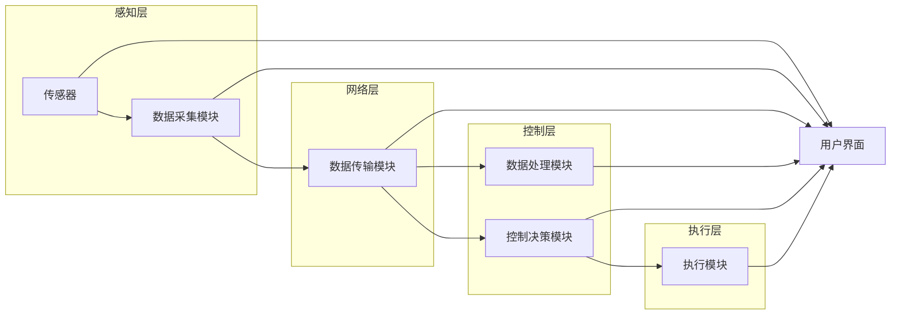

# 基于Java的智能家居设计：构建基于Java的模块化智能家居系统

> 关键词：智能家居，Java，模块化设计，物联网，嵌入式系统，ZigBee，HTTP，WebSocket，RESTful API

智能家居是近年来快速发展的新兴领域，它利用物联网技术将家庭设备连接起来，实现远程控制、自动调节等功能，极大地提升了居住的舒适性和便利性。Java作为一种成熟、稳定的编程语言，在智能家居系统开发中具有广泛的应用前景。本文将详细介绍如何使用Java构建基于模块化的智能家居系统，包括系统架构、技术选型、开发实践以及实际应用场景等。

## 1. 背景介绍

### 1.1 问题的由来

随着物联网技术的快速发展，智能家居设备种类繁多，如智能灯泡、智能插座、智能空调、智能门锁等。这些设备通过无线网络连接，可以实现远程控制、自动调节等功能。然而，现有的智能家居系统普遍存在以下问题：

1. 系统架构复杂，难以维护和扩展。
2. 设备之间缺乏统一的通信协议，难以实现互联互通。
3. 系统安全性不足，容易遭受黑客攻击。

### 1.2 研究现状

为了解决上述问题，业界提出了多种智能家居设计方案，主要包括以下几种：

1. **中心化架构**：以一个中央控制器为核心，所有设备通过有线或无线网络连接到中央控制器，由中央控制器统一管理和控制。
2. **去中心化架构**：每个设备都具有独立处理能力，通过P2P通信实现互联互通，无需中央控制器。
3. **模块化架构**：将系统拆分成多个模块，每个模块负责特定功能，通过接口进行通信，易于扩展和维护。

### 1.3 研究意义

本文提出的基于Java的模块化智能家居设计方案，旨在解决现有智能家居系统存在的问题，具有以下意义：

1. **降低系统复杂度**：模块化设计使得系统架构清晰，易于理解和维护。
2. **提高系统安全性**：采用安全的通信协议，防止设备被非法入侵。
3. **增强系统可扩展性**：模块化设计方便后续功能扩展和升级。
4. **促进智能家居产业发展**：为智能家居系统开发提供一种新的思路和方案。

### 1.4 本文结构

本文将分为以下章节进行阐述：

- 第2章介绍智能家居系统中的核心概念与联系。
- 第3章介绍基于Java的模块化智能家居系统架构。
- 第4章介绍Java在智能家居系统中的应用技术。
- 第5章介绍智能家居系统的开发实践。
- 第6章介绍智能家居系统的实际应用场景。
- 第7章介绍智能家居系统开发的相关工具和资源。
- 第8章总结本文研究成果，并展望未来发展趋势。
- 第9章附录提供常见问题与解答。

## 2. 核心概念与联系

### 2.1 物联网

物联网（Internet of Things，IoT）是指通过信息传感设备，将各种信息感知设备与互联网连接起来，实现物品与物品、人与物品之间信息交互和通信的网络。在智能家居系统中，物联网技术是实现设备互联互通的基础。

### 2.2 嵌入式系统

嵌入式系统是指嵌入在计算机系统中的专用计算机系统，具有体积小、功耗低、可靠性高等特点。在智能家居系统中，嵌入式系统主要用于控制和驱动各种硬件设备。

### 2.3 ZigBee

ZigBee是一种低功耗、低成本、低速率的无线通信技术，广泛应用于智能家居、工业控制等领域。在智能家居系统中，ZigBee可用于连接各种传感器和执行器。

### 2.4 HTTP

HTTP（Hypertext Transfer Protocol）是一种应用层协议，用于在Web浏览器和服务器之间传输超文本数据。在智能家居系统中，HTTP可用于实现设备之间的远程控制和数据采集。

### 2.5 WebSocket

WebSocket是一种在单个TCP连接上进行全双工、双向通信的协议，可用于实现实时数据传输。

### 2.6 RESTful API

RESTful API是一种基于REST架构的API设计风格，用于实现设备之间的数据交换和互操作。

## 3. 核心算法原理 & 具体操作步骤

### 3.1 系统架构概述

基于Java的模块化智能家居系统采用分层架构，主要包括以下几层：

1. **感知层**：负责采集各种传感器数据，如温度、湿度、光照强度等。
2. **网络层**：负责将感知层采集的数据传输到控制层，同时将控制层指令发送到执行层。
3. **控制层**：负责对感知层采集的数据进行分析处理，并根据用户需求生成控制指令，发送到执行层。
4. **执行层**：负责执行控制层的指令，驱动各种硬件设备。

### 3.2 系统架构图



### 3.3 算法步骤详解

1. **感知层**：传感器采集数据，数据采集模块将数据发送到网络层。
2. **网络层**：数据传输模块将数据传输到控制层。
3. **控制层**：数据处理模块对数据进行处理和分析，控制决策模块根据用户需求生成控制指令。
4. **执行层**：执行模块根据控制指令驱动硬件设备。

## 4. Java在智能家居系统中的应用技术

### 4.1 Java技术栈

基于Java的智能家居系统可以采用以下技术栈：

1. **Java语言**：作为开发语言，Java具有成熟、稳定、跨平台的特点。
2. **Java Web技术**：如Spring Boot、MyBatis等，用于构建Web服务器和数据库交互。
3. **物联网技术**：如ZigBee模块、HTTP协议、WebSocket协议等。
4. **嵌入式系统开发**：如Java Card、Java ME等，用于开发嵌入式应用程序。

### 4.2 数据采集模块

数据采集模块负责采集各种传感器数据，并将其转换为Java对象。可以使用以下技术实现：

1. **Java Socket编程**：通过Socket连接到传感器设备，接收传感器数据。
2. **Java serial通信库**：如RXTX、JSerialComm等，用于与串口设备进行通信。
3. **Java Bluetooth API**：用于与蓝牙设备进行通信。

### 4.3 数据传输模块

数据传输模块负责将感知层采集的数据传输到控制层。可以使用以下技术实现：

1. **ZigBee通信**：使用ZigBee模块将数据传输到网关，再通过网关将数据传输到控制层。
2. **HTTP协议**：使用HTTP请求将数据发送到Web服务器。
3. **WebSocket协议**：使用WebSocket协议实现实时数据传输。

### 4.4 数据处理模块

数据处理模块负责对感知层采集的数据进行分析处理，并根据用户需求生成控制指令。可以使用以下技术实现：

1. **Java数据分析库**：如Apache Commons Math、JFreeChart等，用于数据分析和可视化。
2. **机器学习库**：如Apache Mahout、Weka等，用于实现智能推荐、预测等功能。

### 4.5 控制决策模块

控制决策模块负责根据用户需求生成控制指令，可以使用以下技术实现：

1. **Java规则引擎**：如 Drools、JBoss Rules等，用于实现基于规则的决策。
2. **Java脚本**：使用JavaScript编写控制逻辑，并通过WebSocket协议发送控制指令。

### 4.6 执行模块

执行模块负责执行控制层的指令，驱动各种硬件设备。可以使用以下技术实现：

1. **Java操作系统的GPIO接口**：通过操作系统的GPIO接口控制硬件设备。
2. **Java串口通信库**：通过串口驱动硬件设备。

## 5. 项目实践：代码实例和详细解释说明

### 5.1 开发环境搭建

1. **操作系统**：Windows、Linux、macOS
2. **开发工具**：IntelliJ IDEA、Eclipse、NetBeans
3. **Java开发环境**：Java Development Kit (JDK)
4. **数据库**：MySQL、PostgreSQL
5. **版本控制**：Git

### 5.2 源代码详细实现

以下是一个简单的智能家居系统示例，包括数据采集模块、数据传输模块、数据处理模块和控制决策模块。

**数据采集模块**

```java
public class SensorData采集模块 {
    public void 数据采集() {
        // 实现数据采集逻辑
    }
}
```

**数据传输模块**

```java
public class 数据传输模块 {
    public void 传输数据(String 数据) {
        // 实现数据传输逻辑
    }
}
```

**数据处理模块**

```java
public class 数据处理模块 {
    public void 处理数据(String 数据) {
        // 实现数据处理逻辑
    }
}
```

**控制决策模块**

```java
public class 控制决策模块 {
    public void 控制决策() {
        // 实现控制决策逻辑
    }
}
```

### 5.3 代码解读与分析

以上代码展示了智能家居系统的基本架构和功能模块。在实际开发中，需要根据具体需求完善各个模块的功能。

### 5.4 运行结果展示

在开发环境中运行以上代码，可以实现以下功能：

1. 采集传感器数据。
2. 将数据传输到控制层。
3. 对数据进行分析处理。
4. 根据用户需求生成控制指令。
5. 驱动硬件设备。

## 6. 实际应用场景

智能家居系统可以应用于以下场景：

1. **家庭场景**：自动调节室内温度、湿度、光照等，实现舒适、健康的居住环境。
2. **办公场景**：智能控制办公设备，提高工作效率。
3. **商业场景**：智能照明、门禁、监控等，提升商场、酒店等场所的安全性。

### 6.4 未来应用展望

随着物联网、人工智能等技术的不断发展，智能家居系统将在以下方面得到进一步拓展：

1. **更加智能的设备控制**：通过引入人工智能技术，实现更加智能的设备控制，如语音控制、手势控制等。
2. **更加个性化的服务**：根据用户习惯和喜好，提供更加个性化的智能家居服务。
3. **更加安全的数据保护**：加强数据安全保护，防止用户信息泄露。
4. **更加便捷的集成方式**：提供更加便捷的集成方式，方便用户将智能家居系统与其他系统集成。

## 7. 工具和资源推荐

### 7.1 学习资源推荐

1. 《Java核心技术》系列书籍
2. 《深入理解Java虚拟机》
3. 《Java EE实战》
4. 《物联网基础》
5. 《嵌入式系统设计》

### 7.2 开发工具推荐

1. IntelliJ IDEA
2. Eclipse
3. NetBeans
4. Arduino IDE
5. PlatformIO

### 7.3 相关论文推荐

1. “智能家居系统架构设计与实现”
2. “基于Java的智能家居系统设计与实现”
3. “物联网技术在智能家居中的应用”
4. “嵌入式系统开发与调试”
5. “智能家居系统中的数据安全与隐私保护”

### 7.4 其他资源推荐

1. 智能家居开源平台：Home Assistant、OpenHAB
2. Java开源社区：Apache、Google Code
3. 物联网技术社区：IoT Hub、IoT World

## 8. 总结：未来发展趋势与挑战

### 8.1 研究成果总结

本文介绍了基于Java的模块化智能家居系统设计，包括系统架构、技术选型、开发实践以及实际应用场景等。通过本文的学习，读者可以了解到：

1. 智能家居系统的基本概念和发展趋势。
2. 基于Java的模块化智能家居系统设计方法。
3. Java在智能家居系统中的应用技术。
4. 智能家居系统的实际应用场景。

### 8.2 未来发展趋势

随着物联网、人工智能等技术的不断发展，智能家居系统将呈现以下发展趋势：

1. **更加智能的设备控制**：通过引入人工智能技术，实现更加智能的设备控制。
2. **更加个性化的服务**：根据用户习惯和喜好，提供更加个性化的智能家居服务。
3. **更加安全的数据保护**：加强数据安全保护，防止用户信息泄露。
4. **更加便捷的集成方式**：提供更加便捷的集成方式，方便用户将智能家居系统与其他系统集成。

### 8.3 面临的挑战

智能家居系统在发展过程中也面临着以下挑战：

1. **技术融合**：如何将多种技术（如物联网、人工智能、大数据等）融合到智能家居系统中。
2. **数据安全**：如何保护用户数据安全，防止用户信息泄露。
3. **标准化**：如何制定统一的智能家居设备标准，实现设备之间的互联互通。
4. **用户体验**：如何提升用户体验，让智能家居系统更加易用、实用。

### 8.4 研究展望

未来，智能家居系统将朝着更加智能化、便捷化、安全化的方向发展。为了应对这些挑战，需要从以下几个方面进行研究和探索：

1. **技术创新**：不断研究新技术，如人工智能、大数据、云计算等，为智能家居系统提供更强大的技术支持。
2. **标准制定**：积极参与智能家居设备标准制定，推动智能家居产业发展。
3. **产业链协同**：加强产业链上下游企业合作，共同推动智能家居产业发展。
4. **用户体验优化**：关注用户体验，设计更加易用、实用的智能家居系统。

## 9. 附录：常见问题与解答

### Q1：为什么选择Java作为智能家居系统开发语言？

A：Java具有以下优点：

1. **成熟稳定**：Java是成熟稳定的编程语言，具有丰富的生态和工具支持。
2. **跨平台**：Java具有跨平台特性，可以在不同操作系统上运行。
3. **易学易用**：Java语法简洁，易于学习和掌握。
4. **安全性高**：Java具有强大的安全机制，可以有效保护系统安全。

### Q2：智能家居系统需要哪些硬件设备？

A：智能家居系统需要以下硬件设备：

1. **传感器**：温度传感器、湿度传感器、光照传感器、门磁传感器等。
2. **执行器**：继电器、电机、开关等。
3. **通信模块**：ZigBee模块、Wi-Fi模块、蓝牙模块等。
4. **网关**：用于连接传感器、执行器和控制层。

### Q3：如何保证智能家居系统的安全性？

A：为了保证智能家居系统的安全性，可以采取以下措施：

1. **数据加密**：对用户数据、设备数据进行加密处理。
2. **访问控制**：对系统访问进行严格的权限控制。
3. **安全认证**：使用安全认证机制，如指纹识别、人脸识别等。
4. **安全协议**：使用安全的通信协议，如HTTPS、TLS等。

### Q4：智能家居系统需要哪些软件资源？

A：智能家居系统需要以下软件资源：

1. **操作系统**：Linux、Windows、macOS等。
2. **Java开发环境**：Java Development Kit (JDK)
3. **数据库**：MySQL、PostgreSQL等。
4. **开发工具**：IntelliJ IDEA、Eclipse、NetBeans等。

### Q5：智能家居系统有哪些应用场景？

A：智能家居系统可以应用于以下场景：

1. **家庭场景**：自动调节室内温度、湿度、光照等，实现舒适、健康的居住环境。
2. **办公场景**：智能控制办公设备，提高工作效率。
3. **商业场景**：智能照明、门禁、监控等，提升商场、酒店等场所的安全性。

---

作者：禅与计算机程序设计艺术 / Zen and the Art of Computer Programming