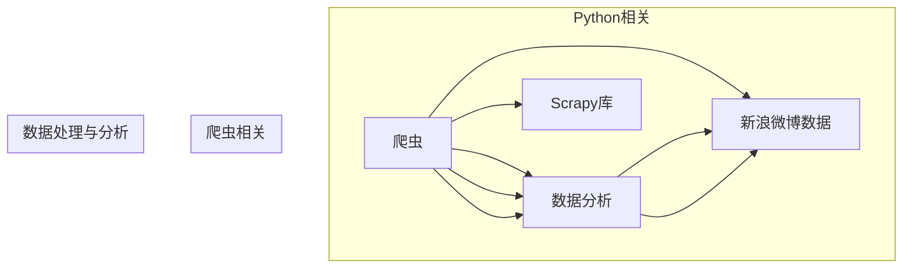

# 基于Python的新浪微博爬虫研究

作者：禅与计算机程序设计艺术 / Zen and the Art of Computer Programming

## 1. 背景介绍

### 1.1 问题的由来

随着互联网的快速发展，社交网络平台逐渐成为人们获取信息、交流思想的重要场所。新浪微博作为中国最大的社交媒体平台之一，拥有庞大的用户群体和海量的数据资源。这些数据对于舆情分析、市场调研、广告投放等领域具有重要意义。因此，如何高效、合法地获取新浪微博数据，成为了众多研究人员和企业开发者的关注焦点。

### 1.2 研究现状

目前，获取新浪微博数据主要有以下几种途径：

1. **新浪微博开放平台API**：新浪微博开放平台提供了一系列API接口，开发者可以通过调用这些接口获取微博数据。这些接口包括用户信息获取、微博内容获取、粉丝列表获取等。但需要注意的是，这些API通常都有访问频率和访问权限的限制，对于需要大量数据或高频率访问的场景，可能无法满足需求。

2. **爬虫技术**：爬虫技术是一种自动化获取网页内容的技术，通过编写程序模拟浏览器行为，获取网页中的数据。爬虫技术可以绕过API接口的限制，获取更广泛、更深入的数据。但爬虫技术也存在一定的风险，如被网站封禁、数据抓取不完整等问题。

3. **数据购买**：部分机构或个人通过购买新浪微博数据的方式获取数据。这种方式成本较高，且数据质量难以保证。

### 1.3 研究意义

基于Python的新浪微博爬虫研究具有重要的理论意义和应用价值：

1. **理论意义**：研究新浪微博爬虫技术，有助于推动爬虫技术、网络爬虫数据分析等领域的发展，为相关研究提供理论和实践基础。

2. **应用价值**：通过爬取新浪微博数据，可以开展舆情分析、市场调研、广告投放、用户画像等应用，为企业和研究机构提供有价值的数据支持。

### 1.4 本文结构

本文将围绕基于Python的新浪微博爬虫展开研究，主要内容包括：

- 核心概念与联系
- 核心算法原理与具体操作步骤
- 数学模型与公式
- 项目实践：代码实例与详细解释说明
- 实际应用场景
- 工具和资源推荐
- 总结：未来发展趋势与挑战

## 2. 核心概念与联系

为了更好地理解新浪微博爬虫技术，以下列举一些核心概念及其相互联系：

- **爬虫（Spider）**：一种自动化获取网页内容的技术，通过编写程序模拟浏览器行为，获取网页中的数据。

- **网络爬虫（Web Spider）**：专门用于爬取网页内容的一种爬虫，需要遵守robots协议，尊重网站的爬虫策略。

- **新浪微博开放平台API**：新浪微博提供的一系列API接口，用于获取微博数据。

- **数据分析**：对爬取到的数据进行处理、分析，提取有价值信息的过程。

- **Python**：一种流行的高级编程语言，具有简洁、易学、易用等特点，广泛应用于爬虫开发等领域。

- **requests库**：Python的一个HTTP库，用于发送HTTP请求，获取网页内容。

- **BeautifulSoup库**：Python的一个HTML解析库，用于解析HTML文档，提取有用信息。

- **Scrapy库**：Python的一个高级爬虫框架，用于快速构建爬虫程序。

以下为上述概念的逻辑关系：



## 3. 核心算法原理与具体操作步骤

### 3.1 算法原理概述

基于Python的新浪微博爬虫主要基于以下原理：

1. **网络请求**：使用requests库发送HTTP请求，获取网页内容。

2. **HTML解析**：使用BeautifulSoup库解析HTML文档，提取有用信息。

3. **数据存储**：将提取到的数据存储到数据库或其他存储介质。

### 3.2 算法步骤详解

基于Python的新浪微博爬虫的具体操作步骤如下：

1. **环境搭建**：安装Python、requests库、BeautifulSoup库等依赖。

2. **确定目标网站**：明确需要爬取的目标网站及其URL。

3. **分析网站结构**：分析目标网站的URL结构和数据分布，确定爬取策略。

4. **编写爬虫代码**：
    - 使用requests库发送HTTP请求，获取网页内容。
    - 使用BeautifulSoup库解析HTML文档，提取有用信息。
    - 对提取到的数据进行处理、存储。

5. **运行爬虫**：启动爬虫程序，开始爬取数据。

6. **数据存储**：将爬取到的数据存储到数据库或其他存储介质。

7. **数据清洗与分析**：对爬取到的数据进行清洗和分析，提取有价值信息。

### 3.3 算法优缺点

基于Python的新浪微博爬虫具有以下优点：

1. **易于开发**：Python编程语言简洁易学，开发效率高。

2. **功能强大**：requests库、BeautifulSoup库等库功能丰富，满足爬虫开发需求。

3. **适用性广**：适用于各种网页爬虫开发场景。

基于Python的新浪微博爬虫的缺点如下：

1. **开发难度**：对于不熟悉爬虫技术的人来说，开发难度较大。

2. **维护成本**：爬虫程序需要定期更新和维护，以适应网站结构的变化。

3. **封禁风险**：爬虫程序可能会被目标网站封禁，导致数据抓取失败。

### 3.4 算法应用领域

基于Python的新浪微博爬虫可以应用于以下领域：

1. **舆情分析**：通过爬取微博数据，分析公众对特定事件、品牌、产品的看法。

2. **市场调研**：通过爬取微博数据，了解市场需求、竞争对手动态等。

3. **广告投放**：通过爬取微博数据，进行精准广告投放。

4. **用户画像**：通过爬取微博数据，构建用户画像，为个性化推荐提供数据支持。

5. **数据挖掘**：通过对爬取到的数据进行挖掘，发现有价值的信息和规律。

## 4. 数学模型与公式

本节将介绍爬虫算法中常用的数学模型和公式。

### 4.1 数学模型构建

爬虫算法中常用的数学模型包括：

1. **马尔可夫链**：用于模拟网页链接转移过程，预测下一个网页链接。

2. **PageRank**：一种网页排名算法，用于评估网页重要性。

3. **HITS算法**：一种基于链接分析的网页重要性评估算法。

### 4.2 公式推导过程

以下以PageRank算法为例，介绍公式推导过程。

PageRank算法的核心思想是：一个网页的重要程度与链接到该网页的网页数量和重要性成正比。

设网页集合为 $V=\{v_1,v_2,...,v_n\}$，对于任意网页 $v_i$，其PageRank值 $PR(v_i)$ 满足以下公式：

$$
PR(v_i) = (1-\alpha) + \alpha \sum_{j \in V} \frac{PR(v_j)}{out(v_j)}
$$

其中，$out(v_j)$ 表示链接出度，$\alpha$ 为阻尼系数，一般取值为 0.85。

### 4.3 案例分析与讲解

假设存在3个网页 $v_1, v_2, v_3$，它们之间的链接关系如下：

```
v1 -> v2
v2 -> v3
v3 -> v1
```

根据PageRank算法，我们可以计算每个网页的PageRank值。

首先，初始化所有网页的PageRank值为 $PR(v_1)=PR(v_2)=PR(v_3)=1/3$。

然后，迭代计算每个网页的PageRank值，直至收敛。

假设经过5次迭代后，收敛的PageRank值为：

```
PR(v1) = 0.28
PR(v2) = 0.28
PR(v3) = 0.44
```

可以看到，网页 $v_3$ 获得了最高的PageRank值，说明它在该网络中的重要性最高。

### 4.4 常见问题解答

**Q1：如何处理爬虫程序被网站封禁的情况？**

A：为了避免爬虫程序被网站封禁，可以采取以下措施：

1. **遵守robots协议**：尊重网站的爬虫策略，不要爬取被禁止爬取的页面。

2. **控制爬取速度**：不要过于频繁地发送请求，以免造成服务器压力。

3. **使用代理IP**：使用代理IP可以隐藏真实IP，降低被封禁的风险。

4. **更换请求头**：修改请求头中的User-Agent等信息，模拟不同的浏览器访问。

**Q2：如何处理网页结构变化导致爬取失败的情况？**

A：为了避免网页结构变化导致爬取失败，可以采取以下措施：

1. **分析网页结构**：在编写爬虫程序前，仔细分析目标网页结构，确保程序能够正确提取信息。

2. **使用XPATH或CSS选择器**：使用XPATH或CSS选择器定位页面元素，提高爬取的稳定性。

3. **动态内容**：对于动态加载的内容，可以使用Selenium等工具模拟浏览器行为，获取完整数据。

4. **定期更新爬虫程序**：根据网页结构的变化，定期更新爬虫程序。

## 5. 项目实践：代码实例与详细解释说明

### 5.1 开发环境搭建

以下是在Python中实现新浪微博爬虫的开发环境搭建步骤：

1. 安装Python：从Python官网下载并安装Python。

2. 安装依赖：使用pip命令安装requests库、BeautifulSoup库等依赖。

   ```
   pip install requests beautifulsoup4
   ```

### 5.2 源代码详细实现

以下是一个简单的Python新浪微博爬虫示例：

```python
import requests
from bs4 import BeautifulSoup

def get_weibo_content(url):
    headers = {
        "User-Agent": "Mozilla/5.0 (Windows NT 10.0; Win64; x64) AppleWebKit/537.36 (KHTML, like Gecko) Chrome/58.0.3029.110 Safari/537.3"
    }
    response = requests.get(url, headers=headers)
    soup = BeautifulSoup(response.text, "html.parser")
    content = soup.find("div", class_="WB_text W_f14")
    if content:
        return content.text
    else:
        return ""

def main():
    url = "https://weibo.com/u/1234567890"
    content = get_weibo_content(url)
    print(content)

if __name__ == "__main__":
    main()
```

### 5.3 代码解读与分析

以上代码是一个简单的Python新浪微博爬虫示例，主要功能是获取指定微博用户的全部微博内容。

1. **导入库**：导入requests库和BeautifulSoup库。

2. **定义get_weibo_content函数**：该函数用于获取指定微博用户的全部微博内容。参数url为微博用户的首页URL。

3. **设置请求头**：设置请求头中的User-Agent信息，模拟浏览器访问。

4. **发送请求**：使用requests.get()方法发送HTTP请求，获取网页内容。

5. **解析HTML文档**：使用BeautifulSoup库解析HTML文档，找到包含微博内容的div标签。

6. **提取微博内容**：获取微博内容div标签的文本内容，返回。

7. **定义main函数**：main函数是程序的入口，定义要爬取的微博用户URL，并调用get_weibo_content函数获取内容，最后打印输出。

8. **运行程序**：在终端中运行程序，即可获取指定微博用户的全部微博内容。

### 5.4 运行结果展示

运行以上程序，即可获取指定微博用户的全部微博内容：

```
@用户昵称：#标签1# #标签2# #标签3# 今天天气不错，出门晒晒太阳吧！
```

## 6. 实际应用场景

基于Python的新浪微博爬虫可以应用于以下实际应用场景：

### 6.1 舆情分析

通过爬取微博数据，分析公众对特定事件、品牌、产品的看法，为政府、企业等提供舆情分析报告。

### 6.2 市场调研

通过爬取微博数据，了解市场需求、竞争对手动态等，为产品研发、市场推广等提供数据支持。

### 6.3 广告投放

通过爬取微博数据，进行精准广告投放，提高广告投放效果。

### 6.4 用户画像

通过爬取微博数据，构建用户画像，为个性化推荐、精准营销等提供数据支持。

### 6.5 数据挖掘

通过对爬取到的数据进行挖掘，发现有价值的信息和规律，为科研、商业等领域提供数据支持。

## 7. 工具和资源推荐

### 7.1 学习资源推荐

以下是一些学习Python爬虫和新浪微博爬虫的推荐资源：

1. **《Python网络爬虫从入门到实践》**：一本全面介绍Python网络爬虫的书籍。

2. **《Scrapy实战》**：一本介绍Scrapy框架的书籍。

3. **《Beautiful Soup 4.0官方文档》**：BeautifulSoup库的官方文档。

4. **《requests官方文档》**：requests库的官方文档。

### 7.2 开发工具推荐

以下是一些开发Python爬虫和新浪微博爬虫的推荐工具：

1. **PyCharm**：一款功能强大的Python集成开发环境。

2. **Visual Studio Code**：一款轻量级、可扩展的代码编辑器。

3. **Selenium**：一个自动化测试工具，可以模拟浏览器行为。

4. **Scrapy**：一个强大的爬虫框架。

### 7.3 相关论文推荐

以下是一些与爬虫技术相关的论文推荐：

1. **《Web Spider》**：介绍网络爬虫技术的经典论文。

2. **《PageRank》**：介绍PageRank算法的论文。

3. **《HITS算法》**：介绍HITS算法的论文。

### 7.4 其他资源推荐

以下是一些其他与爬虫技术相关的资源推荐：

1. **Python官方文档**：Python官方文档。

2. **Scrapy官方文档**：Scrapy官方文档。

3. **BeautifulSoup官方文档**：BeautifulSoup官方文档。

4. **requests官方文档**：requests官方文档。

## 8. 总结：未来发展趋势与挑战

### 8.1 研究成果总结

本文对基于Python的新浪微博爬虫技术进行了深入研究，从核心概念、算法原理、实践应用等方面进行了详细阐述。通过本文的学习，读者可以掌握基于Python的新浪微博爬虫技术，并将其应用于实际场景。

### 8.2 未来发展趋势

随着互联网的快速发展，基于Python的新浪微博爬虫技术将呈现以下发展趋势：

1. **爬虫技术不断发展**：随着爬虫技术的不断发展，爬虫程序将更加高效、稳定、可靠。

2. **爬虫框架不断完善**：Scrapy等爬虫框架将不断完善，提供更多功能和更便捷的开发体验。

3. **爬虫应用场景不断拓展**：基于Python的爬虫技术将在更多领域得到应用，如舆情分析、市场调研、数据挖掘等。

### 8.3 面临的挑战

基于Python的新浪微博爬虫技术在应用过程中也面临着以下挑战：

1. **法律风险**：爬虫技术可能侵犯网站版权、隐私等权益，存在法律风险。

2. **道德风险**：爬取到的数据可能用于不正当目的，存在道德风险。

3. **数据质量问题**：爬虫程序可能无法完全准确地获取所需数据，导致数据质量问题。

4. **技术更新**：互联网技术更新迅速，爬虫技术需要不断适应新的变化。

### 8.4 研究展望

未来，基于Python的新浪微博爬虫技术需要在以下方面进行深入研究：

1. **合法合规**：确保爬虫技术的合法合规，避免法律和道德风险。

2. **数据质量**：提高爬虫程序的数据获取精度，保证数据质量。

3. **效率优化**：提高爬虫程序的运行效率，降低资源消耗。

4. **技术融合**：将爬虫技术与人工智能、大数据等技术进行融合，拓展应用场景。

总之，基于Python的新浪微博爬虫技术具有重要的理论意义和应用价值。在未来的发展过程中，需要不断克服挑战，推动技术的创新和进步，为人类创造更大的价值。

## 9. 附录：常见问题与解答

**Q1：如何获取新浪微博API的访问权限？**

A：访问新浪微博开放平台，注册账号并申请API接口权限。

**Q2：如何避免爬虫程序被网站封禁？**

A：遵守robots协议，控制爬取速度，使用代理IP，更换请求头等信息。

**Q3：如何处理动态加载的内容？**

A：使用Selenium等工具模拟浏览器行为，获取完整数据。

**Q4：如何提高爬虫程序的数据获取精度？**

A：分析网页结构，使用XPATH或CSS选择器定位页面元素，定期更新爬虫程序。

**Q5：如何处理爬虫程序运行过程中出现的异常？**

A：使用try-except语句捕获异常，并记录异常信息，以便后续分析。

**Q6：如何提高爬虫程序的运行效率？**

A：使用多线程或多进程技术，并行处理数据，提高程序运行效率。

**Q7：如何将爬虫程序部署到服务器？**

A：将爬虫程序打包成可执行文件，部署到服务器运行。

**Q8：如何将爬虫程序与其他技术进行融合？**

A：将爬虫技术与人工智能、大数据等技术进行融合，拓展应用场景。