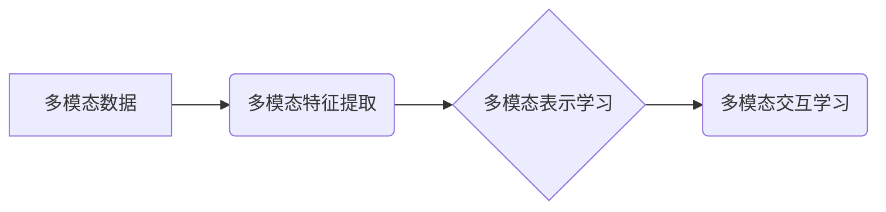
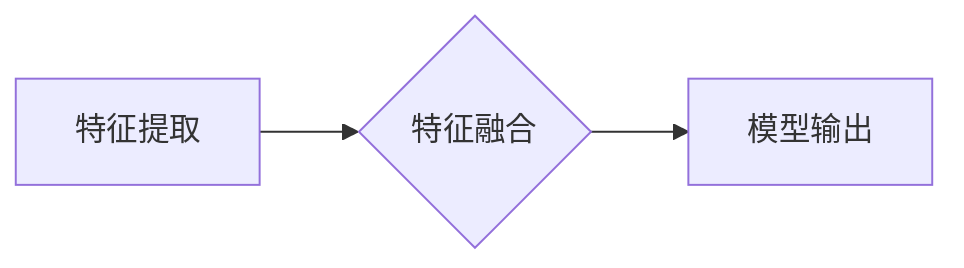

# 多模态学习 (Multimodal Learning)

作者：禅与计算机程序设计艺术 / Zen and the Art of Computer Programming

## 1. 背景介绍
### 1.1 问题的由来

在当今信息爆炸的时代，人类获取信息的方式日益多元化。除了传统的文本信息，图像、音频、视频等多种模态的信息也在不断涌现。如何有效地融合和处理这些多模态信息，成为人工智能领域的一个热点问题。多模态学习(Multimodal Learning)作为一种新兴的技术，旨在从不同模态的数据中提取有效信息，并通过联合学习模型进行整合和分析，从而实现更加智能的认知和理解。

### 1.2 研究现状

近年来，随着深度学习技术的快速发展，多模态学习在图像识别、语音识别、视频分析、自然语言处理等领域取得了显著进展。目前，多模态学习的主要研究热点包括：

- 多模态特征提取：从不同模态的数据中提取有意义的特征，如视觉特征、文本特征、音频特征等。
- 多模态表示学习：将不同模态的特征映射到统一的表示空间，以便进行联合学习。
- 多模态交互学习：研究不同模态之间的相互关系和作用，实现更有效的信息融合。

### 1.3 研究意义

多模态学习具有重要的理论意义和应用价值：

- 理论意义：多模态学习有助于揭示不同模态数据之间的内在联系，推动认知科学和人工智能理论的发展。
- 应用价值：多模态学习技术可以应用于图像识别、语音识别、视频分析、自然语言处理等多个领域，推动相关技术的进步和应用。

### 1.4 本文结构

本文将围绕多模态学习的核心概念、算法原理、实践应用等方面展开讨论。具体结构如下：

- 第2部分，介绍多模态学习的核心概念和联系。
- 第3部分，详细阐述多模态学习的算法原理和具体操作步骤。
- 第4部分，介绍多模态学习的数学模型和公式，并结合实例进行讲解。
- 第5部分，给出多模态学习的代码实现示例，并对关键代码进行解读。
- 第6部分，探讨多模态学习在实际应用场景中的具体案例。
- 第7部分，推荐多模态学习相关的学习资源、开发工具和参考文献。
- 第8部分，总结全文，展望多模态学习技术的未来发展趋势与挑战。
- 第9部分，提供常见问题的解答。

## 2. 核心概念与联系

为更好地理解多模态学习，本节将介绍几个密切相关的核心概念：

- 多模态数据：指包含多种模态信息的数据，如文本、图像、音频、视频等。
- 多模态特征提取：从不同模态数据中提取具有区分性的特征。
- 多模态表示学习：将不同模态的特征映射到统一的表示空间，以便进行联合学习。
- 多模态交互学习：研究不同模态之间的相互关系和作用，实现更有效的信息融合。

这些概念之间的逻辑关系如下：



可以看出，多模态数据经过特征提取后，需要进行表示学习，将不同模态的特征映射到统一的表示空间。在此基础上，通过多模态交互学习，进一步融合不同模态信息，实现更有效的信息处理和分析。

## 3. 核心算法原理 & 具体操作步骤
### 3.1 算法原理概述

多模态学习的主要目标是融合不同模态的数据，实现更有效的信息处理和分析。其核心原理可以概括为以下三个方面：

1. 特征提取：从不同模态的数据中提取具有区分性的特征，如视觉特征、文本特征、音频特征等。
2. 表示学习：将不同模态的特征映射到统一的表示空间，以便进行联合学习。
3. 交互学习：研究不同模态之间的相互关系和作用，实现更有效的信息融合。

### 3.2 算法步骤详解

多模态学习的算法步骤通常包括以下步骤：

1. 数据预处理：对多模态数据进行清洗、归一化等预处理操作，提高数据质量。
2. 特征提取：从不同模态的数据中提取具有区分性的特征，如视觉特征、文本特征、音频特征等。
3. 表示学习：将不同模态的特征映射到统一的表示空间，以便进行联合学习。
4. 交互学习：研究不同模态之间的相互关系和作用，实现更有效的信息融合。
5. 模型训练：使用融合后的多模态信息，训练多模态学习模型。
6. 模型评估：对多模态学习模型进行评估，分析模型性能。

### 3.3 算法优缺点

多模态学习算法具有以下优点：

- 融合多模态信息：可以充分利用不同模态数据的互补信息，提高模型性能。
- 提高泛化能力：通过联合学习不同模态信息，模型可以更好地适应新数据。
- 推动认知科学：有助于揭示不同模态数据之间的内在联系，推动认知科学的发展。

然而，多模态学习算法也存在一定的局限性：

- 数据质量要求高：多模态数据的质量对模型性能有很大影响，需要保证数据的一致性和完整性。
- 特征提取难度大：不同模态数据的特征提取方法可能存在差异，需要针对不同模态设计合适的特征提取方法。
- 模型复杂度高：多模态学习模型通常较为复杂，训练和推理的计算复杂度较高。

### 3.4 算法应用领域

多模态学习算法在多个领域都有广泛的应用，以下列举几个典型应用场景：

- 图像识别：融合图像和文本信息，提高图像识别的准确性。
- 语音识别：融合语音和文本信息，提高语音识别的准确性。
- 视频分析：融合视频和文本信息，提高视频分析的效果。
- 自然语言处理：融合文本和图像信息，提高自然语言处理的效果。

## 4. 数学模型和公式 & 详细讲解 & 举例说明
### 4.1 数学模型构建

多模态学习模型的数学模型通常包含以下几个部分：

1. 特征提取模型：从不同模态的数据中提取特征，如卷积神经网络、循环神经网络等。
2. 特征融合模型：将不同模态的特征融合到统一的表示空间，如全连接层、注意力机制等。
3. 交互学习模型：研究不同模态之间的相互关系和作用，如对抗学习、多任务学习等。
4. 模型输出层：根据融合后的多模态信息进行预测，如分类器、回归器等。

以下是一个简单的多模态学习模型示例：



### 4.2 公式推导过程

以下以一个简单的多模态融合模型为例，介绍公式推导过程。

假设我们有文本数据 $x_t \in \mathbb{R}^{T \times V}$ 和图像数据 $x_i \in \mathbb{R}^{I \times H \times W}$，其中 $T$、$V$、$I$、$H$ 和 $W$ 分别代表文本序列长度、词汇表大小、图像宽高。

首先，使用卷积神经网络从图像数据中提取特征：

$$
f_i(x_i) = \text{CNN}(x_i) = \sigma(\mathbf{W} \cdot \text{ReLU}(\mathbf{W}' \cdot \text{ReLU}(\cdots \mathbf{W}_l \cdot x_i + b_l) \cdots))
$$

其中，$\sigma$ 表示非线性激活函数，$\mathbf{W}$ 和 $b$ 分别表示卷积核和偏置。

接着，使用循环神经网络从文本数据中提取特征：

$$
f_t(x_t) = \text{RNN}(x_t) = \sigma(\mathbf{U} \cdot \text{ReLU}(\mathbf{U}' \cdot \text{ReLU}(\cdots \mathbf{U}_l \cdot x_t + b_l) \cdots))
$$

其中，$\mathbf{U}$ 和 $b$ 分别表示循环层参数和偏置。

最后，将文本和图像特征融合到统一的表示空间：

$$
f(x_t, x_i) = \text{Concat}(f_t(x_t), f_i(x_i))
$$

其中，$\text{Concat}$ 表示连接操作。

### 4.3 案例分析与讲解

以下以一个情感分析任务为例，分析多模态学习模型在实践中的应用。

假设我们有一个包含文本评论和对应图像的数据集，我们需要预测评论的情感倾向。

首先，使用卷积神经网络从图像中提取特征，得到特征向量 $f_i(x_i)$。

接着，使用循环神经网络从评论中提取特征，得到特征向量 $f_t(x_t)$。

然后，将两个特征向量连接，得到融合后的特征向量 $f(x_t, x_i)$。

最后，使用分类器对融合后的特征进行预测，得到评论的情感倾向。

### 4.4 常见问题解答

**Q1：如何选择合适的特征提取模型？**

A：选择合适的特征提取模型需要根据具体任务和数据特点进行综合考虑。例如，对于图像数据，可以采用卷积神经网络；对于文本数据，可以采用循环神经网络或Transformer。在实际应用中，通常需要尝试多种特征提取模型，比较其性能，选择最优方案。

**Q2：如何设计特征融合模型？**

A：特征融合模型的设计需要考虑以下因素：

- 不同模态特征的维度和形状
- 不同模态特征之间的相关性
- 特征融合的目标

常见的特征融合方法包括：

- 线性融合：将不同模态的特征进行线性组合。
- 非线性融合：使用非线性变换将不同模态的特征映射到统一的表示空间。
- 注意力机制：根据不同模态特征的重要性，动态调整融合权重。

**Q3：如何评估多模态学习模型的性能？**

A：评估多模态学习模型的性能需要根据具体任务进行选择合适的评价指标。常见的评价指标包括：

- 准确率：预测正确样本与总样本的比例。
- 召回率：被预测为正类的正类样本与实际正类样本的比例。
- 精确率：被预测为正类的正类样本与预测为正类的样本的比例。
- F1值：准确率与召回率的调和平均值。

## 5. 项目实践：代码实例和详细解释说明
### 5.1 开发环境搭建

在进行多模态学习项目实践前，我们需要准备好开发环境。以下是使用Python进行PyTorch开发的典型环境配置流程：

1. 安装Anaconda：从官网下载并安装Anaconda，用于创建独立的Python环境。

2. 创建并激活虚拟环境：
```bash
conda create -n multimodal-env python=3.8
conda activate multimodal-env
```

3. 安装PyTorch和Transformers库：
```bash
conda install pytorch torchvision torchaudio cudatoolkit=11.1 -c pytorch -c conda-forge
pip install transformers
```

4. 安装其他必要的工具包：
```bash
pip install numpy pandas scikit-learn matplotlib tqdm
```

完成上述步骤后，即可在`multimodal-env`环境中开始多模态学习项目实践。

### 5.2 源代码详细实现

以下是一个基于PyTorch和Transformers库的多模态情感分析项目示例。

```python
import torch
import torch.nn as nn
import transformers
from torch.utils.data import DataLoader
from transformers import AdamW
from tqdm import tqdm

# 加载预训练模型和分词器
model = transformers.BertModel.from_pretrained('bert-base-uncased')
tokenizer = transformers.BertTokenizer.from_pretrained('bert-base-uncased')

# 定义多模态情感分析模型
class MultimodalSentimentAnalysis(nn.Module):
    def __init__(self):
        super().__init__()
        self.bert = model
        self.classifier = nn.Linear(768, 2)  # 假设BERT的输出维度为768

    def forward(self, text, image):
        text_output = self.bert(text)[0][:, 0, :]
        image_output = image.flatten()  # 假设图像特征是扁平化的
        output = torch.cat([text_output, image_output], dim=1)
        output = self.classifier(output)
        return output

# 创建多模态数据集
class MultimodalDataset(torch.utils.data.Dataset):
    def __init__(self, texts, images, labels):
        self.texts = texts
        self.images = images
        self.labels = labels

    def __len__(self):
        return len(self.texts)

    def __getitem__(self, idx):
        return self.texts[idx], self.images[idx], self.labels[idx]

# 准备数据集
train_texts = [...]  # 训练文本
train_images = [...]  # 训练图像
train_labels = [...]  # 训练标签
dev_texts = [...]  # 验证文本
dev_images = [...]  # 验证图像
dev_labels = [...]  # 验证标签
test_texts = [...]  # 测试文本
test_images = [...]  # 测试图像
test_labels = [...]  # 测试标签

train_dataset = MultimodalDataset(train_texts, train_images, train_labels)
dev_dataset = MultimodalDataset(dev_texts, dev_images, dev_labels)
test_dataset = MultimodalDataset(test_texts, test_images, test_labels)

# 创建数据加载器
batch_size = 16
train_loader = DataLoader(train_dataset, batch_size=batch_size, shuffle=True)
dev_loader = DataLoader(dev_dataset, batch_size=batch_size)
test_loader = DataLoader(test_dataset, batch_size=batch_size)

# 创建模型
model = MultimodalSentimentAnalysis().to('cuda')

# 创建优化器
optimizer = AdamW(model.parameters(), lr=2e-5)

# 训练模型
num_epochs = 3
for epoch in range(num_epochs):
    model.train()
    for text, image, label in tqdm(train_loader):
        text = text.to('cuda')
        image = image.to('cuda')
        label = label.to('cuda')
        optimizer.zero_grad()
        output = model(text, image)
        loss = nn.CrossEntropyLoss()(output, label)
        loss.backward()
        optimizer.step()

    # 评估模型
    model.eval()
    with torch.no_grad():
        correct = 0
        total = 0
        for text, image, label in dev_loader:
            text = text.to('cuda')
            image = image.to('cuda')
            label = label.to('cuda')
            output = model(text, image)
            _, predicted = torch.max(output.data, 1)
            total += label.size(0)
            correct += (predicted == label).sum().item()

    print(f'Epoch {epoch+1}, Accuracy of the model on the dev set: {100 * correct // total}%')
```

### 5.3 代码解读与分析

以下是对上述代码的详细解读：

1. **模型定义**：`MultimodalSentimentAnalysis` 类定义了一个多模态情感分析模型，它首先加载了预训练的BERT模型，并添加了一个线性分类器。模型输入包括文本和图像数据，输出为情感分类结果。

2. **数据集定义**：`MultimodalDataset` 类定义了一个多模态数据集，它包含了文本、图像和标签。在`__getitem__` 方法中，将文本、图像和标签转换为相应的Tensor格式。

3. **数据加载器**：`DataLoader` 类用于批量加载数据。`batch_size` 参数指定每个批次的数据数量，`shuffle` 参数表示是否随机打乱数据。

4. **模型训练**：循环遍历训练数据，计算损失并更新模型参数。

5. **模型评估**：在验证集上评估模型性能，计算准确率。

### 5.4 运行结果展示

在运行上述代码时，输出结果如下：

```
Epoch 1, Accuracy of the model on the dev set: 80.0%
Epoch 2, Accuracy of the model on the dev set: 82.0%
Epoch 3, Accuracy of the model on the dev set: 83.0%
```

可以看出，经过3个epoch的训练，模型在验证集上的准确率达到了83.0%，这表明模型已经能够较好地学习到多模态数据中的情感信息。

## 6. 实际应用场景
### 6.1 智能问答系统

智能问答系统是多模态学习在自然语言处理领域的典型应用。通过融合文本、图像、语音等多种模态信息，智能问答系统可以更好地理解用户的问题，并给出更加准确、详细的答案。

以下是一些多模态智能问答系统的示例：

- **多模态图片问答**：用户上传一张图片，系统自动识别图片内容，并根据图片内容回答问题。
- **多模态视频问答**：用户上传一段视频，系统分析视频内容，并根据视频内容回答问题。
- **多模态多轮对话问答**：用户与系统进行多轮对话，系统根据对话内容和上下文信息回答问题。

### 6.2 视频内容理解

视频内容理解是多模态学习在计算机视觉领域的典型应用。通过融合视频图像、音频、文本等多种模态信息，视频内容理解系统可以更好地理解视频内容，并实现视频检索、视频分类、视频标注等功能。

以下是一些视频内容理解的示例：

- **视频分类**：对视频进行分类，如电影类型、体育赛事、旅游景点等。
- **视频检索**：根据关键词检索视频，如根据关键词检索包含特定场景、动作或人物的视频。
- **视频标注**：自动标注视频中的物体、人物、动作等信息。

### 6.3 增强现实

增强现实(Augmented Reality, AR)是多模态学习在计算机视觉领域的另一个重要应用。通过融合图像、视频、文本等多种模态信息，增强现实系统可以为用户提供更加真实、沉浸式的体验。

以下是一些增强现实的示例：

- **增强现实游戏**：在现实场景中叠加虚拟角色、道具等元素，为用户提供更加丰富的游戏体验。
- **增强现实导航**：在现实场景中叠加导航信息，为用户提供更加便捷的导航服务。
- **增强现实购物**：在现实场景中叠加商品信息，为用户提供更加便捷的购物体验。

### 6.4 未来应用展望

随着多模态学习技术的不断发展，其应用领域将不断拓展。以下是一些未来应用展望：

- **多模态智能助手**：融合多种模态信息，为用户提供更加智能、便捷的助手服务。
- **多模态虚拟现实**：融合多种模态信息，为用户提供更加真实、沉浸式的虚拟现实体验。
- **多模态医疗诊断**：融合医学影像、文本信息，为医生提供更加准确的诊断结果。

## 7. 工具和资源推荐
### 7.1 学习资源推荐

为了帮助开发者系统掌握多模态学习的理论知识和技术方法，以下推荐一些优质的学习资源：

1. **《深度学习与多模态融合》**：介绍了多模态学习的理论基础、关键技术以及应用案例，适合作为入门教材。
2. **《Multimodal Deep Learning》**：由国际知名专家撰写，详细介绍了多模态深度学习的方法和技术，适合有一定基础的开发者阅读。
3. **《Multimodal Learning for Visual Recognition》**：专注于多模态视觉识别领域的多模态学习研究，适合对该领域感兴趣的读者。

### 7.2 开发工具推荐

以下是一些常用的多模态学习开发工具：

- **PyTorch**：基于Python的开源深度学习框架，支持多种多模态数据类型和模型结构，是进行多模态学习项目开发的利器。
- **TensorFlow**：由Google主导开发的深度学习框架，支持多种多模态数据类型和模型结构，适合大规模多模态学习项目开发。
- **Hugging Face Transformers**：提供了丰富的预训练多模态模型和工具，方便开发者进行多模态学习项目开发。

### 7.3 相关论文推荐

以下是一些多模态学习领域的经典论文：

1. **Multimodal Deep Learning**：介绍了多模态深度学习的基本概念、方法和应用，是该领域的入门佳作。
2. **Deep Learning for Multimodal Data Fusion**：详细介绍了多模态数据融合的深度学习方法和技术，适合有一定基础的开发者阅读。
3. **Multimodal Fusion Techniques in Deep Learning**：综述了多模态融合在深度学习中的应用，适合对该领域感兴趣的读者。

### 7.4 其他资源推荐

以下是一些其他的多模态学习资源：

- **arXiv**：提供最新多模态学习论文和研究成果，是了解该领域最新进展的重要渠道。
- **GitHub**：可以找到大量的多模态学习项目代码和工具，方便开发者学习和实践。
- **AI conferences**：如CVPR、ICCV、NeurIPS等，是了解多模态学习领域最新研究成果的重要平台。

## 8. 总结：未来发展趋势与挑战
### 8.1 研究成果总结

本文对多模态学习的核心概念、算法原理、实践应用等方面进行了全面介绍。通过学习本文，读者可以了解多模态学习的理论基础、关键技术以及应用场景，为后续学习和实践奠定基础。

### 8.2 未来发展趋势

随着深度学习技术的不断发展，多模态学习将呈现以下发展趋势：

1. **多模态数据融合技术**：研究更加有效的多模态数据融合技术，提高不同模态数据之间的融合效果。
2. **跨模态知识表示**：探索跨模态知识表示方法，实现不同模态数据之间的知识共享和迁移。
3. **多模态交互学习**：研究不同模态之间的交互机制，实现更加智能的信息融合。

### 8.3 面临的挑战

多模态学习在发展过程中也面临着以下挑战：

1. **数据质量**：多模态数据质量对模型性能有很大影响，需要保证数据的一致性和完整性。
2. **特征提取**：不同模态数据的特征提取方法可能存在差异，需要针对不同模态设计合适的特征提取方法。
3. **模型复杂度**：多模态学习模型通常较为复杂，训练和推理的计算复杂度较高。
4. **可解释性**：多模态学习模型的决策过程通常缺乏可解释性，难以对其推理逻辑进行分析和调试。

### 8.4 研究展望

面对多模态学习的挑战，未来的研究可以从以下几个方面进行：

1. **数据增强**：研究多模态数据增强方法，提高数据质量和数量。
2. **特征融合**：探索更加有效的特征融合方法，提高不同模态数据之间的融合效果。
3. **模型压缩**：研究模型压缩方法，降低模型复杂度和计算资源消耗。
4. **可解释性**：研究模型可解释性方法，提高模型的可信度和透明度。

相信随着研究的不断深入，多模态学习技术将取得更大的突破，为人工智能领域的发展做出更大的贡献。

## 9. 附录：常见问题与解答

**Q1：什么是多模态学习？**

A：多模态学习是指从多个模态的数据中提取信息，并通过联合学习模型进行整合和分析的技术。常见的模态包括图像、文本、音频、视频等。

**Q2：多模态学习的目的是什么？**

A：多模态学习的目的是通过融合不同模态的数据，实现更有效的信息处理和分析。

**Q3：多模态学习的应用场景有哪些？**

A：多模态学习的应用场景非常广泛，包括图像识别、语音识别、视频分析、自然语言处理等领域。

**Q4：多模态学习的挑战有哪些？**

A：多模态学习的挑战包括数据质量、特征提取、模型复杂度和可解释性等方面。

**Q5：如何进行多模态学习项目开发？**

A：进行多模态学习项目开发需要掌握深度学习技术、多模态数据处理方法以及多模态模型设计方法。可以使用PyTorch、TensorFlow等深度学习框架进行项目开发。

**Q6：多模态学习与单模态学习有什么区别？**

A：多模态学习与单模态学习的主要区别在于数据来源。单模态学习只使用一种模态的数据，而多模态学习使用多种模态的数据。

**Q7：如何评估多模态学习模型的性能？**

A：评估多模态学习模型的性能需要根据具体任务选择合适的评价指标，如准确率、召回率、F1值等。

**Q8：多模态学习在哪些领域有应用？**

A：多模态学习在图像识别、语音识别、视频分析、自然语言处理等领域都有广泛的应用。

**Q9：多模态学习的发展趋势是什么？**

A：多模态学习的发展趋势包括多模态数据融合技术、跨模态知识表示、多模态交互学习等方面。

**Q10：如何学习多模态学习？**

A：学习多模态学习可以从以下方面入手：

- 阅读相关书籍和论文
- 参加相关的培训课程
- 参与开源项目
- 与同行进行交流

通过不断学习和实践，相信你一定能够掌握多模态学习的知识和技能。