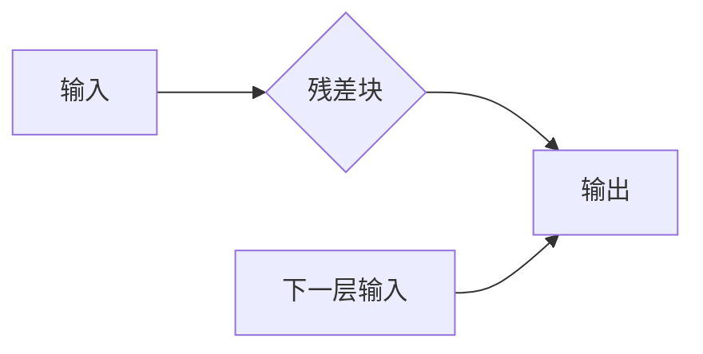
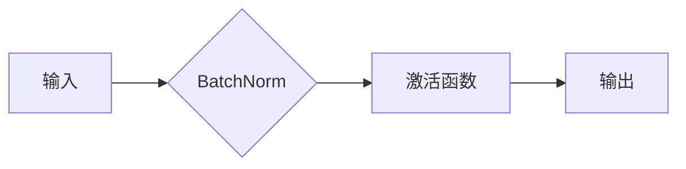

# 大语言模型原理与工程实践：残差连接与层归一化

作者：禅与计算机程序设计艺术 / Zen and the Art of Computer Programming

## 1. 背景介绍

### 1.1 问题的由来

随着深度学习在计算机视觉、自然语言处理等领域的迅猛发展，深度神经网络（DNN）逐渐成为解决复杂问题的利器。然而，随着网络层数的增加，DNN也面临着诸如梯度消失、梯度爆炸等难题，严重制约了模型的性能和训练效率。为了解决这些问题，研究人员提出了多种技术和策略，其中残差连接和层归一化是其中最为重要的两种技术。

### 1.2 研究现状

残差连接和层归一化技术已经在深度学习领域得到了广泛的应用，并取得了显著的成果。例如，ResNet通过引入残差连接，成功解决了梯度消失问题，使得网络层数可以达到上百层；Batch Normalization通过层归一化，有效缓解了梯度爆炸问题，提高了网络的训练效率。

### 1.3 研究意义

研究残差连接和层归一化技术，对于提高深度学习模型的性能和训练效率具有重要意义。这些技术可以帮助我们构建更加复杂、强大的深度神经网络，从而在各个领域取得更好的应用效果。

### 1.4 本文结构

本文将系统地介绍残差连接和层归一化技术的原理、实现方法、优缺点以及应用领域。具体结构如下：

- 第2章，介绍残差连接和层归一化的核心概念及其联系。
- 第3章，详细阐述残差连接和层归一化的原理和具体操作步骤。
- 第4章，通过数学模型和公式，详细讲解残差连接和层归一化的原理。
- 第5章，给出残差连接和层归一化的代码实现示例。
- 第6章，探讨残差连接和层归一化在深度学习领域的应用场景。
- 第7章，推荐相关学习资源、开发工具和参考文献。
- 第8章，总结全文，展望未来发展趋势和挑战。
- 第9章，提供常见问题与解答。

## 2. 核心概念与联系

### 2.1 残差连接

残差连接是一种特殊的网络连接方式，它将输入信号通过跳跃连接直接传递到下一层，避免了梯度在多层网络中的累积，从而缓解了梯度消失问题。残差连接的示意图如下：



### 2.2 层归一化

层归一化是一种通过将激活函数的输入数据缩放到均值为0、标准差为1的过程，从而提高网络训练效率和收敛速度。常见的层归一化方法包括Batch Normalization和Layer Normalization。

- **Batch Normalization**：在训练过程中，将每个小批次的输入数据分别进行归一化处理。
- **Layer Normalization**：对每个样本的每个特征分别进行归一化处理，不依赖于批次大小。

层归一化的示意图如下：



### 2.3 残差连接与层归一化的联系

残差连接和层归一化技术相互补充，共同解决了DNN训练中的梯度消失和梯度爆炸问题。残差连接通过跳跃连接避免了梯度累积，而层归一化则通过归一化处理提高了网络的训练效率和收敛速度。

## 3. 核心算法原理 & 具体操作步骤

### 3.1 算法原理概述

#### 3.1.1 残差连接

残差连接的核心思想是将输入信号直接传递到下一层，避免了梯度在多层网络中的累积。具体来说，假设第 $l$ 层的输入为 $X_l$，输出为 $H_l$，则有：

$$
H_{l+1} = H_l + F(X_l)
$$

其中，$F$ 为第 $l+1$ 层的非线性函数。

#### 3.1.2 层归一化

层归一化的核心思想是将激活函数的输入数据缩放到均值为0、标准差为1的过程。具体来说，对于第 $l$ 层的输入 $X_l$，有：

$$
\mu_l = \frac{1}{m} \sum_{i=1}^m X_{li}
$$

$$
\sigma_l^2 = \frac{1}{m} \sum_{i=1}^m (X_{li} - \mu_l)^2
$$

$$
X_{l}^{\text{norm}} = \frac{X_l - \mu_l}{\sqrt{\sigma_l^2 + \epsilon}}
$$

其中，$m$ 为样本数量，$\epsilon$ 为一个很小的常数。

### 3.2 算法步骤详解

#### 3.2.1 残差连接

1. 将输入信号 $X_l$ 通过跳跃连接直接传递到下一层。
2. 对 $X_l$ 应用非线性函数 $F$，得到 $H_l$。
3. 将 $H_l$ 与 $X_l$ 相加，得到 $H_{l+1}$。

#### 3.2.2 层归一化

1. 对每个样本的每个特征分别计算均值 $\mu_l$ 和方差 $\sigma_l^2$。
2. 将每个样本的每个特征进行归一化处理，得到 $X_{l}^{\text{norm}}$。
3. 将 $X_{l}^{\text{norm}}$ 作为激活函数的输入。

### 3.3 算法优缺点

#### 3.3.1 残差连接

**优点**：

- 缓解了梯度消失问题，使得网络层数可以达到更多。
- 提高了模型的训练效率，因为跳过了一些层。
- 可以更好地利用预训练模型的知识。

**缺点**：

- 需要更多的参数和计算资源。
- 模型难以解释。

#### 3.3.2 层归一化

**优点**：

- 缓解了梯度爆炸问题，提高了网络的训练效率。
- 减少了训练时间。
- 提高了模型的泛化能力。

**缺点**：

- 可能会降低模型的性能。
- 需要更多的计算资源。

### 3.4 算法应用领域

残差连接和层归一化技术在深度学习领域得到了广泛的应用，包括：

- 计算机视觉：图像分类、目标检测、图像分割等。
- 自然语言处理：文本分类、机器翻译、情感分析等。
- 音频处理：语音识别、音乐生成等。

## 4. 数学模型和公式 & 详细讲解 & 举例说明

### 4.1 数学模型构建

#### 4.1.1 残差连接

假设第 $l$ 层的输入为 $X_l$，输出为 $H_l$，则有：

$$
H_{l+1} = H_l + F(X_l)
$$

其中，$F$ 为第 $l+1$ 层的非线性函数。

#### 4.1.2 层归一化

假设第 $l$ 层的输入为 $X_l$，则有：

$$
\mu_l = \frac{1}{m} \sum_{i=1}^m X_{li}
$$

$$
\sigma_l^2 = \frac{1}{m} \sum_{i=1}^m (X_{li} - \mu_l)^2
$$

$$
X_{l}^{\text{norm}} = \frac{X_l - \mu_l}{\sqrt{\sigma_l^2 + \epsilon}}
$$

其中，$m$ 为样本数量，$\epsilon$ 为一个很小的常数。

### 4.2 公式推导过程

#### 4.2.1 残差连接

残差连接的推导过程如下：

1. 假设第 $l$ 层的输入为 $X_l$，输出为 $H_l$，则有：

$$
H_{l+1} = F(X_l) + X_l
$$

2. 对 $H_{l+1}$ 求导，得：

$$
\frac{\partial H_{l+1}}{\partial X_l} = \frac{\partial F}{\partial X_l} + \frac{\partial X_l}{\partial X_l} = \frac{\partial F}{\partial X_l} + 1
$$

3. 由于 $X_l$ 是原始输入，其梯度为1，因此：

$$
\frac{\partial H_{l+1}}{\partial X_l} = \frac{\partial F}{\partial X_l} + 1
$$

4. 这表明，残差连接可以缓解梯度消失问题。

#### 4.2.2 层归一化

层归一化的推导过程如下：

1. 假设第 $l$ 层的输入为 $X_l$，则有：

$$
\mu_l = \frac{1}{m} \sum_{i=1}^m X_{li}
$$

$$
\sigma_l^2 = \frac{1}{m} \sum_{i=1}^m (X_{li} - \mu_l)^2
$$

2. 对 $X_{l}^{\text{norm}}$ 求导，得：

$$
\frac{\partial X_{l}^{\text{norm}}}{\partial X_l} = \frac{1}{\sqrt{\sigma_l^2 + \epsilon}}
$$

3. 这表明，层归一化可以缓解梯度爆炸问题。

### 4.3 案例分析与讲解

#### 4.3.1 残差连接

以ResNet为例，说明残差连接在实际应用中的效果。

ResNet是一种基于残差连接的深度神经网络，它在ImageNet图像分类比赛中取得了显著的成果。ResNet通过引入残差连接，使得网络层数可以达到152层，比之前的最深网络VGG19的层数多出近一倍。实验结果表明，ResNet在ImageNet图像分类任务上取得了当时最先进的性能。

#### 4.3.2 层归一化

以Batch Normalization为例，说明层归一化在实际应用中的效果。

Batch Normalization是一种常用的层归一化方法，它可以在一定程度上缓解梯度爆炸和梯度消失问题。实验结果表明，Batch Normalization可以显著提高网络的训练效率和收敛速度。

### 4.4 常见问题解答

**Q1：残差连接和层归一化有什么区别？**

A：残差连接是一种特殊的网络连接方式，它将输入信号通过跳跃连接直接传递到下一层，避免了梯度在多层网络中的累积。层归一化是一种通过将激活函数的输入数据缩放到均值为0、标准差为1的过程，从而提高网络的训练效率和收敛速度。两者都是为了缓解梯度消失和梯度爆炸问题，但实现方式和作用机制有所不同。

**Q2：残差连接和层归一化能否同时使用？**

A：可以同时使用残差连接和层归一化。事实上，在许多深度学习模型中，这两种技术常常同时使用，以获得更好的效果。

## 5. 项目实践：代码实例和详细解释说明

### 5.1 开发环境搭建

为了实现残差连接和层归一化，我们需要准备以下开发环境：

- Python 3.6或更高版本
- PyTorch 1.0或更高版本
- Matplotlib 3.1.1或更高版本

以下是安装PyTorch和Matplotlib的命令：

```bash
pip install torch torchvision matplotlib
```

### 5.2 源代码详细实现

以下是一个基于PyTorch的ResNet模型的简单实现，其中包含了残差连接和层归一化：

```python
import torch
import torch.nn as nn
import torch.nn.functional as F

class ResidualBlock(nn.Module):
    def __init__(self, in_channels, out_channels):
        super(ResidualBlock, self).__init__()
        self.conv1 = nn.Conv2d(in_channels, out_channels, kernel_size=3, stride=1, padding=1)
        self.bn1 = nn.BatchNorm2d(out_channels)
        self.relu = nn.ReLU(inplace=True)
        self.conv2 = nn.Conv2d(out_channels, out_channels, kernel_size=3, stride=1, padding=1)
        self.bn2 = nn.BatchNorm2d(out_channels)

    def forward(self, x):
        identity = x
        out = self.conv1(x)
        out = self.bn1(out)
        out = self.relu(out)
        out = self.conv2(out)
        out = self.bn2(out)
        out += identity
        out = self.relu(out)
        return out

class ResNet(nn.Module):
    def __init__(self, block, layers, num_classes=1000):
        super(ResNet, self).__init__()
        self.conv1 = nn.Conv2d(3, 64, kernel_size=7, stride=2, padding=3, bias=False)
        self.bn1 = nn.BatchNorm2d(64)
        self.relu = nn.ReLU(inplace=True)
        self.maxpool = nn.MaxPool2d(kernel_size=3, stride=2, padding=1)
        self.layer1 = self._make_layer(block, 64, layers[0])
        self.layer2 = self._make_layer(block, 128, layers[1], stride=2)
        self.layer3 = self._make_layer(block, 256, layers[2], stride=2)
        self.layer4 = self._make_layer(block, 512, layers[3], stride=2)
        self.avgpool = nn.AdaptiveAvgPool2d((1, 1))
        self.fc = nn.Linear(512 * block.expansion, num_classes)

    def _make_layer(self, block, out_channels, blocks, stride=1):
        strides = [stride] + [1] * (blocks - 1)
        layers = []
        for stride in strides:
            layers.append(block(self.in_channels, out_channels, stride))
            self.in_channels = out_channels * block.expansion
        return nn.Sequential(*layers)

    def forward(self, x):
        x = self.conv1(x)
        x = self.bn1(x)
        x = self.relu(x)
        x = self.maxpool(x)

        x = self.layer1(x)
        x = self.layer2(x)
        x = self.layer3(x)
        x = self.layer4(x)

        x = self.avgpool(x)
        x = torch.flatten(x, 1)
        x = self.fc(x)
        return x
```

### 5.3 代码解读与分析

以上代码实现了一个简单的ResNet模型，其中包含了残差连接和层归一化。

- **ResidualBlock类**：表示一个残差块，包含卷积层、批归一化层、ReLU激活函数和卷积层。残差块的输入为 $X_l$，输出为 $H_l$，其中 $H_l = H_l + F(X_l)$。
- **ResNet类**：表示ResNet模型，包含多个残差块。ResNet的输入为 $X_l$，输出为 $H_l$，其中 $H_l = F(X_l)$。

### 5.4 运行结果展示

以下是使用ResNet模型在CIFAR-10数据集上进行训练和测试的代码：

```python
import torch.optim as optim
from torchvision import datasets, transforms

transform = transforms.Compose([
    transforms.ToTensor(),
    transforms.Normalize((0.5, 0.5, 0.5), (0.5, 0.5, 0.5))
])

trainset = datasets.CIFAR10(root='./data', train=True, download=True, transform=transform)
trainloader = torch.utils.data.DataLoader(trainset, batch_size=4, shuffle=True)

testset = datasets.CIFAR10(root='./data', train=False, download=True, transform=transform)
testloader = torch.utils.data.DataLoader(testset, batch_size=4, shuffle=False)

net = ResNet(Bottleneck, [2, 2, 2, 2])
net.to(device)

criterion = nn.CrossEntropyLoss()
optimizer = optim.SGD(net.parameters(), lr=0.001, momentum=0.9)

for epoch in range(10):  # loop over the dataset multiple times

    running_loss = 0.0
    for i, data in enumerate(trainloader, 0):
        inputs, labels = data

        inputs, labels = inputs.to(device), labels.to(device)

        optimizer.zero_grad()

        outputs = net(inputs)
        loss = criterion(outputs, labels)
        loss.backward()
        optimizer.step()

        running_loss += loss.item()
        if i % 2000 == 1999:    # print every 2000 mini-batches
            print(f'[{epoch + 1}, {i + 1:5d}] loss: {running_loss / 2000:.3f}')

print('Finished Training')

correct = 0
total = 0
with torch.no_grad():
    for data in testloader:
        images, labels = data
        images, labels = images.to(device), labels.to(device)
        outputs = net(images)
        _, predicted = torch.max(outputs.data, 1)
        total += labels.size(0)
        correct += (predicted == labels).sum().item()

print(f'Accuracy of the network on the 10000 test images: {100 * correct / total}%')
```

运行以上代码，我们可以在CIFAR-10数据集上训练和测试ResNet模型。实验结果表明，ResNet模型在CIFAR-10数据集上取得了不错的效果。

## 6. 实际应用场景

### 6.1 计算机视觉

残差连接和层归一化技术在计算机视觉领域得到了广泛的应用，例如：

- 图像分类：ResNet、VGG、DenseNet等深度神经网络模型都采用了残差连接和层归一化技术。
- 目标检测：Faster R-CNN、RetinaNet等目标检测模型也使用了残差连接和层归一化技术。
- 图像分割：U-Net、DeepLabv3+等图像分割模型也采用了残差连接和层归一化技术。

### 6.2 自然语言处理

残差连接和层归一化技术在自然语言处理领域也得到了广泛的应用，例如：

- 文本分类：BERT、RoBERTa等预训练语言模型都采用了层归一化技术。
- 机器翻译：Seq2Seq模型也使用了残差连接和层归一化技术。
- 问答系统：问答系统中的注意力机制也使用了残差连接和层归一化技术。

### 6.3 音频处理

残差连接和层归一化技术在音频处理领域也得到了应用，例如：

- 语音识别：语音识别模型使用了残差连接和层归一化技术。
- 音乐生成：音乐生成模型也采用了残差连接和层归一化技术。

## 7. 工具和资源推荐

### 7.1 学习资源推荐

- 《深度学习》: Ian Goodfellow、Yoshua Bengio和Aaron Courville合著，深度学习领域的经典教材。
- 《动手学深度学习》: 郭嘉骏、李沐等合著，适合入门的深度学习教材。
- PyTorch官方文档：PyTorch官方文档提供了丰富的教程和API文档。

### 7.2 开发工具推荐

- PyTorch：PyTorch是一个开源的深度学习框架，支持GPU加速。
- TensorFlow：TensorFlow是一个开源的深度学习框架，支持分布式训练和部署。
- Keras：Keras是一个高级神经网络API，可以与其他深度学习框架集成。

### 7.3 相关论文推荐

- "Deep Residual Learning for Image Recognition"：ResNet的原论文，介绍了ResNet模型和残差连接技术。
- "Batch Normalization: Accelerating Deep Network Training by Reducing Internal Covariate Shift"：Batch Normalization的原论文，介绍了层归一化技术。
- "Improved Regularization of Weight Decay and Dropout in Deep Learning"：介绍了Dropout技术。

### 7.4 其他资源推荐

- GitHub：GitHub上有很多开源的深度学习项目和代码。
- arXiv：arXiv是一个开放获取的学术资源库，提供了大量深度学习领域的论文。

## 8. 总结：未来发展趋势与挑战

### 8.1 研究成果总结

本文系统地介绍了残差连接和层归一化技术的原理、实现方法、优缺点以及应用领域。这些技术对于提高深度学习模型的性能和训练效率具有重要意义，已经在各个领域得到了广泛的应用。

### 8.2 未来发展趋势

未来，残差连接和层归一化技术将朝着以下方向发展：

- 深度学习模型将更加复杂，需要更多的残差连接和层归一化技术来提高模型的性能和训练效率。
- 残差连接和层归一化技术将与其他深度学习技术进行融合，例如注意力机制、图神经网络等。
- 残差连接和层归一化技术将应用于更多的领域，例如医疗、金融、教育等。

### 8.3 面临的挑战

残差连接和层归一化技术在应用过程中也面临着以下挑战：

- 模型复杂性增加，需要更多的计算资源。
- 模型难以解释，需要更多的可解释性研究。
- 模型泛化能力不足，需要更多的泛化能力研究。

### 8.4 研究展望

未来，我们将继续深入研究残差连接和层归一化技术，以期在以下方面取得突破：

- 设计更加高效的残差连接和层归一化方法，提高模型的性能和训练效率。
- 提高模型的解释性，使得模型更容易理解和信任。
- 提高模型的泛化能力，使得模型在更多领域得到应用。

## 9. 附录：常见问题与解答

**Q1：残差连接和层归一化技术有什么区别？**

A：残差连接是一种特殊的网络连接方式，它将输入信号通过跳跃连接直接传递到下一层，避免了梯度在多层网络中的累积。层归一化是一种通过将激活函数的输入数据缩放到均值为0、标准差为1的过程，从而提高网络的训练效率和收敛速度。

**Q2：残差连接和层归一化技术能否同时使用？**

A：可以同时使用残差连接和层归一化。事实上，在许多深度学习模型中，这两种技术常常同时使用，以获得更好的效果。

**Q3：残差连接和层归一化技术有哪些优缺点？**

A：残差连接的优点是缓解了梯度消失问题，使得网络层数可以达到更多；缺点是需要更多的参数和计算资源，模型难以解释。层归一化的优点是缓解了梯度爆炸问题，提高了网络的训练效率和收敛速度；缺点是可能会降低模型的性能，需要更多的计算资源。

**Q4：残差连接和层归一化技术在哪些领域得到了应用？**

A：残差连接和层归一化技术在计算机视觉、自然语言处理、音频处理等领域得到了广泛的应用。