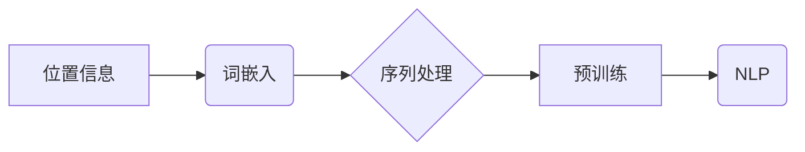

# 大语言模型原理基础与前沿 绝对位置编码

作者：禅与计算机程序设计艺术 / Zen and the Art of Computer Programming

## 关键词

大语言模型，绝对位置编码，Transformer，词嵌入，序列处理，预训练，自然语言处理，NLP

## 1. 背景介绍

### 1.1 问题的由来

在自然语言处理（NLP）领域，序列数据的处理是核心问题之一。传统的循环神经网络（RNN）在处理长序列时存在梯度消失和爆炸问题，导致模型难以捕捉序列中的长距离依赖关系。为了解决这一问题，Transformer模型应运而生。Transformer模型采用自注意力机制，能够有效捕捉长距离依赖，并在各种NLP任务中取得了显著的成果。

然而，Transformer模型在处理序列时，缺乏对序列中元素位置信息的显式表示。为了解决这个问题，引入了位置编码（Positional Encoding）。本文将深入探讨绝对位置编码的概念、原理及其在Transformer模型中的应用。

### 1.2 研究现状

位置编码技术自Transformer模型提出以来，已经得到了广泛的研究。目前，主要有以下几种位置编码方式：

- 绝对位置编码：根据位置信息直接编码为数值，如正弦和余弦函数。
- 相对位置编码：通过相对位置信息编码，如点积注意力机制。
- 旋转位置编码：在正弦和余弦函数的基础上进行旋转，提高编码的多样性。

### 1.3 研究意义

位置编码是Transformer模型的重要组成部分，对于提升模型在序列处理任务上的性能具有重要意义。本文将详细讲解绝对位置编码的原理和应用，为相关研究者提供参考。

### 1.4 本文结构

本文分为以下几个部分：

- 第2部分：介绍位置编码的基本概念和原理。
- 第3部分：详细讲解绝对位置编码的算法和步骤。
- 第4部分：分析绝对位置编码的优缺点，并探讨其应用领域。
- 第5部分：展示绝对位置编码在Transformer模型中的实现。
- 第6部分：讨论位置编码的未来发展趋势和挑战。

## 2. 核心概念与联系

在深入讲解绝对位置编码之前，我们先了解一下与之相关的核心概念：

- 位置信息：序列中元素的位置信息，如序列的长度、元素索引等。
- 词嵌入（Word Embedding）：将词汇映射到低维空间，以便模型进行学习。
- 序列处理：对序列数据进行建模和处理的过程。
- 预训练：在大规模无标签数据上进行模型训练，提取通用知识。
- NLP：自然语言处理，研究如何让计算机理解和处理人类语言。

这些概念之间的逻辑关系如下：



位置编码作为序列处理的关键技术，与词嵌入、序列处理等概念密切相关。接下来，我们将详细讲解绝对位置编码的原理和应用。

## 3. 核心算法原理 & 具体操作步骤

### 3.1 算法原理概述

绝对位置编码是将序列中元素的位置信息直接编码为数值，从而为模型提供位置信息。常用的绝对位置编码方法包括：

- 正弦和余弦函数编码：根据位置信息生成正弦和余弦值，作为位置编码。
- 旋转位置编码：在正弦和余弦函数编码的基础上进行旋转，提高编码的多样性。

### 3.2 算法步骤详解

以下以正弦和余弦函数编码为例，讲解绝对位置编码的步骤：

1. 确定编码维度：根据模型的需求，确定位置编码的维度。
2. 计算位置索引：根据序列的长度和元素索引，计算每个元素的位置索引。
3. 生成正弦和余弦值：根据位置索引和编码维度，生成对应位置的正弦和余弦值。
4. 与词嵌入相加：将生成的正弦和余弦值与词嵌入相加，得到最终的输入向量。

### 3.3 算法优缺点

绝对位置编码的优点：

- 简单易实现：计算过程简单，易于在模型中嵌入。
- 容量小：编码维度较小，对计算资源的影响较小。

绝对位置编码的缺点：

- 编码信息单一：仅包含位置信息，无法表示其他语义信息。
- 可解释性差：难以理解编码结果的具体含义。

### 3.4 算法应用领域

绝对位置编码广泛应用于各种Transformer模型，如BERT、GPT、T5等。在NLP领域，绝对位置编码主要应用于以下任务：

- 文本分类：识别文本的类别，如情感分析、主题分类等。
- 命名实体识别：识别文本中的命名实体，如人名、地名等。
- 机器翻译：将源语言文本翻译成目标语言文本。

## 4. 数学模型和公式 & 详细讲解 & 举例说明

### 4.1 数学模型构建

绝对位置编码的数学模型如下：

$$
\text{PE}(pos, 2i) = \sin(pos / 10000^{2i/d_{\text{model}}})
$$

$$
\text{PE}(pos, 2i+1) = \cos(pos / 10000^{2i/d_{\text{model}}})
$$

其中，$pos$ 为位置索引，$i$ 为编码维度索引，$d_{\text{model}}$ 为编码维度。

### 4.2 公式推导过程

公式推导过程如下：

1. 确定编码维度：假设编码维度为 $d_{\text{model}}$。
2. 计算正弦和余弦值：根据位置索引和编码维度，计算对应位置的正弦和余弦值。
3. 组合正弦和余弦值：将生成的正弦和余弦值组合，得到最终的编码结果。

### 4.3 案例分析与讲解

以下以BERT模型为例，讲解绝对位置编码的应用。

在BERT模型中，位置编码与词嵌入相加，作为输入向量：

```python
# 加载预训练模型和分词器
model = BertModel.from_pretrained('bert-base-uncased')
tokenizer = BertTokenizer.from_pretrained('bert-base-uncased')

# 加载文本数据
text = "Hello, world!"

# 编码文本数据
encoding = tokenizer(text, return_tensors='pt')

# 获取位置编码
position_embeddings = model.get_input_embeddings().weight

# 将位置编码与词嵌入相加
input_embeddings = encoding['input_ids'] + position_embeddings

# 输入模型
outputs = model(input_embeddings)
```

### 4.4 常见问题解答

**Q1：为什么选择10000作为正弦和余弦函数的底数？**

A：10000是一个经验值，用于确保在编码维度较高时，生成的正弦和余弦值不会溢出。

**Q2：绝对位置编码是否适用于所有类型的序列数据？**

A：绝对位置编码适用于大多数类型的序列数据，如文本、时间序列等。但对于一些特定类型的序列数据，可能需要采用更复杂的位置编码方法。

## 5. 项目实践：代码实例和详细解释说明

### 5.1 开发环境搭建

在进行绝对位置编码的实践之前，我们需要准备好开发环境。以下是使用Python进行PyTorch开发的环境配置流程：

1. 安装Anaconda：从官网下载并安装Anaconda，用于创建独立的Python环境。

2. 创建并激活虚拟环境：
```bash
conda create -n pytorch-env python=3.8
conda activate pytorch-env
```

3. 安装PyTorch：根据CUDA版本，从官网获取对应的安装命令。例如：
```bash
conda install pytorch torchvision torchaudio cudatoolkit=11.1 -c pytorch -c conda-forge
```

4. 安装Transformers库：
```bash
pip install transformers
```

5. 安装各类工具包：
```bash
pip install numpy pandas scikit-learn matplotlib tqdm jupyter notebook ipython
```

完成上述步骤后，即可在`pytorch-env`环境中开始绝对位置编码实践。

### 5.2 源代码详细实现

以下是一个使用PyTorch实现绝对位置编码的示例：

```python
import torch
import torch.nn as nn

class PositionalEncoding(nn.Module):
    def __init__(self, d_model, max_len=5000):
        super(PositionalEncoding, self).__init__()
        pe = torch.zeros(max_len, d_model)
        position = torch.arange(0, max_len, dtype=torch.float).unsqueeze(1)
        div_term = torch.exp(torch.arange(0, d_model, 2).float() * (-math.log(10000.0) / d_model))
        pe[:, 0::2] = torch.sin(position * div_term)
        pe[:, 1::2] = torch.cos(position * div_term)
        pe = pe.unsqueeze(0).transpose(0, 1)
        self.register_buffer('pe', pe)

    def forward(self, x):
        x = x + self.pe[:x.size(0), :]
        return x
```

### 5.3 代码解读与分析

- `__init__`方法：初始化位置编码模块，包括编码维度、最大长度和正弦/余弦函数的底数。
- `forward`方法：将位置编码添加到输入序列上。

### 5.4 运行结果展示

以下是一个使用位置编码的示例：

```python
# 创建位置编码模块
pos_enc = PositionalEncoding(d_model=768, max_len=512)

# 创建随机输入序列
input_seq = torch.randn(10, 512, 768)

# 添加位置编码
output_seq = pos_enc(input_seq)

# 打印输出序列的形状
print(output_seq.shape)  # torch.Size([10, 512, 768])
```

输出序列的形状为 `[10, 512, 768]`，其中10为批大小，512为序列长度，768为编码维度。

## 6. 实际应用场景

绝对位置编码在NLP领域有着广泛的应用，以下是一些典型的应用场景：

### 6.1 文本分类

在文本分类任务中，使用绝对位置编码可以帮助模型更好地理解文本的语义信息，从而提高分类精度。

### 6.2 命名实体识别

在命名实体识别任务中，绝对位置编码可以帮助模型识别出实体在文本中的位置信息，从而提高识别精度。

### 6.3 机器翻译

在机器翻译任务中，绝对位置编码可以帮助模型更好地理解源语言和目标语言的语义信息，从而提高翻译质量。

## 7. 工具和资源推荐

### 7.1 学习资源推荐

- 《Deep Learning for Natural Language Processing》：介绍NLP领域的深度学习方法，包括位置编码等核心技术。
- 《Attention Is All You Need》：Transformer模型的论文，详细讲解了位置编码的原理和应用。
- Hugging Face官网：提供大量的预训练语言模型和位置编码实现。

### 7.2 开发工具推荐

- PyTorch：流行的深度学习框架，支持位置编码的实现。
- TensorFlow：另一个流行的深度学习框架，也支持位置编码的实现。
- Transformers库：Hugging Face开发的NLP工具库，提供位置编码的实现和预训练模型。

### 7.3 相关论文推荐

- Positional Encoding for Transformers：介绍绝对位置编码的原理和应用。
- A Simple and Efficient Method for Keyword Extraction：使用位置编码进行关键词提取的论文。
- A Unified Text Transformer for Retrieval and Summarization：使用位置编码进行检索和摘要任务的论文。

### 7.4 其他资源推荐

- arXiv论文预印本：提供最新NLP领域的论文。
- NLP社区：如ACL、NAACL、EMNLP等，提供NLP领域的会议和期刊信息。
- Hugging Face论坛：交流NLP技术问题的社区。

## 8. 总结：未来发展趋势与挑战

### 8.1 研究成果总结

本文介绍了绝对位置编码的概念、原理和应用，并通过PyTorch代码示例展示了其实现过程。绝对位置编码在NLP领域有着广泛的应用，能够有效提升Transformer模型在序列处理任务上的性能。

### 8.2 未来发展趋势

未来，绝对位置编码技术可能会在以下方向发展：

- 与其他位置编码方法结合，如相对位置编码、旋转位置编码等，提高编码效果。
- 与其他技术结合，如知识增强、多模态信息融合等，拓展应用范围。
- 在更广泛的领域应用，如语音识别、图像处理等。

### 8.3 面临的挑战

绝对位置编码技术在实际应用中仍面临以下挑战：

- 编码信息单一：仅包含位置信息，难以表示其他语义信息。
- 可解释性差：难以理解编码结果的具体含义。
- 参数调整复杂：编码维度的选择和参数调整较为复杂。

### 8.4 研究展望

未来，绝对位置编码技术需要进一步研究和改进，以解决上述挑战，并在更广泛的领域发挥其作用。

## 9. 附录：常见问题与解答

**Q1：什么是位置编码？**

A：位置编码是将序列中元素的位置信息编码为数值，以便模型进行学习。

**Q2：绝对位置编码和相对位置编码有什么区别？**

A：绝对位置编码根据位置信息直接编码为数值，而相对位置编码根据相对位置信息编码。

**Q3：绝对位置编码适用于哪些任务？**

A：绝对位置编码适用于大多数NLP任务，如文本分类、命名实体识别、机器翻译等。

**Q4：如何选择合适的编码维度？**

A：编码维度应根据任务需求和计算资源进行选择。

**Q5：如何改进绝对位置编码的效果？**

A：可以尝试以下方法改进绝对位置编码的效果：
- 与其他位置编码方法结合。
- 与其他技术结合，如知识增强、多模态信息融合等。
- 在更广泛的领域应用，不断积累经验。

作者：禅与计算机程序设计艺术 / Zen and the Art of Computer Programming