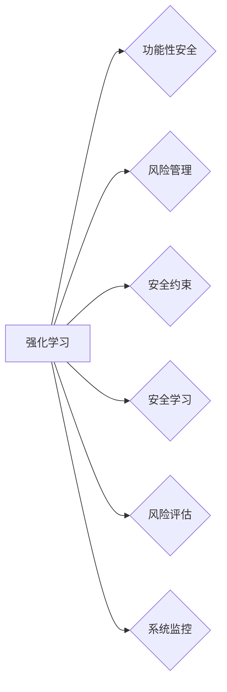

# 强化学习Reinforcement Learning的功能性安全与风险管理分析

作者：禅与计算机程序设计艺术 / Zen and the Art of Computer Programming

## 1. 背景介绍
### 1.1 问题的由来

随着人工智能技术的飞速发展，强化学习（Reinforcement Learning, RL）作为一种重要的机器学习方法，在自动驾驶、机器人控制、游戏AI等领域取得了显著的成果。然而，随着RL应用场景的不断拓展，其功能性安全与风险管理问题逐渐凸显。如何确保RL系统在各种复杂环境下稳定、可靠地运行，防止潜在的安全风险，成为了一个亟待解决的问题。

### 1.2 研究现状

近年来，国内外学者对RL的功能性安全与风险管理进行了广泛的研究，主要集中在以下几个方面：

- **安全约束引入与优化**：在RL算法中引入安全约束，确保系统在运行过程中满足特定的安全要求。
- **安全学习与决策**：在RL训练过程中，引导模型学习安全策略，避免出现危险行为。
- **风险评估与预测**：对RL系统的潜在风险进行评估和预测，提前采取预防措施。
- **系统监控与故障诊断**：对RL系统进行实时监控，及时发现并处理潜在的安全问题。

### 1.3 研究意义

研究RL的功能性安全与风险管理，对于以下方面具有重要意义：

- **提升RL应用的安全性和可靠性**：确保RL系统在各种复杂环境下稳定、可靠地运行，避免潜在的安全风险。
- **推动RL技术的应用落地**：解决RL应用中的安全性问题，消除应用者的后顾之忧，推动RL技术在各领域的应用落地。
- **促进人工智能伦理发展**：推动人工智能技术的安全、可靠、可控发展，符合人工智能伦理道德要求。

### 1.4 本文结构

本文将从以下方面对RL的功能性安全与风险管理进行分析：

- 核心概念与联系
- 核心算法原理与具体操作步骤
- 数学模型和公式
- 项目实践
- 实际应用场景
- 工具和资源推荐
- 未来发展趋势与挑战
- 总结

## 2. 核心概念与联系

为了更好地理解RL的功能性安全与风险管理，本节将介绍几个密切相关的核心概念：

- **强化学习（Reinforcement Learning, RL）**：一种通过与环境交互学习最优策略的机器学习方法。
- **功能性安全**：指系统在预期和意外环境下，始终满足规定的安全要求。
- **风险管理**：识别、评估和控制风险的过程，以降低风险发生的可能性和影响。
- **安全约束**：在RL训练过程中，对策略选择施加的限制条件，确保系统安全。
- **安全学习**：在RL训练过程中，引导模型学习安全策略，避免危险行为。
- **风险评估**：对RL系统的潜在风险进行评估，确定风险发生的可能性和影响程度。
- **系统监控**：对RL系统进行实时监控，及时发现并处理潜在的安全问题。

这些概念之间的关系如下：



可以看出，RL作为基础技术，与功能性安全、风险管理、安全约束、安全学习、风险评估和系统监控等多个方面密切相关。

## 3. 核心算法原理与具体操作步骤
### 3.1 算法原理概述

RL算法的核心思想是通过与环境交互，不断学习最优策略。具体而言，RL算法包括以下几个关键步骤：

1. **状态观察**：从环境中获取当前状态信息。
2. **动作选择**：根据当前状态选择一个动作。
3. **环境反馈**：根据动作选择的结果，获取奖励和下一状态。
4. **更新策略**：根据奖励和下一状态，更新策略，以获得更大的期望奖励。

### 3.2 算法步骤详解

RL算法的常见算法包括：

- **价值迭代法（Value Iteration）**：通过迭代更新值函数，最终得到最优策略。
- **策略迭代法（Policy Iteration）**：通过迭代更新策略，最终得到最优策略。
- **深度Q学习（Deep Q-Learning, DQN）**：使用深度神经网络逼近值函数，实现Q学习。
- **策略梯度法（Policy Gradient）**：直接优化策略参数，实现策略学习。
- **actor-critic方法**：结合价值迭代和策略梯度法，实现策略学习。

### 3.3 算法优缺点

以下是几种常见RL算法的优缺点：

- **价值迭代法**：
  - 优点：计算简单，容易理解。
  - 缺点：收敛速度慢，不适合高维问题。
- **策略迭代法**：
  - 优点：收敛速度快，适合高维问题。
  - 缺点：难以处理非平稳环境。
- **DQN**：
  - 优点：可以处理高维、连续状态空间。
  - 缺点：容易过估计、不稳定。
- **策略梯度法**：
  - 优点：直接优化策略参数，收敛速度快。
  - 缺点：需要计算策略梯度，计算复杂度高。
- **actor-critic方法**：
  - 优点：结合了价值迭代和策略梯度法的优点。
  - 缺点：需要同时优化值函数和策略，计算复杂度高。

### 3.4 算法应用领域

RL算法在以下领域有着广泛的应用：

- **游戏AI**：如国际象棋、围棋、电子竞技等。
- **机器人控制**：如无人机、自动驾驶、机器人路径规划等。
- **推荐系统**：如新闻推荐、电影推荐、商品推荐等。
- **金融领域**：如股票交易、风险管理、信贷评估等。

## 4. 数学模型和公式 & 详细讲解 & 举例说明
### 4.1 数学模型构建

RL算法的数学模型主要包括以下几个部分：

- **状态空间（State Space）**：所有可能的状态集合。
- **动作空间（Action Space）**：所有可能动作集合。
- **奖励函数（Reward Function）**：根据状态和动作，定义奖励值。
- **状态转移概率（State Transition Probability）**：从当前状态转移到下一状态的概率。
- **值函数（Value Function）**：衡量状态或策略的价值。

### 4.2 公式推导过程

以下以DQN算法为例，介绍RL算法的数学公式推导过程。

**DQN算法的核心思想**：

1. 使用深度神经网络逼近值函数 $Q(s,a)$。
2. 通过最大化期望奖励 $E[\sum_{t=0}^\infty \gamma^t r_t]$ 来训练神经网络。

**公式推导过程**：

1. **状态值函数**：

$$
Q(s,a) = \sum_{s',r} p(s'|s,a) \cdot (r + \gamma \cdot \max_{a'} Q(s',a')
$$

其中，$p(s'|s,a)$ 表示从状态 $s$ 执行动作 $a$ 转移到状态 $s'$ 的概率，$\gamma$ 表示折扣因子，$r$ 表示奖励值。

2. **目标值函数**：

$$
Q'(s,a) = \sum_{s',r} p(s'|s,a) \cdot (r + \gamma \cdot \max_{a'} Q'(s',a')
$$

其中，$Q'(s,a)$ 表示目标值函数。

3. **损失函数**：

$$
L = \frac{1}{2} \sum_{s,a} (Q(s,a) - Q'(s,a))^2
$$

其中，$L$ 表示损失函数。

4. **梯度下降**：

$$
\theta = \theta - \alpha \cdot \nabla_{\theta}L
$$

其中，$\theta$ 表示神经网络参数，$\alpha$ 表示学习率。

### 4.3 案例分析与讲解

以下以自动驾驶为例，讲解RL算法在功能性安全与风险管理中的应用。

**场景描述**：

自动驾驶汽车在行驶过程中，需要根据路况、环境等因素进行决策，如加速、减速、转弯等。

**安全约束**：

- 保持安全距离
- 遵守交通规则
- 避免碰撞

**奖励函数**：

- 安全行驶：奖励 +1
- 违反规则：奖励 -1
- 发生碰撞：奖励 -10

**状态和动作**：

- 状态：当前车辆位置、速度、前车距离、道路状况等
- 动作：加速、减速、转弯

**RL算法**：

使用DQN算法，将状态和动作输入神经网络，学习最优策略，使自动驾驶汽车在满足安全约束的前提下，最大化奖励。

### 4.4 常见问题解答

**Q1：如何设计合适的奖励函数**？

A：奖励函数的设计需要根据具体任务和场景进行调整。一般需要考虑以下因素：

- 目标：明确任务目标，如最大化奖励、最小化惩罚等。
- 约束：考虑安全约束和伦理道德约束。
- 特征：选择合适的特征，如状态、动作、奖励等。
- 评估：定期评估奖励函数的有效性，进行优化调整。

**Q2：如何处理高维状态空间**？

A：对于高维状态空间，可以使用以下方法：

- 状态压缩：将状态进行压缩，减少维度。
- 特征选择：选择对任务影响较大的特征。
- 神经网络：使用深度神经网络对状态进行降维。

**Q3：如何处理连续动作空间**？

A：对于连续动作空间，可以使用以下方法：

- 离散化：将连续动作空间离散化为有限个动作。
- 神经网络：使用神经网络逼近动作值函数。

## 5. 项目实践：代码实例和详细解释说明
### 5.1 开发环境搭建

为了进行RL项目实践，需要搭建以下开发环境：

- Python环境：安装Python 3.6及以上版本。
- 深度学习框架：安装TensorFlow或PyTorch。
- 代码编辑器：使用PyCharm、VS Code等代码编辑器。

### 5.2 源代码详细实现

以下是一个基于DQN算法的自动驾驶场景代码示例：

```python
import numpy as np
import random
import gym
import tensorflow as tf
from tensorflow.keras import layers, models

# 创建环境
env = gym.make('CartPole-v1')

# 定义DQN网络
class DQNetwork(tf.keras.Model):
    def __init__(self, state_dim, action_dim):
        super(DQNetwork, self).__init__()
        self.fc1 = layers.Dense(24, activation='relu')(layers.Input(state_dim))
        self.fc2 = layers.Dense(24, activation='relu')(self.fc1)
        self.fc3 = layers.Dense(action_dim, activation='linear')(self.fc2)

    def call(self, x):
        return self.fc3(x)

# 创建DQN代理
class DQNAgent:
    def __init__(self, state_dim, action_dim, learning_rate=0.001, gamma=0.99):
        self.state_dim = state_dim
        self.action_dim = action_dim
        self.learning_rate = learning_rate
        self.gamma = gamma
        self.model = DQNetwork(state_dim, action_dim)
        self.target_model = DQNetwork(state_dim, action_dim)
        self.target_model.set_weights(self.model.get_weights())

    def remember(self, state, action, reward, next_state, done):
        self.memory.append((state, action, reward, next_state, done))

    def act(self, state):
        state = tf.convert_to_tensor([state], dtype=tf.float32)
        act_values = self.model(state)[0]
        act_values = np.squeeze(act_values.numpy(), axis=0)
        act = np.argmax(act_values)
        return act

    def replay(self, batch_size):
        minibatch = random.sample(self.memory, batch_size)
        for state, action, reward, next_state, done in minibatch:
            target = reward
            if not done:
                target = (reward + self.gamma * np.amax(self.target_model(next_state)[0]))
            target_f = self.model(state)
            target_f[0][action] = target
            self.model.fit(state, target_f, epochs=1, verbose=0)
        if len(self.memory) > batch_size:
            self.memory = self.memory[-batch_size:]

    def load(self, name):
        self.model.load_weights(name)

    def save(self, name):
        self.model.save_weights(name)

# 训练DQN代理
agent = DQNAgent(state_dim=4, action_dim=2)
agent.load('dqn_cartpole.h5')

for i in range(1000):
    state = env.reset()
    state = np.reshape(state, [1, 4])
    for j in range(500):
        action = agent.act(state)
        next_state, reward, done, _ = env.step(action)
        next_state = np.reshape(next_state, [1, 4])
        agent.remember(state, action, reward, next_state, done)
        state = next_state
        if done:
            break
    agent.replay(32)

# 保存训练好的代理
agent.save('dqn_cartpole.h5')
```

### 5.3 代码解读与分析

以上代码实现了一个基于DQN算法的CartPole游戏环境。代码主要分为以下几个部分：

1. **环境创建**：使用gym库创建CartPole游戏环境。
2. **DQN网络定义**：定义DQN网络结构，包括输入层、隐藏层和输出层。
3. **DQNAgent类**：定义DQNAgent类，实现DQN算法的核心功能，包括记忆存储、选择动作、更新策略等。
4. **训练过程**：使用DQN代理训练CartPole游戏，观察训练效果。
5. **保存模型**：将训练好的模型保存到磁盘。

### 5.4 运行结果展示

运行以上代码，可以看到DQN代理在CartPole游戏环境中取得了较好的效果。通过不断的训练，代理可以逐渐学会稳定地控制CartPole，完成游戏目标。

## 6. 实际应用场景
### 6.1 自动驾驶

自动驾驶是RL技术的重要应用场景之一。通过将RL应用于自动驾驶，可以实现以下功能：

- 自动驾驶决策：根据路况、环境等因素，控制车辆进行加速、减速、转向等动作。
- 路径规划：规划行驶路径，避开障碍物，提高行驶安全性。
- 预测与规划：预测交通情况，规划合理的行驶路线。

### 6.2 机器人控制

RL技术可以应用于机器人控制，实现以下功能：

- 机器人路径规划：规划机器人运动路径，避开障碍物。
- 机器人避障：根据环境信息，指导机器人进行避障操作。
- 机器人协作：使多机器人协同完成任务。

### 6.3 游戏

RL技术可以应用于游戏，实现以下功能：

- 游戏AI：使游戏角色具有智能行为，提高游戏可玩性。
- 游戏平衡：根据游戏数据，调整游戏参数，保持游戏平衡。
- 游戏推荐：根据玩家行为，推荐合适的游戏。

### 6.4 未来应用展望

随着RL技术的不断发展，未来将会有更多场景应用RL技术，如：

- 供应链管理
- 医疗诊断
- 能源调度
- 金融风险管理

## 7. 工具和资源推荐
### 7.1 学习资源推荐

- 《Reinforcement Learning: An Introduction》
- 《Reinforcement Learning: Principles and Practice》
- 《Deep Reinforcement Learning》
- TensorFlow官方网站：https://www.tensorflow.org
- PyTorch官方网站：https://pytorch.org

### 7.2 开发工具推荐

- TensorFlow
- PyTorch
- gym：https://gym.openai.com
- stable-baselines：https://github.com/DLR-RM/stable-baselines

### 7.3 相关论文推荐

- Q-Learning (Watkins and Dayan, 1992)
- Value Iteration (Bellman, 1957)
- Policy Iteration (Bellman, 1957)
- Deep Q-Network (Mnih et al., 2013)
- Asynchronous Advantage Actor-Critic (A3C) (Mnih et al., 2016)
- Proximal Policy Optimization (PPO) (Schulman et al., 2017)
- Soft Actor-Critic (SAC) (Haarnoja et al., 2018)

### 7.4 其他资源推荐

- OpenAI：https://openai.com
- DeepMind：https://deepmind.com
- ARXIV：https://arxiv.org

## 8. 总结：未来发展趋势与挑战
### 8.1 研究成果总结

本文对RL的功能性安全与风险管理进行了全面分析，从核心概念、算法原理、数学模型、实际应用等方面进行了详细阐述。通过分析，可以看出，RL在功能性安全与风险管理方面具有巨大的应用潜力。

### 8.2 未来发展趋势

未来，RL在功能性安全与风险管理方面将呈现以下发展趋势：

- **安全约束引入与优化**：引入更加严格的安全约束，确保系统在运行过程中满足规定的安全要求。
- **安全学习与决策**：引导模型学习更加安全、可靠的策略，避免出现危险行为。
- **风险评估与预测**：对RL系统的潜在风险进行更加精确的评估和预测。
- **系统监控与故障诊断**：对RL系统进行更加有效的监控和故障诊断。

### 8.3 面临的挑战

尽管RL在功能性安全与风险管理方面取得了显著成果，但仍面临着以下挑战：

- **安全约束的建模**：如何准确、全面地描述安全约束，是一个需要解决的重要问题。
- **安全学习的效率**：如何提高安全学习的效率，是一个需要解决的问题。
- **风险评估与预测的准确性**：如何提高风险评估与预测的准确性，是一个需要解决的问题。
- **系统监控与故障诊断的实时性**：如何提高系统监控与故障诊断的实时性，是一个需要解决的问题。

### 8.4 研究展望

未来，RL在功能性安全与风险管理方面的研究将朝着以下方向发展：

- **安全约束建模**：研究更加准确、全面的安全约束建模方法。
- **安全学习与决策**：研究更加高效、可靠的安全学习与决策方法。
- **风险评估与预测**：研究更加精确、全面的风险评估与预测方法。
- **系统监控与故障诊断**：研究更加实时、有效的系统监控与故障诊断方法。

相信随着研究的不断深入，RL在功能性安全与风险管理方面的应用将得到更加广泛的推广，为人类社会的安全、稳定发展贡献力量。

## 9. 附录：常见问题与解答

**Q1：什么是功能性安全？**

A：功能性安全是指系统在预期和意外环境下，始终满足规定的安全要求。

**Q2：什么是风险管理？**

A：风险管理是指识别、评估和控制风险的过程，以降低风险发生的可能性和影响。

**Q3：如何保证RL系统的功能性安全？**

A：可以通过以下方法保证RL系统的功能性安全：

- 引入安全约束
- 设计安全策略
- 进行风险评估与预测
- 实时监控系统运行状态

**Q4：如何降低RL系统的风险？**

A：可以通过以下方法降低RL系统的风险：

- 优化算法设计
- 优化训练过程
- 优化系统架构
- 加强系统测试

**Q5：如何评估RL系统的安全性？**

A：可以通过以下方法评估RL系统的安全性：

- 进行安全测试
- 进行风险评估
- 进行安全审计
- 进行专家评估

通过以上解答，相信读者对RL的功能性安全与风险管理有了更加深入的了解。在实际应用中，需要根据具体场景和需求，综合考虑各种因素，确保RL系统的安全性和可靠性。