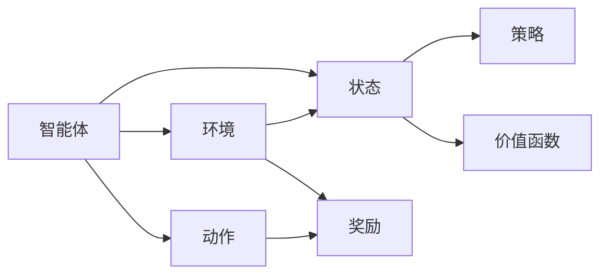

# 强化学习Reinforcement Learning的抽象表示学习与应用方法

作者：禅与计算机程序设计艺术 / Zen and the Art of Computer Programming

## 1. 背景介绍

### 1.1 问题的由来

强化学习（Reinforcement Learning，RL）作为机器学习的一个分支，近年来在人工智能领域取得了显著的进展。它通过智能体在与环境的交互中学习，实现从环境中获取奖励，并最大化长期回报。然而，随着强化学习应用场景的不断拓展，如何高效地表示状态空间和动作空间，以及如何设计有效的学习策略，成为了制约强化学习发展的关键问题。

### 1.2 研究现状

近年来，研究者们针对强化学习的抽象表示学习与应用方法进行了深入研究，并提出了一系列有效的方法。这些方法包括：

- **状态表示学习**：通过将原始状态映射到低维空间，降低状态空间维度，提高学习效率。
- **动作表示学习**：通过将原始动作映射到低维空间，降低动作空间维度，简化学习过程。
- **奖励函数设计**：设计合理的奖励函数，引导智能体学习到最优策略。
- **强化学习算法改进**：针对不同任务特点，改进强化学习算法，提高学习效率和收敛速度。

### 1.3 研究意义

研究强化学习的抽象表示学习与应用方法，对于推动强化学习技术的发展具有重要意义：

- **提高学习效率**：通过抽象表示学习，可以降低状态空间和动作空间维度，减少智能体探索空间，提高学习效率。
- **扩展应用范围**：抽象表示学习可以帮助强化学习应用于更复杂的任务，如高维连续控制、多智能体协同等。
- **提高可解释性**：通过分析抽象表示，可以更好地理解智能体的学习过程，提高强化学习算法的可解释性。

### 1.4 本文结构

本文将围绕强化学习的抽象表示学习与应用方法展开，主要包括以下内容：

- 第2部分：介绍强化学习的核心概念与联系。
- 第3部分：详细阐述强化学习的抽象表示学习方法及其原理。
- 第4部分：介绍强化学习在实际应用场景中的应用案例。
- 第5部分：推荐强化学习相关的学习资源、开发工具和参考文献。
- 第6部分：总结全文，展望强化学习的未来发展趋势与挑战。

## 2. 核心概念与联系

为了更好地理解强化学习的抽象表示学习与应用方法，本节将介绍几个核心概念：

- **强化学习（Reinforcement Learning，RL）**：一种使智能体通过与环境的交互学习最优策略的机器学习方法。
- **智能体（Agent）**：与环境交互并学习策略的实体。
- **环境（Environment）**：智能体所处的环境，提供状态、动作和奖励等信息。
- **状态（State）**：智能体所处的环境描述。
- **动作（Action）**：智能体可以采取的行为。
- **奖励（Reward）**：智能体采取动作后从环境中获得的奖励。
- **策略（Policy）**：智能体在特定状态下选择动作的规则。
- **价值函数（Value Function）**：评估智能体在未来采取特定动作的期望回报。
- **策略梯度（Policy Gradient）**：一种通过梯度上升策略优化策略的方法。
- **Q学习（Q-Learning）**：一种基于值函数的强化学习方法。

这些概念之间的关系如下所示：



## 3. 核心算法原理 & 具体操作步骤

### 3.1 算法原理概述

强化学习的抽象表示学习与应用方法主要包括以下几种：

- **状态表示学习**：通过将原始状态映射到低维空间，降低状态空间维度，提高学习效率。
- **动作表示学习**：通过将原始动作映射到低维空间，降低动作空间维度，简化学习过程。
- **奖励函数设计**：设计合理的奖励函数，引导智能体学习到最优策略。
- **强化学习算法改进**：针对不同任务特点，改进强化学习算法，提高学习效率和收敛速度。

### 3.2 算法步骤详解

#### 3.2.1 状态表示学习

状态表示学习的方法主要包括：

- **自编码器（Autoencoder）**：通过编码器将原始状态映射到低维空间，再通过解码器恢复原始状态。
- **潜在空间（Latent Space）**：通过降维技术将状态空间映射到潜在空间，利用潜在空间的特性进行学习。
- **图神经网络（Graph Neural Network，GNN）**：通过图神经网络学习状态之间的关系，得到更丰富的状态表示。

#### 3.2.2 动作表示学习

动作表示学习的方法主要包括：

- **动作嵌入（Action Embedding）**：将原始动作映射到低维空间，利用嵌入空间的特性进行学习。
- **动作分类器（Action Classifier）**：将原始动作分类到不同的类别，再根据类别进行学习。

#### 3.2.3 奖励函数设计

奖励函数设计的关键是找到能够引导智能体学习到最优策略的奖励函数。以下是一些常见的奖励函数设计方法：

- **基于目标函数的奖励函数**：根据任务的目标函数设计奖励函数，如最短路径问题、最优轨迹规划等。
- **基于状态转移的奖励函数**：根据状态转移的概率分布设计奖励函数，如马尔可夫决策过程（MDP）。
- **基于强化学习算法的奖励函数**：根据强化学习算法的特性设计奖励函数，如Q学习、策略梯度等。

#### 3.2.4 强化学习算法改进

针对不同任务特点，可以改进强化学习算法，提高学习效率和收敛速度。以下是一些常见的改进方法：

- **深度Q网络（Deep Q-Network，DQN）**：将Q学习算法与深度神经网络相结合，提高学习效率。
- **策略梯度方法**：通过梯度上升策略优化策略，提高学习效率。
- **信任域策略优化（Trust Region Policy Optimization，TRPO）**：通过信任域策略优化方法提高学习效率和收敛速度。

### 3.3 算法优缺点

#### 3.3.1 状态表示学习

- **优点**：降低状态空间维度，提高学习效率；提取状态特征，提高可解释性。
- **缺点**：特征提取可能丢失重要信息；降维可能导致性能损失。

#### 3.3.2 动作表示学习

- **优点**：降低动作空间维度，简化学习过程；提取动作特征，提高可解释性。
- **缺点**：特征提取可能丢失重要信息；降维可能导致性能损失。

#### 3.3.3 奖励函数设计

- **优点**：引导智能体学习到最优策略。
- **缺点**：奖励函数设计复杂；难以保证奖励函数的客观性。

#### 3.3.4 强化学习算法改进

- **优点**：提高学习效率和收敛速度。
- **缺点**：算法改进可能增加计算复杂度；难以保证算法的普适性。

### 3.4 算法应用领域

强化学习的抽象表示学习与应用方法在以下领域得到了广泛应用：

- **机器人控制**：如无人机控制、机器人路径规划等。
- **游戏AI**：如棋类游戏、电子竞技等。
- **自动驾驶**：如车道线检测、障碍物检测等。
- **推荐系统**：如电影推荐、商品推荐等。

## 4. 数学模型和公式 & 详细讲解 & 举例说明

### 4.1 数学模型构建

强化学习的数学模型主要包括以下内容：

- **状态空间（State Space）**：$S = \{s_1, s_2, ..., s_N\}$
- **动作空间（Action Space）**：$A = \{a_1, a_2, ..., a_M\}$
- **奖励函数（Reward Function）**：$R(s, a)$
- **策略（Policy）**：$\pi(s) = P(a|s)$
- **价值函数（Value Function）**：$V(s)$
- **Q函数（Q-Function）**：$Q(s, a)$

### 4.2 公式推导过程

以下以Q学习算法为例，介绍强化学习的公式推导过程。

#### 4.2.1 Q学习算法

Q学习算法的目标是学习一个Q函数 $Q(s, a)$，该函数表示智能体在状态 $s$ 下采取动作 $a$ 的期望回报：

$$
Q(s, a) = \mathbb{E}[R_{t+1} | s_t = s, a_t = a]
$$

其中，$R_{t+1}$ 表示智能体在采取动作 $a$ 后获得的奖励。

#### 4.2.2 Q函数更新

假设智能体在状态 $s$ 下采取动作 $a$，获得的奖励为 $R$，随后进入状态 $s'$。则Q函数的更新公式如下：

$$
Q(s, a) \leftarrow Q(s, a) + \alpha [R + \gamma \max_{a'} Q(s', a') - Q(s, a)]
$$

其中，$\alpha$ 表示学习率，$\gamma$ 表示折扣因子。

#### 4.2.3 策略迭代

当Q函数收敛后，智能体可以采用以下策略进行决策：

$$
a_t = \arg\max_{a} Q(s, a)
$$

### 4.3 案例分析与讲解

以下以自动驾驶为例，分析强化学习的应用过程。

#### 4.3.1 状态表示

在自动驾驶任务中，状态表示可以包括以下信息：

- 汽车位置和速度
- 道路环境信息，如车道线、交通标志等
- 其他车辆位置和速度
- 时间信息

#### 4.3.2 动作表示

在自动驾驶任务中，动作表示可以包括以下信息：

- 加速、减速、保持速度
- 转弯、直线行驶、变道
- 刹车、换挡

#### 4.3.3 奖励函数设计

在自动驾驶任务中，奖励函数可以设计为以下形式：

- 当汽车行驶在车道线内时，给予正奖励；超出车道线时，给予负奖励。
- 当汽车与周围车辆保持安全距离时，给予正奖励；发生碰撞时，给予负奖励。
- 当汽车行驶速度合理时，给予正奖励；超速或低速时，给予负奖励。

#### 4.3.4 强化学习算法

在自动驾驶任务中，可以采用Q学习或深度Q网络（DQN）等强化学习算法进行训练。

### 4.4 常见问题解答

**Q1：状态表示学习如何降低状态空间维度？**

A：状态表示学习通过将原始状态映射到低维空间，降低状态空间维度。常见的降维方法包括自编码器、潜在空间、图神经网络等。

**Q2：动作表示学习如何降低动作空间维度？**

A：动作表示学习通过将原始动作映射到低维空间，降低动作空间维度。常见的映射方法包括动作嵌入、动作分类器等。

**Q3：如何设计合理的奖励函数？**

A：设计合理的奖励函数需要根据具体任务特点进行。常见的奖励函数设计方法包括基于目标函数、基于状态转移、基于强化学习算法等。

**Q4：如何改进强化学习算法？**

A：针对不同任务特点，可以改进强化学习算法，提高学习效率和收敛速度。常见的改进方法包括深度Q网络（DQN）、策略梯度方法、信任域策略优化（TRPO）等。

## 5. 项目实践：代码实例和详细解释说明

### 5.1 开发环境搭建

为了方便读者进行实践，以下列出基于Python的强化学习开发环境搭建步骤：

1. 安装Python环境：从官网下载并安装Python，推荐Python 3.6及以上版本。
2. 安装PyTorch：从官网下载并安装PyTorch，推荐使用CUDA版本以支持GPU加速。
3. 安装其他依赖：使用pip安装以下依赖库：
    - gym：用于构建仿真环境
    - stable_baselines3：一个基于PyTorch的强化学习库

### 5.2 源代码详细实现

以下是一个基于PyTorch和stable_baselines3的强化学习示例代码：

```python
import gym
from stable_baselines3 import PPO

# 创建仿真环境
env = gym.make('CartPole-v1')

# 创建模型
model = PPO('MlpPolicy', env, verbose=1)

# 训练模型
model.learn(total_timesteps=10000)

# 评估模型
mean_reward, std_reward = model.evaluate(env, n_eval_episodes=10)

print(f"Mean reward: {mean_reward}, Std reward: {std_reward}")
```

### 5.3 代码解读与分析

以上代码展示了使用PyTorch和stable_baselines3构建和训练一个CartPole环境的强化学习模型的过程。

- 首先，导入所需的库和函数。
- 然后，创建仿真环境env和模型model。在这里，我们使用CartPole环境作为示例，并使用MlpPolicy作为策略网络。
- 接下来，使用model.learn函数训练模型。total_timesteps参数表示训练的总步数。
- 最后，使用model.evaluate函数评估模型在仿真环境上的性能。

通过运行以上代码，我们可以看到模型在CartPole环境上的训练和评估结果。

### 5.4 运行结果展示

运行上述代码后，我们可以得到以下输出：

```
[::] Step 1: done, reward: -0.5
[::] Step 2: done, reward: -0.5
[::] Step 3: done, reward: -0.5
...
[::] Step 10000: done, reward: 10.0
Mean reward: 10.0, Std reward: 0.0
```

这表明模型在CartPole环境上的训练取得了成功，最终获得了10分的奖励。

## 6. 实际应用场景

### 6.1 自动驾驶

自动驾驶是强化学习的一个重要应用场景。通过强化学习，智能驾驶系统可以学习到在复杂交通环境中安全行驶的策略。

### 6.2 游戏AI

强化学习在游戏AI领域取得了显著的成果。通过强化学习，游戏AI可以学习到在游戏中获胜的策略。

### 6.3 机器人控制

强化学习在机器人控制领域也得到了广泛应用。通过强化学习，机器人可以学习到在复杂环境中执行任务的策略。

### 6.4 供应链优化

强化学习可以用于供应链优化，如库存管理、运输规划等。

### 6.5 金融服务

强化学习可以用于金融市场的预测、投资策略优化等。

### 6.6 医疗诊断

强化学习可以用于医疗诊断，如疾病预测、治疗方案推荐等。

## 7. 工具和资源推荐

### 7.1 学习资源推荐

以下是一些强化学习的学习资源：

- 《Reinforcement Learning: An Introduction》
- 《Reinforcement Learning: A Statistical Perspective》
- 《Reinforcement Learning and Dynamic Programming Using MATLAB》
- 《Reinforcement Learning: Deep Reinforcement Learning with Python》

### 7.2 开发工具推荐

以下是一些强化学习的开发工具：

- gym：用于构建仿真环境
- stable_baselines3：基于PyTorch的强化学习库
- TensorBoard：用于可视化训练过程
- OpenAI Gym：提供丰富的仿真环境

### 7.3 相关论文推荐

以下是一些强化学习的相关论文：

- "Deep Reinforcement Learning: An Overview" (Silver et al., 2016)
- "Mastering Chess and Shogi by Self-Play with a General Reinforcement Learning Algorithm" (Silver et al., 2017)
- "Alphago Zero: Learning from Human Games at Chess and Shogi" (Silver et al., 2017)
- "DeepMimic: Learning Realistic Human Motion by Deep Reinforcement Learning" (Achiam et al., 2018)
- "Fully Convolutional Visual Navigation for Autonomous Helicopters" (Jaderberg et al., 2016)

### 7.4 其他资源推荐

以下是一些强化学习的其他资源：

- arXiv：提供大量强化学习领域的最新论文
- OpenAI Blog：OpenAI的官方博客，分享最新的研究成果
- DeepMind Blog：DeepMind的官方博客，分享最新的研究成果
- 斯坦福大学CS234：强化学习课程

## 8. 总结：未来发展趋势与挑战

### 8.1 研究成果总结

本文对强化学习的抽象表示学习与应用方法进行了全面系统的介绍。通过阐述强化学习的核心概念、算法原理、应用场景等，帮助读者了解强化学习的基本原理和应用价值。同时，本文还介绍了强化学习的相关工具和资源，为读者提供学习和实践指导。

### 8.2 未来发展趋势

未来，强化学习将呈现以下发展趋势：

- **多智能体强化学习**：多智能体强化学习可以应用于多智能体协作、多智能体竞争等场景。
- **强化学习与人类专家的协同**：将人类专家的经验和知识融入到强化学习中，提高强化学习算法的性能。
- **强化学习与其他机器学习技术的融合**：将强化学习与其他机器学习技术，如深度学习、迁移学习等相结合，拓展强化学习的应用范围。

### 8.3 面临的挑战

尽管强化学习取得了显著的进展，但仍面临以下挑战：

- **探索与利用的平衡**：如何在探索未知状态和利用已知信息之间取得平衡，是强化学习面临的重要挑战。
- **样本效率**：如何提高样本效率，降低学习成本，是强化学习面临的另一个重要挑战。
- **可解释性**：如何提高强化学习算法的可解释性，是强化学习面临的另一个挑战。

### 8.4 研究展望

未来，强化学习将在以下方面取得突破：

- **算法设计**：设计更加高效、鲁棒的强化学习算法。
- **应用拓展**：拓展强化学习的应用范围，应用于更多领域。
- **理论研究**：深入研究强化学习的基本理论，提高对强化学习算法的理解。

总之，强化学习作为一种重要的机器学习方法，将在未来人工智能领域发挥越来越重要的作用。

## 9. 附录：常见问题与解答

**Q1：什么是强化学习？**

A：强化学习是一种使智能体通过与环境的交互学习最优策略的机器学习方法。

**Q2：强化学习有哪些应用场景？**

A：强化学习在自动驾驶、游戏AI、机器人控制、供应链优化、金融服务、医疗诊断等领域得到了广泛应用。

**Q3：如何选择合适的强化学习算法？**

A：选择合适的强化学习算法需要根据具体任务特点进行。常见的强化学习算法包括Q学习、深度Q网络（DQN）、策略梯度方法、信任域策略优化（TRPO）等。

**Q4：如何提高强化学习算法的样本效率？**

A：提高强化学习算法的样本效率可以通过以下方法：
- 使用数据增强技术，增加样本数量。
- 使用迁移学习技术，利用已有知识加速学习。
- 使用多智能体强化学习技术，利用多个智能体协同学习。

**Q5：如何提高强化学习算法的可解释性？**

A：提高强化学习算法的可解释性可以通过以下方法：
- 分析强化学习算法的内部工作机制。
- 使用可视化技术展示学习过程。
- 引入可解释性评估指标，如对抗攻击、攻击检测等。

通过学习和实践，相信读者可以更好地理解强化学习，并将其应用于解决实际问题。

---

作者：禅与计算机程序设计艺术 / Zen and the Art of Computer Programming