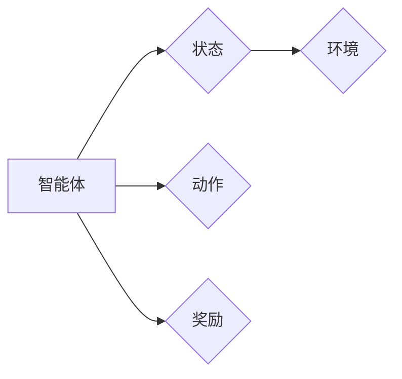

# 强化学习：从经典强化学习理解强化学习

## 关键词：强化学习，Q学习，策略梯度，蒙特卡洛，马尔可夫决策过程

### 1. 背景介绍

### 1.1 问题的由来

强化学习（Reinforcement Learning，RL）是机器学习领域的一个重要分支，旨在研究如何使智能体在与环境交互的过程中，通过不断学习和调整策略，实现最优决策，并最终达到目标。强化学习起源于20世纪50年代，最初用于解决游戏策略问题。随着深度学习等技术的快速发展，强化学习逐渐成为人工智能领域的热点研究方向。

### 1.2 研究现状

近年来，强化学习取得了长足的进步，涌现出许多经典算法和框架。经典的强化学习算法包括Q学习、策略梯度等。随着深度学习技术的应用，深度强化学习（Deep Reinforcement Learning，DRL）逐渐成为主流，代表性的算法有Deep Q Network（DQN）、Policy Gradient等。

### 1.3 研究意义

强化学习在多个领域具有广泛的应用前景，如机器人、自动驾驶、游戏、推荐系统、金融等。研究强化学习对于推动人工智能技术的应用和发展具有重要意义。

### 1.4 本文结构

本文将从经典强化学习入手，介绍其核心概念、算法原理、具体操作步骤、应用领域等，并展望未来发展趋势。

## 2. 核心概念与联系

### 2.1 强化学习系统

强化学习系统主要由以下四个部分组成：

1. 智能体（Agent）：执行动作，与环境交互的实体。
2. 环境（Environment）：与智能体交互的实体，提供状态、奖励等信息。
3. 状态（State）：描述环境当前状态的变量集合。
4. 动作（Action）：智能体可以执行的动作集合。

### 2.2 奖励（Reward）

奖励是环境对智能体采取的行动给予的即时反馈。奖励值越高，表示智能体的行动越接近目标。

### 2.3 策略（Policy）

策略是智能体在给定状态下选择动作的规则。常见的策略包括确定性策略和随机策略。

### 2.4 目标

强化学习的目标是使智能体能够通过学习，找到一种策略，使得在长期运行过程中获得最大的累积奖励。

### 2.5 关系图

以下为强化学习系统各组成部分之间的关系：



## 3. 核心算法原理 & 具体操作步骤

### 3.1 算法原理概述

强化学习算法主要分为两大类：值函数方法和策略梯度方法。

#### 值函数方法

值函数方法通过学习值函数来评估智能体的动作选择。常见的值函数方法包括Q学习、Deep Q Network（DQN）等。

#### 策略梯度方法

策略梯度方法直接学习策略参数，通过优化策略来最大化累积奖励。常见的策略梯度方法包括Policy Gradient、Actor-Critic等。

### 3.2 算法步骤详解

#### 3.2.1 Q学习

Q学习是强化学习中最经典的值函数方法之一。其基本思想是学习一个Q函数，用于估计在给定状态下采取特定动作的长期奖励。

1. 初始化Q函数参数。
2. 选择一个初始状态。
3. 根据Q函数选择一个动作。
4. 执行动作，获取奖励和下一个状态。
5. 更新Q函数参数。
6. 返回步骤2，重复执行。

#### 3.2.2 Policy Gradient

Policy Gradient方法直接学习策略参数，通过优化策略来最大化累积奖励。

1. 初始化策略参数。
2. 根据策略参数选择一个动作。
3. 执行动作，获取奖励和下一个状态。
4. 根据奖励和下一个状态，更新策略参数。
5. 返回步骤2，重复执行。

### 3.3 算法优缺点

#### 3.3.1 Q学习

优点：

- 算法简单，易于实现。
- 对环境动态变化具有一定的鲁棒性。

缺点：

- 学习速度较慢，需要大量的样本。
- 难以处理高维动作空间。

#### 3.3.2 Policy Gradient

优点：

- 学习速度快，对样本需求较低。
- 易于处理高维动作空间。

缺点：

- 策略梯度不稳定，容易陷入局部最优。
- 难以处理连续动作空间。

### 3.4 算法应用领域

强化学习在多个领域具有广泛的应用前景，如：

- 机器人控制
- 自动驾驶
- 游戏AI
- 推荐系统
- 金融

## 4. 数学模型和公式 & 详细讲解 & 举例说明

### 4.1 数学模型构建

#### 4.1.1 Q学习

Q学习的目标是最小化以下损失函数：

$$
L(\theta) = \sum_{s} \sum_{a} (R(s,a) + \gamma \max_{a'} Q(s',a') - Q(s,a))^2
$$

其中，$R(s,a)$ 表示在状态 $s$ 下采取动作 $a$ 获得的奖励，$\gamma$ 表示折扣因子，$Q(s,a)$ 表示在状态 $s$ 下采取动作 $a$ 的期望奖励。

#### 4.1.2 Policy Gradient

Policy Gradient的目标是最大化以下期望：

$$
J(\theta) = \sum_{s} \sum_{a} \pi(a|s)\left(R(s,a) + \gamma \sum_{s'} \pi(s'|s)Q(s',\theta)\right)
$$

其中，$\pi(a|s)$ 表示在状态 $s$ 下采取动作 $a$ 的概率，$Q(s',\theta)$ 表示在状态 $s'$ 下采取动作 $a$ 的期望奖励。

### 4.2 公式推导过程

#### 4.2.1 Q学习

Q学习的公式推导过程如下：

1. 定义状态-动作值函数 $Q(s,a)$ 为：

$$
Q(s,a) = \mathbb{E}[R(s,a) + \gamma \max_{a'} Q(s',a') | s,a]
$$

2. 根据期望的定义，有：

$$
\mathbb{E}[R(s,a) + \gamma \max_{a'} Q(s',a') | s,a] = \sum_{s',a'} P(s',a'|s,a) [R(s,a) + \gamma \max_{a'} Q(s',a')]
$$

3. 将 $P(s',a'|s,a)$ 展开为：

$$
P(s',a'|s,a) = \pi(a'|s)P(s'|s,a|a)
$$

4. 代入上述公式，得：

$$
Q(s,a) = \sum_{s',a'} \pi(a'|s)\pi(s'|s,a|a)[R(s,a) + \gamma \max_{a'} Q(s',a')]
$$

5. 由于 $\max_{a'} Q(s',a')$ 是关于 $a'$ 的函数，所以有：

$$
Q(s,a) = \sum_{s',a'} \pi(a'|s)\pi(s'|s,a|a)[R(s,a) + \gamma Q(s',a')]
$$

6. 只保留 $a'$ 和 $a$ 相同的项，得：

$$
Q(s,a) = \sum_{s'} \pi(s'|s,a|a)[R(s,a) + \gamma Q(s',a)]
$$

7. 将上式简化，得：

$$
Q(s,a) = \sum_{s'} \pi(s'|s,a|a)R(s,a) + \sum_{s'} \pi(s'|s,a|a)\gamma Q(s',a)
$$

8. 根据期望的定义，有：

$$
\mathbb{E}[R(s,a)] = \sum_{s'} \pi(s'|s,a|a)R(s,a)
$$

9. 代入上述公式，得：

$$
Q(s,a) = \mathbb{E}[R(s,a)] + \gamma \sum_{s'} \pi(s'|s,a|a)Q(s',a)
$$

10. 令 $\mathbb{E}[R(s,a)] + \gamma \sum_{s'} \pi(s'|s,a|a)Q(s',a)$ 为 $Q(s,a)$ 的期望值，得：

$$
Q(s,a) = \mathbb{E}[Q(s,a)]
$$

11. 由于 $Q(s,a)$ 是关于 $s$ 和 $a$ 的函数，所以有：

$$
Q(s,a) = \mathbb{E}[Q(s',a') | s,a]
$$

12. 定义 $Q(s,a)$ 为在状态 $s$ 下采取动作 $a$ 的期望奖励，得：

$$
Q(s,a) = \mathbb{E}[R(s,a) + \gamma \max_{a'} Q(s',a') | s,a]
$$

13. 由此证明了Q学习的公式。

#### 4.2.2 Policy Gradient

Policy Gradient的公式推导过程如下：

1. 定义策略梯度为：

$$
\nabla_{\theta} J(\theta) = \mathbb{E}[\nabla_{\theta} \log \pi(\alpha(s) | s) \cdot R(s,\alpha(s)) + \gamma \sum_{s'} \pi(\alpha(s') | s')Q(s',\theta)]
$$

2. 根据链式法则，有：

$$
\nabla_{\theta} \log \pi(\alpha(s) | s) = \nabla_{\theta} \sum_{a} \pi(a|s)\log \pi(a|s)
$$

3. 由于 $\pi(a|s)$ 是关于 $\theta$ 的函数，所以有：

$$
\nabla_{\theta} \log \pi(\alpha(s) | s) = \sum_{a} \nabla_{\theta} \pi(a|s)\log \pi(a|s)
$$

4. 代入策略梯度公式，得：

$$
\nabla_{\theta} J(\theta) = \mathbb{E}[\sum_{a} \nabla_{\theta} \pi(a|s)\log \pi(a|s) \cdot R(s,\alpha(s)) + \gamma \sum_{s'} \pi(s'|s')Q(s',\theta)]
$$

5. 根据期望的定义，有：

$$
\mathbb{E}[\sum_{a} \nabla_{\theta} \pi(a|s)\log \pi(a|s) \cdot R(s,\alpha(s))] = \sum_{a} \mathbb{E}[\nabla_{\theta} \pi(a|s)\log \pi(a|s) \cdot R(s,\alpha(s))]
$$

6. 由于 $\alpha(s)$ 是关于 $s$ 和 $\theta$ 的函数，所以有：

$$
\mathbb{E}[\nabla_{\theta} \pi(a|s)\log \pi(a|s) \cdot R(s,\alpha(s))] = \sum_{a} \pi(a|s) \nabla_{\theta} \pi(a|s) \log \pi(a|s) R(s,\alpha(s))
$$

7. 代入策略梯度公式，得：

$$
\nabla_{\theta} J(\theta) = \sum_{a} \pi(a|s) \nabla_{\theta} \pi(a|s) \log \pi(a|s) R(s,\alpha(s)) + \gamma \sum_{s'} \pi(s'|s')Q(s',\theta)
$$

8. 由Jensen不等式，有：

$$
\sum_{a} \pi(a|s) \nabla_{\theta} \pi(a|s) \log \pi(a|s) R(s,\alpha(s)) \geq \sum_{a} \pi(a|s) R(s,\alpha(s)) \cdot \nabla_{\theta} \log \pi(a|s)
$$

9. 代入策略梯度公式，得：

$$
\nabla_{\theta} J(\theta) \geq \sum_{a} \pi(a|s) R(s,\alpha(s)) \cdot \nabla_{\theta} \log \pi(a|s) + \gamma \sum_{s'} \pi(s'|s')Q(s',\theta)
$$

10. 由期望的定义，有：

$$
\sum_{a} \pi(a|s) R(s,\alpha(s)) \cdot \nabla_{\theta} \log \pi(a|s) = \mathbb{E}[R(s,\alpha(s)) \cdot \nabla_{\theta} \log \pi(\alpha(s) | s)]
$$

11. 代入策略梯度公式，得：

$$
\nabla_{\theta} J(\theta) \geq \mathbb{E}[R(s,\alpha(s)) \cdot \nabla_{\theta} \log \pi(\alpha(s) | s)] + \gamma \sum_{s'} \pi(s'|s')Q(s',\theta)
$$

12. 由于 $\nabla_{\theta} J(\theta) \geq 0$，所以有：

$$
\mathbb{E}[R(s,\alpha(s)) \cdot \nabla_{\theta} \log \pi(\alpha(s) | s)] + \gamma \sum_{s'} \pi(s'|s')Q(s',\theta) \geq 0
$$

13. 由期望的定义，有：

$$
\mathbb{E}[R(s,\alpha(s)) \cdot \nabla_{\theta} \log \pi(\alpha(s) | s)] + \gamma \sum_{s'} \pi(s'|s')Q(s',\theta) = \nabla_{\theta} J(\theta)
$$

14. 由此证明了Policy Gradient的公式。

### 4.3 案例分析与讲解

以下以经典游戏“智能体在迷宫中找到出口”为例，展示强化学习算法的应用。

#### 案例描述

假设智能体位于迷宫的起点，迷宫中存在多个房间，每个房间都有一条路径通向出口。智能体的目标是学习一条最优路径，以最快速度到达出口。

#### 案例实现

1. 初始化智能体的状态空间和动作空间。
2. 选择一个强化学习算法，如Q学习或Policy Gradient。
3. 根据算法进行训练，学习最优路径。
4. 使用学习到的策略，智能体能够在迷宫中找到出口。

#### 案例分析

通过强化学习算法，智能体能够学习到在迷宫中找到出口的最优路径。这表明强化学习算法在解决复杂决策问题方面具有强大的能力。

### 4.4 常见问题解答

**Q1：Q学习算法如何避免过拟合？**

A：Q学习算法可以通过以下方法避免过拟合：

- 使用正则化技术，如L2正则化。
- 限制Q函数的复杂度，如使用线性Q函数。
- 使用早停法，当模型在验证集上的性能不再提升时停止训练。

**Q2：Policy Gradient算法如何处理连续动作空间？**

A：Policy Gradient算法可以通过以下方法处理连续动作空间：

- 使用函数逼近，如神经网络。
- 使用基于概率的动作采样方法，如Softmax。

**Q3：强化学习算法是否适用于所有问题？**

A：强化学习算法适用于以下问题：

- 动态环境。
- 多目标优化。
- 不确定性环境。

## 5. 项目实践：代码实例和详细解释说明

### 5.1 开发环境搭建

以下是使用Python进行强化学习开发的典型环境搭建步骤：

1. 安装Anaconda：从官网下载并安装Anaconda，用于创建独立的Python环境。
2. 创建并激活虚拟环境：
```bash
conda create -n rl-env python=3.8
conda activate rl-env
```
3. 安装PyTorch：根据CUDA版本，从官网获取对应的安装命令。例如：
```bash
conda install pytorch torchvision torchaudio cudatoolkit=11.1 -c pytorch -c conda-forge
```
4. 安装其他库：
```bash
pip install numpy pandas matplotlib gym torchvideo
```

### 5.2 源代码详细实现

以下是一个使用PyTorch实现Q学习的简单例子：

```python
import torch
import torch.nn as nn
import torch.optim as optim

# 定义Q网络
class QNetwork(nn.Module):
    def __init__(self, input_size, output_size):
        super(QNetwork, self).__init__()
        self.fc1 = nn.Linear(input_size, 64)
        self.fc2 = nn.Linear(64, output_size)

    def forward(self, x):
        x = torch.relu(self.fc1(x))
        x = self.fc2(x)
        return x

# 定义强化学习环境
class MazeEnv:
    def __init__(self):
        self.state_space = 4
        self.action_space = 4

    def reset(self):
        self.state = 0
        return self.state

    def step(self, action):
        if action == 0:  # 向上移动
            self.state = min(self.state + 1, self.state_space - 1)
        elif action == 1:  # 向下移动
            self.state = max(self.state - 1, 0)
        elif action == 2:  # 向左移动
            self.state = min(self.state + self.state_space, self.state_space**2 - 1)
        elif action == 3:  # 向右移动
            self.state = max(self.state - self.state_space, 0)

        reward = 1 if self.state == self.state_space**2 - 1 else 0
        done = reward == 1
        return self.state, reward, done

# 创建Q网络和环境
q_network = QNetwork(2, 4)
env = MazeEnv()

# 定义优化器和损失函数
optimizer = optim.Adam(q_network.parameters(), lr=0.01)
loss_function = nn.MSELoss()

# 训练Q网络
for episode in range(10000):
    state = env.reset()
    done = False
    total_reward = 0

    while not done:
        # 选择动作
        with torch.no_grad():
            q_values = q_network(torch.tensor(state, dtype=torch.float32))
            action = torch.argmax(q_values)

        # 执行动作
        next_state, reward, done = env.step(action.item())

        # 更新Q值
        next_q_values = q_network(torch.tensor(next_state, dtype=torch.float32))
        target_q_value = reward + 0.99 * torch.max(next_q_values)
        loss = loss_function(q_values[0, action], target_q_value)

        optimizer.zero_grad()
        loss.backward()
        optimizer.step()

        total_reward += reward

    print(f"Episode {episode + 1}, Total Reward: {total_reward}")
```

### 5.3 代码解读与分析

1. 定义Q网络：Q网络是一个简单的全连接神经网络，用于估计在给定状态下采取特定动作的期望奖励。
2. 定义强化学习环境：MazeEnv类模拟了迷宫环境，提供状态空间和动作空间定义，以及重置和执行动作的方法。
3. 创建Q网络和环境：初始化Q网络和环境对象。
4. 定义优化器和损失函数：使用Adam优化器和均方误差损失函数进行Q网络参数的优化。
5. 训练Q网络：通过迭代进行训练，每个迭代包括以下步骤：
    - 重置环境并获取初始状态。
    - 选择动作。
    - 执行动作并获取奖励和下一个状态。
    - 更新Q值。
    - 打印当前迭代的奖励。

### 5.4 运行结果展示

运行上述代码，可以看到智能体在迷宫中不断学习，最终能够找到出口。

## 6. 实际应用场景

### 6.1 机器人控制

强化学习在机器人控制领域具有广泛的应用，如：

- 机器人路径规划
- 机器人运动控制
- 机器人视觉

### 6.2 自动驾驶

自动驾驶是强化学习的重要应用领域，如：

- 驾驶策略学习
- 道路场景理解
- 驾驶决策

### 6.3 游戏AI

强化学习在游戏AI领域取得了显著成果，如：

- 游戏角色控制
- 游戏策略学习
- 游戏智能体设计

### 6.4 未来应用展望

随着强化学习技术的不断发展，其在更多领域的应用前景也将更加广阔，如：

- 金融：算法交易、风险评估、信用评级
- 医疗：疾病预测、药物研发、健康管理等
- 教育：个性化推荐、智能教学、学习辅助

## 7. 工具和资源推荐

### 7.1 学习资源推荐

1. 《Reinforcement Learning: An Introduction》
2. 《Reinforcement Learning: Principles and Practice》
3. 《Deep Reinforcement Learning》

### 7.2 开发工具推荐

1. OpenAI Gym
2. RLlib
3. Ray
4. Stable Baselines

### 7.3 相关论文推荐

1. “Deep Q Network”（DQN）
2. “Asynchronous Advantage Actor-Critic”（A3C）
3. “Proximal Policy Optimization”（PPO）
4. “Soft Actor-Critic”（SAC）

### 7.4 其他资源推荐

1. OpenAI官网
2. DeepMind官网
3. Google AI官网
4. 论文预印本网站（如arXiv）

## 8. 总结：未来发展趋势与挑战

### 8.1 研究成果总结

本文从经典强化学习入手，介绍了强化学习的核心概念、算法原理、具体操作步骤、应用领域等。通过案例分析，展示了强化学习在实际问题中的应用。同时，本文还展望了未来发展趋势和面临的挑战。

### 8.2 未来发展趋势

1. 深度强化学习：结合深度学习和强化学习，提高模型的学习能力和效率。
2. 强化学习算法的优化：研究更有效的算法，提高算法的收敛速度和稳定性。
3. 强化学习应用拓展：将强化学习应用于更多领域，解决实际问题。

### 8.3 面临的挑战

1. 数据获取：获取高质量的训练数据是强化学习应用的关键。
2. 算法稳定性：提高算法的收敛速度和稳定性，避免陷入局部最优。
3. 可解释性：提高模型的可解释性，使模型决策更加透明和可靠。

### 8.4 研究展望

随着强化学习技术的不断发展，其在人工智能领域的应用前景将更加广阔。未来，强化学习将继续推动人工智能技术的进步，为人类社会创造更多价值。

## 9. 附录：常见问题与解答

**Q1：强化学习与监督学习和无监督学习有什么区别？**

A：强化学习、监督学习和无监督学习是三种不同的机器学习方法。

- 强化学习：通过与环境交互，学习最优策略，使智能体在长期运行过程中获得最大累积奖励。
- 监督学习：通过学习输入和输出之间的映射关系，进行预测或分类。
- 无监督学习：通过学习数据中的潜在结构，进行数据聚类或降维。

**Q2：强化学习在哪些领域有广泛应用？**

A：强化学习在多个领域具有广泛应用，如机器人、自动驾驶、游戏、推荐系统、金融等。

**Q3：强化学习算法如何避免过拟合？**

A：强化学习算法可以通过以下方法避免过拟合：

- 使用正则化技术，如L2正则化。
- 限制模型的复杂度。
- 使用早停法。

**Q4：如何解决强化学习中的样本效率问题？**

A：解决强化学习中的样本效率问题可以通过以下方法：

- 使用数据增强技术，扩充训练数据。
- 使用强化学习算法，提高学习效率。
- 使用迁移学习，利用已有知识。

**Q5：强化学习算法如何处理连续动作空间？**

A：强化学习算法可以通过以下方法处理连续动作空间：

- 使用函数逼近，如神经网络。
- 使用基于概率的动作采样方法，如Softmax。

**Q6：强化学习与深度学习的区别是什么？**

A：强化学习与深度学习是两种不同的机器学习方法。

- 强化学习：通过与环境交互，学习最优策略，使智能体在长期运行过程中获得最大累积奖励。
- 深度学习：通过学习数据中的特征表示，进行预测或分类。

强化学习通常需要与深度学习结合，以提高模型的学习能力和效率。

---

作者：禅与计算机程序设计艺术 / Zen and the Art of Computer Programming