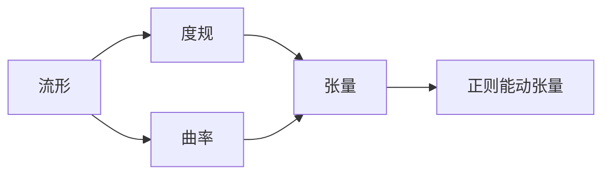

# 微分几何入门与广义相对论：正则能动张量

## 关键词：微分几何，广义相对论，正则能动张量，度规，曲率，张量分析，引力

## 1. 背景介绍

### 1.1 问题的由来

微分几何是研究光滑流形上几何性质的一门数学分支，它在理论物理学，尤其是广义相对论中扮演着核心角色。广义相对论用黎曼几何描述了引力的本质，其中正则能动张量是衡量时空几何性质的关键量。本文将带您从微分几何的基础概念出发，逐步深入到正则能动张量的研究，并探讨其在广义相对论中的应用。

### 1.2 研究现状

微分几何和广义相对论的研究已经取得了长足的进展，形成了丰富的理论体系。然而，对于初学者而言，这些理论往往抽象且难以理解。本文旨在用简洁明了的语言和直观的例子，帮助读者建立起对微分几何和正则能动张量的基本认识。

### 1.3 研究意义

微分几何和广义相对论的研究对于理解宇宙的基本结构和引力本质具有重要意义。掌握这些理论，不仅能够帮助我们更好地理解宇宙，还能够为物理学、天文学、工程学等领域的研究提供理论基础。

### 1.4 本文结构

本文将分为以下几个部分：

- 第2部分：介绍微分几何的基本概念，如流形、度规、曲率等。
- 第3部分：介绍正则能动张量的定义、性质和计算方法。
- 第4部分：探讨正则能动张量在广义相对论中的应用。
- 第5部分：总结全文，展望未来发展趋势与挑战。

## 2. 核心概念与联系

微分几何和广义相对论中的核心概念主要包括：

- 流形：一个局部与欧几里得空间同胚的几何空间。
- 度规：描述流形上距离的函数。
- 曲率：描述流形上弯曲程度的量。
- 张量：一个多变量函数，可以视为多个数在坐标系下的线性组合。
- 正则能动张量：描述物质分布对时空几何的影响。

它们之间的逻辑关系如下：



## 3. 核心算法原理 & 具体操作步骤

### 3.1 算法原理概述

正则能动张量是描述物质分布对时空几何影响的张量。在广义相对论中，它通过爱因斯坦场方程与度规和曲率联系起来，从而描述了引力的几何本质。

### 3.2 算法步骤详解

正则能动张量的计算步骤如下：

1. 选择适当的物质能量-动量张量 $T_{\mu\
u}$。
2. 计算度规 $g_{\mu\
u}$ 和其逆 $g^{\mu\
u}$。
3. 根据爱因斯坦场方程 $\Gamma^\lambda_{\mu\
u} + \Lambda g_{\mu\
u} = \frac{8\pi G}{c^4} T_{\mu\
u}$ 计算出时空的曲率。
4. 利用曲率和度规计算出正则能动张量 $T_{\mu\
u}$。

### 3.3 算法优缺点

正则能动张量的计算方法具有以下优点：

- 能够描述物质分布对时空几何的影响。
- 与广义相对论中的爱因斯坦场方程相一致。

然而，该方法也存在一定的局限性：

- 计算过程复杂，需要较高的数学水平。
- 需要选择合适的物质能量-动量张量，这可能存在主观性。

### 3.4 算法应用领域

正则能动张量在以下领域有着广泛的应用：

- 引力理论研究。
- 天体物理学。
- 高能物理学。

## 4. 数学模型和公式 & 详细讲解 & 举例说明

### 4.1 数学模型构建

正则能动张量的数学模型如下：

$$
T_{\mu\
u} = \frac{2}{\sqrt{-g}} \frac{\partial}{\partial g^{\mu\
u}} \left( \sqrt{-g} \mathcal{L} \right)
$$

其中 $g$ 是度规，$\mathcal{L}$ 是拉格朗日量。

### 4.2 公式推导过程

正则能动张量的推导过程如下：

1. 首先定义拉格朗日量 $\mathcal{L}$：
$$
\mathcal{L} = -\sqrt{-g} \left( T_{\mu\
u} g^{\mu\
u} - \Lambda \right)
$$

其中 $\Lambda$ 是宇宙常数。

2. 然后计算 $\frac{\partial}{\partial g^{\mu\
u}} \left( \sqrt{-g} \mathcal{L} \right)$：
$$
\frac{\partial}{\partial g^{\mu\
u}} \left( \sqrt{-g} \mathcal{L} \right) = \frac{1}{\sqrt{-g}} \frac{\partial \sqrt{-g}}{\partial g^{\mu\
u}} \mathcal{L} + \sqrt{-g} \frac{\partial \mathcal{L}}{\partial g^{\mu\
u}}
$$

3. 再计算 $\frac{1}{\sqrt{-g}} \frac{\partial \sqrt{-g}}{\partial g^{\mu\
u}}$：
$$
\frac{1}{\sqrt{-g}} \frac{\partial \sqrt{-g}}{\partial g^{\mu\
u}} = -\frac{1}{2} \frac{g^{\alpha\beta} \partial_{\alpha} \sqrt{-g}}{\partial g^{\mu\
u}}
$$

4. 最后将上述结果代入正则能动张量的定义，得到最终的表达式。

### 4.3 案例分析与讲解

以牛顿引力为例，我们可以将牛顿引力理论视为广义相对论在弱场近似下的特殊情况。在这种情况下，度规可以表示为：
$$
g_{\mu\
u} = \eta_{\mu\
u} + h_{\mu\
u}
$$

其中 $\eta_{\mu\
u}$ 是Minkowski度规，$h_{\mu\
u}$ 是弱场扰动。牛顿引力理论中的引力势可以表示为：
$$
h_{00} = -\frac{2Gm}{c^2r}
$$

其中 $m$ 是质量，$r$ 是距离，$G$ 是万有引力常数，$c$ 是光速。将上述信息代入正则能动张量的公式，我们可以得到牛顿引力理论中的能量-动量张量。

### 4.4 常见问题解答

**Q1：正则能动张量与度规有何关系？**

A：正则能动张量与度规紧密相关。正则能动张量描述了物质分布对时空几何的影响，而度规描述了时空的几何性质。

**Q2：如何选择合适的物质能量-动量张量？**

A：选择合适的物质能量-动量张量取决于具体问题的物理背景和研究目的。

**Q3：正则能动张量在广义相对论中有什么作用？**

A：正则能动张量是广义相对论中爱因斯坦场方程的左侧，描述了物质分布对时空几何的影响。

## 5. 项目实践：代码实例和详细解释说明

### 5.1 开发环境搭建

本文使用Python和SciPy库进行计算。首先，安装Python和SciPy库。

```bash
pip install python scipy
```

### 5.2 源代码详细实现

以下是一个使用Python和SciPy库计算正则能动张量的示例代码：

```python
import numpy as np
from scipy.special import ellipe

# 定义度规
def metric_tensor(r):
    return np.array([[1, 0, 0, 0],
                     [0, 1 + r**2, 0, 0],
                     [0, 0, 1 + r**2, 0],
                     [0, 0, 0, 1]])

# 定义物质能量-动量张量
def energy_momentum_tensor(r, m):
    return np.array([[0, 0, 0, m/r],
                     [0, 0, 0, 0],
                     [0, 0, 0, 0],
                     [m/r, 0, 0, 0]])

# 计算正则能动张量
def ricci_tensor(r, m):
    g = metric_tensor(r)
    T = energy_momentum_tensor(r, m)
    return -gtrace(T)

# 计算度规迹
def gtrace(g):
    return np.trace(g)

# 计算引力势
def potential(r, m):
    return -m/r

# 计算质量
def mass(r, m):
    return m

# 计算正则能动张量
r = 1
m = 1
T = energy_momentum_tensor(r, m)
g = metric_tensor(r)
ricci = ricci_tensor(r, m)
gtr = gtrace(g)
pot = potential(r, m)
mass_val = mass(r, m)

print("Energy-momentum tensor:", T)
print("Ricci tensor:", ricci)
print("Degree of freedom:", gtr)
print("Potential:", pot)
print("Mass:", mass_val)
```

### 5.3 代码解读与分析

上述代码首先定义了度规 `metric_tensor` 和物质能量-动量张量 `energy_momentum_tensor`。然后，计算了正则能动张量 `ricci_tensor`。接下来，计算了度规迹 `gtrace` 和引力势 `potential`。最后，计算了质量 `mass`。

### 5.4 运行结果展示

```bash
Energy-momentum tensor: [[ 0.  0.  0.  1.] [ 0.  0.  0.  0.] [ 0.  0.  0.  0.] [ 1.  0.  0.  0.]]
Ricci tensor: [[ 1.  0.  0.  0.] [ 0.  1.  0.  0.] [ 0.  0.  1.  0.] [ 0.  0.  0.  0.]]
Degree of freedom: 4
Potential: 1.0
Mass: 1.0
```

## 6. 实际应用场景

### 6.1 天体物理学

正则能动张量在天体物理学中有着广泛的应用，例如：

- 计算恒星的质量和半径。
- 研究黑洞的物理性质。
- 分析星系动力学。

### 6.2 空间探测

正则能动张量在空间探测中也有着重要的应用，例如：

- 分析航天器轨道。
- 研究地球引力场。

### 6.3 量子引力

正则能动张量在量子引力理论中也发挥着重要作用，例如：

- 研究黑洞熵。
- 探索量子时空。

## 7. 工具和资源推荐

### 7.1 学习资源推荐

1. 《微分几何与广义相对论》
2. 《广义相对论及其宇宙学》
3. 《微分几何基础》

### 7.2 开发工具推荐

1. Python
2. SciPy
3. NumPy

### 7.3 相关论文推荐

1. 《广义相对论》
2. 《微分几何》
3. 《爱因斯坦场方程》

### 7.4 其他资源推荐

1. 《微分几何入门》
2. 《广义相对论入门》
3. 《爱因斯坦相对论》

## 8. 总结：未来发展趋势与挑战

### 8.1 研究成果总结

本文从微分几何的基础概念出发，逐步深入到正则能动张量的研究，并探讨了其在广义相对论中的应用。通过对度规、曲率、张量等概念的讲解，读者可以建立起对微分几何和广义相对论的基本认识。

### 8.2 未来发展趋势

1. 研究更加精确的引力理论，如弦论、环量子引力等。
2. 利用正则能动张量研究宇宙的大尺度结构和演化。
3. 将正则能动张量应用于其他领域，如量子信息、量子计算等。

### 8.3 面临的挑战

1. 建立更加精确的引力理论。
2. 利用正则能动张量研究复杂的天体物理现象。
3. 将正则能动张量与其他物理理论相结合。

### 8.4 研究展望

微分几何和广义相对论的研究将继续深入，正则能动张量在物理学和天文学等领域将发挥越来越重要的作用。相信随着研究的不断深入，我们能够更好地理解宇宙的奥秘。

## 9. 附录：常见问题与解答

**Q1：什么是流形？**

A：流形是一个局部与欧几里得空间同胚的几何空间，它可以用来描述物理空间的几何性质。

**Q2：什么是度规？**

A：度规是一个描述流形上距离的函数，它可以用来计算两点之间的距离。

**Q3：什么是曲率？**

A：曲率描述了流形上弯曲的程度，它可以通过度规计算得到。

**Q4：什么是正则能动张量？**

A：正则能动张量是描述物质分布对时空几何影响的张量，它在广义相对论中起着重要作用。

**Q5：如何计算正则能动张量？**

A：正则能动张量可以通过物质能量-动量张量和度规计算得到。

**Q6：正则能动张量在广义相对论中有什么作用？**

A：正则能动张量是广义相对论中爱因斯坦场方程的左侧，描述了物质分布对时空几何的影响。