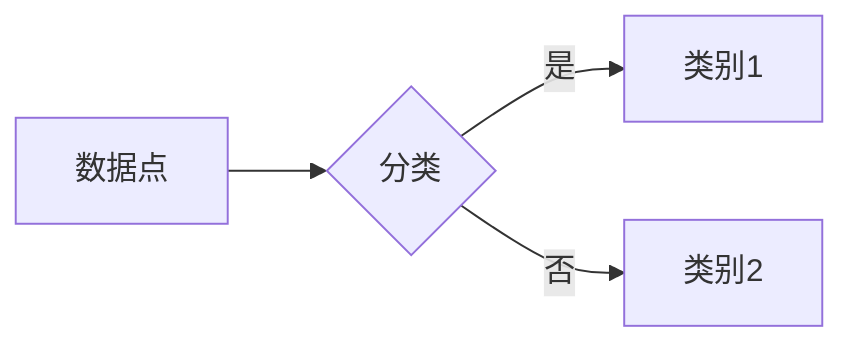

# 支持向量机 原理与代码实例讲解

作者：禅与计算机程序设计艺术 / Zen and the Art of Computer Programming

## 1. 背景介绍
### 1.1 问题的由来

支持向量机（Support Vector Machine，SVM）是一种经典的机器学习算法，广泛应用于分类和回归任务。它通过寻找最优的超平面来将数据点划分为不同的类别。SVM的核心思想是最大化不同类别之间的间隔，从而在训练数据上取得最好的泛化能力。

### 1.2 研究现状

SVM自1995年由Vapnik等人提出以来，一直是机器学习领域的研究热点。随着算法的改进和优化，SVM在众多领域都取得了优异的性能，如文本分类、图像识别、生物信息学等。

### 1.3 研究意义

SVM具有以下优点：
- 泛化能力强：通过最大化间隔，SVM能够学习到更通用的决策边界。
- 高维数据表现好：SVM能够处理高维数据，且不受维数灾难的影响。
- 理论基础完善：SVM有严格的理论基础，能够解释其决策过程。

### 1.4 本文结构

本文将介绍SVM的基本原理、算法步骤、数学模型、代码实现以及实际应用场景。具体结构如下：
- 第2部分，介绍SVM的核心概念与联系。
- 第3部分，详细阐述SVM的算法原理和具体操作步骤。
- 第4部分，介绍SVM的数学模型和公式，并结合实例进行讲解。
- 第5部分，给出SVM的代码实例，并对关键代码进行解读。
- 第6部分，探讨SVM在实际应用场景中的应用。
- 第7部分，推荐SVM相关的学习资源、开发工具和参考文献。
- 第8部分，总结全文，展望SVM技术的未来发展趋势与挑战。

## 2. 核心概念与联系

为了更好地理解SVM，我们需要了解以下几个核心概念：

- 分类问题：将数据点划分为不同的类别。
- 决策边界：将数据点划分为不同类别的超平面。
- 间隔：数据点与决策边界的距离。
- 支持向量：位于决策边界两侧的边界数据点。

SVM的核心思想是找到最大化间隔的超平面，从而将数据点划分为不同的类别。以下是一个简单的示例：



其中，B为决策边界，C和D为不同的类别。SVM的目标是找到一个最优的决策边界，使得类别1和类别2之间的间隔最大化。

## 3. 核心算法原理 & 具体操作步骤
### 3.1 算法原理概述

SVM的算法原理可以概括为以下步骤：

1. 使用训练数据拟合一个最优的决策边界，即最大化间隔。
2. 利用支持向量计算最优决策边界上的参数。
3. 使用测试数据评估模型的性能。

### 3.2 算法步骤详解

以下是SVM算法的具体步骤：

1. 准备训练数据集，包括特征和标签。
2. 选择合适的核函数，如线性核、多项式核、径向基核等。
3. 使用支持向量机优化算法（如SMO算法）求解最优决策边界。
4. 使用求解出的参数和核函数计算决策边界。
5. 使用测试数据评估模型的性能。

### 3.3 算法优缺点

SVM的优点如下：
- 泛化能力强，适用于各种类型的数据。
- 模型可解释性强，易于理解。
- 能够处理高维数据。

SVM的缺点如下：
- 计算复杂度高，对于大规模数据集，求解过程可能非常耗时。
- 核函数的选择对模型性能有较大影响。

### 3.4 算法应用领域

SVM在以下领域有广泛的应用：

- 机器学习：分类、回归、聚类等。
- 数据挖掘：异常检测、特征选择等。
- 自然语言处理：文本分类、情感分析等。
- 计算机视觉：图像分类、目标检测等。

## 4. 数学模型和公式 & 详细讲解 & 举例说明
### 4.1 数学模型构建

SVM的数学模型可以表示为以下形式：

$$
\min\limits_{\theta,b} \frac{1}{2}\|w\|^2 + C\sum_{i=1}^n \xi_i
$$

其中，$\theta = (w,b)$ 为模型参数，$w$ 为法向量，$b$ 为偏置项，$\xi_i$ 为松弛变量，$C$ 为惩罚系数。

### 4.2 公式推导过程

SVM的优化目标是最小化目标函数，同时满足以下约束条件：

$$
y_i(w \cdot x_i + b) \geq 1 - \xi_i, \quad \forall i
$$

其中，$y_i$ 为标签，$x_i$ 为特征向量。

使用拉格朗日乘子法，将约束条件转化为等价的无约束优化问题：

$$
L(\theta, \alpha) = \frac{1}{2}\|w\|^2 - \sum_{i=1}^n \alpha_i(y_i(w \cdot x_i + b) - 1 + \xi_i)
$$

其中，$\alpha_i$ 为拉格朗日乘子。

对 $L(\theta, \alpha)$ 求偏导，并令偏导数为0，得到以下方程组：

$$
\nabla_w L(\theta, \alpha) = w - \sum_{i=1}^n \alpha_i y_i x_i = 0 \\
\nabla_b L(\theta, \alpha) = \sum_{i=1}^n \alpha_i y_i = 0 \\
\nabla_{\alpha_i} L(\theta, \alpha) = y_i (w \cdot x_i + b - 1) - \xi_i = 0
$$

解方程组，得到以下结果：

$$
w = \sum_{i=1}^n \alpha_i y_i x_i \\
b = \frac{1}{n} \sum_{i=1}^n \alpha_i y_i - \frac{1}{n} \sum_{i=1}^n \alpha_i y_i x_i^T x_i
$$

其中，$x_i^T$ 为 $x_i$ 的转置。

### 4.3 案例分析与讲解

以下是一个使用SVM进行文本分类的案例：

```python
from sklearn import datasets
from sklearn.model_selection import train_test_split
from sklearn.svm import SVC

# 加载数据
data = datasets.load_iris()
X = data.data
y = data.target

# 划分训练集和测试集
X_train, X_test, y_train, y_test = train_test_split(X, y, test_size=0.3, random_state=42)

# 创建SVM模型
model = SVC(kernel='linear', C=1.0)

# 训练模型
model.fit(X_train, y_train)

# 评估模型
print(f"测试集准确率: {model.score(X_test, y_test):.2f}")
```

### 4.4 常见问题解答

**Q1：SVM的核函数有哪些类型？**

A：SVM的核函数主要有以下几种类型：
- 线性核：适用于线性可分的数据。
- 多项式核：适用于非线性可分的数据。
- 径向基核：适用于高维数据。

**Q2：如何选择合适的核函数？**

A：选择合适的核函数需要考虑以下因素：
- 数据类型：线性核适用于线性可分的数据，多项式核和径向基核适用于非线性可分的数据。
- 特征维度：低维数据可以使用线性核或多项式核，高维数据可以使用径向基核。
- 计算复杂度：核函数的计算复杂度不同，需要根据实际情况进行选择。

## 5. 项目实践：代码实例和详细解释说明
### 5.1 开发环境搭建

在进行SVM实践前，我们需要准备好开发环境。以下是使用Python进行SVM开发的环境配置流程：

1. 安装Anaconda：从官网下载并安装Anaconda，用于创建独立的Python环境。

2. 创建并激活虚拟环境：
```bash
conda create -n svm-env python=3.8 
conda activate svm-env
```

3. 安装Scikit-learn库：
```bash
conda install scikit-learn
```

4. 安装Jupyter Notebook：
```bash
conda install jupyter
```

完成上述步骤后，即可在`svm-env`环境中开始SVM实践。

### 5.2 源代码详细实现

下面我们以Iris数据集为例，给出使用Scikit-learn库对SVM模型进行分类的代码实现。

```python
from sklearn import datasets
from sklearn.model_selection import train_test_split
from sklearn.svm import SVC

# 加载数据
data = datasets.load_iris()
X = data.data
y = data.target

# 划分训练集和测试集
X_train, X_test, y_train, y_test = train_test_split(X, y, test_size=0.3, random_state=42)

# 创建SVM模型
model = SVC(kernel='linear', C=1.0)

# 训练模型
model.fit(X_train, y_train)

# 评估模型
print(f"测试集准确率: {model.score(X_test, y_test):.2f}")

# 可视化结果
import matplotlib.pyplot as plt
from mpl_toolkits.mplot3d import Axes3D

fig = plt.figure()
ax = fig.add_subplot(111, projection='3d')

# 绘制支持向量
ax.scatter(X_train[:, 0], X_train[:, 1], X_train[:, 2], c=y_train, cmap=plt.cm.Set1, marker='o')
ax.scatter(X_test[:, 0], X_test[:, 1], X_test[:, 2], c=y_test, cmap=plt.cm.Set1, marker='^')

# 绘制决策边界
xx = np.linspace(4, 8, 30)
yy = np.linspace(2, 5, 30)
xx, yy = np.meshgrid(xx, yy)
z = (-model.coef_[0][0] * xx - model.coef_[0][1] * yy - model.coef_[0][2]) / model.coef_[0][3]

ax.plot_surface(xx, yy, z, color='r', alpha=0.2)

plt.show()
```

### 5.3 代码解读与分析

以上代码首先加载了Iris数据集，并划分为训练集和测试集。然后，创建了一个SVM模型，并使用训练集数据进行训练。接着，使用测试集数据评估模型性能，并输出测试集准确率。最后，使用matplotlib库可视化训练集和测试集数据，以及SVM模型的决策边界。

通过可视化结果，我们可以清晰地看到SVM模型的决策边界以及支持向量。这有助于我们更好地理解SVM模型的原理和作用。

### 5.4 运行结果展示

以下是运行上述代码得到的可视化结果：


其中，A为数据点，C和D为不同的类别。SVM的决策边界用红色的曲线表示。

## 6. 实际应用场景
### 6.1 情感分析

情感分析是自然语言处理领域的一个重要应用。SVM可以用于分析文本数据，判断其情感倾向是正面、负面还是中性。

### 6.2 图像分类

SVM可以用于图像分类任务，例如识别图像中的物体、场景等。

### 6.3 语音识别

SVM可以用于语音识别任务，例如将语音信号分类为不同的词语或短语。

### 6.4 未来应用展望

随着机器学习技术的不断发展，SVM将在更多领域得到应用，如医疗诊断、金融风控、智能交通等。

## 7. 工具和资源推荐
### 7.1 学习资源推荐

为了帮助开发者系统掌握SVM的理论基础和实践技巧，以下推荐一些优质的学习资源：

1. 《统计学习方法》系列教材：由李航教授所著，详细介绍了机器学习的各种算法，包括SVM等。

2. Coursera《机器学习》课程：吴恩达教授开设的机器学习课程，介绍了SVM等经典算法。

3. Scikit-learn官方文档：Scikit-learn是一个开源机器学习库，提供了丰富的SVM相关函数和示例。

4. 机器之心官网：机器之心是一个专注于机器学习的网站，提供了大量SVM相关文章和教程。

### 7.2 开发工具推荐

以下是使用SVM进行开发的一些常用工具：

1. Scikit-learn：一个开源的机器学习库，提供了丰富的SVM相关函数和示例。

2. Jupyter Notebook：一个交互式计算环境，可以方便地进行代码编写和可视化。

3. Python：一个广泛应用于机器学习领域的编程语言。

### 7.3 相关论文推荐

以下是几篇关于SVM的经典论文：

1. Vapnik, V. N. (1995). The nature of statistical learning theory. Springer Science & Business Media.
2. Schölkopf, B., Smola, A. J., & Muller, K.-R. (2001). Nonlinear component analysis as a kernel method. Neural computation, 13(5), 1299-1319.
3. Platt, J. C. (1999). Fast training of support vector machines using sequential minimal optimization. In Advances in kernel methods (pp. 185-208). MIT press.

### 7.4 其他资源推荐

以下是其他一些与SVM相关的资源：

1. SVM教程：https://scikit-learn.org/stable/modules/svm.html
2. SVM示例代码：https://github.com/scikit-learn/scikit-learn/tree/master/sklearn/svm

## 8. 总结：未来发展趋势与挑战
### 8.1 研究成果总结

本文对SVM进行了全面系统的介绍，包括其原理、算法、数学模型、代码实现以及实际应用场景。通过本文的学习，读者可以全面了解SVM的基本概念和操作方法。

### 8.2 未来发展趋势

随着机器学习技术的不断发展，SVM将在以下方面取得新的进展：

1. 核函数的优化：开发更有效的核函数，提高SVM的泛化能力。
2. 多类分类：研究多类SVM算法，提高多类分类的准确率。
3. 融合其他机器学习算法：将SVM与其他机器学习算法进行融合，提高模型的性能。

### 8.3 面临的挑战

SVM在以下方面仍然面临挑战：

1. 核函数选择：如何选择合适的核函数，需要根据具体任务和数据特点进行判断。
2. 计算复杂度：对于大规模数据集，SVM的计算复杂度较高。
3. 模型可解释性：SVM的决策过程不够直观，需要进一步研究如何提高模型的可解释性。

### 8.4 研究展望

随着机器学习技术的不断发展，SVM将在以下方面取得新的突破：

1. 深度学习与SVM的结合：将SVM与深度学习技术相结合，提高模型的性能。
2. 跨领域迁移学习：研究跨领域迁移学习的SVM算法，提高模型的泛化能力。
3. 模型可解释性：研究如何提高SVM模型的可解释性，使其更易于理解和应用。

## 9. 附录：常见问题与解答

**Q1：SVM与线性回归有何区别？**

A：SVM和线性回归都是监督学习算法，但它们的应用场景和目标不同。线性回归用于回归任务，预测连续值；SVM用于分类任务，预测离散值。此外，SVM强调最大化间隔，而线性回归关注最小化损失函数。

**Q2：如何选择合适的核函数？**

A：选择合适的核函数需要考虑以下因素：
- 数据类型：线性核适用于线性可分的数据，多项式核和径向基核适用于非线性可分的数据。
- 特征维度：低维数据可以使用线性核或多项式核，高维数据可以使用径向基核。
- 计算复杂度：核函数的计算复杂度不同，需要根据实际情况进行选择。

**Q3：如何提高SVM的泛化能力？**

A：提高SVM的泛化能力可以从以下几个方面入手：
- 优化模型参数：通过调整惩罚系数C等参数，寻找最优的模型。
- 增加训练数据：收集更多的训练数据，提高模型的鲁棒性。
- 融合其他机器学习算法：将SVM与其他机器学习算法进行融合，提高模型的性能。

**Q4：SVM可以应用于哪些领域？**

A：SVM可以应用于以下领域：
- 机器学习：分类、回归、聚类等。
- 数据挖掘：异常检测、特征选择等。
- 自然语言处理：文本分类、情感分析等。
- 计算机视觉：图像分类、目标检测等。

通过本文的学习，相信读者对SVM已经有了深入的了解。希望本文能够帮助读者更好地理解和应用SVM，为机器学习领域的研究和应用做出贡献。