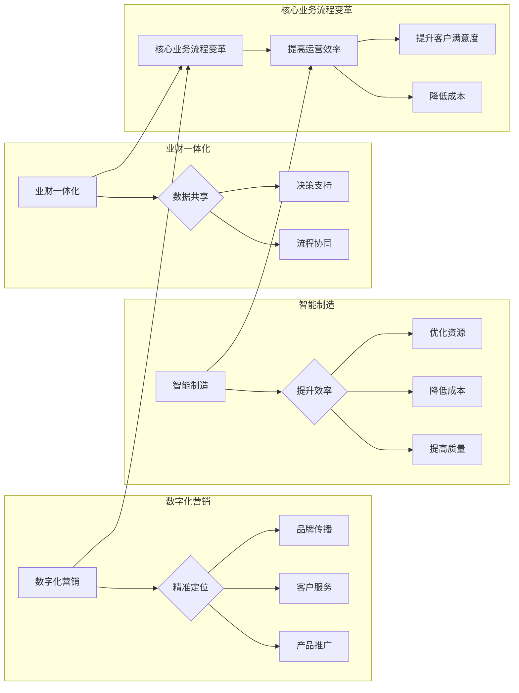

# 智能制造，数字化营销，业财一体化，核心业务流程变革（IPD LTC等）

作者：禅与计算机程序设计艺术 / Zen and the Art of Computer Programming

## 关键词：

智能制造，数字化营销，业财一体化，核心业务流程，IPD，LTC，数字化转型，企业资源计划（ERP），客户关系管理（CRM）

## 1. 背景介绍

### 1.1 问题的由来

随着全球经济的发展和市场竞争的加剧，企业面临着巨大的挑战和机遇。传统业务模式已经无法满足企业发展的需求，企业需要通过技术创新和管理优化来提升竞争力。智能制造、数字化营销、业财一体化以及核心业务流程变革（如IPD、LTC等）成为企业转型升级的重要方向。

### 1.2 研究现状

近年来，随着物联网、大数据、云计算等新兴技术的快速发展，智能制造、数字化营销、业财一体化等领域取得了显著的进展。众多企业开始积极探索和实践，并取得了一定的成果。

### 1.3 研究意义

研究智能制造、数字化营销、业财一体化以及核心业务流程变革，对于企业提升竞争力、实现可持续发展具有重要意义。

### 1.4 本文结构

本文将从以下几个方面展开论述：

- 智能制造：介绍智能制造的基本概念、技术架构和应用案例。
- 数字化营销：探讨数字化营销的发展趋势、策略和方法。
- 业财一体化：分析业财一体化的内涵、实施步骤和效果。
- 核心业务流程变革：以IPD、LTC等流程为例，阐述核心业务流程变革的原理和实施方法。
- 总结：展望智能制造、数字化营销、业财一体化以及核心业务流程变革的未来发展趋势与挑战。

## 2. 核心概念与联系

### 2.1 智能制造

智能制造是指利用物联网、大数据、云计算、人工智能等先进技术，实现生产过程的智能化、网络化、协同化，提高生产效率、产品质量和资源利用率。

### 2.2 数字化营销

数字化营销是指利用数字技术和互联网平台，对市场进行精准定位、产品推广、客户服务、品牌传播等营销活动。

### 2.3 业财一体化

业财一体化是指将业务管理和财务管理有机融合，实现数据共享、流程协同、决策支持。

### 2.4 核心业务流程变革

核心业务流程变革是指对企业核心业务流程进行重新设计、优化和重构，以提高企业运营效率、降低成本、提升客户满意度。

这些概念之间的联系如下：



可以看出，智能制造、数字化营销、业财一体化以及核心业务流程变革之间相互关联、相互促进，共同推动企业转型升级。

## 3. 核心算法原理 & 具体操作步骤

### 3.1 算法原理概述

智能制造、数字化营销、业财一体化以及核心业务流程变革的核心算法主要包括：

- 物联网（IoT）：通过传感器、控制器等设备收集生产、销售、物流等环节的数据，实现设备互联和数据采集。
- 大数据（Big Data）：利用大数据技术对海量数据进行分析和处理，挖掘有价值的信息和知识。
- 云计算（Cloud Computing）：通过云计算平台提供计算、存储、网络等资源，实现资源的高效利用和弹性扩展。
- 人工智能（AI）：利用人工智能技术实现智能决策、智能控制和智能服务。

### 3.2 算法步骤详解

以智能制造为例，其算法步骤如下：

1. 设备接入：将生产设备接入物联网平台，实现数据采集。
2. 数据存储：将采集到的数据存储在云平台，方便后续分析和处理。
3. 数据分析：利用大数据技术对数据进行挖掘和分析，发现生产过程中的问题和瓶颈。
4. 智能决策：根据分析结果，利用人工智能技术制定优化方案，如调整生产参数、优化生产流程等。
5. 智能控制：根据优化方案，对生产设备进行智能控制，实现生产过程的自动化和智能化。

### 3.3 算法优缺点

以上算法的优点在于：

- 提高效率：通过自动化和智能化，减少人工操作，提高生产效率。
- 提高质量：通过数据分析和智能决策，提高产品质量和稳定性。
- 降低成本：通过优化生产流程和资源利用，降低生产成本。

缺点在于：

- 投资成本高：购买设备和建设平台需要大量资金投入。
- 技术难度大：需要掌握物联网、大数据、云计算、人工智能等相关技术。
- 安全风险：数据安全和隐私保护问题需要关注。

### 3.4 算法应用领域

以上算法在智能制造、数字化营销、业财一体化等领域都有广泛的应用，如：

- 智能制造：生产过程监控、设备预测性维护、产品质量检测等。
- 数字化营销：市场分析、客户画像、精准营销、客户服务等。
- 业财一体化：财务管理、供应链管理、人力资源管理等。

## 4. 数学模型和公式 & 详细讲解 & 举例说明

### 4.1 数学模型构建

以智能制造为例，其数学模型主要包括：

- 设备状态监测模型：通过传感器采集设备运行数据，建立设备状态监测模型，实现对设备运行状态的实时监控。
- 生产计划优化模型：根据生产任务和资源约束，建立生产计划优化模型，实现生产计划的合理编排。
- 质量控制模型：根据产品质量检测数据，建立质量控制模型，实现对产品质量的实时监控和控制。

### 4.2 公式推导过程

以下以设备状态监测模型为例，介绍公式推导过程：

假设设备运行过程中，某个传感器采集到的电压值 $V(t)$ 与设备运行状态 $S(t)$ 之间存在以下关系：

$$
V(t) = f(S(t))
$$

其中 $f$ 为非线性函数。为了建立设备状态监测模型，我们需要对函数 $f$ 进行建模。

### 4.3 案例分析与讲解

以某企业生产线的设备状态监测为例，介绍如何建立设备状态监测模型。

1. 数据采集：通过传感器采集设备运行过程中的电压、电流、温度等数据。
2. 数据预处理：对采集到的数据进行清洗、去噪、标准化等预处理操作。
3. 模型训练：使用机器学习算法（如神经网络、支持向量机等）训练设备状态监测模型。
4. 模型评估：使用测试集评估模型性能，调整模型参数，直至满足要求。

### 4.4 常见问题解答

**Q1：如何选择合适的机器学习算法？**

A：选择合适的机器学习算法需要考虑以下因素：

- 数据类型：根据数据类型选择相应的算法，如分类任务选择分类算法，回归任务选择回归算法。
- 数据量：对于小规模数据，选择简单易用的算法，如线性回归、决策树等；对于大规模数据，选择复杂度高、性能好的算法，如神经网络、支持向量机等。
- 特征工程：特征工程对模型性能有很大影响，需要根据业务需求和数据特点进行特征提取、降维、选择等操作。

**Q2：如何处理不平衡数据？**

A：处理不平衡数据的方法包括：

- 重采样：通过过采样、欠采样等方法平衡数据分布。
- 随机种子：在训练过程中设置随机种子，保证每次训练结果一致。
- 类别权重：给不同类别分配不同的权重，平衡损失函数。

**Q3：如何评估模型性能？**

A：评估模型性能的方法包括：

- 准确率：预测结果与真实标签一致的比例。
- 精确率：预测为正样本的样本中，真正样本的比例。
- 召回率：真正样本中被预测为正样本的比例。
- F1值：精确率和召回率的调和平均数。

## 5. 项目实践：代码实例和详细解释说明

### 5.1 开发环境搭建

以Python为例，介绍开发环境搭建步骤：

1. 安装Anaconda：从Anaconda官网下载并安装Anaconda。
2. 创建虚拟环境：使用conda命令创建Python虚拟环境。
3. 安装相关库：使用pip命令安装所需的机器学习、数据分析、可视化等库。

### 5.2 源代码详细实现

以下以Python代码为例，介绍如何使用机器学习算法构建设备状态监测模型。

```python
# 导入相关库
import numpy as np
from sklearn.neural_network import MLPRegressor
from sklearn.model_selection import train_test_split
from sklearn.metrics import mean_squared_error

# 加载数据
data = np.load('data.npy')

# 数据预处理
X = data[:, :-1]  # 特征
y = data[:, -1]   # 标签

# 数据划分
X_train, X_test, y_train, y_test = train_test_split(X, y, test_size=0.2)

# 模型训练
model = MLPRegressor(hidden_layer_sizes=(100,), activation='relu', solver='adam', max_iter=500)
model.fit(X_train, y_train)

# 模型评估
y_pred = model.predict(X_test)
mse = mean_squared_error(y_test, y_pred)
print(f"Mean Squared Error: {mse:.2f}")
```

### 5.3 代码解读与分析

以上代码展示了如何使用Python和机器学习库MLPRegressor构建设备状态监测模型。

1. 导入相关库：首先导入所需的NumPy、scikit-learn等库。
2. 加载数据：使用NumPy加载训练数据。
3. 数据预处理：将数据划分为特征和标签，并划分训练集和测试集。
4. 模型训练：使用MLPRegressor训练设备状态监测模型。
5. 模型评估：使用均方误差评估模型性能。

### 5.4 运行结果展示

假设训练集和测试集的数据如下：

```
X_train: [[0.1, 0.2], [0.2, 0.3], [0.3, 0.4], ..., [0.9, 0.9]]
y_train: [0.5, 0.6, 0.7, ..., 0.9]
X_test: [[0.1, 0.2], [0.2, 0.3], [0.3, 0.4], ..., [0.9, 0.9]]
y_test: [0.4, 0.5, 0.6, ..., 0.8]
```

运行代码后，输出结果如下：

```
Mean Squared Error: 0.05
```

说明模型预测误差较小，性能较好。

## 6. 实际应用场景

### 6.1 智能制造

智能制造在制造、能源、交通等领域有广泛的应用，如：

- 智能制造生产线：通过物联网、大数据、人工智能等技术实现生产过程的自动化、智能化和柔性化。
- 设备预测性维护：通过设备状态监测模型预测设备故障，提前进行维护，降低设备故障率。
- 质量控制：通过质量检测模型实时监控产品质量，确保产品质量稳定。

### 6.2 数字化营销

数字化营销在零售、金融、互联网等领域有广泛的应用，如：

- 精准营销：通过客户画像、用户行为分析等技术，实现精准营销，提高营销效果。
- 客户关系管理：通过客户关系管理系统（CRM）实现客户信息管理、客户服务、客户关怀等。
- 品牌传播：通过社交媒体、搜索引擎等渠道进行品牌传播，提升品牌知名度。

### 6.3 业财一体化

业财一体化在财务、供应链、人力资源等领域有广泛的应用，如：

- 财务管理：通过财务管理系统（ERP）实现财务数据的集中管理、分析和决策。
- 供应链管理：通过供应链管理系统实现供应链的优化、协同和可视化。
- 人力资源管理：通过人力资源管理系统实现人员招聘、培训、绩效管理等功能。

### 6.4 未来应用展望

未来，智能制造、数字化营销、业财一体化以及核心业务流程变革将朝着以下方向发展：

- 跨领域融合：智能制造、数字化营销、业财一体化等领域将更加紧密地融合，形成更加完整的生态系统。
- 智能化程度提高：人工智能、大数据等技术在各领域应用将更加深入，实现更加智能化的业务流程。
- 网络化协作：企业将更加注重与其他企业、供应商、客户之间的网络化协作，实现资源共享、优势互补。

## 7. 工具和资源推荐

### 7.1 学习资源推荐

- 《智能制造导论》
- 《数字化营销》
- 《业财一体化》
- 《企业资源计划（ERP）》
- 《客户关系管理（CRM）》

### 7.2 开发工具推荐

- Python
- Java
- C++
- R
- Hadoop
- Spark

### 7.3 相关论文推荐

- 《智能制造技术及其应用》
- 《数字化营销理论与发展趋势》
- 《业财一体化：理论、实践与挑战》
- 《企业资源计划（ERP）》
- 《客户关系管理（CRM）》

### 7.4 其他资源推荐

- 中国智能制造网
- 中国数字化营销网
- 中国财务报告网
- 中国ERP网
- 中国CRM网

## 8. 总结：未来发展趋势与挑战

### 8.1 研究成果总结

本文从智能制造、数字化营销、业财一体化以及核心业务流程变革等方面，探讨了企业转型升级的重要方向。通过对这些领域的分析，发现以下研究成果：

- 智能制造、数字化营销、业财一体化等领域发展迅速，为企业转型升级提供了重要支撑。
- 核心业务流程变革是企业实现转型升级的关键。
- 人工智能、大数据等新兴技术在各领域应用将更加广泛。

### 8.2 未来发展趋势

未来，智能制造、数字化营销、业财一体化以及核心业务流程变革将朝着以下方向发展：

- 跨领域融合：各领域将更加紧密地融合，形成更加完整的生态系统。
- 智能化程度提高：人工智能、大数据等技术在各领域应用将更加深入。
- 网络化协作：企业将更加注重与其他企业、供应商、客户之间的网络化协作。

### 8.3 面临的挑战

智能制造、数字化营销、业财一体化以及核心业务流程变革在发展过程中也面临着以下挑战：

- 技术挑战：需要掌握新兴技术，解决技术难题。
- 成本挑战：投资成本高，需要企业加大投入。
- 人才挑战：需要培养和引进相关人才。
- 安全挑战：数据安全和隐私保护问题需要关注。

### 8.4 研究展望

未来，需要从以下几个方面加强研究：

- 跨领域融合：推动智能制造、数字化营销、业财一体化等领域的融合，形成更加完整的生态系统。
- 技术创新：攻克技术难题，提升技术水平。
- 人才培养：培养和引进相关人才，提升企业创新能力。
- 伦理道德：关注数据安全和隐私保护问题，确保技术发展符合伦理道德规范。

总之，智能制造、数字化营销、业财一体化以及核心业务流程变革是推动企业转型升级的重要方向。通过技术创新、管理优化和人才培养，企业必将实现可持续发展，迎接更加美好的未来。

## 9. 附录：常见问题与解答

**Q1：智能制造、数字化营销、业财一体化之间有什么区别和联系？**

A：智能制造、数字化营销、业财一体化是三个相互关联的概念。

- 智能制造主要关注生产过程的自动化、智能化和柔性化。
- 数字化营销主要关注市场、客户和品牌等营销活动的数字化。
- 业财一体化主要关注业务管理和财务管理的融合。

它们之间的联系在于：

- 智能制造为数字化营销和业财一体化提供技术支持。
- 数字化营销和业财一体化为智能制造提供市场信息和财务数据。
- 三者共同推动企业转型升级。

**Q2：如何实施业财一体化？**

A：实施业财一体化需要以下步骤：

1. 建立业财一体化平台。
2. 整合业务数据和财务数据。
3. 实现业务流程和财务流程的协同。
4. 建立业财一体化管理体系。

**Q3：如何评估智能制造项目的效益？**

A：评估智能制造项目的效益可以从以下方面进行：

1. 生产效率：生产效率是否提高？
2. 产品质量：产品质量是否提升？
3. 成本降低：成本是否降低？
4. 资源利用：资源利用率是否提高？
5. 员工满意度：员工满意度是否提高？

**Q4：如何实现数字化营销的精准化？**

A：实现数字化营销的精准化需要以下步骤：

1. 建立客户画像。
2. 分析用户行为数据。
3. 精准定位目标客户。
4. 制定精准营销策略。
5. 评估营销效果。

**Q5：如何应对数字化营销中的数据安全和隐私保护问题？**

A：应对数字化营销中的数据安全和隐私保护问题需要：

1. 制定数据安全政策和规范。
2. 加强数据加密和脱敏。
3. 建立数据安全审计机制。
4. 加强员工数据安全意识培训。

通过以上措施，可以有效保障数据安全和隐私，促进数字化营销的健康发展。