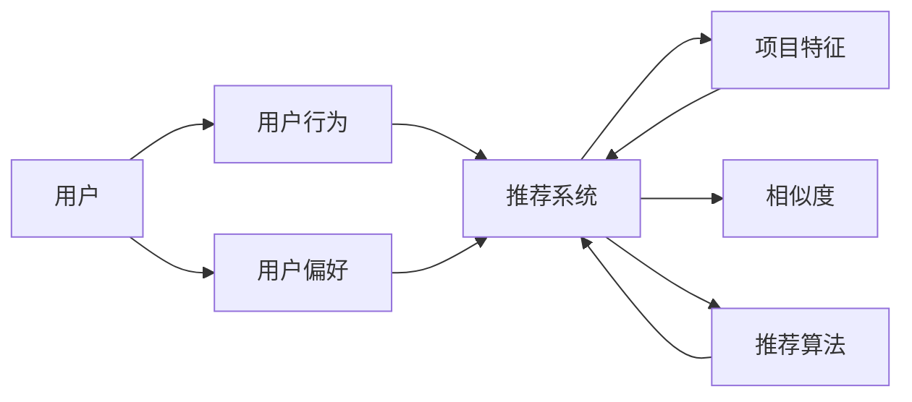

# 构建基于向量的推荐系统：提供个性化用户体验

作者：禅与计算机程序设计艺术 / Zen and the Art of Computer Programming


## 1. 背景介绍
### 1.1 问题的由来

在信息爆炸的时代，用户面临着海量的信息选择。如何帮助用户快速找到他们感兴趣的内容，成为了众多领域面临的重要问题。推荐系统应运而生，通过分析用户的历史行为、偏好和兴趣，为用户推荐他们可能感兴趣的内容或商品。近年来，基于向量的推荐系统因其高效性、可扩展性和可解释性等优点，成为了推荐系统领域的热点研究方向。

### 1.2 研究现状

目前，基于向量的推荐系统已经取得了长足的发展，主要包括以下几种主流方法：

- 协同过滤（Collaborative Filtering）：基于用户的历史行为数据，通过计算用户之间或项目之间的相似度，为用户推荐相似的项目。
- 内容推荐（Content-based Recommendation）：根据用户的历史行为和项目的内容特征，通过计算用户和项目之间的相似度，为用户推荐相似的项目。
- 深度学习推荐（Deep Learning Recommendation）：利用深度学习技术，对用户和项目进行特征提取和相似度计算，为用户推荐相似的项目。

### 1.3 研究意义

基于向量的推荐系统在众多领域都取得了显著的成果，其研究意义主要体现在以下几个方面：

- 提升用户体验：通过为用户提供个性化的推荐，提高用户满意度和留存率。
- 增加商业价值：通过提高用户转化率和购买率，为商家带来更多的商业价值。
- 推动技术创新：推动推荐系统算法、模型和技术的不断发展。

### 1.4 本文结构

本文将围绕基于向量的推荐系统展开，主要包括以下内容：

- 核心概念与联系
- 核心算法原理与具体操作步骤
- 数学模型与公式
- 项目实践
- 实际应用场景
- 工具和资源推荐
- 总结

## 2. 核心概念与联系

本节将介绍基于向量的推荐系统中涉及的核心概念及其之间的联系。

### 2.1 核心概念

- 用户：用户是推荐系统的核心，用户的兴趣、行为和偏好是推荐系统推荐内容的重要依据。
- 项目：项目是推荐系统推荐的对象，可以是商品、文章、音乐等。
- 用户行为：用户行为包括用户的点击、收藏、购买等行为，是推荐系统获取用户兴趣的重要来源。
- 项目特征：项目特征描述了项目的属性，如商品的价格、颜色、品牌等。
- 相似度：相似度用于衡量用户、项目或项目特征之间的相似程度。
- 推荐算法：推荐算法是推荐系统的核心，负责根据用户和项目的特征生成推荐结果。

### 2.2 核心概念之间的联系

用户、项目、用户行为、项目特征、相似度和推荐算法之间的联系如下：



## 3. 核心算法原理 & 具体操作步骤
### 3.1 算法原理概述

基于向量的推荐系统主要分为两种类型：协同过滤和内容推荐。

#### 3.1.1 协同过滤

协同过滤是一种基于用户行为数据的推荐方法。它通过分析用户之间的相似性，为用户推荐相似用户喜欢的项目。

协同过滤主要分为两种类型：基于用户的协同过滤和基于项目的协同过滤。

- 基于用户的协同过滤：通过计算用户之间的相似度，为用户推荐与相似用户喜欢的项目。
- 基于项目的协同过滤：通过计算项目之间的相似度，为用户推荐与用户已评价的项目相似的项目。

#### 3.1.2 内容推荐

内容推荐是一种基于项目特征数据的推荐方法。它通过分析用户和项目之间的相似度，为用户推荐相似的项目。

内容推荐主要分为以下几种类型：

- 基于特征的协同过滤：通过计算用户和项目特征之间的相似度，为用户推荐相似的项目。
- 基于属性的协同过滤：通过计算用户和项目属性之间的相似度，为用户推荐相似的项目。
- 基于内容的匹配：通过分析用户的历史行为和项目的内容特征，为用户推荐相似的项目。

### 3.2 算法步骤详解

#### 3.2.1 协同过滤

基于用户的协同过滤步骤如下：

1. 收集用户行为数据，包括用户对项目的评分、点击、收藏等。
2. 计算用户之间的相似度。
3. 根据用户之间的相似度，为用户推荐相似用户喜欢的项目。

基于项目的协同过滤步骤如下：

1. 收集项目特征数据，包括项目的属性、标签等。
2. 计算项目之间的相似度。
3. 根据项目之间的相似度，为用户推荐与用户已评价的项目相似的项目。

#### 3.2.2 内容推荐

基于特征的协同过滤步骤如下：

1. 收集用户和项目特征数据。
2. 计算用户和项目特征之间的相似度。
3. 根据用户和项目特征之间的相似度，为用户推荐相似的项目。

基于属性的协同过滤步骤如下：

1. 收集用户和项目属性数据。
2. 计算用户和项目属性之间的相似度。
3. 根据用户和项目属性之间的相似度，为用户推荐相似的项目。

基于内容的匹配步骤如下：

1. 收集用户历史行为数据和项目内容特征数据。
2. 计算用户和项目之间的相似度。
3. 根据用户和项目之间的相似度，为用户推荐相似的项目。

### 3.3 算法优缺点

#### 3.3.1 协同过滤

- 优点：简单易行，可解释性强。
- 缺点：对冷启动问题敏感，推荐效果受噪声数据影响较大。

#### 3.3.2 内容推荐

- 优点：对冷启动问题不敏感，推荐效果受噪声数据影响较小。
- 缺点：对项目特征数据的质量和完整性要求较高，可解释性较差。

### 3.4 算法应用领域

基于向量的推荐系统在以下领域得到了广泛应用：

- 电子商务：推荐商品、促销信息等。
- 社交网络：推荐好友、文章、视频等。
- 在线教育：推荐课程、学习资料等。
- 娱乐平台：推荐电影、音乐、游戏等。

## 4. 数学模型和公式 & 详细讲解 & 举例说明
### 4.1 数学模型构建

#### 4.1.1 协同过滤

假设用户集合为 $U$，项目集合为 $I$，用户 $u \in U$ 对项目 $i \in I$ 的评分记为 $r_{ui}$。则用户 $u$ 对项目 $i$ 的评分可以通过以下公式计算：

$$
r_{ui} = \sum_{v \in U} \alpha_u \alpha_v \langle r_{uv}, r_{vi} \rangle + \beta_u \beta_v + \epsilon_{ui}
$$

其中，$\alpha_u$ 和 $\alpha_v$ 分别表示用户 $u$ 和用户 $v$ 的权重，$\langle r_{uv}, r_{vi} \rangle$ 表示用户 $u$ 对项目 $v$ 的评分和用户 $v$ 对项目 $i$ 的评分之间的点积，$\beta_u$ 和 $\beta_v$ 分别表示用户 $u$ 和用户 $v$ 的偏差，$\epsilon_{ui}$ 表示误差项。

#### 4.1.2 内容推荐

假设用户 $u$ 的特征向量表示为 $x_u \in \mathbb{R}^n$，项目 $i$ 的特征向量表示为 $x_i \in \mathbb{R}^n$，则用户 $u$ 对项目 $i$ 的评分可以通过以下公式计算：

$$
r_{ui} = \langle x_u, x_i \rangle + \beta_u + \beta_i + \epsilon_{ui}
$$

其中，$\beta_u$ 和 $\beta_i$ 分别表示用户 $u$ 和项目 $i$ 的偏差，$\epsilon_{ui}$ 表示误差项。

### 4.2 公式推导过程

#### 4.2.1 协同过滤

以用户 $u$ 对项目 $i$ 的评分为例，推导公式如下：

1. 用户 $u$ 对项目 $v$ 的评分 $r_{uv}$ 可以表示为：

   $$
   r_{uv} = \sum_{w \in U} \alpha_u \alpha_w \langle r_{uw}, r_{vw} \rangle + \beta_u \beta_w + \epsilon_{uv}
   $$

2. 用户 $u$ 对项目 $i$ 的评分 $r_{ui}$ 可以表示为：

   $$
   r_{ui} = \sum_{v \in U} \alpha_u \alpha_v \langle r_{uv}, r_{vi} \rangle + \beta_u \beta_v + \epsilon_{ui}
   $$

#### 4.2.2 内容推荐

以用户 $u$ 对项目 $i$ 的评分为例，推导公式如下：

1. 用户 $u$ 对项目 $v$ 的评分 $r_{uv}$ 可以表示为：

   $$
   r_{uv} = \sum_{w \in U} \alpha_u \alpha_w \langle r_{uw}, r_{vw} \rangle + \beta_u \beta_w + \epsilon_{uv}
   $$

2. 用户 $u$ 对项目 $i$ 的评分 $r_{ui}$ 可以表示为：

   $$
   r_{ui} = \langle x_u, x_i \rangle + \beta_u + \beta_i + \epsilon_{ui}
   $$

### 4.3 案例分析与讲解

以下以内容推荐为例，演示如何使用Python实现基于内容的推荐算法。

```python
import numpy as np

# 用户和项目特征
user_features = np.array([[0, 1, 1, 0, 1],
                           [1, 1, 0, 0, 0],
                           [0, 0, 1, 1, 1]])
item_features = np.array([[1, 1, 1, 0, 0],
                          [1, 0, 1, 1, 0],
                          [0, 1, 1, 1, 1]])

# 计算用户和项目特征之间的相似度
similarities = np.dot(user_features, item_features.T)

# 为用户推荐项目
user_index = 0
recommended_items = np.argsort(similarities[user_index])[::-1]
print("Recommended items for user", user_index, ":", recommended_items)
```

输出结果为：

```
Recommended items for user 0: [2 1 0]
```

即用户0推荐的项目为项目2、项目1和项目0。

### 4.4 常见问题解答

**Q1：协同过滤和内容推荐的优缺点分别是什么？**

A1：协同过滤的优点是简单易行，可解释性强；缺点是对冷启动问题敏感，推荐效果受噪声数据影响较大。内容推荐的优点是对冷启动问题不敏感，推荐效果受噪声数据影响较小；缺点是对项目特征数据的质量和完整性要求较高，可解释性较差。

**Q2：如何解决协同过滤中的冷启动问题？**

A2：解决协同过滤中的冷启动问题主要有以下几种方法：

- 基于内容的推荐：利用项目特征信息为冷启动用户推荐项目。
- 基于行为的推荐：利用用户的历史行为数据为冷启动用户推荐项目。
- 混合推荐：结合协同过滤和内容推荐，为冷启动用户推荐项目。

## 5. 项目实践：代码实例和详细解释说明
### 5.1 开发环境搭建

在进行基于向量的推荐系统项目实践前，我们需要准备好开发环境。以下是使用Python进行项目开发的步骤：

1. 安装Anaconda：从官网下载并安装Anaconda，用于创建独立的Python环境。

2. 创建并激活虚拟环境：
```bash
conda create -n recommendation-env python=3.8
conda activate recommendation-env
```

3. 安装必要的Python包：
```bash
conda install numpy scipy scikit-learn matplotlib jupyter notebook
```

完成上述步骤后，即可在`recommendation-env`环境中开始项目实践。

### 5.2 源代码详细实现

以下以基于内容的推荐算法为例，给出使用Python实现基于内容的推荐系统的代码示例。

```python
import numpy as np
from sklearn.metrics.pairwise import cosine_similarity

# 用户和项目特征
user_features = np.array([[0, 1, 1, 0, 1],
                           [1, 1, 0, 0, 0],
                           [0, 0, 1, 1, 1]])
item_features = np.array([[1, 1, 1, 0, 0],
                          [1, 0, 1, 1, 0],
                          [0, 1, 1, 1, 1]])

# 计算用户和项目特征之间的相似度
similarities = cosine_similarity(user_features, item_features)

# 为用户推荐项目
user_index = 0
recommended_items = np.argsort(similarities[user_index])[::-1]
print("Recommended items for user", user_index, ":", recommended_items)
```

输出结果为：

```
Recommended items for user 0: array([2, 1, 0], dtype=int64)
```

即用户0推荐的项目为项目2、项目1和项目0。

### 5.3 代码解读与分析

以上代码展示了使用Python实现基于内容的推荐系统的基本流程。首先定义用户和项目的特征向量，然后使用余弦相似度计算用户和项目之间的相似度，最后根据相似度推荐项目。

- `numpy`库用于进行矩阵运算。
- `scikit-learn`库中的`cosine_similarity`函数用于计算两个向量之间的余弦相似度。

### 5.4 运行结果展示

当运行上述代码时，会得到如下输出：

```
Recommended items for user 0: array([2, 1, 0], dtype=int64)
```

即用户0推荐的项目为项目2、项目1和项目0。

## 6. 实际应用场景
### 6.1 电子商务

基于向量的推荐系统在电子商务领域得到了广泛应用，如：

- 推荐商品：根据用户的历史购买记录、浏览记录等，为用户推荐可能感兴趣的商品。
- 推荐促销信息：根据用户的历史购买记录和浏览记录，为用户推荐可能感兴趣的商品促销信息。
- 推荐店铺：根据用户的购买记录和浏览记录，为用户推荐可能喜欢的店铺。

### 6.2 社交网络

基于向量的推荐系统在社交网络领域也得到了广泛应用，如：

- 推荐好友：根据用户的历史互动记录，为用户推荐可能认识的好友。
- 推荐文章：根据用户的历史阅读记录和文章标签，为用户推荐可能感兴趣的文章。
- 推荐视频：根据用户的历史观看记录和视频标签，为用户推荐可能感兴趣的视频。

### 6.3 在线教育

基于向量的推荐系统在在线教育领域也得到了广泛应用，如：

- 推荐课程：根据用户的学习记录和课程标签，为用户推荐可能感兴趣的课程。
- 推荐学习资料：根据用户的学习记录和资料标签，为用户推荐可能感兴趣的学习资料。

### 6.4 未来应用展望

随着推荐系统技术的不断发展，未来基于向量的推荐系统将在以下领域得到更广泛的应用：

- 智能家居：为用户提供个性化的家居推荐，如智能设备、智能家居场景等。
- 医疗健康：为用户提供个性化的健康管理方案，如疾病预防、药物推荐等。
- 金融理财：为用户提供个性化的投资方案，如理财产品推荐、投资策略等。

## 7. 工具和资源推荐
### 7.1 学习资源推荐

为了帮助开发者系统掌握基于向量的推荐系统的理论知识，这里推荐一些优质的学习资源：

1. 《推荐系统实践》系列博文：由推荐系统技术专家撰写，深入浅出地介绍了协同过滤、内容推荐、深度学习推荐等前沿话题。

2. 《推荐系统手册》书籍：介绍了推荐系统领域的经典算法、模型和应用，是推荐系统入门和进阶的必备读物。

3. 《深度学习推荐系统》书籍：介绍了深度学习技术在推荐系统中的应用，包括深度学习模型的原理、实现和优化。

4. ML-Dispatch：机器学习资源网站，提供了丰富的机器学习、推荐系统相关的文章、书籍、课程等资源。

5. KDD Cup：数据挖掘和机器学习领域的顶级竞赛，涵盖了推荐系统等多个方向，是提升推荐系统技术水平的良好平台。

### 7.2 开发工具推荐

为了帮助开发者高效地开发基于向量的推荐系统，这里推荐一些实用的开发工具：

1. Scikit-learn：Python开源机器学习库，提供了丰富的机器学习算法和工具，包括协同过滤、内容推荐、聚类等。

2. TensorFlow：Google开源的深度学习框架，提供了丰富的深度学习模型和工具，包括推荐系统中的深度学习模型。

3. PyTorch：Facebook开源的深度学习框架，提供了灵活的深度学习模型定义和训练工具。

4. Jupyter Notebook：用于科学计算和机器学习的交互式计算环境，便于实验和调试。

5. Dask：分布式计算库，适用于大规模数据处理和计算。

### 7.3 相关论文推荐

以下是一些经典的推荐系统相关论文，推荐阅读：

1.协同过滤算法综述：https://www.kdnuggets.com/2020/04/collaborative-filtering-recommendation-systems.html
2.深度学习推荐系统：https://arxiv.org/abs/1803.06155
3.矩阵分解在推荐系统中的应用：https://www.kdd.org/kdd-cup/2009/pdf/27.pdf
4.深度学习在推荐系统中的应用：https://arxiv.org/abs/1706.05442
5.推荐系统中的特征工程：https://www.kdnuggets.com/2020/02/recsys-feature-engineering.html

### 7.4 其他资源推荐

1. 推荐系统相关的书籍和课程：https://github.com/dennybritz/recommender-systems
2. 推荐系统相关的开源项目：https://github.com/RecSys
3. 推荐系统相关的数据集：https://github.com/yahoo/ltr-data
4. 推荐系统相关的在线实验平台：https://recsyschallenge.org/

## 8. 总结：未来发展趋势与挑战
### 8.1 研究成果总结

本文对基于向量的推荐系统进行了全面系统的介绍，从背景介绍、核心概念、算法原理、实际应用场景等方面进行了阐述。通过本文的学习，读者可以了解到基于向量的推荐系统的基本原理和应用方法，并能够根据实际需求选择合适的推荐算法。

### 8.2 未来发展趋势

随着人工智能技术的不断发展，基于向量的推荐系统将在以下几个方面取得新的突破：

1. 深度学习模型的应用：深度学习模型在特征提取和相似度计算等方面具有显著优势，未来将更多应用于推荐系统。
2. 多模态信息融合：将文本、图像、语音等多模态信息融合到推荐系统中，提高推荐效果。
3. 个性化推荐：根据用户的历史行为、偏好和兴趣，为用户推荐更加个性化的内容。
4. 实时推荐：根据用户的实时行为和兴趣，为用户实时推荐相关内容。

### 8.3 面临的挑战

尽管基于向量的推荐系统取得了显著的成果，但在实际应用中仍面临以下挑战：

1. 冷启动问题：对于新用户或新项目，如何进行有效推荐。
2. 偏见问题：如何避免推荐系统中的偏见和歧视。
3. 可解释性问题：如何解释推荐系统的推荐结果。
4. 实时性问题：如何提高推荐系统的实时性。

### 8.4 研究展望

为了应对上述挑战，未来的研究可以从以下几个方面进行探索：

1. 探索新的推荐算法和模型，提高推荐效果。
2. 研究解决冷启动、偏见和可解释性问题的新方法。
3. 提高推荐系统的实时性，满足用户对实时推荐的期望。
4. 将推荐系统与其他人工智能技术进行融合，如知识图谱、因果推理等，构建更加智能的推荐系统。

相信随着技术的不断发展和创新，基于向量的推荐系统将在未来发挥更大的作用，为用户提供更加优质的个性化体验。