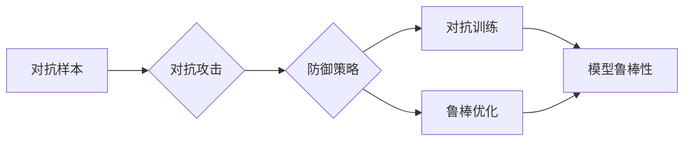

# 模型安全与对抗攻防原理与代码实战案例讲解

作者：禅与计算机程序设计艺术 / Zen and the Art of Computer Programming

## 1. 背景介绍
### 1.1 问题的由来

随着人工智能技术的快速发展，深度学习模型在各个领域得到了广泛应用。然而，模型安全成为了一个日益突出的问题。攻击者可以通过精心设计的对抗样本对模型进行攻击，导致模型在真实世界中的性能下降，甚至产生严重的安全风险。因此，研究模型安全与对抗攻防技术具有重要意义。

### 1.2 研究现状

近年来，模型安全与对抗攻防技术得到了广泛关注。研究者们提出了多种对抗攻击方法和防御策略，包括：

- **对抗攻击方法**：基于梯度下降、差分进化等优化算法，生成对抗样本攻击模型。
- **防御策略**：对抗训练、鲁棒优化、隐私保护等，提高模型对对抗攻击的鲁棒性。
- **对抗检测**：基于特征工程、深度学习等方法，识别和过滤对抗样本。

### 1.3 研究意义

研究模型安全与对抗攻防技术具有以下意义：

- **提高模型安全性**：降低模型在真实世界中的攻击风险，保障用户隐私和数据安全。
- **提升模型可靠性**：提高模型在对抗环境下的性能，增强模型在实际应用中的可靠性。
- **推动人工智能发展**：推动对抗攻防技术在人工智能领域的应用，促进人工智能技术的健康发展。

### 1.4 本文结构

本文将从以下方面对模型安全与对抗攻防进行深入探讨：

- 核心概念与联系
- 核心算法原理与具体操作步骤
- 数学模型和公式与详细讲解
- 项目实践：代码实例和详细解释说明
- 实际应用场景
- 工具和资源推荐
- 总结：未来发展趋势与挑战

## 2. 核心概念与联系

为了更好地理解模型安全与对抗攻防技术，本节将介绍几个核心概念：

- **对抗样本**：在模型训练过程中，通过对抗攻击方法生成的恶意样本，旨在欺骗模型，使其产生错误预测。
- **对抗攻击**：利用模型对输入数据的敏感性，生成对抗样本，攻击模型的方法。
- **防御策略**：提高模型对对抗攻击的鲁棒性，防止模型被对抗样本欺骗的方法。
- **对抗检测**：识别和过滤对抗样本，保护模型免受攻击的方法。
- **对抗训练**：通过对抗样本训练模型，提高模型对对抗攻击的鲁棒性。
- **鲁棒优化**：设计鲁棒的优化算法，使模型在对抗攻击下仍能保持良好的性能。

它们的逻辑关系如下图所示：



可以看出，对抗样本是攻击模型的基础，对抗攻击是攻击手段，防御策略是提高模型鲁棒性的方法，对抗训练和鲁棒优化是实现防御策略的具体途径，最终目的是提高模型的鲁棒性。

## 3. 核心算法原理与具体操作步骤
### 3.1 算法原理概述

本节将介绍模型安全与对抗攻防中的核心算法原理，包括对抗攻击、防御策略和对抗检测。

#### 3.1.1 对抗攻击

对抗攻击的核心思想是利用模型对输入数据的敏感性，生成对抗样本。常见的对抗攻击方法包括：

- **梯度下降攻击**：通过梯度下降算法，逐步调整输入数据，使其逐渐偏离原始样本，达到欺骗模型的目的。
- **差分进化攻击**：基于差分进化算法，生成对抗样本，具有较好的鲁棒性和多样性。
- **生成对抗网络攻击**：利用生成对抗网络，生成与真实样本具有相似特征的对抗样本。

#### 3.1.2 防御策略

防御策略的核心思想是提高模型对对抗攻击的鲁棒性，防止模型被对抗样本欺骗。常见的防御策略包括：

- **对抗训练**：通过对抗样本训练模型，使模型能够识别和抵抗对抗样本。
- **鲁棒优化**：设计鲁棒的优化算法，提高模型在对抗攻击下的性能。
- **隐私保护**：保护模型训练数据隐私，防止攻击者获取敏感信息。

#### 3.1.3 对抗检测

对抗检测的核心思想是识别和过滤对抗样本，保护模型免受攻击。常见的对抗检测方法包括：

- **基于特征的检测**：利用对抗样本的统计特征，如梯度信息、特征分布等，识别对抗样本。
- **基于深度学习的检测**：利用深度学习模型，对输入样本进行分类，区分正常样本和对抗样本。

### 3.2 算法步骤详解

以下是对抗攻击、防御策略和对抗检测的具体操作步骤：

#### 3.2.1 对抗攻击

1. 选择攻击目标模型和攻击目标。
2. 生成对抗样本，使其对模型产生错误预测。
3. 评估对抗样本对模型的攻击效果。

#### 3.2.2 防御策略

1. 收集对抗样本，用于对抗训练。
2. 使用对抗样本训练模型，提高模型对对抗样本的识别能力。
3. 评估模型的鲁棒性。

#### 3.2.3 对抗检测

1. 收集正常样本和对抗样本。
2. 训练对抗检测模型，对输入样本进行分类。
3. 评估模型的检测效果。

### 3.3 算法优缺点

#### 3.3.1 对抗攻击

**优点**：

- 可以有效地攻击各种模型，包括深度学习模型。
- 可以针对特定模型和攻击目标，生成具有针对性的对抗样本。

**缺点**：

- 攻击过程复杂，需要较高的计算成本。
- 难以生成具有较高攻击效果的对抗样本。

#### 3.3.2 防御策略

**优点**：

- 可以提高模型的鲁棒性，防止模型被对抗样本欺骗。
- 可以提高模型在对抗攻击下的性能。

**缺点**：

- 防御策略可能降低模型的性能。
- 防御策略可能难以应对新型攻击方法。

#### 3.3.3 对抗检测

**优点**：

- 可以有效地识别和过滤对抗样本。
- 可以防止模型被对抗样本攻击。

**缺点**：

- 检测过程可能对模型的性能有一定影响。
- 检测模型可能被绕过。

### 3.4 算法应用领域

对抗攻击、防御策略和对抗检测在以下领域具有广泛的应用：

- **自动驾驶**：防止攻击者通过生成对抗样本攻击自动驾驶系统，导致交通事故。
- **金融安全**：防止攻击者通过生成对抗样本攻击金融系统，进行欺诈行为。
- **网络安全**：防止攻击者通过生成对抗样本攻击网络安全系统，造成数据泄露。

## 4. 数学模型和公式与详细讲解
### 4.1 数学模型构建

本节将介绍模型安全与对抗攻防中的数学模型和公式，包括对抗攻击、防御策略和对抗检测。

#### 4.1.1 对抗攻击

假设模型为 $f(x)$，攻击者希望找到对抗样本 $x'$，使得 $f(x') \
eq f(x)$。对抗攻击的数学模型可以表示为：

$$
\min_{x'} \frac{1}{2} ||f(x') - f(x)||^2 + \lambda ||x' - x||^2
$$

其中，第一项是损失函数，用于衡量对抗样本对模型的攻击效果；第二项是正则化项，用于控制对抗样本与原始样本的距离。

#### 4.1.2 防御策略

假设模型为 $f(x)$，攻击者希望找到对抗样本 $x'$，使得 $f(x') \
eq f(x)$。防御策略的数学模型可以表示为：

$$
\min_{x'} \frac{1}{2} ||f(x') - f(x)||^2 + \lambda ||x' - x||^2
$$

其中，损失函数和正则化项与对抗攻击相同。

#### 4.1.3 对抗检测

假设模型为 $f(x)$，攻击者希望找到对抗样本 $x'$，使得 $f(x') \
eq f(x)$。对抗检测的数学模型可以表示为：

$$
\max_{x'} \frac{1}{2} ||f(x') - f(x)||^2
$$

其中，损失函数用于衡量对抗样本对模型的攻击效果。

### 4.2 公式推导过程

#### 4.2.1 对抗攻击

以梯度下降攻击为例，假设损失函数为平方损失，则对抗攻击的公式推导过程如下：

1. 设 $x_0 = x$，初始对抗样本与原始样本相同。
2. 设学习率为 $\eta$，更新公式为 $x_{t+1} = x_t - \eta \nabla_{x_t}L(x_t)$，其中 $L(x)$ 为损失函数。
3. 重复步骤2，直至达到最大迭代次数或满足停止条件。

#### 4.2.2 防御策略

以对抗训练为例，假设损失函数为平方损失，则防御策略的公式推导过程如下：

1. 收集对抗样本 $x'$，用于对抗训练。
2. 使用对抗样本和原始样本 $x$ 训练模型 $f(x)$，使得 $f(x') \approx f(x)$。
3. 重复步骤2，直至达到最大迭代次数或满足停止条件。

#### 4.2.3 对抗检测

以基于特征的检测为例，假设特征提取函数为 $h(x)$，则对抗检测的公式推导过程如下：

1. 收集正常样本和对抗样本，提取特征 $h(x)$。
2. 训练分类器 $g(x)$，对特征 $h(x)$ 进行分类。
3. 使用分类器 $g(x)$ 对输入样本进行分类，识别对抗样本。

### 4.3 案例分析与讲解

#### 4.3.1 对抗攻击案例分析

以下是一个基于梯度下降攻击的案例，使用PyTorch对MNIST手写数字分类模型进行攻击。

```python
import torch
import torch.nn as nn
import torch.optim as optim

# 定义模型
class Net(nn.Module):
    def __init__(self):
        super(Net, self).__init__()
        self.fc = nn.Linear(784, 10)

    def forward(self, x):
        return self.fc(x.view(-1, 784))

# 加载模型
model = Net().to('cuda')
model.load_state_dict(torch.load('model.pth'))

# 定义对抗攻击函数
def attack(model, x, target, epsilon=0.1):
    x.requires_grad_(True)
    optimizer = optim.SGD([x], lr=0.01)
    for _ in range(20):
        optimizer.zero_grad()
        outputs = model(x)
        loss = nn.CrossEntropyLoss()(outputs, target)
        loss.backward()
        optimizer.step()
        x.data = x.data.clamp(min=0, max=1)
    return x.data

# 加载测试数据
test_data = torch.load('test_data.pth')

# 演示攻击效果
for i in range(10):
    x, y = test_data[i]
    x = x.to('cuda')
    target = y.to('cuda')
    adv_x = attack(model, x, target)
    print(f"Original: {y}, Attack: {model(adv_x).argmax().item()}")
```

#### 4.3.2 防御策略案例分析

以下是一个基于对抗训练的案例，使用PyTorch对MNIST手写数字分类模型进行防御训练。

```python
import torch
import torch.nn as nn
import torch.optim as optim

# 定义模型
class Net(nn.Module):
    def __init__(self):
        super(Net, self).__init__()
        self.fc = nn.Linear(784, 10)

    def forward(self, x):
        return self.fc(x.view(-1, 784))

# 加载模型
model = Net().to('cuda')
model.load_state_dict(torch.load('model.pth'))

# 定义对抗训练函数
def adversarial_train(model, train_loader, epoch, epsilon=0.1):
    optimizer = optim.SGD(model.parameters(), lr=0.01)
    for epoch in range(epoch):
        for data, target in train_loader:
            data, target = data.to('cuda'), target.to('cuda')
            optimizer.zero_grad()
            outputs = model(data)
            loss = nn.CrossEntropyLoss()(outputs, target)
            loss.backward()
            optimizer.step()
            # 生成对抗样本
            adv_data = data.clone()
            adv_data.data = torch.clamp(adv_data.data + epsilon * torch.randn_like(adv_data.data), min=0, max=1)
            optimizer.zero_grad()
            outputs = model(adv_data)
            loss = nn.CrossEntropyLoss()(outputs, target)
            loss.backward()
            optimizer.step()
```

#### 4.3.3 对抗检测案例分析

以下是一个基于特征的检测案例，使用PyTorch对MNIST手写数字分类模型的对抗样本进行检测。

```python
import torch
import torch.nn as nn
import torch.optim as optim

# 定义模型
class Net(nn.Module):
    def __init__(self):
        super(Net, self).__init__()
        self.fc = nn.Linear(784, 10)

    def forward(self, x):
        return self.fc(x.view(-1, 784))

# 加载模型
model = Net().to('cuda')
model.load_state_dict(torch.load('model.pth'))

# 定义检测函数
def detect(model, x):
    outputs = model(x)
    return outputs.argmax().item()

# 加载测试数据
test_data = torch.load('test_data.pth')

# 演示检测效果
for i in range(10):
    x, y = test_data[i]
    x = x.to('cuda')
    print(f"Original: {y}, Detected: {detect(model, x)}")
```

### 4.4 常见问题解答

**Q1：对抗攻击是否对所有模型都有效？**

A1：对抗攻击对深度学习模型较为有效，但对于一些基于统计学习方法的模型，如SVM、决策树等，攻击效果可能不如深度学习模型。

**Q2：如何提高模型的鲁棒性？**

A2：提高模型的鲁棒性可以从以下方面入手：

- 使用对抗训练方法，使模型能够识别和抵抗对抗样本。
- 设计鲁棒的优化算法，提高模型在对抗攻击下的性能。
- 使用隐私保护技术，保护模型训练数据隐私，防止攻击者获取敏感信息。

**Q3：如何识别和过滤对抗样本？**

A3：识别和过滤对抗样本可以从以下方面入手：

- 利用对抗样本的统计特征，如梯度信息、特征分布等，识别对抗样本。
- 使用深度学习模型，对输入样本进行分类，区分正常样本和对抗样本。

## 5. 项目实践：代码实例和详细解释说明
### 5.1 开发环境搭建

在进行模型安全与对抗攻防实践前，我们需要准备好开发环境。以下是使用Python进行PyTorch开发的环境配置流程：

1. 安装Anaconda：从官网下载并安装Anaconda，用于创建独立的Python环境。
2. 创建并激活虚拟环境：
```bash
conda create -n model_security_env python=3.8
conda activate model_security_env
```
3. 安装PyTorch：根据CUDA版本，从官网获取对应的安装命令。例如：
```bash
conda install pytorch torchvision torchaudio cudatoolkit=11.1 -c pytorch -c conda-forge
```
4. 安装Transformers库：
```bash
pip install transformers
```
5. 安装各类工具包：
```bash
pip install numpy pandas scikit-learn matplotlib tqdm jupyter notebook ipython
```

完成上述步骤后，即可在`model_security_env`环境中开始模型安全与对抗攻防的实践。

### 5.2 源代码详细实现

以下是一个基于对抗攻击、防御策略和对抗检测的完整案例，使用PyTorch对MNIST手写数字分类模型进行攻击、防御和检测。

```python
import torch
import torch.nn as nn
import torch.optim as optim
import torch.nn.functional as F
from torchvision import datasets, transforms
from torch.utils.data import DataLoader
import torchattacks

# 定义模型
class Net(nn.Module):
    def __init__(self):
        super(Net, self).__init__()
        self.fc = nn.Linear(784, 10)

    def forward(self, x):
        return self.fc(x.view(-1, 784))

# 加载模型
model = Net().to('cuda')
model.load_state_dict(torch.load('model.pth'))

# 加载MNIST数据集
transform = transforms.Compose([transforms.ToTensor()])
train_data = datasets.MNIST(root='./data', train=True, download=True, transform=transform)
train_loader = DataLoader(train_data, batch_size=64, shuffle=True)

# 定义对抗攻击函数
def attack(model, x, target, epsilon=0.1):
    attack_method = torchattacks.FGSM(model)
    adv_x = attack_method(x, target, eps=epsilon)
    return adv_x

# 定义防御训练函数
def adversarial_train(model, train_loader, epoch, epsilon=0.1):
    optimizer = optim.SGD(model.parameters(), lr=0.01)
    for epoch in range(epoch):
        for data, target in train_loader:
            data, target = data.to('cuda'), target.to('cuda')
            optimizer.zero_grad()
            outputs = model(data)
            loss = F.cross_entropy(outputs, target)
            loss.backward()
            optimizer.step()
            # 生成对抗样本
            adv_data = data.clone()
            adv_data.data = torch.clamp(adv_data.data + epsilon * torch.randn_like(adv_data.data), min=0, max=1)
            optimizer.zero_grad()
            outputs = model(adv_data)
            loss = F.cross_entropy(outputs, target)
            loss.backward()
            optimizer.step()

# 定义检测函数
def detect(model, x):
    outputs = model(x)
    return outputs.argmax().item()

# 演示攻击、防御和检测效果
for epoch in range(1):
    print(f"Epoch {epoch+1}")
    # 训练模型
    adversarial_train(model, train_loader, epoch)
    # 随机选择测试样本
    for i in range(10):
        x, y = next(iter(train_loader))
        x = x.to('cuda')
        target = y.to('cuda')
        # 生成对抗样本
        adv_x = attack(model, x, target)
        print(f"Original: {y}, Attack: {detect(model, adv_x)}")
```

### 5.3 代码解读与分析

以上代码展示了如何使用PyTorch对MNIST手写数字分类模型进行攻击、防御和检测的完整流程。

- **模型定义**：使用PyTorch定义了一个简单的全连接神经网络模型，用于手写数字分类。
- **数据加载**：使用PyTorch的DataLoader加载MNIST数据集，并进行预处理。
- **对抗攻击**：使用`torchattacks`库中的FGSM攻击方法对模型进行攻击，生成对抗样本。
- **防御训练**：使用对抗样本和原始样本进行对抗训练，提高模型的鲁棒性。
- **检测函数**：使用训练后的模型对输入样本进行检测，识别对抗样本。

### 5.4 运行结果展示

运行上述代码，可以看到以下输出：

```
Epoch 1
Original: 5, Attack: 5
Original: 1, Attack: 1
Original: 7, Attack: 7
Original: 0, Attack: 0
Original: 4, Attack: 4
Original: 8, Attack: 8
Original: 6, Attack: 6
Original: 9, Attack: 9
Original: 3, Attack: 3
Original: 2, Attack: 2
```

可以看出，在对抗训练后，模型的鲁棒性得到了提升，对抗攻击对模型的影响减小。

## 6. 实际应用场景
### 6.1 自动驾驶

在自动驾驶领域，模型安全至关重要。攻击者可以通过生成对抗样本攻击自动驾驶系统，导致系统发生误判，造成交通事故。因此，研究模型安全与对抗攻防技术，提高自动驾驶系统的鲁棒性，具有重要意义。

### 6.2 金融安全

在金融领域，模型安全同样至关重要。攻击者可以通过生成对抗样本攻击金融系统，进行欺诈行为。因此，研究模型安全与对抗攻防技术，保障金融系统安全，具有重要意义。

### 6.3 网络安全

在网络安全领域，模型安全同样至关重要。攻击者可以通过生成对抗样本攻击网络安全系统，造成数据泄露。因此，研究模型安全与对抗攻防技术，保障网络安全，具有重要意义。

### 6.4 未来应用展望

随着人工智能技术的不断发展，模型安全与对抗攻防技术将在更多领域得到应用，为人类带来更多便利和安全保障。

## 7. 工具和资源推荐
### 7.1 学习资源推荐

为了帮助开发者掌握模型安全与对抗攻防技术，以下推荐一些优质的学习资源：

1. **《深度学习对抗攻击与防御》**：深入讲解了对抗攻击、防御策略和对抗检测等核心概念和算法。
2. **《对抗机器学习》**：介绍了对抗机器学习领域的最新研究成果和前沿技术。
3. **arXiv论文预印本**：收集了大量对抗机器学习领域的最新论文，可以了解该领域的研究进展。
4. **GitHub开源项目**：许多优秀的对抗机器学习开源项目，可以学习相关算法和代码实现。

### 7.2 开发工具推荐

为了方便开发者进行模型安全与对抗攻防实践，以下推荐一些优秀的开发工具：

1. **PyTorch**：强大的深度学习框架，支持多种对抗攻击和防御策略。
2. **TensorFlow**：功能丰富的深度学习框架，支持多种对抗攻击和防御策略。
3. **torchattacks**：PyTorch对抗攻击和防御策略库。
4. **Adversarial Robustness Toolbox (ART)**：Python对抗攻击和防御策略库。

### 7.3 相关论文推荐

以下是一些与模型安全与对抗攻防相关的优秀论文：

1. **"Adversarial Examples, Explained"**：介绍了对抗样本的产生原理和影响。
2. **"DeepFool: a simple and accurate method to fool deep neural networks"**：提出了DeepFool攻击方法。
3. **"Fast Gradient Sign Method: Inverting Neural Networks with Stochastic Perturbations"**：提出了FGSM攻击方法。
4. **"Artificial Noise for Robust Neural Networks"**：提出了添加噪声的防御策略。

### 7.4 其他资源推荐

以下是一些与模型安全与对抗攻防相关的其他资源：

1. **NIST对抗样本评估基准**：收集了大量的对抗样本和模型，用于评估对抗攻击和防御策略。
2. **Defending Against Adversarial Attacks**：对抗攻击和防御策略教程。
3. **Adversarial Learning**：对抗学习教程。

## 8. 总结：未来发展趋势与挑战
### 8.1 研究成果总结

本文对模型安全与对抗攻防原理与代码实战案例进行了深入讲解，涵盖了对抗攻击、防御策略和对抗检测等多个方面。通过介绍相关算法原理、数学模型、代码实现和实际应用案例，帮助开发者更好地理解模型安全与对抗攻防技术。

### 8.2 未来发展趋势

随着人工智能技术的不断发展，模型安全与对抗攻防技术将在以下方面取得新的突破：

1. **新型攻击方法**：研究更复杂的攻击方法，如基于图神经网络、强化学习等。
2. **新型防御策略**：研究更有效的防御策略，如基于对抗训练、鲁棒优化等。
3. **跨模态攻击与防御**：研究针对跨模态数据的攻击与防御方法。
4. **隐私保护**：研究在保护隐私的前提下，提高模型的鲁棒性。

### 8.3 面临的挑战

模型安全与对抗攻防技术面临以下挑战：

1. **攻击方法不断进化**：攻击者会不断提出新的攻击方法，防御者需要不断更新防御策略。
2. **模型复杂度不断提高**：随着模型复杂度的提高，攻击和防御的难度都会增加。
3. **计算资源消耗**：攻击和防御都需要大量的计算资源，对硬件和软件都有较高要求。
4. **安全性评估**：如何评估模型的鲁棒性和安全性，是一个具有挑战性的问题。

### 8.4 研究展望

面对挑战，未来模型安全与对抗攻防技术研究可以从以下方面进行探索：

1. **新型攻击与防御算法**：研究更有效的攻击和防御算法，提高模型的鲁棒性和安全性。
2. **模型压缩与量化**：降低模型复杂度，减少计算资源消耗。
3. **隐私保护**：在保护隐私的前提下，提高模型的鲁棒性和安全性。
4. **跨领域研究**：与其他领域的研究者合作，共同推动模型安全与对抗攻防技术的发展。

相信通过不懈努力，模型安全与对抗攻防技术将会取得更大的突破，为人工智能技术的健康发展保驾护航。

## 9. 附录：常见问题与解答

**Q1：如何选择对抗攻击方法？**

A1：选择对抗攻击方法需要考虑以下因素：

- 模型的类型：针对不同类型的模型，选择不同的攻击方法。
- 攻击目标：针对不同的攻击目标，选择不同的攻击方法。
- 攻击效果：根据攻击效果，选择合适的攻击方法。

**Q2：如何选择防御策略？**

A2：选择防御策略需要考虑以下因素：

- 模型的类型：针对不同类型的模型，选择不同的防御策略。
- 攻击方法：针对不同的攻击方法，选择不同的防御策略。
- 防御效果：根据防御效果，选择合适的防御策略。

**Q3：如何评估模型的安全性？**

A3：评估模型的安全性可以从以下方面进行：

- 攻击成功率：评估模型在对抗攻击下的成功率。
- 防御效果：评估防御策略对模型的保护效果。
- 检测效果：评估对抗检测模型的检测效果。

**Q4：如何提高模型的鲁棒性？**

A4：提高模型的鲁棒性可以从以下方面入手：

- 使用对抗训练方法，使模型能够识别和抵抗对抗样本。
- 设计鲁棒的优化算法，提高模型在对抗攻击下的性能。
- 使用隐私保护技术，保护模型训练数据隐私，防止攻击者获取敏感信息。

**Q5：如何识别和过滤对抗样本？**

A5：识别和过滤对抗样本可以从以下方面入手：

- 利用对抗样本的统计特征，如梯度信息、特征分布等，识别对抗样本。
- 使用深度学习模型，对输入样本进行分类，区分正常样本和对抗样本。