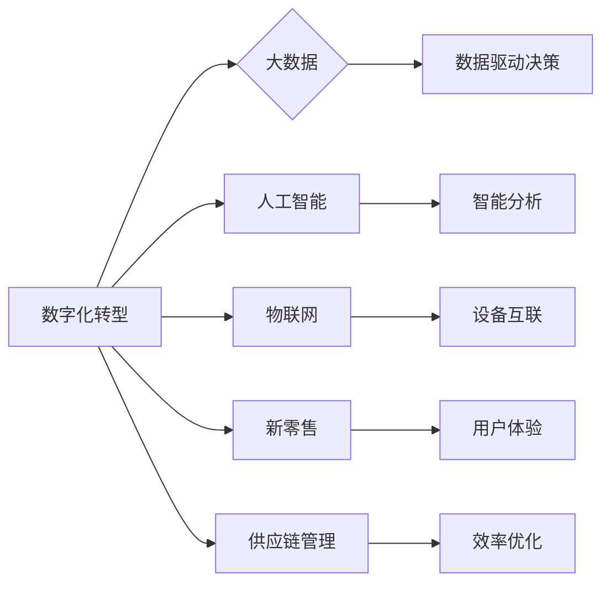

# 消费品行业从业经验分享

作者：禅与计算机程序设计艺术 / Zen and the Art of Computer Programming

## 1. 背景介绍
### 1.1 问题的由来

消费品行业是全球经济的重要组成部分，涵盖了食品、饮料、日用品、个人护理、家用电器等多个领域。随着科技的快速发展，尤其是在移动互联网、大数据、人工智能等技术的推动下，消费品行业正面临着前所未有的变革。如何利用信息技术提升效率、增强用户体验、拓展市场，成为众多消费品企业关注的焦点。

### 1.2 研究现状

近年来，消费品行业信息技术应用呈现出以下趋势：

1. **数字化转型加速**：越来越多的企业开始意识到数字化转型的重要性，积极投入资源进行信息化建设，以提升企业竞争力。
2. **数据驱动决策**：企业通过收集和分析海量数据，洞察市场趋势、用户需求，实现数据驱动决策。
3. **智能供应链管理**：利用物联网、人工智能等技术，实现供应链的智能化、高效化。
4. **个性化营销**：通过大数据和人工智能技术，实现精准营销，提升用户粘性。
5. **新零售模式兴起**：线上线下融合、无人零售、社区团购等新零售模式不断涌现，改变消费者购物习惯。

### 1.3 研究意义

研究消费品行业信息技术应用，对于推动行业转型升级、提升企业竞争力具有重要意义：

1. **促进产业升级**：信息技术应用有助于企业提高生产效率、降低成本，推动产业向高端化、智能化方向发展。
2. **提升用户体验**：通过信息技术，企业可以更好地了解用户需求，提供个性化、定制化的产品和服务。
3. **拓展市场空间**：信息技术应用有助于企业拓展线上线下渠道，扩大市场份额。
4. **提升企业竞争力**：信息化建设有助于企业提高管理水平和运营效率，增强市场竞争力。

### 1.4 本文结构

本文将从以下几个方面对消费品行业信息技术应用进行探讨：

- 第2部分，介绍消费品行业信息技术应用的核心概念和联系。
- 第3部分，阐述消费品行业信息技术应用的关键技术及发展趋势。
- 第4部分，分析消费品行业信息技术应用的实际案例。
- 第5部分，探讨消费品行业信息技术应用的未来发展趋势与挑战。
- 第6部分，推荐相关学习资源、开发工具和参考文献。
- 第7部分，总结全文，展望未来发展趋势。

## 2. 核心概念与联系

消费品行业信息技术应用涉及多个领域，以下列举几个核心概念：

- **数字化转型**：将企业的业务、管理、服务等各个方面进行数字化改造，以提升效率和竞争力。
- **大数据**：指规模巨大、类型多样的数据集合，通过对数据的采集、存储、处理和分析，为企业提供决策支持。
- **人工智能**：一种模拟人类智能行为的技术，包括机器学习、深度学习、自然语言处理等。
- **物联网**：将各种物体连接起来，实现信息交换和通信。
- **新零售**：线上线下融合、数据驱动的零售模式。
- **供应链管理**：对供应链的各个环节进行规划、协调和控制，以实现成本最小化和效率最大化。

这些概念之间存在紧密的联系，共同推动着消费品行业的数字化转型。以下为这些概念之间的逻辑关系图：

可以看出，数字化转型是推动其他技术发展的基础，大数据、人工智能、物联网等技术共同构成了数字化转型的关键技术。新零售和供应链管理则是在数字化转型背景下，针对不同业务领域的具体应用。

## 3. 核心技术 & 发展趋势
### 3.1 数字化转型

数字化转型是企业进行信息技术应用的基础，以下为数字化转型的主要方向：

1. **业务流程再造**：优化业务流程，提高效率，降低成本。
2. **信息系统建设**：建立完善的信息系统，实现业务流程的线上化、自动化。
3. **数据平台搭建**：构建数据平台，实现数据的采集、存储、处理和分析。
4. **人才队伍建设**：培养具备信息技术能力的人才，为企业数字化转型提供智力支持。

### 3.2 大数据

大数据在消费品行业信息技术应用中发挥着重要作用，以下为大数据的主要应用方向：

1. **市场趋势分析**：通过分析市场数据，洞察市场发展趋势，为企业制定市场策略提供依据。
2. **用户需求分析**：通过分析用户行为数据，了解用户需求，为企业产品研发和营销提供参考。
3. **供应链优化**：通过分析供应链数据，优化供应链流程，降低成本，提高效率。

### 3.3 人工智能

人工智能在消费品行业信息技术应用中发挥着越来越重要的作用，以下为人工智能的主要应用方向：

1. **智能客服**：通过自然语言处理技术，实现与用户的智能互动，提供个性化服务。
2. **智能推荐**：通过机器学习技术，为用户推荐个性化的产品和服务。
3. **智能分析**：通过数据挖掘和机器学习技术，分析企业运营数据，为企业决策提供支持。

### 3.4 物联网

物联网在消费品行业信息技术应用中主要用于以下场景：

1. **智能设备**：通过物联网技术，实现设备的互联互通，提高设备使用效率。
2. **智能工厂**：通过物联网技术，实现工厂的智能化生产，提高生产效率。
3. **智能物流**：通过物联网技术，实现物流运输的实时监控和管理。

### 3.5 新零售

新零售是近年来兴起的一种零售模式，以下为新零售的主要特点：

1. **线上线下融合**：线上线下一体化，为用户提供更加便捷的购物体验。
2. **数据驱动**：通过数据分析，实现精准营销和个性化服务。
3. **体验式购物**：通过场景化和体验式设计，提升用户体验。

### 3.6 供应链管理

供应链管理在消费品行业信息技术应用中主要用于以下方面：

1. **库存管理**：通过信息化手段，实现库存的实时监控和优化。
2. **物流管理**：通过物联网技术，实现物流运输的实时监控和管理。
3. **质量管理**：通过质量管理系统，确保产品质量。

## 4. 实际应用案例
### 4.1 案例一：某知名快消品企业数字化转型

该企业通过以下措施实现数字化转型：

1. **业务流程再造**：优化供应链管理流程，提高生产效率。
2. **信息系统建设**：建立完善的信息系统，实现业务流程的线上化、自动化。
3. **数据平台搭建**：构建数据平台，实现数据的采集、存储、处理和分析。
4. **人才队伍建设**：培养具备信息技术能力的人才，为企业数字化转型提供智力支持。

通过数字化转型，该企业实现了以下成果：

1. **生产效率提升**：生产效率提高了20%，降低了生产成本。
2. **库存周转率提升**：库存周转率提高了30%，降低了库存成本。
3. **销售额增长**：销售额增长了15%，提升了市场竞争力。

### 4.2 案例二：某电商平台智能推荐系统

该电商平台通过以下措施构建智能推荐系统：

1. **用户行为数据采集**：采集用户浏览、购买、评价等行为数据。
2. **用户画像构建**：根据用户行为数据，构建用户画像。
3. **推荐算法设计**：设计基于协同过滤、内容推荐等算法的推荐系统。

通过智能推荐系统，该电商平台实现了以下成果：

1. **用户粘性提升**：用户活跃度提升了30%，用户满意度提高了20%。
2. **销售额增长**：销售额增长了10%，提升了市场竞争力。
3. **商品推荐精准度提升**：商品推荐精准度提高了20%，降低了用户流失率。

## 5. 未来发展趋势与挑战
### 5.1 未来发展趋势

消费品行业信息技术应用将呈现以下发展趋势：

1. **技术融合**：信息技术与大数据、人工智能、物联网等技术的融合将更加紧密，形成更加智能化的解决方案。
2. **个性化定制**：根据用户需求，提供个性化、定制化的产品和服务。
3. **跨界融合**：消费品行业与其他行业的融合将更加紧密，形成新的商业模式。
4. **绿色发展**：关注环保、可持续发展，推动绿色消费。

### 5.2 面临的挑战

消费品行业信息技术应用也面临以下挑战：

1. **数据安全和隐私保护**：如何保障用户数据安全和隐私保护将成为重要挑战。
2. **技术人才短缺**：具备信息技术能力的人才短缺将制约行业发展。
3. **技术伦理**：如何避免技术滥用、技术歧视等问题需要引起重视。
4. **市场竞争**：随着信息技术应用的普及，市场竞争将更加激烈。

## 6. 工具和资源推荐
### 6.1 学习资源推荐

1. **书籍**：《消费行为学》、《大数据营销》、《人工智能与商业决策》等。
2. **在线课程**：Coursera、edX、Udacity等平台上的相关课程。
3. **技术社区**：CSDN、博客园、知乎等。

### 6.2 开发工具推荐

1. **开发框架**：Spring Boot、Django等。
2. **数据分析工具**：Python、R、Tableau等。
3. **机器学习平台**：TensorFlow、PyTorch、Scikit-learn等。

### 6.3 相关论文推荐

1. **大数据**：《大数据时代》、《数据挖掘：概念与技术》等。
2. **人工智能**：《深度学习》、《机器学习》等。
3. **物联网**：《物联网技术》等。

### 6.4 其他资源推荐

1. **行业报告**：艾瑞咨询、赛迪顾问等。
2. **技术社区**：GitHub、Stack Overflow等。

## 7. 总结：未来发展趋势与挑战

消费品行业信息技术应用正在推动行业转型升级，为消费者带来更加便捷、高效、个性化的产品和服务。未来，随着技术的不断发展和应用场景的不断拓展，消费品行业信息技术应用将呈现以下趋势：

1. **技术融合**：信息技术与大数据、人工智能、物联网等技术的融合将更加紧密，形成更加智能化的解决方案。
2. **个性化定制**：根据用户需求，提供个性化、定制化的产品和服务。
3. **跨界融合**：消费品行业与其他行业的融合将更加紧密，形成新的商业模式。
4. **绿色发展**：关注环保、可持续发展，推动绿色消费。

然而，消费品行业信息技术应用也面临以下挑战：

1. **数据安全和隐私保护**：如何保障用户数据安全和隐私保护将成为重要挑战。
2. **技术人才短缺**：具备信息技术能力的人才短缺将制约行业发展。
3. **技术伦理**：如何避免技术滥用、技术歧视等问题需要引起重视。
4. **市场竞争**：随着信息技术应用的普及，市场竞争将更加激烈。

面对这些挑战，企业和从业者需要不断学习新知识、新技术，提升自身能力，以适应行业发展需求。同时，政府和社会各界也应关注技术伦理、数据安全等问题，推动消费品行业信息技术应用的健康发展。

---

作者：禅与计算机程序设计艺术 / Zen and the Art of Computer Programming