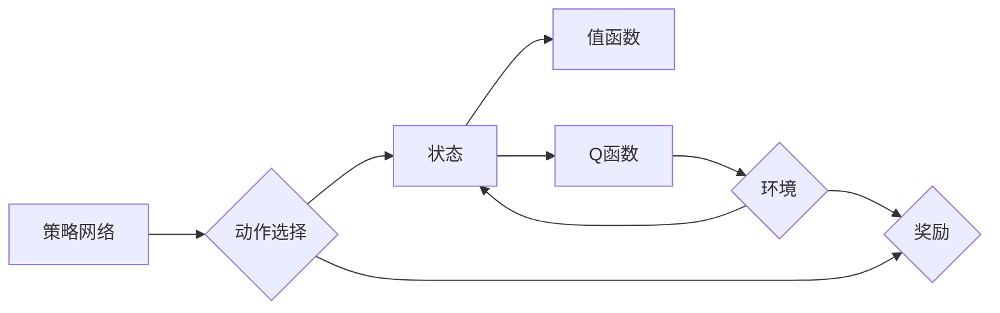

# 深度强化学习(Deep Reinforcement Learning) - 原理与代码实例讲解

作者：禅与计算机程序设计艺术 / Zen and the Art of Computer Programming

## 1. 背景介绍
### 1.1 问题的由来

在人工智能领域，强化学习（Reinforcement Learning，RL）是一种重要的机器学习方法，旨在通过与环境交互，使智能体（Agent）学习到最优策略。传统的强化学习方法通常依赖于简单的策略，如Q-learning和SARSA等，这些方法在处理复杂环境时存在局限性。

随着深度学习技术的快速发展，深度强化学习（Deep Reinforcement Learning，DRL）应运而生。DRL将深度学习的强大表示能力与强化学习的决策能力相结合，使得智能体能够在复杂环境中学习到更复杂的策略。

### 1.2 研究现状

近年来，DRL在多个领域取得了显著的成果，包括游戏、机器人、自动驾驶、自然语言处理等。其中，一些经典的DRL算法，如Deep Q-Network（DQN）、Proximal Policy Optimization（PPO）、Actor-Critic方法等，已经在多个任务上达到了或超越了人类的表现。

### 1.3 研究意义

DRL的研究意义主要体现在以下几个方面：

1. **解决复杂决策问题**：DRL能够使智能体在复杂环境中学习到最优策略，从而解决传统强化学习难以处理的复杂决策问题。
2. **提高智能体决策能力**：通过深度神经网络的学习，DRL能够使智能体的决策能力得到显著提高，使其在面对未知环境时能够做出更合理的决策。
3. **推动人工智能应用**：DRL在多个领域的应用，如自动驾驶、机器人等，有助于推动人工智能技术的产业化进程。

### 1.4 本文结构

本文将分为以下几个部分：

- 第2部分：介绍DRL的核心概念与联系。
- 第3部分：详细讲解DRL的核心算法原理和具体操作步骤。
- 第4部分：介绍DRL的数学模型和公式，并结合实例进行讲解。
- 第5部分：通过代码实例和详细解释说明，展示DRL的实际应用。
- 第6部分：探讨DRL在实际应用场景中的表现和未来应用展望。
- 第7部分：推荐DRL相关的学习资源、开发工具和参考文献。
- 第8部分：总结DRL的未来发展趋势和挑战。
- 第9部分：附录，包括常见问题与解答。

## 2. 核心概念与联系

### 2.1 智能体(Agent)

智能体是DRL中的基本实体，它根据环境状态选择动作，并从环境中获得奖励，旨在最大化其长期奖励总和。

### 2.2 环境(Environment)

环境是智能体进行决策的场所，它提供当前状态、奖励和下一步的状态信息。

### 2.3 状态(State)

状态是描述环境当前状态的属性集合，通常用向量表示。

### 2.4 动作(Action)

动作是智能体根据当前状态所采取的行动，通常用向量表示。

### 2.5 奖励(Reward)

奖励是环境对智能体采取的动作的反馈，通常表示为实数值。

### 2.6 策略(Policy)

策略是智能体在给定状态下的动作选择规则，通常用函数表示。

### 2.7 值函数(Values)

值函数表示智能体在当前状态下采取特定动作的长期预期奖励。

### 2.8 Q函数(Q-Function)

Q函数表示智能体在给定状态和动作下的长期预期奖励，可以看作是值函数的一种扩展。

以下是DRL中各个概念之间的逻辑关系：

```mermaid
graph LR
    A[智能体(Agent)] --> B{环境(Environment)}
    B --> C{状态(State)}
    B --> D{奖励(Reward)}
    B --> E{下一步状态}
    C --> F{动作(Action)}
    C --> G{策略(Policy)}
    D --> A
    E --> C
    F --> B
```

## 3. 核心算法原理 & 具体操作步骤
### 3.1 算法原理概述

DRL的核心思想是：智能体通过与环境的交互，不断学习到最优策略，以最大化长期奖励总和。具体来说，DRL包括以下步骤：

1. 初始化智能体、环境和策略。
2. 智能体根据当前状态选择动作。
3. 环境根据智能体采取的动作生成奖励和下一步状态。
4. 智能体根据当前状态、奖励和下一步状态更新策略。
5. 重复步骤2-4，直到满足终止条件。

### 3.2 算法步骤详解

以下是DRL的详细操作步骤：

**Step 1：初始化**

- 初始化智能体、环境和策略。
- 策略可以是确定性策略或概率性策略。
- 环境可以是仿真环境或真实环境。

**Step 2：选择动作**

- 智能体根据当前状态和策略选择动作。
- 对于确定性策略，智能体在给定状态下只采取一个动作。
- 对于概率性策略，智能体在给定状态下采取动作的概率分布。

**Step 3：更新奖励和状态**

- 环境根据智能体采取的动作生成奖励和下一步状态。
- 奖励可以是正数、负数或0，表示智能体采取的动作对环境的贡献。

**Step 4：更新策略**

- 智能体根据当前状态、奖励和下一步状态更新策略。
- 更新策略的方法可以是值函数更新、策略更新或Q函数更新。

**Step 5：终止条件**

- 当满足终止条件时，DRL过程结束。
- 终止条件可以是达到最大步数、获得足够奖励等。

### 3.3 算法优缺点

DRL算法具有以下优点：

1. **自适应性**：DRL能够根据环境变化自适应地调整策略。
2. **可扩展性**：DRL可以应用于各种复杂环境。
3. **通用性**：DRL可以应用于各种决策问题。

DRL算法的缺点如下：

1. **收敛速度慢**：DRL算法可能需要大量的迭代次数才能收敛到最优策略。
2. **样本效率低**：DRL算法需要大量的样本才能学习到有效的策略。
3. **难以解释**：DRL算法的决策过程难以解释。

### 3.4 算法应用领域

DRL算法在多个领域取得了显著的应用成果，包括：

- **游戏**：DRL算法可以用于游戏AI，如围棋、国际象棋等。
- **机器人**：DRL算法可以用于机器人控制，如无人驾驶、机器人导航等。
- **自动驾驶**：DRL算法可以用于自动驾驶系统，提高自动驾驶的安全性。
- **自然语言处理**：DRL算法可以用于自然语言处理任务，如机器翻译、文本摘要等。

## 4. 数学模型和公式 & 详细讲解 & 举例说明
### 4.1 数学模型构建

DRL的数学模型主要包括：

1. **策略网络**：策略网络用于根据当前状态选择动作，通常用函数 $ \pi(s) $ 表示。
2. **值函数**：值函数表示智能体在给定状态下的长期预期奖励，通常用函数 $ V(s) $ 表示。
3. **Q函数**：Q函数表示智能体在给定状态和动作下的长期预期奖励，通常用函数 $ Q(s, a) $ 表示。

以下是DRL的数学模型：



### 4.2 公式推导过程

以下是DRL中一些重要公式的推导过程：

1. **策略迭代**：策略迭代是DRL中一种常见的策略更新方法，其公式如下：

   $$
 \pi_{t+1}(s) = \arg\max_{a} \pi_t(s) Q(s, a)
 $$

2. **Q学习**：Q学习是DRL中一种基于值函数的算法，其公式如下：

   $$
 Q(s, a) = \frac{1}{N} \sum_{i=1}^N (r_i + \gamma \max_{a'} Q(s', a'))
 $$

   其中，$ r_i $ 表示在第 $ i $ 个时间步获得的奖励，$ \gamma $ 表示折扣因子。

3. **SARSA**：SARSA是DRL中一种基于策略的算法，其公式如下：

   $$
 Q(s, a) = Q(s, a) + \alpha [r + \gamma \max_{a'} Q(s', a') - Q(s, a)]
 $$

   其中，$ \alpha $ 表示学习率。

### 4.3 案例分析与讲解

以下以无人驾驶为例，讲解DRL在自动驾驶中的应用。

假设自动驾驶车辆的驾驶环境如下：

- 状态空间：当前车辆位置、速度、方向、周围车辆位置、道路情况等。
- 动作空间：加速、减速、转向等。
- 奖励函数：根据行驶安全、行驶效率、行驶距离等指标计算奖励。

使用DRL算法对自动驾驶车辆进行训练，使其能够自主驾驶。

### 4.4 常见问题解答

**Q1：DRL算法的收敛速度慢，如何提高收敛速度？**

A1：提高收敛速度的方法包括：

- 使用更高效的优化算法，如Adam、RMSprop等。
- 增加学习率，但要避免过拟合。
- 使用经验回放技术，提高样本利用率。

**Q2：DRL算法的样本效率低，如何提高样本效率？**

A2：提高样本效率的方法包括：

- 使用数据增强技术，如随机裁剪、翻转等。
- 使用转移学习技术，利用已有模型的先验知识。
- 使用多智能体强化学习技术，提高样本利用率。

**Q3：DRL算法的决策过程难以解释，如何提高可解释性？**

A3：提高可解释性的方法包括：

- 使用可解释的神经网络结构，如LSTM、GRU等。
- 使用可视化技术，如注意力机制可视化等。
- 使用因果分析技术，分析模型决策过程。

## 5. 项目实践：代码实例和详细解释说明
### 5.1 开发环境搭建

为了进行DRL的实践，我们需要搭建以下开发环境：

1. Python 3.7及以上版本
2. TensorFlow或PyTorch深度学习框架
3. Gym环境库

以下是使用PyTorch实现DRL的代码示例：

```python
import gym
import torch
import torch.nn as nn
import torch.optim as optim

# 创建环境
env = gym.make('CartPole-v0')

# 定义网络结构
class DQN(nn.Module):
    def __init__(self):
        super(DQN, self).__init__()
        self.fc1 = nn.Linear(4, 24)
        self.fc2 = nn.Linear(24, 24)
        self.fc3 = nn.Linear(24, 2)

    def forward(self, x):
        x = torch.relu(self.fc1(x))
        x = torch.relu(self.fc2(x))
        x = self.fc3(x)
        return x

# 初始化网络和优化器
model = DQN()
optimizer = optim.Adam(model.parameters(), lr=0.001)

# 定义损失函数
loss_fn = nn.MSELoss()

# 训练DQN
def train_dqn(model, optimizer, loss_fn, episodes=1000):
    for episode in range(episodes):
        state = env.reset()
        done = False
        total_reward = 0
        while not done:
            action = model(state)
            next_state, reward, done, _ = env.step(action)
            total_reward += reward
            next_state = torch.tensor(next_state, dtype=torch.float32).unsqueeze(0)
            state = torch.tensor(state, dtype=torch.float32).unsqueeze(0)
            reward = torch.tensor(reward, dtype=torch.float32).unsqueeze(0)
            q_values = model(state)
            target = reward + 0.99 * torch.max(model(next_state))
            loss = loss_fn(q_values, target)
            optimizer.zero_grad()
            loss.backward()
            optimizer.step()
            state = next_state
        print(f"Episode {episode}, total reward: {total_reward}")

# 运行训练
train_dqn(model, optimizer, loss_fn)
```

### 5.2 源代码详细实现

以上代码展示了使用PyTorch实现DQN算法的完整过程。

1. **导入相关库**：导入gym库创建环境，导入PyTorch相关库构建网络、优化器和损失函数。
2. **创建环境**：使用gym库创建CartPole-v0环境，该环境是一个经典的强化学习环境。
3. **定义网络结构**：定义一个三层全连接神经网络，用于预测Q值。
4. **初始化网络、优化器和损失函数**：初始化网络、优化器和损失函数，为训练做准备。
5. **训练DQN**：定义训练函数，训练DQN模型。在训练过程中，智能体根据网络预测的Q值选择动作，并根据环境反馈的奖励和下一步状态更新Q值。

### 5.3 代码解读与分析

以上代码中，我们定义了一个DQN模型，并使用PyTorch框架进行训练。以下是代码的关键部分：

- `DQN`类：定义了一个三层全连接神经网络，用于预测Q值。
- `train_dqn`函数：定义了训练函数，用于训练DQN模型。在训练过程中，智能体根据网络预测的Q值选择动作，并根据环境反馈的奖励和下一步状态更新Q值。

通过以上代码，我们可以看到DQN算法的简单实现过程。

### 5.4 运行结果展示

运行以上代码，我们可以观察到DQN模型在CartPole-v0环境中的训练过程。经过一定次数的训练，模型能够学会稳定地完成任务。

## 6. 实际应用场景
### 6.1 游戏AI

DRL在游戏AI领域取得了显著的应用成果，例如：

- **AlphaGo**：AlphaGo是DeepMind开发的围棋AI程序，它使用DRL算法战胜了世界围棋冠军李世石。
- **AlphaFold**：AlphaFold是DeepMind开发的蛋白质折叠预测程序，它使用DRL算法预测蛋白质的三维结构。

### 6.2 机器人

DRL在机器人领域也取得了显著的应用成果，例如：

- **DeepMind Robotics**：DeepMind Robotics团队使用DRL算法训练机器人完成各种任务，如抓取、搬运等。
- **Google Research**：Google Research团队使用DRL算法训练机器人完成复杂的机器人任务，如爬楼梯、行走等。

### 6.3 自动驾驶

DRL在自动驾驶领域也取得了显著的应用成果，例如：

- **Waymo**：Waymo是Google开发的自动驾驶汽车，它使用DRL算法实现自动驾驶功能。
- **Aurora**：Aurora是Uber开发的自动驾驶汽车，它使用DRL算法实现自动驾驶功能。

### 6.4 未来应用展望

随着DRL技术的不断发展，未来DRL将在更多领域得到应用，例如：

- **自然语言处理**：DRL可以用于自然语言处理任务，如机器翻译、文本摘要等。
- **医疗诊断**：DRL可以用于医疗诊断任务，如疾病检测、疾病预测等。
- **金融分析**：DRL可以用于金融分析任务，如股票预测、风险控制等。

## 7. 工具和资源推荐
### 7.1 学习资源推荐

以下是DRL学习资源推荐：

1. 《深度强化学习》书籍：由David Silver、Alex Graves和George Hinton合著，是DRL领域的经典教材。
2. DeepMind官方博客：DeepMind官方博客提供了大量DRL相关的研究成果和应用案例。
3. OpenAI官网：OpenAI官网提供了大量DRL相关的研究成果和应用案例。
4. Gym环境库：Gym是一个开源的强化学习环境库，提供了丰富的仿真环境。

### 7.2 开发工具推荐

以下是DRL开发工具推荐：

1. TensorFlow：TensorFlow是Google开发的深度学习框架，提供了丰富的DRL工具和库。
2. PyTorch：PyTorch是Facebook开发的深度学习框架，提供了丰富的DRL工具和库。
3. OpenAI Gym：OpenAI Gym是一个开源的强化学习环境库，提供了丰富的仿真环境。
4. stable_baselines：stable_baselines是一个开源的DRL库，提供了多种DRL算法的实现。

### 7.3 相关论文推荐

以下是DRL相关论文推荐：

1. **Deep Q-Networks (DQN)**: 由DeepMind开发的DQN算法，是DRL领域的里程碑式论文。
2. **Human-Level Control through Deep Reinforcement Learning**: 由DeepMind开发的AlphaGo算法，展示了DRL在游戏领域的强大能力。
3. **Proximal Policy Optimization (PPO)**: 由OpenAI开发的PPO算法，是DRL领域的一种高效算法。
4. **Soft Actor-Critic (SAC)**: 由Google开发的SAC算法，是DRL领域的一种新型算法。

### 7.4 其他资源推荐

以下是DRL其他资源推荐：

1. **arXiv**：arXiv是一个学术论文预印本平台，提供了大量DRL领域的最新研究成果。
2. **GitHub**：GitHub是一个开源代码平台，提供了大量DRL相关的开源代码和项目。
3. **Kaggle**：Kaggle是一个数据科学竞赛平台，提供了大量DRL相关的竞赛和项目。

## 8. 总结：未来发展趋势与挑战
### 8.1 研究成果总结

本文对深度强化学习（DRL）进行了全面系统的介绍。首先阐述了DRL的研究背景和意义，明确了DRL在解决复杂决策问题、提高智能体决策能力、推动人工智能应用等方面的价值。其次，从原理到实践，详细讲解了DRL的核心算法原理、具体操作步骤、数学模型和公式，并结合实例进行了讲解。同时，本文还探讨了DRL在实际应用场景中的表现和未来应用展望。此外，本文还推荐了DRL相关的学习资源、开发工具和参考文献，为读者提供了全面的技术指引。

通过本文的系统梳理，可以看到，DRL作为一种新兴的人工智能技术，已经取得了显著的成果，并在多个领域得到了广泛应用。然而，DRL技术仍面临诸多挑战，如收敛速度慢、样本效率低、难以解释等。未来，随着DRL技术的不断发展和完善，相信DRL将在更多领域得到应用，为人类社会带来更多便利。

### 8.2 未来发展趋势

以下是DRL的未来发展趋势：

1. **模型规模持续增大**：随着算力的提升和数据的积累，DRL模型的规模将不断增大，以更好地学习复杂环境。
2. **算法效率提高**：为了应对实际应用中的计算资源限制，DRL算法将朝着低能耗、低延迟的方向发展。
3. **多智能体强化学习**：多智能体强化学习（Multi-Agent Reinforcement Learning，MARL）将成为DRL的一个重要研究方向，旨在解决多智能体协同决策问题。
4. **无模型强化学习**：无模型强化学习（Model-Free Reinforcement Learning）将逐渐取代基于模型的方法，以降低对环境模型的依赖。
5. **安全强化学习**：随着DRL在关键领域的应用，安全强化学习（Safe Reinforcement Learning）将得到越来越多的关注，以确保DRL系统的安全性。

### 8.3 面临的挑战

以下是DRL面临的挑战：

1. **收敛速度慢**：DRL算法需要大量的样本和迭代次数才能收敛到最优策略，如何提高收敛速度是一个重要挑战。
2. **样本效率低**：DRL算法需要大量的样本才能学习到有效的策略，如何提高样本效率是一个重要挑战。
3. **难以解释**：DRL算法的决策过程难以解释，如何提高可解释性是一个重要挑战。
4. **安全性问题**：DRL算法在关键领域的应用需要确保系统的安全性，如何保证DRL系统的安全性是一个重要挑战。
5. **伦理和道德问题**：DRL算法的应用需要考虑伦理和道德问题，如何确保DRL算法的应用符合伦理和道德规范是一个重要挑战。

### 8.4 研究展望

为了应对DRL面临的挑战，未来的研究需要在以下几个方面进行：

1. **开发高效算法**：研究高效的DRL算法，提高收敛速度和样本效率。
2. **提高可解释性**：研究可解释的DRL算法，使DRL算法的决策过程更加透明。
3. **保证安全性**：研究安全DRL算法，确保DRL系统的安全性。
4. **解决伦理和道德问题**：研究符合伦理和道德规范的DRL算法，确保DRL算法的应用符合人类价值观。

相信通过不断的研究和探索，DRL技术必将迎来更加美好的未来。

## 9. 附录：常见问题与解答

**Q1：什么是强化学习？**

A1：强化学习是一种机器学习方法，旨在通过与环境交互，使智能体学习到最优策略。

**Q2：什么是深度强化学习？**

A2：深度强化学习是将深度学习与强化学习相结合，利用深度神经网络学习状态、动作和奖励之间的关系。

**Q3：DRL的常用算法有哪些？**

A3：DRL的常用算法包括DQN、PPO、SAC、Soft actor-critic等。

**Q4：DRL在实际应用中面临哪些挑战？**

A4：DRL在实际应用中面临的挑战包括收敛速度慢、样本效率低、难以解释、安全性问题、伦理和道德问题等。

**Q5：如何提高DRL算法的收敛速度？**

A5：提高DRL算法的收敛速度的方法包括使用更高效的优化算法、增加学习率、使用经验回放技术等。

**Q6：如何提高DRL算法的样本效率？**

A6：提高DRL算法的样本效率的方法包括使用数据增强技术、使用转移学习技术、使用多智能体强化学习技术等。

**Q7：如何提高DRL算法的可解释性？**

A7：提高DRL算法的可解释性的方法包括使用可解释的神经网络结构、使用可视化技术、使用因果分析技术等。

**Q8：如何保证DRL系统的安全性？**

A8：保证DRL系统的安全性的方法包括使用安全DRL算法、进行安全测试和验证、建立监管机制等。

**Q9：如何确保DRL算法的应用符合伦理和道德规范？**

A9：确保DRL算法的应用符合伦理和道德规范的方法包括建立伦理和道德规范、进行伦理和道德评估、进行社会影响评估等。

**Q10：DRL技术的未来发展趋势是什么？**

A10：DRL技术的未来发展趋势包括模型规模持续增大、算法效率提高、多智能体强化学习、无模型强化学习、安全强化学习等。

通过以上常见问题与解答，相信读者对深度强化学习有了更深入的了解。