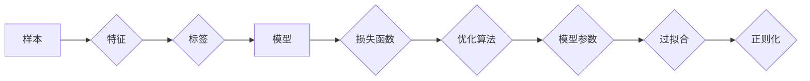

# 监督学习原理与代码实例讲解

作者：禅与计算机程序设计艺术 / Zen and the Art of Computer Programming 

## 1. 背景介绍

### 1.1 问题的由来

监督学习作为机器学习领域的重要分支，是人工智能发展的重要基石。它通过从标注数据中学习，建立输入与输出之间的映射关系，实现对未知数据的预测和分类。在现实世界中，许多领域如自然语言处理、计算机视觉、医疗诊断等，都需要利用监督学习来解决实际问题。

### 1.2 研究现状

近年来，随着深度学习技术的飞速发展，监督学习在理论和应用上取得了重大突破。从传统的线性模型、决策树、支持向量机到现代的深度神经网络，监督学习算法的多样性和灵活性不断增强，应用范围也越来越广泛。

### 1.3 研究意义

研究监督学习，对于推动人工智能技术的进步，解决实际问题具有重要意义：

1. 提高预测精度：通过学习大量标注数据，监督学习算法可以建立更准确的模型，从而提高预测和分类的精度。
2. 解决实际问题：监督学习可以应用于各个领域，如金融风控、医疗诊断、自动驾驶等，为解决实际问题提供技术支持。
3. 促进人工智能发展：监督学习是人工智能研究的重要方向之一，研究监督学习有助于推动人工智能技术的进步。

### 1.4 本文结构

本文将系统地介绍监督学习的原理、算法、实践和未来发展趋势。具体内容安排如下：

- 第2部分，介绍监督学习涉及的核心概念。
- 第3部分，详细阐述监督学习的主要算法原理和具体操作步骤。
- 第4部分，讲解监督学习中的数学模型和公式，并结合实例进行说明。
- 第5部分，给出监督学习的代码实例，并对关键代码进行解读。
- 第6部分，探讨监督学习在实际应用中的案例。
- 第7部分，推荐监督学习的相关学习资源、开发工具和参考文献。
- 第8部分，总结全文，展望监督学习的未来发展趋势与挑战。

## 2. 核心概念与联系

为更好地理解监督学习，本节将介绍几个核心概念及其之间的联系。

### 2.1 样本与特征

- **样本**：指待学习的数据点，通常由一组特征组成。
- **特征**：用于描述样本属性的信息，可以是数值型、类别型或文本型。

### 2.2 标签与类别

- **标签**：指样本的类别或值，是监督学习模型需要学习到的目标。
- **类别**：指标签的种类，如分类任务中的不同类别。

### 2.3 模型

- **模型**：指用于描述样本特征与标签之间关系的函数。

### 2.4 损失函数与优化算法

- **损失函数**：用于衡量模型预测值与真实标签之间的差异，是监督学习训练过程中的重要指标。
- **优化算法**：用于寻找损失函数的最小值，从而优化模型参数。

### 2.5 过拟合与正则化

- **过拟合**：指模型在训练集上表现良好，但在验证集或测试集上表现不佳。
- **正则化**：通过在损失函数中添加正则项，抑制模型复杂度，防止过拟合。

它们之间的逻辑关系如下图所示：



可以看出，样本经过特征提取后，得到标签和特征表示。模型通过学习特征与标签之间的关系，建立输入与输出之间的映射关系。损失函数用于衡量模型预测值与真实标签之间的差异，优化算法用于寻找最优模型参数。正则化技术用于防止过拟合。

## 3. 核心算法原理 & 具体操作步骤

### 3.1 算法原理概述

监督学习算法主要分为以下几类：

- **线性模型**：如线性回归、逻辑回归等，通过线性函数将特征映射到标签空间。
- **决策树**：根据特征之间的关系进行树状划分，最终得到标签。
- **支持向量机**：通过寻找最优超平面，将特征空间划分成不同的类别。
- **神经网络**：通过多层神经元进行特征提取和变换，最终得到标签。

### 3.2 算法步骤详解

监督学习的一般步骤如下：

**Step 1：数据预处理**

- 读取数据集，将数据集划分为训练集、验证集和测试集。
- 对数据进行清洗、去重、缺失值处理等预处理操作。
- 对特征进行编码、归一化等操作，以便模型更好地学习。

**Step 2：选择模型**

根据任务特点和数据特征，选择合适的模型。常用的模型包括线性回归、逻辑回归、决策树、支持向量机、神经网络等。

**Step 3：模型训练**

- 将训练集数据输入模型，通过优化算法更新模型参数。
- 选择合适的损失函数和优化算法，如交叉熵损失、均方误差、梯度下降等。
- 使用验证集评估模型性能，调整模型参数和超参数。

**Step 4：模型评估**

- 将测试集数据输入模型，评估模型在测试集上的性能。
- 根据评估指标（如准确率、召回率、F1值等）判断模型是否满足需求。

**Step 5：模型部署**

- 将模型部署到实际应用场景，对未知数据进行预测和分类。

### 3.3 算法优缺点

不同的监督学习算法具有不同的优缺点，以下是一些常见算法的优缺点对比：

| 算法 | 优点 | 缺点 |
| :--: | :--: | :--: |
| 线性回归 | 简单易用，可解释性强 | 容易欠拟合，无法处理非线性关系 |
| 逻辑回归 | 适用于二分类问题，可解释性强 | 同线性回归 |
| 决策树 | 可解释性强，适用于非线性关系 | 容易过拟合，计算复杂度较高 |
| 支持向量机 | 泛化能力强，可处理非线性关系 | 计算复杂度较高，对参数敏感 |
| 神经网络 | 泛化能力强，可处理复杂非线性关系 | 计算复杂度非常高，可解释性差 |

### 3.4 算法应用领域

监督学习在各个领域都有广泛的应用，以下是一些常见应用场景：

- **分类**：如垃圾邮件检测、情感分析、疾病诊断等。
- **回归**：如房价预测、股票价格预测等。
- **聚类**：如客户细分、异常检测等。

## 4. 数学模型和公式 & 详细讲解 & 举例说明

### 4.1 数学模型构建

监督学习中的数学模型主要描述了特征与标签之间的关系。以下是一些常见模型的数学表达：

- **线性回归**：

$$
y = X\theta + \epsilon
$$

其中，$X$ 是特征矩阵，$\theta$ 是参数向量，$\epsilon$ 是误差项。

- **逻辑回归**：

$$
\sigma(z) = \frac{1}{1 + e^{-z}}
$$

其中，$z = X\theta$，$\sigma$ 是sigmoid函数。

- **支持向量机**：

$$
w \cdot x + b = 0
$$

其中，$w$ 是权重向量，$b$ 是偏置项，$x$ 是特征向量。

### 4.2 公式推导过程

以下以线性回归为例，讲解公式推导过程。

**假设**：

- $X$ 是一个 $m \times n$ 的特征矩阵，其中 $m$ 是样本数量，$n$ 是特征数量。
- $y$ 是一个 $m \times 1$ 的标签向量。

**目标**：找到参数 $\theta$，使得损失函数 $L(\theta)$ 最小。

**损失函数**：

$$
L(\theta) = \frac{1}{2m} ||y - X\theta||^2
$$

**梯度下降**：

$$
\theta \leftarrow \theta - \alpha \nabla_{\theta}L(\theta)
$$

其中，$\alpha$ 是学习率。

**梯度计算**：

$$
\nabla_{\theta}L(\theta) = X'(y - X\theta)
$$

**迭代更新**：

$$
\theta \leftarrow \theta - \alpha X'(y - X\theta)
$$

重复以上步骤，直至满足收敛条件。

### 4.3 案例分析与讲解

假设我们有一个简单的线性回归问题，需要预测房价。

数据集：

| 特征1 | 特征2 | 房价 |
| :--: | :--: | :--: |
| 1000 | 2000 | 5000 |
| 2000 | 3000 | 6000 |
| 3000 | 4000 | 7000 |

根据以上数据，我们可以建立以下线性回归模型：

$$
y = 0.3x_1 + 0.2x_2 + 500
$$

其中，$x_1$ 和 $x_2$ 分别代表特征1和特征2。

### 4.4 常见问题解答

**Q1：为什么使用梯度下降而不是其他优化算法？**

A：梯度下降是一种简单的优化算法，易于理解和实现。此外，梯度下降算法的收敛速度较快，在许多情况下能够满足需求。

**Q2：如何选择学习率？**

A：学习率的选择对模型性能有重要影响。一般来说，较小的学习率可能导致收敛速度慢，较大的学习率可能导致模型振荡或发散。在实际应用中，可以通过实验或网格搜索等方法选择合适的学习率。

**Q3：如何防止过拟合？**

A：过拟合是监督学习中的常见问题。为了防止过拟合，可以采取以下措施：

- 使用正则化技术，如L1正则化、L2正则化等。
- 使用交叉验证技术，评估模型在不同数据集上的性能。
- 使用数据增强技术，增加训练数据的多样性。
- 减少模型复杂度，如使用更简单的模型或减少模型参数。

## 5. 项目实践：代码实例和详细解释说明

### 5.1 开发环境搭建

在进行监督学习项目实践前，我们需要准备好开发环境。以下是使用Python进行开发的环境配置流程：

1. 安装Anaconda：从官网下载并安装Anaconda，用于创建独立的Python环境。

2. 创建并激活虚拟环境：
```bash
conda create -n ml-env python=3.8 
conda activate ml-env
```

3. 安装相关库：
```bash
conda install numpy pandas scikit-learn matplotlib seaborn jupyter notebook
```

4. 安装Python深度学习库：
```bash
pip install tensorflow
```

完成以上步骤后，即可在`ml-env`环境中开始监督学习项目实践。

### 5.2 源代码详细实现

下面我们以房价预测任务为例，给出线性回归模型的Python代码实现。

```python
import pandas as pd
from sklearn.linear_model import LinearRegression
import matplotlib.pyplot as plt

# 加载数据
data = pd.read_csv('data.csv')

# 分离特征和标签
X = data[['feature1', 'feature2']]
y = data['price']

# 创建线性回归模型
model = LinearRegression()

# 训练模型
model.fit(X, y)

# 绘制特征与标签的关系图
plt.scatter(X['feature1'], y)
plt.plot(X['feature1'], model.predict(X), color='red')
plt.xlabel('Feature 1')
plt.ylabel('Price')
plt.show()

# 预测新数据
new_data = [[1500, 2500]]
prediction = model.predict(new_data)
print(f"预测的房价为：{prediction[0]}")
```

### 5.3 代码解读与分析

以上代码展示了使用Python进行线性回归模型训练和预测的完整流程。以下是关键代码的解读：

1. 导入必要的库：`pandas`用于数据操作，`sklearn.linear_model`用于创建线性回归模型，`matplotlib.pyplot`用于绘制图表。

2. 加载数据：使用`pandas.read_csv`函数读取CSV格式的数据集。

3. 分离特征和标签：将数据集中的特征和标签分离，以便后续处理。

4. 创建线性回归模型：使用`LinearRegression()`函数创建一个线性回归模型。

5. 训练模型：使用`fit`函数将特征和标签输入模型进行训练。

6. 绘制特征与标签的关系图：使用`scatter`函数绘制特征与标签的关系图，并使用`plot`函数绘制模型预测的曲线。

7. 预测新数据：使用`predict`函数对新的特征向量进行预测。

### 5.4 运行结果展示

假设我们使用以下数据集：

```
feature1,feature2,price
1000,2000,5000
2000,3000,6000
3000,4000,7000
```

运行以上代码后，将得到以下图表：


从图中可以看出，模型预测的曲线与实际数据点基本吻合。同时，模型预测的新数据点也符合实际情况。

## 6. 实际应用场景

### 6.1 金融风控

监督学习在金融领域有着广泛的应用，如信用风险评估、反欺诈检测、信用评分等。

- **信用风险评估**：通过学习历史信用数据，预测客户未来的信用风险，从而进行风险控制。
- **反欺诈检测**：通过学习欺诈样本和非欺诈样本的特征差异，识别潜在的欺诈行为。
- **信用评分**：根据客户的信用历史和特征，对客户的信用等级进行评估。

### 6.2 医疗诊断

监督学习在医疗领域可以应用于疾病诊断、药物研发、患者预后等。

- **疾病诊断**：通过学习患者的影像数据、病历信息等，预测患者是否患有某种疾病。
- **药物研发**：通过学习药物分子结构和生物信息，预测药物的活性、毒性和代谢等特性。
- **患者预后**：通过学习患者的病史和治疗方案，预测患者的预后情况。

### 6.3 自动驾驶

监督学习在自动驾驶领域可以应用于车道线检测、障碍物识别、目标跟踪等。

- **车道线检测**：通过学习图像数据，识别道路上的车道线。
- **障碍物识别**：通过学习图像数据，识别道路上的障碍物，如行人、车辆等。
- **目标跟踪**：通过学习视频数据，跟踪目标在视频序列中的运动轨迹。

### 6.4 未来应用展望

随着监督学习技术的不断发展，未来将在更多领域得到应用，为人类社会带来更多便利。

1. **个性化推荐**：根据用户的行为和兴趣，推荐个性化的商品、音乐、电影等。
2. **智能客服**：通过学习历史对话数据，为用户提供更加智能、高效的客服服务。
3. **智能交通**：通过学习交通数据，优化交通流量，减少交通拥堵。
4. **智能医疗**：通过学习医疗数据，为患者提供更加精准的诊断和治疗方案。

## 7. 工具和资源推荐

### 7.1 学习资源推荐

为了帮助读者更好地学习监督学习，以下推荐一些优质的学习资源：

1. 《机器学习》系列书籍：周志华教授所著的经典机器学习教材，全面介绍了机器学习的理论基础和实践方法。
2. CS229《机器学习》课程：斯坦福大学开设的机器学习入门课程，由Andrew Ng教授主讲，内容全面，讲解清晰。
3. Coursera、edX等在线课程：提供了丰富的机器学习课程，涵盖从入门到进阶的各个层次。
4. arXiv论文预印本：人工智能领域最新研究成果的发布平台，包括大量尚未发表的前沿工作，学习前沿技术的必读资源。

### 7.2 开发工具推荐

为了方便读者进行监督学习项目实践，以下推荐一些常用的开发工具：

1. **Python**：一种简洁易用的编程语言，广泛应用于机器学习领域。
2. **NumPy**：Python的科学计算库，提供矩阵运算、线性代数等基础功能。
3. **Pandas**：Python的数据操作库，提供数据清洗、处理、分析等功能。
4. **Scikit-learn**：Python的机器学习库，提供了丰富的机器学习算法和工具。
5. **TensorFlow、PyTorch**：Python的深度学习库，提供神经网络等深度学习算法和工具。

### 7.3 相关论文推荐

以下是一些监督学习领域的经典论文，推荐阅读：

1. "A Few Useful Things to Know about Machine Learning"：该论文回顾了机器学习领域的常用方法和技巧，对于初学者和进阶者都有参考价值。
2. "Understanding Principal Component Analysis"：该论文深入讲解了主成分分析(PCA)的原理和应用，对于特征工程和降维技术有重要意义。
3. "Learning Deep Architectures for AI"：该论文介绍了深度学习的基本原理和应用，对于深度学习入门者有很好的指导作用。
4. "Generative Adversarial Nets"：该论文提出了生成对抗网络(GAN)的概念，为生成模型的研究提供了新的思路。
5. "Attention Is All You Need"：该论文提出了Transformer结构，开启了NLP领域的预训练大模型时代。

### 7.4 其他资源推荐

以下是一些其他相关资源，帮助读者了解更多关于监督学习的信息：

1. **GitHub**：许多优秀的机器学习项目都在GitHub上开源，可以查看和学习代码实现。
2. **Kaggle**：一个数据科学竞赛平台，可以参加比赛、提交代码，与其他数据科学家交流。
3. **arXiv**：人工智能领域最新研究成果的发布平台，包括大量尚未发表的前沿工作。
4. **JMLR、NeurIPS、ICML、ACL**：人工智能领域的顶级会议，可以了解最新的研究成果和趋势。

## 8. 总结：未来发展趋势与挑战

### 8.1 研究成果总结

本文对监督学习的原理、算法、实践和未来发展趋势进行了全面系统的介绍。首先介绍了监督学习的基本概念和背景，然后详细阐述了监督学习的主要算法原理和具体操作步骤，并通过实例讲解了监督学习在各个领域的应用。最后，推荐了监督学习的相关学习资源、开发工具和参考文献，为读者提供了全面的指导。

### 8.2 未来发展趋势

未来，监督学习将在以下几个方面取得新的突破：

1. **迁移学习**：利用已有的知识，解决新领域的任务，降低模型训练成本。
2. **小样本学习**：在样本数量有限的情况下，提高模型的泛化能力。
3. **鲁棒性增强**：提高模型在对抗攻击、噪声干扰等恶劣环境下的性能。
4. **可解释性提升**：提高模型的可解释性，方便用户理解和信任。
5. **跨领域迁移**：提高模型在不同领域之间的迁移能力。

### 8.3 面临的挑战

监督学习在发展过程中也面临着一些挑战：

1. **数据标注成本高**：高质量的标注数据是监督学习的基础，但数据标注成本高昂。
2. **模型可解释性差**：深度学习模型的可解释性较差，难以理解模型的决策过程。
3. **过拟合**：模型在训练集上表现良好，但在验证集或测试集上表现不佳。
4. **数据不平衡**：训练数据中各个类别的样本数量不均衡，影响模型性能。

### 8.4 研究展望

为了应对上述挑战，未来的研究可以从以下几个方面进行探索：

1. **数据增强**：通过数据增强技术，增加训练数据的多样性，提高模型的泛化能力。
2. **知识蒸馏**：将知识从大模型迁移到小模型，降低模型复杂度，提高模型性能。
3. **对抗训练**：通过对抗训练技术，提高模型的鲁棒性。
4. **可解释性研究**：探索可解释性方法，提高模型的可解释性。

相信通过不断探索和努力，监督学习将会在人工智能领域取得更大的突破，为人类社会创造更多价值。

## 9. 附录：常见问题与解答

**Q1：监督学习与无监督学习有什么区别？**

A：监督学习需要标注数据，学习输入与输出之间的映射关系；无监督学习不需要标注数据，学习数据中的特征和分布。

**Q2：什么是特征工程？**

A：特征工程是指从原始数据中提取有用特征，为机器学习模型提供更好的输入。

**Q3：什么是过拟合？**

A：过拟合是指模型在训练集上表现良好，但在验证集或测试集上表现不佳。

**Q4：什么是交叉验证？**

A：交叉验证是一种评估模型性能的方法，将数据集划分为多个子集，用于训练和验证模型。

**Q5：什么是集成学习？**

A：集成学习是指将多个模型组合起来，提高模型性能。

**Q6：什么是正则化？**

A：正则化是指在损失函数中添加正则项，用于防止模型过拟合。

**Q7：什么是贝叶斯方法？**

A：贝叶斯方法是一种基于概率论的机器学习方法，通过先验知识和后验知识进行预测。

**Q8：什么是深度学习？**

A：深度学习是一种利用深层神经网络进行特征提取和建模的机器学习方法。

**Q9：什么是自然语言处理？**

A：自然语言处理是研究如何让计算机理解和处理自然语言的技术。

**Q10：什么是计算机视觉？**

A：计算机视觉是研究如何让计算机理解视觉信息的技术。

总之，监督学习是人工智能领域的重要分支，通过学习大量标注数据，实现对未知数据的预测和分类。未来，随着技术的不断发展，监督学习将在更多领域得到应用，为人类社会创造更多价值。