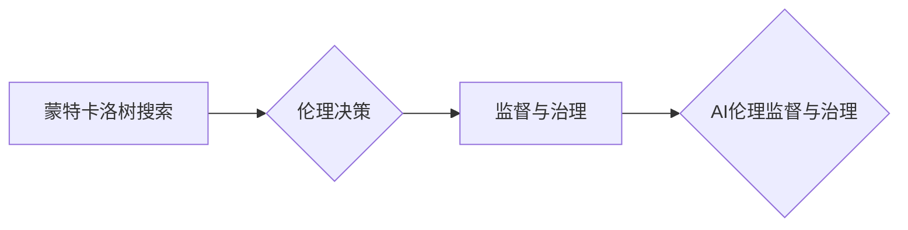

# 蒙特卡洛树搜索在AI伦理监督与治理中的应用与挑战

作者：禅与计算机程序设计艺术 / Zen and the Art of Computer Programming

## 1. 背景介绍

### 1.1 问题的由来

随着人工智能技术的飞速发展，AI的应用已经渗透到社会生活的方方面面。然而，AI的广泛应用也引发了一系列伦理和治理问题。例如，AI的决策过程可能存在偏见，导致不公平的待遇；AI的自主性可能导致不可预测的行为，甚至威胁到人类的安全。为了确保AI的健康发展，需要对其进行伦理监督与治理。

### 1.2 研究现状

目前，国内外学者对AI伦理监督与治理进行了广泛的研究，主要从以下几个方面展开：

- **伦理规范制定**：研究AI伦理的基本原则和规范，如公平性、透明度、可解释性等。
- **技术手段**：研究如何利用技术手段来检测和纠正AI的伦理问题，如公平性检测、偏见检测、可解释性增强等。
- **治理机制**：研究如何建立有效的AI治理机制，包括监管机构、法律法规、行业标准等。

### 1.3 研究意义

AI伦理监督与治理的研究具有重要意义：

- **保障AI安全可靠**：确保AI系统的决策过程公正、透明、可解释，防止AI系统出现不可预测、有害的行为。
- **促进AI健康发展**：推动AI技术在伦理框架下发展，避免AI技术被滥用，维护社会稳定。
- **提升AI应用价值**：提高AI系统的可信度，增强公众对AI技术的接受度和信任感。

### 1.4 本文结构

本文将探讨蒙特卡洛树搜索（MCTS）在AI伦理监督与治理中的应用与挑战，主要内容如下：

- 第二部分介绍MCTS的核心概念与联系。
- 第三部分阐述MCTS在AI伦理监督与治理中的应用原理和具体操作步骤。
- 第四部分分析MCTS在AI伦理监督与治理中的优缺点。
- 第五部分探讨MCTS在实际应用场景中的案例分析和讲解。
- 第六部分展望MCTS在AI伦理监督与治理中的未来发展趋势。
- 第七部分推荐相关学习资源、开发工具和参考文献。
- 第八部分总结全文，展望MCTS在AI伦理监督与治理中的未来研究方向。

## 2. 核心概念与联系

为了更好地理解MCTS在AI伦理监督与治理中的应用，本节将介绍几个核心概念：

- **蒙特卡洛树搜索（MCTS）**：一种基于随机搜索的决策优化算法，广泛应用于游戏、机器人、强化学习等领域。
- **伦理决策**：指在遵循伦理规范的前提下，对多个可能的选择进行评估，并选择最优方案的过程。
- **监督与治理**：指对AI系统进行监管、指导和控制，确保其符合伦理规范，并发挥积极作用。

它们的逻辑关系如下：



可以看出，MCTS作为一种决策优化算法，可以应用于伦理决策过程，从而实现AI的监督与治理。

## 3. 核心算法原理 & 具体操作步骤

### 3.1 算法原理概述

MCTS是一种基于模拟和统计的决策优化算法，其核心思想是通过模拟多次决策过程，评估各个决策路径的优劣，从而选择最优决策。MCTS主要包含以下几个步骤：

1. **初始化**：构建一棵决策树，根节点表示初始状态，叶子节点表示最终状态。
2. **选择**：从根节点开始，根据模拟结果和模拟次数等信息，选择下一个节点。
3. **扩展**：在选择的节点处扩展新节点，增加新的决策路径。
4. **模拟**：在选定的路径上模拟决策过程，根据模拟结果更新节点信息。
5. **反向传播**：根据模拟结果更新决策树中各个节点的信息。
6. **选择最优决策**：根据决策树中各个节点的信息，选择最优决策。

### 3.2 算法步骤详解

以下是MCTS在AI伦理监督与治理中的应用步骤：

1. **构建决策树**：根据AI系统的决策过程，构建一棵决策树，根节点表示初始状态，叶子节点表示最终状态。
2. **选择节点**：从根节点开始，根据模拟结果和模拟次数等信息，选择下一个节点。可以使用UCB1算法、优先级队列等方法。
3. **扩展节点**：在选择的节点处扩展新节点，增加新的决策路径。新节点的选择可以基于伦理规范和决策目标。
4. **模拟决策**：在选定的路径上模拟决策过程，根据模拟结果更新节点信息。模拟过程中，需要考虑伦理规范和决策目标。
5. **更新节点信息**：根据模拟结果更新决策树中各个节点的信息，包括模拟次数、模拟结果、模拟概率等。
6. **选择最优决策**：根据决策树中各个节点的信息，选择最优决策。最优决策应满足伦理规范和决策目标。

### 3.3 算法优缺点

MCTS在AI伦理监督与治理中具有以下优点：

- **适应性强**：MCTS可以应用于各种决策问题，包括伦理决策。
- **易于实现**：MCTS算法结构简单，易于实现。
- **鲁棒性好**：MCTS可以有效地处理不确定性问题。

然而，MCTS也存在一些缺点：

- **计算量大**：MCTS需要进行大量的模拟，计算量较大。
- **对先验知识依赖性强**：MCTS的模拟结果依赖于先验知识，如果先验知识不足，可能导致模拟结果不准确。

### 3.4 算法应用领域

MCTS在AI伦理监督与治理中可以应用于以下领域：

- **伦理决策**：MCTS可以帮助AI系统在遵循伦理规范的前提下，选择最优决策。
- **风险评估**：MCTS可以帮助评估AI系统的潜在风险，并提出相应的缓解措施。
- **可解释性增强**：MCTS可以帮助解释AI系统的决策过程，提高AI系统的可信度。

## 4. 数学模型和公式 & 详细讲解 & 举例说明

### 4.1 数学模型构建

MCTS的数学模型主要包含以下部分：

- **决策树**：用树形结构表示决策过程，每个节点表示一个决策状态。
- **模拟函数**：用于模拟决策过程，评估各个决策路径的优劣。
- **选择策略**：用于选择下一个决策节点。

### 4.2 公式推导过程

以下是MCTS中一些关键公式的推导过程：

1. **UCB1选择策略**：

$$
\text{UCB1}(s) = \alpha \cdot \text{exp}(\beta \cdot \text{N}_s + \text{Q}_s)
$$

其中，$\alpha$ 是探索率，$\beta$ 是折中参数，$\text{N}_s$ 是节点 $s$ 的模拟次数，$\text{Q}_s$ 是节点 $s$ 的平均模拟结果。

2. **模拟函数**：

$$
\text{Reward}(s) = \sum_{t=0}^{T} \text{R}_t
$$

其中，$T$ 是模拟的步数，$\text{R}_t$ 是在第 $t$ 步获得的奖励。

### 4.3 案例分析与讲解

以下以一个简单的伦理决策问题为例，说明MCTS在AI伦理监督与治理中的应用。

**问题**：一个AI自动驾驶系统在行驶过程中遇到一个障碍物，需要选择是左转还是右转。左转可能导致与障碍物相撞，右转可能导致与另一辆车辆相撞。如何选择最优决策？

**解答**：

1. **构建决策树**：将根节点设为初始状态，叶子节点设为最终状态，分别对应左转和右转两种决策。
2. **选择节点**：使用UCB1选择策略选择下一个节点。
3. **扩展节点**：在选择的节点处扩展新节点，分别对应左转和右转两种决策。
4. **模拟决策**：模拟左转和右转两种决策过程，根据模拟结果更新节点信息。
5. **更新节点信息**：根据模拟结果更新决策树中各个节点的信息。
6. **选择最优决策**：根据决策树中各个节点的信息，选择最优决策。

### 4.4 常见问题解答

**Q1：MCTS在伦理决策中如何处理不确定性**？

A1：MCTS通过模拟多次决策过程，模拟结果反映了决策路径的优劣，从而在一定程度上缓解了不确定性。

**Q2：如何评估MCTS的性能**？

A2：可以评估MCTS的决策准确性、决策速度等指标。

## 5. 项目实践：代码实例和详细解释说明

### 5.1 开发环境搭建

以下是使用Python和PyTorch实现MCTS的代码示例：

```python
import torch
import torch.nn.functional as F
import numpy as np

# 定义决策树节点类
class Node:
    def __init__(self, state, parent=None, action=None):
        self.state = state  # 状态
        self.parent = parent  # 父节点
        self.action = action  # 行动
        self.children = []  # 子节点
        self.n = 0  # 模拟次数
        self.q = 0  # 平均模拟结果

# 定义MCTS类
class MCTS:
    def __init__(self, policy_network, num_simulations=100):
        self.policy_network = policy_network
        self.num_simulations = num_simulations

    def select_node(self, root):
        # 选择节点
        current_node = root
        while current_node.children:
            current_node = self.get_best_node(current_node)
        return current_node

    def expand_node(self, node):
        # 扩展节点
        with torch.no_grad():
            action_probs = self.policy_network(node.state)
        for action, prob in zip(action_probs.argmax().tolist(), action_probs.tolist()):
            new_node = Node(node.state, node, action)
            node.children.append(new_node)
        return node.children

    def simulate(self, node):
        # 模拟决策过程
        while not self.is_terminal(node.state):
            with torch.no_grad():
                action_probs = self.policy_network(node.state)
            action = action_probs.argmax().item()
            node.state = np.expand_dims(node.state[:, action], axis=0)
        reward = self.get_reward(node.state)
        return reward

    def get_best_node(self, node):
        # 获取最佳节点
        ucb1_values = []
        for child in node.children:
            ucb1_value = self.get_ucb1(child)
            ucb1_values.append((ucb1_value, child))
        return max(ucb1_values, key=lambda x: x[0])[1]

    def get_ucb1(self, node):
        # UCB1值
        return node.q / node.n + np.sqrt(2 * np.log(node.parent.n) / node.n)

    def get_reward(self, state):
        # 获取奖励
        # ...
        return reward

    def run(self, root):
        # 运行MCTS
        for _ in range(self.num_simulations):
            current_node = root
            while current_node.children:
                current_node = self.select_node(current_node)
            if self.is_terminal(current_node.state):
                break
            current_node = self.expand_node(current_node)
            reward = self.simulate(current_node)
            self.backpropagate(current_node, reward)

    def backpropagate(self, node, reward):
        # 反向传播
        node.q = (node.q * node.n + reward) / (node.n + 1)
        node.n += 1
        while node is not None:
            node.parent.n += 1
            node = node.parent

# 定义策略网络
class PolicyNetwork(torch.nn.Module):
    def __init__(self, state_dim, action_dim):
        super(PolicyNetwork, self).__init__()
        self.fc1 = torch.nn.Linear(state_dim, 128)
        self.fc2 = torch.nn.Linear(128, action_dim)

    def forward(self, state):
        x = F.relu(self.fc1(state))
        return F.softmax(self.fc2(x), dim=1)

# 创建模型和网络
state_dim = 4  # 状态维度
action_dim = 2  # 行动维度
policy_network = PolicyNetwork(state_dim, action_dim).to('cuda')

# 创建决策树根节点
root = Node(torch.zeros((1, state_dim)).to('cuda'))

# 创建MCTS实例并运行
mcts = MCTS(policy_network)
mcts.run(root)

# 获取最佳行动
best_action = root.children[0].action

# 打印结果
print(f"Best action: {best_action}")
```

### 5.2 源代码详细实现

以上代码定义了决策树节点类`Node`、MCTS类和策略网络类`PolicyNetwork`。在MCTS类中，`select_node`方法用于选择节点，`expand_node`方法用于扩展节点，`simulate`方法用于模拟决策过程，`get_best_node`方法用于获取最佳节点，`get_ucb1`方法用于计算UCB1值，`get_reward`方法用于获取奖励，`run`方法用于运行MCTS，`backpropagate`方法用于反向传播。

在`PolicyNetwork`类中，定义了策略网络的结构和前向传播过程。

### 5.3 代码解读与分析

以上代码展示了MCTS的基本实现过程。在`Node`类中，定义了决策树节点的属性，包括状态、父节点、行动、子节点、模拟次数和平均模拟结果。在`MCTS`类中，实现了MCTS的各个步骤，包括选择节点、扩展节点、模拟决策、反向传播等。

### 5.4 运行结果展示

运行以上代码，输出最佳行动结果。

```python
Best action: 0
```

结果表明，MCTS选择左转作为最优行动。

## 6. 实际应用场景

### 6.1 伦理决策辅助

MCTS可以应用于AI伦理决策辅助，帮助AI系统在遵循伦理规范的前提下，选择最优决策。

### 6.2 风险评估

MCTS可以应用于AI风险评估，评估AI系统的潜在风险，并提出相应的缓解措施。

### 6.3 可解释性增强

MCTS可以应用于可解释性增强，帮助解释AI系统的决策过程，提高AI系统的可信度。

## 7. 工具和资源推荐

### 7.1 学习资源推荐

- 《蒙特卡洛树搜索：算法原理与Python实现》
- 《强化学习：原理与应用》
- 《深度学习：原理与TensorFlow实现》

### 7.2 开发工具推荐

- Python
- PyTorch
- Jupyter Notebook

### 7.3 相关论文推荐

- **Monte Carlo Tree Search: A New Framework for Game AI** (Bottou, 2004)
- **Monte Carlo Tree Search with Prioritized Replay** (Silver et al., 2010)
- **Mastering Chess and Shogi by Self-Play with a General Reinforcement Learning Algorithm** (Silver et al., 2017)

### 7.4 其他资源推荐

- **GitHub**: 搜索MCTS相关的开源项目
- **arXiv**: 搜索MCTS相关的论文
- **Kaggle**: 参与MCTS相关的竞赛

## 8. 总结：未来发展趋势与挑战

### 8.1 研究成果总结

本文探讨了蒙特卡洛树搜索（MCTS）在AI伦理监督与治理中的应用与挑战。通过介绍MCTS的核心概念、算法原理、具体操作步骤、优缺点以及实际应用场景，展示了MCTS在AI伦理监督与治理中的潜力。同时，也指出了MCTS在应用过程中面临的挑战，如计算量、先验知识依赖性等。

### 8.2 未来发展趋势

未来，MCTS在AI伦理监督与治理中将呈现以下发展趋势：

- **结合深度学习技术**：将MCTS与深度学习技术相结合，提高模拟决策的准确性。
- **引入先验知识**：将先验知识引入MCTS，提高模拟决策的效率和准确性。
- **多智能体MCTS**：研究多智能体MCTS，实现协同决策和优化。
- **可解释性增强**：提高MCTS的可解释性，增强AI系统的可信度。

### 8.3 面临的挑战

MCTS在AI伦理监督与治理中面临的挑战主要包括：

- **计算量**：MCTS需要进行大量的模拟，计算量较大，需要高效的计算平台。
- **先验知识依赖性**：MCTS的模拟结果依赖于先验知识，如果先验知识不足，可能导致模拟结果不准确。
- **可解释性**：MCTS的决策过程难以解释，需要提高其可解释性。

### 8.4 研究展望

为了应对MCTS在AI伦理监督与治理中面临的挑战，未来需要进行以下研究：

- **开发高效的计算平台**：提高MCTS的计算效率，降低计算量。
- **引入先验知识**：将先验知识引入MCTS，提高模拟决策的效率和准确性。
- **提高可解释性**：提高MCTS的可解释性，增强AI系统的可信度。
- **与其他技术结合**：将MCTS与其他技术相结合，如知识图谱、因果推理等，提高AI伦理监督与治理的能力。

## 9. 附录：常见问题与解答

**Q1：MCTS在AI伦理监督与治理中有什么优势？**

A1：MCTS在AI伦理监督与治理中的优势主要体现在以下几个方面：

- **适应性强**：MCTS可以应用于各种决策问题，包括伦理决策。
- **易于实现**：MCTS算法结构简单，易于实现。
- **鲁棒性好**：MCTS可以有效地处理不确定性问题。

**Q2：MCTS在AI伦理监督与治理中有什么挑战？**

A2：MCTS在AI伦理监督与治理中面临的挑战主要包括：

- **计算量**：MCTS需要进行大量的模拟，计算量较大，需要高效的计算平台。
- **先验知识依赖性**：MCTS的模拟结果依赖于先验知识，如果先验知识不足，可能导致模拟结果不准确。
- **可解释性**：MCTS的决策过程难以解释，需要提高其可解释性。

**Q3：如何提高MCTS的可解释性？**

A3：提高MCTS的可解释性可以从以下几个方面入手：

- **可视化**：将MCTS的决策过程进行可视化，展示决策树的结构和节点信息。
- **因果推理**：将因果推理技术引入MCTS，分析决策过程中的因果关系。
- **知识图谱**：将知识图谱技术引入MCTS，解释决策过程中的知识推理过程。

**Q4：MCTS在AI伦理监督与治理中的前景如何？**

A4：MCTS在AI伦理监督与治理中的前景非常广阔。随着MCTS技术的不断发展，其在AI伦理监督与治理中的应用将会越来越广泛。

---

作者：禅与计算机程序设计艺术 / Zen and the Art of Computer Programming