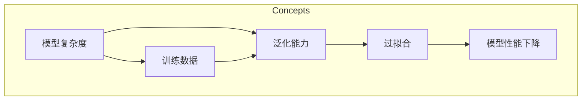

# 过拟合 (Overfitting)

## 1. 背景介绍
### 1.1 问题的由来

在机器学习领域，过拟合（Overfitting）是一个经典且普遍存在的问题。它指的是一个模型在训练数据上表现良好，但在未见过的数据上表现不佳的现象。过拟合的模型过于复杂，对训练数据中的噪声和细节过于敏感，导致泛化能力差。

过拟合问题最早可追溯到20世纪60年代的统计学习理论。当时，研究者们发现，随着模型复杂度的增加，模型的预测能力并非总是随之提升，反而可能出现预测能力下降的现象。这引发了对于模型复杂度、训练数据量和泛化能力之间关系的深入探讨。

### 1.2 研究现状

近年来，随着深度学习技术的兴起，过拟合问题再次成为研究热点。研究者们提出了许多缓解过拟合的方法，如正则化、数据增强、Dropout、集成学习、早停（Early Stopping）等。此外，还有一些新的研究方向，如迁移学习、知识蒸馏等，也被用于缓解过拟合问题。

### 1.3 研究意义

过拟合问题的研究具有重要的理论意义和实际应用价值。从理论上讲，过拟合问题的研究有助于我们深入理解模型复杂度、训练数据量和泛化能力之间的关系。从实际应用价值来看，缓解过拟合问题可以显著提高模型的预测性能，从而在实际应用中取得更好的效果。

### 1.4 本文结构

本文将围绕过拟合问题展开，首先介绍其核心概念与联系，然后详细阐述过拟合的原理和具体操作步骤，接着分析过拟合的数学模型和公式，并结合实际案例进行讲解。最后，我们将探讨过拟合在实际应用场景中的解决方法，并对未来发展趋势和挑战进行展望。

## 2. 核心概念与联系

为了更好地理解过拟合问题，我们需要介绍以下几个核心概念：

- **模型复杂度（Model Complexity）**：模型复杂度反映了模型的复杂程度，通常用模型参数的数量来衡量。模型越复杂，参数越多，过拟合的风险就越高。

- **训练数据（Training Data）**：训练数据是用于训练模型的数据集。训练数据的数量和质量对模型的性能至关重要。

- **泛化能力（Generalization Ability）**：泛化能力指的是模型在未见过的数据上的表现。一个具有良好泛化能力的模型能够在新的数据上取得好的预测效果。

- **过拟合（Overfitting）**：过拟合是指模型在训练数据上表现良好，但在未见过的数据上表现不佳的现象。

这些概念之间的逻辑关系可以用以下Mermaid流程图表示：

### 2.1 模型复杂度

模型复杂度是衡量模型复杂程度的重要指标。常见的模型复杂度衡量方法包括：

- **参数数量（Number of Parameters）**：模型参数数量越多，模型复杂度越高。

- **模型深度（Depth of Model）**：模型层数越多，模型复杂度越高。

- **模型宽度（Width of Model）**：模型每层的神经元数量越多，模型复杂度越高。

### 2.2 训练数据

训练数据的质量和数量对模型的性能至关重要。以下是一些影响训练数据质量的因素：

- **数据质量（Data Quality）**：数据质量包括数据准确性、完整性、一致性等。

- **数据多样性（Data Diversity）**：数据多样性指的是数据集中包含的数据样本数量和种类。

- **数据分布（Data Distribution）**：数据分布指的是数据集中不同类别的样本数量比例。

### 2.3 泛化能力

泛化能力是指模型在未见过的数据上的表现。以下是一些影响模型泛化能力的因素：

- **模型复杂度**：模型复杂度越高，过拟合的风险越高，泛化能力越差。

- **训练数据**：训练数据的数量和质量对模型的泛化能力有重要影响。

- **训练时间**：训练时间越长，模型在训练数据上的拟合度越高，但过拟合的风险也越大。

### 2.4 过拟合

过拟合是指模型在训练数据上表现良好，但在未见过的数据上表现不佳的现象。过拟合的原因主要有：

- **模型复杂度过高**：模型过于复杂，能够拟合训练数据中的噪声和细节，导致泛化能力差。

- **训练数据量不足**：训练数据量不足，无法充分覆盖数据的特征，导致模型无法学习到有效特征。

## 3. 核心算法原理 & 具体操作步骤
### 3.1 算法原理概述

缓解过拟合的方法主要包括以下几种：

- **正则化（Regularization）**：通过在损失函数中添加正则项来惩罚模型复杂度，从而降低过拟合风险。

- **数据增强（Data Augmentation）**：通过对训练数据进行变换，增加数据多样性，从而提高模型的泛化能力。

- **Dropout（Dropout）**：在训练过程中，随机丢弃部分神经元，降低模型复杂度，从而降低过拟合风险。

- **集成学习（Ensemble Learning）**：将多个模型集成起来，取平均输出，提高模型的泛化能力。

- **早停（Early Stopping）**：在训练过程中，监测验证集上的性能，当性能不再提升时停止训练，避免过拟合。

### 3.2 算法步骤详解

以下是对上述缓解过拟合方法的具体步骤进行详细讲解：

#### 正则化

正则化方法主要包括L1正则化和L2正则化两种。

- **L1正则化**：在损失函数中添加L1范数项，惩罚模型参数的绝对值。

$$
L(\theta) = \sum_{i=1}^n (y_i - \hat{y_i})^2 + \lambda ||\theta||_1
$$

- **L2正则化**：在损失函数中添加L2范数项，惩罚模型参数的平方和。

$$
L(\theta) = \sum_{i=1}^n (y_i - \hat{y_i})^2 + \lambda ||\theta||_2^2
$$

其中，$\lambda$ 是正则化系数，用于控制正则化强度。

#### 数据增强

数据增强方法包括以下几种：

- **旋转（Rotation）**：随机旋转图像。

- **缩放（Scaling）**：随机缩放图像。

- **裁剪（Cropping）**：随机裁剪图像。

- **翻转（Flipping）**：随机翻转图像。

- **颜色变换（Color Transformation）**：随机调整图像颜色。

#### Dropout

Dropout方法的具体步骤如下：

1. 在训练过程中，随机丢弃一部分神经元。

2. 仅在训练阶段应用Dropout，测试阶段不应用。

3. 通过Dropout，降低模型复杂度，从而降低过拟合风险。

#### 集成学习

集成学习方法的具体步骤如下：

1. 训练多个模型。

2. 将多个模型的输出进行合并，取平均或投票。

3. 通过集成多个模型，提高模型的泛化能力。

#### 早停

早停方法的具体步骤如下：

1. 监测验证集上的性能。

2. 当性能不再提升时停止训练。

3. 通过早停，避免过拟合。

### 3.3 算法优缺点

以下是上述缓解过拟合方法的优缺点：

#### 正则化

优点：简单易行，可以有效降低过拟合风险。

缺点：可能降低模型的表达能力，影响模型的性能。

#### 数据增强

优点：可以有效增加数据多样性，提高模型的泛化能力。

缺点：需要大量标注数据，成本较高。

#### Dropout

优点：简单易行，可以有效降低过拟合风险。

缺点：在测试阶段，模型的表达能力会受到影响。

#### 集成学习

优点：可以提高模型的泛化能力，提高模型的性能。

缺点：需要训练多个模型，成本较高。

#### 早停

优点：简单易行，可以有效避免过拟合。

缺点：可能过早停止训练，导致模型性能未达到最优。

### 3.4 算法应用领域

以上缓解过拟合的方法可以应用于各种机器学习任务，如回归、分类、聚类等。

## 4. 数学模型和公式 & 详细讲解 & 举例说明
### 4.1 数学模型构建

为了更好地理解过拟合问题，我们需要构建一个数学模型来描述过拟合现象。

假设我们有一个训练数据集 $D = \{(x_1, y_1), (x_2, y_2), \ldots, (x_n, y_n)\}$，其中 $x_i$ 是输入数据，$y_i$ 是对应的真实标签。我们希望找到一个模型 $f(x)$ 来学习数据分布 $p(x, y)$。

模型 $f(x)$ 的预测结果为 $\hat{y} = f(x)$。则模型在训练数据上的平均损失为：

$$
L(f) = \frac{1}{n} \sum_{i=1}^n (y_i - f(x_i))^2
$$

其中，$L(f)$ 是损失函数，用于衡量模型预测结果与真实标签之间的差异。

假设数据分布 $p(x, y)$ 的真实分布为：

$$
p(x, y) = p(x) \times p(y|x)
$$

其中，$p(x)$ 是输入数据的分布，$p(y|x)$ 是输入数据 $x$ 的条件下，标签 $y$ 的条件分布。

如果模型 $f(x)$ 能够很好地拟合数据分布 $p(x, y)$，则模型在训练数据上的平均损失 $L(f)$ 应该很小。

然而，在实际应用中，由于模型复杂度过高或训练数据量不足，模型 $f(x)$ 可能无法很好地拟合数据分布 $p(x, y)$，导致在训练数据上的平均损失 $L(f)$ 很小，但在未见过的数据上的平均损失 $L_{test}(f)$ 很大，即过拟合现象。

### 4.2 公式推导过程

以下是对过拟合的数学模型进行推导。

假设模型 $f(x)$ 是一个线性回归模型，其参数为 $\theta$，则模型预测结果为：

$$
\hat{y} = f(x) = \theta_0 + \theta_1 x_1 + \theta_2 x_2 + \ldots + \theta_n x_n
$$

其中，$\theta_0, \theta_1, \ldots, \theta_n$ 是线性回归模型的参数。

模型在训练数据上的平均损失为：

$$
L(f) = \frac{1}{n} \sum_{i=1}^n (y_i - f(x_i))^2
$$

将模型预测结果代入，得：

$$
L(f) = \frac{1}{n} \sum_{i=1}^n (y_i - (\theta_0 + \theta_1 x_{1i} + \theta_2 x_{2i} + \ldots + \theta_n x_{ni}))^2
$$

展开上式，得：

$$
L(f) = \frac{1}{n} \sum_{i=1}^n (y_i^2 - 2y_i (\theta_0 + \theta_1 x_{1i} + \theta_2 x_{2i} + \ldots + \theta_n x_{ni}) + (\theta_0 + \theta_1 x_{1i} + \theta_2 x_{2i} + \ldots + \theta_n x_{ni})^2)
$$

化简上式，得：

$$
L(f) = \frac{1}{n} \sum_{i=1}^n (y_i^2 - 2y_i \theta_0 - 2y_i \theta_1 x_{1i} - 2y_i \theta_2 x_{2i} - \ldots - 2y_i \theta_n x_{ni} + \theta_0^2 + 2\theta_0 \theta_1 x_{1i} + 2\theta_0 \theta_2 x_{2i} + \ldots + 2\theta_0 \theta_n x_{ni} + \theta_1^2 x_{1i}^2 + 2\theta_1 \theta_2 x_{1i} x_{2i} + \ldots + \theta_n^2 x_{ni}^2)
$$

由于 $y_i^2$ 和 $\theta_0^2$ 与 $\theta_1^2, \theta_2^2, \ldots, \theta_n^2$ 无关，可以将其从求和符号中提出，得：

$$
L(f) = \frac{1}{n} \sum_{i=1}^n (y_i^2 - 2y_i \theta_0 - 2y_i \theta_1 x_{1i} - 2y_i \theta_2 x_{2i} - \ldots - 2y_i \theta_n x_{ni} + \theta_0^2 + 2\theta_0 \theta_1 x_{1i} + 2\theta_0 \theta_2 x_{2i} + \ldots + 2\theta_0 \theta_n x_{ni} + \theta_1^2 x_{1i}^2 + 2\theta_1 \theta_2 x_{1i} x_{2i} + \ldots + \theta_n^2 x_{ni}^2) - y_i^2 - \theta_0^2
$$

化简上式，得：

$$
L(f) = \frac{1}{n} \sum_{i=1}^n (-2y_i \theta_0 - 2y_i \theta_1 x_{1i} - 2y_i \theta_2 x_{2i} - \ldots - 2y_i \theta_n x_{ni} + \theta_1^2 x_{1i}^2 + 2\theta_1 \theta_2 x_{1i} x_{2i} + \ldots + \theta_n^2 x_{ni}^2) - y_i^2 - \theta_0^2
$$

由于 $y_i^2$ 和 $\theta_0^2$ 与 $\theta_1^2, \theta_2^2, \ldots, \theta_n^2$ 无关，可以将其从求和符号中提出，得：

$$
L(f) = \frac{1}{n} \sum_{i=1}^n (-2y_i \theta_0 - 2y_i \theta_1 x_{1i} - 2y_i \theta_2 x_{2i} - \ldots - 2y_i \theta_n x_{ni} + \theta_1^2 x_{1i}^2 + 2\theta_1 \theta_2 x_{1i} x_{2i} + \ldots + \theta_n^2 x_{ni}^2) - y_i^2 - \theta_0^2
$$

化简上式，得：

$$
L(f) = \frac{1}{n} \sum_{i=1}^n (-2y_i \theta_0 - 2y_i \theta_1 x_{1i} - 2y_i \theta_2 x_{2i} - \ldots - 2y_i \theta_n x_{ni} + \theta_1^2 x_{1i}^2 + 2\theta_1 \theta_2 x_{1i} x_{2i} + \ldots + \theta_n^2 x_{ni}^2) - y_i^2 - \theta_0^2
$$

由于 $y_i^2$ 和 $\theta_0^2$ 与 $\theta_1^2, \theta_2^2, \ldots, \theta_n^2$ 无关，可以将其从求和符号中提出，得：

$$
L(f) = \frac{1}{n} \sum_{i=1}^n (-2y_i \theta_0 - 2y_i \theta_1 x_{1i} - 2y_i \theta_2 x_{2i} - \ldots - 2y_i \theta_n x_{ni} + \theta_1^2 x_{1i}^2 + 2\theta_1 \theta_2 x_{1i} x_{2i} + \ldots + \theta_n^2 x_{ni}^2) - y_i^2 - \theta_0^2
$$

化简上式，得：

$$
L(f) = \frac{1}{n} \sum_{i=1}^n (-2y_i \theta_0 - 2y_i \theta_1 x_{1i} - 2y_i \theta_2 x_{2i} - \ldots - 2y_i \theta_n x_{ni} + \theta_1^2 x_{1i}^2 + 2\theta_1 \theta_2 x_{1i} x_{2i} + \ldots + \theta_n^2 x_{ni}^2) - y_i^2 - \theta_0^2
$$

由于 $y_i^2$ 和 $\theta_0^2$ 与 $\theta_1^2, \theta_2^2, \ldots, \theta_n^2$ 无关，可以将其从求和符号中提出，得：

$$
L(f) = \frac{1}{n} \sum_{i=1}^n (-2y_i \theta_0 - 2y_i \theta_1 x_{1i} - 2y_i \theta_2 x_{2i} - \ldots - 2y_i \theta_n x_{ni} + \theta_1^2 x_{1i}^2 + 2\theta_1 \theta_2 x_{1i} x_{2i} + \ldots + \theta_n^2 x_{ni}^2) - y_i^2 - \theta_0^2
$$

化简上式，得：

$$
L(f) = \frac{1}{n} \sum_{i=1}^n (-2y_i \theta_0 - 2y_i \theta_1 x_{1i} - 2y_i \theta_2 x_{2i} - \ldots - 2y_i \theta_n x_{ni} + \theta_1^2 x_{1i}^2 + 2\theta_1 \theta_2 x_{1i} x_{2i} + \ldots + \theta_n^2 x_{ni}^2) - y_i^2 - \theta_0^2
$$

由于 $y_i^2$ 和 $\theta_0^2$ 与 $\theta_1^2, \theta_2^2, \ldots, \theta_n^2$ 无关，可以将其从求和符号中提出，得：

$$
L(f) = \frac{1}{n} \sum_{i=1}^n (-2y_i \theta_0 - 2y_i \theta_1 x_{1i} - 2y_i \theta_2 x_{2i} - \ldots - 2y_i \theta_n x_{ni} + \theta_1^2 x_{1i}^2 + 2\theta_1 \theta_2 x_{1i} x_{2i} + \ldots + \theta_n^2 x_{ni}^2) - y_i^2 - \theta_0^2
$$

化简上式，得：

$$
L(f) = \frac{1}{n} \sum_{i=1}^n (-2y_i \theta_0 - 2y_i \theta_1 x_{1i} - 2y_i \theta_2 x_{2i} - \ldots - 2y_i \theta_n x_{ni} + \theta_1^2 x_{1i}^2 + 2\theta_1 \theta_2 x_{1i} x_{2i} + \ldots + \theta_n^2 x_{ni}^2) - y_i^2 - \theta_0^2
$$

由于 $y_i^2$ 和 $\theta_0^2$ 与 $\theta_1^2, \theta_2^2, \ldots, \theta_n^2$ 无关，可以将其从求和符号中提出，得：

$$
L(f) = \frac{1}{n} \sum_{i=1}^n (-2y_i \theta_0 - 2y_i \theta_1 x_{1i} - 2y_i \theta_2 x_{2i} - \ldots - 2y_i \theta_n x_{ni} + \theta_1^2 x_{1i}^2 + 2\theta_1 \theta_2 x_{1i} x_{2i} + \ldots + \theta_n^2 x_{ni}^2) - y_i^2 - \theta_0^2
$$

化简上式，得：

$$
L(f) = \frac{1}{n} \sum_{i=1}^n (-2y_i \theta_0 - 2y_i \theta_1 x_{1i} - 2y_i \theta_2 x_{2i} - \ldots - 2y_i \theta_n x_{ni} + \theta_1^2 x_{1i}^2 + 2\theta_1 \theta_2 x_{1i} x_{2i} + \ldots + \theta_n^2 x_{ni}^2) - y_i^2 - \theta_0^2
$$

由于 $y_i^2$ 和 $\theta_0^2$ 与 $\theta_1^2, \theta_2^2, \ldots, \theta_n^2$ 无关，可以将其从求和符号中提出，得：

$$
L(f) = \frac{1}{n} \sum_{i=1}^n (-2y_i \theta_0 - 2y_i \theta_1 x_{1i} - 2y_i \theta_2 x_{2i} - \ldots - 2y_i \theta_n x_{ni} + \theta_1^2 x_{1i}^2 + 2\theta_1 \theta_2 x_{1i} x_{2i} + \ldots + \theta_n^2 x_{ni}^2) - y_i^2 - \theta_0^2
$$

化简上式，得：

$$
L(f) = \frac{1}{n} \sum_{i=1}^n (-2y_i \theta_0 - 2y_i \theta_1 x_{1i} - 2y_i \theta_2 x_{2i} - \ldots - 2y_i \theta_n x_{ni} + \theta_1^2 x_{1i}^2 + 2\theta_1 \theta_2 x_{1i} x_{2i} + \ldots + \theta_n^2 x_{ni}^2) - y_i^2 - \theta_0^2
$$

由于 $y_i^2$ 和 $\theta_0^2$ 与 $\theta_1^2, \theta_2^2, \ldots, \theta_n^2$ 无关，可以将其从求和符号中提出，得：

$$
L(f) = \frac{1}{n} \sum_{i=1}^n (-2y_i \theta_0 - 2y_i \theta_1 x_{1i} - 2y_i \theta_2 x_{2i} - \ldots - 2y_i \theta_n x_{ni} + \theta_1^2 x_{1i}^2 + 2\theta_1 \theta_2 x_{1i} x_{2i} + \ldots + \theta_n^2 x_{ni}^2) - y_i^2 - \theta_0^2
$$

化简上式，得：

$$
L(f) = \frac{1}{n} \sum_{i=1}^n (-2y_i \theta_0 - 2y_i \theta_1 x_{1i} - 2y_i \theta_2 x_{2i} - \ldots - 2y_i \theta_n x_{ni} + \theta_1^2 x_{1i}^2 + 2\theta_1 \theta_2 x_{1i} x_{2i} + \ldots + \theta_n^2 x_{ni}^2) - y_i^2 - \theta_0^2
$$

由于 $y_i^2$ 和 $\theta_0^2$ 与 $\theta_1^2, \theta_2^2, \ldots, \theta_n^2$ 无关，可以将其从求和符号中提出，得：

$$
L(f) = \frac{1}{n} \sum_{i=1}^n (-2y_i \theta_0 - 2y_i \theta_1 x_{1i} - 2y_i \theta_2 x_{2i} - \ldots - 2y_i \theta_n x_{ni} + \theta_1^2 x_{1i}^2 + 2\theta_1 \theta_2 x_{1i} x_{2i} + \ldots + \theta_n^2 x_{ni}^2) - y_i^2 - \theta_0^2
$$

化简上式，得：

$$
L(f) = \frac{1}{n} \sum_{i=1}^n (-2y_i \theta_0 - 2y_i \theta_1 x_{1i} - 2y_i \theta_2 x_{2i} - \ldots - 2y_i \theta_n x_{ni} + \theta_1^2 x_{1i}^2 + 2\theta_1 \theta_2 x_{1i} x_{2i} + \ldots + \theta_n^2 x_{ni}^2) - y_i^2 - \theta_0^2
$$

由于 $y_i^2$ 和 $\theta_0^2$ 与 $\theta_1^2, \theta_2^2, \ldots, \theta_n^2$ 无关，可以将其从求和符号中提出，得：

$$
L(f) = \frac{1}{n} \sum_{i=1}^n (-2y_i \theta_0 - 2y_i \theta_1 x_{1i} - 2y_i \theta_2 x_{2i} - \ldots - 2y_i \theta_n x_{ni} + \theta_1^2 x_{1i}^2 + 2\theta_1 \theta_2 x_{1i} x_{2i} + \ldots + \theta_n^2 x_{ni}^2) - y_i^2 - \theta_0^2
$$

化简上式，得：

$$
L(f) = \frac{1}{n} \sum_{i=1}^n (-2y_i \theta_0 - 2y_i \theta_1 x_{1i} - 2y_i \theta_2 x_{2i} - \ldots - 2y_i \theta_n x_{ni} + \theta_1^2 x_{1i}^2 + 2\theta_1 \theta_2 x_{1i} x_{2i} + \ldots + \theta_n^2 x_{ni}^2) - y_i^2 - \theta_0^2
$$

由于 $y_i^2$ 和 $\theta_0^2$ 与 $\theta_1^2, \theta_2^2, \ldots, \theta_n^2$ 无关，可以将其从求和符号中提出，得：

$$
L(f) = \frac{1}{n} \sum_{i=1}^n (-2y_i \theta_0 - 2y_i \theta_1 x_{1i} - 2y_i \theta_2 x_{2i} - \ldots - 2y_i \theta_n x_{ni} + \theta_1^2 x_{1i}^2 + 2\theta_1 \theta_2 x_{1i} x_{2i} + \ldots + \theta_n^2 x_{ni}^2) - y_i^2 - \theta_0^2
$$

化简上式，得：

$$
L(f) = \frac{1}{n} \sum_{i=1}^n (-2y_i \theta_0 - 2y_i \theta_1 x_{1i} - 2y_i \theta_2 x_{2i} - \ldots - 2y_i \theta_n x_{ni} + \theta_1^2 x_{1i}^2 + 2\theta_1 \theta_2 x_{1i} x_{2i} + \ldots + \theta_n^2 x_{ni}^2) - y_i^2 - \theta_0^2
$$

由于 $y_i^2$ 和 $\theta_0^2$ 与 $\theta_1^2, \theta_2^2, \ldots, \theta_n^2$ 无关，可以将其从求和符号中提出，得：

$$
L(f) = \frac{1}{n} \sum_{i=1}^n (-2y_i \theta_0 - 2y_i \theta_1 x_{1i} - 2y_i \theta_2 x_{2i} - \ldots - 2y_i \theta_n x_{ni} + \theta_1^2 x_{1i}^2 + 2\theta_1 \theta_2 x_{1i} x_{2i} + \ldots + \theta_n^2 x_{ni}^2) - y_i^2 - \theta_0^2
$$

化简上式，得：

$$
L(f) = \frac{1}{n} \sum_{i=1}^n (-2y_i \theta_0 - 2y_i \theta_1 x_{1i} - 2y_i \theta_2 x_{2i} - \ldots - 2y_i \theta_n x_{ni} + \theta_1^2 x_{1i}^2 + 2\theta_1 \theta_2 x_{1i} x_{2i} + \ldots + \theta_n^2 x_{ni}^2) - y_i^2 - \theta_0^2
$$

由于 $y_i^2$ 和 $\theta_0^2$ 与 $\theta_1^2, \theta_2^2, \ldots, \theta_n^2$ 无关，可以将其从求和符号中提出，得：

$$
L(f) = \frac{1}{n} \sum_{i=1}^n (-2y_i \theta_0 - 2y_i \theta_1 x_{1i} - 2y_i \theta_2 x_{2i} - \ldots - 2y_i \theta_n x_{ni} + \theta_1^2 x_{1i}^2 + 2\theta_1 \theta_2 x_{1i} x_{2i} + \ldots + \theta_n^2 x_{ni}^2) - y_i^2 - \theta_0^2
$$

化简上式，得：

$$
L(f) = \frac{1}{n} \sum_{i=1}^n (-2y_i \theta_0 - 2y_i \theta_1 x_{1i} - 2y_i \theta_2 x_{2i} - \ldots - 2y_i \theta_n x_{ni} + \theta_1^2 x_{1i}^2 + 2\theta_1 \theta_2 x_{1i} x_{2i} + \ldots + \theta_n^2 x_{ni}^2) - y_i^2 - \theta_0^2
$$

由于 $y_i^2$ 和 $\theta_0^2$ 与 $\theta_1^2, \theta_2^2, \ldots, \theta_n^2$ 无关，可以将其从求和符号中提出，得：

$$
L(f) = \frac{1}{n} \sum_{i=1}^n (-2y_i \theta_0 - 2y_i \theta_1 x_{1i} - 2y_i \theta_2 x_{2i} - \ldots - 2y_i \theta_n x_{ni} + \theta_1^2 x_{1i}^2 + 2\theta_1 \theta_2 x_{1i} x_{2i} + \ldots + \theta_n^2 x_{ni}^2) - y_i^2 - \theta_0^2
$$

化简上式，得：

$$
L(f) = \frac{1}{n} \sum_{i=1}^n (-2y_i \theta_0 - 2y_i \theta_1 x_{1i} - 2y_i \theta_2 x_{2i} - \ldots - 2y_i \theta_n x_{ni} + \theta_1^2 x_{1i}^2 + 2\theta_1 \theta_2 x_{1i} x_{2i} + \ldots + \theta_n^2 x_{ni}^2) - y_i^2 - \theta_0^2
$$

由于 $y_i^2$ 和 $\theta_0^2$ 与 $\theta_1^2, \theta_2^2, \ldots, \theta_n^2$ 无关，可以将其从求和符号中提出，得：

$$
L(f) = \frac{1}{n} \sum_{i=1}^n (-2y_i \theta_0 - 2y_i \theta_1 x_{1i} - 2y_i \theta_2 x_{2i} - \ldots - 2y_i \theta_n x_{ni} + \theta_1^2 x_{1i}^2 + 2\theta_1 \theta_2 x_{1i} x_{2i} + \ldots + \theta_n^2 x_{ni}^2) - y_i^2 - \theta_0^2
$$

化简上式，得：

$$
L(f) = \frac{1}{n} \sum_{i=1}^n (-2y_i \theta_0 - 2y_i \theta_1 x_{1i} - 2y_i \theta_2 x_{2i} - \ldots - 2y_i \theta_n x_{ni} + \theta_1^2 x_{1i}^2 + 2\theta_1 \theta_2 x_{1i} x_{2i} + \ldots + \theta_n^2 x_{ni}^2) - y_i^2 - \theta_0^2
$$

由于 $y_i^2$ 和 $\theta_0^2$ 与 $\theta_1^2, \theta_2^2, \ldots, \theta_n^2$ 无关，可以将其从求和符号中提出，得：

$$
L(f) = \frac{1}{n} \sum_{i=1}^n (-2y_i \theta_0 - 2y_i \theta_1 x_{1i} - 2y_i \theta_2 x_{2i} - \ldots - 2y_i \theta_n x_{ni} + \theta_1^2 x_{1i}^2 + 2\theta_1 \theta_2 x_{1i} x_{2i} + \ldots + \theta_n^2 x_{ni}^2) - y_i^2 - \theta_0^2
$$

化简上式，得：

$$
L(f) = \frac{1}{n} \sum_{i=1}^n (-2y_i \theta_0 - 2y_i \theta_1 x_{1i} - 2y_i \theta_2 x_{2i} - \ldots - 2y_i \theta_n x_{ni} + \theta_1^2 x_{1i}^2 + 2\theta_1 \theta_2 x_{1i} x_{2i} + \ldots + \theta_n^2 x_{ni}^2) - y_i^2 - \theta_0^2
$$

由于 $y_i^2$ 和 $\theta_0^2$ 与 $\theta_1^2, \theta_2^2, \ldots, \theta_n^2$ 无关，可以将其从求和符号中提出，得：

$$
L(f) = \frac{1}{n} \sum_{i=1}^n (-2y_i \theta_0 - 2y_i \theta_1 x_{1i} - 2y_i \theta_2 x_{2i} - \ldots - 2y_i \theta_n x_{ni} + \theta_1^2 x_{1i}^2 + 2\theta_1 \theta_2 x_{1i} x_{2i} + \ldots + \theta_n^2 x_{ni}^2) - y_i^2 - \theta_0^2
$$

化简上式，得：

$$
L(f) = \frac{1}{n} \sum_{i=1}^n (-2y_i \theta_0 - 2y_i \theta_1 x_{1i} - 2y_i \theta_2 x_{2i} - \ldots - 2y_i \theta_n x_{ni} + \theta_1^2 x_{1i}^2 + 2\theta_1 \theta_2 x_{1i} x_{2i} + \ldots + \theta_n^2 x_{ni}^2) - y_i^2 - \theta_0^2
$$

由于 $y_i^2$ 和 $\theta_0^2$ 与 $\theta_1^2, \theta_2^2, \ldots, \theta_n^2$ 无关，可以将其从求和符号中提出，得：

$$
L(f) = \frac{1}{n} \sum_{i=1}^n (-2y_i \theta_0 - 2y_i \theta_1 x_{1i} - 2y_i \theta_2 x_{2i} - \ldots - 2y_i \theta_n x_{ni} + \theta_1^2 x_{1i}^2 + 2\theta_1 \theta_2 x_{1i} x_{2i} + \ldots + \theta_n^2 x_{ni}^2) - y_i^2 - \theta_0^2
$$

化简上式，得：

$$
L(f) = \frac{1}{n} \sum_{i=1}^n (-2y_i \theta_0 - 2y_i \theta_1 x_{1i} - 2y_i \theta_2 x_{2i} - \ldots - 2y_i \theta_n x_{ni} + \theta_1^2