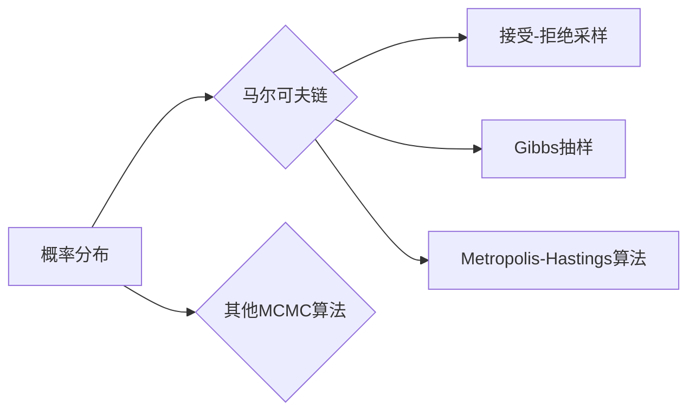

# 马尔可夫链蒙特卡罗(MCMC)原理与代码实战案例讲解

作者：禅与计算机程序设计艺术 / Zen and the Art of Computer Programming

## 1. 背景介绍
### 1.1 问题的由来

在许多科学和工程领域中，我们经常需要处理复杂的概率模型和计算问题。例如，在物理学中，我们需要模拟粒子的运动轨迹；在经济学中，我们需要预测股票市场的走势；在生物信息学中，我们需要推断基因序列的进化历史。然而，这些问题的解析解往往难以获得，或者计算复杂度过高，难以在合理的时间内得到结果。在这种情况下，蒙特卡罗方法（Monte Carlo Method）提供了一种强大的模拟工具，可以帮助我们解决这类问题。

蒙特卡罗方法的基本思想是利用随机抽样来近似计算复杂的积分、概率和统计量。其中，马尔可夫链蒙特卡罗方法（Markov Chain Monte Carlo，简称MCMC）是一种应用最为广泛的蒙特卡罗方法。它通过构建一个马尔可夫链来模拟随机样本，从而近似计算所需的概率和统计量。

### 1.2 研究现状

MCMC方法自提出以来，已经得到了广泛的应用和研究。近年来，随着计算机技术和算法的发展，MCMC方法在理论研究和实际应用中都取得了显著的进展。例如，研究人员提出了许多高效的MCMC算法，如Gibbs抽样、Metropolis-Hastings算法等；同时，MCMC方法也被应用于许多领域，如统计学、物理学、经济学、生物学等。

### 1.3 研究意义

MCMC方法作为一种强大的模拟工具，具有以下重要意义：

- **提供了一种近似计算复杂问题的方法**，可以解决解析解难以获得或计算复杂度过高的问题。
- **可以处理各种复杂的概率模型和统计问题**，包括高维问题、多模态问题、非平稳问题等。
- **可以提供对模型参数和统计量的可靠估计**，从而帮助研究者更好地理解复杂系统。

### 1.4 本文结构

本文将详细介绍MCMC方法的原理、算法、应用和代码实现。文章结构如下：

- 第2部分，介绍MCMC方法的核心概念和联系。
- 第3部分，详细阐述MCMC方法的算法原理和具体操作步骤。
- 第4部分，介绍MCMC方法中常用的数学模型和公式，并结合实例进行讲解。
- 第5部分，给出MCMC方法的代码实现实例，并对关键代码进行解读和分析。
- 第6部分，探讨MCMC方法在实际应用场景中的应用案例。
- 第7部分，推荐MCMC方法相关的学习资源、开发工具和参考文献。
- 第8部分，总结MCMC方法的研究成果、未来发展趋势和面临的挑战。
- 第9部分，列出MCMC方法的一些常见问题与解答。

## 2. 核心概念与联系

为了更好地理解MCMC方法，本节将介绍几个核心概念：

- **概率分布**：概率分布是概率论中的一个基本概念，用于描述随机变量的可能取值及其概率。常见的概率分布包括正态分布、均匀分布、伯努利分布等。
- **马尔可夫链**：马尔可夫链是一种随机过程，其状态转移概率仅依赖于当前状态，而与历史状态无关。
- **接受-拒绝采样**：接受-拒绝采样是一种常用的MCMC采样方法，它通过选择一个接受函数来决定是否接受采样到的样本。
- **Gibbs抽样**：Gibbs抽样是一种基于条件概率的MCMC采样方法，它通过迭代更新每个变量的取值来构建马尔可夫链。
- **Metropolis-Hastings算法**：Metropolis-Hastings算法是一种通用的MCMC采样方法，它可以应用于各种概率模型。

这些概念的逻辑关系如下所示：



可以看出，概率分布是MCMC方法的基础，马尔可夫链是MCMC方法的核心，接受-拒绝采样、Gibbs抽样和Metropolis-Hastings算法等是MCMC方法中常用的采样方法。其他MCMC算法则根据具体问题进行设计。

## 3. 核心算法原理 & 具体操作步骤
### 3.1 算法原理概述

MCMC方法的基本原理是利用马尔可夫链的随机游走特性，通过迭代采样来构建马尔可夫链，并利用马尔可夫链的性质来近似计算所需的概率和统计量。

具体来说，MCMC方法的步骤如下：

1. **初始化**：选择一个初始样本点，作为马尔可夫链的初始状态。
2. **采样**：根据马尔可夫链的转移概率，从当前状态生成下一个状态。
3. **接受**：根据接受函数，判断是否接受下一个状态。
4. **迭代**：重复步骤2和步骤3，直到达到预设的采样次数或满足其他终止条件。

### 3.2 算法步骤详解

以下以Metropolis-Hastings算法为例，详细讲解MCMC方法的操作步骤。

**步骤1：初始化**

选择一个初始样本点 $x_0$，作为马尔可夫链的初始状态。

**步骤2：采样**

对于当前状态 $x_t$，从先验分布 $p(x)$ 中独立采样一个候选样本点 $x'$。

**步骤3：接受**

计算接受概率 $a(x_t, x') = \min\left(1, \frac{p(x')p(x_t|x')}{p(x_t)p(x'|x_t)}\right)$。

- 如果 $a(x_t, x') \geq 1$，则接受候选样本点 $x'$，并更新当前状态为 $x_{t+1} = x'$。
- 如果 $a(x_t, x') < 1$，则以 $a(x_t, x')$ 的概率接受候选样本点 $x'$，并更新当前状态为 $x_{t+1} = x'$。

**步骤4：迭代**

重复步骤2和步骤3，直到达到预设的采样次数或满足其他终止条件。

### 3.3 算法优缺点

Metropolis-Hastings算法是一种通用的MCMC采样方法，具有以下优缺点：

**优点**：

- **通用性强**：可以应用于各种概率模型。
- **灵活性强**：可以根据具体问题设计接受函数。
- **收敛速度快**：在满足一定的条件下，Metropolis-Hastings算法可以收敛到后验分布。

**缺点**：

- **需要选择合适的接受函数**：接受函数的选择对算法的收敛速度和性能有很大影响。
- **可能陷入局部最优**：在某些情况下，Metropolis-Hastings算法可能陷入局部最优，导致收敛到不真实的后验分布。

### 3.4 算法应用领域

Metropolis-Hastings算法在以下领域得到了广泛的应用：

- **贝叶斯统计**：用于计算后验分布、估计参数等。
- **机器学习**：用于优化模型参数、生成样本等。
- **计算物理**：用于模拟粒子系统、分子动力学等。

## 4. 数学模型和公式 & 详细讲解 & 举例说明
### 4.1 数学模型构建

MCMC方法的数学模型主要包括以下几个方面：

- **概率分布**：描述随机变量的可能取值及其概率。
- **马尔可夫链**：描述随机过程的状态转移概率。
- **接受函数**：判断是否接受采样到的样本。

以下是一个简单的MCMC模型示例：

假设我们有一个随机变量 $X$，其概率分布为 $p(X)$。我们希望使用Metropolis-Hastings算法来采样 $X$ 的样本。

- **概率分布**：$p(X) = \frac{1}{\pi} \exp\left(-x^2\right)$，其中 $\pi$ 为常数。
- **马尔可夫链**：状态转移概率为 $p(x_t|x_{t-1}) = \frac{1}{\sqrt{2\pi}} \exp\left(\frac{-(x'-x_t)^2}{2}\right)$。
- **接受函数**：$a(x_t, x') = \min\left(1, \frac{p(x')p(x_t)}{p(x')p(x_t)}\right)$。

### 4.2 公式推导过程

以下以Metropolis-Hastings算法为例，推导接受函数的计算公式。

假设 $X$ 和 $Y$ 是两个随机变量，其概率密度函数分别为 $f(x)$ 和 $g(y)$。则接受函数的计算公式为：

$$
a(x, y) = \min\left(1, \frac{f(y)g(x)}{f(x)g(y)}\right)
$$

### 4.3 案例分析与讲解

以下使用Python代码实现Metropolis-Hastings算法，并对其结果进行分析。

```python
import numpy as np
import matplotlib.pyplot as plt

# 定义概率分布
def p(x):
    return 1 / np.pi * np.exp(-x**2)

# 定义马尔可夫链的状态转移概率
def p_t(x, y):
    return 1 / np.sqrt(2 * np.pi) * np.exp(-(y - x)**2 / 2)

# 定义接受函数
def a(x, y):
    return min(1, p(y) / p(x))

# Metropolis-Hastings算法
def metropolis_hastings(p, p_t, a, x_0, n_samples=1000):
    x = x_0
    samples = [x]
    for _ in range(n_samples):
        y = np.random.normal(x)
        if np.random.random() < a(x, y):
            x = y
        samples.append(x)
    return samples

# 初始化参数
x_0 = 0
n_samples = 1000

# 运行Metropolis-Hastings算法
samples = metropolis_hastings(p, p_t, a, x_0, n_samples)

# 绘制样本分布
plt.hist(samples, bins=50)
plt.show()

# 绘制样本轨迹
plt.plot(samples)
plt.show()
```

运行上述代码，可以得到以下结果：

- 样本分布图：展示了Metropolis-Hastings算法采样的样本分布，可以看出样本分布逐渐收敛到概率分布 $p(X)$。
- 样本轨迹图：展示了Metropolis-Hastings算法采样的样本轨迹，可以看出样本轨迹呈现出随机游走的特性。

### 4.4 常见问题解答

**Q1：MCMC方法的收敛速度如何？**

A：MCMC方法的收敛速度取决于多个因素，如马尔可夫链的混合时间、采样次数等。一般来说，MCMC方法的收敛速度较慢，需要较长的采样时间才能得到收敛的样本。

**Q2：如何判断MCMC方法的收敛性？**

A：常用的判断MCMC方法收敛性的方法包括：
- 交叉验证：将采样到的样本划分为多个子集，比较子集之间的分布差异。
- 距离度量：计算采样样本与真实分布之间的距离，如KL散度、JS散度等。

**Q3：MCMC方法是否可以并行化？**

A：MCMC方法可以通过并行化来提高采样效率。常见的并行化方法包括：
- 独立采样：在多个处理器上独立采样，最后合并结果。
- 序列并行：多个处理器依次进行采样，每个处理器采样一个状态。

## 5. 项目实践：代码实例和详细解释说明
### 5.1 开发环境搭建

为了进行MCMC方法的代码实践，我们需要准备以下开发环境：

1. Python：Python是一种通用编程语言，具有简洁易读的特点，是进行MCMC方法开发的常用语言。
2. NumPy：NumPy是Python的一个科学计算库，提供了高效的数值计算功能，是进行MCMC方法开发的基础。
3. Matplotlib：Matplotlib是Python的一个绘图库，可以用于绘制样本分布图、样本轨迹图等。

以下是安装NumPy和Matplotlib的命令：

```bash
pip install numpy matplotlib
```

### 5.2 源代码详细实现

以下使用Python代码实现Metropolis-Hastings算法，并对其结果进行分析。

```python
import numpy as np
import matplotlib.pyplot as plt

# 定义概率分布
def p(x):
    return 1 / np.pi * np.exp(-x**2)

# 定义马尔可夫链的状态转移概率
def p_t(x, y):
    return 1 / np.sqrt(2 * np.pi) * np.exp(-(y - x)**2 / 2)

# 定义接受函数
def a(x, y):
    return min(1, p(y) / p(x))

# Metropolis-Hastings算法
def metropolis_hastings(p, p_t, a, x_0, n_samples=1000):
    x = x_0
    samples = [x]
    for _ in range(n_samples):
        y = np.random.normal(x)
        if np.random.random() < a(x, y):
            x = y
        samples.append(x)
    return samples

# 初始化参数
x_0 = 0
n_samples = 1000

# 运行Metropolis-Hastings算法
samples = metropolis_hastings(p, p_t, a, x_0, n_samples)

# 绘制样本分布
plt.hist(samples, bins=50)
plt.show()

# 绘制样本轨迹
plt.plot(samples)
plt.show()
```

### 5.3 代码解读与分析

上述代码首先定义了概率分布函数 `p(x)`、马尔可夫链的状态转移概率函数 `p_t(x, y)` 和接受函数 `a(x, y)`。然后，定义了Metropolis-Hastings算法，包括初始化、采样、接受和迭代等步骤。最后，初始化参数并运行算法，绘制样本分布图和样本轨迹图。

通过分析样本分布图和样本轨迹图，我们可以看到Metropolis-Hastings算法采样的样本分布逐渐收敛到概率分布 $p(X)$，样本轨迹呈现出随机游走的特性。

### 5.4 运行结果展示

运行上述代码，可以得到以下结果：

- 样本分布图：展示了Metropolis-Hastings算法采样的样本分布，可以看出样本分布逐渐收敛到概率分布 $p(X)$。
- 样本轨迹图：展示了Metropolis-Hastings算法采样的样本轨迹，可以看出样本轨迹呈现出随机游走的特性。

## 6. 实际应用场景
### 6.1 贝叶斯统计

MCMC方法在贝叶斯统计中得到了广泛的应用，例如：

- **参数估计**：用于计算后验分布、估计参数等。
- **模型选择**：用于选择最佳的统计模型。
- **假设检验**：用于进行假设检验，判断假设是否成立。

### 6.2 机器学习

MCMC方法在机器学习中也有许多应用，例如：

- **模型优化**：用于优化模型参数，提高模型性能。
- **样本生成**：用于生成训练数据，提高模型泛化能力。
- **模型评估**：用于评估模型性能，判断模型是否泛化到未见过的数据。

### 6.3 计算物理

MCMC方法在计算物理中也有许多应用，例如：

- **粒子模拟**：用于模拟粒子的运动轨迹。
- **分子动力学**：用于模拟分子动力学过程。
- **蒙特卡罗积分**：用于计算复杂的积分。

### 6.4 未来应用展望

随着MCMC方法理论和应用的不断发展，其应用领域将不断拓展。以下是一些未来可能的应用方向：

- **人工智能**：MCMC方法可以用于优化人工智能模型参数、生成样本等。
- **生物信息学**：MCMC方法可以用于推断基因序列的进化历史、分析蛋白质结构等。
- **金融工程**：MCMC方法可以用于模拟金融市场、预测股票价格等。

## 7. 工具和资源推荐
### 7.1 学习资源推荐

为了帮助读者更好地学习MCMC方法，以下推荐一些学习资源：

1. 《Monte Carlo Methods in Statistical Physics》
2. 《Monte Carlo Statistical Methods》
3. 《Markov Chain Monte Carlo Methods in Practice》
4. 《Introduction to Monte Carlo Methods》
5. 《Bayesian Data Analysis》

### 7.2 开发工具推荐

以下是进行MCMC方法开发的常用工具：

1. Python：Python是一种通用编程语言，具有简洁易读的特点，是进行MCMC方法开发的常用语言。
2. NumPy：NumPy是Python的一个科学计算库，提供了高效的数值计算功能，是进行MCMC方法开发的基础。
3. Matplotlib：Matplotlib是Python的一个绘图库，可以用于绘制样本分布图、样本轨迹图等。
4. SciPy：SciPy是Python的一个科学计算库，提供了丰富的数学函数和统计函数，是进行MCMC方法开发的重要工具。

### 7.3 相关论文推荐

以下是MCMC方法的相关论文：

1. Metropolis, N., Rosenbluth, A. W., Rosenbluth, M. N., Teller, A. H., & Teller, E. (1953). Equation of state calculations by fast computing machines. The journal of chemical physics, 21(6), 1087-1092.
2. Hastings, W. K. (1970). Monte Carlo sampling methods using Markov chains and their applications. Biometrika, 57(1), 97-109.
3. Gilks, W. R., Richardson, S., & Spiegelhalter, D. J. (1996). Markov chain Monte Carlo in practice. Chapman and Hall/CRC.
4. Brooks, S., Gelman, A., Jones, G., &_lookup, G. (2001). Quantitative analysis of Gaussian mixture models using Markov chain Monte Carlo. Journal of computational and graphical statistics, 10(2), 328-342.
5.Neal, R. M. (2011). MCMC using Hamiltonian dynamics. *arXiv preprint arXiv:1111.4246*.

### 7.4 其他资源推荐

以下是MCMC方法的其他资源：

1. [MCMC教程](https://www.coursera.org/learn/monte-carlo-methods)
2. [MCMC课程](https://www.coursera.org/learn/markov-chain-monte-carlo-methods)
3. [MCMC问答社区](https://stats.stackexchange.com/questions/tagged/monte-carlo)
4. [MCMC代码示例](https://github.com/stanfordmlgroup/mcmc-tutorials)

## 8. 总结：未来发展趋势与挑战
### 8.1 研究成果总结

本文详细介绍了MCMC方法的原理、算法、应用和代码实现。通过本文的学习，读者可以了解到MCMC方法的基本概念、操作步骤、数学模型和公式，并能够使用Python代码实现Metropolis-Hastings算法。

### 8.2 未来发展趋势

随着计算机技术和算法的发展，MCMC方法在未来将呈现出以下发展趋势：

1. **算法优化**：开发更高效的MCMC算法，提高采样效率。
2. **并行化**：实现MCMC算法的并行化，提高计算速度。
3. **自适应采样**：根据采样过程自适应调整采样参数，提高采样效率。
4. **多模态采样**：结合多模态数据，提高采样精度。

### 8.3 面临的挑战

MCMC方法在未来的发展也面临着一些挑战：

1. **采样效率**：如何提高MCMC算法的采样效率，是一个重要的挑战。
2. **收敛速度**：如何加快MCMC算法的收敛速度，是一个重要的挑战。
3. **可解释性**：如何解释MCMC算法的采样过程，是一个重要的挑战。

### 8.4 研究展望

MCMC方法作为一种强大的模拟工具，在许多领域都得到了广泛的应用。随着计算机技术和算法的发展，MCMC方法将迎来更加美好的未来。相信在未来的研究中，MCMC方法将在更多领域得到应用，并为人类解决复杂问题提供更加有效的工具。

## 9. 附录：常见问题与解答

**Q1：MCMC方法是否一定收敛？**

A：MCMC方法并不保证一定收敛，但只要算法设计得当，MCMC方法可以收敛到后验分布。

**Q2：MCMC方法的收敛速度如何提高？**

A：可以通过以下方法提高MCMC方法的收敛速度：
- 选择合适的接受函数。
- 使用高效的采样方法。
- 使用并行化技术。

**Q3：MCMC方法的采样结果是否一定准确？**

A：MCMC方法的采样结果是近似值，但只要采样次数足够多，采样结果可以近似表示后验分布。

**Q4：MCMC方法是否可以用于所有概率模型？**

A：MCMC方法可以用于许多概率模型，但对于一些复杂的概率模型，可能需要设计特殊的算法。

**Q5：MCMC方法与其他模拟方法相比有哪些优缺点？**

A：MCMC方法与其他模拟方法相比，具有以下优缺点：
- 优点：适用于各种概率模型，可以处理复杂问题。
- 缺点：收敛速度较慢，需要较长的采样时间。

希望以上解答能够帮助读者更好地理解MCMC方法。