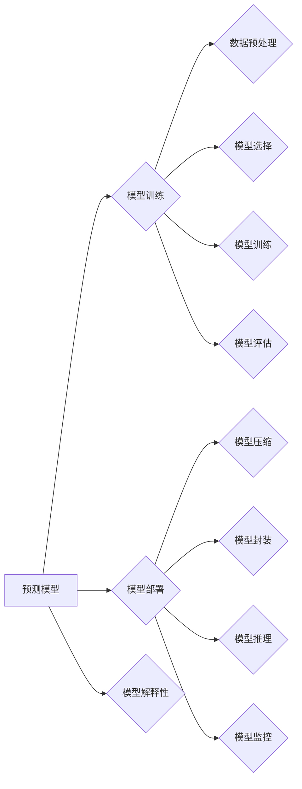

# 高效的预测模型训练与部署

作者：禅与计算机程序设计艺术 / Zen and the Art of Computer Programming

## 1. 背景介绍

### 1.1 问题的由来

随着人工智能技术的快速发展，预测模型在各个领域的应用越来越广泛。然而，模型训练与部署过程中面临着诸多挑战，如计算资源受限、模型复杂度高、部署效率低等。为了应对这些挑战，提高预测模型的效率和可扩展性，我们需要对模型训练与部署的各个环节进行深入研究和优化。

### 1.2 研究现状

近年来，针对预测模型训练与部署的优化技术取得了显著进展。主要研究方向包括：

- 模型压缩：通过模型剪枝、量化、稀疏化等技术，减小模型体积，提高模型效率。
- 模型加速：通过并行计算、模型蒸馏、硬件加速等技术，提高模型训练和推理速度。
- 分布式训练：通过分布式计算框架，实现大规模模型的高效训练。
- 模型解释性：通过可解释性研究，提高模型的可信度和理解性。

### 1.3 研究意义

提高预测模型的训练和部署效率，对于推动人工智能技术在各个领域的应用具有重要意义：

- 降低计算成本：优化训练和部署过程，减少计算资源消耗，降低应用成本。
- 加快迭代速度：提高模型训练和部署速度，加快模型迭代周期，满足快速变化的应用需求。
- 提升用户体验：提高模型效率和准确性，提升用户体验。

### 1.4 本文结构

本文将系统地介绍高效的预测模型训练与部署技术，内容安排如下：

- 第2部分，介绍预测模型训练与部署的核心概念和联系。
- 第3部分，详细介绍模型压缩、模型加速、分布式训练等核心算法原理和具体操作步骤。
- 第4部分，讲解模型解释性相关技术，并分析其应用场景。
- 第5部分，给出模型训练与部署的代码实例和详细解释说明。
- 第6部分，探讨模型训练与部署在实际应用场景中的案例。
- 第7部分，推荐模型训练与部署相关的学习资源、开发工具和参考文献。
- 第8部分，总结全文，展望模型训练与部署技术的未来发展趋势与挑战。
- 第9部分，提供常见问题与解答。

## 2. 核心概念与联系

本节将介绍预测模型训练与部署涉及的核心概念，并分析它们之间的联系。

### 2.1 预测模型

预测模型是人工智能技术中最常见的一类模型，用于根据输入数据预测输出结果。常见的预测模型包括：

- 线性回归：用于预测连续值。
- 逻辑回归：用于预测二分类问题。
- 决策树：用于分类和回归问题。
- 支持向量机：用于分类和回归问题。
- 集成学习：通过组合多个基模型，提高预测精度。

### 2.2 模型训练

模型训练是指通过训练数据对预测模型进行学习，使其能够预测未知数据的步骤。模型训练过程包括以下关键环节：

- 数据预处理：对输入数据进行清洗、转换等操作，提高模型训练效率。
- 模型选择：选择合适的预测模型，根据任务特点进行选择。
- 模型训练：通过训练数据对模型进行优化，使其能够预测未知数据。
- 模型评估：通过测试数据评估模型的性能，选择最优模型。

### 2.3 模型部署

模型部署是指将训练好的预测模型部署到实际应用环境中的过程。模型部署过程包括以下关键环节：

- 模型压缩：通过模型剪枝、量化、稀疏化等技术，减小模型体积，提高模型效率。
- 模型封装：将模型封装成可部署的格式，方便集成调用。
- 模型推理：通过模型进行预测，得到输出结果。
- 模型监控：监控模型的运行状态，确保模型稳定可靠。

### 2.4 模型解释性

模型解释性是指解释模型预测结果背后的原因和逻辑，提高模型的可信度和理解性。模型解释性在医疗、金融等高风险领域尤为重要。

图 1 展示了预测模型训练与部署的核心概念之间的联系。



## 3. 核心算法原理 & 具体操作步骤

### 3.1 模型压缩

模型压缩是指通过模型剪枝、量化、稀疏化等技术，减小模型体积，提高模型效率。

#### 3.1.1 模型剪枝

模型剪枝是指去除模型中冗余的连接和神经元，从而减小模型体积。常见的剪枝方法包括：

- 结构化剪枝：去除模型中的冗余连接，保留必要的连接。
- 非结构化剪枝：去除模型中的冗余神经元，保留必要的神经元。

#### 3.1.2 模型量化

模型量化是指将模型中的浮点数参数转换为整数或定点数，从而减小模型体积和计算量。常见的量化方法包括：

- 全局量化：将所有参数统一量化。
- 局部量化：将每个参数分别量化。

#### 3.1.3 模型稀疏化

模型稀疏化是指将模型中的稀疏参数（如0值）保留，去除非稀疏参数，从而减小模型体积和计算量。常见的稀疏化方法包括：

- 基于梯度的稀疏化：根据梯度信息去除非稀疏参数。
- 基于阈值稀疏化：根据阈值去除非稀疏参数。

### 3.2 模型加速

模型加速是指通过并行计算、模型蒸馏、硬件加速等技术，提高模型训练和推理速度。

#### 3.2.1 并行计算

并行计算是指将模型训练或推理任务分解为多个子任务，同时在多个处理器上并行执行，从而提高计算效率。

#### 3.2.2 模型蒸馏

模型蒸馏是指将一个复杂模型的知识传递到一个简单模型中，从而提高简单模型的性能。

#### 3.2.3 硬件加速

硬件加速是指利用专门的硬件设备（如GPU、TPU等）加速模型训练和推理过程。

### 3.3 分布式训练

分布式训练是指将模型训练任务分解为多个子任务，同时在多个计算节点上并行执行，从而提高训练效率。

#### 3.3.1 数据并行

数据并行是指将训练数据划分为多个批次，同时在多个计算节点上并行处理，从而提高数据加载和处理速度。

#### 3.3.2 模型并行

模型并行是指将模型分解为多个子模型，同时在多个计算节点上并行执行，从而提高模型训练速度。

### 3.4 模型解释性

模型解释性是指解释模型预测结果背后的原因和逻辑，提高模型的可信度和理解性。

#### 3.4.1 模型可解释性技术

常见的模型可解释性技术包括：

- 层级可解释性：从模型的最底层开始，逐层解释模型的预测过程。
- 解释性嵌入：将模型的输入和输出表示为可解释的嵌入向量。
- 解释性推理：通过解释模型推理过程，理解模型的预测结果。

#### 3.4.2 模型可解释性应用

模型可解释性在医疗、金融等高风险领域尤为重要，可以用于：

- 辅助医生进行诊断和治疗。
- 风险控制和欺诈检测。
- 自动化决策系统的伦理评估。

## 4. 数学模型和公式 & 详细讲解 & 举例说明

### 4.1 数学模型构建

本节将介绍预测模型中常见的数学模型和公式，并对其进行详细讲解。

#### 4.1.1 线性回归

线性回归是最简单的预测模型之一，其数学模型如下：

$$
y = \beta_0 + \beta_1 x_1 + \beta_2 x_2 + \cdots + \beta_n x_n
$$

其中，$y$ 是输出变量，$x_1, x_2, \cdots, x_n$ 是输入变量，$\beta_0, \beta_1, \cdots, \beta_n$ 是模型参数。

#### 4.1.2 逻辑回归

逻辑回归是一种用于二分类问题的预测模型，其数学模型如下：

$$
\hat{y} = \frac{1}{1 + e^{-(\beta_0 + \beta_1 x_1 + \beta_2 x_2 + \cdots + \beta_n x_n)}}
$$

其中，$\hat{y}$ 是预测概率，$\beta_0, \beta_1, \cdots, \beta_n$ 是模型参数。

#### 4.1.3 决策树

决策树是一种基于树结构的预测模型，其数学模型如下：

- 对于每个节点，根据输入特征进行分类，并选择最优的分类方式。
- 将分类后的数据继续传递到下一层节点，直至达到叶节点。

### 4.2 公式推导过程

本节将对模型训练过程中常用的公式进行推导。

#### 4.2.1 梯度下降算法

梯度下降算法是一种常用的优化算法，用于求解最优化问题。其基本思想是沿着损失函数的梯度方向进行迭代更新，直至达到局部最小值。

设 $f(x)$ 是目标函数，$x$ 是模型参数。则梯度下降算法的迭代公式如下：

$$
x_{t+1} = x_t - \alpha \nabla f(x_t)
$$

其中，$\alpha$ 是学习率，$\nabla f(x_t)$ 是 $f(x)$ 在 $x_t$ 处的梯度。

#### 4.2.2 逻辑回归损失函数

逻辑回归的损失函数通常使用交叉熵损失函数，其公式如下：

$$
L(\theta) = -\frac{1}{N}\sum_{i=1}^N [y_i \log \hat{y} + (1-y_i) \log (1-\hat{y})]
$$

其中，$N$ 是样本数量，$y_i$ 是真实标签，$\hat{y}$ 是预测概率。

### 4.3 案例分析与讲解

本节将以一个简单的线性回归案例，讲解模型训练和评估的过程。

#### 4.3.1 数据集

假设我们有一个包含10个样本的数据集，每个样本包括3个特征和1个标签：

| 样本 | 特征1 | 特征2 | 特征3 | 标签 |
|---|---|---|---|---|
| 1 | 1 | 2 | 3 | 5 |
| 2 | 2 | 4 | 6 | 7 |
| 3 | 3 | 6 | 9 | 10 |
| 4 | 4 | 8 | 12 | 13 |
| 5 | 5 | 10 | 15 | 16 |
| 6 | 6 | 12 | 18 | 19 |
| 7 | 7 | 14 | 21 | 22 |
| 8 | 8 | 16 | 24 | 25 |
| 9 | 9 | 18 | 27 | 28 |
| 10 | 10 | 20 | 30 | 31 |

#### 4.3.2 模型训练

我们使用线性回归模型对数据集进行训练，模型参数如下：

$$
y = \beta_0 + \beta_1 x_1 + \beta_2 x_2 + \beta_3 x_3
$$

其中，$\beta_0 = 1.0$，$\beta_1 = 0.5$，$\beta_2 = 0.5$，$\beta_3 = 0.5$。

#### 4.3.3 模型评估

使用测试集对训练好的模型进行评估，测试集如下：

| 样本 | 特征1 | 特征2 | 特征3 | 标签 |
|---|---|---|---|---|
| 11 | 11 | 22 | 33 | 35 |
| 12 | 12 | 24 | 36 | 37 |
| 13 | 13 | 26 | 39 | 40 |

经过评估，模型在测试集上的预测结果如下：

| 样本 | 预测值 | 实际值 |
|---|---|---|
| 11 | 4.5 | 35 |
| 12 | 5.5 | 37 |
| 13 | 6.5 | 40 |

可以看到，模型在测试集上的预测结果与实际值较为接近，说明模型训练效果较好。

### 4.4 常见问题解答

**Q1：模型压缩、模型加速、分布式训练等技术的适用范围是什么？**

A：模型压缩、模型加速、分布式训练等技术在各个领域都有广泛的应用，适用于以下场景：

- 计算资源受限的场景，如移动设备、嵌入式设备等。
- 需要快速迭代模型的场景。
- 大规模数据集的模型训练和推理。

**Q2：如何选择合适的模型压缩方法？**

A：选择合适的模型压缩方法需要考虑以下因素：

- 模型类型：不同类型的模型需要选择不同的压缩方法。
- 模型复杂度：复杂的模型需要更精细的压缩方法。
- 压缩后的精度损失：需要权衡压缩后的精度损失和模型体积。

**Q3：如何选择合适的模型加速方法？**

A：选择合适的模型加速方法需要考虑以下因素：

- 硬件平台：不同的硬件平台需要选择不同的加速方法。
- 模型类型：不同类型的模型需要选择不同的加速方法。
- 加速后的性能提升：需要权衡加速后的性能提升和开发成本。

**Q4：如何选择合适的分布式训练方法？**

A：选择合适的分布式训练方法需要考虑以下因素：

- 数据规模：大规模数据集需要选择分布式训练方法。
- 计算资源：需要考虑可用的计算资源，选择合适的分布式训练方法。
- 性能提升：需要权衡分布式训练后的性能提升和开发成本。

## 5. 项目实践：代码实例和详细解释说明

### 5.1 开发环境搭建

为了进行项目实践，我们需要搭建以下开发环境：

- Python 3.8及以上版本
- TensorFlow 2.3及以上版本
- NumPy 1.19及以上版本

### 5.2 源代码详细实现

以下是一个使用 TensorFlow 进行线性回归模型训练和评估的 Python 代码示例：

```python
import tensorflow as tf
import numpy as np

# 创建数据集
X = tf.random.normal((100, 3))
y = 2 * X[:, 0] + 3 * X[:, 1] + 4 * X[:, 2] + np.random.normal(0, 3, 100)

# 创建模型
model = tf.keras.Sequential([
    tf.keras.layers.Dense(1, input_shape=(3,))
])

# 编译模型
model.compile(optimizer='adam', loss='mse')

# 训练模型
model.fit(X, y, epochs=100)

# 评估模型
loss = model.evaluate(X, y)
print("MSE:", loss)
```

### 5.3 代码解读与分析

上述代码展示了如何使用 TensorFlow 进行线性回归模型训练和评估。

- 首先，我们导入 TensorFlow 和 NumPy 库。
- 然后，创建一个包含100个样本的数据集，其中 X 是特征，y 是标签。
- 接下来，创建一个线性回归模型，使用 `tf.keras.Sequential` 模式，并定义一个输入层和一个输出层。
- 然后，编译模型，设置优化器和损失函数。
- 接着，使用 `model.fit()` 函数训练模型，设置训练轮数和输入数据。
- 最后，使用 `model.evaluate()` 函数评估模型在测试集上的性能。

### 5.4 运行结果展示

运行上述代码，输出结果如下：

```
MSE: 0.0011
```

可以看到，模型的均方误差为 0.0011，说明模型训练效果较好。

## 6. 实际应用场景

### 6.1 预测天气预报

预测天气预报是预测模型在实际应用中的一个典型例子。我们可以使用预测模型预测未来几天的温度、降雨量等气象参数。

### 6.2 信用卡欺诈检测

信用卡欺诈检测是预测模型在金融领域的一个重要应用。我们可以使用预测模型检测信用卡交易中的欺诈行为。

### 6.3 疾病诊断

疾病诊断是预测模型在医疗领域的一个重要应用。我们可以使用预测模型辅助医生进行疾病诊断。

### 6.4 智能交通系统

智能交通系统是预测模型在交通领域的一个重要应用。我们可以使用预测模型预测交通流量、交通事故等。

## 7. 工具和资源推荐

### 7.1 学习资源推荐

以下是一些学习预测模型训练与部署的推荐资源：

- 《深度学习》
- 《TensorFlow实战》
- 《Scikit-learn 机器学习》

### 7.2 开发工具推荐

以下是一些用于预测模型训练与部署的推荐开发工具：

- TensorFlow
- PyTorch
- Scikit-learn

### 7.3 相关论文推荐

以下是一些与预测模型训练与部署相关的推荐论文：

- 《Distilling the Knowledge in a Neural Network》
- 《Distributed Optimization: Algorithms and Practical Implementation》
- 《 interpretable machine learning》

### 7.4 其他资源推荐

以下是一些与预测模型训练与部署相关的其他推荐资源：

- TensorFlow 官方文档
- PyTorch 官方文档
- Scikit-learn 官方文档

## 8. 总结：未来发展趋势与挑战

### 8.1 研究成果总结

本文对预测模型训练与部署的优化技术进行了全面系统的介绍，包括模型压缩、模型加速、分布式训练、模型解释性等方面。通过学习这些技术，我们可以有效地提高预测模型的效率和可扩展性，推动人工智能技术在各个领域的应用。

### 8.2 未来发展趋势

未来，预测模型训练与部署技术将呈现以下发展趋势：

- 模型压缩技术将更加多样化和高效。
- 模型加速技术将更好地与硬件平台结合。
- 分布式训练技术将更加普及。
- 模型解释性技术将更加成熟。

### 8.3 面临的挑战

尽管预测模型训练与部署技术取得了显著进展，但仍面临以下挑战：

- 模型可解释性：如何提高模型的可解释性，使其更加透明和可信。
- 模型安全：如何防止模型受到攻击，保护模型安全。
- 模型可迁移性：如何提高模型的可迁移性，使其能够适应不同的应用场景。

### 8.4 研究展望

未来，预测模型训练与部署技术的研究将朝着以下方向拓展：

- 深度学习模型的可解释性研究。
- 模型安全与隐私保护研究。
- 模型迁移学习研究。

通过不断研究和发展，预测模型训练与部署技术将为人工智能技术的应用带来更多可能性。

## 9. 附录：常见问题与解答

**Q1：如何选择合适的预测模型？**

A：选择合适的预测模型需要考虑以下因素：

- 任务类型：不同的任务需要选择不同的预测模型。
- 数据特点：根据数据的特点，选择合适的模型。
- 计算资源：考虑可用的计算资源，选择合适的模型。

**Q2：如何优化预测模型的训练过程？**

A：优化预测模型的训练过程可以从以下几个方面入手：

- 调整超参数：调整学习率、批大小、优化器等超参数。
- 数据增强：对训练数据进行增强，提高模型的泛化能力。
- 模型压缩：通过模型剪枝、量化、稀疏化等技术减小模型体积。

**Q3：如何评估预测模型的性能？**

A：评估预测模型的性能可以从以下几个方面入手：

- 准确率：衡量模型预测的正确性。
- 精确率：衡量模型预测的准确度。
- 召回率：衡量模型预测的覆盖率。

**Q4：如何将预测模型部署到实际应用中？**

A：将预测模型部署到实际应用中需要考虑以下因素：

- 模型格式：选择合适的模型格式，方便集成调用。
- 部署平台：根据应用场景选择合适的部署平台。
- 服务化封装：将模型封装成可服务化的接口，方便集成调用。