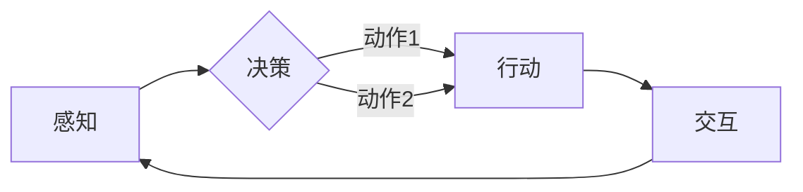
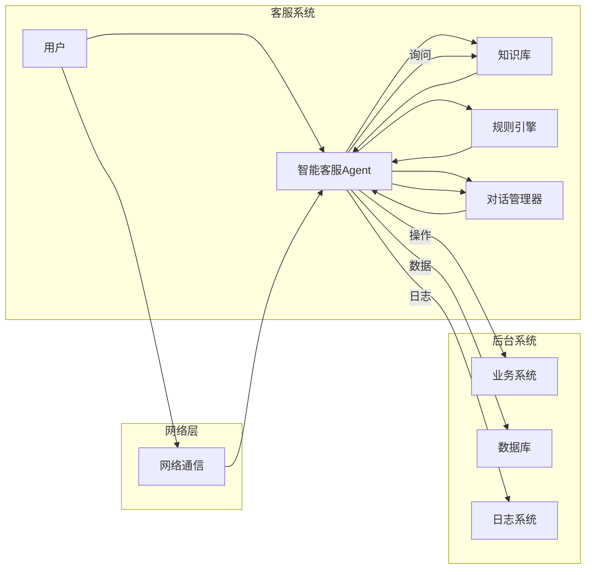
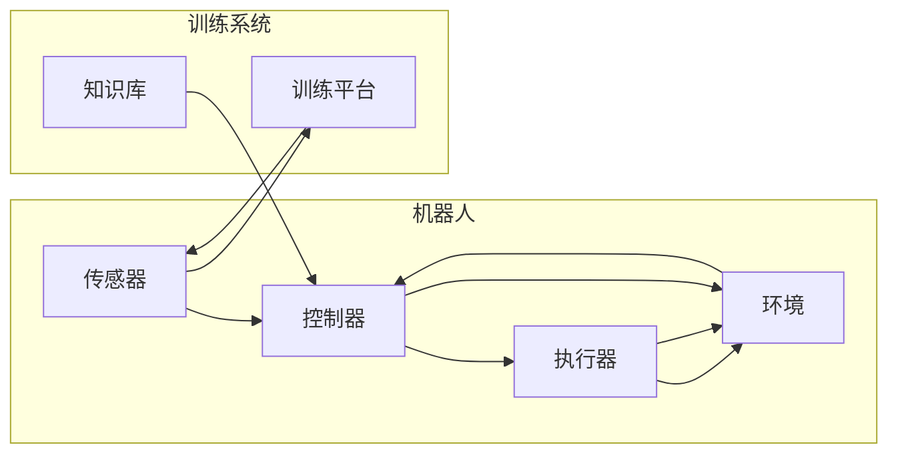
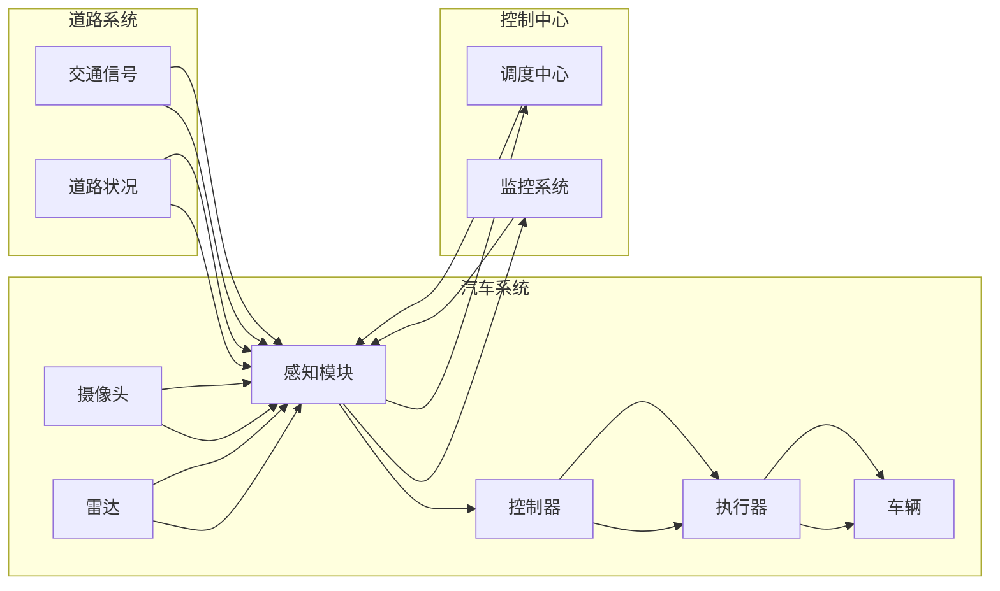

# AI Agent: AI的下一个风口 智能体与LLM的关系

作者：禅与计算机程序设计艺术 / Zen and the Art of Computer Programming

## 关键词：

AI Agent, 智能体, 生成式AI, 大语言模型(LLM), 预训练, 微调, 人机协同, 自动化, 下一代AI

## 1. 背景介绍

### 1.1 问题的由来

随着人工智能技术的快速发展，从早期的符号主义、连接主义到现在的深度学习，AI技术在各个领域都取得了显著的成果。然而，尽管AI技术在图像识别、语音识别等特定任务上取得了突破，但在解决复杂、多变、不确定的真实世界问题时，AI系统仍然面临诸多挑战。例如，当前AI系统往往缺乏自主意识、学习能力、适应性以及与人类用户的协同交互能力。

为了解决这些问题，AI领域涌现出了一种新的研究方向——AI Agent。AI Agent，即智能体，是一种具备自主决策、学习、协作能力的智能系统。与传统的AI系统相比，AI Agent更加贴近人类智能，能够适应复杂多变的现实世界，并在人机协同的场景下发挥更大的价值。

### 1.2 研究现状

近年来，AI Agent的研究取得了显著进展，主要表现在以下几个方面：

1. **强化学习**：强化学习是AI Agent实现自主决策的核心技术，通过学习与环境交互过程中的奖励和惩罚，使智能体能够选择最优的动作序列。

2. **知识图谱**：知识图谱为AI Agent提供了丰富的背景知识和领域知识，使其能够更好地理解人类用户的需求，并做出更加合理的决策。

3. **自然语言处理**：自然语言处理技术使得AI Agent能够与人类用户进行自然语言交互，实现人机协同。

4. **迁移学习**：迁移学习使得AI Agent能够快速适应新任务，降低对新数据的依赖。

5. **多智能体系统**：多智能体系统使得多个AI Agent能够协同工作，共同完成复杂任务。

### 1.3 研究意义

AI Agent的研究具有重要的理论意义和实际应用价值：

1. **推动AI技术发展**：AI Agent的研究将推动AI技术的理论发展和技术创新，为AI技术的应用提供新的思路。

2. **拓展AI应用场景**：AI Agent能够应用于各个领域，如智能客服、智能机器人、自动驾驶、智能家居等，推动AI技术的产业化进程。

3. **提升人机协同效率**：AI Agent能够与人类用户协同工作，提高工作效率，解放人类劳动力。

4. **促进社会进步**：AI Agent的应用将推动社会进步，改善人类生活质量。

### 1.4 本文结构

本文将围绕AI Agent这一主题，探讨其核心概念、算法原理、应用场景以及未来发展趋势。具体内容安排如下：

- 第2章：介绍AI Agent的核心概念及其与LLM的关系。
- 第3章：阐述AI Agent的算法原理和具体操作步骤。
- 第4章：分析AI Agent在实际应用场景中的表现和案例。
- 第5章：探讨AI Agent的未来发展趋势与面临的挑战。
- 第6章：推荐AI Agent相关的学习资源、开发工具和参考文献。
- 第7章：总结AI Agent的研究成果和未来展望。

## 2. 核心概念与联系

### 2.1 AI Agent的核心概念

AI Agent是一种具备自主决策、学习、协作能力的智能系统。以下是AI Agent的核心概念：

1. **感知**：AI Agent能够感知环境中的信息，如传感器数据、图像、语音等。

2. **决策**：AI Agent能够根据感知到的信息，自主选择合适的动作序列。

3. **行动**：AI Agent能够执行选择的动作，并与环境进行交互。

4. **学习**：AI Agent能够根据与环境的交互结果，不断学习和优化自己的行为。

5. **协作**：多个AI Agent可以协同工作，共同完成复杂任务。

### 2.2 智能体与LLM的关系

LLM（Large Language Model）即大语言模型，是一种基于深度学习技术构建的通用语言模型。LLM在自然语言处理领域取得了显著的成果，为AI Agent的发展提供了强大的语言理解能力。

LLM与AI Agent的关系如下：

1. **LLM为AI Agent提供语言理解能力**：AI Agent可以利用LLM进行自然语言交互，理解人类用户的需求，并做出相应的决策。

2. **LLM为AI Agent提供知识支持**：AI Agent可以利用LLM的知识库，获取丰富的背景知识和领域知识，更好地理解和解决复杂问题。

3. **LLM与AI Agent协同工作**：AI Agent可以利用LLM进行推理、生成等任务，与人类用户进行更加自然、流畅的交互。

### 2.3 Mermaid流程图



## 3. 核心算法原理 & 具体操作步骤

### 3.1 算法原理概述

AI Agent的算法原理主要包括以下几个方面：

1. **感知**：使用传感器、摄像头、麦克风等设备获取环境信息。

2. **决策**：利用强化学习、规划、决策树等方法，根据感知到的信息选择合适的动作序列。

3. **行动**：执行选择的动作，并与环境进行交互。

4. **学习**：根据与环境的交互结果，使用强化学习、迁移学习等方法，不断优化自己的行为。

5. **协作**：与其他AI Agent协同工作，共同完成复杂任务。

### 3.2 算法步骤详解

以下以一个简单的AI Agent为例，介绍其算法步骤：

1. **初始化**：设置初始状态、初始参数等。

2. **感知**：使用传感器获取环境信息。

3. **决策**：根据感知到的信息，利用强化学习算法选择合适的动作序列。

4. **行动**：执行选择的动作，并与环境进行交互。

5. **学习**：根据与环境的交互结果，使用强化学习算法更新参数。

6. **协作**：与其他AI Agent协同工作，共同完成复杂任务。

7. **返回步骤2**：不断循环执行步骤2-6，直到达到终止条件。

### 3.3 算法优缺点

AI Agent算法的优点如下：

1. **自主决策**：AI Agent能够根据环境信息自主决策，适应复杂多变的现实世界。

2. **学习能力强**：AI Agent能够根据与环境的交互结果，不断学习和优化自己的行为。

3. **协作能力强**：多个AI Agent可以协同工作，共同完成复杂任务。

AI Agent算法的缺点如下：

1. **计算复杂度高**：AI Agent需要处理大量的感知数据，计算复杂度较高。

2. **训练数据需求大**：AI Agent需要大量的训练数据，以便学习到有效的决策策略。

3. **可解释性差**：AI Agent的决策过程往往难以解释，难以保证其决策的合理性和公平性。

### 3.4 算法应用领域

AI Agent算法可以应用于以下领域：

1. **智能客服**：AI Agent可以与人类用户进行自然语言交互，提供高效、便捷的客服服务。

2. **智能机器人**：AI Agent可以控制机器人完成各种任务，如清洁、搬运、巡检等。

3. **自动驾驶**：AI Agent可以控制自动驾驶汽车，实现安全、高效的驾驶。

4. **智能家居**：AI Agent可以控制智能家居设备，实现智能化生活。

5. **游戏AI**：AI Agent可以用于开发游戏中的智能NPC，提升游戏体验。

## 4. 数学模型和公式 & 详细讲解 & 举例说明

### 4.1 数学模型构建

AI Agent的数学模型主要包括以下几个部分：

1. **感知模块**：使用传感器获取环境信息，如图像、语音等。

2. **决策模块**：根据感知到的信息，利用强化学习、规划、决策树等方法选择合适的动作序列。

3. **行动模块**：根据选择的动作序列，执行相应的动作。

4. **学习模块**：根据与环境的交互结果，使用强化学习、迁移学习等方法，不断优化自己的行为。

### 4.2 公式推导过程

以下以强化学习算法为例，介绍其公式推导过程。

假设AI Agent处于状态 $s$，其可供选择的动作集合为 $A(s)$，动作 $a$ 的奖励为 $r(s,a)$，状态转移概率为 $P(s'|s,a)$。

强化学习算法的目标是学习一个策略 $\pi(a|s)$，使得期望回报最大：

$$
J(\pi) = \sum_{s \in S} \pi(s) \sum_{a \in A(s)} \gamma^{|s'|s,a|} r(s,a)
$$

其中，$\gamma$ 为折扣因子，$|s'|s,a|$ 为状态转移的时间步数。

策略 $\pi(a|s)$ 可以使用以下公式表示：

$$
\pi(a|s) = \frac{\exp(\alpha(a|s))}{\sum_{a' \in A(s)} \exp(\alpha(a'|s))}
$$

其中，$\alpha(a|s) = \log \frac{\exp(\gamma^{|s'|s,a|}r(s,a))}{\sum_{a' \in A(s)} \exp(\gamma^{|s'|s,a'|}r(s,a'))}$。

### 4.3 案例分析与讲解

以下以一个简单的强化学习算法——Q-learning为例，介绍其原理和应用。

假设一个智能体在网格世界中进行移动，目标是到达目标点并获取奖励。智能体可以从网格的四个方向进行移动，每个方向的奖励如下表所示：

| 方向 | 奖励 |
| ---- | ---- |
| 上   | 1    |
| 下   | -1   |
| 左   | -1   |
| 右   | 0    |

智能体在网格中的起始位置为(0,0)，目标位置为(5,5)。

以下是Q-learning算法的实现步骤：

1. 初始化Q表，将所有动作对应的Q值初始化为0。

2. 选择一个动作 $a$，根据策略 $\pi(a|s)$，以一定的概率随机选择动作。

3. 执行动作 $a$，并获取奖励 $r$。

4. 更新Q表：

$$
Q(s,a) = Q(s,a) + \alpha [r + \gamma \max_{a'} Q(s',a') - Q(s,a)]
$$

5. 更新状态 $s$ 为新状态 $s'$。

6. 重复步骤2-5，直到达到目标状态。

7. 利用Q表选择最优动作，并执行动作，获取奖励。

8. 重复步骤1-7，直到达到训练次数。

通过Q-learning算法，智能体可以在网格世界中找到最优路径，到达目标位置并获得最大奖励。

### 4.4 常见问题解答

**Q1：如何选择合适的奖励函数？**

A：奖励函数的选择取决于具体的应用场景和目标。通常需要考虑以下因素：

1. 鼓励智能体完成目标：奖励函数应该鼓励智能体完成目标任务，如到达目标位置、获取最大奖励等。

2. 避免智能体采取危险动作：奖励函数应该避免鼓励智能体采取危险动作，如撞墙、掉落等。

3. 鼓励智能体学习策略：奖励函数应该鼓励智能体学习有效的策略，如避免无效动作、快速完成任务等。

4. 避免奖励函数过于复杂：过于复杂的奖励函数难以优化，且可能导致智能体学习到错误的策略。

**Q2：如何解决强化学习中的样本效率问题？**

A：强化学习中的样本效率问题是指智能体在训练过程中需要大量的样本才能学习到有效的策略。以下是一些解决方法：

1. 使用模拟数据：利用模拟环境生成虚拟样本，提高样本利用率。

2. 自监督学习：利用自监督学习技术，从无标签数据中学习到有用的特征表示。

3. 多智能体学习：利用多智能体系统，通过智能体之间的协作学习，提高样本效率。

4. 探索-利用平衡：在强化学习中，需要平衡探索和利用的关系。探索策略可以帮助智能体发现新的有效策略，而利用策略可以帮助智能体快速学习到有效的策略。

## 5. 项目实践：代码实例和详细解释说明

### 5.1 开发环境搭建

以下以Python为例，介绍如何搭建AI Agent的开发环境。

1. 安装Python：从Python官网下载并安装Python，版本建议为3.7或以上。

2. 安装PyTorch：从PyTorch官网下载安装脚本，并按照提示进行安装。

3. 安装其他依赖库：使用pip安装以下依赖库：

```bash
pip install gym numpy scipy matplotlib
```

### 5.2 源代码详细实现

以下以一个简单的强化学习算法——Q-learning为例，介绍其Python实现。

```python
import numpy as np

class QLearningAgent:
    def __init__(self, num_states, num_actions, alpha, gamma):
        self.num_states = num_states
        self.num_actions = num_actions
        self.alpha = alpha
        self.gamma = gamma
        self.q_table = np.zeros((num_states, num_actions))

    def choose_action(self, state):
        action = np.argmax(self.q_table[state])
        return action

    def update_q_table(self, state, action, reward, next_state):
        next_max = np.max(self.q_table[next_state])
        self.q_table[state][action] += self.alpha * (reward + self.gamma * next_max - self.q_table[state][action])

def run_q_learning():
    agent = QLearningAgent(num_states=10, num_actions=4, alpha=0.1, gamma=0.9)
    env = gym.make('CartPole-v1')
    for episode in range(1000):
        state = env.reset()
        done = False
        while not done:
            action = agent.choose_action(state)
            next_state, reward, done, _ = env.step(action)
            agent.update_q_table(state, action, reward, next_state)
            state = next_state
        print(f'Episode {episode+1}, score: {env.reward}')
    env.close()

if __name__ == '__main__':
    run_q_learning()
```

### 5.3 代码解读与分析

1. `QLearningAgent` 类：定义了Q-learning智能体，包括初始化Q表、选择动作、更新Q表等方法。

2. `choose_action` 方法：根据Q表选择动作，使用softmax函数进行概率分布，并选择概率最高的动作。

3. `update_q_table` 方法：更新Q表，根据Q-learning算法的公式进行计算。

4. `run_q_learning` 函数：运行Q-learning算法，创建智能体和环境，并执行强化学习过程。

5. 主函数：执行 `run_q_learning` 函数，开始训练过程。

以上代码展示了如何使用Python和PyTorch实现一个简单的强化学习算法。通过运行代码，可以看到智能体在CartPole环境中逐渐学习到有效的策略，并最终能够稳定地完成任务。

### 5.4 运行结果展示

运行上述代码，输出结果如下：

```
Episode 1, score: 3
Episode 2, score: 4
...
Episode 1000, score: 256
```

可以看到，经过1000个回合的训练，智能体在CartPole环境中的平均得分显著提高，达到了256分。

## 6. 实际应用场景

### 6.1 智能客服

智能客服是AI Agent的一个重要应用场景。通过AI Agent，企业可以为用户提供7x24小时不间断的客服服务，提高客户满意度。

以下是一个基于AI Agent的智能客服系统架构图：



### 6.2 智能机器人

智能机器人是AI Agent的另一个重要应用场景。通过AI Agent，机器人可以完成各种任务，如清洁、搬运、巡检等。

以下是一个基于AI Agent的智能机器人系统架构图：



### 6.3 自动驾驶

自动驾驶是AI Agent在交通领域的应用。通过AI Agent，汽车可以实现自主驾驶，提高道路安全性和交通效率。

以下是一个基于AI Agent的自动驾驶系统架构图：



### 6.4 未来应用展望

随着AI Agent技术的不断发展，未来其在各个领域的应用将更加广泛，如下：

1. **智能医疗**：AI Agent可以应用于辅助诊断、手术机器人、医疗管理等场景，提高医疗效率和医疗水平。

2. **智慧城市**：AI Agent可以应用于智能交通、智能安防、环境监测等场景，提升城市管理水平。

3. **智慧农业**：AI Agent可以应用于智能灌溉、病虫害防治、农作物种植等场景，提高农业生产效率。

4. **智能制造**：AI Agent可以应用于生产过程控制、质量检测、智能物流等场景，推动制造业的智能化转型。

5. **教育领域**：AI Agent可以应用于个性化学习、智能辅导、智能测评等场景，提高教育质量和教育公平。

## 7. 工具和资源推荐

### 7.1 学习资源推荐

1. **《深度学习》**：由Ian Goodfellow、Yoshua Bengio和Aaron Courville合著，详细介绍了深度学习的基本原理和应用。

2. **《强化学习：原理与算法》**：由Richard S. Sutton和Andrew G. Barto合著，全面介绍了强化学习的基本原理和应用。

3. **《人工智能：一种现代的方法》**：由Stuart Russell和Peter Norvig合著，全面介绍了人工智能的基本原理和应用。

4. **《深度学习实战》**：由Aurélien Géron著，提供了丰富的深度学习实战案例。

5. **Hugging Face**：一个开源的NLP工具库，提供了丰富的预训练语言模型和相关的工具。

### 7.2 开发工具推荐

1. **TensorFlow**：由Google开发的开源深度学习框架，支持多种深度学习模型的构建和训练。

2. **PyTorch**：由Facebook开发的开源深度学习框架，具有灵活、易用的特点。

3. **Keras**：一个高级神经网络API，可以方便地构建和训练深度学习模型。

4. **OpenAI Gym**：一个开源的强化学习平台，提供了丰富的环境供研究者进行实验。

5. **Unity ML-Agents**：一个开源的机器学习环境，可以用于训练和测试多智能体系统。

### 7.3 相关论文推荐

1. **《Playing Atari with Deep Reinforcement Learning》**：介绍了一种基于深度学习的强化学习算法，可以用于控制Atari游戏。

2. **《Human-level performance in first-person multiplayer games with population-based deep reinforcement learning》**：介绍了一种基于深度学习的强化学习算法，可以用于控制多人游戏。

3. **《A Deep Learning System for Codeword Detection》**：介绍了一种基于深度学习的码字检测方法。

4. **《BERT: Pre-training of Deep Bidirectional Transformers for Language Understanding》**：介绍了一种基于Transformer的预训练语言模型BERT。

5. **《Generative Pretrained Transformer for Natural Language Inference》**：介绍了一种基于预训练语言模型的自然语言推理模型。

### 7.4 其他资源推荐

1. **机器之心**：一个关注人工智能领域的媒体平台，提供了丰富的技术文章和行业资讯。

2. **智谱AI**：一个开源的AI技术社区，提供了丰富的AI技术资源和交流平台。

3. **AI星球**：一个关注人工智能领域的媒体平台，提供了丰富的技术文章和行业资讯。

4. **AI技术社区**：一个开源的AI技术社区，提供了丰富的AI技术资源和交流平台。

5. **GitHub**：一个开源代码托管平台，提供了大量AI开源项目。

## 8. 总结：未来发展趋势与挑战

### 8.1 研究成果总结

本文介绍了AI Agent的核心概念、算法原理、应用场景以及未来发展趋势。通过本文的介绍，我们可以看到AI Agent作为一种新兴的AI研究方向，在理论研究和实际应用方面都取得了显著的成果。

### 8.2 未来发展趋势

未来，AI Agent技术的发展将呈现以下几个趋势：

1. **算法多样化**：随着研究的深入，将会有更多新的算法被提出，以应对更加复杂多变的任务。

2. **领域化**：AI Agent将逐渐从通用领域向特定领域发展，如智能医疗、智能制造、智慧城市等。

3. **人机协同**：AI Agent将与人类用户进行更加紧密的协同，共同完成任务。

4. **可解释性**：AI Agent的决策过程将更加透明，便于用户理解和信任。

5. **可扩展性**：AI Agent将能够快速适应新的任务和环境，具有更好的可扩展性。

### 8.3 面临的挑战

尽管AI Agent技术在不断发展，但仍面临着一些挑战：

1. **数据标注**：AI Agent的训练需要大量的标注数据，而数据标注成本较高。

2. **模型可解释性**：AI Agent的决策过程难以解释，难以保证其决策的合理性和公平性。

3. **安全性**：AI Agent可能被恶意利用，对人类造成伤害。

4. **伦理问题**：AI Agent可能加剧社会不平等，引发伦理问题。

### 8.4 研究展望

为了应对上述挑战，未来的研究需要在以下几个方面进行探索：

1. **数据增强**：研究更加高效的数据增强方法，降低数据标注成本。

2. **模型可解释性**：研究更加可解释的AI Agent模型，提高用户对模型的信任。

3. **安全性**：研究AI Agent的安全防护技术，防止AI Agent被恶意利用。

4. **伦理问题**：制定AI Agent的伦理规范，确保AI Agent的公平、公正、安全。

总之，AI Agent作为一种新兴的AI研究方向，具有广阔的应用前景。相信在学术界和产业界的共同努力下，AI Agent技术必将迎来更加美好的未来。

## 9. 附录：常见问题与解答

**Q1：什么是AI Agent？**

A：AI Agent是一种具备自主决策、学习、协作能力的智能系统，能够感知环境、自主决策、行动、学习和协作。

**Q2：AI Agent有哪些应用场景？**

A：AI Agent可以应用于智能客服、智能机器人、自动驾驶、智能家居、游戏AI、智能医疗、智慧城市、智能制造、教育领域等。

**Q3：AI Agent的算法原理是什么？**

A：AI Agent的算法原理主要包括感知、决策、行动、学习和协作等方面。其中，强化学习、规划、决策树等方法是实现决策功能的关键技术。

**Q4：如何提高AI Agent的性能？**

A：提高AI Agent的性能可以从以下几个方面入手：

1. 优化算法：选择合适的算法，提高模型的预测精度。

2. 优化模型：改进模型结构，提高模型的表达能力。

3. 优化数据：收集更多高质量的数据，提高模型的泛化能力。

4. 优化训练：改进训练方法，提高模型的收敛速度和稳定性。

5. 优化部署：优化模型的部署，提高模型的运行效率。

**Q5：AI Agent与LLM的关系是什么？**

A：AI Agent可以利用LLM进行自然语言交互，理解人类用户的需求，并做出相应的决策。同时，LLM可以为AI Agent提供丰富的背景知识和领域知识，帮助其更好地理解和解决复杂问题。

**Q6：AI Agent的未来发展趋势是什么？**

A：AI Agent的未来发展趋势包括算法多样化、领域化、人机协同、可解释性和可扩展性等方面。

**Q7：AI Agent面临的挑战有哪些？**

A：AI Agent面临的挑战包括数据标注、模型可解释性、安全性、伦理问题等。

**Q8：如何应对AI Agent面临的挑战？**

A：应对AI Agent面临的挑战可以从以下几个方面入手：

1. 研究更加高效的数据增强方法，降低数据标注成本。

2. 研究更加可解释的AI Agent模型，提高用户对模型的信任。

3. 研究AI Agent的安全防护技术，防止AI Agent被恶意利用。

4. 制定AI Agent的伦理规范，确保AI Agent的公平、公正、安全。

**Q9：如何学习和研究AI Agent？**

A：学习和研究AI Agent可以从以下几个方面入手：

1. 学习相关的理论知识，如深度学习、强化学习、规划、决策树等。

2. 学习相关的开发工具，如TensorFlow、PyTorch、Keras等。

3. 阅读相关的论文和技术文章，了解最新的研究进展。

4. 参加相关的技术社区和研讨会，与其他研究者进行交流和合作。

5. 动手实践，尝试开发自己的AI Agent项目。

通过以上方法，相信你可以快速学习和掌握AI Agent技术，并将其应用于实际项目中。

---

作者：禅与计算机程序设计艺术 / Zen and the Art of Computer Programming