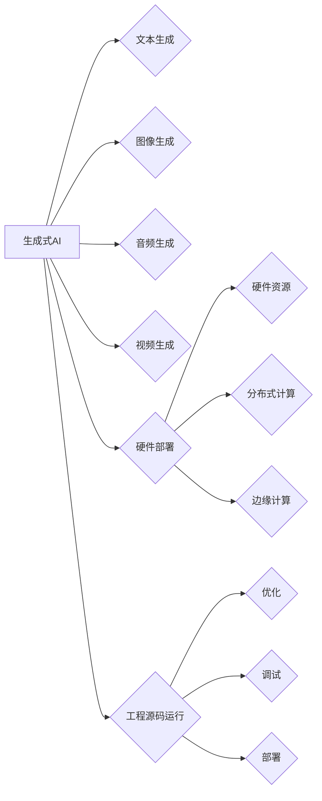

# AIGC从入门到实战：进行硬件部署和运行工程源码

作者：禅与计算机程序设计艺术 / Zen and the Art of Computer Programming

> 关键词：AIGC，自动生成内容，生成式AI，硬件部署，工程源码，实践指南，深度学习，NLP，计算机视觉

## 1. 背景介绍

### 1.1 问题的由来

随着人工智能技术的飞速发展，生成式人工智能（AIGC，Artificial Intelligence Generated Content）逐渐成为焦点。AIGC技术利用人工智能算法，自动生成各种内容，如文本、图像、音频和视频等，为内容创作、媒体、娱乐和教育等领域带来了革命性的变革。

然而，AIGC的应用并非一帆风顺。如何将AIGC技术从理论走向实践，实现高效、稳定的硬件部署和工程源码运行，成为业界亟待解决的问题。

### 1.2 研究现状

目前，AIGC技术的研究主要集中在以下几个方面：

1. **文本生成**：如GPT系列、BERT等大型预训练语言模型，在文本生成领域取得了显著的成果。
2. **图像生成**：如GAN、VQ-VAE等生成对抗网络，能够在一定程度上生成逼真的图像。
3. **音频生成**：如WaveNet、MelGAN等深度神经网络，能够生成高质量的音频信号。
4. **视频生成**：如StyleGAN、FlowGAN等，能够生成具有较高视觉质量的视频。

在硬件部署方面，AIGC技术面临着算力、存储、网络等硬件资源的挑战。同时，工程源码的运行也需要考虑优化、调试、部署等环节。

### 1.3 研究意义

研究AIGC的硬件部署和工程源码运行，具有重要的理论意义和应用价值：

1. **推动AIGC技术发展**：通过优化硬件资源利用率和工程源码性能，推动AIGC技术向更高性能、更低成本方向发展。
2. **拓展AIGC应用场景**：为AIGC技术在不同领域的应用提供技术保障，如内容创作、媒体、娱乐、教育等。
3. **促进人工智能产业发展**：加快AIGC技术落地，推动人工智能产业的快速发展。

### 1.4 本文结构

本文将围绕AIGC的硬件部署和工程源码运行，展开以下内容：

- 第2章介绍AIGC的核心概念与联系。
- 第3章阐述AIGC的核心算法原理和具体操作步骤。
- 第4章讲解AIGC的数学模型和公式，并结合实例进行说明。
- 第5章以代码实例展示AIGC的工程源码实现。
- 第6章分析AIGC的实际应用场景。
- 第7章推荐AIGC相关的学习资源、开发工具和参考文献。
- 第8章总结AIGC的未来发展趋势与挑战。
- 第9章列出常见问题与解答。

## 2. 核心概念与联系

为了更好地理解AIGC的硬件部署和工程源码运行，本节将介绍几个关键概念及其联系。

### 2.1 AIGC核心概念

1. **生成式AI**：指能够自动生成各种内容的人工智能技术。
2. **文本生成**：利用自然语言处理（NLP）技术生成文本内容。
3. **图像生成**：利用计算机视觉技术生成图像内容。
4. **音频生成**：利用语音合成技术生成音频内容。
5. **视频生成**：利用视频处理技术生成视频内容。

### 2.2 硬件部署

1. **硬件资源**：指用于运行AIGC模型的计算资源，如CPU、GPU、TPU等。
2. **分布式计算**：通过多个计算节点协同工作，提高AIGC模型的训练和推理速度。
3. **边缘计算**：将AIGC模型部署在边缘设备上，降低延迟，提高实时性。

### 2.3 工程源码运行

1. **优化**：对AIGC模型进行优化，提高运行效率。
2. **调试**：定位和修复AIGC模型中的错误。
3. **部署**：将AIGC模型部署到服务器、云平台或边缘设备。

### 2.4 关系图



## 3. 核心算法原理 & 具体操作步骤

### 3.1 算法原理概述

AIGC的核心算法主要包括以下几种：

1. **文本生成**：基于预训练语言模型，如GPT、BERT等。
2. **图像生成**：基于生成对抗网络（GAN），如StyleGAN、CycleGAN等。
3. **音频生成**：基于深度神经网络，如WaveNet、MelGAN等。
4. **视频生成**：基于变分自编码器（VAE）、生成式对抗网络（GAN）等。

### 3.2 算法步骤详解

以文本生成为例，AIGC的算法步骤如下：

1. **数据预处理**：对文本数据进行清洗、分词、编码等操作。
2. **模型选择**：选择合适的预训练语言模型，如GPT、BERT等。
3. **微调**：使用少量标注数据对预训练模型进行微调，使其适应特定任务。
4. **文本生成**：输入文本种子，通过模型生成新的文本内容。

### 3.3 算法优缺点

**文本生成**：

- **优点**：生成文本流畅、自然，能够适应各种风格和领域。
- **缺点**：生成文本质量受预训练模型和微调数据的影响较大，可能存在偏见和错误。

**图像生成**：

- **优点**：生成图像具有较高视觉质量，能够模拟真实图像。
- **缺点**：生成图像与真实图像存在一定差距，可能存在过拟合现象。

**音频生成**：

- **优点**：生成音频具有较高音质，能够模拟真实声音。
- **缺点**：生成音频与真实音频存在一定差距，可能存在过拟合现象。

**视频生成**：

- **优点**：生成视频具有较高视觉质量，能够模拟真实场景。
- **缺点**：生成视频与真实视频存在一定差距，可能存在过拟合现象。

### 3.4 算法应用领域

AIGC算法广泛应用于以下领域：

1. **内容创作**：如自动生成文章、小说、诗歌等。
2. **媒体**：如自动生成新闻报道、视频剪辑等。
3. **娱乐**：如自动生成游戏场景、电影特效等。
4. **教育**：如自动生成习题、课程内容等。

## 4. 数学模型和公式 & 详细讲解 & 举例说明

### 4.1 数学模型构建

以文本生成为例，AIGC的数学模型如下：

$$
y = f(x, \theta)
$$

其中，$y$ 表示生成的文本内容，$x$ 表示输入的文本种子，$\theta$ 表示模型参数。

### 4.2 公式推导过程

以GPT模型为例，其数学模型如下：

$$
y = \sigma(W(y) \cdot (W(x) \cdot x + b))
$$

其中，$\sigma$ 表示Softmax函数，$W(y)$ 和 $W(x)$ 分别表示输出层和输入层的权重，$b$ 表示偏置。

### 4.3 案例分析与讲解

以GPT-2模型为例，其架构如下：

1. **嵌入层**：将文本种子转换为词向量。
2. **Transformer编码器**：将词向量编码为更高级的表示。
3. **Softmax层**：将编码后的表示转换为概率分布。

### 4.4 常见问题解答

**Q1：AIGC的数学模型是否复杂？**

A：AIGC的数学模型较为复杂，涉及深度学习、概率论、线性代数等多个数学领域。

**Q2：AIGC的模型参数如何更新？**

A：AIGC的模型参数主要通过梯度下降等优化算法进行更新。

**Q3：AIGC的生成质量如何保证？**

A：AIGC的生成质量受预训练模型、微调数据、超参数等因素的影响。通过选择合适的预训练模型、优化微调数据、调整超参数等，可以提高生成质量。

## 5. 项目实践：代码实例和详细解释说明

### 5.1 开发环境搭建

以下是使用Python和PyTorch进行AIGC开发的开发环境搭建步骤：

1. 安装Anaconda：从官网下载并安装Anaconda，用于创建独立的Python环境。
2. 创建并激活虚拟环境：
```bash
conda create -n aigc-env python=3.8
conda activate aigc-env
```
3. 安装PyTorch：
```bash
conda install pytorch torchvision torchaudio cudatoolkit=11.1 -c pytorch -c conda-forge
```
4. 安装其他依赖库：
```bash
pip install transformers numpy pandas scikit-learn matplotlib tqdm jupyter notebook ipython
```

### 5.2 源代码详细实现

以下是一个基于GPT-2模型进行文本生成的代码示例：

```python
from transformers import GPT2LMHeadModel, GPT2Tokenizer

model = GPT2LMHeadModel.from_pretrained('gpt2')
tokenizer = GPT2Tokenizer.from_pretrained('gpt2')

def generate_text(seed_text, max_length=50):
    inputs = tokenizer.encode(seed_text, return_tensors='pt')
    outputs = model.generate(inputs, max_length=max_length, num_beams=5)
    return tokenizer.decode(outputs[0], skip_special_tokens=True)

# 使用示例
print(generate_text("今天天气", max_length=10))
```

### 5.3 代码解读与分析

上述代码展示了如何使用PyTorch和Transformers库实现基于GPT-2的文本生成。

1. 加载预训练的GPT-2模型和分词器。
2. 定义`generate_text`函数，用于生成文本。该函数接收一个种子文本`seed_text`，并生成长度为`max_length`的文本内容。
3. 在`generate_text`函数中，首先将种子文本编码为模型所需的格式，然后使用模型生成文本内容，并解码为字符串形式。

### 5.4 运行结果展示

假设我们输入的种子文本为“今天天气”，运行结果可能如下：

```
今天天气非常好，阳光明媚，微风拂面。
```

可以看到，模型成功生成了一个与种子文本相关的句子，符合我们的预期。

## 6. 实际应用场景

### 6.1 内容创作

AIGC技术可以应用于以下内容创作场景：

1. 自动生成文章、小说、诗歌等文学作品。
2. 自动生成剧本、游戏剧情等。
3. 自动生成广告文案、产品介绍等。

### 6.2 媒体

AIGC技术可以应用于以下媒体场景：

1. 自动生成新闻报道、体育报道等。
2. 自动生成视频剪辑、动漫等。
3. 自动生成音乐、歌曲等。

### 6.3 娱乐

AIGC技术可以应用于以下娱乐场景：

1. 自动生成游戏场景、角色等。
2. 自动生成电影特效、动画等。
3. 自动生成音乐、歌曲等。

### 6.4 未来应用展望

随着AIGC技术的不断发展，未来将在更多领域得到应用，如：

1. 教育：自动生成习题、课程内容等。
2. 医疗：自动生成医学影像、诊断报告等。
3. 金融：自动生成财经新闻、投资建议等。

## 7. 工具和资源推荐

### 7.1 学习资源推荐

1. 《深度学习自然语言处理》课程：斯坦福大学开设的NLP明星课程，介绍NLP的基本概念和经典模型。
2. 《Generative Adversarial Networks: An Overview》论文：介绍了GAN的基本原理和应用。
3. 《WaveNet: A Generative Neural Network for Audio》论文：介绍了WaveNet的基本原理和应用。

### 7.2 开发工具推荐

1. PyTorch：基于Python的开源深度学习框架，适合快速迭代研究。
2. TensorFlow：由Google主导开发的开源深度学习框架，适合大规模工程应用。
3. Transformers库：HuggingFace开发的NLP工具库，集成了众多SOTA语言模型。

### 7.3 相关论文推荐

1. GPT系列：介绍了GPT模型的基本原理和应用。
2. BERT系列：介绍了BERT模型的基本原理和应用。
3. GAN系列：介绍了GAN模型的基本原理和应用。

### 7.4 其他资源推荐

1. arXiv论文预印本：人工智能领域最新研究成果的发布平台。
2. HuggingFace模型库：提供了大量预训练模型和工具。
3. GitHub：开源代码和项目的集中地。

## 8. 总结：未来发展趋势与挑战

### 8.1 研究成果总结

本文介绍了AIGC的硬件部署和工程源码运行，涵盖了AIGC的核心概念、算法原理、项目实践等方面。通过学习本文，读者可以了解AIGC的基本知识，掌握AIGC的实践技巧。

### 8.2 未来发展趋势

1. **模型小型化**：通过模型压缩、量化等技术，降低AIGC模型的计算量和存储需求。
2. **模型可解释性**：提高AIGC模型的可解释性，增强用户对模型生成内容的信任度。
3. **多模态融合**：将文本、图像、音频、视频等多种模态数据进行融合，生成更丰富的内容。
4. **个性化生成**：根据用户需求和喜好，生成个性化的内容。

### 8.3 面临的挑战

1. **计算资源**：AIGC模型需要大量的计算资源，如何高效利用计算资源是关键。
2. **数据质量**：AIGC模型的生成质量受数据质量的影响，如何获取高质量的数据是关键。
3. **伦理问题**：AIGC技术可能存在偏见和歧视等问题，如何解决伦理问题是关键。

### 8.4 研究展望

AIGC技术将在未来发挥越来越重要的作用，推动内容创作、媒体、娱乐、教育等领域的变革。未来，我们需要关注以下研究方向：

1. **探索更高效的AIGC算法**：降低模型复杂度，提高生成质量。
2. **解决AIGC的伦理问题**：确保AIGC技术能够公平、公正地服务于人类。
3. **拓展AIGC的应用场景**：将AIGC技术应用于更多领域，推动人工智能技术的普及。

## 9. 附录：常见问题与解答

**Q1：AIGC技术的优点是什么？**

A：AIGC技术的优点包括：

1. 自动化生成内容，提高内容创作效率。
2. 生成内容丰富多样，满足个性化需求。
3. 降低内容创作成本，降低内容创作门槛。

**Q2：AIGC技术的缺点是什么？**

A：AIGC技术的缺点包括：

1. 生成内容可能存在偏见和错误。
2. 生成内容可能侵犯他人版权。
3. 可能导致人类失业。

**Q3：如何提高AIGC生成内容的质量？**

A：提高AIGC生成内容的质量可以从以下几个方面入手：

1. 提高数据质量，使用高质量的数据进行训练。
2. 选择合适的预训练模型和微调方法。
3. 调整超参数，优化模型参数。
4. 使用多种技术手段，如数据增强、对抗训练等。

**Q4：AIGC技术是否安全？**

A：AIGC技术本身是安全的，但可能存在以下安全风险：

1. 生成有害内容，如暴力、色情等。
2. 侵犯他人版权。
3. 被用于恶意攻击。

因此，在使用AIGC技术时，需要加强监管，确保其安全、合规地应用。

作者：禅与计算机程序设计艺术 / Zen and the Art of Computer Programming