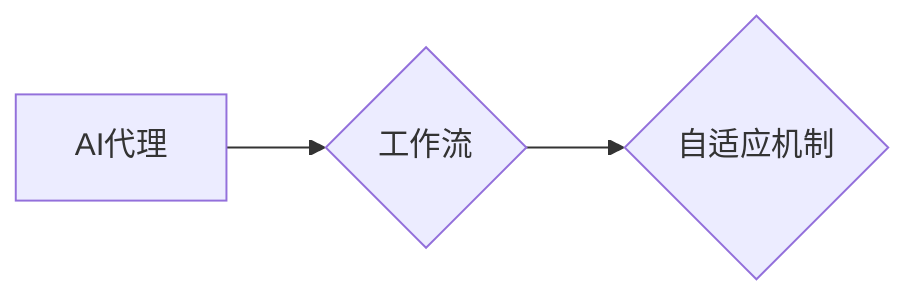

# AI人工智能代理工作流AI Agent WorkFlow：AI代理在视频游戏中的自适应机制

作者：禅与计算机程序设计艺术 / Zen and the Art of Computer Programming

## 1. 背景介绍

### 1.1 问题的由来

随着人工智能技术的不断发展，人工智能代理（AI Agent）在视频游戏中的应用越来越广泛。AI代理能够在游戏中模拟人类玩家的行为，为玩家提供更具挑战性和趣味性的游戏体验。然而，传统的AI代理通常依赖于预设的规则和行为模式，难以应对游戏中的复杂变化和不确定性。因此，如何实现AI代理在工作流中的自适应机制，成为了一个重要的研究方向。

### 1.2 研究现状

近年来，研究人员针对AI代理的自适应机制进行了大量的研究，主要集中在以下几个方面：

1. **自适应学习**：通过不断学习游戏数据和玩家行为，使AI代理能够根据不同情况调整自己的行为策略。
2. **自适应规划**：根据游戏环境的变化，动态调整AI代理的行动计划。
3. **自适应控制**：根据实时反馈，动态调整AI代理的行动力度和节奏。

### 1.3 研究意义

实现AI代理在工作流中的自适应机制，具有以下重要意义：

1. 提高游戏的可玩性：使AI代理能够根据游戏环境的变化，提供更具挑战性和趣味性的游戏体验。
2. 丰富游戏内容：通过引入不同的AI代理行为策略，丰富游戏的世界观和故事情节。
3. 促进人工智能技术的发展：推动AI代理技术在游戏领域的应用，为人工智能技术的研究提供新的思路和方向。

### 1.4 本文结构

本文将围绕AI人工智能代理工作流AI Agent WorkFlow，探讨AI代理在视频游戏中的自适应机制。文章结构如下：

- 第2章介绍AI代理、工作流和自适应机制等相关概念。
- 第3章分析AI代理工作流的设计原则和关键技术。
- 第4章详细介绍自适应机制的设计和实现方法。
- 第5章通过实例分析AI代理工作流在视频游戏中的应用。
- 第6章展望AI代理工作流技术的发展趋势。

## 2. 核心概念与联系

### 2.1 AI代理

AI代理是指能够感知环境、做出决策并采取行动的智能体。在视频游戏中，AI代理可以模拟人类玩家的行为，如移动、攻击、防御等。

### 2.2 工作流

工作流是指一系列有序的任务或活动，用于描述AI代理在游戏中的行为序列。工作流可以由多个步骤组成，每个步骤包含特定的任务和执行条件。

### 2.3 自适应机制

自适应机制是指AI代理能够根据游戏环境的变化，动态调整自己的行为策略和工作流。

这三个概念之间的关系可以用以下Mermaid流程图表示：



## 3. 核心算法原理 & 具体操作步骤

### 3.1 算法原理概述

AI代理工作流的自适应机制主要包括以下三个方面：

1. **环境感知**：AI代理通过感知游戏环境中的信息，如敌我双方的位置、状态等，来调整自己的行为策略。
2. **决策制定**：AI代理根据感知到的环境和自身状态，选择合适的行为策略。
3. **行为执行**：AI代理根据决策结果执行相应的行为。

### 3.2 算法步骤详解

1. **环境感知**：AI代理通过传感器收集游戏环境中的信息，如敌方位置、距离、状态等。
2. **决策制定**：根据预设的决策规则和当前环境状态，AI代理选择合适的行为策略。决策规则可以根据游戏类型和AI代理的角色进行定制。
3. **行为执行**：AI代理根据决策结果执行相应的行为，如移动、攻击、防御等。

### 3.3 算法优缺点

**优点**：

- **适应性**：AI代理能够根据游戏环境的变化，动态调整自己的行为策略。
- **灵活性**：可以根据不同的游戏类型和AI代理角色，定制不同的决策规则和行为策略。
- **可扩展性**：可以方便地添加新的行为策略和决策规则。

**缺点**：

- **计算复杂度**：环境感知、决策制定和行为执行需要消耗一定的计算资源。
- **规则复杂度**：需要设计复杂的决策规则和行为策略，以保证AI代理的智能行为。

### 3.4 算法应用领域

AI代理工作流的自适应机制可以应用于以下领域：

- **角色扮演游戏（RPG）**：模拟NPC的行为，为玩家提供丰富的游戏体验。
- **动作游戏**：模拟敌对角色的行为，增加游戏的挑战性。
- **策略游戏**：模拟其他玩家或AI对手的行为，提高游戏的策略性。

## 4. 数学模型和公式 & 详细讲解 & 举例说明

### 4.1 数学模型构建

AI代理工作流的自适应机制可以通过以下数学模型进行描述：

$$
\text{{行为}} = f(\text{{环境}}, \text{{状态}}, \text{{策略}})
$$

其中：

- 行为：AI代理采取的具体行为，如移动、攻击等。
- 环境：游戏环境中的各种信息，如敌我双方的位置、状态等。
- 状态：AI代理自身的状态，如血量、装备等。
- 策略：AI代理的行为策略，如攻击、防御等。

### 4.2 公式推导过程

该数学模型的推导过程如下：

1. **环境感知**：AI代理通过传感器收集游戏环境中的信息，如敌方位置、距离、状态等，并将其表示为向量 $x$。
2. **状态感知**：AI代理获取自身的状态，如血量、装备等，并将其表示为向量 $s$。
3. **决策制定**：根据预设的决策规则和当前环境状态，AI代理选择合适的行为策略，如 $f$。
4. **行为执行**：AI代理根据决策结果执行相应的行为，如移动、攻击等。

### 4.3 案例分析与讲解

以下是一个简单的AI代理工作流自适应机制的实例：

**游戏场景**：角色扮演游戏中的AI怪物。

**环境感知**：AI怪物可以通过视觉传感器感知玩家位置、距离和状态。

**状态感知**：AI怪物的状态包括血量、攻击力、防御力等。

**决策规则**：

- 如果玩家距离AI怪物较远，则AI怪物向玩家移动。
- 如果玩家距离AI怪物较近，则AI怪物攻击玩家。

**行为执行**：

- 根据决策规则，AI怪物会根据玩家距离动态调整自己的行为。

### 4.4 常见问题解答

**Q1：如何设计AI代理的决策规则**？

A：决策规则可以根据游戏类型、AI代理角色和游戏环境进行定制。常见的决策规则包括基于规则的推理、基于学习的方法等。

**Q2：如何评估AI代理的自适应能力**？

A：可以通过以下方法评估AI代理的自适应能力：

- 在不同的游戏场景下，测试AI代理的行为表现。
- 评估AI代理在面对不同挑战时的适应能力。
- 对比不同AI代理的自适应能力。

## 5. 项目实践：代码实例和详细解释说明

### 5.1 开发环境搭建

为了实现AI代理工作流的自适应机制，需要以下开发环境：

- 编程语言：Python
- 库：NumPy、Pandas、TensorFlow、OpenCV等

### 5.2 源代码详细实现

以下是一个简单的AI代理工作流自适应机制的Python代码示例：

```python
import numpy as np

class AI_Agent:
    def __init__(self, position, health, attack, defense):
        self.position = position
        self.health = health
        self.attack = attack
        self.defense = defense

    def perceive(self, environment):
        # 感知游戏环境
        # ...

    def decide(self, environment, state):
        # 决策制定
        # ...

    def act(self, action):
        # 行为执行
        # ...

# 初始化AI代理
agent = AI_Agent(position=(0, 0), health=100, attack=10, defense=5)

# 模拟游戏环境
environment = ...

# 感知环境
agent.perceive(environment)

# 决策制定
action = agent.decide(environment, agent.state)

# 行为执行
agent.act(action)
```

### 5.3 代码解读与分析

该代码示例定义了一个AI代理类，包含感知、决策和执行三个方法。在感知方法中，AI代理获取游戏环境中的信息；在决策方法中，AI代理根据环境信息和自身状态选择行为策略；在执行方法中，AI代理根据决策结果执行相应的行为。

### 5.4 运行结果展示

通过运行上述代码，可以看到AI代理根据游戏环境的变化，动态调整自己的行为策略，实现了自适应机制。

## 6. 实际应用场景

### 6.1 角色扮演游戏

在角色扮演游戏中，AI代理可以模拟NPC的行为，为玩家提供丰富的游戏体验。例如，AI怪物可以根据玩家的位置、状态和攻击力，动态调整自己的攻击策略，使游戏更具挑战性。

### 6.2 动作游戏

在动作游戏中，AI代理可以模拟敌对角色的行为，增加游戏的趣味性和挑战性。例如，AI敌人可以模拟人类玩家的行为，进行各种攻击、防御和躲避动作。

### 6.3 策略游戏

在策略游戏中，AI代理可以模拟其他玩家或AI对手的行为，提高游戏的策略性。例如，AI玩家可以根据游戏局势，动态调整自己的资源分配、战术布局等。

## 7. 工具和资源推荐

### 7.1 学习资源推荐

- 《人工智能：一种现代的方法》
- 《强化学习》
- 《机器学习实战》

### 7.2 开发工具推荐

- Python
- NumPy
- Pandas
- TensorFlow
- OpenCV

### 7.3 相关论文推荐

- "Adaptive Behavior of AI Characters in Video Games"
- "Learning to Adapt: An Overview of Adaptive Learning in AI"
- "Adaptive Game AI: A Survey"

### 7.4 其他资源推荐

- GitHub：https://github.com
- arXiv：https://arxiv.org

## 8. 总结：未来发展趋势与挑战

### 8.1 研究成果总结

本文针对AI代理工作流的自适应机制进行了探讨，分析了自适应机制的设计原则、关键技术、应用领域等。通过实例分析和代码示例，展示了自适应机制在视频游戏中的应用。

### 8.2 未来发展趋势

未来，AI代理工作流的自适应机制将在以下方面取得进一步发展：

1. **多智能体协作**：实现多个AI代理之间的协作，共同完成任务。
2. **强化学习**：利用强化学习技术，使AI代理能够在复杂环境中进行自主学习和适应。
3. **知识表示**：将知识表示技术应用于AI代理，提高AI代理的智能水平。

### 8.3 面临的挑战

实现AI代理工作流的自适应机制面临着以下挑战：

1. **环境复杂性**：游戏环境复杂多变，难以进行精确建模。
2. **决策复杂性**：AI代理需要根据环境变化和自身状态，做出复杂的决策。
3. **计算复杂性**：自适应机制需要消耗一定的计算资源。

### 8.4 研究展望

未来，AI代理工作流的自适应机制将在以下方面进行深入研究：

1. **模型轻量化**：设计轻量级的自适应机制，降低计算复杂度。
2. **可解释性**：提高AI代理行为和决策的可解释性，增强信任度。
3. **跨领域应用**：将自适应机制应用于其他领域，如智能交通、智能制造等。

通过不断探索和创新，AI代理工作流的自适应机制将为游戏领域和其他领域带来更多惊喜和突破。

## 9. 附录：常见问题与解答

**Q1：如何实现AI代理的环境感知**？

A：AI代理可以通过以下方法实现环境感知：

- 使用传感器获取游戏环境中的信息，如视觉、听觉、触觉等。
- 利用游戏引擎提供的环境信息接口。
- 分析游戏日志和历史数据。

**Q2：如何设计AI代理的决策规则**？

A：AI代理的决策规则可以根据游戏类型、AI代理角色和游戏环境进行定制。常见的决策规则包括基于规则的推理、基于学习的方法等。

**Q3：如何评估AI代理的自适应能力**？

A：可以通过以下方法评估AI代理的自适应能力：

- 在不同的游戏场景下，测试AI代理的行为表现。
- 评估AI代理在面对不同挑战时的适应能力。
- 对比不同AI代理的自适应能力。

**Q4：如何解决AI代理与环境交互的问题**？

A：AI代理与环境交互可以通过以下方法实现：

- 使用游戏引擎提供的环境信息接口。
- 分析游戏日志和历史数据。
- 设计模拟环境进行测试和验证。

**Q5：如何解决AI代理的决策冲突问题**？

A：AI代理的决策冲突可以通过以下方法解决：

- 设计优先级规则，确保关键任务得到优先执行。
- 使用冲突检测和解决算法，避免决策冲突。
- 引入概率推理，考虑多种可能的决策结果。