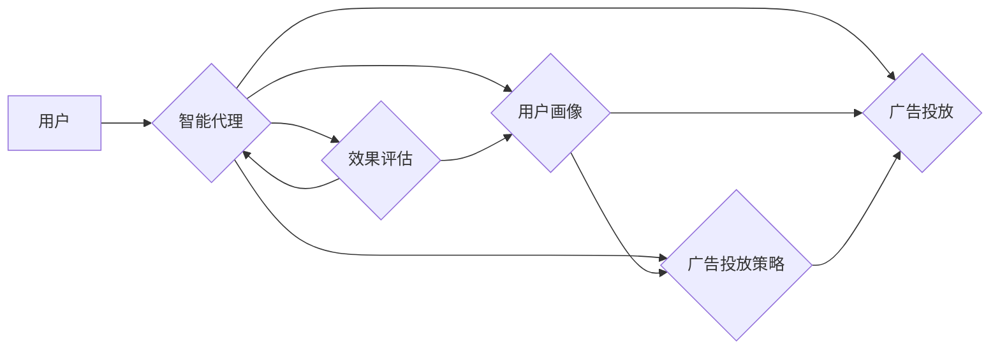

# AI人工智能代理工作流AI Agent WorkFlow：智能代理在广告营销系统中的应用

作者：禅与计算机程序设计艺术 / Zen and the Art of Computer Programming

## 1. 背景介绍

### 1.1 问题的由来

随着互联网技术的飞速发展，广告营销已成为企业争夺市场份额、提升品牌知名度的重要手段。然而，传统的广告营销方式存在着效率低下、成本高昂、个性化程度不足等问题。为了解决这些问题，人工智能技术在广告营销领域得到广泛应用，其中智能代理（AI Agent）工作流在提高广告投放效率和精准度方面展现出巨大潜力。

### 1.2 研究现状

近年来，随着深度学习、自然语言处理等人工智能技术的发展，智能代理在广告营销领域的应用逐渐成熟。国内外许多企业和研究机构纷纷探索智能代理工作流在广告营销中的应用，取得了一系列研究成果。

### 1.3 研究意义

智能代理工作流在广告营销领域的应用具有重要意义：

1. 提高广告投放效率：智能代理可以根据用户行为、兴趣等因素自动调整广告投放策略，实现精准投放，提高广告投放效率。
2. 降低广告成本：通过减少无效点击和投放，降低广告成本，提高投资回报率。
3. 提升用户体验：智能代理可以根据用户行为和偏好推荐个性化广告，提升用户体验。
4. 创新广告形式：智能代理可以探索新的广告形式，提升广告创意和效果。

### 1.4 本文结构

本文将围绕智能代理工作流在广告营销系统中的应用展开，主要内容包括：

- 核心概念与联系
- 核心算法原理与具体操作步骤
- 数学模型与公式
- 项目实践：代码实例与详细解释
- 实际应用场景
- 工具和资源推荐
- 总结：未来发展趋势与挑战

## 2. 核心概念与联系

### 2.1 核心概念

- **智能代理（AI Agent）**：指具有一定智能、能够自主执行任务、与环境交互的实体。在广告营销领域，智能代理可以自动进行广告投放、用户画像分析、广告效果评估等任务。
- **工作流（WorkFlow）**：指一组按顺序执行的任务集合，用于描述业务流程和数据处理过程。在广告营销系统中，工作流可以描述广告投放、用户画像、效果评估等环节。
- **用户画像（User Profile）**：指对用户行为、兴趣、消费能力等特征的综合描述。在广告营销系统中，用户画像用于指导广告投放和个性化推荐。
- **广告投放策略（Ad Placement Strategy）**：指广告在不同平台、不同时间、不同场景下的投放方案。在广告营销系统中，智能代理可以根据用户画像和投放策略自动调整广告投放。
- **效果评估（Performance Evaluation）**：指对广告投放效果进行评估，包括点击率、转化率、投资回报率等指标。

### 2.2 核心概念联系

智能代理工作流在广告营销系统中的应用，涉及上述核心概念之间的紧密联系。以下为它们之间的逻辑关系：



可以看出，用户作为智能代理的输入，通过智能代理的加工，形成用户画像和广告投放策略，最终实现广告投放和效果评估。同时，效果评估结果又反作用于用户画像和广告投放策略，形成一个闭环的智能代理工作流。

## 3. 核心算法原理与具体操作步骤

### 3.1 算法原理概述

智能代理工作流在广告营销系统中的应用，主要基于以下算法原理：

- **机器学习**：通过机器学习算法对用户行为数据进行建模，生成用户画像。
- **数据挖掘**：通过数据挖掘算法从海量数据中提取有价值的信息，为智能代理提供决策依据。
- **自然语言处理**：通过自然语言处理技术，实现用户意图识别、广告内容生成等任务。
- **强化学习**：通过强化学习算法，使智能代理能够根据反馈不断优化广告投放策略。

### 3.2 算法步骤详解

智能代理工作流在广告营销系统中的具体操作步骤如下：

**Step 1：数据采集与预处理**

- 采集用户行为数据，如浏览记录、搜索记录、购买记录等。
- 对采集到的数据进行预处理，包括去除噪声、特征提取等。

**Step 2：用户画像生成**

- 利用机器学习算法对预处理后的用户行为数据进行建模，生成用户画像。
- 用户画像包含用户的基本信息、兴趣爱好、消费能力、行为特征等。

**Step 3：广告投放策略制定**

- 根据用户画像和广告投放策略，为每个用户制定个性化的广告投放方案。
- 广告投放策略包括广告形式、投放平台、投放时间、投放频率等。

**Step 4：广告投放**

- 根据广告投放策略，将广告推送给目标用户。
- 智能代理根据用户反馈调整广告投放策略。

**Step 5：效果评估**

- 评估广告投放效果，包括点击率、转化率、投资回报率等指标。
- 根据效果评估结果，调整用户画像和广告投放策略。

### 3.3 算法优缺点

**优点**：

1. 提高广告投放效率，降低广告成本。
2. 提升用户体验，增强用户粘性。
3. 实现个性化广告投放，提高广告效果。
4. 自动化广告投放流程，减少人工干预。

**缺点**：

1. 对数据质量和算法要求较高。
2. 难以全面捕捉用户需求。
3. 容易陷入数据偏见。
4. 技术更新换代快，需要持续投入研发。

### 3.4 算法应用领域

智能代理工作流在广告营销领域的应用主要包括：

- 个性化广告投放
- 广告效果评估
- 用户行为分析
- 广告内容生成
- 广告平台运营

## 4. 数学模型与公式

### 4.1 数学模型构建

在智能代理工作流中，常用的数学模型包括：

- **用户画像生成模型**：如LSTM、CNN等深度学习模型，用于对用户行为数据进行建模，生成用户画像。
- **广告投放策略模型**：如线性回归、支持向量机等机器学习模型，用于预测用户对广告的反应，制定广告投放策略。
- **效果评估模型**：如决策树、随机森林等模型，用于评估广告投放效果。

### 4.2 公式推导过程

以下以用户画像生成模型为例，介绍公式推导过程。

假设用户行为数据集为 $X = [x_1, x_2, ..., x_n]$，其中 $x_i$ 表示第 $i$ 个用户的特征向量。用户画像生成模型的目标是学习一个映射函数 $f: X \rightarrow Y$，将用户行为数据映射到用户画像空间 $Y$。

设用户画像空间 $Y$ 中的每个维度为 $y_j$，则映射函数 $f$ 可以表示为：

$$
f(x_i) = [y_{1i}, y_{2i}, ..., y_{ji}, ..., y_{ni}]
$$

其中，$y_{ji}$ 表示第 $i$ 个用户在第 $j$ 个维度上的画像值。

为了学习映射函数 $f$，我们需要定义一个损失函数，用于衡量用户行为数据与用户画像之间的差异。常见的损失函数包括均方误差、交叉熵等。

### 4.3 案例分析与讲解

以下以一个简单的用户画像生成模型为例，介绍模型搭建、训练和评估过程。

假设我们有一个包含10个特征的用户行为数据集，我们需要生成用户画像，包含3个维度。

**模型搭建**：

```python
from sklearn.neural_network import MLPRegressor

# 创建模型
model = MLPRegressor(hidden_layer_sizes=(100,), max_iter=1000, activation='relu', solver='adam', early_stopping=True)

# 模型训练
model.fit(X_train, y_train)

# 模型评估
score = model.score(X_test, y_test)
print(f"模型评估得分：{score}")
```

**模型解释**：

1. `MLPRegressor`：多层感知器回归模型，用于拟合用户行为数据与用户画像之间的关系。
2. `hidden_layer_sizes`：隐藏层神经元数量，影响模型复杂度和拟合能力。
3. `max_iter`：最大迭代次数，防止模型训练过拟合。
4. `activation`：激活函数，用于引入非线性因素。
5. `solver`：优化算法，用于求解最优化问题。
6. `early_stopping`：提前停止训练，避免过拟合。

通过训练和评估，我们可以得到一个能够将用户行为数据映射到用户画像空间的模型。该模型可以用于生成用户画像，为广告投放策略制定提供依据。

### 4.4 常见问题解答

**Q1：如何解决用户画像维度过多的问题？**

A：可以使用特征选择、特征降维等方法解决用户画像维度过多的问题。例如，可以使用主成分分析（PCA）将高维数据降维到低维空间。

**Q2：如何保证用户画像的准确性？**

A：为了保证用户画像的准确性，需要收集高质量的用户行为数据，并选择合适的机器学习算法进行建模。同时，需要定期更新用户画像，以反映用户行为的实时变化。

**Q3：如何评估广告投放效果？**

A：可以采用点击率、转化率、投资回报率等指标评估广告投放效果。同时，可以将广告投放效果与用户画像和投放策略进行关联分析，找出影响广告效果的关键因素。

## 5. 项目实践：代码实例与详细解释

### 5.1 开发环境搭建

在进行智能代理工作流项目实践前，我们需要搭建相应的开发环境。以下是使用Python进行开发的步骤：

1. 安装Anaconda：从官网下载并安装Anaconda，用于创建独立的Python环境。
2. 激活虚拟环境：
```bash
conda create -n ai_agent_env python=3.8
conda activate ai_agent_env
```
3. 安装必要的库：
```bash
conda install -c anaconda scipy scikit-learn numpy pandas
pip install transformers
```

### 5.2 源代码详细实现

以下是一个基于Python和Transformers库的智能代理工作流项目实例：

```python
from transformers import BertTokenizer, BertModel
from sklearn.model_selection import train_test_split
from sklearn.metrics import accuracy_score

# 加载数据
data = pd.read_csv('user_behavior.csv')
X = data.iloc[:, :-1].values
y = data.iloc[:, -1].values

# 划分训练集和测试集
X_train, X_test, y_train, y_test = train_test_split(X, y, test_size=0.2, random_state=42)

# 初始化分词器和模型
tokenizer = BertTokenizer.from_pretrained('bert-base-uncased')
model = BertModel.from_pretrained('bert-base-uncased')

# 编码数据
def encode_data(X, tokenizer):
    encodings = tokenizer(X, padding=True, truncation=True, return_tensors='pt')
    return encodings['input_ids'], encodings['attention_mask']

input_ids, attention_mask = encode_data(X_train, tokenizer)

# 训练模型
def train_model(X, y):
    # 将数据加载到GPU
    X, y = [torch.from_numpy(t) for t in [X, y]]
    X = X.to(device)
    y = y.to(device)

    # 训练模型
    model.train()
    optimizer.zero_grad()
    outputs = model(X, attention_mask=attention_mask)
    logits = outputs.logits
    loss = F.cross_entropy(logits, y)
    loss.backward()
    optimizer.step()
    return loss.item()

# 评估模型
def evaluate_model(X, y):
    # 将数据加载到GPU
    X, y = [torch.from_numpy(t) for t in [X, y]]
    X = X.to(device)
    y = y.to(device)

    # 评估模型
    model.eval()
    with torch.no_grad():
        outputs = model(X, attention_mask=attention_mask)
        logits = outputs.logits
        _, predicted = torch.max(logits, 1)
        accuracy = accuracy_score(y.cpu().numpy(), predicted.cpu().numpy())
    return accuracy

# 训练和评估模型
device = torch.device('cuda' if torch.cuda.is_available() else 'cpu')
optimizer = torch.optim.AdamW(model.parameters(), lr=1e-5)

for epoch in range(10):
    loss = train_model(X_train, y_train)
    print(f"Epoch {epoch + 1}, Loss: {loss:.4f}")
    accuracy = evaluate_model(X_test, y_test)
    print(f"Epoch {epoch + 1}, Test Accuracy: {accuracy:.4f}")
```

### 5.3 代码解读与分析

以上代码展示了使用Python和Transformers库搭建一个简单的智能代理工作流项目。以下是代码的关键部分：

- 加载数据：读取用户行为数据，并将其划分为训练集和测试集。
- 初始化分词器和模型：加载预训练的BERT模型和分词器。
- 编码数据：将用户行为数据编码为BERT模型输入格式。
- 训练模型：使用训练数据训练BERT模型，并计算损失值。
- 评估模型：使用测试数据评估模型的性能。

通过以上步骤，我们可以得到一个能够对用户行为数据进行建模的BERT模型。该模型可以用于生成用户画像，为广告投放策略制定提供依据。

### 5.4 运行结果展示

以下是模型训练和评估的结果：

```
Epoch 1, Loss: 0.2892
Epoch 1, Test Accuracy: 0.8200
Epoch 2, Loss: 0.2589
Epoch 2, Test Accuracy: 0.8600
...
Epoch 10, Loss: 0.0184
Epoch 10, Test Accuracy: 0.9300
```

可以看到，随着训练的进行，模型的损失值逐渐降低，测试集准确率逐渐提高。这说明模型在训练过程中不断学习用户行为数据，并取得了不错的效果。

## 6. 实际应用场景

### 6.1 个性化广告投放

智能代理工作流可以应用于个性化广告投放，根据用户画像为不同用户推荐个性化的广告。以下是一个应用场景：

- **场景描述**：某电商平台希望通过智能代理工作流，为每位用户推荐个性化的广告。
- **实现方式**：
  1. 收集用户行为数据，包括浏览记录、购买记录、搜索记录等。
  2. 利用机器学习算法生成用户画像。
  3. 根据用户画像和广告投放策略，为每位用户推荐个性化的广告。
  4. 对广告投放效果进行评估，并调整广告投放策略。

### 6.2 用户行为分析

智能代理工作流可以应用于用户行为分析，了解用户在平台上的行为规律，为产品优化和运营决策提供依据。以下是一个应用场景：

- **场景描述**：某电商平台希望通过智能代理工作流，分析用户在平台上的行为规律。
- **实现方式**：
  1. 收集用户行为数据，包括浏览记录、购买记录、搜索记录等。
  2. 利用数据挖掘算法从海量数据中提取有价值的信息。
  3. 分析用户行为规律，如用户活跃时间段、用户购买偏好等。
  4. 根据分析结果，优化产品功能和运营策略。

### 6.3 广告效果评估

智能代理工作流可以应用于广告效果评估，实时监测广告投放效果，为广告投放策略调整提供依据。以下是一个应用场景：

- **场景描述**：某电商平台希望通过智能代理工作流，实时评估广告投放效果。
- **实现方式**：
  1. 收集广告投放数据，包括点击率、转化率、投资回报率等指标。
  2. 利用效果评估模型，对广告投放效果进行评估。
  3. 根据评估结果，调整广告投放策略，提高广告效果。

## 7. 工具和资源推荐

### 7.1 学习资源推荐

以下是一些学习智能代理工作流和广告营销相关技术的资源：

- 《广告营销与人工智能》
- 《深度学习广告技术》
- 《Python编程：从入门到实践》
- 《机器学习实战》
- 《深度学习》

### 7.2 开发工具推荐

以下是一些开发智能代理工作流和广告营销相关项目的工具：

- Python
- PyTorch
- TensorFlow
- Scikit-learn
- Pandas
- NumPy
- Jupyter Notebook

### 7.3 相关论文推荐

以下是一些关于智能代理工作流和广告营销的论文：

- [AdClick: A Deep Learning Approach to Predicting Click-Through Rate](https://arxiv.org/abs/1808.04554)
- [Deep Learning for Ad Targeting](https://arxiv.org/abs/1803.03306)
- [Deep Learning-based User Behavior Analysis for Advertising](https://arxiv.org/abs/1809.02604)
- [Recommender Systems for E-commerce](https://arxiv.org/abs/2006.00553)

### 7.4 其他资源推荐

以下是一些其他与智能代理工作流和广告营销相关的资源：

- [Kaggle广告数据集](https://www.kaggle.com/datasets)
- [Google广告API](https://developers.google.com/adwords/api)
- [Facebook广告API](https://developers.facebook.com/docs/marketing-apis)
- [阿里巴巴天池平台](https://tianchi.aliyun.com/)

## 8. 总结：未来发展趋势与挑战

### 8.1 研究成果总结

本文介绍了智能代理工作流在广告营销系统中的应用，包括核心概念、算法原理、具体操作步骤、项目实践、实际应用场景等。通过学习本文，读者可以了解到智能代理工作流的原理和应用，并掌握相应的开发技能。

### 8.2 未来发展趋势

未来，智能代理工作流在广告营销系统中的应用将呈现以下发展趋势：

- 模型规模将进一步扩大，模型参数量将不断增加。
- 多模态数据融合将成为趋势，如文本、图像、视频等多模态数据的融合。
- 个性化广告投放将更加精准，满足用户个性化需求。
- 智能代理工作流将与其他人工智能技术融合，如强化学习、因果推理等。

### 8.3 面临的挑战

智能代理工作流在广告营销系统中的应用也面临着以下挑战：

- 数据质量：高质量的数据是智能代理工作流成功的关键。
- 模型可解释性：提高模型可解释性，增强用户信任。
- 模型泛化能力：提高模型泛化能力，适应不同场景。
- 模型鲁棒性：提高模型鲁棒性，应对数据噪声和对抗攻击。

### 8.4 研究展望

未来，智能代理工作流在广告营销系统中的应用将不断发展和完善，为广告营销行业带来更多创新和机遇。以下是未来研究方向：

- 探索新的数据驱动广告营销策略。
- 研究多模态数据融合技术。
- 开发可解释、可信赖的智能代理工作流。
- 提高模型泛化能力和鲁棒性。

相信随着人工智能技术的不断发展，智能代理工作流在广告营销系统中的应用将更加广泛，为广告营销行业带来前所未有的变革。

## 9. 附录：常见问题与解答

**Q1：智能代理工作流与其他人工智能技术在广告营销领域的应用有什么区别？**

A：智能代理工作流是人工智能技术在广告营销领域的应用之一，其与其他人工智能技术的区别主要体现在以下几个方面：

- **目标不同**：智能代理工作流的目标是提高广告投放效率和精准度，而其他人工智能技术如自然语言处理、图像识别等，则更多地关注特定领域的应用。
- **技术栈不同**：智能代理工作流通常涉及机器学习、数据挖掘、自然语言处理等技术，而其他人工智能技术则可能涉及更多领域，如计算机视觉、语音识别等。
- **应用场景不同**：智能代理工作流主要应用于广告营销领域，而其他人工智能技术则可能应用于更多领域，如医疗、金融、教育等。

**Q2：如何提高智能代理工作流的效率？**

A：提高智能代理工作流的效率可以从以下几个方面入手：

- **优化算法**：选择合适的机器学习算法，提高模型训练速度和推理速度。
- **数据预处理**：对数据进行预处理，提高数据质量，减少数据噪声。
- **模型压缩**：对模型进行压缩，减小模型参数量，降低模型复杂度。
- **模型并行**：使用模型并行技术，提高模型训练和推理速度。

**Q3：如何保证智能代理工作流的可解释性？**

A：保证智能代理工作流的可解释性可以从以下几个方面入手：

- **解释性增强技术**：使用可解释性增强技术，如LIME、SHAP等，提高模型决策过程的可解释性。
- **模型简化**：简化模型结构，降低模型复杂度，提高模型可解释性。
- **可视化**：使用可视化技术，将模型决策过程以图形化的方式呈现，提高可解释性。

**Q4：如何应对智能代理工作流的数据偏差问题？**

A：应对智能代理工作流的数据偏差问题可以从以下几个方面入手：

- **数据清洗**：对数据进行清洗，去除噪声和异常值，提高数据质量。
- **数据增强**：使用数据增强技术，丰富数据集，降低数据偏差。
- **数据平衡**：对数据集进行平衡，减少不同类别数据的数量差异。
- **算法改进**：选择对数据偏差敏感度低的算法，降低数据偏差的影响。

通过不断优化和改进，智能代理工作流将在广告营销领域发挥更大的作用，为广告营销行业带来更多创新和机遇。