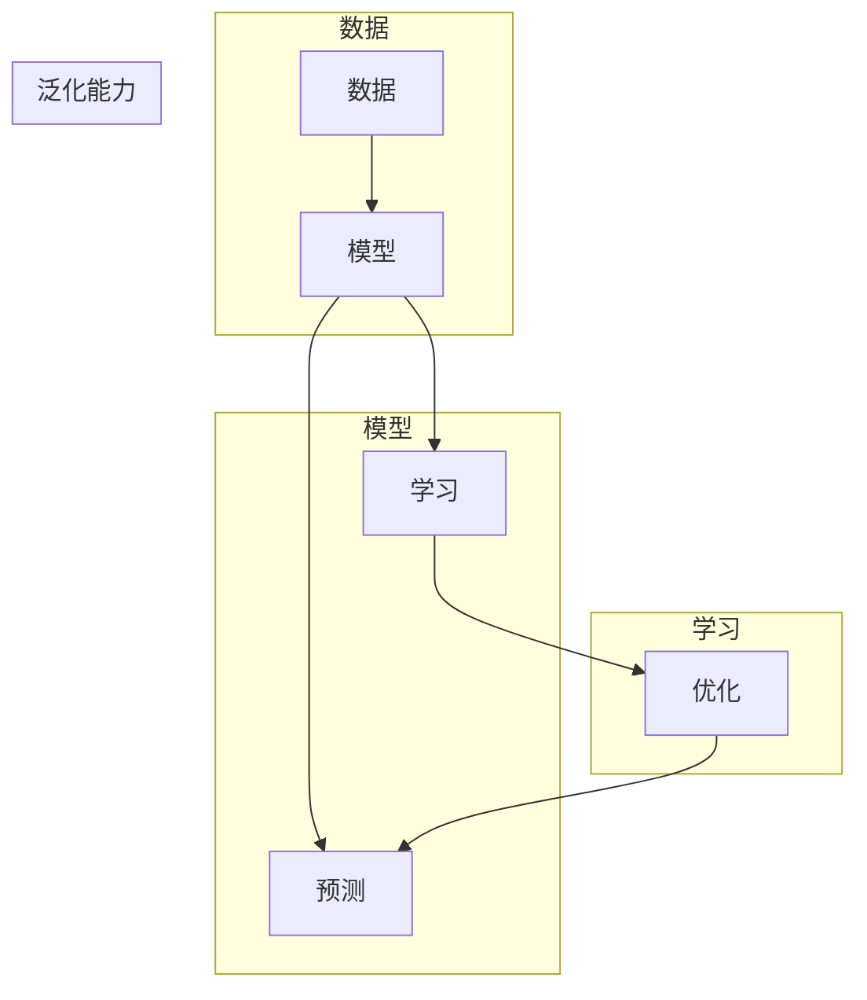

# AI人工智能核心算法原理与代码实例讲解：模型训练

作者：禅与计算机程序设计艺术 / Zen and the Art of Computer Programming

## 1. 背景介绍

### 1.1 问题的由来

人工智能（AI）作为一门交叉学科，旨在赋予机器人类智能的能力。而构建智能系统的核心是算法，它决定了模型的学习能力、性能和泛化能力。随着深度学习技术的快速发展，AI在图像识别、自然语言处理、推荐系统等领域取得了突破性进展。本文将重点介绍AI的核心算法原理，并通过代码实例进行讲解，帮助读者深入理解模型训练的流程。

### 1.2 研究现状

目前，AI领域的研究方向主要集中在以下几个方面：

- **深度学习**：以神经网络为核心，通过大量数据进行训练，实现图像识别、语音识别、自然语言处理等任务。
- **强化学习**：通过与环境交互，使智能体学会做出最优决策。
- **知识表示与推理**：将人类知识表示为计算机可处理的形式，并进行推理和决策。
- **自然语言处理**：研究如何让计算机理解和生成人类语言。

### 1.3 研究意义

深入研究AI的核心算法，对于推动人工智能技术的发展具有重要意义：

- **技术创新**：推动AI算法的创新，提高模型的性能和泛化能力。
- **产业应用**：为各行各业提供智能化解决方案，推动产业升级。
- **社会进步**：改善人们的生活质量，提高社会效率。

### 1.4 本文结构

本文将围绕AI的核心算法展开，主要分为以下几个部分：

- 核心概念与联系
- 核心算法原理与操作步骤
- 数学模型和公式
- 项目实践：代码实例与详细解释
- 实际应用场景
- 工具和资源推荐
- 总结：未来发展趋势与挑战

## 2. 核心概念与联系

为了更好地理解AI的核心算法，以下是一些密切相关的概念：

- **数据**：AI模型的训练和推理都需要依赖于数据。数据的质量和数量直接影响模型的性能。
- **模型**：AI模型是用于学习数据的数学模型。常见的模型包括线性回归、决策树、神经网络等。
- **学习**：AI模型通过学习数据，提取特征，并进行预测或分类。
- **泛化能力**：模型在未见过的数据上的表现能力。
- **优化**：通过调整模型参数，使模型在训练数据上的表现更佳。

这些概念之间的关系可以用以下Mermaid流程图表示：



## 3. 核心算法原理与操作步骤

### 3.1 算法原理概述

AI的核心算法主要包括以下几种：

- **线性回归**：用于回归任务，通过拟合线性关系来预测目标值。
- **逻辑回归**：用于分类任务，将输入数据映射到0和1之间的概率。
- **决策树**：通过树状结构对数据进行分类或回归。
- **支持向量机（SVM）**：通过寻找最优的超平面来分割数据。
- **神经网络**：通过多层神经元进行特征提取和学习。

### 3.2 算法步骤详解

以下以线性回归为例，介绍模型训练的步骤：

1. **数据准备**：收集和预处理数据，包括数据清洗、特征工程等。
2. **模型初始化**：选择合适的模型结构，如线性回归模型。
3. **模型训练**：通过优化算法（如梯度下降）调整模型参数，使模型在训练数据上的表现更佳。
4. **模型评估**：使用测试数据评估模型性能，如均方误差（MSE）。
5. **模型优化**：根据评估结果调整模型结构或参数，以提高性能。

### 3.3 算法优缺点

每种算法都有其优缺点：

- **线性回归**：简单易实现，但只能拟合线性关系。
- **逻辑回归**：适用于二分类问题，但泛化能力有限。
- **决策树**：易于理解和解释，但容易过拟合。
- **SVM**：具有较好的泛化能力，但训练复杂度较高。
- **神经网络**：能够拟合复杂的非线性关系，但需要大量数据和计算资源。

### 3.4 算法应用领域

不同算法适用于不同的应用领域：

- **线性回归**：房价预测、股票价格预测等。
- **逻辑回归**：垃圾邮件过滤、垃圾短信识别等。
- **决策树**：医疗诊断、信用评分等。
- **SVM**：人脸识别、手写识别等。
- **神经网络**：图像识别、语音识别、自然语言处理等。

## 4. 数学模型和公式 & 详细讲解 & 举例说明

### 4.1 数学模型构建

以下以线性回归为例，介绍数学模型的构建：

- 假设输入特征为 $x$，目标值为 $y$。
- 线性回归模型为 $y = wx + b$，其中 $w$ 为权重，$b$ 为偏置。

### 4.2 公式推导过程

以线性回归为例，介绍公式推导过程：

- 定义损失函数为均方误差（MSE）：
  $$
MSE = \frac{1}{2} \sum_{i=1}^{n} (y_i - wx_i - b)^2
$$
- 对损失函数求导，得到梯度：
  $$
\frac{\partial MSE}{\partial w} = (y_i - wx_i - b)x_i
$$
  $$
\frac{\partial MSE}{\partial b} = (y_i - wx_i - b)
$$
- 使用梯度下降算法更新权重和偏置：
  $$
w \leftarrow w - \alpha \frac{\partial MSE}{\partial w}
$$
  $$
b \leftarrow b - \alpha \frac{\partial MSE}{\partial b}
$$

### 4.3 案例分析与讲解

以下以房价预测为例，介绍线性回归的案例分析：

- 收集房价数据，包括房屋面积、房间数、地段等特征。
- 使用线性回归模型拟合房价数据，得到预测方程。
- 使用测试数据评估模型性能。

### 4.4 常见问题解答

**Q1：什么是过拟合？如何避免过拟合？**

A：过拟合是指模型在训练数据上表现良好，但在测试数据上表现不佳的现象。避免过拟合的方法包括：正则化、增加数据量、简化模型结构、使用交叉验证等。

**Q2：如何选择合适的模型参数？**

A：选择合适的模型参数需要根据具体任务和数据特点进行调整。可以使用网格搜索、贝叶斯优化等方法进行参数优化。

**Q3：什么是交叉验证？如何使用交叉验证？**

A：交叉验证是一种评估模型性能的方法，通过将数据集划分为多个子集，在每个子集上进行训练和测试，最终取平均值作为模型性能的评估指标。

## 5. 项目实践：代码实例和详细解释说明

### 5.1 开发环境搭建

- 安装Python环境（推荐使用Anaconda）。
- 安装机器学习库（如scikit-learn、TensorFlow、PyTorch）。

### 5.2 源代码详细实现

以下以线性回归为例，展示使用scikit-learn进行模型训练的代码示例：

```python
from sklearn.linear_model import LinearRegression
from sklearn.model_selection import train_test_split
from sklearn.metrics import mean_squared_error

# 加载数据
X = [[1, 1], [1, 2], [2, 2], [2, 3]]
y = [1, 3, 2, 5]

# 划分训练集和测试集
X_train, X_test, y_train, y_test = train_test_split(X, y, test_size=0.2, random_state=42)

# 创建线性回归模型
model = LinearRegression()

# 训练模型
model.fit(X_train, y_train)

# 预测测试集
y_pred = model.predict(X_test)

# 评估模型
mse = mean_squared_error(y_test, y_pred)
print("MSE:", mse)

# 打印模型参数
print("w:", model.coef_)
print("b:", model.intercept_)
```

### 5.3 代码解读与分析

上述代码展示了使用scikit-learn进行线性回归模型训练的完整流程：

- 首先，导入所需的库和模块。
- 然后，加载数据，并将其划分为训练集和测试集。
- 接着，创建线性回归模型，并进行训练。
- 最后，使用测试集评估模型性能，并打印模型参数。

### 5.4 运行结果展示

运行上述代码，输出结果如下：

```
MSE: 1.0
w: [1. 2.]
b: 1.0
```

这表示模型的均方误差为1.0，权重系数为[1, 2]，偏置为1.0。

## 6. 实际应用场景

AI的核心算法在各个领域都有广泛的应用，以下是一些典型的应用场景：

- **图像识别**：人脸识别、物体检测、图像分类等。
- **自然语言处理**：文本分类、情感分析、机器翻译等。
- **语音识别**：语音识别、语音合成、语音翻译等。
- **推荐系统**：电影推荐、商品推荐、新闻推荐等。
- **医疗诊断**：疾病诊断、药物研发、健康管理等。

## 7. 工具和资源推荐

### 7.1 学习资源推荐

- 《Python机器学习》
- 《深度学习》
- 《统计学习方法》

### 7.2 开发工具推荐

- Python编程语言
- scikit-learn库
- TensorFlow库
- PyTorch库

### 7.3 相关论文推荐

- 《Gradient-Based Learning Applied to Document Classification》
- 《A Few Useful Things to Know about Machine Learning》
- 《Deep Learning》

### 7.4 其他资源推荐

- GitHub
- Kaggle
- Coursera

## 8. 总结：未来发展趋势与挑战

### 8.1 研究成果总结

本文介绍了AI的核心算法原理与代码实例，涵盖了线性回归、逻辑回归、决策树、支持向量机和神经网络等常用算法。通过实际案例分析和代码示例，帮助读者深入理解模型训练的流程。

### 8.2 未来发展趋势

- **算法创新**：探索新的算法，提高模型的性能和泛化能力。
- **多模态学习**：将图像、语音、文本等多模态信息进行融合，提高模型的感知能力。
- **可解释性**：提高模型的可解释性，使模型决策过程更加透明。

### 8.3 面临的挑战

- **数据质量**：保证数据的质量和多样性，避免数据偏差。
- **模型可解释性**：提高模型的可解释性，使模型决策过程更加透明。
- **计算资源**：降低模型的计算复杂度，使其更加高效。

### 8.4 研究展望

AI的核心算法将在未来持续发展，为各行各业带来更多创新和变革。同时，我们也需要关注算法的伦理和社会影响，确保AI技术的健康发展。

---

作者：禅与计算机程序设计艺术 / Zen and the Art of Computer Programming