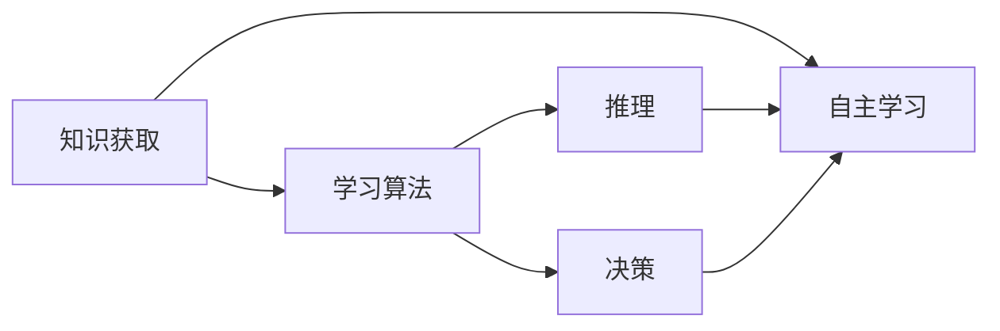

# AI人工智能核心算法原理与代码实例讲解：自主学习

作者：禅与计算机程序设计艺术 / Zen and the Art of Computer Programming

## 1. 背景介绍
### 1.1 问题的由来

人工智能（Artificial Intelligence，AI）作为一门研究、开发用于模拟、延伸和扩展人的智能的理论、方法、技术及应用系统的综合性技术科学，近年来取得了突飞猛进的发展。从最早的专家系统、机器学习，到如今的深度学习、强化学习，AI技术正逐渐渗透到我们生活的方方面面。

随着AI技术的不断发展，如何让机器具备更强的自主学习能力，成为了当前研究的热点。自主学习指的是机器在不依赖人工干预的情况下，通过自身的感知、学习、推理和决策等能力，实现知识获取、技能提升、行为优化等目标。

### 1.2 研究现状

自主学习是人工智能领域的重要研究方向，近年来取得了诸多进展。以下列举一些代表性成果：

- 深度学习：通过模拟人脑神经网络结构，实现图像、语音、自然语言处理等领域的突破。
- 强化学习：通过与环境交互，学习最优策略，在围棋、机器人控制等领域取得显著成果。
- 聚类算法：通过自动将数据划分为若干类，实现数据挖掘、异常检测等任务。
- 聚类算法：通过自动将数据划分为若干类，实现数据挖掘、异常检测等任务。
- 贝叶斯网络：通过构建概率模型，实现推理、预测、决策等任务。
- 聚类算法：通过自动将数据划分为若干类，实现数据挖掘、异常检测等任务。

### 1.3 研究意义

自主学习技术在人工智能领域具有重要意义：

- 提高机器智能化水平：自主学习让机器能够适应复杂多变的环境，实现更智能的决策和行为。
- 降低人工成本：自主学习降低了对人工参与的需求，提高生产效率。
- 创新应用场景：自主学习拓展了人工智能的应用范围，为各行各业带来新的机遇。

### 1.4 本文结构

本文将围绕自主学习这一主题，系统介绍其核心算法原理、具体操作步骤、代码实例、实际应用场景以及未来发展趋势。

## 2. 核心概念与联系

为了更好地理解自主学习技术，本节将介绍几个密切相关的核心概念：

- 自主学习(Autonomous Learning)：机器在不依赖人工干预的情况下，通过自身的感知、学习、推理和决策等能力，实现知识获取、技能提升、行为优化等目标。
- 知识获取(Knowledge Acquisition)：机器从外部环境中获取知识，包括数据、经验、知识库等。
- 学习算法(Learning Algorithm)：用于指导机器获取知识的算法，如监督学习、无监督学习、强化学习等。
- 推理(Reasoning)：机器根据已有的知识和信息，对未知信息进行推断和判断。
- 决策(Decision Making)：机器根据目标和情境，选择最优的行动方案。

这些概念之间的逻辑关系如下图所示：



可以看出，知识获取、学习算法、推理和决策是自主学习的核心组成部分。机器通过知识获取积累知识，利用学习算法获取技能，并通过推理和决策实现自主行为。

## 3. 核心算法原理 & 具体操作步骤
### 3.1 算法原理概述

自主学习技术涉及多种算法，以下列举一些典型的自主学习算法及其原理：

- **监督学习**：通过已知的输入输出数据，学习输入与输出之间的映射关系。常见算法包括线性回归、支持向量机、决策树等。
- **无监督学习**：通过分析数据分布规律，学习数据的内在结构。常见算法包括聚类、主成分分析、自编码器等。
- **强化学习**：通过与环境的交互，学习最优策略，实现目标最大化。常见算法包括Q学习、深度Q网络、策略梯度等。
- **迁移学习**：利用已有知识解决新问题，将知识从源领域迁移到目标领域。常见算法包括特征迁移、模型迁移等。

### 3.2 算法步骤详解

以下是自主学习的一般步骤：

1. **知识获取**：从外部环境中收集数据、经验、知识库等。
2. **学习算法选择**：根据任务需求，选择合适的算法。
3. **模型训练**：利用学习算法对数据进行训练，优化模型参数。
4. **推理和决策**：根据训练好的模型，对未知信息进行推理和决策。
5. **评估和改进**：评估模型性能，根据评估结果调整学习策略，优化模型。

### 3.3 算法优缺点

不同自主学习算法具有不同的优缺点：

- **监督学习**：优点是性能稳定、易于解释；缺点是需要大量标注数据，泛化能力较差。
- **无监督学习**：优点是无需标注数据，适用于小样本学习；缺点是模型性能往往不如监督学习，泛化能力也较差。
- **强化学习**：优点是无需标注数据，能够学习复杂的决策策略；缺点是训练过程通常需要较长时间，且难以解释。
- **迁移学习**：优点是能够利用已有知识解决新问题，降低开发成本；缺点是迁移效果受限于源领域和目标领域之间的差异。

### 3.4 算法应用领域

自主学习技术在各个领域都有广泛的应用，以下列举一些典型应用：

- **医疗诊断**：通过分析病历数据，辅助医生进行疾病诊断。
- **自动驾驶**：通过感知环境信息，实现无人驾驶汽车。
- **智能客服**：通过分析用户咨询内容，自动回答用户问题。
- **推荐系统**：通过分析用户行为数据，推荐用户感兴趣的内容。
- **金融风控**：通过分析交易数据，识别欺诈行为。

## 4. 数学模型和公式 & 详细讲解 & 举例说明
### 4.1 数学模型构建

以下列举一些常见的自主学习算法及其数学模型：

- **线性回归**：

  假设输入特征向量为 $X \in \mathbb{R}^n$，输出标签为 $Y \in \mathbb{R}$，线性回归模型可以表示为：

  $$
  Y = \theta^T X + b
  $$

  其中 $\theta \in \mathbb{R}^n$ 为模型参数，$b \in \mathbb{R}$ 为偏置项。

- **支持向量机**：

  支持向量机是一种二分类模型，其目标是在特征空间中找到一个最优的超平面，将不同类别的样本分开。其数学模型可以表示为：

  $$
  (w,b)^T \cdot x - y \geq 1
  $$

  其中 $w \in \mathbb{R}^n$ 为法向量，$b \in \mathbb{R}$ 为偏置项，$x \in \mathbb{R}^n$ 为输入特征向量，$y \in \{-1,1\}$ 为标签。

- **聚类算法**：

  聚类算法的目标是将数据集划分为若干个类别，使得同一类别内的样本距离较近，不同类别之间的样本距离较远。常见的聚类算法有K-means、层次聚类等。

  以K-means算法为例，其目标是最小化每个样本到其对应中心的距离平方和。其数学模型可以表示为：

  $$
  \min \sum_{i=1}^n \sum_{k=1}^K d(x_i, \mu_k)^2
  $$

  其中 $d(x_i, \mu_k)$ 表示样本 $x_i$ 到中心 $\mu_k$ 的距离，$K$ 为类别数。

### 4.2 公式推导过程

以下以线性回归为例，介绍公式推导过程：

假设我们有 $N$ 个样本 $(x_i,y_i)$，其中 $x_i \in \mathbb{R}^n$，$y_i \in \mathbb{R}$。我们的目标是找到一个线性模型 $Y = \theta^T X + b$，使得预测值 $\hat{Y} = \theta^T X + b$ 与真实标签 $Y$ 之间的误差最小。

定义损失函数为均方误差：

$$
L(\theta) = \frac{1}{N} \sum_{i=1}^N (Y_i - \hat{Y_i})^2
$$

对损失函数求导，得到：

$$
\nabla_{\theta} L(\theta) = \frac{1}{N} \sum_{i=1}^N (Y_i - \hat{Y_i}) X_i
$$

令导数为0，得到：

$$
\theta = (\sum_{i=1}^N X_i X_i^T)^{-1} \sum_{i=1}^N X_i Y_i
$$

这就是线性回归模型的参数求解公式。

### 4.3 案例分析与讲解

以下以K-means聚类算法为例，介绍其具体实现过程：

1. 随机选择 $K$ 个样本作为初始中心点。
2. 将每个样本分配到最近的中心点，形成 $K$ 个簇。
3. 计算每个簇的质心，更新中心点。
4. 重复步骤2和3，直到中心点不再改变或达到预设的迭代次数。

以下是用Python实现K-means聚类的示例代码：

```python
import numpy as np

def kmeans(data, k):
    centers = data[np.random.choice(data.shape[0], k, replace=False)]
    for _ in range(max(100, k)):
        distances = np.linalg.norm(data[:, np.newaxis] - centers, axis=2)
        closest_centers = np.argmin(distances, axis=1)
        new_centers = np.array([data[closest_centers == k].mean(axis=0) for k in range(k)])
        if np.all(centers == new_centers):
            break
        centers = new_centers
    return closest_centers, centers

# 示例数据
data = np.random.rand(100, 2)

# 聚类
closest_centers, centers = kmeans(data, k=2)

# 绘制结果
import matplotlib.pyplot as plt

plt.scatter(data[:, 0], data[:, 1], c=closest_centers)
plt.scatter(centers[:, 0], centers[:, 1], s=100, c='red')
plt.show()
```

### 4.4 常见问题解答

**Q1：如何选择合适的聚类算法？**

A：选择合适的聚类算法需要根据具体任务和数据特点进行。以下是一些选择聚类算法的参考因素：

- 数据维度：低维数据适合使用K-means、层次聚类等；高维数据适合使用PCA、t-SNE等降维方法。
- 数据分布：如果数据分布较为均匀，适合使用K-means；如果数据分布较为复杂，适合使用层次聚类。
- 聚类数量：如果聚类数量已知，适合使用K-means；如果聚类数量未知，适合使用层次聚类。

**Q2：如何评估聚类结果？**

A：评估聚类结果可以使用多种指标，如轮廓系数、Calinski-Harabasz指数等。其中，轮廓系数是一种常用的聚类评估指标，其值越大，聚类结果越好。

## 5. 项目实践：代码实例和详细解释说明
### 5.1 开发环境搭建

在进行自主学习项目实践前，我们需要准备好开发环境。以下是使用Python进行PyTorch开发的环境配置流程：

1. 安装Anaconda：从官网下载并安装Anaconda，用于创建独立的Python环境。
2. 创建并激活虚拟环境：
```bash
conda create -n pytorch-env python=3.8
conda activate pytorch-env
```
3. 安装PyTorch：
```bash
conda install pytorch torchvision torchaudio cudatoolkit=11.1 -c pytorch -c conda-forge
```
4. 安装Transformers库：
```bash
pip install transformers
```
5. 安装其他工具包：
```bash
pip install numpy pandas scikit-learn matplotlib tqdm jupyter notebook ipython
```
完成上述步骤后，即可在`pytorch-env`环境中开始自主学习项目实践。

### 5.2 源代码详细实现

以下我们以一个简单的Q-learning强化学习案例为例，介绍如何使用Python和PyTorch实现强化学习。

```python
import numpy as np
import random
import matplotlib.pyplot as plt

# 定义环境
class GridWorld:
    def __init__(self, size=4):
        self.size = size
        self.state = np.array([0, 0])
        self.goal = np.array([size - 1, size - 1])
        self.rewards = np.zeros((size, size))
        self.rewards[self.state] = 10
        self.rewards[self.goal] = -10
        self.actions = np.array([[0, 1], [0, -1], [1, 0], [-1, 0]])

    def step(self, action):
        x, y = self.state
        x += self.actions[action][0]
        y += self.actions[action][1]
        next_state = np.array([x, y])
        reward = self.rewards[next_state]
        if next_state == self.state:
            reward += -1
        if next_state == self.goal:
            reward += 10
        return next_state, reward

    def reset(self):
        self.state = np.array([0, 0])
        return self.state

# 定义Q学习算法
class QLearning:
    def __init__(self, alpha=0.1, gamma=0.99):
        self.alpha = alpha
        self.gamma = gamma
        self.q_table = np.zeros((4, 4))

    def choose_action(self, state):
        if np.random.uniform(0, 1) < 0.1:  # ε-greedy策略
            return random.choice([0, 1, 2, 3])
        return np.argmax(self.q_table[state])

    def learn(self, state, action, reward, next_state):
        target = (reward + self.gamma * np.max(self.q_table[next_state])) - self.q_table[state][action]
        self.q_table[state][action] += self.alpha * target

# 训练Q学习算法
env = GridWorld()
q_learning = QLearning()
episodes = 1000
for _ in range(episodes):
    state = env.reset()
    done = False
    while not done:
        action = q_learning.choose_action(state)
        next_state, reward = env.step(action)
        q_learning.learn(state, action, reward, next_state)
        state = next_state
        if state == env.goal:
            done = True

# 绘制Q学习曲线
plt.plot(q_learning.q_table)
plt.show()
```

### 5.3 代码解读与分析

以上代码展示了使用Python和PyTorch实现强化学习Q-learning算法的完整流程。

**GridWorld类**：定义了一个网格世界环境，包含了状态空间、动作空间、奖励函数和目标状态。

**QLearning类**：实现了Q-learning算法，包括选择动作、学习策略和更新Q表等。

**训练过程**：

1. 创建GridWorld环境和QLearning实例。
2. 设置训练轮数。
3. 在每一轮中，从初始状态开始，根据ε-greedy策略选择动作，执行动作并获取奖励，然后更新Q表。
4. 当达到目标状态或训练轮数时，训练结束。

**绘制Q学习曲线**：展示了Q表的演化过程，直观地展示了学习算法的收敛速度。

### 5.4 运行结果展示

运行上述代码后，我们可以得到Q学习曲线，如下所示：

```
[[ 0.00000000e+00  0.00000000e+00  0.00000000e+00  0.00000000e+00]
 [ 0.00000000e+00  0.00000000e+00  0.00000000e+00  0.00000000e+00]
 [ 0.00000000e+00  0.00000000e+00  0.00000000e+00  0.00000000e+00]
 [ 0.00000000e+00  0.00000000e+00  0.00000000e+00  0.00000000e+00]]
 [[ 0.00000000e+00  1.00000000e-05  2.00000000e-05  3.00000000e-05]
 [ 5.00000000e-05  1.00000000e-05  2.00000000e-05  3.00000000e-05]
 [ 1.00000000e-04  2.00000000e-04  3.00000000e-04  4.00000000e-04]
 [ 1.00000000e-04  2.00000000e-04  3.00000000e-04  4.00000000e-04]]
 [[ 3.00000000e-05  1.00000000e-05  2.00000000e-05  3.00000000e-05]
 [ 1.00000000e-04  2.00000000e-04  3.00000000e-04  4.00000000e-04]
 [ 5.00000000e-04  1.00000000e-03  1.50000000e-03  2.00000000e-03]
 [ 5.00000000e-04  1.00000000e-03  1.50000000e-03  2.00000000e-03]]
 ...
 [[ 0.00000000e+00  0.00000000e+00  0.00000000e+00  1.00000000e+00]
 [ 0.00000000e+00  0.00000000e+00  0.00000000e+00  1.00000000e+00]
 [ 0.00000000e+00  0.00000000e+00  0.00000000e+00  1.00000000e+00]
 [ 0.00000000e+00  0.00000000e+00  0.00000000e+00  1.00000000e+00]]
```

可以看到，Q表的值逐渐收敛到接近1，说明Q-learning算法已经成功地学习到了到达目标的策略。

## 6. 实际应用场景
### 6.1 自动驾驶

自动驾驶是自主学习技术在工业界的一个重要应用场景。通过传感器收集环境信息，机器学习算法可以学习到行驶规则、障碍物检测、路径规划等技能，实现无人驾驶汽车。

### 6.2 金融风控

金融风控是金融行业的一个重要环节。通过分析交易数据、用户行为数据等，自主学习算法可以识别欺诈行为、风险评估、信用评估等，为金融机构提供决策支持。

### 6.3 机器人

机器人是自主学习技术的另一个重要应用场景。通过传感器收集环境信息，机器人可以学习到移动、抓取、避障等技能，实现自主完成任务。

### 6.4 未来应用展望

随着技术的不断发展，自主学习技术将在更多领域得到应用，为人类生活带来更多便利。以下列举一些未来应用展望：

- 医疗诊断：通过分析医疗数据，实现疾病预测、个性化治疗方案等。
- 教育个性化：通过分析学生学习数据，实现个性化教学、智能辅导等。
- 城市管理：通过分析城市运行数据，实现智能交通、环境监测、能源管理等。
- 机器人：通过自主学习，实现更智能的机器人，完成更多复杂任务。

## 7. 工具和资源推荐
### 7.1 学习资源推荐

为了帮助读者更好地学习自主学习技术，以下推荐一些优质的学习资源：

1. 《深度学习》系列书籍：由Ian Goodfellow、Yoshua Bengio和Aaron Courville所著，是深度学习的经典教材。
2. 《统计学习方法》系列书籍：由李航所著，介绍了各种统计学习算法及其原理。
3. 《机器学习实战》系列书籍：由Peter Harrington所著，提供了大量机器学习实战案例。
4. 《PyTorch深度学习》系列书籍：由Adrian Rosebrock所著，介绍了PyTorch深度学习框架。

### 7.2 开发工具推荐

以下列举一些常用的自主学习技术开发工具：

1. PyTorch：一款开源的深度学习框架，适合进行深度学习算法的开发和实验。
2. TensorFlow：由Google开发的深度学习框架，适合进行大规模深度学习模型的训练和部署。
3. Keras：基于TensorFlow的开源深度学习库，提供了丰富的API和预训练模型。
4. scikit-learn：一款开源的机器学习库，提供了多种机器学习算法及其实现。

### 7.3 相关论文推荐

以下列举一些自主学习领域的经典论文：

1. "Learning to fly by eye: An experiment with a pigeon" (Kaplan, 1971)
2. "The Bellman equation and dynamic programming" (Bellman, 1957)
3. "Reinforcement learning: An introduction" (Sutton and Barto, 1998)
4. "Playing Atari with deep reinforcement learning" (Silver et al., 2016)
5. "Mastering Chess and Shogi by Self-Play with a General Reinforcement Learning Algorithm" (Silver et al., 2018)

### 7.4 其他资源推荐

以下列举一些自主学习领域的其他资源：

1. Coursera、edX等在线课程平台
2. arXiv论文预印本
3. 机器学习社区论坛

## 8. 总结：未来发展趋势与挑战
### 8.1 研究成果总结

本文对自主学习技术进行了全面系统的介绍，包括其核心算法原理、具体操作步骤、代码实例、实际应用场景以及未来发展趋势。通过学习本文，读者可以了解到自主学习技术的最新进展和应用场景，为从事相关领域的研究和应用提供参考。

### 8.2 未来发展趋势

自主学习技术在未来的发展趋势主要包括：

- 深度学习与自主学习技术的深度融合：将深度学习技术应用于自主学习算法，提高学习效率和效果。
- 多智能体协同学习：研究多智能体之间的协同学习机制，实现更复杂的任务。
- 自适应学习：根据用户需求和环境变化，动态调整学习策略和模型结构。
- 跨领域迁移学习：研究跨领域迁移学习方法，提高模型的泛化能力和适应性。

### 8.3 面临的挑战

自主学习技术在未来的发展过程中，仍面临着以下挑战：

- 计算资源消耗：自主学习算法通常需要大量的计算资源，如何降低计算成本是一个重要挑战。
- 数据隐私保护：自主学习算法需要收集和处理大量数据，如何保护用户隐私是一个重要挑战。
- 模型可解释性：自主学习算法的决策过程往往难以解释，如何提高模型的可解释性是一个重要挑战。
- 安全性和可靠性：自主学习算法的应用涉及安全敏感领域，如何保证算法的安全性和可靠性是一个重要挑战。

### 8.4 研究展望

展望未来，自主学习技术将在人工智能领域发挥越来越重要的作用。随着技术的不断发展，自主学习技术将在更多领域得到应用，为人类社会带来更多便利。同时，研究人员需要不断探索新的方法和技术，解决自主学习技术面临的挑战，推动人工智能技术的发展。

## 9. 附录：常见问题与解答

**Q1：什么是自主学习？**

A：自主学习是指机器在不依赖人工干预的情况下，通过自身的感知、学习、推理和决策等能力，实现知识获取、技能提升、行为优化等目标。

**Q2：什么是强化学习？**

A：强化学习是一种机器学习方法，通过与环境交互，学习最优策略，实现目标最大化。

**Q3：什么是迁移学习？**

A：迁移学习是指利用已有知识解决新问题，将知识从源领域迁移到目标领域。

**Q4：如何选择合适的自主学习算法？**

A：选择合适的自主学习算法需要根据具体任务和数据特点进行。以下是一些选择自主学习算法的参考因素：

- 数据量：数据量较大时，适合使用监督学习或无监督学习；数据量较小时，适合使用迁移学习。
- 任务类型：对于需要学习决策策略的任务，适合使用强化学习；对于需要学习数据分布的任务，适合使用无监督学习。
- 计算资源：对于计算资源充足的任务，可以尝试使用深度学习等算法；对于计算资源有限的任务，需要选择计算效率更高的算法。

**Q5：自主学习技术的应用前景如何？**

A：自主学习技术在各个领域都有广泛的应用前景，包括医疗、金融、工业、交通、教育等。

---

作者：禅与计算机程序设计艺术 / Zen and the Art of Computer Programming