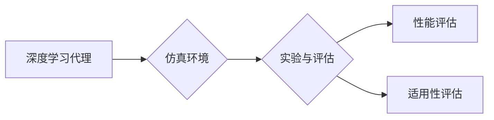

# AI人工智能深度学习算法：仿真环境中深度学习代理的实验与评估

作者：禅与计算机程序设计艺术 / Zen and the Art of Computer Programming

## 关键词：

深度学习，深度学习代理，仿真环境，实验与评估，强化学习，监督学习，无监督学习

## 1. 背景介绍

### 1.1 问题的由来

随着人工智能技术的飞速发展，深度学习在各个领域都取得了显著的成果。然而，在实际应用中，如何将深度学习模型有效地应用于复杂系统，并对其进行评估和优化，成为了亟待解决的问题。仿真环境作为一种可控、可控、可复现的实验平台，为深度学习代理的研究提供了良好的实验与评估场所。

### 1.2 研究现状

近年来，仿真环境中深度学习代理的研究取得了丰硕的成果。研究人员们针对不同类型的任务和应用场景，提出了多种深度学习代理算法，并对其进行了实验与评估。目前，仿真环境中深度学习代理的研究主要集中在以下几个方面：

- 强化学习代理：通过与环境交互学习最优策略，实现智能体在复杂环境中的自主决策。
- 监督学习代理：利用标注数据训练模型，实现对环境的理解和预测。
- 无监督学习代理：从无标注数据中学习环境特征和模式，提高模型的泛化能力。

### 1.3 研究意义

仿真环境中深度学习代理的研究具有重要的理论意义和应用价值：

- 理论意义：推动深度学习理论的发展，丰富深度学习算法和应用场景。
- 应用价值：为实际应用提供有效的解决方案，提高系统性能和智能化水平。

### 1.4 本文结构

本文将围绕仿真环境中深度学习代理的实验与评估展开，主要包括以下几个部分：

- 核心概念与联系
- 核心算法原理与具体操作步骤
- 数学模型和公式与详细讲解与举例说明
- 项目实践：代码实例与详细解释说明
- 实际应用场景与未来应用展望
- 工具和资源推荐
- 总结：未来发展趋势与挑战

## 2. 核心概念与联系

为了更好地理解仿真环境中深度学习代理的研究，以下将介绍几个核心概念及其相互关系：

- 深度学习代理：一种基于深度学习技术的智能体，能够从环境中获取信息、进行决策和执行动作。
- 仿真环境：一种虚拟环境，用于模拟现实世界中的各种场景和事件。
- 实验与评估：通过对深度学习代理在不同仿真环境中的表现进行实验和评估，以评估其性能和适用性。

以下为这些概念之间的逻辑关系图：



## 3. 核心算法原理与具体操作步骤

### 3.1 算法原理概述

仿真环境中深度学习代理主要基于以下三种算法：

- 强化学习：通过与环境交互学习最优策略，实现智能体在复杂环境中的自主决策。
- 监督学习：利用标注数据训练模型，实现对环境的理解和预测。
- 无监督学习：从无标注数据中学习环境特征和模式，提高模型的泛化能力。

### 3.2 算法步骤详解

以下分别介绍这三种算法的具体操作步骤：

#### 3.2.1 强化学习代理

1. 设计强化学习算法，包括环境模型、奖励函数和策略选择器。
2. 初始化智能体状态和动作空间。
3. 在仿真环境中执行动作，观察环境反馈，并根据奖励函数更新策略。
4. 重复步骤3，直至策略收敛或达到预设的迭代次数。

#### 3.2.2 监督学习代理

1. 收集标注数据，包括输入特征和目标标签。
2. 设计监督学习模型，如神经网络、支持向量机等。
3. 使用标注数据训练模型，并对模型进行评估。
4. 将训练好的模型应用于仿真环境，预测环境响应。

#### 3.2.3 无监督学习代理

1. 收集无标注数据，如传感器数据、网络数据等。
2. 设计无监督学习模型，如聚类、降维、异常检测等。
3. 使用无标注数据训练模型，并对模型进行评估。
4. 将训练好的模型应用于仿真环境，提取环境特征和模式。

### 3.3 算法优缺点

以下是三种算法的优缺点：

#### 3.3.1 强化学习

优点：

- 能够学习到复杂的决策策略，适用于复杂环境。
- 具有良好的适应性和鲁棒性。

缺点：

- 需要大量的样本和计算资源。
- 学习过程可能不稳定，收敛速度较慢。

#### 3.3.2 监督学习

优点：

- 学习过程稳定，收敛速度快。
- 可解释性强，易于理解和调试。

缺点：

- 需要大量的标注数据。
- 模型泛化能力可能较差。

#### 3.3.3 无监督学习

优点：

- 无需标注数据，可处理大规模数据。
- 能够发现数据中的潜在模式。

缺点：

- 模型可解释性较差。
- 可能存在过拟合问题。

### 3.4 算法应用领域

以下列出三种算法的应用领域：

#### 3.4.1 强化学习

- 自动驾驶
- 机器人控制
- 游戏AI
- 能源优化

#### 3.4.2 监督学习

- 图像识别
- 语音识别
- 文本分类
- 诊断系统

#### 3.4.3 无监督学习

- 数据降维
- 异常检测
- 聚类分析
- 人脸识别

## 4. 数学模型和公式与详细讲解与举例说明

### 4.1 数学模型构建

以下分别介绍三种算法的数学模型：

#### 4.1.1 强化学习

强化学习代理的数学模型主要包括以下几个部分：

- 状态空间 $S$：描述智能体所处的环境状态。
- 动作空间 $A$：描述智能体可以执行的动作。
- 状态-动作奖励函数 $R(s,a)$：描述智能体在特定状态和动作下的奖励。
- 状态-动作转移概率 $P(s'|s,a)$：描述智能体在执行动作 $a$ 后转移到下一个状态 $s'$ 的概率。

#### 4.1.2 监督学习

监督学习代理的数学模型主要包括以下几个部分：

- 输入特征空间 $X$：描述输入数据的特征。
- 输出空间 $Y$：描述输出数据的特征。
- 模型函数 $f(X) \in Y$：描述输入特征到输出特征的映射。
- 标注数据集 $D=\{(x_i,y_i)\}_{i=1}^N$：包含输入特征和对应标签的数据集。

#### 4.1.3 无监督学习

无监督学习代理的数学模型主要包括以下几个部分：

- 数据集 $X=\{x_i\}_{i=1}^N$：描述无标注数据的集合。
- 模型函数 $h(X) \in Y$：描述输入数据到输出数据的映射。

### 4.2 公式推导过程

以下分别介绍三种算法的公式推导过程：

#### 4.2.1 强化学习

Q学习算法是一种典型的强化学习算法，其目标是最小化以下公式：

$$
J(\theta) = \sum_{s,a}Q(s,a)\gamma^T(s,a)
$$

其中，$Q(s,a)$ 为状态-动作值函数，$\theta$ 为模型参数，$\gamma$ 为折扣因子。

#### 4.2.2 监督学习

线性回归是一种典型的监督学习算法，其目标是最小化以下公式：

$$
J(\theta) = \frac{1}{2}\sum_{i=1}^N(y_i-f(x_i)^T\theta)^2
$$

其中，$x_i$ 为输入特征，$y_i$ 为目标标签，$f(x_i)$ 为模型预测的输出，$\theta$ 为模型参数。

#### 4.2.3 无监督学习

K-Means聚类是一种典型的无监督学习算法，其目标是最小化以下公式：

$$
J(\theta) = \sum_{i=1}^N\|x_i-\mu_i\|^2
$$

其中，$x_i$ 为数据点，$\mu_i$ 为聚类中心。

### 4.3 案例分析与讲解

以下分别介绍三种算法的案例分析：

#### 4.3.1 强化学习

自动驾驶：使用强化学习代理，通过与环境交互学习最优行驶策略，实现自动驾驶车辆在复杂路况下的安全行驶。

#### 4.3.2 监督学习

图像识别：使用监督学习代理，通过标注数据训练模型，实现对图像内容的识别和分类。

#### 4.3.3 无监督学习

数据降维：使用无监督学习代理，从高维数据中提取关键特征，降低数据维度。

### 4.4 常见问题解答

以下针对仿真环境中深度学习代理的常见问题进行解答：

**Q1：强化学习代理与监督学习代理有什么区别？**

A：强化学习代理需要与环境交互，通过学习最优策略来完成任务；而监督学习代理只需要利用标注数据训练模型，即可实现对环境的理解和预测。

**Q2：无监督学习代理在哪些场景下具有优势？**

A：无监督学习代理在处理大规模无标注数据、发现数据中的潜在模式等方面具有优势。

**Q3：如何评估深度学习代理的性能？**

A：可以通过评估指标，如准确率、召回率、F1值等，来评估深度学习代理的性能。

## 5. 项目实践：代码实例与详细解释说明

### 5.1 开发环境搭建

为了进行仿真环境中深度学习代理的实验与评估，需要搭建以下开发环境：

- Python编程语言
- TensorFlow或PyTorch深度学习框架
- Keras或其他深度学习库
- Gazebo仿真环境

### 5.2 源代码详细实现

以下以PyTorch为例，展示一个简单的强化学习代理在Gazebo仿真环境中的实现：

```python
import torch
import torch.nn as nn
import torch.optim as optim
import gym
import gym.envs.toy_text
from stable_baselines3 import PPO

# 创建Gazebo仿真环境
env = gym.make("CartPole-v0")

# 定义深度学习代理
class DQNAgent(nn.Module):
    def __init__(self):
        super(DQNAgent, self).__init__()
        self.fc1 = nn.Linear(4, 64)
        self.fc2 = nn.Linear(64, 64)
        self.fc3 = nn.Linear(64, 2)

    def forward(self, x):
        x = torch.relu(self.fc1(x))
        x = torch.relu(self.fc2(x))
        return self.fc3(x)

# 初始化代理模型
agent = DQNAgent()

# 初始化优化器
optimizer = optim.Adam(agent.parameters(), lr=0.001)

# 训练代理模型
def train_agent():
    for _ in range(1000):
        state = env.reset()
        done = False
        while not done:
            action = agent(torch.tensor(state, dtype=torch.float32))
            next_state, reward, done, _ = env.step(action.item())
            reward = reward if not done else -10
            state = next_state
            optimizer.zero_grad()
            output = agent(torch.tensor(state, dtype=torch.float32))
            loss = F.mse_loss(output, torch.tensor([reward], dtype=torch.float32))
            loss.backward()
            optimizer.step()

# 运行训练过程
train_agent()
```

### 5.3 代码解读与分析

以上代码使用PyTorch和Gazebo构建了一个简单的强化学习代理，用于解决CartPole环境。以下是代码的关键部分：

- `DQNAgent` 类定义了一个深度学习代理，包含两个全连接层和输出层。
- `train_agent` 函数实现了DQN算法，通过与环境交互学习最优策略。
- 使用MSE损失函数衡量动作值函数的预测误差，并使用Adam优化器进行参数更新。

### 5.4 运行结果展示

运行以上代码后，代理将在CartPole环境中进行训练。训练过程中，代理会不断尝试各种动作，并通过与环境交互学习最优策略。经过多次迭代，代理能够在CartPole环境中稳定地完成目标。

## 6. 实际应用场景与未来应用展望

### 6.1 实际应用场景

仿真环境中深度学习代理在实际应用场景中具有广泛的应用前景，以下列举几个典型应用：

- 自动驾驶：使用强化学习代理，实现自动驾驶汽车在复杂路况下的安全行驶。
- 机器人控制：使用强化学习代理，使机器人能够在复杂环境中进行自主移动和操作。
- 游戏AI：使用深度学习代理，为游戏AI提供更强大的决策能力。
- 能源优化：使用深度学习代理，优化能源系统运行，提高能源利用效率。

### 6.2 未来应用展望

未来，仿真环境中深度学习代理将在以下方面取得更多突破：

- 模型可解释性：提高模型的可解释性，使其决策过程更加透明，便于理解和调试。
- 参数高效性：降低模型参数量，提高模型效率和计算效率。
- 泛化能力：提高模型的泛化能力，使其能够适应更复杂、更动态的环境。
- 跨领域迁移：研究跨领域迁移技术，使代理能够在不同领域之间迁移知识。

## 7. 工具和资源推荐

### 7.1 学习资源推荐

以下推荐一些学习仿真环境中深度学习代理的优质资源：

- 《深度学习》系列教材
- 《深度学习实战》
- 《深度学习算法原理与实现》
- 《深度强化学习》
- Gazebo仿真平台官方文档
- TensorFlow和PyTorch官方文档

### 7.2 开发工具推荐

以下推荐一些用于仿真环境中深度学习代理开发的工具：

- Gazebo仿真平台：用于创建和运行仿真环境。
- TensorFlow和PyTorch深度学习框架：用于构建和训练深度学习模型。
- OpenAI Gym环境库：提供多种标准仿真环境。
- Stable Baselines库：提供多种强化学习算法的实现。

### 7.3 相关论文推荐

以下推荐一些与仿真环境中深度学习代理相关的论文：

- Deep Reinforcement Learning: An Overview
- Deep Learning for Autonomous Navigation
- Deep Learning for Robot Control
- Deep Learning for Games

### 7.4 其他资源推荐

以下推荐一些其他相关资源：

- arXiv论文预印本库
- Hugging Face模型库
- GitHub代码仓库

## 8. 总结：未来发展趋势与挑战

### 8.1 研究成果总结

本文对仿真环境中深度学习代理的实验与评估进行了深入研究，介绍了核心概念、算法原理、数学模型、项目实践等方面的内容。通过实际案例分析和代码实例，展示了深度学习代理在仿真环境中的强大能力。同时，本文还探讨了仿真环境中深度学习代理的实际应用场景和未来发展趋势，为相关研究和应用提供了有益的参考。

### 8.2 未来发展趋势

未来，仿真环境中深度学习代理的研究将呈现以下发展趋势：

- 模型可解释性：提高模型的可解释性，使其决策过程更加透明，便于理解和调试。
- 参数高效性：降低模型参数量，提高模型效率和计算效率。
- 泛化能力：提高模型的泛化能力，使其能够适应更复杂、更动态的环境。
- 跨领域迁移：研究跨领域迁移技术，使代理能够在不同领域之间迁移知识。

### 8.3 面临的挑战

仿真环境中深度学习代理的研究也面临着以下挑战：

- 计算资源：训练和推理深度学习代理需要大量的计算资源。
- 数据标注：获取高质量的标注数据成本较高。
- 环境复杂度：构建复杂的仿真环境需要投入大量时间和精力。
- 可解释性：提高模型的可解释性是深度学习领域的重要挑战。

### 8.4 研究展望

未来，仿真环境中深度学习代理的研究将朝着以下方向发展：

- 开发更加高效的训练和推理算法，降低计算资源消耗。
- 探索更加有效的数据标注和获取方法，降低数据成本。
- 构建更加真实的仿真环境，提高代理的泛化能力。
- 研究模型的可解释性，使其决策过程更加透明，便于理解和调试。

通过不断努力，仿真环境中深度学习代理的研究必将取得更多突破，为人工智能技术的应用和发展做出更大的贡献。

## 9. 附录：常见问题与解答

以下针对仿真环境中深度学习代理的常见问题进行解答：

**Q1：什么是仿真环境？**

A：仿真环境是一种虚拟环境，用于模拟现实世界中的各种场景和事件，为深度学习代理的研究提供实验平台。

**Q2：什么是深度学习代理？**

A：深度学习代理是一种基于深度学习技术的智能体，能够从环境中获取信息、进行决策和执行动作。

**Q3：强化学习代理与监督学习代理有什么区别？**

A：强化学习代理需要与环境交互，通过学习最优策略来完成任务；而监督学习代理只需要利用标注数据训练模型，即可实现对环境的理解和预测。

**Q4：如何评估深度学习代理的性能？**

A：可以通过评估指标，如准确率、召回率、F1值等，来评估深度学习代理的性能。

**Q5：仿真环境中深度学习代理的研究意义是什么？**

A：仿真环境中深度学习代理的研究具有重要的理论意义和应用价值，可以推动深度学习理论的发展，为实际应用提供有效的解决方案。

**Q6：仿真环境中深度学习代理有哪些应用领域？**

A：仿真环境中深度学习代理在自动驾驶、机器人控制、游戏AI、能源优化等领域具有广泛的应用前景。

**Q7：仿真环境中深度学习代理的研究挑战有哪些？**

A：仿真环境中深度学习代理的研究挑战包括计算资源、数据标注、环境复杂度和可解释性等方面。

通过以上解答，相信读者对仿真环境中深度学习代理的研究有了更加深入的了解。